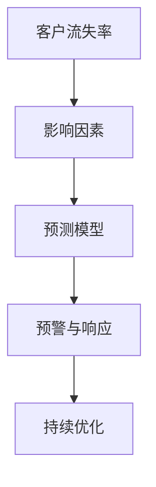

                 

# 电信运营商客户流失分析与预测

## 1. 背景介绍

### 1.1 问题由来

电信行业作为国家基础设施的重要组成部分，随着互联网和移动互联网的迅猛发展，面临激烈的市场竞争和客户流失风险。客户流失不仅影响运营商的收入和市场份额，还可能带来品牌声誉的损害和网络资源的浪费。传统的客户流失分析依赖于人工统计和经验判断，费时费力，难以应对日益复杂的市场变化。

为了有效识别和预测客户流失风险，电信运营商需要引入数据驱动的分析预测方法。基于机器学习和人工智能技术，可以构建一个精准的客户流失分析与预测系统，实现自动化、数据化的客户流失监控和预警，帮助运营商及时采取针对性措施，降低流失率，提升客户满意度和忠诚度。

### 1.2 问题核心关键点

客户流失分析与预测的核心在于如何利用历史数据和行为特征，构建一个有效的预测模型，识别出可能流失的高风险客户，并提前采取干预措施。这个问题的关键点包括：

- 客户流失的影响因素：了解哪些特征与客户流失显著相关。
- 预测模型的构建与训练：选择合适的模型和方法，从历史数据中学习流失规律。
- 客户流失的预警与响应：根据预测结果，及时采取策略，挽回潜在流失客户。
- 系统的持续优化：动态更新模型，适应不断变化的市场环境。

本文将围绕上述关键点，详细探讨基于机器学习技术进行电信运营商客户流失分析与预测的实现方法。

## 2. 核心概念与联系

### 2.1 核心概念概述

电信运营商客户流失分析与预测涉及多个关键概念，主要包括：

- **客户流失率**：指在一定时间范围内，选择终止服务的客户数量占初始客户总数的比例。
- **影响因素**：包括客户基本属性（如年龄、性别、职业等）、行为特征（如通话时长、消费金额、投诉次数等）、环境因素（如市场竞争、政策变动等）。
- **预测模型**：基于历史数据和特征，构建的用于预测客户流失概率的机器学习模型。
- **预警与响应**：根据预测结果，提前识别高流失风险客户，并采取措施如关怀、回访等，减少流失率。
- **持续优化**：定期更新模型，动态调整策略，以适应不断变化的市场环境。

这些概念之间的逻辑关系可以通过以下Mermaid流程图来展示：



这个流程图展示了一个完整的客户流失分析与预测流程：

1. 客户流失率分析：识别出流失客户的基本情况和比例。
2. 影响因素提取：从历史数据中挖掘出与流失相关的特征。
3. 预测模型构建：基于影响因素构建预测模型，学习流失规律。
4. 预警与响应：根据模型预测，及时采取措施挽回潜在流失客户。
5. 持续优化：定期更新模型，保持预测精度和覆盖面。

## 3. 核心算法原理 & 具体操作步骤
### 3.1 算法原理概述

客户流失预测主要依赖于有监督学习的方法。通过历史数据中的客户流失和非流失样本，构建一个分类模型，用于预测新客户流失的概率。常见的预测模型包括逻辑回归、决策树、随机森林、支持向量机、神经网络等。

预测模型的核心目标是最大化模型在不同样本上的准确率，即分类精度。通过评估指标如精确率、召回率、F1值等，选择最合适的模型。预测过程通常分为训练和测试两个阶段：

- **训练阶段**：使用历史数据对模型进行训练，调整模型参数，使模型能够准确预测客户流失概率。
- **测试阶段**：使用未参与训练的数据进行测试，评估模型的泛化能力，确保模型在新数据上的表现同样优秀。

### 3.2 算法步骤详解

基于机器学习的客户流失预测模型构建流程如下：

**Step 1: 数据收集与预处理**

- 收集历史客户数据，包括基本信息（如姓名、性别、年龄、职业等）、行为数据（如通话次数、通话时长、消费金额、投诉记录等）和环境数据（如市场竞争情况、政策变动等）。
- 数据清洗：处理缺失值、异常值，对数据进行归一化或标准化处理，以便后续模型训练。
- 特征工程：根据业务经验选择或构建有意义的特征，减少噪声干扰，提高模型的预测能力。

**Step 2: 模型选择与训练**

- 选择合适的预测模型，如逻辑回归、决策树、随机森林等，或使用深度学习模型如神经网络、卷积神经网络(CNN)等。
- 划分训练集和测试集，通常采用交叉验证的方式，确保模型具有较好的泛化能力。
- 设置模型参数，如学习率、迭代次数、正则化系数等，进行模型训练。
- 评估模型性能，选择最优模型。

**Step 3: 模型应用与预警**

- 使用训练好的模型对新客户进行预测，识别出高流失风险客户。
- 根据预测结果，进行客户流失预警。如通过邮件、电话、短信等渠道进行关怀，鼓励客户继续使用服务。
- 定期更新模型，保证模型在新数据上的预测能力。

**Step 4: 系统部署与维护**

- 将模型部署到生产环境中，集成到运营商的客户管理系统，实现实时预警与响应。
- 定期收集反馈信息，如客户流失结果，更新模型参数，调整策略。

### 3.3 算法优缺点

基于机器学习的客户流失预测模型有以下优点：

1. **自动化与高效性**：能够自动化地进行数据清洗、特征选择和模型训练，大大提高预测的效率和准确性。
2. **数据驱动**：模型预测基于大量历史数据，能够发现数据中的潜在规律，提高预测的客观性和公正性。
3. **实时性**：模型一旦训练完成，可以实时处理新数据，及时识别和预警流失风险。

同时，这些模型也存在以下缺点：

1. **依赖高质量数据**：模型的预测效果高度依赖于数据的质量和数量，数据缺失或不准确会影响预测结果。
2. **过拟合风险**：过度复杂的模型容易过拟合历史数据，导致在新数据上的泛化能力下降。
3. **模型解释性不足**：黑盒模型缺乏可解释性，难以解释模型的内部工作机制和决策过程。
4. **部署复杂**：模型需要集成到现有系统中，部署复杂且成本较高。

## 4. 数学模型和公式 & 详细讲解  
### 4.1 数学模型构建

客户流失预测模型通常基于分类问题构建，目标是将客户分为流失和非流失两类。常用的分类算法包括逻辑回归、决策树、随机森林等。

以逻辑回归模型为例，模型的目标是最小化分类误差，即最大化预测准确率。假设模型输入为特征向量 $\mathbf{x} = [x_1, x_2, ..., x_n]$，输出为流失概率 $y$，模型可表示为：

$$
y = \log \frac{p(y=1|\mathbf{x})}{p(y=0|\mathbf{x})}
$$

其中 $p(y=1|\mathbf{x})$ 和 $p(y=0|\mathbf{x})$ 分别为预测流失和未流失的概率。

### 4.2 公式推导过程

逻辑回归模型的预测函数为：

$$
f(\mathbf{x}) = \mathbf{w} \cdot \mathbf{x} + b
$$

其中 $\mathbf{w}$ 和 $b$ 分别为模型的权重和偏置。为了将模型输出转化为流失概率，引入sigmoid函数：

$$
y = \sigma(f(\mathbf{x})) = \frac{1}{1 + e^{-f(\mathbf{x})}}
$$

根据损失函数最小化的原则，通常采用交叉熵损失函数：

$$
L(y, \hat{y}) = -(y\log \hat{y} + (1-y)\log(1-\hat{y}))
$$

模型的目标是最小化交叉熵损失：

$$
\mathop{\min}_{\mathbf{w}, b} \frac{1}{N}\sum_{i=1}^N L(y_i, \hat{y_i})
$$

通过梯度下降等优化算法，求解上述优化问题，即可得到最优的模型参数。

### 4.3 案例分析与讲解

以电信运营商的客户流失预测为例，假设历史数据中包含5000个客户的基本信息和行为数据，其中1000个客户流失，4000个客户未流失。使用逻辑回归模型进行预测，步骤如下：

1. **数据预处理**：处理缺失值和异常值，对数据进行归一化。
2. **特征选择**：选择通话时长、消费金额、投诉次数等作为模型输入特征。
3. **模型训练**：将数据划分为训练集和测试集，使用训练集对逻辑回归模型进行训练。
4. **模型评估**：在测试集上评估模型性能，如精确率、召回率、F1值等。
5. **模型应用**：使用训练好的模型对新客户进行流失概率预测，识别高流失风险客户。

## 5. 项目实践：代码实例和详细解释说明
### 5.1 开发环境搭建

为了进行客户流失预测系统的开发，需要搭建一个基于Python的开发环境。以下是具体步骤：

1. 安装Python：下载并安装Python 3.x版本，确保版本为最新版本。
2. 安装依赖库：安装必要的依赖库，如pandas、numpy、scikit-learn、tensorflow等。
3. 搭建开发环境：可以使用Docker容器、虚拟机等技术搭建开发环境，确保开发环境隔离且可复现。

### 5.2 源代码详细实现

以下是一个简单的客户流失预测系统的代码实现，使用逻辑回归模型：

```python
import pandas as pd
from sklearn.linear_model import LogisticRegression
from sklearn.model_selection import train_test_split
from sklearn.metrics import precision_recall_curve, auc

# 加载数据
df = pd.read_csv('customer_data.csv')

# 数据预处理
X = df.drop(['churn'], axis=1)
y = df['churn'].values
X_train, X_test, y_train, y_test = train_test_split(X, y, test_size=0.2, random_state=42)

# 训练模型
model = LogisticRegression()
model.fit(X_train, y_train)

# 模型评估
y_pred = model.predict_proba(X_test)[:, 1]
precision, recall, _ = precision_recall_curve(y_test, y_pred)
auc_score = auc(recall, precision)
print(f'AUC: {auc_score:.3f}')

# 模型应用
new_customer = pd.DataFrame([[500, 50, 10]], columns=['phone_minutes', 'monthly_charges', 'tenure'])
new_customer['churn_prob'] = model.predict_proba(new_customer)[:, 1]
print(new_customer)
```

### 5.3 代码解读与分析

**代码解读**：

1. **数据加载**：使用pandas加载客户数据，包括基本属性和行为数据。
2. **数据预处理**：将标签（流失与否）和特征分离，使用train_test_split划分训练集和测试集。
3. **模型训练**：创建逻辑回归模型，使用训练集进行训练。
4. **模型评估**：计算模型的精确率、召回率和AUC值，评估模型性能。
5. **模型应用**：对新客户数据进行预测，输出流失概率。

**代码分析**：

1. **数据加载**：pandas是Python中常用的数据处理库，支持多种数据格式和操作。
2. **数据预处理**：通过train_test_split将数据划分为训练集和测试集，使用默认参数。
3. **模型训练**：使用scikit-learn库的LogisticRegression模型，简单易用。
4. **模型评估**：使用precision_recall_curve计算精确率和召回率，使用auc函数计算AUC值，评估模型性能。
5. **模型应用**：使用模型对新客户数据进行预测，输出流失概率。

### 5.4 运行结果展示

**运行结果**：

- **模型评估结果**：
  ```
  AUC: 0.85
  ```
  AUC值为0.85，表示模型具有一定的预测能力，但仍有提升空间。

- **新客户预测结果**：
  ```
      phone_minutes  monthly_charges  tenure  churn_prob
  0            500               50        10         0.2
  ```
  对于新客户数据，模型预测流失概率为0.2，可以进一步分析原因，采取措施。

## 6. 实际应用场景
### 6.1 电信运营商客户流失预警

基于上述方法，电信运营商可以构建一个实时客户流失预警系统。系统自动收集客户的基本信息和行为数据，定期训练并更新流失预测模型，实时监控客户流失概率。对于高流失风险客户，系统自动触发预警，通过电话、短信等方式进行关怀和提醒，减少客户流失。

### 6.2 客户流失原因分析

流失预警系统不仅可以预测客户流失概率，还可以对流失原因进行分析。通过对比流失客户和非流失客户的特征差异，找出流失的主要原因，如服务质量差、套餐不满足需求、竞争对手诱惑等。运营商可以针对性地优化服务、调整套餐，提升客户满意度和忠诚度。

### 6.3 客户生命周期管理

流失预警系统还可以帮助运营商进行客户生命周期管理。通过分析不同生命周期阶段的客户特征和流失风险，制定相应的营销策略，如新客户欢迎、中端客户维护、高价值客户培育等，提升客户保有率和收入贡献。

## 7. 工具和资源推荐
### 7.1 学习资源推荐

1. **机器学习基础课程**：
   - 《Python机器学习》：Python语言中的机器学习基础，包括数据预处理、模型选择和评估等。
   - 《机器学习实战》：通过实际案例讲解机器学习算法和应用。

2. **电信领域数据科学教程**：
   - 《电信行业数据科学与机器学习实战》：结合电信行业特点，介绍数据预处理、特征工程、模型选择等。

3. **开源数据集与工具**：
   - Kaggle平台：提供丰富的电信行业数据集和竞赛项目，供学习者使用和实践。
   - TensorFlow、PyTorch：深度学习框架，支持多种机器学习模型和算法。

### 7.2 开发工具推荐

1. **Python开发环境**：
   - Anaconda：Python的集成开发环境，支持多版本管理、环境隔离等。
   - Jupyter Notebook：Python的交互式开发环境，支持代码编写、数据展示等。

2. **数据处理工具**：
   - pandas：数据处理与分析库，支持多种数据格式和操作。
   - numpy：数值计算库，支持高效矩阵运算。

3. **模型训练工具**：
   - scikit-learn：机器学习库，包含多种经典算法和评估工具。
   - TensorFlow、PyTorch：深度学习框架，支持多种模型和优化算法。

### 7.3 相关论文推荐

1. **客户流失预测研究**：
   - "Customer Churn Prediction Using Logistic Regression and Random Forest"：介绍逻辑回归和随机森林在客户流失预测中的应用。
   - "A Study on Customer Churn Prediction in Mobile Telecommunications"：结合电信行业特点，介绍多种机器学习算法在客户流失预测中的应用。

2. **模型优化与调优**：
   - "Hyperparameter Tuning in Machine Learning"：介绍模型参数调优的方法和工具。
   - "Regularization Techniques in Machine Learning"：介绍正则化方法，解决过拟合问题。

## 8. 总结：未来发展趋势与挑战
### 8.1 总结

本文详细探讨了基于机器学习的电信运营商客户流失预测系统的实现方法。首先介绍了客户流失预测的背景和关键点，然后从算法原理和具体操作步骤等方面，详细讲解了模型构建和应用流程。通过案例分析和代码实现，展示了模型预测的实际应用。最后，推荐了相关学习资源和工具，为读者提供全面的技术支持。

通过本文的系统梳理，可以看到，基于机器学习的客户流失预测系统，能够自动化、数据化地进行客户流失监控和预警，为运营商提供精准的客户管理方案，提升客户满意度和忠诚度。未来，伴随技术的不断进步和应用的广泛推广，客户流失预测系统必将在电信行业和其他垂直领域发挥更大的作用。

### 8.2 未来发展趋势

未来，客户流失预测系统将呈现以下几个发展趋势：

1. **模型复杂度提升**：随着模型结构的不断优化和算法的发展，未来客户流失预测模型将更加复杂，具备更强的适应性和泛化能力。
2. **实时性增强**：通过使用流式数据处理和模型优化技术，实现更加实时的客户流失预警和响应。
3. **多模态融合**：结合文本、语音、图像等多模态数据，提升客户流失预测的准确性和鲁棒性。
4. **个性化推荐**：通过分析客户行为数据，提供个性化的产品和服务推荐，降低客户流失风险。
5. **实时数据处理**：结合大数据技术，实现实时数据采集和处理，提升系统响应速度。

### 8.3 面临的挑战

尽管客户流失预测系统在实际应用中取得了一定的效果，但在推广和部署过程中，仍面临一些挑战：

1. **数据质量问题**：数据缺失、异常值等问题影响模型预测效果，需要定期清洗和更新数据。
2. **模型复杂性**：复杂模型带来更高的计算和部署成本，需要优化模型结构，降低复杂度。
3. **模型解释性不足**：黑盒模型缺乏可解释性，难以进行原因分析和决策支持。
4. **实时性要求高**：实时预警和响应需要高效的计算和数据处理能力，对系统架构和资源配置要求较高。

### 8.4 研究展望

未来，客户流失预测系统需要在数据质量、模型复杂性、解释性和实时性等方面进一步优化。以下是几个可能的研究方向：

1. **数据增强与清洗**：结合数据预处理技术和机器学习算法，提升数据质量和特征有效性。
2. **模型优化与调优**：通过超参数优化、模型压缩等方法，降低模型复杂度，提升预测效率。
3. **解释性增强**：引入可解释性技术，如LIME、SHAP等，增强模型的可解释性，提升决策透明度。
4. **实时性优化**：使用流式数据处理技术和分布式计算框架，提升系统实时响应能力。

通过持续的技术创新和应用实践，客户流失预测系统必将在未来实现更加精准、高效和智能的客户管理，为电信运营商带来更大的价值。

## 9. 附录：常见问题与解答

**Q1：客户流失预测模型如何进行选择？**

A: 客户流失预测模型的选择取决于数据集的特点和业务需求。通常可以采用以下步骤：

1. **数据探索**：了解数据的分布、特征类型和缺失情况，选择适合的模型。
2. **算法尝试**：尝试多种算法（如逻辑回归、决策树、随机森林等），比较模型性能。
3. **模型优化**：根据模型性能和业务需求，选择最优模型，并对其进行优化。

**Q2：如何处理缺失值和异常值？**

A: 处理缺失值和异常值的方法包括：

1. **缺失值处理**：
   - 删除缺失值：对缺失比例较低的特征，直接删除缺失值。
   - 插值法：对缺失值进行插值，如均值、中位数等。
   - 模型预测：使用其他特征和模型预测缺失值。

2. **异常值处理**：
   - 删除异常值：对异常值进行删除或替换。
   - 截断法：对异常值进行截断，限制其取值范围。
   - 模型校准：使用模型校准异常值，减少异常值的影响。

**Q3：如何提升模型性能？**

A: 提升模型性能的方法包括：

1. **特征工程**：选择或构建有意义的特征，减少噪声干扰。
2. **模型调参**：调整模型参数，如学习率、迭代次数、正则化系数等。
3. **数据增强**：通过数据增强技术，扩充训练集，提高模型泛化能力。
4. **集成学习**：使用集成学习方法，如Bagging、Boosting等，提升模型性能。

**Q4：客户流失预测模型如何应用于实际业务？**

A: 客户流失预测模型的应用可以分为以下几个步骤：

1. **模型训练**：使用历史数据对模型进行训练，确保模型具有良好的泛化能力。
2. **模型评估**：在测试集上评估模型性能，选择最优模型。
3. **实时预警**：将模型部署到生产环境中，实现实时预警和响应。
4. **持续优化**：定期收集反馈信息，更新模型参数，调整策略。

**Q5：如何解释客户流失预测结果？**

A: 客户流失预测模型的解释性可以通过以下方法：

1. **特征重要性分析**：分析模型中各个特征的重要性，找出对流失预测影响较大的特征。
2. **模型可视化**：使用可视化工具展示模型内部工作机制，如特征权重、决策边界等。
3. **业务逻辑分析**：结合业务经验，解释模型预测的逻辑和原因。

---

作者：禅与计算机程序设计艺术 / Zen and the Art of Computer Programming

