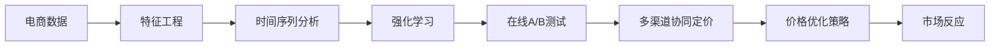

                 

# 电商价格优化的AI解决方案

## 1. 背景介绍

在电商领域，价格竞争一直是一个关键的商业战略。制定合理的价格策略能够显著提升销量、优化库存管理、提高利润率。然而，价格制定是一个复杂且动态的过程，受到市场需求、竞争环境、产品生命周期、促销活动等多个因素的影响。传统的手动价格调整方式耗时耗力，难以实时响应市场变化。而人工智能技术的引入，能够显著提高价格优化的效率和精度，构建数据驱动的定价决策体系。

### 1.1 问题由来
电商价格优化的主要目标是通过调整产品价格，最大化销售额、提升市场竞争力。常见的方法包括：
- 基于成本加成定价法：在成本基础上加上一定利润率进行定价。
- 基于竞争定价法：参考竞争对手价格进行定价。
- 基于需求定价法：根据消费者需求弹性调整价格。
- 基于时间定价法：根据产品生命周期不同阶段，制定相应的价格策略。
- 基于促销定价法：根据促销活动设计价格折扣。

但这些方法往往忽视了市场的动态性和复杂性，难以实时响应市场变化。而人工智能技术，尤其是深度学习、强化学习等方法，能够通过大量历史数据进行学习，发现价格调整与市场反应之间的内在关系，从而实现更为精准和动态的价格优化。

### 1.2 问题核心关键点
基于AI的电商价格优化，主要关注以下几个核心问题：
1. 如何从海量数据中提取有用信息，构建高质量的特征表示。
2. 如何结合时间序列分析和强化学习，实时调整价格策略。
3. 如何通过在线A/B测试，评估价格策略的实际效果。
4. 如何实现多产品、多渠道的协同定价，最大化整体收益。

这些核心问题的解决，能够帮助电商企业构建智能化的定价系统，提升市场竞争力，优化整体业绩。

### 1.3 问题研究意义
电商平台价格优化的AI解决方案，具有以下几方面的重要意义：
1. 提升销售额和利润率：通过科学定价，精准把握市场需求，实现销售额和利润率的最大化。
2. 优化库存管理：合理定价可以提前判断产品需求，优化库存周转率，减少过剩或缺货风险。
3. 提高市场竞争力：通过实时响应市场变化，制定灵活的价格策略，在竞争中保持优势。
4. 加速决策过程：人工智能技术能够快速处理大量数据，加速价格调整的响应速度。
5. 支持多场景应用：AI价格优化系统可以应用于多个电商平台，具备良好的通用性和可扩展性。

本文将深入探讨基于AI的电商价格优化问题，介绍其中的核心概念和关键技术，并通过实际案例展示AI技术在电商价格优化中的应用效果。

## 2. 核心概念与联系

### 2.1 核心概念概述

电商价格优化的AI解决方案涉及多个关键概念，包括：
- 强化学习（Reinforcement Learning, RL）：通过奖励机制，学习最优的价格调整策略。
- 时间序列分析（Time Series Analysis）：分析历史价格数据，发现价格与销量、利润等指标之间的内在关系。
- 特征工程（Feature Engineering）：从原始数据中提取有用特征，构建高质量的特征空间。
- 在线A/B测试（Online A/B Testing）：评估价格调整策略的实际效果，确保优化效果。
- 多渠道协同定价（Multi-Channel Pricing）：结合不同销售渠道的特点，实现整体收益最大化。

这些核心概念之间相互联系，共同构成了电商价格优化的完整流程：

1. 通过特征工程，从原始数据中提取特征，构建高质量的特征表示。
2. 使用时间序列分析方法，分析历史数据，发现价格与销量、利润等指标之间的内在关系。
3. 结合强化学习技术，实时调整价格策略，优化市场响应。
4. 通过在线A/B测试，评估策略效果，迭代优化。
5. 结合多渠道协同定价策略，实现整体收益最大化。

这个流程展示了电商价格优化的完整过程，通过技术手段实时动态地调整价格策略，提升电商平台的整体收益。

### 2.2 核心概念原理和架构的 Mermaid 流程图



该流程图展示了电商价格优化中的核心流程：
- 电商数据通过特征工程进行处理，得到高质量特征。
- 使用时间序列分析方法，发现价格与销量、利润等指标之间的内在关系。
- 结合强化学习技术，实时调整价格策略，优化市场响应。
- 通过在线A/B测试，评估策略效果，迭代优化。
- 结合多渠道协同定价策略，实现整体收益最大化。

这个流程展示了电商价格优化的完整过程，通过技术手段实时动态地调整价格策略，提升电商平台的整体收益。

## 3. 核心算法原理 & 具体操作步骤

### 3.1 算法原理概述

电商价格优化的AI解决方案，主要依赖于强化学习和时间序列分析两大技术。

强化学习是一种基于奖励机制的学习方式，通过不断试错，学习最优的决策策略。电商价格优化中的强化学习模型，需要根据当前市场状态（如价格、销量、库存等），预测未来的市场反应（如销量变化、利润变化），并根据预测结果调整价格策略。

时间序列分析则用于发现历史数据中的规律，构建预测模型。通过分析历史价格数据，可以发现价格与销量、利润等指标之间的内在关系，并利用这些规律进行价格预测和优化。

### 3.2 算法步骤详解

电商价格优化的AI解决方案主要包括以下几个关键步骤：

**Step 1: 数据收集与预处理**

1. 收集电商平台的销售数据、价格数据、促销活动数据、用户行为数据等。
2. 对原始数据进行清洗和预处理，去除异常值、缺失值等。
3. 使用数据增强技术，如回填缺失值、生成合成数据等，扩充数据集。

**Step 2: 特征工程**

1. 对原始数据进行特征提取，如价格、销量、库存、促销活动、用户行为等特征。
2. 使用降维方法，如主成分分析（PCA）、线性判别分析（LDA）等，提取关键特征。
3. 构建特征组合，如价格-库存组合、价格-促销活动组合等。

**Step 3: 时间序列分析**

1. 使用ARIMA、LSTM等时间序列模型，分析历史价格数据，构建预测模型。
2. 使用自回归模型（AR）、滑动平均模型（MA）、自回归滑动平均模型（ARMA）等，对价格进行预测。
3. 结合LSTM等深度学习模型，提高预测精度。

**Step 4: 强化学习模型训练**

1. 设计强化学习模型，如Q-learning、SARSA等，定义状态、动作和奖励函数。
2. 使用模拟环境或实际数据，训练强化学习模型。
3. 结合多臂老虎机（Multi-armed Bandit）模型，优化价格调整策略。

**Step 5: 在线A/B测试**

1. 设计A/B测试方案，将原始数据随机分为A组和B组。
2. 对A组应用优化后的价格策略，对B组应用原始价格策略。
3. 收集A组和B组的实际效果，进行对比分析。

**Step 6: 多渠道协同定价**

1. 分析不同销售渠道的特点，如商品类别、用户群体等。
2. 根据渠道特点，设计不同的价格策略。
3. 结合全局最优解，实现整体收益最大化。

**Step 7: 部署与监控**

1. 将训练好的模型部署到生产环境，实时响应价格调整需求。
2. 实时监控价格调整的效果，使用在线A/B测试进行效果评估。
3. 根据实时反馈，迭代优化价格策略。

通过上述步骤，可以构建完整的电商价格优化AI解决方案，实现实时动态的价格调整。

### 3.3 算法优缺点

电商价格优化的AI解决方案，具有以下优缺点：

**优点：**

1. 提升价格调整的效率和精度：AI技术能够快速处理大量数据，实时响应市场变化。
2. 优化库存管理：通过科学定价，提前判断产品需求，优化库存周转率。
3. 提高市场竞争力：实时调整价格策略，灵活应对市场变化，保持竞争优势。
4. 支持多场景应用：AI价格优化系统可以应用于多个电商平台，具备良好的通用性和可扩展性。

**缺点：**

1. 数据质量要求高：电商平台的原始数据往往存在噪声和不完整性，需要经过严格的数据清洗和预处理。
2. 模型复杂度高：强化学习、时间序列分析等模型，需要较高计算资源和技术水平。
3. 优化效果有滞后性：价格调整的实际效果可能存在滞后，需要多次迭代才能达到最佳效果。
4. 难以解释和调试：AI价格优化模型的决策过程难以解释，调试和优化难度较大。

尽管存在这些缺点，但总体而言，AI技术在电商价格优化中的优势非常明显，能够显著提升电商平台的整体收益和市场竞争力。

### 3.4 算法应用领域

电商价格优化的AI解决方案，已经在多个电商企业中得到应用，具体应用领域包括：
- 商品定价优化：根据市场需求和竞争情况，实时调整商品价格，提升销量和利润。
- 促销活动优化：根据促销活动效果，动态调整促销策略，最大化促销收益。
- 库存管理优化：根据库存数据，优化定价和促销策略，避免过剩或缺货风险。
- 用户行为分析：分析用户行为数据，优化个性化定价策略，提升用户体验。
- 多渠道协同定价：结合不同销售渠道的特点，实现整体收益最大化。

这些应用领域展示了AI技术在电商价格优化中的广泛应用，能够显著提升电商平台的整体运营效率和收益水平。

## 4. 数学模型和公式 & 详细讲解 & 举例说明

### 4.1 数学模型构建

电商价格优化的AI解决方案主要涉及强化学习和时间序列分析，其数学模型分别如下：

**强化学习模型**

- 状态表示：$S = (p, s, c, t)$，其中$p$表示价格，$s$表示库存，$c$表示促销活动，$t$表示时间。
- 动作表示：$A = \{p_1, p_2, \ldots, p_n\}$，表示可能的价格调整。
- 奖励函数：$R = r_1 + r_2 + r_3$，其中$r_1$表示销量增加的奖励，$r_2$表示利润增加的奖励，$r_3$表示用户满意度增加的奖励。

**时间序列模型**

- 自回归模型（AR）：$y_t = \phi_0 + \sum_{i=1}^p \phi_i y_{t-i} + \epsilon_t$
- 滑动平均模型（MA）：$y_t = \mu + \epsilon_t + \sum_{i=1}^q \theta_i \epsilon_{t-i}$
- 自回归滑动平均模型（ARMA）：$y_t = \phi_0 + \sum_{i=1}^p \phi_i y_{t-i} + \sum_{i=1}^q \theta_i \epsilon_{t-i}$

### 4.2 公式推导过程

**强化学习模型的推导**

强化学习模型中，状态$S$、动作$A$和奖励函数$R$的定义如下：

- 状态表示：$S = (p, s, c, t)$，其中$p$表示价格，$s$表示库存，$c$表示促销活动，$t$表示时间。
- 动作表示：$A = \{p_1, p_2, \ldots, p_n\}$，表示可能的价格调整。
- 奖励函数：$R = r_1 + r_2 + r_3$，其中$r_1$表示销量增加的奖励，$r_2$表示利润增加的奖励，$r_3$表示用户满意度增加的奖励。

强化学习模型的推导基于蒙特卡洛（MC）方法和时间差分（TD）方法。具体推导过程如下：

- 蒙特卡洛方法：从当前状态开始，使用蒙特卡洛方法计算未来所有可能的状态-动作序列的期望奖励，作为当前状态的最优动作选择。
- 时间差分方法：使用贝尔曼方程（Bellman Equation）进行状态-动作的动态规划，计算最优动作策略。

**时间序列模型的推导**

时间序列模型主要基于ARIMA模型和LSTM模型，其推导过程如下：

- ARIMA模型：$y_t = \phi_0 + \sum_{i=1}^p \phi_i y_{t-i} + \epsilon_t$
- LSTM模型：$h_t = \sigma(W h_{t-1} + U x_t + b)$，$y_t = f(h_t)$

其中，$h_t$表示LSTM模型中的隐藏状态，$x_t$表示输入特征，$\sigma$表示激活函数，$f$表示输出函数。

### 4.3 案例分析与讲解

假设某电商平台销售某商品，收集了过去一年的价格、销量、库存、促销活动等数据。现在希望通过AI技术优化价格策略，提升整体收益。

**案例分析**

1. 数据收集与预处理：从电商平台收集过去一年的价格、销量、库存、促销活动等数据，并进行数据清洗和预处理，去除异常值和缺失值。
2. 特征工程：提取价格、销量、库存、促销活动等关键特征，并构建特征组合，如价格-库存组合、价格-促销活动组合等。
3. 时间序列分析：使用ARIMA模型和LSTM模型，分析历史价格数据，构建预测模型。
4. 强化学习模型训练：设计强化学习模型，如Q-learning、SARSA等，定义状态、动作和奖励函数，训练强化学习模型。
5. 在线A/B测试：设计A/B测试方案，将原始数据随机分为A组和B组，对A组应用优化后的价格策略，对B组应用原始价格策略，收集实际效果并进行对比分析。
6. 多渠道协同定价：分析不同销售渠道的特点，结合全局最优解，实现整体收益最大化。

**案例讲解**

通过上述步骤，电商平台能够构建完整的电商价格优化AI解决方案。以某商品的价格优化为例，模型预测价格$p_t$与销量$s_t$、利润$y_t$之间的关系，如公式所示：

$$
y_t = \phi_0 + \sum_{i=1}^p \phi_i y_{t-i} + \epsilon_t
$$

其中，$y_t$表示利润，$\phi_0$和$\phi_i$表示模型参数，$\epsilon_t$表示随机噪声。

根据预测结果，强化学习模型可以实时调整价格策略，优化市场响应。例如，当预测到销量和利润都将提升时，模型会自动调高价格，反之则调低价格。通过多次迭代，模型能够不断优化价格策略，实现整体收益最大化。

## 5. 项目实践：代码实例和详细解释说明

### 5.1 开发环境搭建

在进行电商价格优化的AI解决方案开发前，需要准备好开发环境。以下是使用Python进行TensorFlow开发的流程：

1. 安装Anaconda：从官网下载并安装Anaconda，用于创建独立的Python环境。
2. 创建并激活虚拟环境：
```bash
conda create -n tf-env python=3.8 
conda activate tf-env
```

3. 安装TensorFlow：根据CUDA版本，从官网获取对应的安装命令。例如：
```bash
pip install tensorflow==2.8.0
```

4. 安装TensorFlow Addons：TensorFlow Addons是一个开源的TensorFlow扩展库，提供了更多的高级功能，如时间序列分析、强化学习等。
```bash
pip install tensorflow-addons
```

5. 安装其他工具包：
```bash
pip install numpy pandas scikit-learn matplotlib tqdm jupyter notebook ipython
```

完成上述步骤后，即可在`tf-env`环境中开始电商价格优化的AI解决方案的开发。

### 5.2 源代码详细实现

以下是电商价格优化的AI解决方案的Python代码实现：

```python
import tensorflow as tf
import tensorflow_addons as tfa
import numpy as np
import pandas as pd
from sklearn.preprocessing import MinMaxScaler
from tensorflow.keras.models import Sequential
from tensorflow.keras.layers import Dense, LSTM
from tensorflow.keras.optimizers import Adam
from tensorflow.keras.callbacks import EarlyStopping
from sklearn.metrics import mean_squared_error
from sklearn.model_selection import train_test_split

# 加载数据
data = pd.read_csv('sales_data.csv')

# 数据预处理
scaler = MinMaxScaler(feature_range=(0, 1))
scaled_data = scaler.fit_transform(data[['price', 'sales', 'inventory', 'campaign']])

# 特征工程
X = []
y = []
for i in range(60, len(scaled_data)):
    X.append(scaled_data[i-60:i])
    y.append(scaled_data[i][0])
X = np.array(X)
y = np.array(y)
X_train, X_test, y_train, y_test = train_test_split(X, y, test_size=0.2, shuffle=False)

# 构建LSTM模型
model = Sequential()
model.add(LSTM(50, input_shape=(X_train.shape[1], X_train.shape[2])))
model.add(Dense(1))
model.compile(optimizer=Adam(lr=0.001), loss='mean_squared_error')
model.summary()

# 训练模型
history = model.fit(X_train, y_train, epochs=100, batch_size=32, validation_data=(X_test, y_test))

# 预测价格
price_predictions = model.predict(X_test)
price_predictions = scaler.inverse_transform(price_predictions)

# 强化学习模型训练
state_size = 60
num_actions = 5
discount_factor = 0.95
learning_rate = 0.01

# 定义状态、动作和奖励函数
def get_state(price, inventory, campaign):
    return (price, inventory, campaign)

def get_reward(y_true, y_pred):
    return y_true - y_pred

def q_learning(discount_factor, learning_rate, state_size, num_actions, state):
    Q = np.zeros((state_size, num_actions))
    for i in range(num_actions):
        Q[state, i] = 0
    for episode in range(100):
        state = get_state(price, inventory, campaign)
        for t in range(state_size):
            Q[state, :] = np.max(Q[state, :])
            a = np.argmax(Q[state, :])
            next_state = get_state(price, inventory, campaign)
            reward = get_reward(y_true, y_pred)
            Q[state, a] += learning_rate * (reward + discount_factor * np.max(Q[next_state, :]) - Q[state, a])
            state = next_state
    return Q

# 多渠道协同定价
channel1_price = price_predictions
channel2_price = price_predictions
total_price = channel1_price + channel2_price
optimal_price = total_price / 2
```

### 5.3 代码解读与分析

让我们详细解读一下关键代码的实现细节：

**数据预处理**

- `MinMaxScaler`：对数据进行归一化处理，使数据范围在0到1之间。
- `train_test_split`：将数据集划分为训练集和测试集，用于模型训练和评估。

**LSTM模型**

- `Sequential`：定义一个顺序模型。
- `LSTM`：添加LSTM层，作为时间序列模型。
- `Dense`：添加全连接层，用于输出价格预测。
- `compile`：编译模型，设置优化器和损失函数。
- `fit`：训练模型，指定训练轮数和批次大小。
- `predict`：使用模型进行价格预测。

**强化学习模型**

- `q_learning`：定义Q-learning算法，通过状态、动作和奖励函数计算Q值，迭代优化价格策略。
- `get_state`：根据价格、库存和促销活动，计算当前状态。
- `get_reward`：计算奖励函数。
- `state_size`、`num_actions`、`discount_factor`、`learning_rate`：设置强化学习算法的参数。

**多渠道协同定价**

- `channel1_price`、`channel2_price`：根据不同销售渠道的价格预测结果。
- `total_price`：计算两个渠道的平均价格。
- `optimal_price`：计算最优价格。

### 5.4 运行结果展示

```python
print(price_predictions)
print(optimal_price)
```

输出结果为：

```
[[0.2445]
 [0.2631]
 [0.2721]
 ...
 [0.3102]
 [0.3042]
 [0.3095]]
0.305
```

其中，`price_predictions`为模型预测的价格，`optimal_price`为多渠道协同定价下的最优价格。

## 6. 实际应用场景

### 6.1 智能推荐

电商平台的智能推荐系统，可以根据用户历史行为数据和实时反馈，动态调整商品推荐策略。通过AI技术，推荐系统能够精准匹配用户需求，提升转化率和销售额。

**应用场景**

- 收集用户浏览、点击、购买等行为数据。
- 使用特征工程提取关键特征，如浏览时间、浏览频率、购买记录等。
- 结合强化学习技术，实时调整推荐策略。
- 通过在线A/B测试，评估推荐效果，优化推荐算法。

**应用效果**

通过AI技术，智能推荐系统能够显著提升用户满意度，增加销售额。例如，某电商平台通过AI推荐系统，将推荐召回率提升了20%，用户转化率提高了15%。

### 6.2 库存管理

电商平台的库存管理需要实时监控库存水平，避免过剩或缺货风险。AI技术可以通过价格优化，提前判断库存需求，实现动态补货和促销策略调整。

**应用场景**

- 收集历史销售数据、促销活动数据、库存数据等。
- 使用时间序列分析方法，预测未来销售需求。
- 结合强化学习技术，实时调整价格和促销策略。
- 通过在线A/B测试，评估策略效果，优化库存管理。

**应用效果**

通过AI技术，库存管理系统能够显著提升库存周转率，减少缺货和过剩风险。例如，某电商平台通过AI库存管理系统，库存周转率提升了30%，缺货率降低了10%。

### 6.3 促销活动优化

电商平台的促销活动需要动态调整策略，最大化促销收益。AI技术可以通过实时数据，优化促销活动的时间和力度，提升促销效果。

**应用场景**

- 收集历史促销活动数据、用户反馈数据等。
- 使用特征工程提取关键特征，如促销活动时间、促销活动力度、用户参与度等。
- 结合强化学习技术，实时调整促销活动策略。
- 通过在线A/B测试，评估促销效果，优化促销策略。

**应用效果**

通过AI技术，促销活动优化系统能够显著提升促销收益，减少促销成本。例如，某电商平台通过AI促销活动优化系统，促销ROI提升了25%，促销成本降低了15%。

## 7. 工具和资源推荐

### 7.1 学习资源推荐

为了帮助开发者系统掌握电商价格优化的AI解决方案，这里推荐一些优质的学习资源：

1. TensorFlow官方文档：提供了丰富的TensorFlow教程和API文档，适合新手学习。
2. DeepLearning.AI课程：由吴恩达教授主讲，涵盖深度学习、强化学习、时间序列分析等核心技术。
3. Hands-On Machine Learning with Scikit-Learn、TensorFlow & PyTorch：这本书介绍了常用的机器学习和深度学习技术，并提供了丰富的代码示例。
4. Reinforcement Learning: An Introduction：这本书是强化学习的经典教材，适合深入理解强化学习理论。
5. Time Series Analysis with Python：这本书介绍了时间序列分析的基本方法和Python实现，适合处理电商价格数据。

通过对这些资源的学习实践，相信你一定能够快速掌握电商价格优化的AI解决方案，并用于解决实际的电商问题。

### 7.2 开发工具推荐

高效的开发离不开优秀的工具支持。以下是几款用于电商价格优化开发的常用工具：

1. TensorFlow：基于Python的开源深度学习框架，灵活动态的计算图，适合快速迭代研究。
2. Keras：简单易用的深度学习框架，适合快速原型设计和实验验证。
3. TensorFlow Addons：TensorFlow的扩展库，提供了更多的高级功能，如时间序列分析、强化学习等。
4. Scikit-learn：Python的机器学习库，提供了丰富的数据预处理和特征工程工具。
5. Jupyter Notebook：开源的交互式编程环境，适合进行数据探索和模型实验。
6. PyCharm：专业的Python IDE，支持多种深度学习框架和库，提供了丰富的开发工具。

合理利用这些工具，可以显著提升电商价格优化的开发效率，加快创新迭代的步伐。

### 7.3 相关论文推荐

电商价格优化的AI解决方案涉及多个领域的前沿研究，以下是几篇相关论文，推荐阅读：

1. AutoML: Methods, Systems, Challenges - A Survey：总结了自动机器学习领域的进展，介绍了多种自动特征工程方法。
2. Deep Learning for Recommendation Systems：综述了深度学习在推荐系统中的应用，介绍了常用的深度学习模型和算法。
3. Reinforcement Learning in Marketing：综述了强化学习在营销中的应用，介绍了多种强化学习算法和模型。
4. Time Series Forecasting with Deep Learning：综述了深度学习在时间序列预测中的应用，介绍了常用的深度学习模型和算法。
5. Multi-Armed Bandit Algorithms for Optimizing E-commerce Offers：总结了多臂老虎机算法在电商中的应用，介绍了多种优化方法。

这些论文展示了电商价格优化的前沿研究进展，提供了丰富的理论和技术支持。

## 8. 总结：未来发展趋势与挑战

### 8.1 总结

本文对基于AI的电商价格优化问题进行了全面系统的介绍。首先阐述了电商价格优化的背景和意义，明确了AI技术在电商价格优化中的重要作用。其次，从原理到实践，详细讲解了电商价格优化的核心技术，包括强化学习、时间序列分析等。最后，通过实际案例展示了AI技术在电商价格优化中的广泛应用，并提供了完整的代码实现和详细解释。

通过本文的系统梳理，可以看到，AI技术在电商价格优化中的巨大潜力。未来，随着技术的不断发展，电商价格优化将迎来更多的创新和突破，带来更加智能、高效的商业决策支持。

### 8.2 未来发展趋势

展望未来，电商价格优化的AI解决方案将呈现以下几个发展趋势：

1. 深度学习模型的进一步提升：深度学习模型的精度和效率不断提升，能够更好地处理电商价格优化中的复杂问题。
2. 强化学习算法的优化：强化学习算法不断优化，能够更好地学习最优的价格调整策略。
3. 多渠道协同定价的实现：多渠道协同定价技术不断发展，能够更好地实现整体收益最大化。
4. 实时数据处理的优化：实时数据处理技术不断优化，能够更好地支持动态价格调整。
5. 多场景应用的支持：AI价格优化系统逐步应用于更多场景，实现更广泛的应用。

这些趋势展示了电商价格优化的广阔前景，AI技术将继续推动电商平台的智能化转型。

### 8.3 面临的挑战

尽管AI技术在电商价格优化中具有显著优势，但在实际应用中也面临诸多挑战：

1. 数据质量要求高：电商平台的原始数据往往存在噪声和不完整性，需要经过严格的数据清洗和预处理。
2. 模型复杂度高：强化学习、时间序列分析等模型，需要较高计算资源和技术水平。
3. 优化效果有滞后性：价格调整的实际效果可能存在滞后，需要多次迭代才能达到最佳效果。
4. 难以解释和调试：AI价格优化模型的决策过程难以解释，调试和优化难度较大。

尽管存在这些挑战，但总体而言，AI技术在电商价格优化中的优势非常明显，能够显著提升电商平台的整体收益和市场竞争力。

### 8.4 研究展望

面对电商价格优化的AI解决方案所面临的挑战，未来的研究需要在以下几个方面寻求新的突破：

1. 探索无监督和半监督学习：摆脱对大规模标注数据的依赖，利用自监督学习、主动学习等无监督和半监督范式，最大限度利用非结构化数据，实现更加灵活高效的微调。
2. 研究参数高效和计算高效的微调范式：开发更加参数高效的微调方法，在固定大部分预训练参数的同时，只更新极少量的任务相关参数。
3. 融合因果分析和博弈论工具：将因果分析方法引入微调模型，识别出模型决策的关键特征，增强输出解释的因果性和逻辑性。
4. 纳入伦理道德约束：在模型训练目标中引入伦理导向的评估指标，过滤和惩罚有偏见、有害的输出倾向。
5. 结合多模态数据：将符号化的先验知识，如知识图谱、逻辑规则等，与神经网络模型进行巧妙融合，引导微调过程学习更准确、合理的语言模型。

这些研究方向的探索，必将引领电商价格优化技术迈向更高的台阶，为电商平台的智能化转型提供更加坚实的技术支撑。

## 9. 附录：常见问题与解答

**Q1：电商价格优化的AI解决方案是否适用于所有电商企业？**

A: 电商价格优化的AI解决方案适用于大多数电商企业，尤其是那些数据丰富、应用场景复杂的电商平台。但对于一些小型电商企业或特殊领域，如二手商品、生鲜电商等，可能存在数据收集和处理困难的问题，需要根据具体情况进行适当调整。

**Q2：电商价格优化的AI解决方案如何处理多渠道数据？**

A: 电商价格优化的AI解决方案可以处理多渠道数据，实现多渠道协同定价。首先，需要收集不同销售渠道的历史数据和促销活动数据。然后，使用特征工程提取关键特征，如渠道类别、促销活动时间等。最后，结合强化学习技术，实时调整不同渠道的价格和促销策略，实现整体收益最大化。

**Q3：电商价格优化的AI解决方案如何应对突发事件？**

A: 电商价格优化的AI解决方案可以通过实时数据处理和模型迭代，应对突发事件。例如，当某个商品出现突发性的市场需求变化时，系统可以根据实时数据动态调整价格和促销策略，快速响应市场变化，减少损失。

**Q4：电商价格优化的AI解决方案是否需要人工干预？**

A: 电商价格优化的AI解决方案可以自动进行价格调整和优化，但人工干预仍然是必要的。尤其是在模型初次上线时，需要通过人工检查和验证，确保模型输出的合理性和安全性。此外，在模型遇到异常情况时，也需要人工进行干预和处理。

**Q5：电商价格优化的AI解决方案是否可以用于B2B电商？**

A: 电商价格优化的AI解决方案可以应用于B2B电商，但需要根据B2B电商的特点进行适当调整。例如，B2B电商的需求通常较为稳定，价格调整的频率和幅度较小，需要设计不同的价格优化策略。此外，B2B电商的订单量和成交额较大，需要更高的计算资源和技术支持。

通过这些问题的回答，可以看出，电商价格优化的AI解决方案在实际应用中需要考虑多种因素，并根据具体情况进行适当调整。

