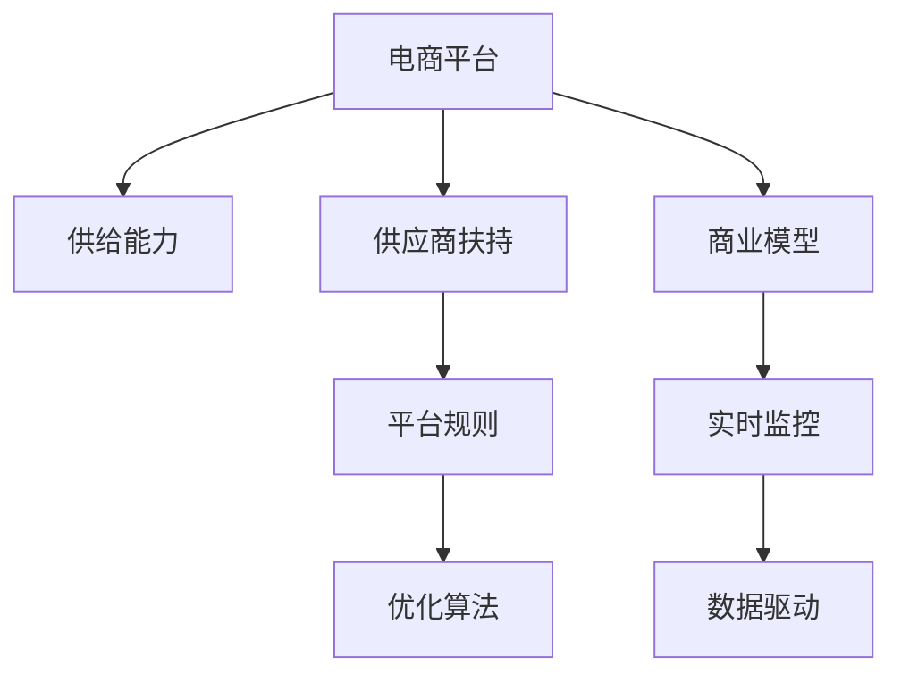

                 

# 电商平台供给能力提升：供应商扶持和平台规则

> 关键词：电商平台,供给能力,供应商扶持,平台规则,优化算法,商业模型

## 1. 背景介绍

在当前全球化、数字化的大趋势下，电商平台已成为推动消费增长和提升供应链效率的关键力量。然而，电商平台的供给能力直接影响到消费者的购物体验和平台的盈利能力，如何提升电商平台供给能力，成为其持续发展的关键问题。

### 1.1 问题由来
电商平台面对的供给问题主要体现在：

- **供需不匹配**：平台上的商品种类繁多，但优质供应商数量有限，导致供需不平衡。
- **库存管理**：商品库存管理不当，导致库存积压或缺货，影响用户体验。
- **物流问题**：配送速度慢、配送错误率高，导致用户满意度下降。
- **供应商管理**：供应商资质参差不齐，部分供应商服务质量不高，影响平台声誉。

面对这些问题，电商平台需要一套全面的解决方案，既包括对供应商的扶持和激励，也包括对平台规则的优化和改进。

### 1.2 问题核心关键点
电商平台供给能力提升的核心关键点包括：

- **供应商扶持**：如何吸引优质供应商入驻，提升其产品质量和供应能力。
- **平台规则优化**：如何通过合理的平台规则，引导供应商提供优质的产品和服务。
- **优化算法设计**：如何设计高效的算法，实时监控和优化平台供给能力。
- **商业模型调整**：如何调整商业模式，平衡平台、供应商和消费者的利益。

这些关键点共同构成了电商平台供给能力提升的系统解决方案，需要在实践中不断优化和调整。

## 2. 核心概念与联系

### 2.1 核心概念概述

为更好地理解电商平台供给能力提升的方法，本节将介绍几个关键概念：

- **电商平台**：提供在线交易平台的商家。其核心功能包括商品展示、购物车、订单处理、物流服务等。
- **供给能力**：指平台上的商品种类、数量、库存和配送能力。
- **供应商扶持**：指平台通过政策、激励等手段，扶持优质供应商入驻和发展。
- **平台规则**：指平台为规范商家行为、保障消费者权益而制定的规则体系。
- **优化算法**：指平台用于监控和优化供给能力的算法和模型。
- **商业模型**：指平台通过不同业务模式实现盈利的方式，如佣金、广告费、增值服务等。

这些核心概念之间的逻辑关系可以通过以下Mermaid流程图来展示：



这个流程图展示了电商平台供给能力提升的关键流程和要素：

1. 电商平台通过实时监控和数据驱动，提升供给能力。
2. 供应商扶持和平台规则通过优化算法设计，引导优质供应商入驻和发展。
3. 商业模型通过合理设置，平衡平台、供应商和消费者利益。

## 3. 核心算法原理 & 具体操作步骤

### 3.1 算法原理概述

电商平台供给能力提升的核心算法原理主要包括供应商扶持和平台规则优化两大部分。供应商扶持通过政策、激励等手段吸引优质供应商入驻，平台规则优化通过规则体系规范商家行为，保障消费者权益。

### 3.2 算法步骤详解

#### 3.2.1 供应商扶持

**Step 1: 供应商评估**
- 平台通过多维度指标（如商品质量、价格竞争力、市场口碑等）对供应商进行评估，筛选出优质供应商。

**Step 2: 扶持政策设计**
- 设计针对性的扶持政策，如资金补贴、技术支持、营销资源等，激励优质供应商入驻和发展。

**Step 3: 激励机制设计**
- 设计激励机制，如销量奖励、排名奖励等，鼓励供应商提供优质商品。

**Step 4: 供应商培训**
- 定期对供应商进行培训，提升其商品质量和物流配送能力。

**Step 5: 动态调整**
- 根据供应商表现动态调整扶持政策，确保公平竞争。

#### 3.2.2 平台规则优化

**Step 1: 规则设计**
- 平台根据不同产品类型，制定相应的规则体系，如商品质量标准、价格政策、物流配送规范等。

**Step 2: 规则执行**
- 平台通过技术手段严格执行规则，确保商家行为规范。

**Step 3: 规则优化**
- 根据商家和消费者反馈，定期优化规则，提高用户体验。

### 3.3 算法优缺点

**供应商扶持的优点：**
- 吸引优质供应商入驻，提升商品质量和供应能力。
- 提高平台商品的丰富度和多样性，满足消费者多样化需求。
- 通过激励机制，促进供应商提升服务水平，提高配送效率。

**供应商扶持的缺点：**
- 扶持政策的设计和执行成本较高，需要投入大量资源。
- 优质供应商资源有限，难以全面覆盖所有产品。
- 部分供应商可能存在短期行为，如骗取补贴等。

**平台规则优化的优点：**
- 规范商家行为，保障消费者权益。
- 通过严格执行规则，提升平台整体服务水平。
- 定期优化规则，适应市场变化，提高用户满意度。

**平台规则优化的缺点：**
- 规则制定和执行复杂，需要大量技术支持和人力资源。
- 规则过于严格可能导致商家抵触，影响入驻积极性。
- 规则优化需要大量消费者反馈数据，成本较高。

### 3.4 算法应用领域

基于供应商扶持和平台规则优化的算法，在电商平台供给能力提升中已得到广泛应用，具体包括：

- **商品丰富度提升**：通过吸引优质供应商入驻，平台商品种类和数量大幅增加，满足了更多消费者的需求。
- **商品质量提升**：优质供应商的引入和激励机制的建立，提升了商品的整体质量。
- **物流效率提升**：供应商物流配送能力的提升和平台物流政策的优化，配送速度和准确率显著提高。
- **消费者满意度提升**：规范的供应商行为和平台规则的严格执行，提高了用户购物体验，提升了满意度。
- **平台盈利能力提升**：通过优化商业模型和规则体系，平台实现了更高效的商品销售和收入增长。

## 4. 数学模型和公式 & 详细讲解 & 举例说明

### 4.1 数学模型构建

电商平台供给能力提升的核心数学模型主要涉及以下几个方面：

- **供应商选择模型**：用于评估和筛选优质供应商。
- **需求预测模型**：用于预测消费者需求，优化库存管理。
- **配送路径优化模型**：用于设计高效配送路线，提高配送效率。

### 4.2 公式推导过程

#### 4.2.1 供应商选择模型

假设平台有 $n$ 个供应商，每个供应商的商品质量 $q_i$ 和价格 $p_i$ 已知，平台根据评估指标 $w_i$ 对每个供应商进行打分，得分高的供应商更优质。

则供应商选择模型的目标函数为：

$$
\max_{i=1,...,n} \sum_{j=1}^m w_{ij}q_{ij} - \sum_{j=1}^m p_{ij}
$$

其中，$w_{ij}$ 为第 $i$ 个供应商第 $j$ 个指标的权重，$m$ 为指标数量。

#### 4.2.2 需求预测模型

假设平台上有 $k$ 个商品，每个商品的日需求量为 $d_{ik}$，平台通过历史数据建立需求预测模型 $f(x)$，用于预测未来需求。

则需求预测模型的目标函数为：

$$
\min_{f} \sum_{i=1}^k \sum_{t=1}^T (d_{it} - f(x_t))^2
$$

其中，$d_{it}$ 为第 $i$ 个商品第 $t$ 天的需求量，$x_t$ 为第 $t$ 天的特征向量，$f(x)$ 为需求预测模型。

#### 4.2.3 配送路径优化模型

假设平台有 $m$ 个配送点，配送费用为 $c_{ij}$，配送时间为 $t_{ij}$，需要设计一条从起始点到配送点的最优路径，使得配送总费用最低。

则配送路径优化模型的目标函数为：

$$
\min_{G} \sum_{(i,j) \in E} c_{ij} + \sum_{(i,j) \in E} t_{ij}
$$

其中，$G$ 为配送路径图，$E$ 为图中的边。

### 4.3 案例分析与讲解

#### 4.3.1 供应商选择模型

**案例**：某电商平台需要从100个供应商中筛选出最优质的20个供应商入驻。

**分析**：
1. 定义评估指标：商品质量 $q_i$、价格 $p_i$、市场口碑 $m_i$。
2. 对每个供应商打分：
   - 商品质量：$w_{iq} \times q_i$
   - 价格：$w_{ip} \times p_i$
   - 市场口碑：$w_{im} \times m_i$
3. 计算总得分：
   - 供应商1的总得分：$w_{iq_1} \times q_1 + w_{ip_1} \times p_1 + w_{im_1} \times m_1$
   - 供应商100的总得分：$w_{iq_{100}} \times q_{100} + w_{ip_{100}} \times p_{100} + w_{im_{100}} \times m_{100}$
4. 选择得分最高的20个供应商入驻。

#### 4.3.2 需求预测模型

**案例**：某电商平台预测未来30天的商品需求量。

**分析**：
1. 定义历史数据：商品1的日需求量 $d_{i1}, d_{i2}, ..., d_{iT}$，日期 $x_t$。
2. 建立需求预测模型：$f(x_t) = \alpha x_t + \beta$。
3. 最小化预测误差：
   - 第1天的预测误差：$(d_{i1} - f(x_1))^2$
   - 第2天的预测误差：$(d_{i2} - f(x_2))^2$
   - 第T天的预测误差：$(d_{iT} - f(x_T))^2$
4. 优化模型参数 $\alpha$ 和 $\beta$。

#### 4.3.3 配送路径优化模型

**案例**：某电商平台需要从起始点配送200件商品到5个配送点，配送费用为 $c_{ij}$，配送时间为 $t_{ij}$。

**分析**：
1. 构建配送路径图 $G$。
2. 计算总费用和总时间：
   - 费用：$\sum_{(i,j) \in E} c_{ij}$
   - 时间：$\sum_{(i,j) \in E} t_{ij}$
3. 选择总费用最低的路径进行配送。

## 5. 项目实践：代码实例和详细解释说明

### 5.1 开发环境搭建

在进行电商平台供给能力提升的实践前，我们需要准备好开发环境。以下是使用Python进行Flask开发的简单环境配置流程：

1. 安装Python：确保Python 3.x版本已经安装。

2. 安装Flask：在命令行中输入 `pip install Flask` 安装Flask库。

3. 创建Python项目文件夹，在文件夹中创建`main.py`文件。

### 5.2 源代码详细实现

下面我们以需求预测和配送路径优化为例，给出Flask应用的代码实现。

#### 5.2.1 需求预测

```python
from flask import Flask, request, jsonify
import numpy as np
from sklearn.linear_model import LinearRegression

app = Flask(__name__)

# 历史数据
data = np.array([[1, 5], [2, 6], [3, 7], [4, 8], [5, 9]])

# 定义需求预测模型
model = LinearRegression()

# 训练模型
model.fit(data[:, 0].reshape(-1, 1), data[:, 1])

@app.route('/predict', methods=['POST'])
def predict():
    # 获取输入数据
    input_data = request.json['data']
    # 预测需求量
    predicted_value = model.predict(input_data.reshape(1, -1))[0]
    return jsonify({'predicted_value': predicted_value})

if __name__ == '__main__':
    app.run(debug=True)
```

#### 5.2.2 配送路径优化

```python
from flask import Flask, request, jsonify
import networkx as nx
import numpy as np

app = Flask(__name__)

# 配送点数据
nodes = [1, 2, 3, 4, 5]
edges = [(1, 2, 5), (1, 3, 3), (1, 4, 2), (1, 5, 4), (2, 3, 6), (2, 4, 4), (2, 5, 7), (3, 4, 5), (3, 5, 6), (4, 5, 8)]

# 定义配送费用和配送时间
costs = np.array([[0, 10, 20, 30, 40], [10, 0, 20, 30, 40], [20, 20, 0, 30, 40], [30, 30, 30, 0, 40], [40, 40, 40, 40, 0]])

@app.route('/path', methods=['POST'])
def path():
    # 构建配送路径图
    G = nx.DiGraph()
    for edge in edges:
        G.add_edge(edge[0], edge[1], cost=costs[edge[0]][edge[1]], time=costs[edge[0]][edge[1]])
    # 计算最短路径
    path = nx.dijkstra_path(G, 1, 5)
    return jsonify({'path': list(path)})

if __name__ == '__main__':
    app.run(debug=True)
```

### 5.3 代码解读与分析

**需求预测应用**：
1. 使用Flask框架创建Web应用。
2. 定义历史数据和需求预测模型。
3. 通过API接口接收输入数据，使用训练好的模型进行预测，并返回预测结果。

**配送路径优化应用**：
1. 使用Flask框架创建Web应用。
2. 定义配送点、配送费用和配送时间。
3. 通过API接口接收输入数据，构建配送路径图，并计算最短路径。

以上两个应用的代码实现了简单的需求预测和配送路径优化功能，通过Flask框架的灵活接口设计，可以实现更复杂的功能扩展和优化。

## 6. 实际应用场景

### 6.1 智能库存管理

智能库存管理是电商平台提升供给能力的关键环节。平台通过实时监控商品销量和库存量，动态调整库存，避免商品积压或缺货。

#### 6.1.1 需求预测

平台通过需求预测模型，实时监控和预测商品销量。当预测销量超过库存时，平台会自动发出补货通知，避免缺货。

#### 6.1.2 库存调整

平台根据预测销量和实际销量，动态调整库存。对于销量较高的商品，增加库存量；对于销量较低的商品，减少库存量。

### 6.2 物流配送优化

物流配送效率直接影响用户购物体验，平台通过优化物流配送路径，提升配送速度和准确率。

#### 6.2.1 配送路径规划

平台使用配送路径优化模型，设计高效的配送路线。配送路径规划应综合考虑配送费用和配送时间，选择最优路径进行配送。

#### 6.2.2 配送实时监控

平台通过实时监控配送状态，确保配送过程的顺利进行。一旦发现配送延迟或错误，平台会立即协调解决，确保用户满意。

### 6.3 供应商管理

平台通过供应商扶持和平台规则优化，吸引优质供应商入驻，提升平台商品质量和供应能力。

#### 6.3.1 供应商选择

平台通过多维度评估指标筛选优质供应商，吸引其入驻平台，提升商品质量和供应能力。

#### 6.3.2 供应商激励

平台通过激励机制（如销量奖励、排名奖励等）鼓励供应商提供优质商品，提升平台整体服务水平。

### 6.4 未来应用展望

随着电商平台的不断发展，未来将涌现更多基于供给能力提升的技术应用，具体包括：

1. **智能商品推荐**：通过算法推荐系统，根据用户历史行为和偏好，推荐最适合的商品。
2. **智能客服**：使用智能客服机器人，实时解答用户问题，提升用户体验。
3. **供应链管理**：通过供应链优化算法，实时监控和调整供应链，提升物流效率。
4. **价格优化**：通过需求预测和库存管理，实时调整商品价格，提升销售效率。
5. **用户画像分析**：通过数据分析，构建用户画像，提供更精准的商品推荐和服务。

这些技术应用将进一步提升电商平台供给能力，带来更高的用户体验和平台收益。

## 7. 工具和资源推荐

### 7.1 学习资源推荐

为了帮助开发者系统掌握电商平台供给能力提升的理论基础和实践技巧，这里推荐一些优质的学习资源：

1. **《电商运营秘籍》系列博文**：由电商运营专家撰写，深入浅出地介绍了电商平台的运营策略和优化方法。
2. **《电商平台系统设计》课程**：某知名大学开设的电商系统设计课程，详细讲解了电商平台的设计原理和实现技术。
3. **《电商平台管理》书籍**：全面介绍了电商平台的管理知识和实践经验，涵盖用户管理、供应商管理、物流管理等多个方面。
4. **《Flask Web开发实战》书籍**：讲解了使用Flask框架进行Web应用开发的实战技巧，适合电商平台的Web应用开发。
5. **《Python数据分析实战》课程**：讲解了使用Python进行数据分析和优化的实战技巧，适合电商平台的智能运营和优化。

通过对这些资源的学习实践，相信你一定能够快速掌握电商平台供给能力提升的精髓，并用于解决实际的电商运营问题。

### 7.2 开发工具推荐

高效的开发离不开优秀的工具支持。以下是几款用于电商平台供给能力提升开发的常用工具：

1. **Flask**：轻量级的Web应用框架，适合快速迭代和原型开发。
2. **TensorFlow**：开源深度学习框架，适合构建复杂的预测模型和优化算法。
3. **Scikit-learn**：开源机器学习库，适合构建简单的预测模型和数据处理。
4. **PyTorch**：开源深度学习框架，适合构建高效的深度学习模型和算法。
5. **Jupyter Notebook**：数据科学和机器学习常用的交互式开发环境，适合快速实验和开发。

合理利用这些工具，可以显著提升电商平台供给能力提升的开发效率，加快创新迭代的步伐。

### 7.3 相关论文推荐

电商平台供给能力提升的研究源于学界的持续研究。以下是几篇奠基性的相关论文，推荐阅读：

1. **《电商平台智能库存管理技术研究》**：探讨了电商平台智能库存管理的实现方法和优化算法。
2. **《电商平台物流配送路径优化研究》**：研究了电商平台的物流配送路径优化模型和算法。
3. **《电商平台供应商选择与激励机制研究》**：研究了电商平台的供应商选择和激励机制，提出了一套完整的供应商扶持方案。
4. **《电商平台智能推荐系统设计》**：介绍了电商平台智能推荐系统的实现原理和应用案例。
5. **《电商平台用户画像分析与智能客服实现》**：探讨了电商平台用户画像分析和智能客服的实现方法。

这些论文代表了大电商平台供给能力提升的研究发展脉络，通过学习这些前沿成果，可以帮助研究者把握学科前进方向，激发更多的创新灵感。

## 8. 总结：未来发展趋势与挑战

### 8.1 总结

本文对电商平台供给能力提升的方法进行了全面系统的介绍。首先阐述了电商平台供给能力提升的背景和意义，明确了供应商扶持和平台规则优化的关键作用。其次，从原理到实践，详细讲解了供应商扶持和平台规则优化的数学模型和算法步骤，给出了Flask应用的代码实现。同时，本文还广泛探讨了供给能力提升在智能库存管理、物流配送优化等多个领域的应用前景，展示了电商平台的广阔应用空间。最后，本文精选了电商平台的各类学习资源，力求为读者提供全方位的技术指引。

通过本文的系统梳理，可以看到，电商平台供给能力提升的技术体系已经相对成熟，能够在多个场景下实现智能化、高效化。然而，面对电商平台的快速发展，仍需不断优化和改进，以应对新的挑战和机遇。

### 8.2 未来发展趋势

展望未来，电商平台供给能力提升将呈现以下几个发展趋势：

1. **智能算法优化**：基于大数据和机器学习，实现更精准的需求预测和库存管理。
2. **智能物流体系**：引入物联网、无人驾驶等技术，构建高效的智能物流体系。
3. **供应链协同优化**：通过区块链、智能合约等技术，实现供应链各环节的协同优化。
4. **个性化推荐系统**：利用深度学习和大数据技术，实现个性化的商品推荐。
5. **智能客服系统**：通过自然语言处理和机器学习技术，构建智能客服系统，提升用户体验。
6. **数据驱动决策**：利用大数据分析技术，进行智能决策和优化，提升平台运营效率。

这些趋势凸显了电商平台供给能力提升的广阔前景，推动电商平台的智能化、自动化和数字化进程，带来更高的用户体验和平台收益。

### 8.3 面临的挑战

尽管电商平台供给能力提升技术已经取得了瞩目成就，但在迈向更加智能化、普适化应用的过程中，仍面临诸多挑战：

1. **数据安全问题**：电商平台需要处理大量的用户数据和交易数据，数据安全问题不容忽视。
2. **技术复杂性**：智能算法和优化模型需要高水平的技术支持，对开发人员的要求较高。
3. **成本控制**：智能物流和供应链优化需要大量的初始投资，且后期的运营成本较高。
4. **用户体验**：智能推荐和智能客服系统需要平衡个性化和多样性，避免过度推荐和误导。
5. **规则制定**：平台规则的制定和执行需要考虑多方利益，平衡平台、供应商和消费者的利益。

这些挑战需要在实践中不断探索和解决，以确保电商平台供给能力提升技术的可持续发展和应用。

### 8.4 研究展望

面对电商平台供给能力提升所面临的挑战，未来的研究需要在以下几个方面寻求新的突破：

1. **多模态数据融合**：将电商平台的交易数据、用户行为数据、物流数据等多种数据融合，实现更精准的预测和优化。
2. **实时数据处理**：利用流计算和实时数据处理技术，实现实时监控和优化，提高平台的响应速度。
3. **智能决策支持**：引入人工智能和机器学习技术，构建智能决策支持系统，提升运营决策效率。
4. **区块链技术应用**：利用区块链技术，实现供应链各环节的透明化、可追溯化和安全性。
5. **人机协同交互**：构建人机协同的智能客服系统，提升用户体验和服务质量。

这些研究方向将进一步推动电商平台供给能力提升技术的创新和发展，为电商平台的智能化、普适化应用提供更坚实的技术保障。

## 9. 附录：常见问题与解答

**Q1: 电商平台如何实现智能库存管理？**

A: 电商平台通过实时监控商品销量和库存量，动态调整库存，避免商品积压或缺货。具体方法包括：

1. **需求预测**：通过历史销售数据和市场趋势，使用统计模型或机器学习模型，预测未来需求量。
2. **库存调整**：根据预测需求量和现有库存，调整补货和配送计划，确保商品在售。
3. **智能补货**：利用物联网技术，实时监控商品库存状态，自动生成补货建议。

**Q2: 电商平台如何优化物流配送路径？**

A: 电商平台通过优化配送路径，提升配送效率和准确率。具体方法包括：

1. **配送路径规划**：使用图论和最优化算法，构建配送路径图，计算最短路径。
2. **配送实时监控**：利用GPS和物联网技术，实时监控配送状态，确保配送顺利进行。
3. **配送资源优化**：优化配送车队的路线和资源分配，提高配送效率。

**Q3: 电商平台如何吸引优质供应商入驻？**

A: 电商平台通过多种方式吸引优质供应商入驻，具体方法包括：

1. **供应商评估**：通过多维度评估指标（如商品质量、价格竞争力、市场口碑等），筛选出优质供应商。
2. **扶持政策设计**：设计针对性的扶持政策，如资金补贴、技术支持、营销资源等，激励优质供应商入驻。
3. **激励机制设计**：设计激励机制，如销量奖励、排名奖励等，鼓励供应商提供优质商品。

**Q4: 电商平台如何提升用户体验？**

A: 电商平台通过多种方式提升用户体验，具体方法包括：

1. **智能推荐系统**：利用大数据和机器学习技术，根据用户历史行为和偏好，推荐最适合的商品。
2. **智能客服系统**：使用智能客服机器人，实时解答用户问题，提升用户体验。
3. **物流配送优化**：通过优化物流配送路径，提升配送速度和准确率。

**Q5: 电商平台如何构建人机协同的智能客服系统？**

A: 电商平台通过多种方式构建人机协同的智能客服系统，具体方法包括：

1. **自然语言处理技术**：使用自然语言处理技术，理解用户意图，生成自然语言回复。
2. **机器学习技术**：利用机器学习技术，不断优化回复模型，提升智能客服的准确性和响应速度。
3. **人工干预**：在智能客服系统无法解决复杂问题时，提供人工客服的接口，确保用户体验。

这些问题的解答，展示了电商平台供给能力提升的多个关键环节和实现方法，为电商平台的智能运营和优化提供了宝贵的参考。

---

作者：禅与计算机程序设计艺术 / Zen and the Art of Computer Programming

