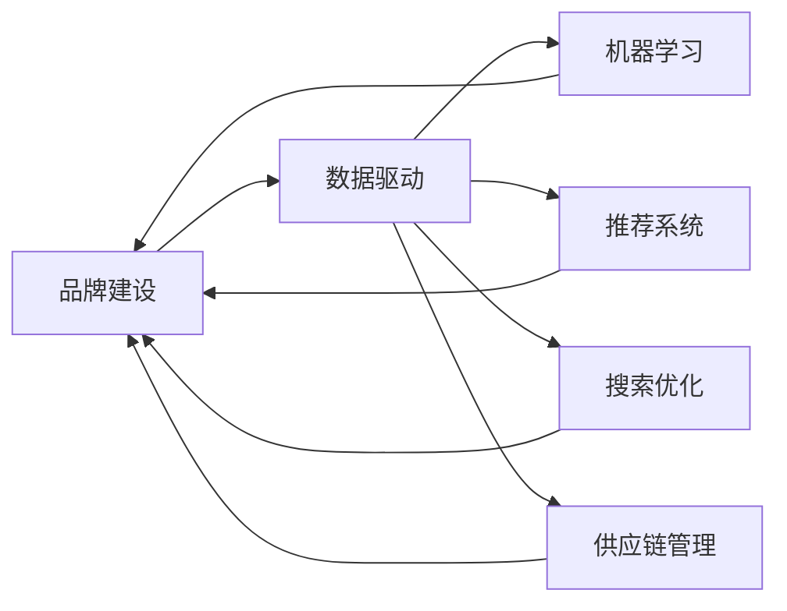

                 

## 1. 背景介绍

在当今电子商务快速发展的时代，电商平台面临着日益激烈的竞争压力，如何提升品牌影响力和品类运营能力，成为决定其市场地位的关键因素。品牌建设不仅涉及品牌形象的塑造和消费者认知的构建，还涵盖产品设计、市场推广、客户服务等多个维度；而品类运营则直接影响着商品的丰富度、质量、价格和库存管理，是提升消费者满意度和复购率的重要途径。

本文将重点探讨如何通过数据驱动的方法，在电商平台构建高效的品牌建设和品类运营策略，同时介绍一些实际可行的技术实现方案，为电商平台的发展提供科学依据和创新实践。

## 2. 核心概念与联系

在深入探讨品牌建设和品类运营的具体策略前，我们先明确几个核心概念及其相互关系：

### 2.1 核心概念概述

- **品牌建设(Brand Building)**：指通过一系列品牌传播活动，塑造品牌形象、提升品牌知名度和美誉度，构建品牌忠诚度，实现品牌价值的最大化。
- **品类运营(Category Management)**：指对商品的品类结构、价格、陈列、推广等进行系统管理，以提高销售效率、降低运营成本，提升消费者满意度和品牌竞争力。
- **数据驱动(Data-Driven)**：指利用数据和算法技术，分析和优化电商平台的用户行为、消费习惯、库存状态等，实现智能决策和精细化运营。
- **机器学习(Machine Learning)**：一种通过数据训练模型，使其能够从数据中学习规律，进行预测和决策的技术。
- **推荐系统(Recommendation System)**：根据用户历史行为和兴趣，推荐可能感兴趣的商品或内容，以提高用户粘性和转化率。
- **搜索优化(搜索引擎优化, Search Engine Optimization, SEO)**：通过优化网站结构和内容，提升搜索引擎排名，吸引更多流量。
- **供应链管理(Supply Chain Management, SCM)**：涉及商品采购、库存、物流等环节的管理，确保商品的及时供应和品质。

### 2.2 核心概念联系

品牌建设和品类运营通过数据驱动，可以紧密结合。例如，通过机器学习算法分析用户行为数据，可以精准推荐商品，提升用户体验；通过对品类运营数据的分析，可以优化商品结构，提升销售效率。搜索优化和推荐系统也是数据驱动在电商平台上的重要应用，可以有效提升用户访问量和转化率。而机器学习还可以应用于供应链管理，优化库存和物流环节，提高整体运营效率。

这些概念和技术的联系可以形象地通过以下Mermaid流程图展示：



## 3. 核心算法原理 & 具体操作步骤

### 3.1 算法原理概述

品牌建设和品类运营的核心在于通过数据挖掘和分析，找到潜在的用户需求和消费趋势，从而制定和优化营销策略和运营方案。具体来说，可以通过以下步骤实现：

1. **数据收集与预处理**：从电商平台的各种数据源收集数据，包括用户行为数据、商品销售数据、库存数据等，并进行清洗、去重、标准化等预处理。
2. **用户行为分析**：利用聚类、关联规则挖掘等算法，分析用户的兴趣偏好、购买习惯等，建立用户画像。
3. **品类结构优化**：通过回归分析、时间序列分析等方法，预测商品销量趋势，优化品类结构。
4. **营销策略制定**：基于用户行为和品类结构分析，制定针对性的营销策略，如个性化推荐、促销活动、广告投放等。
5. **效果评估与反馈**：通过A/B测试、用户满意度调查等手段，评估营销策略的效果，并根据反馈进行优化。

### 3.2 算法步骤详解

#### 步骤1：数据收集与预处理

数据收集是品牌建设和品类运营的基础。常见的数据源包括：

- **用户行为数据**：包括浏览记录、购买记录、评价信息等，用于分析用户兴趣和购买行为。
- **商品销售数据**：包括销量、价格、库存等，用于分析商品销售趋势和库存状况。
- **用户反馈数据**：包括评价、客服聊天记录等，用于了解用户需求和问题。

数据预处理包括：

- **清洗**：去除重复、错误、无关数据。
- **标准化**：统一数据格式和单位，方便后续分析。
- **特征工程**：提取有用的特征，如用户停留时间、商品类别、促销活动等。

#### 步骤2：用户行为分析

用户行为分析可以揭示用户群体的特征和需求，为制定个性化营销策略提供依据。具体技术包括：

- **聚类算法**：如K-means、层次聚类等，将用户分为不同群体，分析每个群体的特征。
- **关联规则挖掘**：如Apriori算法，找出不同商品之间的关联，发现隐藏的用户需求。
- **时间序列分析**：如ARIMA模型，预测用户行为随时间的变化趋势。

#### 步骤3：品类结构优化

品类结构优化可以确保商品的多样性和相关性，提升销售效率。具体技术包括：

- **回归分析**：如线性回归、决策树回归等，预测商品销量，优化品类结构。
- **聚类分析**：如层次聚类、DBSCAN等，发现相似商品的组合，提高品类多样性。
- **关联分析**：如Apriori算法，发现品类之间的关联，进行联合推荐。

#### 步骤4：营销策略制定

营销策略制定可以针对不同用户群体，制定个性化的推荐、促销、广告等策略。具体技术包括：

- **个性化推荐系统**：如协同过滤、基于内容的推荐等，根据用户行为推荐商品。
- **多臂老虎机(Multi-Armed Bandit, MAB)**：根据用户点击率、转化率等指标，动态调整广告投放策略。
- **A/B测试**：比较不同策略的效果，选择最优方案。

#### 步骤5：效果评估与反馈

效果评估与反馈是持续优化品牌建设和品类运营的重要环节。具体技术包括：

- **A/B测试**：比较不同策略的效果，选择最优方案。
- **用户满意度调查**：通过问卷、评价等方式，收集用户反馈。
- **数据分析**：利用可视化工具（如Tableau、Power BI），展示数据变化趋势，发现问题。

### 3.3 算法优缺点

#### 优点：

- **提升效率**：通过数据驱动，优化品类结构和营销策略，提升销售效率。
- **精准推荐**：利用个性化推荐系统，提高用户粘性和转化率。
- **效果评估**：通过A/B测试和用户反馈，及时调整策略，优化运营效果。

#### 缺点：

- **数据隐私**：用户数据收集和分析可能涉及隐私问题，需要严格遵守数据保护法规。
- **技术复杂**：需要掌握数据分析、机器学习等技术，实施难度较高。
- **成本高昂**：数据收集和预处理、算法实现和优化等环节需要投入大量资源。

### 3.4 算法应用领域

数据驱动的方法广泛应用于电商平台的品牌建设和品类运营中，具体应用领域包括：

- **用户行为分析**：用于分析用户兴趣、需求，优化个性化推荐。
- **品类结构优化**：用于预测销售趋势，优化商品品类。
- **营销策略制定**：用于制定促销活动、广告投放等策略。
- **供应链管理**：用于优化库存管理、物流环节，提高整体运营效率。
- **搜索优化**：用于提升搜索引擎排名，吸引更多流量。

## 4. 数学模型和公式 & 详细讲解 & 举例说明

### 4.1 数学模型构建

在本节中，我们将介绍几种常用的数学模型及其构建方法。

#### 用户行为分析模型

用户行为分析的数学模型主要基于聚类和关联规则挖掘。

- **K-means聚类算法**：
  $$
  \arg\min_{K,\mu,\sigma} \sum_{i=1}^{N} \sum_{j=1}^{K} (\frac{\text{dist}(x_i,\mu_j)^2}{2\sigma_j^2}+\log\sigma_j)
  $$
  其中，$N$为样本数，$K$为聚类数，$\mu_j$为聚类中心，$\sigma_j$为聚类方差。

- **Apriori关联规则挖掘算法**：
  $$
  \min_{F} \frac{\sum_{i=1}^{M} P(I_i) - \sum_{i=1}^{M} \sum_{j=1}^{M} P(I_i \cap I_j)}{1-\sum_{i=1}^{M} P(I_i)}
  $$
  其中，$M$为项目数，$P(I_i)$为单个项目的支持度，$P(I_i \cap I_j)$为两个项目的关联度。

#### 品类结构优化模型

品类结构优化的数学模型主要基于回归分析和聚类分析。

- **线性回归模型**：
  $$
  y = \theta_0 + \theta_1x_1 + \theta_2x_2 + \cdots + \theta_nx_n + \epsilon
  $$
  其中，$y$为预测销量，$\theta_0,\theta_1,\cdots,\theta_n$为模型参数，$\epsilon$为误差项。

- **层次聚类算法**：
  $$
  D(c_k) = \sum_{i,j \in C_k} d(x_i,x_j)
  $$
  其中，$C_k$为第$k$层聚类，$d(x_i,x_j)$为样本$x_i$和$x_j$之间的距离。

#### 营销策略制定模型

营销策略制定的数学模型主要基于个性化推荐和多臂老虎机。

- **协同过滤推荐算法**：
  $$
  \arg\min_{p} \frac{1}{2} \|p\|_F^2 + \alpha \sum_{i=1}^{N} \sum_{j=1}^{M} (y_{ij} - p_i \cdot v_j)^2
  $$
  其中，$p$为推荐向量，$v_j$为商品向量，$y_{ij}$为实际评分，$\alpha$为正则化系数。

- **多臂老虎机算法**：
  $$
  \arg\min_{\pi} \sum_{t=1}^{T} \sum_{j=1}^{J} \mathbb{E}[R_{jt}^{\pi}]
  $$
  其中，$\pi$为策略，$R_{jt}$为奖励，$J$为臂数，$T$为时间步长。

### 4.2 公式推导过程

#### 用户行为分析公式推导

**K-means聚类算法推导**：

1. **目标函数**：
  $$
  \min_{K,\mu,\sigma} \sum_{i=1}^{N} \sum_{j=1}^{K} (\frac{\text{dist}(x_i,\mu_j)^2}{2\sigma_j^2}+\log\sigma_j)
  $$
  其中，$\text{dist}(x_i,\mu_j)$为样本$x_i$到聚类中心$\mu_j$的距离。

2. **迭代公式**：
  - **聚类中心更新**：
    $$
    \mu_j = \frac{1}{|C_j|} \sum_{i \in C_j} x_i
    $$
  - **方差更新**：
    $$
    \sigma_j = \sqrt{\frac{1}{|C_j|} \sum_{i \in C_j} (x_i - \mu_j)^2}
    $$
  - **聚类数更新**：
    $$
    K = \arg\min_{K'} D(K')
    $$
    其中，$D(K')$为聚类损失函数。

**Apriori关联规则挖掘算法推导**：

1. **支持度计算**：
  $$
  \text{Supp}(I_j) = \frac{\text{Count}(I_j)}{\text{Count}(\cup I_j)}
  $$
  其中，$\text{Count}(I_j)$为项目$I_j$的出现次数，$\text{Count}(\cup I_j)$为$I_j$及其关联项目的总出现次数。

2. **置信度计算**：
  $$
  \text{Conf}(I_j \to I_k) = \frac{\text{Count}(I_j \cap I_k)}{\text{Count}(I_j)}
  $$
  其中，$\text{Count}(I_j \cap I_k)$为$I_j$和$I_k$同时出现的次数。

3. **频繁项集生成**：
  $$
  L_1 = \text{Frequent}(I_1)
  $$
  $$
  L_{i+1} = \text{Frequent}(L_i \cup L_1)
  $$
  其中，$\text{Frequent}(I_j)$为频繁项集生成算法。

#### 品类结构优化公式推导

**线性回归模型推导**：

1. **目标函数**：
  $$
  \min_{\theta} \frac{1}{2} \sum_{i=1}^{N} (y_i - \theta^T x_i)^2
  $$
  其中，$y_i$为实际销量，$x_i$为特征向量，$\theta$为模型参数。

2. **梯度更新公式**：
  $$
  \theta \leftarrow \theta - \alpha \frac{\partial L(\theta)}{\partial \theta}
  $$
  其中，$\alpha$为学习率。

**层次聚类算法推导**：

1. **目标函数**：
  $$
  D(c_k) = \sum_{i,j \in C_k} d(x_i,x_j)
  $$
  其中，$d(x_i,x_j)$为样本$x_i$和$x_j$之间的距离。

2. **迭代公式**：
  - **合并聚类**：
    $$
    C_{k+1} = \arg\min_{k \in K'} D(c_k) + D(c_{k'})
    $$
  - **聚类数更新**：
    $$
    K = \arg\min_{K'} D(K')
    $$
    其中，$D(K')$为聚类损失函数。

#### 营销策略制定公式推导

**协同过滤推荐算法推导**：

1. **目标函数**：
  $$
  \min_{p} \frac{1}{2} \|p\|_F^2 + \alpha \sum_{i=1}^{N} \sum_{j=1}^{M} (y_{ij} - p_i \cdot v_j)^2
  $$
  其中，$p$为推荐向量，$v_j$为商品向量，$y_{ij}$为实际评分，$\alpha$为正则化系数。

2. **梯度更新公式**：
  $$
  p \leftarrow p - \alpha \frac{\partial L(p)}{\partial p}
  $$

**多臂老虎机算法推导**：

1. **目标函数**：
  $$
  \min_{\pi} \sum_{t=1}^{T} \sum_{j=1}^{J} \mathbb{E}[R_{jt}^{\pi}]
  $$
  其中，$\pi$为策略，$R_{jt}$为奖励，$J$为臂数，$T$为时间步长。

2. **迭代公式**：
  $$
  \pi \leftarrow \arg\max_{\pi} \sum_{j=1}^{J} \pi_j \cdot R_{jt}^{\pi}
  $$

### 4.3 案例分析与讲解

**案例1：用户行为分析**

某电商平台通过K-means聚类算法，对用户行为数据进行分析，将用户分为高价值用户、高频率用户和低价值用户三类。具体步骤为：

1. 收集用户浏览、点击、购买等行为数据。
2. 对数据进行预处理，去除无关数据。
3. 使用K-means聚类算法对用户进行聚类。
4. 对不同聚类用户，制定不同的营销策略，如高价值用户提供会员专享优惠，高频率用户推荐新品等。

**案例2：品类结构优化**

某电商平台通过线性回归模型，预测商品销量的趋势。具体步骤为：

1. 收集商品销量、价格、库存等数据。
2. 对数据进行预处理，去除无关数据。
3. 使用线性回归模型对商品销量进行预测。
4. 根据预测结果，优化商品品类结构，确保商品的多样性和相关性。

**案例3：营销策略制定**

某电商平台通过多臂老虎机算法，优化广告投放策略。具体步骤为：

1. 收集广告点击、转化等数据。
2. 对数据进行预处理，去除无关数据。
3. 使用多臂老虎机算法，根据点击率和转化率，动态调整广告投放策略。
4. 根据效果评估，调整广告预算和投放策略。

## 5. 项目实践：代码实例和详细解释说明

### 5.1 开发环境搭建

#### 5.1.1 软件环境准备

- **操作系统**：Linux Ubuntu 18.04或Windows 10/11。
- **编程语言**：Python 3.8及以上版本。
- **开发工具**：Jupyter Notebook、PyCharm等。
- **数据处理库**：Pandas、NumPy等。
- **机器学习库**：Scikit-learn、TensorFlow等。
- **推荐系统库**：Surprise、LightFM等。

#### 5.1.2 环境配置

1. **安装Python**：
   ```
   sudo apt-get update
   sudo apt-get install python3 python3-pip
   ```

2. **安装依赖库**：
   ```
   pip install pandas numpy scikit-learn tensorflow surprise lightfm
   ```

3. **安装Jupyter Notebook**：
   ```
   pip install jupyter notebook
   ```

### 5.2 源代码详细实现

#### 用户行为分析

```python
import pandas as pd
from sklearn.cluster import KMeans
from sklearn.metrics import silhouette_score

# 加载用户行为数据
data = pd.read_csv('user_behavior.csv')

# 预处理数据
#...

# 聚类分析
kmeans = KMeans(n_clusters=3, random_state=42)
kmeans.fit(data[['特征1', '特征2', ...]])
labels = kmeans.labels_

# 评估聚类效果
silhouette_score(data, labels)
```

#### 品类结构优化

```python
import pandas as pd
from sklearn.linear_model import LinearRegression

# 加载品类结构数据
data = pd.read_csv('category_structure.csv')

# 预处理数据
#...

# 线性回归模型
model = LinearRegression()
model.fit(X, y)

# 预测销量
predicted_sales = model.predict(X_test)
```

#### 营销策略制定

```python
import pandas as pd
from surprise import Reader, Dataset, SVD
from surprise.model_selection import train_test_split
from surprise.prediction_algorithms import SVD

# 加载推荐数据
reader = Reader(rating_scale=(1, 5))
data = Dataset.load_from_df(data[['user_id', 'item_id', 'rating']], reader)

# 划分训练集和测试集
trainset, testset = train_test_split(data, test_size=0.2)

# 训练推荐模型
algo = SVD()
algo.fit(trainset)

# 测试推荐模型
predictions = algo.test(testset)
```

### 5.3 代码解读与分析

#### 用户行为分析代码解读

1. **数据加载**：使用Pandas库加载用户行为数据，并进行预处理。
2. **聚类分析**：使用KMeans算法进行聚类，得到不同用户群体的标签。
3. **聚类效果评估**：使用轮廓系数评估聚类效果，选择最优聚类数。

#### 品类结构优化代码解读

1. **数据加载**：使用Pandas库加载品类结构数据，并进行预处理。
2. **线性回归模型**：使用LinearRegression模型对商品销量进行预测。
3. **模型训练与预测**：训练模型并使用预测结果优化品类结构。

#### 营销策略制定代码解读

1. **数据加载**：使用Pandas库加载推荐数据，并进行预处理。
2. **模型训练**：使用Surprise库中的SVD算法训练推荐模型。
3. **模型测试**：使用测试集评估推荐模型效果，得到推荐结果。

### 5.4 运行结果展示

#### 用户行为分析结果展示

1. **聚类结果**：展示不同用户群体的特征，如年龄、性别、消费金额等。
2. **营销策略**：针对不同用户群体，制定个性化营销策略。

#### 品类结构优化结果展示

1. **销量预测**：展示不同商品的销量预测结果。
2. **品类优化**：根据销量预测结果，优化商品品类结构。

#### 营销策略制定结果展示

1. **推荐结果**：展示用户对推荐商品的评分和点击率。
2. **广告优化**：根据推荐结果，优化广告投放策略。

## 6. 实际应用场景

### 6.1 智能客服系统

智能客服系统通过数据驱动的分析和优化，可以大幅提升客服效率和用户体验。具体应用场景包括：

1. **用户画像**：利用用户行为分析，构建用户画像，实现个性化服务。
2. **问题分类**：通过聚类分析，对用户咨询问题进行分类，实现智能分类和快速响应。
3. **知识库优化**：利用推荐系统，自动推荐常见问题解答，提升知识库更新效率。

### 6.2 个性化推荐系统

个性化推荐系统通过数据驱动的分析和优化，可以提升用户粘性和转化率。具体应用场景包括：

1. **用户兴趣分析**：利用用户行为分析，挖掘用户兴趣，实现个性化推荐。
2. **商品关联推荐**：通过关联规则挖掘，发现商品之间的关联，实现跨品类推荐。
3. **实时推荐**：利用多臂老虎机算法，根据用户行为动态调整推荐策略。

### 6.3 智能仓库管理

智能仓库管理通过数据驱动的分析和优化，可以提升库存管理和物流效率。具体应用场景包括：

1. **库存预测**：利用回归分析，预测商品销量趋势，优化库存管理。
2. **物流优化**：通过聚类分析，优化配送路线和仓库布局，提升物流效率。
3. **供应链协同**：利用推荐系统，协同上下游供应链，实现库存和物流的平衡。

## 7. 工具和资源推荐

### 7.1 学习资源推荐

#### 推荐书籍

1. **《数据挖掘导论》**：介绍数据挖掘的基本概念和常用算法，适合初学者入门。
2. **《Python数据科学手册》**：介绍Python在数据科学中的应用，包含数据处理、机器学习、推荐系统等内容。
3. **《推荐系统实践》**：介绍推荐系统的理论和实现，适合实际开发参考。

#### 推荐课程

1. **Coursera《数据科学专项课程》**：由斯坦福大学教授讲授，涵盖数据处理、机器学习、推荐系统等内容。
2. **edX《大数据科学与工程》**：由IBM讲授，涵盖大数据处理、机器学习、推荐系统等内容。
3. **Udacity《数据科学家纳米学位》**：涵盖数据科学全栈技能，包括数据处理、机器学习、推荐系统等内容。

#### 推荐网站

1. **Kaggle**：数据科学竞赛平台，提供大量真实数据和算法竞赛。
2. **DataCamp**：在线学习平台，提供Python、R等数据科学课程。
3. **Data.gov**：美国政府开放数据平台，提供大量公开数据集。

### 7.2 开发工具推荐

#### 推荐工具

1. **PyTorch**：深度学习框架，支持Python和C++，灵活高效。
2. **TensorFlow**：深度学习框架，支持Python和C++，易于部署。
3. **Apache Spark**：大数据处理框架，支持Python、R、Java等语言，适合大规模数据处理。
4. **Apache Flink**：流处理框架，支持Python、Java等语言，适合实时数据处理。
5. **Elasticsearch**：分布式搜索引擎，支持Python、Java等语言，适合大规模数据搜索。
6. **Kibana**：数据可视化工具，支持Python、Java等语言，适合数据探索和可视化。

### 7.3 相关论文推荐

#### 推荐论文

1. **《K-means算法》**：介绍K-means聚类算法的基本原理和应用。
2. **《Apriori算法》**：介绍Apriori关联规则挖掘算法的基本原理和应用。
3. **《线性回归模型》**：介绍线性回归模型的基本原理和应用。
4. **《协同过滤推荐算法》**：介绍协同过滤推荐算法的基本原理和应用。
5. **《多臂老虎机算法》**：介绍多臂老虎机算法的基本原理和应用。

## 8. 总结：未来发展趋势与挑战

### 8.1 研究成果总结

本文介绍了数据驱动的电商平台品牌建设和品类运营策略，并给出了具体的技术实现方案。通过用户行为分析、品类结构优化和营销策略制定等手段，提升电商平台的用户粘性和转化率，优化库存管理和物流效率，实现智能决策和精细化运营。

### 8.2 未来发展趋势

1. **自动化程度提升**：随着深度学习技术的发展，自动化程度将进一步提升，实现智能客服、智能推荐等应用。
2. **个性化需求增加**：用户需求日益个性化，将推动个性化推荐和智能客服等应用的发展。
3. **跨模态融合**：将文本、图像、视频等多模态数据融合，提升系统的智能水平。
4. **实时性要求提高**：实时性要求提升，将推动实时推荐、实时搜索等应用的发展。

### 8.3 面临的挑战

1. **数据隐私和安全**：用户数据隐私和安全问题需要得到重视和解决。
2. **技术复杂度**：算法实现和优化需要高水平的技术积累和经验。
3. **资源消耗高**：数据处理和模型训练需要大量的计算资源和时间。

### 8.4 研究展望

1. **隐私保护技术**：研究如何保护用户数据隐私和安全，如差分隐私、联邦学习等技术。
2. **自动化技术**：研究如何自动化算法选择和调优，降低技术门槛。
3. **资源优化技术**：研究如何优化数据处理和模型训练的资源消耗，提升系统效率。

## 9. 附录：常见问题与解答

**Q1：电商平台的用户行为数据如何收集和预处理？**

A: 电商平台可以通过网站日志、交易记录、用户反馈等途径收集用户行为数据。预处理包括去重、清洗、标准化等步骤，去除无关数据和噪声，确保数据质量。

**Q2：如何在用户行为分析中选择合适的聚类算法？**

A: 选择合适的聚类算法需要考虑数据的特点和分析目的。例如，K-means适用于线性分布的数据，层次聚类适用于树状结构的数据。选择合适的聚类算法可以提高聚类效果和分析精度。

**Q3：如何进行品类结构优化？**

A: 品类结构优化可以使用回归分析、聚类分析等方法。回归分析用于预测商品销量，聚类分析用于优化品类结构，确保商品的多样性和相关性。

**Q4：推荐系统的实现过程中有哪些关键步骤？**

A: 推荐系统的实现过程包括数据收集、数据预处理、模型训练、模型评估、模型部署等步骤。选择合适的推荐算法和评估指标，能够提高推荐系统的准确性和用户满意度。

**Q5：如何确保推荐系统的公平性和透明性？**

A: 确保推荐系统的公平性和透明性需要研究推荐算法中的偏见和歧视问题，如使用公平性约束、透明性评估等技术手段，提升系统的可信度和可解释性。

---

作者：禅与计算机程序设计艺术 / Zen and the Art of Computer Programming

