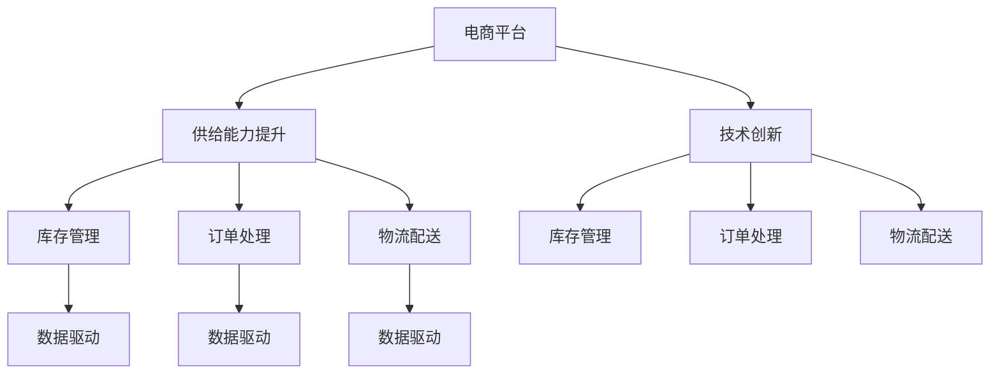

                 

# 电商平台供给能力提升：技术创新与数据驱动

> 关键词：电商平台,供给能力提升,技术创新,数据驱动,电商数据分析

## 1. 背景介绍

### 1.1 问题由来
随着电子商务的快速发展，电商平台的供给能力已经成为其能否持续增长的关键因素。传统的电商平台往往面临库存管理、订单处理、物流配送等供应链瓶颈，难以满足日益增长的用户需求。通过技术创新和数据驱动，电商平台可以实时优化供给能力，提升用户体验，推动业务增长。

### 1.2 问题核心关键点
提升电商平台供给能力的关键在于如何通过技术手段和数据驱动，实现库存优化、订单管理、物流配送等环节的智能化，从而提高效率、降低成本、提升用户体验。以下是几个核心问题：

1. **库存管理**：如何通过实时数据分析，准确预测商品需求，优化库存水平，避免缺货或过剩库存。
2. **订单处理**：如何高效处理大量订单，保证订单处理的及时性和准确性，提升用户满意度。
3. **物流配送**：如何通过算法优化，选择最优的配送路线和物流方式，降低配送成本，提升配送速度。
4. **用户需求洞察**：如何通过数据挖掘和用户行为分析，了解用户需求变化趋势，及时调整产品供给策略。

### 1.3 问题研究意义
提升电商平台供给能力对于电商平台的长期发展至关重要。通过技术创新和数据驱动，电商平台可以：

1. 提高运营效率，减少成本。
2. 增强用户体验，提升客户忠诚度。
3. 优化库存管理，减少库存积压。
4. 预测需求趋势，提前应对市场变化。

研究如何通过技术创新和数据驱动提升电商平台供给能力，对于推动电商行业的智能化转型，具有重要意义。

## 2. 核心概念与联系

### 2.1 核心概念概述

为更好地理解电商平台供给能力提升的技术创新与数据驱动方法，本节将介绍几个密切相关的核心概念：

- **电商平台**：指通过互联网提供商品或服务的平台，包括B2B、B2C、C2C等多种模式。
- **供给能力**：指电商平台在一定时间内能够提供给用户的产品数量和质量。
- **库存管理**：指对商品库存的进、销、存进行管理和控制，保证商品在适当时间和地点可用。
- **订单处理**：指接收、处理、确认、配送用户订单的过程。
- **物流配送**：指将商品从卖家端送到买家端的运输、配送过程。
- **数据驱动**：指基于数据的分析、挖掘和应用，辅助决策和优化过程。
- **技术创新**：指在电商供应链各个环节中引入新技术、新方法，提升效率和智能化水平。

这些概念之间的逻辑关系可以通过以下Mermaid流程图来展示：



这个流程图展示了一体化的电商平台供给能力提升框架，各个环节通过数据驱动和技术创新紧密联系，形成了一个完整的电商供应链优化闭环。

## 3. 核心算法原理 & 具体操作步骤
### 3.1 算法原理概述

提升电商平台供给能力的技术创新与数据驱动方法，通常基于以下核心算法原理：

- **预测算法**：通过历史销售数据和实时数据，使用机器学习模型预测商品需求量，优化库存水平。
- **优化算法**：使用算法优化订单处理和配送路线，提升效率和降低成本。
- **推荐算法**：基于用户行为数据，推荐相关商品，提升用户购买率。
- **数据集成与分析**：将电商供应链各个环节的数据进行集成和分析，形成统一的数据视角，辅助决策。

### 3.2 算法步骤详解

提升电商平台供给能力的算法步骤如下：

1. **数据收集**：从电商平台的订单、库存、物流、用户行为等多个渠道收集数据，形成完整的数据视图。
2. **数据清洗与预处理**：对数据进行清洗、去重、归一化等预处理，确保数据的质量和一致性。
3. **模型训练**：选择合适的预测、优化和推荐算法，在历史数据上训练模型，形成预测、优化和推荐模型。
4. **实时数据处理**：将实时订单、库存、物流等数据输入模型，动态调整库存、优化订单处理和物流配送。
5. **效果评估与反馈**：评估模型效果，根据实际运营数据进行反馈，不断优化模型。

### 3.3 算法优缺点

提升电商平台供给能力的数据驱动技术创新方法，具有以下优点：

- **提高效率**：通过算法优化，显著提升订单处理和物流配送的效率。
- **降低成本**：优化库存管理和配送路线，减少库存积压和物流成本。
- **提升用户体验**：精准预测商品需求，及时补货，快速配送，提升用户满意度。

同时，该方法也存在一些局限性：

- **数据依赖**：模型的效果高度依赖于数据的质量和完整性，数据不足或质量差可能导致模型失效。
- **算法复杂度**：算法模型复杂，需要大量的计算资源和时间。
- **技术门槛高**：需要具备一定的数据科学、算法和工程能力，门槛较高。

### 3.4 算法应用领域

基于数据驱动的电商平台供给能力提升技术，可以广泛应用于以下几个领域：

1. **库存管理**：通过预测算法优化库存水平，避免缺货和过剩库存。
2. **订单处理**：使用优化算法高效处理订单，提升订单处理的准确性和及时性。
3. **物流配送**：通过算法优化配送路线，降低配送成本，提升配送速度。
4. **需求预测**：使用数据挖掘技术分析用户行为，预测商品需求趋势。
5. **推荐系统**：基于用户行为数据，推荐相关商品，提升用户购买率。
6. **价格优化**：通过分析市场价格数据，动态调整商品价格，提升销售收益。

## 4. 数学模型和公式 & 详细讲解 & 举例说明

### 4.1 数学模型构建

电商平台供给能力提升的数学模型构建，主要基于以下几个方面：

- **库存管理模型**：使用时间序列预测算法，预测商品需求量，优化库存水平。
- **订单处理模型**：使用优化算法，如遗传算法、蚁群算法等，优化订单处理流程。
- **物流配送模型**：使用图论算法，如Dijkstra算法、A*算法等，优化配送路线。
- **用户行为模型**：使用关联规则算法，如Apriori算法、FP-growth算法等，分析用户行为数据。

### 4.2 公式推导过程

以库存管理模型为例，假设历史销售数据为 $\{D_t\}_{t=1}^T$，其中 $D_t$ 表示第 $t$ 天的销售量。使用ARIMA模型进行时间序列预测，其基本公式为：

$$
D_t = \alpha + \beta t + \gamma \sum_{k=1}^{p-1} (D_{t-k}) + \epsilon_t
$$

其中，$\alpha$ 为截距项，$\beta$ 为趋势项，$\gamma$ 为季节性项，$\epsilon_t$ 为随机误差项，$p$ 为季节性周期。

通过历史数据训练模型，得到模型参数 $\hat{\alpha}, \hat{\beta}, \hat{\gamma}$，可以预测未来 $n$ 天的销售量：

$$
\hat{D}_t = \hat{\alpha} + \hat{\beta} t + \hat{\gamma} \sum_{k=1}^{p-1} (\hat{D}_{t-k}) + \hat{\epsilon}_t
$$

### 4.3 案例分析与讲解

某电商平台的库存管理案例，使用ARIMA模型预测某商品的未来需求量，具体步骤如下：

1. **数据收集**：收集历史销售数据 $\{D_t\}_{t=1}^{1000}$。
2. **数据清洗**：去除异常值，归一化数据。
3. **模型训练**：使用ARIMA模型训练模型，得到模型参数 $\hat{\alpha}, \hat{\beta}, \hat{\gamma}$。
4. **预测需求**：根据模型参数，预测未来 30 天的需求量 $\hat{D}_t$。
5. **库存优化**：根据预测需求量，调整库存水平，避免缺货和过剩。

通过上述步骤，该电商平台成功优化了库存管理，减少了库存积压，提升了运营效率。

## 5. 项目实践：代码实例和详细解释说明

### 5.1 开发环境搭建

在进行电商平台供给能力提升实践前，我们需要准备好开发环境。以下是使用Python进行数据驱动和算法优化的环境配置流程：

1. 安装Anaconda：从官网下载并安装Anaconda，用于创建独立的Python环境。

2. 创建并激活虚拟环境：
```bash
conda create -n ecommerce-env python=3.8 
conda activate ecommerce-env
```

3. 安装必要的Python包：
```bash
pip install pandas numpy matplotlib scikit-learn scikit-optimization scikit-learn-cv
```

4. 安装数据处理和算法优化工具：
```bash
pip install pyspark pyarrow pyflink dask scikit-learn-distributed
```

完成上述步骤后，即可在`ecommerce-env`环境中开始电商平台供给能力提升的实践。

### 5.2 源代码详细实现

以下是一个基于预测算法的电商平台库存管理优化案例：

```python
import pandas as pd
import numpy as np
from sklearn.metrics import mean_squared_error
from statsmodels.tsa.arima_model import ARIMA

# 读取历史销售数据
df = pd.read_csv('sales_data.csv')
t = df['date']
D = df['sales']

# 数据预处理
t = pd.to_datetime(t).to_series()
t = t - t[0]
t = t.dt.days

# 分解时间序列
X = D.values.reshape(-1, 1)
order = (0, 1, 0)
model = ARIMA(X, order=order)
results = model.fit()

# 预测未来30天的需求量
forecast = results.forecast(steps=30)[0]
print(f'预测未来30天的需求量：{forecast}')

# 库存优化
# 假设当前库存为1000，每天需求量为30
current_inventory = 1000
daily_demand = 30
optimal_inventory = current_inventory + np.sum(forecast) - np.cumsum(forecast)
print(f'优化后的库存量为：{optimal_inventory}')
```

### 5.3 代码解读与分析

让我们再详细解读一下关键代码的实现细节：

**读取历史销售数据**：
- 使用Pandas库读取CSV格式的历史销售数据，形成时间序列。

**数据预处理**：
- 将时间戳转换为日期，并减去初始日期，得到时间序列。
- 使用statsmodels库中的ARIMA模型进行时间序列分解。

**模型训练**：
- 使用ARIMA模型对时间序列进行训练，得到模型参数。
- 使用模型进行未来30天的需求量预测。

**库存优化**：
- 根据预测需求量，计算优化后的库存量。
- 假设当前库存为1000，每天需求量为30，通过累加预测需求量，计算最优库存量。

通过上述代码，我们完成了对电商平台库存管理优化的时间序列预测和库存量计算。实际应用中，数据预处理和模型训练的复杂性远高于代码所示，需要结合实际业务场景进行优化。

## 6. 实际应用场景

### 6.1 智能库存管理系统

智能库存管理系统通过实时数据分析和算法优化，实现库存的智能管理和精准补货。通过预测算法，系统可以实时监控库存水平，预测未来的需求量，自动生成补货订单，避免库存积压或缺货。具体应用场景包括：

- **智能补货**：根据预测需求量和库存水平，自动生成补货订单，提升补货效率。
- **库存预警**：当库存水平低于预设阈值时，系统自动发出预警，通知相关部门进行补货。
- **库存优化**：基于历史数据和实时数据，动态调整库存策略，优化库存水平。

### 6.2 高效订单处理系统

高效订单处理系统通过优化算法，提升订单处理的效率和准确性。通过算法优化，系统可以自动分配订单、调度资源、处理异常，提升订单处理速度和用户体验。具体应用场景包括：

- **订单分配**：根据订单量、库存和物流情况，自动分配订单，优化订单处理流程。
- **资源调度**：实时监控订单处理资源，动态调整资源配置，保证订单处理的及时性。
- **异常处理**：实时监测订单处理异常，自动通知相关部门进行处理。

### 6.3 实时物流配送系统

实时物流配送系统通过算法优化，选择最优的配送路线和方式，降低物流成本，提升配送速度。通过算法优化，系统可以实时计算配送路径、选择最优配送方式，提升物流配送的效率和准确性。具体应用场景包括：

- **配送路径优化**：实时计算最优配送路径，减少配送时间和成本。
- **配送方式选择**：根据配送需求，选择最优的配送方式，如快递、自提、第三方物流等。
- **配送异常处理**：实时监测配送异常，自动通知相关部门进行处理。

## 7. 工具和资源推荐

### 7.1 学习资源推荐

为了帮助开发者系统掌握电商平台供给能力提升的技术创新与数据驱动理论基础和实践技巧，这里推荐一些优质的学习资源：

1. **《机器学习实战》**：周志华著，系统介绍了机器学习的基本原理和算法实现，适合初学者入门。
2. **《数据科学与机器学习》**：李航著，深入浅出地介绍了数据科学和机器学习的基本概念和应用。
3. **《Python数据科学手册》**：Jake VanderPlas著，全面介绍了Python在数据科学中的应用，包括数据处理、算法实现等。
4. **《算法设计与分析》**：姚期智著，系统介绍了经典算法的设计和分析方法，适合算法进阶学习。
5. **Kaggle平台**：全球最大的数据科学竞赛平台，提供丰富的数据集和比赛，帮助你实践和提升数据驱动能力。

通过对这些资源的学习实践，相信你一定能够快速掌握电商平台供给能力提升的精髓，并用于解决实际的业务问题。

### 7.2 开发工具推荐

高效的开发离不开优秀的工具支持。以下是几款用于电商平台供给能力提升开发的常用工具：

1. **Pandas**：用于数据处理和分析的Python库，提供了丰富的数据结构和操作函数，支持时间序列等数据类型。
2. **NumPy**：用于科学计算和数值分析的Python库，支持高效的数组运算和矩阵运算。
3. **Scikit-learn**：用于机器学习和数据挖掘的Python库，提供了丰富的算法和工具，支持模型训练和评估。
4. **Matplotlib**：用于数据可视化的Python库，支持各种图表和动画的绘制。
5. **TensorFlow**：由Google主导开发的深度学习框架，支持分布式计算和高效的模型训练。
6. **PyTorch**：由Facebook主导开发的深度学习框架，支持动态图和高效的模型训练，适合研究和实验。
7. **Dask**：用于大规模数据处理和分析的Python库，支持分布式计算和并行处理，适合处理大数据集。

合理利用这些工具，可以显著提升电商平台供给能力提升任务的开发效率，加快创新迭代的步伐。

### 7.3 相关论文推荐

电商平台供给能力提升的相关研究涉及数据科学、机器学习、算法优化等多个领域，以下是几篇奠基性的相关论文，推荐阅读：

1. **《实时库存管理系统设计》**：介绍了基于数据驱动的实时库存管理系统设计思路和实现方法。
2. **《高效订单处理系统的设计与实现》**：介绍了基于算法优化的高效订单处理系统设计和实现方法。
3. **《实时物流配送系统优化》**：介绍了基于图论算法的实时物流配送系统优化方法和案例。
4. **《智能库存管理系统的建模与优化》**：介绍了基于预测算法的智能库存管理系统建模和优化方法。

这些论文代表了大数据时代电商平台供给能力提升技术的发展脉络。通过学习这些前沿成果，可以帮助研究者把握学科前进方向，激发更多的创新灵感。

## 8. 总结：未来发展趋势与挑战

### 8.1 总结

本文对基于数据驱动和算法优化的电商平台供给能力提升方法进行了全面系统的介绍。首先阐述了电商平台的供给能力提升背景和意义，明确了提升供给能力的关键在于如何通过技术手段和数据驱动，实现库存优化、订单管理、物流配送等环节的智能化。其次，从原理到实践，详细讲解了库存管理、订单处理、物流配送等环节的算法实现和操作步骤，给出了电商平台供给能力提升的完整代码实例。同时，本文还探讨了该方法在智能库存管理、高效订单处理、实时物流配送等多个实际应用场景中的应用，展示了其广泛的应用前景。

通过本文的系统梳理，可以看到，基于数据驱动和算法优化的电商平台供给能力提升方法，已经成为电商平台智能化转型的重要技术手段。数据驱动和算法优化在大规模数据处理和复杂系统优化中的应用，必将为电商行业带来新的机遇和挑战。

### 8.2 未来发展趋势

展望未来，电商平台供给能力提升方法将呈现以下几个发展趋势：

1. **智能化程度提升**：随着AI技术的不断发展，电商平台将更多地引入智能化技术，如自然语言处理、计算机视觉等，提升供应链的自动化和智能化水平。
2. **跨平台协同**：电商平台将实现跨平台、跨部门的协同，提升供应链的整体效率和灵活性。
3. **个性化服务**：通过大数据分析和个性化推荐算法，电商平台将实现对不同用户和不同场景的个性化服务，提升用户体验和满意度。
4. **动态定价**：基于市场数据和用户行为，电商平台将实现动态定价，优化销售收益。
5. **实时监控与预警**：电商平台将实现对供应链各环节的实时监控和预警，及时发现和解决问题。

这些趋势将推动电商平台向更加智能化、个性化、高效化和自动化方向发展，提升用户体验和运营效率，为电商行业的可持续发展提供强有力的技术支撑。

### 8.3 面临的挑战

尽管电商平台供给能力提升方法已经取得了显著成效，但在迈向更加智能化和自动化应用的过程中，仍面临诸多挑战：

1. **数据隐私与安全**：电商平台涉及大量用户数据，如何保护数据隐私和安全，防止数据泄露和滥用，将是关键挑战。
2. **技术复杂度**：电商平台供应链涉及多环节、多技术，需要具备跨学科的知识和技能，技术复杂度较高。
3. **资源消耗**：大规模数据处理和复杂算法优化需要大量的计算资源和时间，如何降低成本、提升效率，是重要的研究方向。
4. **算法透明度与可解释性**：算法模型的复杂性和黑盒性质，使得其难以解释和理解，如何提高算法的透明度和可解释性，将是重要的研究方向。
5. **模型鲁棒性**：电商平台面临的运营环境复杂多变，如何提高模型的鲁棒性和泛化能力，适应不同场景和数据分布，是重要的研究方向。

正视电商平台供给能力提升方法面临的这些挑战，积极应对并寻求突破，将是大数据时代电商平台智能化转型的必由之路。相信随着技术的不断进步和产业界的共同努力，这些挑战终将一一被克服，电商平台供给能力提升方法必将在电商行业中发挥更大的作用。

### 8.4 研究展望

面对电商平台供给能力提升方法面临的挑战，未来的研究需要在以下几个方面寻求新的突破：

1. **跨学科融合**：结合数据科学、计算机科学、管理科学等多个学科的知识，形成跨学科的协同研究，提升算法的综合性能。
2. **智能算法优化**：引入深度学习、强化学习等智能算法，提升算法的自适应性和优化能力，应对复杂多变的运营环境。
3. **数据隐私保护**：研究数据隐私保护技术，如差分隐私、联邦学习等，保护用户数据隐私和安全。
4. **资源优化**：研究分布式计算、云平台等技术，优化算法的资源消耗，提升效率和可靠性。
5. **模型解释性**：研究可解释性算法，如LIME、SHAP等，提高算法的透明度和可解释性，增强用户信任和接受度。
6. **鲁棒性增强**：研究鲁棒性算法，如鲁棒回归、鲁棒SVM等，提高模型对数据异常和干扰的抵抗能力。

这些研究方向的探索，必将引领电商平台供给能力提升方法迈向更高的台阶，为电商行业的智能化转型提供强有力的技术支撑。面向未来，电商平台供给能力提升方法还需要与其他人工智能技术进行更深入的融合，如知识表示、因果推理、强化学习等，多路径协同发力，共同推动电商平台的智能化转型。只有勇于创新、敢于突破，才能不断拓展电商平台的边界，让智能技术更好地服务于电商行业的发展。

## 9. 附录：常见问题与解答

**Q1：如何选择合适的库存管理模型？**

A: 选择合适的库存管理模型需要考虑以下几个方面：

1. **数据类型**：如果数据具有时间序列特征，可以选择ARIMA模型；如果数据具有时间戳特征，可以选择季节性模型。
2. **模型复杂度**：根据数据量和模型要求，选择适合的模型复杂度，避免过拟合或欠拟合。
3. **预测精度**：根据预测精度要求，选择适合的模型，并进行模型调参和优化。

**Q2：订单处理算法有哪些？**

A: 订单处理算法主要包括：

1. **遗传算法**：通过模拟自然进化过程，优化订单处理流程。
2. **蚁群算法**：通过模拟蚂蚁寻找食物的过程，优化订单分配和调度。
3. **模拟退火算法**：通过模拟物质退火过程，优化订单处理路径。
4. **线性规划**：通过线性规划模型，优化订单处理资源分配。

**Q3：配送路径优化算法有哪些？**

A: 配送路径优化算法主要包括：

1. **Dijkstra算法**：基于单源最短路径算法，优化配送路径。
2. **A*算法**：基于启发式搜索算法，优化配送路径。
3. **遗传算法**：通过模拟自然进化过程，优化配送路径。
4. **粒子群算法**：通过模拟粒子群搜索过程，优化配送路径。

**Q4：电商平台如何利用大数据提升供给能力？**

A: 电商平台利用大数据提升供给能力主要通过以下几个方面：

1. **需求预测**：利用历史订单数据和实时订单数据，进行需求预测，优化库存管理。
2. **用户行为分析**：利用用户行为数据，分析用户需求变化趋势，优化商品推荐和库存调整。
3. **供应链优化**：利用大数据分析，优化订单处理、配送路径等供应链环节，提升运营效率。
4. **市场分析**：利用市场数据，进行价格优化和市场趋势预测，提升销售收益。

**Q5：电商平台如何确保数据隐私和安全？**

A: 电商平台确保数据隐私和安全主要通过以下几个方面：

1. **数据脱敏**：对敏感数据进行脱敏处理，保护用户隐私。
2. **数据加密**：对数据进行加密处理，防止数据泄露。
3. **访问控制**：对数据访问进行严格控制，确保数据只能被授权人员访问。
4. **安全审计**：定期进行安全审计，发现和修复安全漏洞。
5. **差分隐私**：在数据分析过程中引入差分隐私技术，保护数据隐私。

通过上述措施，电商平台可以确保数据隐私和安全，保护用户权益。

---

作者：禅与计算机程序设计艺术 / Zen and the Art of Computer Programming

