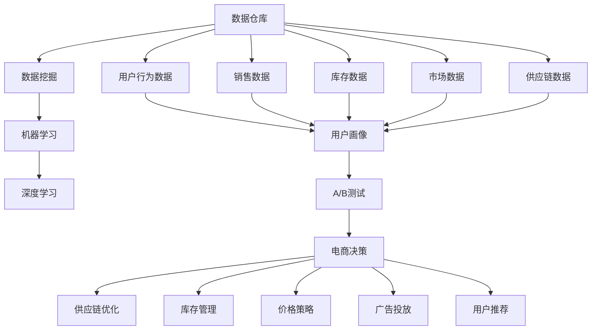

                 

# 电商平台供给能力提升：数据驱动决策

## 1. 背景介绍

在飞速发展的数字经济时代，电商平台凭借其便利、快速、高效的优势，已经成为人们日常购物的重要渠道。然而，随着市场竞争的加剧，平台间的用户争夺也愈发激烈，如何提升平台供给能力，增强用户体验，成为了各大电商平台共同关注的焦点。

随着数据技术的不断成熟，数据驱动决策方法开始崭露头角。电商平台通过整合来自销售、供应链、市场、用户等多方面的数据，利用数据分析模型和算法，洞察消费者需求和市场动态，优化商品库存、物流调度、广告投放等环节，实现了供给能力的精准提升。本文将详细介绍基于数据驱动的电商平台供给能力提升方法，探讨其在实际中的应用场景和未来发展方向。

## 2. 核心概念与联系

为了更好地理解电商平台的数据驱动决策，本节将介绍几个核心概念及其相互之间的联系：

### 2.1 核心概念概述

- **数据驱动决策**：指通过数据分析和挖掘，辅助决策制定，以数据为依据进行优化和改进的决策过程。数据驱动决策在电商平台的商品推荐、库存管理、价格策略、用户行为分析等环节均有广泛应用。

- **电商平台**：指在线销售商品和服务的平台，通过互联网为消费者提供便捷的购物体验。主要的电商平台有淘宝、京东、亚马逊等。

- **供给能力**：指电商平台在商品种类、库存、物流、客户服务等方面的综合能力，直接影响到用户的购物体验和满意度。

- **数据仓库**：指存储电商平台各种数据的大型数据库系统，支持数据的集中管理和分析。数据仓库通常采用分布式存储，保证数据的安全性和高可用性。

- **数据挖掘**：指从大规模数据中自动抽取有用信息和知识的过程，是电商平台实现精准营销、个性化推荐等功能的核心技术。

- **机器学习**：指通过算法让计算机自动从数据中学习，以解决复杂问题。机器学习在电商平台的库存预测、需求分析、价格优化等方面应用广泛。

- **深度学习**：是机器学习的一种高级形式，利用神经网络等模型，可以处理更复杂的数据，实现更精确的预测和分类。

- **A/B测试**：指同时运行两个版本的服务，对比不同版本的效果，以评估新功能的可行性和用户接受度。

### 2.2 核心概念原理和架构的 Mermaid 流程图



这个流程图展示了电商平台数据驱动决策的核心流程：

1. **数据采集**：从用户行为数据、销售数据、库存数据、市场数据和供应链数据中收集信息。
2. **数据挖掘**：利用数据挖掘技术，提取有价值的信息，如用户画像、销售趋势等。
3. **机器学习**：利用机器学习模型，对数据进行预测和分类，如库存预测、需求分析等。
4. **深度学习**：使用深度学习模型，处理更复杂的数据，如用户行为预测、个性化推荐等。
5. **A/B测试**：对新功能或改进措施进行效果评估，选择最优方案。
6. **电商决策**：基于上述分析结果，做出库存、价格、广告投放等决策。
7. **供应链优化**：优化供应链流程，提升物流效率和库存周转率。
8. **库存管理**：优化库存策略，提升库存水平，满足用户需求。
9. **价格策略**：制定动态价格，提升销售量，增加收入。
10. **广告投放**：基于用户行为和需求，精准投放广告，提高转化率。
11. **用户推荐**：利用推荐系统，提升用户体验，增加复购率。

这些核心概念共同构成了电商平台数据驱动决策的基本框架，通过对数据的深度分析和挖掘，实现对供应链、库存、价格、广告等各方面的优化。

## 3. 核心算法原理 & 具体操作步骤

### 3.1 算法原理概述

电商平台的数据驱动决策算法通常涉及以下步骤：

1. **数据清洗与预处理**：处理缺失值、异常值，进行数据归一化、标准化等操作。
2. **特征工程**：选择和构建合适的特征，用于训练机器学习模型。
3. **模型训练**：使用训练数据训练机器学习模型，如回归模型、分类模型、聚类模型等。
4. **模型评估**：使用测试数据评估模型性能，选择最优模型。
5. **预测与优化**：利用模型进行预测和优化，如库存预测、需求分析、价格优化等。

具体而言，基于数据驱动决策的电商平台供给能力提升主要包括以下几个关键步骤：

- **库存预测**：预测未来的库存水平，避免缺货或过剩库存。
- **需求分析**：分析消费者的需求变化，优化商品采购和库存管理。
- **价格优化**：根据市场需求和竞争状况，制定最优价格策略，提升销售量。
- **广告投放**：基于用户行为和需求，精准投放广告，提高转化率。
- **推荐系统**：利用推荐算法，提升用户体验，增加复购率。

### 3.2 算法步骤详解

#### 3.2.1 库存预测

**Step 1: 数据准备**

- 收集历史销售数据、库存数据、季节性因素、节假日因素等。
- 数据清洗和预处理，处理缺失值、异常值，进行数据归一化、标准化等操作。

**Step 2: 特征工程**

- 选择和构建合适的特征，如销售量、库存量、季节性因素、节假日因素等。
- 使用ARIMA、LSTM等模型进行时间序列预测，或使用随机森林、梯度提升树等算法进行分类预测。

**Step 3: 模型训练**

- 使用历史数据训练预测模型。
- 模型评估，选择最优模型，如均方误差(MSE)、平均绝对误差(MAE)等。

**Step 4: 预测与优化**

- 利用模型进行未来库存预测。
- 根据预测结果，调整采购和库存策略，避免缺货或过剩库存。

#### 3.2.2 需求分析

**Step 1: 数据准备**

- 收集用户行为数据、购买记录、浏览记录等。
- 数据清洗和预处理，处理缺失值、异常值，进行数据归一化、标准化等操作。

**Step 2: 特征工程**

- 选择和构建合适的特征，如用户行为、购买记录、浏览记录等。
- 使用协同过滤、基于内容的推荐、矩阵分解等算法进行用户需求分析。

**Step 3: 模型训练**

- 使用历史数据训练推荐模型。
- 模型评估，选择最优模型，如准确率、召回率、F1值等。

**Step 4: 预测与优化**

- 利用模型进行用户需求预测。
- 根据预测结果，调整商品采购和库存策略，优化供应链管理。

#### 3.2.3 价格优化

**Step 1: 数据准备**

- 收集历史销售数据、市场价格数据、竞争数据等。
- 数据清洗和预处理，处理缺失值、异常值，进行数据归一化、标准化等操作。

**Step 2: 特征工程**

- 选择和构建合适的特征，如历史销售量、市场价格、竞争价格等。
- 使用线性回归、决策树、随机森林等算法进行价格优化。

**Step 3: 模型训练**

- 使用历史数据训练价格优化模型。
- 模型评估，选择最优模型，如均方误差(MSE)、平均绝对误差(MAE)等。

**Step 4: 预测与优化**

- 利用模型进行价格预测。
- 根据预测结果，调整价格策略，提升销售量，增加收入。

#### 3.2.4 广告投放

**Step 1: 数据准备**

- 收集用户行为数据、浏览记录、购买记录等。
- 数据清洗和预处理，处理缺失值、异常值，进行数据归一化、标准化等操作。

**Step 2: 特征工程**

- 选择和构建合适的特征，如用户行为、浏览记录、购买记录等。
- 使用逻辑回归、支持向量机(SVM)、随机森林等算法进行广告投放优化。

**Step 3: 模型训练**

- 使用历史数据训练广告投放模型。
- 模型评估，选择最优模型，如点击率、转化率、ROI等。

**Step 4: 预测与优化**

- 利用模型进行广告投放预测。
- 根据预测结果，调整广告策略，提高转化率，增加收入。

#### 3.2.5 推荐系统

**Step 1: 数据准备**

- 收集用户行为数据、购买记录、浏览记录等。
- 数据清洗和预处理，处理缺失值、异常值，进行数据归一化、标准化等操作。

**Step 2: 特征工程**

- 选择和构建合适的特征，如用户行为、购买记录、浏览记录等。
- 使用协同过滤、基于内容的推荐、矩阵分解等算法进行推荐系统构建。

**Step 3: 模型训练**

- 使用历史数据训练推荐模型。
- 模型评估，选择最优模型，如准确率、召回率、F1值等。

**Step 4: 预测与优化**

- 利用模型进行推荐预测。
- 根据预测结果，调整推荐策略，提升用户体验，增加复购率。

### 3.3 算法优缺点

基于数据驱动决策的电商平台供给能力提升方法，具有以下优点：

- **精准性**：通过数据分析和挖掘，可以更准确地预测用户需求和市场变化，优化供给能力。
- **灵活性**：可以根据实时数据和市场动态，动态调整策略，提高供应链和库存管理的灵活性。
- **可扩展性**：数据驱动决策方法具有较好的可扩展性，可以在更多电商平台上应用，提升整体供应链效率。

同时，该方法也存在一些缺点：

- **数据质量要求高**：需要大量高质量的数据，否则模型预测结果可能不准确。
- **算法复杂度高**：需要复杂的算法和模型，计算资源需求较大。
- **模型更新慢**：模型更新需要重新训练，时间成本较高。

尽管存在这些缺点，但就目前而言，基于数据驱动决策的方法仍然是目前电商平台提升供给能力的最有效手段之一。

### 3.4 算法应用领域

基于数据驱动决策的电商平台供给能力提升方法，已经在多个领域得到了广泛应用，例如：

- **库存管理**：通过库存预测，优化库存水平，避免缺货或过剩库存。
- **需求分析**：分析用户需求变化，优化商品采购和库存管理。
- **价格优化**：根据市场需求和竞争状况，制定最优价格策略，提升销售量。
- **广告投放**：基于用户行为和需求，精准投放广告，提高转化率。
- **推荐系统**：利用推荐算法，提升用户体验，增加复购率。

除了上述这些经典应用外，数据驱动决策方法还被创新性地应用到更多场景中，如跨平台推荐、库存协同管理、需求预测与供应链优化等，为电商平台的运营提供了新的突破口。

## 4. 数学模型和公式 & 详细讲解 & 举例说明

### 4.1 数学模型构建

假设电商平台历史销售数据为 $\{y_t\}_{t=1}^N$，其中 $y_t$ 表示第 $t$ 天的销售量。

定义时间序列模型为 $y_t = f(x_t, \theta)$，其中 $x_t$ 为影响销售量的因素，$\theta$ 为模型参数。

定义时间序列预测模型的损失函数为：

$$
\mathcal{L}(\theta) = \frac{1}{N} \sum_{t=1}^N (y_t - f(x_t, \theta))^2
$$

利用最小二乘法求解最优参数 $\theta$：

$$
\theta^* = \mathop{\arg\min}_{\theta} \mathcal{L}(\theta)
$$

### 4.2 公式推导过程

对于时间序列预测模型，常用的方法包括自回归模型(AR)、差分自回归模型(ARIMA)、长短期记忆网络(LSTM)等。

以ARIMA模型为例，其基本原理为：

- **自回归模型(AR)**：

$$
y_t = \sum_{i=1}^p \alpha_i y_{t-i} + \epsilon_t
$$

其中，$\epsilon_t$ 为随机误差项，$p$ 为滞后项数，$\alpha_i$ 为回归系数。

- **差分自回归模型(ARIMA)**：

$$
(1-\beta L)^d y_t = \sum_{i=1}^p \alpha_i y_{t-i} + \epsilon_t
$$

其中，$d$ 为差分阶数，$L$ 为滞后算子，$\beta$ 为滞后系数。

- **长短期记忆网络(LSTM)**：

$$
h_t = \sigma(W_2 h_{t-1} + U_x x_t + b)
$$

$$
y_t = \sigma(W_1 h_t + b)
$$

其中，$h_t$ 为隐藏状态，$\sigma$ 为激活函数，$W_1, W_2, U_x$ 为权重矩阵，$b$ 为偏置项。

### 4.3 案例分析与讲解

**案例1: 库存预测**

假设某电商平台的历史销售数据为 $\{y_t\}_{t=1}^N$，其中 $y_t$ 表示第 $t$ 天的销售量。使用ARIMA模型进行库存预测，步骤如下：

1. 数据准备：收集历史销售数据 $\{y_t\}_{t=1}^N$，并进行数据清洗和预处理。
2. 特征工程：选择销售量、时间戳等特征，进行数据标准化处理。
3. 模型训练：使用历史数据训练ARIMA模型，求解最优参数 $\theta$。
4. 预测与优化：利用模型进行未来库存预测，调整采购和库存策略。

**案例2: 需求分析**

假设某电商平台的用户的浏览记录为 $\{(x_i, y_i)\}_{i=1}^N$，其中 $x_i$ 表示第 $i$ 次浏览行为，$y_i$ 表示是否购买。使用协同过滤方法进行需求分析，步骤如下：

1. 数据准备：收集用户浏览记录 $\{(x_i, y_i)\}_{i=1}^N$，并进行数据清洗和预处理。
2. 特征工程：选择用户浏览行为、购买记录等特征，进行数据标准化处理。
3. 模型训练：使用历史数据训练协同过滤模型，求解最优参数 $\theta$。
4. 预测与优化：利用模型进行用户需求预测，调整商品采购和库存策略。

## 5. 项目实践：代码实例和详细解释说明

### 5.1 开发环境搭建

在进行项目实践前，我们需要准备好开发环境。以下是使用Python进行Pandas、Numpy、Matplotlib、Scikit-learn等工具的开发环境配置流程：

1. 安装Anaconda：从官网下载并安装Anaconda，用于创建独立的Python环境。

2. 创建并激活虚拟环境：
```bash
conda create -n python-env python=3.8 
conda activate python-env
```

3. 安装必要的库：
```bash
pip install numpy pandas matplotlib scikit-learn tensorflow
```

4. 配置Jupyter Notebook：
```bash
jupyter notebook --allow-root
```

完成上述步骤后，即可在`python-env`环境中开始项目实践。

### 5.2 源代码详细实现

这里我们以库存预测为例，给出使用Python和Pandas进行时间序列预测的代码实现。

```python
import pandas as pd
import numpy as np
from sklearn.metrics import mean_squared_error
from statsmodels.tsa.arima_model import ARIMA

# 加载历史销售数据
data = pd.read_csv('sales_data.csv', index_col='date')

# 数据清洗和预处理
data.dropna(inplace=True)
data.index = pd.to_datetime(data.index)

# 模型训练和预测
model = ARIMA(data, order=(1, 1, 1))
model_fit = model.fit()
forecast = model_fit.forecast(steps=30)

# 评估模型性能
mse = mean_squared_error(data.values[-30:], forecast)

print(f'MAE: {np.sqrt(mse):.2f}')
```

### 5.3 代码解读与分析

让我们再详细解读一下关键代码的实现细节：

**数据清洗和预处理**：

- 加载历史销售数据，并进行数据清洗，处理缺失值和异常值。
- 将日期字符串转换为Pandas的日期索引，方便后续的时间序列操作。

**模型训练和预测**：

- 使用Pandas的时间序列功能，将数据转化为时间序列对象。
- 定义ARIMA模型，并使用`fit()`方法进行模型训练。
- 使用`forecast()`方法进行未来30天的预测。

**模型评估**：

- 计算均方误差(MSE)，使用`mean_squared_error()`方法。
- 计算均方根误差(MAE)，即$\sqrt{\text{MSE}}$。

## 6. 实际应用场景

### 6.1 智能仓储管理

在智能仓储管理中，数据驱动决策方法可以通过实时监控库存水平、预测销售趋势，优化仓库布局和货物分配，提高仓储效率和响应速度。

具体而言，可以利用历史销售数据和库存数据，构建时间序列预测模型，预测未来的库存需求。通过预测结果，优化仓库货位分配和补货策略，减少库存成本和仓储压力，提升仓库管理效率。

### 6.2 供应链优化

在供应链优化中，数据驱动决策方法可以通过分析市场需求、库存水平、物流状况等数据，优化供应链流程，降低成本，提升效率。

具体而言，可以利用需求预测模型，分析消费者需求变化，优化商品采购和库存管理。通过优化库存和物流策略，降低库存成本和运输成本，提升供应链响应速度和灵活性。

### 6.3 个性化推荐

在个性化推荐中，数据驱动决策方法可以通过分析用户行为数据、购买记录、浏览记录等，构建推荐模型，提升用户体验和复购率。

具体而言，可以利用协同过滤、基于内容的推荐等方法，构建推荐系统。通过分析用户历史行为和偏好，生成个性化推荐，提升用户体验，增加复购率。

### 6.4 未来应用展望

随着数据技术和算法模型的不断发展，数据驱动决策方法在电商平台中的应用将更加广泛和深入。未来可能的方向包括：

- **实时数据处理**：利用流式数据处理技术，实现实时需求分析和库存预测，提升响应速度和灵活性。
- **跨平台协同**：通过数据共享和协同计算，实现不同电商平台之间的库存协同管理，提升整体供应链效率。
- **多模态数据融合**：结合用户行为数据、社交网络数据、物联网数据等多模态信息，构建更全面、精准的决策模型。
- **知识图谱整合**：利用知识图谱技术，整合外部知识和规则，提高决策模型的泛化能力和解释性。
- **人工智能辅助决策**：引入深度学习、自然语言处理等AI技术，提升决策模型的复杂性和准确性。

## 7. 工具和资源推荐

### 7.1 学习资源推荐

为了帮助开发者系统掌握数据驱动决策方法，这里推荐一些优质的学习资源：

1. **《Python数据分析与可视化》**：介绍如何使用Pandas、Matplotlib等工具进行数据分析和可视化，适合初学者入门。
2. **《深度学习入门》**：介绍深度学习的基本原理和应用，适合对机器学习感兴趣的学习者。
3. **《机器学习实战》**：提供大量实战案例，适合实践者学习和应用。
4. **《数据科学基础》**：介绍数据科学的基本概念和实践，涵盖数据清洗、特征工程、模型评估等。
5. **《统计学习方法》**：介绍机器学习的基本模型和方法，适合对理论基础感兴趣的学习者。

通过这些资源的学习，相信你一定能够快速掌握数据驱动决策方法的理论基础和实践技巧。

### 7.2 开发工具推荐

高效的开发离不开优秀的工具支持。以下是几款用于数据驱动决策开发的常用工具：

1. **Pandas**：强大的数据处理和分析工具，支持多种数据格式和操作。
2. **Numpy**：高性能数值计算库，适合处理大规模矩阵和数组。
3. **Matplotlib**：绘图库，支持多种绘图样式和动画效果。
4. **Scikit-learn**：机器学习库，提供多种常见的机器学习算法和模型。
5. **TensorFlow**：深度学习框架，支持大规模模型训练和推理。
6. **Keras**：高层次深度学习框架，支持快速构建和训练深度学习模型。

这些工具广泛应用于数据驱动决策的各个环节，极大提升了开发效率和模型精度。

### 7.3 相关论文推荐

数据驱动决策方法在电商平台的成功应用，离不开学界的持续研究。以下是几篇奠基性的相关论文，推荐阅读：

1. **《电商大数据驱动的动态定价策略研究》**：介绍利用大数据进行动态定价的方法和应用。
2. **《基于机器学习的电商库存管理优化》**：介绍利用机器学习进行库存预测和优化的方法。
3. **《电商推荐系统的协同过滤算法研究》**：介绍协同过滤算法在推荐系统中的应用。
4. **《电商大数据驱动的个性化推荐系统》**：介绍利用大数据进行个性化推荐的方法。
5. **《电商大数据驱动的智能仓储管理》**：介绍利用大数据进行智能仓储管理的方法。

这些论文代表了数据驱动决策方法的研究前沿，为电商平台的运营和优化提供了理论支撑。

## 8. 总结：未来发展趋势与挑战

### 8.1 总结

本文对基于数据驱动决策的电商平台供给能力提升方法进行了全面系统的介绍。首先，阐述了数据驱动决策方法的研究背景和意义，明确了其在电商平台的商品推荐、库存管理、价格策略、用户行为分析等环节的独特价值。其次，从原理到实践，详细讲解了数据驱动决策的数学模型和算法步骤，给出了项目实践的完整代码实例。同时，本文还广泛探讨了数据驱动决策方法在智能仓储管理、供应链优化、个性化推荐等场景中的应用前景，展示了其广阔的想象空间。

通过本文的系统梳理，可以看到，数据驱动决策方法在电商平台中的应用已经展现出显著的优势，大大提升了平台的供给能力和用户体验。未来，随着数据技术的进一步发展和算法模型的不断优化，数据驱动决策方法必将在电商平台的运营和优化中发挥更大的作用，为电商行业的数字化转型提供新的助力。

### 8.2 未来发展趋势

展望未来，数据驱动决策方法将呈现以下几个发展趋势：

- **实时数据处理**：利用流式数据处理技术，实现实时需求分析和库存预测，提升响应速度和灵活性。
- **跨平台协同**：通过数据共享和协同计算，实现不同电商平台之间的库存协同管理，提升整体供应链效率。
- **多模态数据融合**：结合用户行为数据、社交网络数据、物联网数据等多模态信息，构建更全面、精准的决策模型。
- **知识图谱整合**：利用知识图谱技术，整合外部知识和规则，提高决策模型的泛化能力和解释性。
- **人工智能辅助决策**：引入深度学习、自然语言处理等AI技术，提升决策模型的复杂性和准确性。

这些趋势凸显了数据驱动决策方法的发展方向，为电商平台的运营和优化提供了新的突破点。

### 8.3 面临的挑战

尽管数据驱动决策方法已经取得了显著成就，但在迈向更加智能化、普适化应用的过程中，仍面临诸多挑战：

- **数据质量瓶颈**：需要大量高质量的数据，数据收集和处理成本较高。
- **算法复杂度高**：需要复杂的算法和模型，计算资源需求较大。
- **模型更新慢**：模型更新需要重新训练，时间成本较高。
- **模型解释性不足**：模型决策过程缺乏可解释性，难以进行调试和优化。
- **数据安全风险**：数据泄露和隐私保护问题需引起重视，保障数据安全。

尽管存在这些挑战，但随着数据技术和算法模型的不断发展，数据驱动决策方法必将在电商平台的运营和优化中发挥更大的作用，为电商行业的数字化转型提供新的助力。

### 8.4 研究展望

面对数据驱动决策方法所面临的挑战，未来的研究需要在以下几个方面寻求新的突破：

- **数据质量提升**：引入自动数据清洗和处理技术，降低数据收集和处理的成本。
- **模型简化优化**：开发更加轻量级、高效的模型，降低计算资源需求。
- **实时数据处理**：利用流式数据处理技术，实现实时需求分析和库存预测，提升响应速度和灵活性。
- **多模态数据融合**：结合用户行为数据、社交网络数据、物联网数据等多模态信息，构建更全面、精准的决策模型。
- **模型解释性增强**：引入可解释性技术，提高模型决策过程的可解释性和透明性。
- **数据安全保护**：引入隐私保护技术，保障数据安全，提升用户信任度。

这些研究方向的探索，必将引领数据驱动决策方法迈向更高的台阶，为电商平台的运营和优化提供新的思路和手段。

## 9. 附录：常见问题与解答

**Q1：数据驱动决策方法是否适用于所有电商平台？**

A: 数据驱动决策方法在大多数电商平台中都能取得不错的效果，特别是在数据量较大的场景下。但对于一些特殊领域或小规模的电商平台，数据量和数据质量可能无法满足需求，此时需要进行人工干预或引入其他技术手段。

**Q2：如何选择合适的特征进行模型训练？**

A: 选择合适的特征是数据驱动决策方法中至关重要的一步。特征选择的方法包括：

- **领域知识**：根据业务领域和业务需求，选择有意义的特征。
- **数据探索**：通过数据探索和可视化，找出对目标变量影响较大的特征。
- **特征工程**：构建新的特征，如特征组合、特征交叉等，提升模型效果。

在特征选择过程中，需要注意特征之间的相关性，避免选择冗余特征。

**Q3：模型评估时如何确定最优模型？**

A: 模型评估时，通常使用交叉验证、网格搜索等方法，在多组模型中选出最优模型。常用的评估指标包括：

- **均方误差(MSE)**：衡量预测值与真实值之间的差异。
- **均方根误差(MAE)**：均方误差的平方根。
- **R方系数(R-squared)**：衡量模型对数据变化的解释能力。
- **准确率、召回率、F1值**：衡量分类模型的性能。

在选择最优模型时，需要综合考虑模型性能和计算资源。

**Q4：模型更新时需要注意哪些问题？**

A: 模型更新时，需要注意以下问题：

- **数据质量**：确保新数据的质量，避免引入噪声和异常值。
- **模型复杂度**：根据数据量和计算资源，选择合适的模型复杂度，避免过拟合或欠拟合。
- **模型调参**：通过网格搜索、随机搜索等方法，调整模型参数，找到最优模型。
- **模型训练时间**：根据数据规模和计算资源，合理设置训练时间，避免过长的训练过程。

合理设置模型更新流程，能够最大化提升模型性能和计算效率。

**Q5：如何提高模型的解释性和透明性？**

A: 提高模型解释性和透明性，是数据驱动决策方法中的一个重要方向。常用的方法包括：

- **特征重要性分析**：通过模型内部参数，分析特征对预测结果的影响。
- **可解释性模型**：选择可解释性强的模型，如线性模型、决策树等。
- **模型可视化**：通过可视化技术，展示模型预测过程和决策逻辑。

通过提高模型的解释性和透明性，能够增强用户信任度，提升决策过程的可操作性。

---

作者：禅与计算机程序设计艺术 / Zen and the Art of Computer Programming

