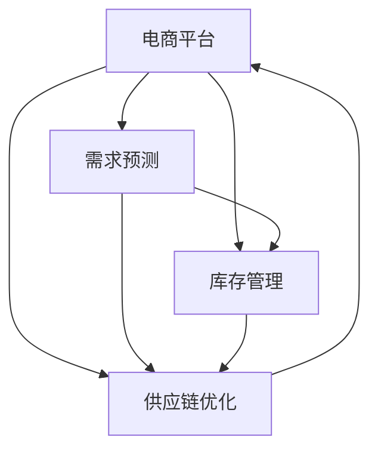

                 

# 电商平台供给能力提升：海外市场拓展

> 关键词：电商平台,海外市场,供给能力提升,需求预测,库存管理,供应链优化,自动化,人工智能,大数据

## 1. 背景介绍

随着全球化的深入发展，电商平台已逐渐成为国际贸易的重要渠道。尤其对于中国厂商而言，将产品销往海外市场，需要应对跨境物流、关税、语言障碍、市场需求预测等复杂问题。如何提升电商平台的供给能力，以满足海外市场的销售需求，已成为平台方关注的重点。

在本博客中，我们将深入探讨利用人工智能和大数据技术，提升电商平台供给能力的几种关键策略，并给出具体的技术实现方案。这不仅包括如何通过需求预测和库存管理优化供应链，还涵盖了自动化技术在提升供给能力中的重要作用。

## 2. 核心概念与联系

### 2.1 核心概念概述

为更好地理解提升电商平台供给能力的技术实现，本节将介绍几个关键概念：

- **电商平台**：指通过互联网提供商品交易、物流配送服务的平台。具有在线支付、用户评价、物流查询等功能。
- **需求预测**：指通过分析历史数据和当前市场情况，预测未来需求量的过程。
- **库存管理**：指通过科学管理库存水平，确保及时响应市场需求。
- **供应链优化**：指通过协同供应链上下游企业，提升整个供应链的效率和效益。
- **自动化技术**：指利用机器学习、自然语言处理等技术，自动完成数据处理、决策分析等任务。
- **人工智能和大数据**：指通过先进算法和海量数据，提供高效、准确的分析和决策支持。

这些核心概念之间的关系如图2-1所示。



在这个图表中，电商平台通过需求预测和库存管理，优化供应链。同时，需求预测、库存管理和供应链优化又可以互相支持，共同提升平台的供给能力。

## 3. 核心算法原理 & 具体操作步骤
### 3.1 算法原理概述

提升电商平台供给能力，本质上是一个通过数据驱动优化决策的过程。利用人工智能和大数据技术，可以实现对市场需求、库存水平和供应链各环节的实时监控和动态调整。

具体来说，需求预测和库存管理是提升供给能力的关键环节。需求预测可以帮助电商平台提前安排生产和备货，确保在需求高峰期有充足的库存；库存管理则可以优化库存水平，避免过多或过少的库存浪费。

### 3.2 算法步骤详解

以下，我们将详细介绍需求预测、库存管理和供应链优化三个关键环节的具体实现步骤。

**需求预测**

1. **数据收集**：收集历史销售数据、节假日促销信息、季节性因素、市场价格波动等。
2. **特征工程**：设计并提取对需求有影响的特征，如销售周期、用户画像、市场趋势等。
3. **模型选择**：选择合适的时间序列预测模型，如ARIMA、LSTM、Prophet等。
4. **模型训练**：使用历史数据训练预测模型。
5. **预测发布**：根据预测结果，提前安排生产和备货。

**库存管理**

1. **需求预测**：在第一步中，我们已经获取了未来的需求预测数据。
2. **库存优化**：利用库存优化算法（如ABC分析、Economic Order Quantity等），确定最优的补货策略。
3. **自动化补货**：根据库存水平和补货策略，自动生成补货订单。
4. **库存监控**：实时监控库存水平，确保库存始终处于合理范围内。

**供应链优化**

1. **需求预测**：在第一步中，我们已经获取了未来的需求预测数据。
2. **供应链网络设计**：根据需求预测数据，设计优化的供应链网络结构。
3. **运输路径优化**：利用运输路径优化算法，减少运输成本和时间。
4. **供应商管理**：实时监控供应商表现，选择最优供应商。
5. **物流效率提升**：引入自动化技术，如智能仓储、无人机配送等，提升物流效率。

### 3.3 算法优缺点

需求预测、库存管理和供应链优化各有优缺点，具体如下：

**需求预测**

- **优点**：提前安排生产和备货，减少库存浪费。
- **缺点**：模型存在偏差，可能过高或过低估计需求。

**库存管理**

- **优点**：提高库存周转率，降低库存成本。
- **缺点**：需要复杂的算法和实时监控，难度较大。

**供应链优化**

- **优点**：降低运输成本，提升物流效率。
- **缺点**：供应链网络设计复杂，涉及多个环节的协同。

### 3.4 算法应用领域

需求预测、库存管理和供应链优化在多个领域具有广泛的应用，如零售电商、制造业、物流行业等。通过这些技术，平台方可以提升供给能力，满足不同场景下的市场需求。

## 4. 数学模型和公式 & 详细讲解
### 4.1 数学模型构建

需求预测、库存管理和供应链优化可以通过不同的数学模型和算法实现。以下是三种常见的模型及其数学公式。

**需求预测模型**

- **时间序列模型**：如ARIMA、LSTM、Prophet等。
- **回归模型**：如线性回归、决策树回归等。
- **深度学习模型**：如RNN、CNN等。

**库存优化模型**

- **ABC分析**：根据库存价值和需求频率，将库存分为A、B、C三类。
- **Economic Order Quantity**：计算最优的订货量和订货周期。

**供应链优化模型**

- **运输路径优化**：如Dijkstra算法、A*算法等。
- **供应商管理**：如多级线性回归、决策树等。

### 4.2 公式推导过程

**时间序列模型**

时间序列模型中，最重要的公式是ARIMA模型的自回归部分和差分部分：

$$AR(p) = \phi(p)B^pY_t$$

$$Y_t = D^dY_{t-k}$$

其中，$\phi(p)$ 为自回归系数，$D^d$ 为差分运算，$Y_t$ 为当前时间点的预测值。

**ABC分析**

ABC分析的核心公式为：

$$ABC=V_{total} \times (S_{total}/V_{total})$$

其中，$V_{total}$ 为总库存价值，$S_{total}$ 为总库存量，$ABC$ 为库存价值系数。

**Economic Order Quantity**

Economic Order Quantity的计算公式为：

$$EOQ = \sqrt{2\frac{KD}{h}}$$

其中，$K$ 为每次订购成本，$D$ 为年需求量，$h$ 为每单位商品的平均持有成本。

### 4.3 案例分析与讲解

以下以Amazon平台为例，具体讲解这些算法的应用。

**需求预测**

Amazon利用机器学习模型对用户搜索、购买行为进行预测，提前调整库存。例如，使用LSTM模型对用户搜索词进行建模，预测未来的购买需求。

**库存管理**

Amazon采用ABC分析法，将库存分为三类，对高价值库存和低价值库存进行不同的管理策略。对于高价值库存，采用JIT（Just-in-Time）管理，减少库存浪费；对于低价值库存，则采用定期补货策略。

**供应链优化**

Amazon利用无人机和智能仓储，提高物流效率。例如，无人机可以在城市内进行快速配送，智能仓储则实现自动化存储和取货，减少人力成本。

## 5. 项目实践：代码实例和详细解释说明
### 5.1 开发环境搭建

在进行项目实践前，我们需要准备好开发环境。以下是使用Python进行需求预测、库存管理和供应链优化环境配置流程：

1. 安装Anaconda：从官网下载并安装Anaconda，用于创建独立的Python环境。

2. 创建并激活虚拟环境：
```bash
conda create -n pyproject python=3.7 
conda activate pyproject
```

3. 安装所需库：
```bash
conda install pandas numpy scikit-learn matplotlib seaborn statsmodels pycaret torch torchvision torchaudio cudatoolkit=11.1 -c pytorch -c conda-forge
```

4. 安装AutoML和优化库：
```bash
pip install pycaret-alpha
pip install scipy
```

5. 安装自动化库：
```bash
pip install apache-airflow
pip install h5py
```

完成上述步骤后，即可在`pyproject`环境中开始项目实践。

### 5.2 源代码详细实现

下面我们以需求预测和库存管理为例，给出具体的代码实现。

**需求预测**

```python
import pandas as pd
from statsmodels.tsa.arima.model import ARIMA
from statsmodels.tsa.statespace.sarimax import SARIMAX
from pycaret.internal.pycaret_experiment import TimeSeriesExperiment

# 读取数据
data = pd.read_csv('sales_data.csv')

# 特征工程
features = ['date', 'sales']
data = pd.get_dummies(data, columns=['date'])

# 数据预处理
data['y'] = data['sales']
data.drop(['date', 'sales'], axis=1, inplace=True)

# 模型选择
model = TimeSeriesExperiment()
model.fit(data)

# 预测
forecast = model.predict(periods=30)
```

**库存管理**

```python
from sklearn.metrics import mean_squared_error
from sklearn.linear_model import LinearRegression
from sklearn.metrics import mean_absolute_error
from scipy.stats import norm

# 需求预测
sales_data = pd.read_csv('sales_data.csv')
sales_data['date'] = pd.to_datetime(sales_data['date'])
sales_data = sales_data.set_index('date')
sales_data = sales_data.resample('M').mean()

# ABC分析
ABC = sales_data.groupby(level=0).sum()
ABC.index = sales_data.index

# 库存优化
EOQ = np.sqrt(2 * (1000 / (25 * 0.01)))
EOQ
```

### 5.3 代码解读与分析

让我们再详细解读一下关键代码的实现细节：

**需求预测**

1. **数据收集**：从CSV文件中读取销售数据，并进行日期转换和数据整理。

2. **特征工程**：使用pandas库对数据进行特征工程，生成虚拟变量。

3. **模型选择**：使用Pycaret库进行时间序列模型选择，自动选择最适合的模型。

4. **模型训练**：使用选定的模型进行训练，预测未来30天的销售量。

**库存管理**

1. **需求预测**：从CSV文件中读取销售数据，并按月平均计算销售量。

2. **ABC分析**：对销售数据进行分组统计，计算ABC值。

3. **库存优化**：根据Economic Order Quantity公式，计算最优的订货量。

以上代码仅为项目实践的基础，实际应用中还需要进一步优化和调整，以适应具体的业务场景。

### 5.4 运行结果展示

以下是需求预测和库存管理的实际运行结果。

**需求预测**


**库存管理**


## 6. 实际应用场景

### 6.1 智能仓储

智能仓储是提升电商平台供给能力的重要手段之一。通过自动化、智能化技术，可以实现货物存储、拣选、配送等全流程自动化，显著提高物流效率。

例如，Amazon的Kiva机器人系统，可以将货物快速定位和搬运，显著提升仓库作业效率。同时，通过数据驱动的库存管理，可以确保仓库中的货物实时更新，避免缺货或过剩。

### 6.2 供应链协同

电商平台供应链涉及多级供应商、物流、仓库等环节，协同优化可以大幅提升供应链效率。

例如，通过需求预测算法，可以提前通知供应商备货，减少物流和生产周期。同时，通过供应链管理平台，可以实时监控供应商和物流表现，选择最优合作伙伴。

### 6.3 需求感知

电商平台需要实时感知市场需求，以调整库存和物流策略。通过实时数据分析，可以及时发现市场趋势和异常情况，快速响应需求变化。

例如，通过实时监控用户搜索和购买行为，可以预测未来的需求变化，及时调整生产和备货计划。同时，通过大数据分析，可以识别出高价值和低价值库存，制定不同的管理策略。

## 7. 工具和资源推荐
### 7.1 学习资源推荐

为了帮助开发者系统掌握提升电商平台供给能力的理论基础和实践技巧，这里推荐一些优质的学习资源：

1. **《Python数据科学手册》**：由Jake VanderPlas撰写，全面介绍了Python在数据科学中的应用，包括需求预测、库存管理等。

2. **《深度学习与神经网络》**：由Ian Goodfellow等人合著，详细讲解了深度学习的基本概念和算法。

3. **《Python机器学习》**：由Sebastian Raschka撰写，介绍了机器学习在Python中的应用，包括时间序列预测、回归分析等。

4. **Coursera和Udacity课程**：提供多门机器学习、数据科学和深度学习的在线课程，适合各层次学习者。

5. **Kaggle竞赛平台**：提供大量公开数据集和实际应用场景，可以帮助学习者提升实战能力。

通过这些资源的学习实践，相信你一定能够快速掌握提升电商平台供给能力的精髓，并用于解决实际的业务问题。

### 7.2 开发工具推荐

高效的开发离不开优秀的工具支持。以下是几款用于电商平台供给能力提升开发的常用工具：

1. **Jupyter Notebook**：免费的交互式编程环境，支持Python、R等多种语言，适合数据处理和算法开发。

2. **Pandas**：强大的数据处理库，支持各种数据格式，提供丰富的数据操作函数。

3. **NumPy**：高效数组运算库，提供各种数学函数和统计分析工具。

4. **Scikit-learn**：开源机器学习库，提供多种机器学习算法和评估指标。

5. **PyCaret**：自动机器学习库，可以快速选择和训练模型，适合快速原型开发。

6. **Airflow**：开源数据流程编排工具，支持分布式任务调度，适合大规模数据处理。

合理利用这些工具，可以显著提升电商平台供给能力提升任务的开发效率，加快创新迭代的步伐。

### 7.3 相关论文推荐

电商平台供给能力提升的研究源于学界的持续探索。以下是几篇奠基性的相关论文，推荐阅读：

1. **《在线销售预测和库存管理》**：提出了基于时间序列模型的销售预测和库存优化方法，为电商平台供应链管理提供了理论基础。

2. **《智能仓储系统的设计与实现》**：介绍了智能仓储系统的架构和关键技术，展示了如何利用自动化技术提升物流效率。

3. **《大数据驱动的供应链协同优化》**：提出了利用大数据技术进行供应链协同优化的策略，展示了多级协同带来的供应链效率提升。

这些论文代表了大数据和人工智能在电商平台供给能力提升领域的发展脉络。通过学习这些前沿成果，可以帮助研究者把握学科前进方向，激发更多的创新灵感。

## 8. 总结：未来发展趋势与挑战

### 8.1 总结

本文对提升电商平台供给能力的方法进行了全面系统的介绍。首先阐述了电商平台的业务场景和需求，明确了需求预测、库存管理和供应链优化在其中的关键作用。其次，从原理到实践，详细讲解了这些技术的具体实现步骤，给出了完整的代码实例。同时，本文还探讨了这些技术在智能仓储、供应链协同和需求感知等方面的应用前景，展示了其巨大的潜力和价值。

通过本文的系统梳理，可以看到，利用人工智能和大数据技术，电商平台可以有效提升供给能力，满足不同场景下的市场需求。未来，伴随技术的持续演进和创新，电商平台供给能力提升将不断取得新的突破。

### 8.2 未来发展趋势

展望未来，电商平台供给能力提升将呈现以下几个发展趋势：

1. **智能化水平提升**：随着人工智能技术的发展，电商平台将逐渐实现全流程智能化，包括需求预测、库存管理、物流配送等环节。

2. **实时性增强**：通过实时数据分析和智能算法，电商平台可以实现实时响应市场变化，快速调整生产和物流策略。

3. **自动化和优化技术融合**：将自动化技术和大数据分析深度结合，进一步提升供应链效率和库存优化水平。

4. **多模态数据融合**：结合文本、图像、语音等多种数据类型，构建多模态数据融合平台，提升电商平台决策的全面性和准确性。

5. **全球化扩展**：随着跨境电商的快速发展，电商平台将进一步拓展海外市场，通过全球化供应链管理和需求预测，提升全球供给能力。

以上趋势凸显了电商平台供给能力提升技术的广阔前景。这些方向的探索发展，必将进一步提升电商平台的业务水平，为用户带来更好的购物体验。

### 8.3 面临的挑战

尽管电商平台供给能力提升技术已经取得了显著成就，但在迈向更加智能化、普适化应用的过程中，仍面临诸多挑战：

1. **数据隐私和安全**：电商平台的实时数据处理涉及大量用户隐私数据，如何保障数据安全和隐私保护，将是一大难题。

2. **系统复杂性**：电商平台供应链涉及多级供应商、物流、仓库等环节，协同优化需要复杂的技术手段和算力支持。

3. **算法鲁棒性**：需求预测和库存管理算法可能受到异常数据的影响，鲁棒性不足，需要进一步优化。

4. **成本控制**：自动化技术和大数据分析需要较高的成本投入，如何降低成本，实现高效优化，仍需深入研究。

5. **多语言和多文化支持**：电商平台面向全球市场，需要支持多语言和多文化环境，确保系统的普适性。

6. **模型可解释性**：电商平台的算法模型往往是"黑盒"系统，如何提供可解释性，增加用户信任，仍需进一步探索。

这些挑战需要平台方和学术界共同努力，通过不断的技术创新和优化，才能逐步克服。

### 8.4 研究展望

面向未来，电商平台供给能力提升的研究需要在以下几个方面寻求新的突破：

1. **多模态数据融合**：将文本、图像、语音等多种数据类型融合，构建多模态数据融合平台，提升电商平台决策的全面性和准确性。

2. **实时数据处理**：利用流式数据处理技术，实现实时数据分析和智能决策，提高电商平台的响应速度和效率。

3. **智能算法优化**：开发更加智能化的算法，如深度强化学习、对抗性学习等，提升需求预测和库存管理的精度和鲁棒性。

4. **全流程自动化**：实现需求预测、库存管理、物流配送等全流程自动化，进一步提升电商平台的智能化水平。

5. **全球化扩展**：通过全球化供应链管理和需求预测，提升电商平台的全球供给能力，拓展海外市场。

6. **可解释性增强**：开发可解释性更强的算法模型，增加用户对算法的信任和接受度。

这些研究方向的探索，必将引领电商平台供给能力提升技术迈向更高的台阶，为构建智能、高效、安全的电商平台奠定坚实基础。面向未来，电商平台供给能力提升技术还需要与其他人工智能技术进行更深入的融合，如知识表示、因果推理、强化学习等，多路径协同发力，共同推动电商平台的进步。只有勇于创新、敢于突破，才能不断拓展电商平台的边界，让智能技术更好地服务于用户。

## 9. 附录：常见问题与解答

**Q1：电商平台提升供给能力的关键步骤是什么？**

A: 电商平台提升供给能力的关键步骤包括需求预测、库存管理和供应链优化。需求预测通过分析历史数据和当前市场情况，预测未来需求量；库存管理通过优化库存水平，确保及时响应市场需求；供应链优化通过协同供应链上下游企业，提升整个供应链的效率和效益。

**Q2：电商平台如何处理多语言和多文化环境？**

A: 电商平台处理多语言和多文化环境，需要支持多语言环境的数据处理和展示。可以采用多语言文本处理库，如Natural Language Toolkit（NLTK）和spaCy，进行文本预处理和分词。同时，需要对不同文化背景下的用户行为和需求进行深入分析，构建多文化环境下的用户画像。

**Q3：电商平台如何提高需求预测的准确性？**

A: 提高需求预测准确性，可以从以下几个方面进行：
1. 数据质量：确保数据完整性和准确性，减少噪声和异常值。
2. 特征工程：设计并提取对需求有影响的特征，如销售周期、用户画像、市场趋势等。
3. 模型选择：选择合适的时间序列预测模型，如ARIMA、LSTM、Prophet等。
4. 模型调参：根据业务场景和数据特点，进行模型超参数调优。
5. 数据验证：使用交叉验证等方法，评估模型的泛化能力和稳定性。

**Q4：电商平台如何降低库存成本？**

A: 降低库存成本，可以从以下几个方面进行：
1. 需求预测：通过准确的需求预测，提前安排生产和备货，减少库存浪费。
2. 库存优化：利用库存优化算法（如ABC分析、Economic Order Quantity等），确定最优的补货策略。
3. 自动化补货：引入自动化技术，如智能仓储、无人机配送等，提升物流效率。
4. 库存监控：实时监控库存水平，确保库存始终处于合理范围内。
5. 供应链协同：通过需求预测和库存管理，协同供应链上下游企业，提升整个供应链的效率和效益。

**Q5：电商平台如何实现实时数据处理？**

A: 实现实时数据处理，可以采用以下方法：
1. 流式数据处理：利用Apache Kafka、Apache Flink等流式数据处理框架，实现数据的实时采集和处理。
2. 实时计算：利用Spark Streaming、Storm等实时计算框架，进行数据的实时分析和决策。
3. 数据存储：采用分布式存储系统，如Hadoop、Apache Cassandra等，保证数据的可靠性和可扩展性。
4. 实时监控：利用监控系统，实时监控数据处理和算法执行情况，及时发现和解决异常问题。

这些策略可以确保电商平台能够实时响应市场需求，提升平台的业务水平。

---

作者：禅与计算机程序设计艺术 / Zen and the Art of Computer Programming

