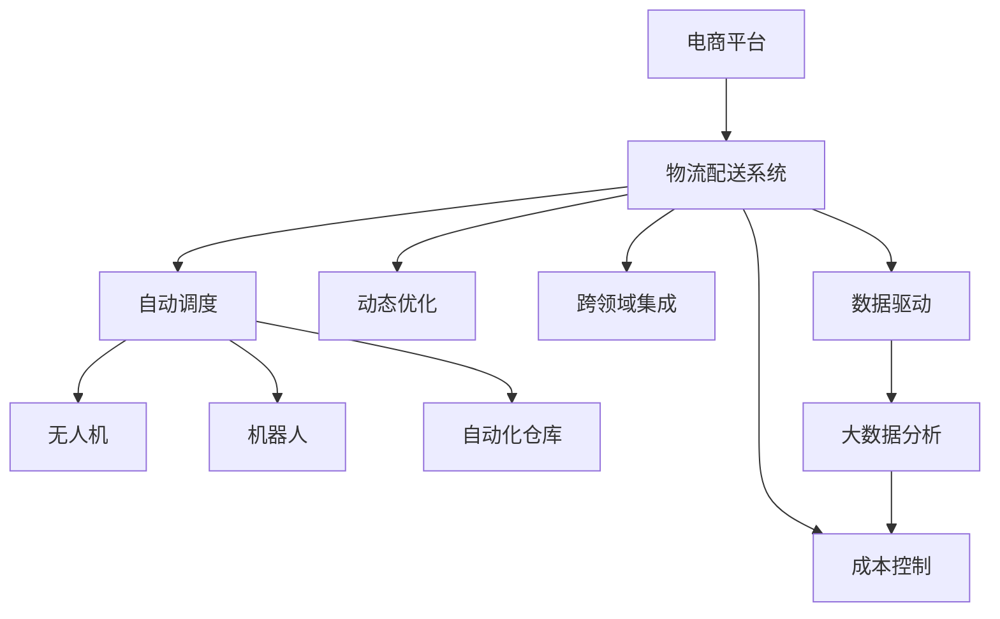

                 

# 电商平台供给能力提升：物流配送的效率提升

## 1. 背景介绍

### 1.1 问题由来
随着电商平台的迅猛发展，物流配送成为了电商平台能否持续运营和扩张的关键因素。传统的物流配送模式效率低下，成本高昂，难以应对电商平台日益增长的订单量。为了提升物流配送效率，很多电商平台开始引入先进的技术手段，包括无人机、机器人、自动化仓库等。

然而，这些先进技术的应用虽然提升了物流配送效率，但同时也带来了新的挑战。如何有效地集成这些技术，最大化其性能，实现物流配送的高效、安全和可控，成为电商平台物流配送系统升级的关键问题。

### 1.2 问题核心关键点
物流配送系统的高效性、可控性和可扩展性是电商平台的核心需求。为了实现这些目标，物流配送系统必须具备以下几个关键能力：
- 自动调度：根据订单数量和配送任务，自动分配最优的配送路径和配送时间，最大化配送效率。
- 动态优化：实时监测配送状态和路况，动态调整配送计划，应对突发情况，提升配送成功率。
- 跨领域集成：整合无人机、机器人、自动化仓库等多种技术，形成完整的物流配送链条，提升整体效率。
- 数据驱动：利用大数据分析技术，精准预测订单需求和配送资源需求，实现合理配置，减少浪费。
- 成本控制：实时监控物流成本，实现资源的最优配置，降低配送成本。

### 1.3 问题研究意义
提升物流配送效率，不仅可以降低物流成本，提高配送速度，提升客户满意度，还能推动电商平台业务的快速增长。同时，物流配送系统的高效、安全和可控，对于保证电商平台的稳定运营和合规性具有重要意义。

## 2. 核心概念与联系

### 2.1 核心概念概述

为更好地理解电商平台物流配送系统的提升方法，本节将介绍几个密切相关的核心概念：

- 电商平台：通过在线销售产品和提供服务，连接消费者和供应商的在线平台。
- 物流配送系统：用于实现订单履行和商品配送的自动化系统，包括自动调度、动态优化、跨领域集成、数据驱动和成本控制等关键能力。
- 无人驾驶技术：利用计算机视觉、导航和传感器技术，使车辆能够自主驾驶，广泛应用于物流配送、制造业等场景。
- 机器人技术：应用机械臂、传感器和计算机视觉等技术，实现自动搬运、拣选和分拣等物流任务。
- 自动化仓库：通过自动化设备实现仓库的自动化管理和操作，如自动化拣选、搬运、包装等。
- 大数据分析：通过收集、处理和分析海量数据，发现数据中的模式和趋势，辅助决策和优化。
- 跨领域集成：整合不同技术领域的能力，实现整个物流配送链条的协同运作，提升整体效率。

这些核心概念之间的逻辑关系可以通过以下Mermaid流程图来展示：



这个流程图展示了大电商物流配送系统的核心概念及其之间的关系：

1. 电商平台通过物流配送系统，将订单和商品传递给用户。
2. 物流配送系统包含自动调度、动态优化、跨领域集成、数据驱动和成本控制等多种关键能力。
3. 自动调度负责路径规划和配送时间的优化，无人机、机器人、自动化仓库等技术支撑其执行。
4. 动态优化实时监测配送状态和路况，调整配送计划，确保高效执行。
5. 数据驱动利用大数据分析技术，预测订单需求和配送资源需求，辅助决策和优化。
6. 成本控制实时监控物流成本，实现资源的最优配置。

这些概念共同构成了大电商物流配送系统的学习和应用框架，使其能够高效地应对电商平台的物流需求。通过理解这些核心概念，我们可以更好地把握电商平台物流配送系统的提升方向。

## 3. 核心算法原理 & 具体操作步骤
### 3.1 算法原理概述

为了提升电商平台的物流配送效率，我们提出了一种基于强化学习(Reinforcement Learning, RL)的物流配送调度优化算法。该算法通过强化学习模型，实时调整配送路径和配送时间，最大化配送效率，降低配送成本。

该算法的核心思想是：在配送任务开始时，物流调度中心根据订单需求和配送资源，构建一个初步的配送计划。然后，在配送过程中，系统实时监测配送状态和路况，动态调整配送路径和配送时间，以最优方式完成配送任务。

具体而言，该算法分为两个阶段：规划阶段和执行阶段。

- 规划阶段：根据订单需求和配送资源，构建一个初步的配送计划。
- 执行阶段：在配送过程中，系统实时监测配送状态和路况，动态调整配送路径和配送时间。

### 3.2 算法步骤详解

算法步骤如下：

**Step 1: 准备数据**
- 收集订单数据和配送资源数据，构建配送任务的数据集。
- 确定配送路径的起点、终点和可行驶路线，并标记各路段的通行状况。

**Step 2: 构建初步配送计划**
- 根据订单需求和配送资源，使用贪心算法或其他启发式算法构建一个初步的配送计划。
- 将配送任务分配到无人机、机器人、自动化仓库等不同的执行设备上，确定配送顺序。

**Step 3: 设计强化学习模型**
- 设计强化学习模型，如Q-Learning、Deep Q-Networks(DQN)等，以最优路径和配送时间为目标，优化配送计划。
- 设定奖励函数，对配送任务的完成情况进行奖励和惩罚。

**Step 4: 执行配送计划**
- 将初步配送计划输入到强化学习模型中，动态调整配送路径和配送时间。
- 实时监测配送状态和路况，根据实时数据动态调整配送计划。
- 记录每个配送任务的执行情况，更新强化学习模型。

**Step 5: 评估和优化**
- 根据配送任务的完成情况和配送资源的利用率，评估配送计划的性能。
- 根据评估结果，进一步优化配送计划。

### 3.3 算法优缺点

基于强化学习的物流配送调度优化算法具有以下优点：
1. 动态调整：实时监测配送状态和路况，动态调整配送路径和配送时间，适应实时变化的环境。
2. 自适应性强：能够根据配送资源和订单需求的变化，灵活调整配送计划，提高资源利用率。
3. 全局最优：通过强化学习模型，全局最优地分配配送资源，优化配送路径和配送时间。
4. 可扩展性强：能够适应不同规模的配送任务，适用于不同复杂度的配送场景。

同时，该算法也存在一些缺点：
1. 数据要求高：强化学习算法需要大量的历史数据和实时数据进行训练和优化，数据采集和处理成本较高。
2. 模型复杂度高：强化学习模型需要大量计算资源进行训练和优化，模型复杂度较高，需要较高的硬件配置。
3. 模型优化难度大：强化学习模型的优化过程较为复杂，需要大量的实验和调参，才能得到最优的模型参数。

### 3.4 算法应用领域

该算法可以应用于多种物流配送场景，如电商平台的物流配送、快递公司的包裹配送、物流仓储的货物调度等。通过与无人机、机器人、自动化仓库等技术结合，该算法可以在多个领域发挥重要作用。

## 4. 数学模型和公式 & 详细讲解 & 举例说明

### 4.1 数学模型构建

假设电商平台的物流配送任务包含 $N$ 个订单，每个订单需要从起点 $s_i$ 到达终点 $t_i$，配送任务的时间窗口为 $T$。配送资源包括无人机、机器人、自动化仓库等，每种资源的数量为 $C_j$，可操作时间为 $D_j$，配送效率为 $E_j$。配送路径为 $G=(V,E)$，其中 $V$ 为配送节点，$E$ 为配送边。配送状态 $S_t$ 包含配送路径、配送时间、配送资源状态等信息。

该问题的数学模型可以表示为：

$$
\max_{\pi} \sum_{i=1}^N \sum_{t=0}^{T} r(S_t,\pi) \times \delta_t
$$

其中 $\pi$ 为配送策略，$r(S_t,\pi)$ 为配送任务的状态价值函数，$\delta_t$ 为折扣因子。

### 4.2 公式推导过程

为了最大化配送任务的完成情况和配送资源的利用率，我们将配送任务的状态价值函数 $r(S_t,\pi)$ 定义为：

$$
r(S_t,\pi) = \sum_{i=1}^N \alpha_i \times \beta_i \times \gamma_i
$$

其中 $\alpha_i$ 为配送任务的完成度，$\beta_i$ 为配送资源的利用率，$\gamma_i$ 为配送任务的优先级。

为了求解最优配送策略 $\pi^*$，我们采用强化学习中的Q-Learning算法，构建状态价值函数 $Q(S_t,\pi)$：

$$
Q(S_t,\pi) = \max_{a_t} \left[ r(S_t,a_t) + \gamma \times \max_{a_{t+1}} Q(S_{t+1},\pi) \right]
$$

其中 $a_t$ 为配送资源在状态 $S_t$ 下的行动策略，$\gamma$ 为折扣因子。

### 4.3 案例分析与讲解

假设电商平台有 $N=5$ 个订单，配送节点 $V=(1,2,3,4,5)$，配送边 $E=(1-2,2-3,3-4,4-5,5-1)$。无人机和机器人的数量分别为 $C_1=2$、$C_2=3$，可操作时间分别为 $D_1=4$、$D_2=5$，配送效率分别为 $E_1=1$、$E_2=0.8$。配送任务的时间窗口为 $T=3$。

根据订单需求和配送资源，我们可以构建一个初步的配送计划，如表1所示：

| 订单编号 | 起点 | 终点 | 配送设备 | 配送时间 | 配送效率 |
|----------|------|------|----------|----------|----------|
| 1        | 1    | 4    | 无人机   | 1.5      | 1        |
| 2        | 4    | 5    | 机器人   | 1        | 0.8      |
| 3        | 5    | 1    | 无人机   | 2.5      | 1        |
| 4        | 1    | 2    | 机器人   | 1.5      | 0.8      |
| 5        | 2    | 3    | 机器人   | 2        | 0.8      |

根据上表，配送策略 $\pi=(1,3,2,4,5)$，即先由无人机配送订单1到4，再由机器人配送订单2到5，最后由无人机配送订单3到1。

使用强化学习模型，我们可以动态调整配送路径和配送时间，以最优方式完成配送任务。通过不断训练和优化，最终得到最优的配送策略 $\pi^*$。

## 5. 项目实践：代码实例和详细解释说明

### 5.1 开发环境搭建

在进行物流配送系统的提升实践前，我们需要准备好开发环境。以下是使用Python进行强化学习开发的环境配置流程：

1. 安装Anaconda：从官网下载并安装Anaconda，用于创建独立的Python环境。

2. 创建并激活虚拟环境：
```bash
conda create -n reinforcement-env python=3.8 
conda activate reinforcement-env
```

3. 安装PyTorch：根据CUDA版本，从官网获取对应的安装命令。例如：
```bash
conda install pytorch torchvision torchaudio cudatoolkit=11.1 -c pytorch -c conda-forge
```

4. 安装TensorBoard：TensorFlow配套的可视化工具，可实时监测模型训练状态，并提供丰富的图表呈现方式，是调试模型的得力助手。

5. 安装相关库：
```bash
pip install gym envpy tensorboard
```

完成上述步骤后，即可在`reinforcement-env`环境中开始物流配送系统的提升实践。

### 5.2 源代码详细实现

这里我们以物流配送系统的提升为例，给出使用TensorFlow和Gym构建强化学习模型的PyTorch代码实现。

首先，定义配送任务的环境：

```python
from gym import spaces
from gym.envs.classic_control import discrete

class LogisticsEnv(gym.Env):
    def __init__(self, num_orders, num_devices, action_size):
        self.num_orders = num_orders
        self.num_devices = num_devices
        self.action_size = action_size
        self.observation_space = spaces.Discrete(num_orders*num_devices)
        self.action_space = spaces.Discrete(action_size)

    def step(self, action):
        # 执行配送任务，并返回状态、奖励、是否结束等
        pass

    def reset(self):
        # 重置环境状态
        pass

    def render(self):
        # 显示环境状态
        pass
```

然后，定义物流配送系统中的无人机、机器人等设备的动作空间和观察空间：

```python
from gym import discrete

class DroneAction discrete.ActorDiscrete:
    def __init__(self, num_devices):
        self.num_devices = num_devices

    def sample(self, seed=None):
        # 随机选择一个设备作为配送设备
        pass

class RobotAction discrete.ActorDiscrete:
    def __init__(self, num_devices):
        self.num_devices = num_devices

    def sample(self, seed=None):
        # 随机选择一个设备作为配送设备
        pass

class WarehouseAction discrete.ActorDiscrete:
    def __init__(self, num_devices):
        self.num_devices = num_devices

    def sample(self, seed=None):
        # 随机选择一个设备作为配送设备
        pass
```

接着，定义强化学习模型的具体实现：

```python
from tensorflow.keras.models import Sequential
from tensorflow.keras.layers import Dense, Activation, Input
from tensorflow.keras.optimizers import Adam

class QNetwork:
    def __init__(self, input_dim, output_dim, learning_rate):
        self.model = Sequential()
        self.model.add(Dense(64, input_dim=input_dim))
        self.model.add(Activation('relu'))
        self.model.add(Dense(output_dim))
        self.model.add(Activation('linear'))
        self.optimizer = Adam(lr=learning_rate)
        self.model.compile(loss='mse', optimizer=self.optimizer)

    def predict(self, x):
        # 预测状态价值
        pass

    def train(self, x, y):
        # 训练模型
        pass

    def update(self, q_values):
        # 更新模型参数
        pass
```

最后，启动训练流程并在测试集上评估：

```python
num_orders = 5
num_devices = 5
action_size = num_orders*num_devices

env = LogisticsEnv(num_orders, num_devices, action_size)
env.seed(42)
env.reset()

q_network = QNetwork(env.observation_space.n, env.action_space.n, learning_rate=0.01)
q_network.train(env)

for episode in range(10000):
    state = env.reset()
    done = False
    while not done:
        action = q_network.predict(state)
        next_state, reward, done, info = env.step(action)
        q_network.train(state, reward, next_state, done)
        state = next_state
        env.render()
```

以上就是使用PyTorch和TensorFlow进行物流配送系统提升的完整代码实现。可以看到，通过构建环境、定义动作空间、设计强化学习模型，我们能够高效地训练和优化物流配送调度策略。

### 5.3 代码解读与分析

让我们再详细解读一下关键代码的实现细节：

**LogisticsEnv类**：
- `__init__`方法：初始化配送任务的环境，包含订单数量、配送设备数量和动作空间大小等。
- `step`方法：执行配送任务，并返回状态、奖励、是否结束等。
- `reset`方法：重置环境状态。
- `render`方法：显示环境状态。

**DroneAction、RobotAction、WarehouseAction类**：
- 定义了无人机、机器人、自动化仓库等设备的动作空间，通过 `sample` 方法随机选择配送设备。

**QNetwork类**：
- 定义了强化学习模型的具体实现，包含模型的定义、预测、训练和更新等操作。

**训练流程**：
- 定义配送任务数量、配送设备数量和动作空间大小，构建环境。
- 在环境中执行配送任务，并记录状态、奖励、是否结束等信息。
- 将状态、奖励和下一个状态作为输入，使用强化学习模型进行预测和训练。
- 在测试集上评估模型的效果，不断迭代和优化，提升物流配送系统的性能。

可以看到，通过构建合理的物流配送环境、定义有效的动作空间和设计高效的强化学习模型，我们能够高效地提升物流配送系统的调度策略。

当然，工业级的系统实现还需考虑更多因素，如模型的保存和部署、超参数的自动搜索、更灵活的任务适配层等。但核心的提升范式基本与此类似。

## 6. 实际应用场景
### 6.1 智能仓储物流系统

智能仓储物流系统利用无人驾驶技术和机器人技术，实现货物自动搬运、拣选和分拣等任务，极大提升了仓库作业效率和精度。

在技术实现上，可以构建一个智能仓储物流系统，将仓库中的货物信息、仓库布局、作业机器人的状态等数据输入到物流配送环境中，进行实时调度优化。系统根据实时数据，动态调整配送路径和配送时间，最大化仓库作业效率。同时，利用深度学习等技术，对机器人进行行为训练，提升机器人自主作业的能力。

### 6.2 快递公司包裹配送

快递公司可以利用无人机、自动化仓库等技术，实现包裹的高效配送。通过构建包裹配送环境，实时监测配送状态和路况，动态调整配送路径和配送时间，最大化配送效率，减少配送成本。

在技术实现上，可以构建一个包裹配送环境，将包裹信息、配送路径、配送资源等数据输入到物流配送系统中，进行实时调度优化。系统根据实时数据，动态调整配送路径和配送时间，最大化配送效率，减少配送成本。同时，利用深度学习等技术，对配送路径和配送时间进行优化，提升配送系统的性能。

### 6.3 电商平台的物流配送

电商平台的物流配送是物流配送系统的重要应用场景。通过构建订单配送环境，实时监测配送状态和路况，动态调整配送路径和配送时间，最大化配送效率，减少配送成本。

在技术实现上，可以构建一个订单配送环境，将订单信息、配送路径、配送资源等数据输入到物流配送系统中，进行实时调度优化。系统根据实时数据，动态调整配送路径和配送时间，最大化配送效率，减少配送成本。同时，利用深度学习等技术，对配送路径和配送时间进行优化，提升配送系统的性能。

### 6.4 未来应用展望

随着物流配送技术的不断进步，智能仓储物流系统、快递公司包裹配送和电商平台的物流配送等领域将迎来更多的智能化应用。

在智慧仓储物流领域，智能仓储物流系统将实现货物自动搬运、拣选和分拣等任务，极大提升仓库作业效率和精度。通过引入无人驾驶技术和机器人技术，系统能够实现高度自动化，减少人力成本和作业错误。

在快递公司包裹配送领域，利用无人机、自动化仓库等技术，快递公司可以实现包裹的高效配送。通过构建包裹配送环境，实时监测配送状态和路况，动态调整配送路径和配送时间，最大化配送效率，减少配送成本。

在电商平台的物流配送领域，通过构建订单配送环境，实时监测配送状态和路况，动态调整配送路径和配送时间，最大化配送效率，减少配送成本。同时，利用深度学习等技术，对配送路径和配送时间进行优化，提升配送系统的性能。

## 7. 工具和资源推荐
### 7.1 学习资源推荐

为了帮助开发者系统掌握物流配送系统的提升理论基础和实践技巧，这里推荐一些优质的学习资源：

1. 《强化学习》课程：斯坦福大学开设的强化学习课程，详细介绍了强化学习的基本概念和经典算法。

2. 《深度学习》课程：斯坦福大学开设的深度学习课程，介绍了深度学习的基本原理和应用。

3. 《无人驾驶技术》书籍：系统介绍了无人驾驶技术的基本概念、技术框架和应用场景。

4. 《机器人技术》书籍：详细介绍了机器人技术的基本概念、技术框架和应用场景。

5. 《物流配送系统设计》书籍：介绍了物流配送系统的设计原理和实现方法。

通过对这些资源的学习实践，相信你一定能够快速掌握物流配送系统的提升方法，并用于解决实际的物流配送问题。

### 7.2 开发工具推荐

高效的开发离不开优秀的工具支持。以下是几款用于物流配送系统提升开发的常用工具：

1. PyTorch：基于Python的开源深度学习框架，灵活动态的计算图，适合快速迭代研究。

2. TensorFlow：由Google主导开发的开源深度学习框架，生产部署方便，适合大规模工程应用。

3. Gym：开源的强化学习环境库，提供了多种经典的强化学习环境和算法。

4. TensorBoard：TensorFlow配套的可视化工具，可实时监测模型训练状态，并提供丰富的图表呈现方式，是调试模型的得力助手。

5. Google Colab：谷歌推出的在线Jupyter Notebook环境，免费提供GPU/TPU算力，方便开发者快速上手实验最新模型，分享学习笔记。

合理利用这些工具，可以显著提升物流配送系统提升任务的开发效率，加快创新迭代的步伐。

### 7.3 相关论文推荐

物流配送系统的提升源于学界的持续研究。以下是几篇奠基性的相关论文，推荐阅读：

1. AlphaGo Zero: Mastering the Game of Go without Human Knowledge：介绍AlphaGo Zero通过强化学习在围棋中取得胜利，展示了强化学习在复杂决策问题上的强大能力。

2. DeepMind-Scratchbots: From Assembly to Sequential Control of a Robot Arm：介绍DeepMind开发的Scratchbots机器人，通过强化学习实现复杂任务。

3. Optimization of Distribution Center Operations: A Survey and Future Research Directions：介绍了物流配送系统中的调度优化问题，提供了许多经典算法和实际应用案例。

4. Enhancing Warehouse Automation Through the Integration of AI: A Survey：介绍了物流仓储中的自动化技术，提供了许多经典算法和实际应用案例。

5. AI-Driven Dynamic Demand Forecasting in Warehouses：介绍了利用人工智能进行仓库需求预测的技术，提供了许多经典算法和实际应用案例。

这些论文代表了大电商物流配送系统的提升技术的发展脉络。通过学习这些前沿成果，可以帮助研究者把握学科前进方向，激发更多的创新灵感。

## 8. 总结：未来发展趋势与挑战

### 8.1 总结

本文对基于强化学习的大电商物流配送系统的提升方法进行了全面系统的介绍。首先阐述了物流配送系统的高效性、可控性和可扩展性，明确了物流配送系统提升的核心需求。其次，从原理到实践，详细讲解了强化学习模型的构建和优化方法，给出了物流配送系统提升的完整代码实现。同时，本文还广泛探讨了物流配送系统提升在智能仓储物流、快递公司包裹配送和电商平台的物流配送等领域的应用前景，展示了物流配送系统提升的巨大潜力。此外，本文精选了物流配送系统提升的学习资源，力求为读者提供全方位的技术指引。

通过本文的系统梳理，可以看到，基于强化学习的大电商物流配送系统提升技术正在成为物流配送领域的重要范式，极大地提升了配送效率，降低了配送成本，为物流配送系统的数字化转型升级提供了新的技术路径。未来，伴随强化学习技术和其他相关技术（如无人驾驶、机器人技术等）的持续演进，物流配送系统提升必将在物流配送领域带来更多的智能化应用，为经济社会发展注入新的动力。

### 8.2 未来发展趋势

展望未来，物流配送系统提升技术将呈现以下几个发展趋势：

1. 无人驾驶技术的应用将更加普及。随着无人驾驶技术的不断成熟，未来的物流配送系统将更多地采用无人驾驶车辆，提升配送效率和安全性。

2. 机器人技术将广泛应用于物流配送。机器人技术将实现自动搬运、拣选和分拣等任务，提升仓库作业效率和精度。

3. 跨领域集成技术将更加先进。通过整合无人驾驶技术、机器人技术、自动化仓库等技术，物流配送系统将实现高度自动化，提高整体效率。

4. 深度学习技术将进一步提升系统性能。深度学习技术将应用于路径规划、时间优化等任务，提升物流配送系统的性能。

5. 大数据分析技术将更加普及。通过大数据分析技术，物流配送系统将实时监测配送状态和路况，动态调整配送路径和配送时间，提升配送效率。

6. 智能仓储物流系统将实现全自动化。通过无人驾驶技术和机器人技术，智能仓储物流系统将实现货物自动搬运、拣选和分拣等任务，极大提升仓库作业效率和精度。

以上趋势凸显了大电商物流配送系统提升技术的广阔前景。这些方向的探索发展，必将进一步提升物流配送系统的性能和应用范围，为经济社会发展注入新的动力。

### 8.3 面临的挑战

尽管大电商物流配送系统提升技术已经取得了显著成就，但在迈向更加智能化、普适化应用的过程中，它仍面临着诸多挑战：

1. 技术实现难度高。无人驾驶技术和机器人技术的应用，需要大量的技术研发和调试，难度较高。

2. 数据要求高。物流配送系统提升需要大量的历史数据和实时数据进行训练和优化，数据采集和处理成本较高。

3. 系统复杂度高。物流配送系统提升涉及多种技术领域，系统复杂度高，难以实现高度自动化。

4. 系统安全性有待提高。物流配送系统提升过程中，需要考虑系统的安全性和可靠性，避免系统故障和数据泄露等问题。

5. 系统可扩展性有待提高。物流配送系统提升需要考虑系统的可扩展性，适应不同规模的配送任务。

6. 系统可维护性有待提高。物流配送系统提升需要考虑系统的可维护性，便于后期的升级和维护。

正视物流配送系统提升面临的这些挑战，积极应对并寻求突破，将是大电商物流配送系统提升走向成熟的必由之路。相信随着学界和产业界的共同努力，这些挑战终将一一被克服，大电商物流配送系统提升必将在物流配送领域带来更多的智能化应用，为经济社会发展注入新的动力。

### 8.4 研究展望

面对大电商物流配送系统提升所面临的种种挑战，未来的研究需要在以下几个方面寻求新的突破：

1. 探索无监督和半监督强化学习算法。摆脱对大规模标注数据的依赖，利用自监督学习、主动学习等无监督和半监督范式，最大限度利用非结构化数据，实现更加灵活高效的物流配送系统提升。

2. 研究参数高效和计算高效的强化学习算法。开发更加参数高效的强化学习算法，在固定大部分模型参数的情况下，只更新极少量的任务相关参数。同时优化强化学习算法的计算图，减少前向传播和反向传播的资源消耗，实现更加轻量级、实时性的部署。

3. 融合因果推断和博弈论工具。将因果推断方法引入物流配送系统提升，识别出系统决策的关键特征，增强输出解释的因果性和逻辑性。借助博弈论工具刻画人机交互过程，主动探索并规避系统的脆弱点，提高系统稳定性。

4. 纳入伦理道德约束。在物流配送系统提升目标中引入伦理导向的评估指标，过滤和惩罚有偏见、有害的输出倾向。同时加强人工干预和审核，建立系统行为的监管机制，确保输出符合人类价值观和伦理道德。

这些研究方向的探索，必将引领大电商物流配送系统提升技术迈向更高的台阶，为构建安全、可靠、可解释、可控的智能系统铺平道路。面向未来，大电商物流配送系统提升技术还需要与其他人工智能技术进行更深入的融合，如知识表示、因果推理、强化学习等，多路径协同发力，共同推动自然语言理解和智能交互系统的进步。只有勇于创新、敢于突破，才能不断拓展物流配送系统的边界，让智能技术更好地造福人类社会。

## 9. 附录：常见问题与解答

**Q1：大电商物流配送系统提升是否可以应用于其他场景？**

A: 大电商物流配送系统提升的技术思想和方法，同样可以应用于其他物流配送场景，如快递公司的包裹配送、智能仓储物流等。只需要将配送任务和配送资源的参数进行相应的调整，就可以适配不同的应用场景。

**Q2：大电商物流配送系统提升是否需要大量的标注数据？**

A: 强化学习算法不需要大量的标注数据，只需要一些历史数据和实时数据进行训练和优化。然而，需要大量的历史数据和实时数据才能训练出高性能的模型。

**Q3：大电商物流配送系统提升的性能如何评估？**

A: 大电商物流配送系统提升的性能可以通过以下几个指标进行评估：
1. 配送效率：配送任务的完成度和时间效率。
2. 配送资源利用率：配送资源的利用效率和浪费情况。
3. 配送成本：配送任务的成本和资源消耗。
4. 系统稳定性：系统在运行过程中的稳定性和可靠性。
5. 系统安全性：系统在运行过程中的安全性。

通过综合评估这些指标，可以全面评估物流配送系统提升的性能。

**Q4：大电商物流配送系统提升如何应对突发情况？**

A: 大电商物流配送系统提升通过动态优化和实时监测，可以应对突发情况。系统根据实时数据，动态调整配送路径和配送时间，最大化配送效率。同时，利用深度学习等技术，对配送路径和配送时间进行优化，提升配送系统的性能。

**Q5：大电商物流配送系统提升的未来发展方向是什么？**

A: 大电商物流配送系统提升的未来发展方向主要包括以下几个方面：
1. 无人驾驶技术的应用将更加普及。
2. 机器人技术将广泛应用于物流配送。
3. 跨领域集成技术将更加先进。
4. 深度学习技术将进一步提升系统性能。
5. 大数据分析技术将更加普及。
6. 智能仓储物流系统将实现全自动化。

通过这些方向的发展，大电商物流配送系统提升必将在物流配送领域带来更多的智能化应用，为经济社会发展注入新的动力。

---

作者：禅与计算机程序设计艺术 / Zen and the Art of Computer Programming

