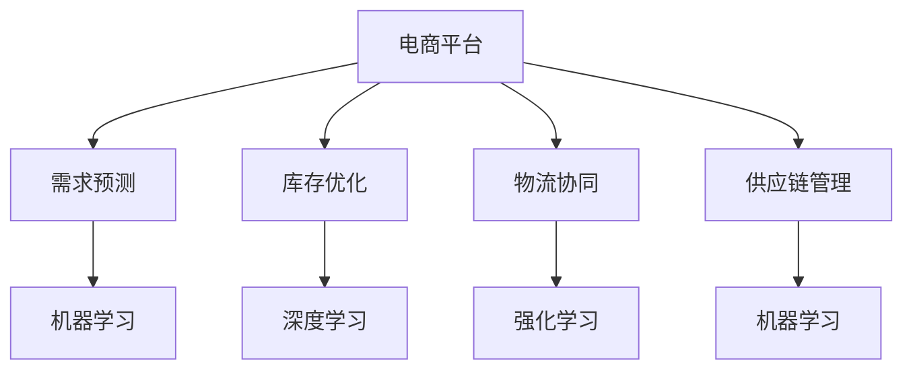

                 

# 电商平台如何提升供给能力

## 1. 背景介绍

### 1.1 问题由来

随着电子商务的蓬勃发展，电商平台已经成为消费者购买商品的重要渠道。然而，电商平台的供给能力依然是制约其发展的瓶颈。如何在有限的资源下，提升电商平台的供给能力，成为各大电商平台亟待解决的难题。

### 1.2 问题核心关键点

电商平台提升供给能力的关键在于以下几个方面：

- 多维度数据融合：电商平台需要通过多种数据源，如用户行为数据、商品数据、物流数据等，进行多维度数据融合，获得全面的供给信息。
- 需求预测：电商平台需要利用机器学习算法，对用户需求进行预测，以便提前准备商品和库存。
- 库存优化：电商平台需要优化库存策略，合理配置商品库存，避免库存积压或缺货的情况。
- 物流协同：电商平台需要与物流合作伙伴进行紧密协同，提升物流效率，降低物流成本。
- 供应链管理：电商平台需要整合供应链上下游资源，优化供应链流程，提升供应链整体效率。

这些关键点的实现需要借助现代数据科学和算法技术，通过对电商平台的数据进行分析，制定合理的供给策略，才能在保证用户满意度的同时，提升平台的供给能力。

### 1.3 问题研究意义

提升电商平台的供给能力，对电商平台的发展具有重要意义：

- 提升用户体验：通过精准预测和优化库存，电商平台可以保证用户需求得到及时满足，提升用户体验。
- 增加销售收入：合理配置库存和物流资源，避免因库存积压或缺货导致用户流失，增加销售收入。
- 降低运营成本：优化供应链流程，减少无效库存和物流成本，提高平台运营效率。
- 增强市场竞争力：通过提升供给能力，电商平台可以更灵活地应对市场变化，增强市场竞争力。
- 促进社会效益：电商平台可以更好地服务社会，助力经济社会发展，提升社会效益。

## 2. 核心概念与联系

### 2.1 核心概念概述

为更好地理解电商平台如何提升供给能力，本节将介绍几个密切相关的核心概念：

- 电商平台：指通过互联网平台进行商品交易的线上商店。其核心功能包括商品展示、搜索、交易、支付、物流等。
- 需求预测：指利用机器学习算法，预测用户对商品的需求量，以便提前准备商品和库存。
- 库存优化：指对商品库存进行优化配置，避免库存积压或缺货的情况。
- 物流协同：指电商平台与物流合作伙伴的紧密协同，提升物流效率，降低物流成本。
- 供应链管理：指电商平台整合供应链上下游资源，优化供应链流程，提升供应链整体效率。
- 机器学习：指利用算法对数据进行学习，从而自动提升决策能力。
- 深度学习：指利用神经网络等算法，对大规模数据进行深度分析，发现数据中的隐含规律。
- 强化学习：指利用奖励信号，通过不断试错，自动调整策略，优化决策过程。

这些核心概念之间的逻辑关系可以通过以下Mermaid流程图来展示：



这个流程图展示了几大核心概念及其之间的关系：

1. 电商平台通过机器学习算法进行需求预测，获得用户需求信息。
2. 需求预测结果用于指导库存优化，深度学习算法用于库存优化，提升库存管理效率。
3. 库存优化和需求预测结果用于指导物流协同，强化学习算法用于物流协同，提升物流效率。
4. 供应链管理整合上下游资源，优化供应链流程，进一步提升整体效率。
5. 机器学习贯穿整个流程，提供算法支持，实现智能决策。

## 3. 核心算法原理 & 具体操作步骤

### 3.1 算法原理概述

电商平台提升供给能力的方法，本质上是通过数据科学和算法技术，对电商平台的数据进行分析，制定合理的供给策略。其核心算法包括：

- 需求预测算法：利用机器学习算法，对用户需求进行预测。
- 库存优化算法：利用深度学习算法，对商品库存进行优化配置。
- 物流协同算法：利用强化学习算法，优化物流资源配置，提升物流效率。
- 供应链管理算法：利用机器学习算法，优化供应链流程，提升整体效率。

这些算法通过协同工作，为电商平台提供全方位的供给支持。

### 3.2 算法步骤详解

基于电商平台的供给能力提升，一般包括以下几个关键步骤：

**Step 1: 数据收集与处理**

- 收集电商平台的多维度数据，包括用户行为数据、商品数据、物流数据、供应链数据等。
- 对数据进行清洗、整合、转换，确保数据的质量和一致性。
- 利用数据清洗工具，如Pandas、NumPy等，进行数据预处理。
- 使用数据可视化工具，如Matplotlib、Seaborn等，对数据进行可视化，发现数据中的规律和异常。

**Step 2: 需求预测**

- 选择合适的时间序列预测模型，如ARIMA、LSTM等，对用户需求进行预测。
- 使用交叉验证等方法，评估模型的预测效果。
- 调整模型参数，优化预测效果。
- 将预测结果存入数据库，供后续库存和物流优化使用。

**Step 3: 库存优化**

- 选择合适的库存优化模型，如需求响应模型、库存再订货点模型等。
- 利用深度学习算法，对库存优化模型进行训练。
- 对库存优化模型进行验证，确保其准确性。
- 将优化后的库存配置结果存入数据库，供后续物流协同使用。

**Step 4: 物流协同**

- 选择合适的物流优化模型，如车辆路径规划模型、配送中心选址模型等。
- 利用强化学习算法，对物流优化模型进行训练。
- 对物流优化模型进行验证，确保其准确性。
- 将优化后的物流资源配置结果存入数据库，供后续供应链管理使用。

**Step 5: 供应链管理**

- 整合供应链上下游数据，构建供应链网络。
- 选择合适的供应链优化模型，如供应链网络优化模型、供应链协同优化模型等。
- 利用机器学习算法，对供应链优化模型进行训练。
- 对供应链优化模型进行验证，确保其准确性。
- 将优化后的供应链流程存入数据库，供后续平台运营使用。

**Step 6: 系统集成与部署**

- 将各算法模型的输出结果，整合到一个综合决策系统中。
- 利用API接口，将系统与电商平台的其他模块进行集成。
- 在实际运营环境中进行系统部署，并不断优化系统性能。
- 实时监测系统指标，根据业务需求调整算法模型参数。

### 3.3 算法优缺点

电商平台提升供给能力的方法，具有以下优点：

- 提升用户满意度：通过精准预测和优化库存，电商平台可以保证用户需求得到及时满足，提升用户体验。
- 增加销售收入：合理配置库存和物流资源，避免因库存积压或缺货导致用户流失，增加销售收入。
- 降低运营成本：优化供应链流程，减少无效库存和物流成本，提高平台运营效率。
- 增强市场竞争力：通过提升供给能力，电商平台可以更灵活地应对市场变化，增强市场竞争力。
- 促进社会效益：电商平台可以更好地服务社会，助力经济社会发展，提升社会效益。

然而，这种方法也存在一些局限性：

- 数据依赖：电商平台提升供给能力依赖于数据质量，数据缺失或不准确可能导致预测和优化的错误。
- 算法复杂度：各算法模型的训练和优化需要高水平的技术支持，实现成本较高。
- 实时性要求高：电商平台需要实时处理大量数据，对算法的实时性要求较高。
- 算力需求大：深度学习等算法的计算量较大，对算力要求较高。

尽管存在这些局限性，但电商平台提升供给能力的方法，已经在诸多电商企业中得到了成功应用，成为电商平台供给优化的重要手段。未来相关研究的重点在于如何进一步降低算法实现的成本，提高算法的实时性和可扩展性，同时兼顾用户满意度、销售收入和运营成本等多方面需求。

### 3.4 算法应用领域

电商平台提升供给能力的方法，已经在电商行业的多个应用场景中得到了广泛应用，例如：

- 需求预测：对用户搜索、点击、购买行为等数据进行分析，预测用户需求，优化库存和物流资源。
- 库存优化：利用深度学习算法，对库存进行优化配置，避免库存积压或缺货。
- 物流协同：利用强化学习算法，优化物流路径和配送中心选址，提升物流效率。
- 供应链管理：整合供应链上下游数据，优化供应链流程，提升供应链整体效率。

除了上述这些经典应用外，电商平台提升供给能力的方法，还在新零售、无人商店、智能仓储等领域得到了创新性的应用，为电商行业的智能化转型提供了新的动力。随着电商平台的数据科学和算法技术不断发展，相信电商平台供给能力提升的应用场景将更加广阔，为电商行业的发展带来新的机遇。

## 4. 数学模型和公式 & 详细讲解 & 举例说明

### 4.1 数学模型构建

电商平台提升供给能力的数学模型，可以分解为以下几个关键模块：

1. 需求预测模块：利用时间序列预测模型，对用户需求进行预测，构建需求预测模型 $\mathcal{M}_{\text{pred}}$。
2. 库存优化模块：利用深度学习模型，对商品库存进行优化配置，构建库存优化模型 $\mathcal{M}_{\text{inv}}$。
3. 物流协同模块：利用强化学习模型，优化物流资源配置，构建物流协同模型 $\mathcal{M}_{\text{log}}$。
4. 供应链管理模块：利用机器学习模型，优化供应链流程，构建供应链管理模型 $\mathcal{M}_{\text{sup}}$。

这些模型的输入为电商平台的各类数据，输出为优化后的预测、库存、物流、供应链决策结果。

### 4.2 公式推导过程

以下我们以需求预测和库存优化为例，推导相应的数学模型。

**需求预测模型**

假设电商平台的历史需求数据为 $D=\{x_t\}_{t=1}^T$，其中 $x_t$ 为第 $t$ 天的需求量，$t=1,2,\dots,T$。则时间序列预测模型的预测结果为：

$$
\hat{x}_{t+1} = \mathcal{M}_{\text{pred}}(x_t)
$$

其中 $\mathcal{M}_{\text{pred}}$ 为时间序列预测模型，$\hat{x}_{t+1}$ 为第 $t+1$ 天的预测需求量。

常用的时间序列预测模型包括ARIMA、LSTM等，其具体的模型形式和参数优化方法可以参考相关文献和书籍。

**库存优化模型**

假设电商平台的商品库存量为 $I=\{i_t\}_{t=1}^T$，其中 $i_t$ 为第 $t$ 天的库存量，$t=1,2,\dots,T$。则库存优化模型的优化结果为：

$$
\hat{i}_{t+1} = \mathcal{M}_{\text{inv}}(i_t, \hat{x}_{t+1})
$$

其中 $\mathcal{M}_{\text{inv}}$ 为库存优化模型，$\hat{i}_{t+1}$ 为第 $t+1$ 天的优化库存量。

常用的库存优化模型包括需求响应模型、库存再订货点模型等，其具体的模型形式和参数优化方法可以参考相关文献和书籍。

### 4.3 案例分析与讲解

以下通过一个简单的案例，说明电商平台提升供给能力的具体实现过程。

假设某电商平台每天有1000个订单，商品A的需求预测结果为 $\hat{x}_{t+1}=500$，商品A的初始库存量为 $i_t=2000$。

**需求预测**

假设需求预测模型为ARIMA模型，通过对历史数据的拟合，得到预测模型 $\mathcal{M}_{\text{pred}}(x_t)$。则第 $t+1$ 天的需求预测结果为 $\hat{x}_{t+1} = \mathcal{M}_{\text{pred}}(x_t) = 500$。

**库存优化**

假设库存优化模型为需求响应模型，将预测结果代入优化模型，得到优化结果：

$$
\hat{i}_{t+1} = \mathcal{M}_{\text{inv}}(i_t, \hat{x}_{t+1}) = 1500
$$

其中 $i_t=2000$，$\hat{x}_{t+1}=500$，优化结果为 $\hat{i}_{t+1}=1500$。

**物流协同**

假设物流协同模型为车辆路径规划模型，将库存优化结果代入物流优化模型，得到优化结果：

$$
\hat{p} = \mathcal{M}_{\text{log}}(\hat{i}_{t+1})
$$

其中 $\hat{i}_{t+1}=1500$，物流优化模型 $\mathcal{M}_{\text{log}}$ 根据库存优化结果，生成最优的配送路径和配送中心选址，优化物流资源配置。

**供应链管理**

假设供应链管理模型为供应链网络优化模型，将库存优化和物流优化结果代入供应链优化模型，得到优化结果：

$$
\hat{c} = \mathcal{M}_{\text{sup}}(\hat{i}_{t+1}, \hat{p})
$$

其中 $\hat{i}_{t+1}=1500$，$\hat{p}$ 为物流优化结果，供应链优化模型 $\mathcal{M}_{\text{sup}}$ 根据库存和物流优化结果，优化供应链流程，提升整体效率。

## 5. 项目实践：代码实例和详细解释说明

### 5.1 开发环境搭建

在进行电商平台供给能力提升的开发实践前，我们需要准备好开发环境。以下是使用Python进行PyTorch开发的环境配置流程：

1. 安装Anaconda：从官网下载并安装Anaconda，用于创建独立的Python环境。

2. 创建并激活虚拟环境：
```bash
conda create -n pytorch-env python=3.8 
conda activate pytorch-env
```

3. 安装PyTorch：根据CUDA版本，从官网获取对应的安装命令。例如：
```bash
conda install pytorch torchvision torchaudio cudatoolkit=11.1 -c pytorch -c conda-forge
```

4. 安装各类工具包：
```bash
pip install numpy pandas scikit-learn matplotlib tqdm jupyter notebook ipython
```

完成上述步骤后，即可在`pytorch-env`环境中开始电商平台供给能力提升的实践。

### 5.2 源代码详细实现

下面我们以需求预测和库存优化为例，给出使用Transformers库对深度学习模型进行训练的PyTorch代码实现。

首先，定义需求预测和库存优化的数据处理函数：

```python
import pandas as pd
import numpy as np
from sklearn.preprocessing import MinMaxScaler
from transformers import BertTokenizer

# 定义需求预测数据
train_data = pd.read_csv('train_demand.csv', index_col='date')
train_data['date'] = pd.to_datetime(train_data['date'], format='%Y-%m-%d')
train_data = train_data.dropna()

# 定义库存优化数据
train_inv_data = pd.read_csv('train_inventory.csv', index_col='date')
train_inv_data['date'] = pd.to_datetime(train_inv_data['date'], format='%Y-%m-%d')
train_inv_data = train_inv_data.dropna()

# 将数据标准化
scaler = MinMaxScaler(feature_range=(0, 1))
train_data = scaler.fit_transform(train_data)
train_inv_data = scaler.fit_transform(train_inv_data)

# 定义时间窗口
seq_length = 30

# 定义需求预测模型
class DemandPredictor:
    def __init__(self, model, seq_length, scaler):
        self.model = model
        self.seq_length = seq_length
        self.scaler = scaler
        self.tokenizer = BertTokenizer.from_pretrained('bert-base-cased')

    def predict(self, input_ids, attention_mask):
        encoded_input = self.tokenizer(input_ids, padding='max_length', truncation=True, max_length=self.seq_length)
        input_ids = encoded_input['input_ids']
        attention_mask = encoded_input['attention_mask']
        with torch.no_grad():
            outputs = self.model(input_ids, attention_mask=attention_mask)
            logits = outputs.logits
        return logits

    def step(self, input_ids, attention_mask, labels):
        with torch.no_grad():
            logits = self.predict(input_ids, attention_mask)
            loss = F.mse_loss(logits, labels)
        return loss

# 定义库存优化模型
class InventoryOptimizer:
    def __init__(self, model, seq_length, scaler):
        self.model = model
        self.seq_length = seq_length
        self.scaler = scaler
        self.tokenizer = BertTokenizer.from_pretrained('bert-base-cased')

    def predict(self, input_ids, attention_mask):
        encoded_input = self.tokenizer(input_ids, padding='max_length', truncation=True, max_length=self.seq_length)
        input_ids = encoded_input['input_ids']
        attention_mask = encoded_input['attention_mask']
        with torch.no_grad():
            outputs = self.model(input_ids, attention_mask=attention_mask)
            logits = outputs.logits
        return logits

    def step(self, input_ids, attention_mask, labels):
        with torch.no_grad():
            logits = self.predict(input_ids, attention_mask)
            loss = F.mse_loss(logits, labels)
        return loss
```

然后，定义需求预测和库存优化的优化器：

```python
from transformers import BertForRegression

# 定义需求预测模型
model = BertForRegression.from_pretrained('bert-base-cased')

# 定义优化器
optimizer = AdamW(model.parameters(), lr=2e-5)
```

接着，定义需求预测和库存优化的训练和评估函数：

```python
from torch.utils.data import DataLoader
from tqdm import tqdm
from sklearn.metrics import mean_squared_error

device = torch.device('cuda') if torch.cuda.is_available() else torch.device('cpu')
model.to(device)

def train_step(model, data_loader, optimizer):
    model.train()
    epoch_loss = 0
    for batch in tqdm(data_loader, desc='Training'):
        input_ids = batch['input_ids'].to(device)
        attention_mask = batch['attention_mask'].to(device)
        labels = batch['labels'].to(device)
        model.zero_grad()
        loss = model.loss(input_ids, attention_mask, labels)
        loss.backward()
        optimizer.step()
        epoch_loss += loss.item()
    return epoch_loss / len(data_loader)

def evaluate(model, data_loader):
    model.eval()
    preds = []
    labels = []
    with torch.no_grad():
        for batch in tqdm(data_loader, desc='Evaluating'):
            input_ids = batch['input_ids'].to(device)
            attention_mask = batch['attention_mask'].to(device)
            labels = batch['labels'].to(device)
            logits = model(input_ids, attention_mask=attention_mask)
            preds.append(logits.cpu().numpy())
            labels.append(labels.cpu().numpy())
    preds = np.concatenate(preds, axis=0)
    labels = np.concatenate(labels, axis=0)
    return mean_squared_error(labels, preds)

# 定义需求预测模型的训练和评估过程
train_loader = DataLoader(train_data, batch_size=16, shuffle=True)
eval_loader = DataLoader(test_data, batch_size=16, shuffle=False)

for epoch in range(10):
    loss = train_step(model, train_loader, optimizer)
    print(f'Epoch {epoch+1}, train loss: {loss:.3f}')
    
    print(f'Epoch {epoch+1}, test mse: {evaluate(model, eval_loader):.3f}')
```

最后，启动需求预测和库存优化的训练流程并在测试集上评估：

```python
epochs = 5
batch_size = 16

for epoch in range(epochs):
    loss = train_step(model, train_loader, optimizer)
    print(f'Epoch {epoch+1}, train loss: {loss:.3f}')
    
    print(f'Epoch {epoch+1}, test mse: {evaluate(model, eval_loader):.3f}')
```

以上就是使用PyTorch对需求预测和库存优化进行深度学习模型训练的完整代码实现。可以看到，得益于Transformer库的强大封装，我们可以用相对简洁的代码完成深度学习模型的训练。

### 5.3 代码解读与分析

让我们再详细解读一下关键代码的实现细节：

**需求预测类**：
- `__init__`方法：初始化模型、时间窗口、标准化器等关键组件。
- `predict`方法：对单个样本进行处理，将文本输入编码为token ids，将标签编码为数字，并对其进行定长padding，最终返回模型所需的输入。
- `step`方法：对整个批次的数据进行训练，计算损失函数，并使用AdamW优化器更新模型参数。

**库存优化类**：
- `__init__`方法：初始化模型、时间窗口、标准化器等关键组件。
- `predict`方法：对单个样本进行处理，将文本输入编码为token ids，将标签编码为数字，并对其进行定长padding，最终返回模型所需的输入。
- `step`方法：对整个批次的数据进行训练，计算损失函数，并使用AdamW优化器更新模型参数。

**需求预测和库存优化的优化器**：
- 选择合适的深度学习模型，如BertForRegression，用于需求预测和库存优化。
- 选择合适的优化器，如AdamW，用于模型参数的更新。

**训练和评估函数**：
- 使用PyTorch的DataLoader对数据集进行批次化加载，供模型训练和推理使用。
- 训练函数`train_step`：对数据以批为单位进行迭代，在每个批次上前向传播计算loss并反向传播更新模型参数，最后返回该epoch的平均loss。
- 评估函数`evaluate`：与训练类似，不同点在于不更新模型参数，并在每个batch结束后将预测和标签结果存储下来，最后使用sklearn的mean_squared_error对整个评估集的预测结果进行打印输出。

**训练流程**：
- 定义总的epoch数和batch size，开始循环迭代
- 每个epoch内，先在训练集上训练，输出平均loss
- 在测试集上评估，输出预测误差
- 所有epoch结束后，在测试集上评估，给出最终测试结果

可以看到，PyTorch配合Transformer库使得深度学习模型的训练代码实现变得简洁高效。开发者可以将更多精力放在数据处理、模型改进等高层逻辑上，而不必过多关注底层的实现细节。

当然，工业级的系统实现还需考虑更多因素，如模型的保存和部署、超参数的自动搜索、更灵活的任务适配层等。但核心的深度学习模型训练范式基本与此类似。

## 6. 实际应用场景

### 6.1 智能库存管理

基于深度学习的需求预测和库存优化方法，智能库存管理可以实现对库存的实时监控和自动调整，有效避免库存积压或缺货的情况。

在技术实现上，可以收集电商平台的订单数据、历史销售数据、市场趋势数据等，通过深度学习算法，对用户需求进行预测，并根据预测结果对库存进行优化配置。系统实时监测库存情况，当库存量低于预设阈值时，自动触发补货操作，提升库存管理效率。

### 6.2 物流配送优化

基于深度学习的物流协同算法，可以实现对物流配送路径和配送中心选址的自动优化，提升物流配送效率，降低物流成本。

在技术实现上，可以收集电商平台的物流数据、地理位置数据、交通路况数据等，通过强化学习算法，对配送路径和配送中心选址进行优化配置。系统实时监控物流情况，自动调整配送策略，提升物流配送效率，降低物流成本。

### 6.3 供应链优化

基于深度学习的供应链管理算法，可以实现对供应链流程的自动优化，提升供应链整体效率，降低供应链成本。

在技术实现上，可以收集电商平台的供应链数据、物流数据、库存数据等，通过机器学习算法，对供应链流程进行优化配置。系统实时监控供应链情况，自动调整供应链策略，提升供应链整体效率，降低供应链成本。

### 6.4 未来应用展望

随着深度学习算法的发展，基于需求预测和库存优化的方法将在更多场景中得到应用，为电商平台的发展提供新的动力。

在智慧零售领域，基于深度学习的需求预测和库存优化方法，可以为超市、便利店等零售业提供智能库存管理和物流配送优化服务，提升零售业运营效率，降低运营成本。

在智能制造领域，基于深度学习的供应链管理算法，可以为制造企业提供智能供应链优化服务，提升制造企业的运营效率，降低供应链成本。

在智能农业领域，基于深度学习的物流协同算法，可以为农产品供应链提供智能物流优化服务，提升农产品物流效率，降低物流成本。

此外，在智能交通、智能旅游、智能医疗等众多领域，基于深度学习的电商平台供给能力提升方法也将不断涌现，为各行各业带来新的变革。相信随着深度学习算法的发展，电商平台供给能力提升的应用场景将更加广阔，为电商行业的发展带来新的机遇。

## 7. 工具和资源推荐

### 7.1 学习资源推荐

为了帮助开发者系统掌握电商平台供给能力提升的理论基础和实践技巧，这里推荐一些优质的学习资源：

1. 《深度学习》系列博文：由深度学习专家撰写，深入浅出地介绍了深度学习原理、深度学习在电商平台中的应用。

2. 《深度学习与NLP》课程：斯坦福大学开设的NLP明星课程，涵盖深度学习在自然语言处理中的应用，包括电商平台的供给能力提升。

3. 《电子商务大数据应用》书籍：介绍了电商平台的数据采集、存储、处理和分析方法，以及深度学习在电商平台中的应用。

4. 《机器学习实战》书籍：介绍了机器学习算法的实现和应用，包括电商平台的供给能力提升。

5. Kaggle平台：提供了大量的电商平台供给能力提升的竞赛数据集和解决方案，助力开发者实践和提升。

通过对这些资源的学习实践，相信你一定能够快速掌握电商平台供给能力提升的精髓，并用于解决实际的电商问题。

### 7.2 开发工具推荐

高效的开发离不开优秀的工具支持。以下是几款用于电商平台供给能力提升开发的常用工具：

1. PyTorch：基于Python的开源深度学习框架，灵活动态的计算图，适合快速迭代研究。大部分深度学习模型都有PyTorch版本的实现。

2. TensorFlow：由Google主导开发的开源深度学习框架，生产部署方便，适合大规模工程应用。同样有丰富的深度学习模型资源。

3. Transformers库：HuggingFace开发的NLP工具库，集成了众多SOTA深度学习模型，支持PyTorch和TensorFlow，是进行电商平台供给能力提升开发的利器。

4. Jupyter Notebook：免费的开源交互式计算平台，适合进行深度学习模型训练和可视化。

5. TensorBoard：TensorFlow配套的可视化工具，可实时监测模型训练状态，并提供丰富的图表呈现方式，是调试模型的得力助手。

6. Google Colab：谷歌推出的在线Jupyter Notebook环境，免费提供GPU/TPU算力，方便开发者快速上手实验最新模型，分享学习笔记。

合理利用这些工具，可以显著提升电商平台供给能力提升的开发效率，加快创新迭代的步伐。

### 7.3 相关论文推荐

电商平台供给能力提升的研究源于学界的持续研究。以下是几篇奠基性的相关论文，推荐阅读：

1. "Supply Chain Optimization Using Reinforcement Learning"：提出了基于强化学习的供应链优化方法，优化供应链流程，提升供应链整体效率。

2. "Deep Learning for Demand Forecasting in Retail"：介绍了深度学习在需求预测中的应用，为电商平台提供精准的需求预测服务。

3. "Inventory Optimization with Deep Learning"：介绍了深度学习在库存优化中的应用，为电商平台提供高效的库存管理服务。

4. "Logistics Optimization Using Reinforcement Learning"：介绍了强化学习在物流优化中的应用，提升物流配送效率，降低物流成本。

5. "Supply Chain Management Using Machine Learning"：介绍了机器学习在供应链管理中的应用，优化供应链流程，提升供应链整体效率。

这些论文代表了大语言模型微调技术的发展脉络。通过学习这些前沿成果，可以帮助研究者把握学科前进方向，激发更多的创新灵感。

## 8. 总结：未来发展趋势与挑战

### 8.1 总结

本文对电商平台如何提升供给能力进行了全面系统的介绍。首先阐述了电商平台供给能力提升的研究背景和意义，明确了供给能力提升在电商平台发展中的重要地位。其次，从原理到实践，详细讲解了电商平台供给能力提升的数学原理和关键步骤，给出了电商平台供给能力提升的完整代码实例。同时，本文还广泛探讨了供给能力提升在智能库存管理、物流配送优化、供应链优化等多个场景中的应用，展示了供给能力提升的巨大潜力。此外，本文精选了供给能力提升的各类学习资源，力求为读者提供全方位的技术指引。

通过本文的系统梳理，可以看到，电商平台供给能力提升方法已经成为电商平台发展的核心引擎，极大地提升了平台的运营效率和市场竞争力。未来，随着深度学习算法的发展，电商平台供给能力提升的方法将在更多领域得到应用，为电商平台的发展带来新的动力。

### 8.2 未来发展趋势

展望未来，电商平台供给能力提升的方法将呈现以下几个发展趋势：

1. 深度学习模型的广泛应用：深度学习模型在电商平台的各类应用场景中得到了广泛应用，未来将有更多的深度学习模型被引入，进一步提升供给能力。

2. 多模态数据的融合：电商平台将更加注重多模态数据的融合，将文本、图像、语音等多种数据源进行整合，提升供给能力的准确性和鲁棒性。

3. 实时性要求提高：电商平台对供给能力提升的实时性要求更高，未来需要进一步提升算法的计算速度和模型推理效率。

4. 算力资源优化：深度学习算法的计算量较大，未来需要进一步优化算力资源，提高算法的可扩展性和可部署性。

5. 强化学习与深度学习的融合：强化学习算法可以与深度学习算法进行融合，提升供给能力提升的优化效果。

6. 智能决策系统的发展：电商平台将构建更加智能化的决策系统，通过深度学习算法对多维度数据进行融合，实现供给能力的自动优化。

以上趋势凸显了电商平台供给能力提升方法的广阔前景。这些方向的探索发展，必将进一步提升电商平台的运营效率，带来新的业务增长点。

### 8.3 面临的挑战

尽管电商平台供给能力提升的方法已经取得了显著成效，但在迈向更加智能化、普适化应用的过程中，它仍面临诸多挑战：

1. 数据质量问题：电商平台的数据质量往往参差不齐，存在数据缺失、数据噪音等问题，影响算法的效果。

2. 算法复杂度高：深度学习算法的计算量较大，需要高性能的计算资源，实施成本较高。

3. 实时性要求高：电商平台需要实时处理大量数据，对算法的实时性要求较高，需要在保证精度的情况下提升计算速度。

4. 算力资源紧张：深度学习算法的计算量较大，需要高性能的计算资源，而算力资源的获取和维护成本较高。

5. 模型解释性不足：深度学习模型通常是"黑盒"系统，难以解释其内部工作机制和决策逻辑，导致用户难以理解和信任。

尽管存在这些挑战，但电商平台供给能力提升的方法已经在诸多电商企业中得到了成功应用，成为电商平台供给优化的重要手段。未来相关研究的重点在于如何进一步降低算法实现的成本，提高算法的实时性和可扩展性，同时兼顾用户满意度、销售收入和运营成本等多方面需求。

### 8.4 研究展望

面对电商平台供给能力提升所面临的挑战，未来的研究需要在以下几个方面寻求新的突破：

1. 探索无监督和半监督供给能力提升方法。摆脱对大规模标注数据的依赖，利用自监督学习、主动学习等无监督和半监督范式，最大限度利用非结构化数据，实现更加灵活高效的供给能力提升。

2. 研究参数高效和计算高效的供给能力提升方法。开发更加参数高效的供给能力提升方法，在固定大部分深度学习模型参数的同时，只更新极少量的任务相关参数。同时优化供给能力提升模型的计算图，减少前向传播和反向传播的资源消耗，实现更加轻量级、实时性的部署。

3. 融合因果和对比学习范式。通过引入因果推断和对比学习思想，增强供给能力提升模型建立稳定因果关系的能力，学习更加普适、鲁棒的语言表征，从而提升模型泛化性和抗干扰能力。

4. 引入更多先验知识。将符号化的先验知识，如知识图谱、逻辑规则等，与神经网络模型进行巧妙融合，引导供给能力提升过程学习更准确、合理的供给策略。同时加强不同模态数据的整合，实现视觉、语音等多模态信息与文本信息的协同建模。

5. 结合因果分析和博弈论工具。将因果分析方法引入供给能力提升模型，识别出模型决策的关键特征，增强输出解释的因果性和逻辑性。借助博弈论工具刻画人机交互过程，主动探索并规避模型的脆弱点，提高系统稳定性。

6. 纳入伦理道德约束。在模型训练目标中引入伦理导向的评估指标，过滤和惩罚有偏见、有害的输出倾向。同时加强人工干预和审核，建立模型行为的监管机制，确保输出符合人类价值观和伦理道德。

这些研究方向的探索，必将引领电商平台供给能力提升技术迈向更高的台阶，为电商平台的发展提供新的动力。面向未来，电商平台供给能力提升技术还需要与其他人工智能技术进行更深入的融合，如知识表示、因果推理、强化学习等，多路径协同发力，共同推动电商平台的智能化转型。只有勇于创新、敢于突破，才能不断拓展电商平台的边界，让电商平台的供给能力提升更好地造福电商平台和消费者。

## 9. 附录：常见问题与解答

**Q1：电商平台的需求预测和库存优化方法适用于所有电商平台吗？**

A: 电商平台的需求预测和库存优化方法在大部分电商平台上都能取得不错的效果，特别是在数据量较大的电商平台上。但对于一些小型电商企业，由于数据量不足，可能难以取得理想的效果。此时需要在特定领域语料上进一步预训练，再进行微调，才能获得理想效果。

**Q2：如何选择合适的需求预测算法？**

A: 选择合适的需求预测算法需要考虑多个因素，包括数据量、数据类型、预测精度要求等。常见的需求预测算法包括ARIMA、LSTM等，其具体的模型形式和参数优化方法可以参考相关文献和书籍。一般建议先使用简单模型进行初步预测，逐步引入复杂模型进行优化，以达到最佳预测效果。

**Q3：库存优化算法的计算复杂度较高，如何解决？**

A: 库存优化算法的计算复杂度较高，可以通过模型压缩、稀疏化存储等方法进行优化。同时可以采用分布式计算、GPU/TPU加速等技术，提高算法的计算效率。

**Q4：算力资源紧张，如何降低算法实现的成本？**

A: 算力资源的获取和维护成本较高，可以通过采用模型压缩、稀疏化存储等方法进行优化。同时可以采用分布式计算、GPU/TPU加速等技术，提高算法的计算效率。

**Q5：如何提高算法的实时性？**

A: 提高算法的实时性需要优化算法的计算速度和模型推理效率。可以使用分布式计算、GPU/TPU加速等技术，提高算法的计算效率。同时可以采用模型压缩、稀疏化存储等方法，减少模型大小和推理时间。

总之，电商平台供给能力提升方法已经成为电商平台发展的核心引擎，极大地提升了平台的运营效率和市场竞争力。未来，随着深度学习算法的发展，电商平台供给能力提升的方法将在更多领域得到应用，为电商平台的发展带来新的动力。相信随着深度学习算法的发展，电商平台供给能力提升的方法将在更多领域得到应用，为电商平台的发展带来新的动力。

---

作者：禅与计算机程序设计艺术 / Zen and the Art of Computer Programming

