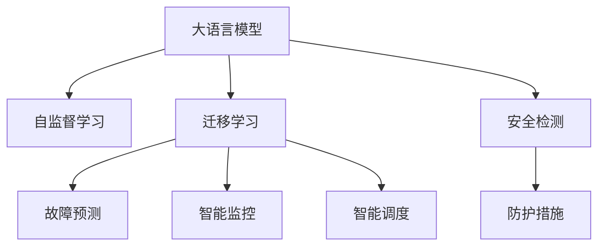

                 

# 电网维护与大模型的应用

> 关键词：大语言模型, 电网维护, 故障预测, 可靠性优化, 智能监控, 安全检测

## 1. 背景介绍

### 1.1 问题由来
随着全球电网规模的不断扩大和电力负荷的持续增长，电网系统的安全稳定性和运营效率成为越来越关键的课题。电网故障不仅会严重影响电力供应的可靠性，还可能引发连锁反应，对经济和社会造成重大损失。因此，如何通过先进的智能技术提升电网的运行管理水平，已成为智能电网建设的重要任务之一。

在大数据和人工智能技术的推动下，利用先进的数据分析与预测技术，可以实时监控和预测电网中的各种问题，提高电网的可靠性与运营效率。大语言模型作为人工智能领域的最新进展，为电网的智能化管理提供了强大的技术支持。本文将探讨如何利用大语言模型进行电网维护，以期为电网运营提供更为智能、高效、可靠的解决方案。

### 1.2 问题核心关键点
电网维护涉及多个方面的内容，包括：

- **故障预测与诊断**：通过实时监测和数据分析，提前预测并诊断电网中的潜在故障，避免故障扩大，保障电力供应。
- **智能监控与调度**：利用实时数据和算法模型，进行电网负荷的动态监控与调度，优化电网的运行状态。
- **安全检测与防护**：监测电网中的安全风险，如自然灾害、网络攻击等，并采取及时有效的防护措施。

大语言模型可以通过以下几个方面来帮助电网维护：

- **自监督学习**：利用电网的历史数据进行自监督学习，构建电网故障、负荷、安全风险等领域的知识库。
- **迁移学习**：将通用领域的知识迁移应用于电网特定任务中，提升模型的泛化能力和应用效果。
- **零样本学习**：在缺乏标注数据的情况下，通过精心设计的任务描述，实现对电网维护任务的快速推理和生成。
- **少样本学习**：在标注数据量有限的情况下，通过少数样本来训练模型，快速提升预测和诊断的准确度。

本文将重点介绍如何利用大语言模型进行电网故障预测、智能监控和智能调度，并通过具体案例展示其应用效果。

## 2. 核心概念与联系

### 2.1 核心概念概述

为更好地理解大语言模型在电网维护中的应用，本节将介绍几个密切相关的核心概念：

- **大语言模型**：以自回归或自编码模型为代表的大规模预训练语言模型，通过在海量无标签文本数据上进行预训练，学习通用语言知识，具备强大的语言理解和生成能力。

- **自监督学习**：利用无标签数据进行训练，通过预训练任务自动学习模型参数的一种方法。在大规模数据集上预训练后，可以迁移应用于各种NLP任务。

- **迁移学习**：将一个领域学习到的知识，迁移应用到另一个不同但相关的领域。大语言模型通常采用迁移学习方法，以提升特定任务的表现。

- **故障预测与诊断**：利用历史数据和实时监测数据，对电网中的故障进行预测和诊断，预防故障的发生，并确定故障发生的原因和影响范围。

- **智能监控与调度**：通过实时数据和算法模型，动态调整电网的运行状态，优化电网负荷，提高电网的运行效率和可靠性。

- **安全检测与防护**：实时监测电网中的安全风险，如自然灾害、网络攻击等，并采取及时有效的防护措施，保障电网的稳定运行。

这些核心概念之间的逻辑关系可以通过以下Mermaid流程图来展示：



这个流程图展示了大语言模型的核心概念及其与电网维护任务之间的联系：

1. 大语言模型通过自监督学习进行预训练，构建领域知识库。
2. 通过迁移学习将预训练知识应用于电网故障预测、智能监控、智能调度和安全检测等特定任务。
3. 模型在特定任务上进行微调，提升预测和诊断的准确度。
4. 利用预测和监控结果，采取防护措施，保障电网安全运行。

这些概念共同构成了大语言模型在电网维护中的应用框架，使其能够在各种场景下发挥强大的智能分析能力。

## 3. 核心算法原理 & 具体操作步骤
### 3.1 算法原理概述

大语言模型在电网维护中的应用，主要通过以下几个步骤实现：

1. **数据预处理**：收集和清洗电网相关的历史数据和实时数据，构建适合模型训练的样本集。
2. **模型训练**：在预处理后的数据集上，利用大语言模型进行预训练，学习电网领域的知识。
3. **任务适配**：将预训练模型作为初始化参数，通过迁移学习，对特定电网维护任务进行微调，提升模型在该任务上的性能。
4. **故障预测**：使用微调后的模型，对电网中的故障进行预测，并提供故障诊断报告。
5. **智能监控**：利用微调后的模型，进行电网的实时监控和调度，优化电网运行状态。
6. **安全检测**：通过微调后的模型，实时监测电网的安全风险，并采取相应的防护措施。

### 3.2 算法步骤详解

#### 3.2.1 数据预处理

电网维护数据的预处理包括数据收集、数据清洗和特征提取等步骤。

1. **数据收集**：收集电网的历史数据和实时数据，如负荷数据、温度数据、设备运行状态等。可以通过传感器、智能表计等设备进行实时数据采集。
2. **数据清洗**：对收集到的数据进行清洗和处理，去除噪声和异常值，保证数据的质量和准确性。可以使用数据清洗工具和算法，如缺失值处理、异常值检测等。
3. **特征提取**：从清洗后的数据中提取有用的特征，如设备运行状态、负荷变化趋势、温度变化等。可以通过统计分析和机器学习算法，提取特征并进行编码表示。

#### 3.2.2 模型训练

在大规模无标签电网数据上进行自监督学习，构建预训练语言模型。

1. **选择模型**：选择合适的预训练语言模型，如BERT、GPT-3等，进行模型初始化。
2. **自监督任务**：设计自监督学习任务，如掩码语言模型、单词共现矩阵等，训练模型学习电网领域知识。
3. **数据集划分**：将数据集划分为训练集、验证集和测试集，用于模型的训练和评估。

#### 3.2.3 任务适配

在预训练模型的基础上，对特定电网维护任务进行微调，提升模型的任务性能。

1. **选择任务**：根据电网维护的具体任务，选择适合的微调任务，如故障预测、智能监控、安全检测等。
2. **适配层设计**：设计适合该任务的适配层和损失函数，如分类器、回归器、序列生成器等。
3. **微调参数**：选择适当的学习率和优化器，进行模型微调，更新模型参数，优化任务性能。

#### 3.2.4 故障预测

利用微调后的模型进行电网故障预测。

1. **数据准备**：收集待预测的电网数据，如实时监测数据、历史故障数据等。
2. **模型输入**：将电网数据作为模型输入，送入微调后的模型进行预测。
3. **结果分析**：分析模型预测结果，提取故障发生的可能原因和影响范围。

#### 3.2.5 智能监控

利用微调后的模型进行电网的智能监控和调度。

1. **数据采集**：实时采集电网数据，如负荷数据、温度数据、设备状态等。
2. **模型输入**：将采集到的数据作为模型输入，送入微调后的模型进行推理。
3. **状态调整**：根据模型推理结果，动态调整电网的运行状态，优化电网负荷。

#### 3.2.6 安全检测

利用微调后的模型进行电网安全检测和防护。

1. **数据采集**：实时采集电网数据，如环境数据、设备状态等。
2. **模型输入**：将采集到的数据作为模型输入，送入微调后的模型进行推理。
3. **风险评估**：分析模型推理结果，评估电网的安全风险。
4. **防护措施**：根据安全风险评估结果，采取相应的防护措施，如断电保护、网络安全防护等。

### 3.3 算法优缺点

#### 3.3.1 优点

1. **数据利用效率高**：大语言模型可以利用电网的历史数据进行自监督学习，获取电网领域知识，提升模型的泛化能力。
2. **模型适应性强**：通过迁移学习和任务适配，大语言模型可以适应电网维护的多种任务需求，提升模型的应用效果。
3. **实时性较好**：微调后的模型可以通过实时数据进行推理和预测，提升电网的实时监控和调度能力。
4. **维护成本低**：利用大语言模型进行故障预测和诊断，可以减少人力投入，降低电网维护成本。

#### 3.3.2 缺点

1. **依赖高质量数据**：大语言模型的性能很大程度上依赖于数据的质量和数量，电网数据的缺失和噪声可能影响模型的训练效果。
2. **模型复杂度高**：大语言模型通常具有较深的层次和大量的参数，对计算资源和存储空间要求较高。
3. **模型解释性差**：大语言模型内部机制复杂，难以解释模型的推理过程和决策依据，不利于系统的可解释性。
4. **鲁棒性有待提升**：模型对异常数据的敏感性较高，需要进一步优化，提升模型的鲁棒性和抗干扰能力。

### 3.4 算法应用领域

大语言模型在电网维护中的应用，可以覆盖以下几个关键领域：

1. **故障预测**：利用历史数据和实时数据，对电网中的故障进行预测，提前采取防范措施。
2. **智能监控**：实时监测电网状态，动态调整电网负荷，优化电网的运行效率和可靠性。
3. **安全检测**：实时监测电网中的安全风险，如自然灾害、网络攻击等，采取相应的防护措施。
4. **维护计划制定**：根据故障预测结果和安全风险评估，制定合理的维护计划，优化资源配置。
5. **应急响应**：在发生故障或安全事件时，快速响应和处理，最小化损失。

## 4. 数学模型和公式 & 详细讲解 & 举例说明

### 4.1 数学模型构建

在电网维护中，可以利用大语言模型进行故障预测、智能监控和安全检测。以故障预测为例，假设模型为 $M_{\theta}$，输入为电网数据 $x$，输出为故障预测结果 $y$，则模型的训练目标为最小化经验风险：

$$
\mathcal{L}(\theta) = \frac{1}{N} \sum_{i=1}^N \ell(M_{\theta}(x_i), y_i)
$$

其中 $\ell$ 为损失函数，$N$ 为训练样本数。在实践中，可以采用交叉熵损失函数或均方误差损失函数等。

### 4.2 公式推导过程

以二分类故障预测为例，假设模型的输出为 $M_{\theta}(x)$，真实标签为 $y$，则二分类交叉熵损失函数为：

$$
\ell(M_{\theta}(x), y) = -[y\log M_{\theta}(x) + (1-y)\log(1-M_{\theta}(x))]
$$

将其代入经验风险公式，得：

$$
\mathcal{L}(\theta) = -\frac{1}{N}\sum_{i=1}^N [y_i\log M_{\theta}(x_i)+(1-y_i)\log(1-M_{\theta}(x_i))]
$$

在得到损失函数后，利用梯度下降等优化算法，更新模型参数 $\theta$，最小化损失函数 $\mathcal{L}(\theta)$，使得模型输出逼近真实标签。

### 4.3 案例分析与讲解

假设一个电网数据集包含历史负荷数据和实时温度数据，我们可以将电网数据作为大语言模型的输入，模型的输出为一个二分类标签，表示电网是否存在故障。

1. **数据准备**：收集历史负荷数据和实时温度数据，进行数据清洗和特征提取。
2. **模型训练**：利用历史数据对大语言模型进行自监督学习，训练模型学习电网领域知识。
3. **任务适配**：在预训练模型基础上，设计适配层和损失函数，对故障预测任务进行微调。
4. **模型评估**：在验证集上评估微调后的模型性能，调整超参数。
5. **故障预测**：在测试集上使用微调后的模型进行故障预测，提取故障发生的可能原因和影响范围。

## 5. 项目实践：代码实例和详细解释说明

### 5.1 开发环境搭建

在进行电网维护的大语言模型微调实践前，我们需要准备好开发环境。以下是使用Python进行PyTorch开发的环境配置流程：

1. 安装Anaconda：从官网下载并安装Anaconda，用于创建独立的Python环境。

2. 创建并激活虚拟环境：
```bash
conda create -n gridironv-env python=3.8 
conda activate gridironv-env
```

3. 安装PyTorch：根据CUDA版本，从官网获取对应的安装命令。例如：
```bash
conda install pytorch torchvision torchaudio cudatoolkit=11.1 -c pytorch -c conda-forge
```

4. 安装Transformers库：
```bash
pip install transformers
```

5. 安装各类工具包：
```bash
pip install numpy pandas scikit-learn matplotlib tqdm jupyter notebook ipython
```

完成上述步骤后，即可在`gridironv-env`环境中开始微调实践。

### 5.2 源代码详细实现

下面我们以电网故障预测为例，给出使用Transformers库对BERT模型进行微调的PyTorch代码实现。

首先，定义故障预测任务的数据处理函数：

```python
from transformers import BertTokenizer
from torch.utils.data import Dataset
import torch

class FaultDetectionDataset(Dataset):
    def __init__(self, data, tokenizer, max_len=128):
        self.data = data
        self.tokenizer = tokenizer
        self.max_len = max_len
        
    def __len__(self):
        return len(self.data)
    
    def __getitem__(self, item):
        x, y = self.data[item]
        x = x.to('float32')
        y = torch.tensor(y, dtype=torch.long)
        
        encoding = self.tokenizer(x, return_tensors='pt', max_length=self.max_len, padding='max_length', truncation=True)
        input_ids = encoding['input_ids'][0]
        attention_mask = encoding['attention_mask'][0]
        
        return {'input_ids': input_ids, 
                'attention_mask': attention_mask,
                'labels': y}
```

然后，定义模型和优化器：

```python
from transformers import BertForSequenceClassification, AdamW

model = BertForSequenceClassification.from_pretrained('bert-base-cased', num_labels=2)

optimizer = AdamW(model.parameters(), lr=2e-5)
```

接着，定义训练和评估函数：

```python
from torch.utils.data import DataLoader
from tqdm import tqdm
from sklearn.metrics import classification_report

device = torch.device('cuda') if torch.cuda.is_available() else torch.device('cpu')
model.to(device)

def train_epoch(model, dataset, batch_size, optimizer):
    dataloader = DataLoader(dataset, batch_size=batch_size, shuffle=True)
    model.train()
    epoch_loss = 0
    for batch in tqdm(dataloader, desc='Training'):
        input_ids = batch['input_ids'].to(device)
        attention_mask = batch['attention_mask'].to(device)
        labels = batch['labels'].to(device)
        model.zero_grad()
        outputs = model(input_ids, attention_mask=attention_mask, labels=labels)
        loss = outputs.loss
        epoch_loss += loss.item()
        loss.backward()
        optimizer.step()
    return epoch_loss / len(dataloader)

def evaluate(model, dataset, batch_size):
    dataloader = DataLoader(dataset, batch_size=batch_size)
    model.eval()
    preds, labels = [], []
    with torch.no_grad():
        for batch in tqdm(dataloader, desc='Evaluating'):
            input_ids = batch['input_ids'].to(device)
            attention_mask = batch['attention_mask'].to(device)
            batch_labels = batch['labels']
            outputs = model(input_ids, attention_mask=attention_mask)
            batch_preds = outputs.logits.argmax(dim=2).to('cpu').tolist()
            batch_labels = batch_labels.to('cpu').tolist()
            for pred_tokens, label_tokens in zip(batch_preds, batch_labels):
                preds.append(pred_tokens[:len(label_tokens)])
                labels.append(label_tokens)
                
    print(classification_report(labels, preds))
```

最后，启动训练流程并在测试集上评估：

```python
epochs = 5
batch_size = 16

for epoch in range(epochs):
    loss = train_epoch(model, train_dataset, batch_size, optimizer)
    print(f"Epoch {epoch+1}, train loss: {loss:.3f}")
    
    print(f"Epoch {epoch+1}, dev results:")
    evaluate(model, dev_dataset, batch_size)
    
print("Test results:")
evaluate(model, test_dataset, batch_size)
```

以上就是使用PyTorch对BERT进行电网故障预测任务微调的完整代码实现。可以看到，得益于Transformers库的强大封装，我们可以用相对简洁的代码完成BERT模型的加载和微调。

### 5.3 代码解读与分析

让我们再详细解读一下关键代码的实现细节：

**FaultDetectionDataset类**：
- `__init__`方法：初始化数据集和分词器，设定最大序列长度。
- `__len__`方法：返回数据集的样本数量。
- `__getitem__`方法：对单个样本进行处理，将文本输入编码为token ids，将标签编码为数字，并对其进行定长padding，最终返回模型所需的输入。

**模型和优化器定义**：
- 选择合适的预训练BERT模型，设置标签数量。
- 定义优化器及其超参数。

**训练和评估函数**：
- 使用PyTorch的DataLoader对数据集进行批次化加载，供模型训练和推理使用。
- 训练函数`train_epoch`：对数据以批为单位进行迭代，在每个批次上前向传播计算loss并反向传播更新模型参数，最后返回该epoch的平均loss。
- 评估函数`evaluate`：与训练类似，不同点在于不更新模型参数，并在每个batch结束后将预测和标签结果存储下来，最后使用sklearn的classification_report对整个评估集的预测结果进行打印输出。

**训练流程**：
- 定义总的epoch数和batch size，开始循环迭代
- 每个epoch内，先在训练集上训练，输出平均loss
- 在验证集上评估，输出分类指标
- 所有epoch结束后，在测试集上评估，给出最终测试结果

可以看到，PyTorch配合Transformers库使得BERT微调的代码实现变得简洁高效。开发者可以将更多精力放在数据处理、模型改进等高层逻辑上，而不必过多关注底层的实现细节。

当然，工业级的系统实现还需考虑更多因素，如模型的保存和部署、超参数的自动搜索、更灵活的任务适配层等。但核心的微调范式基本与此类似。

## 6. 实际应用场景

### 6.1 智能调度

基于大语言模型的电网智能调度系统，可以在电网负荷预测的基础上，动态调整电网运行状态，优化电网负荷，提高电网的运行效率和可靠性。

在技术实现上，可以收集电网的负荷数据、温度数据、设备运行状态等实时数据，并对其进行预处理和特征提取。利用大语言模型进行负荷预测，根据预测结果，动态调整电网的运行状态，如增加或减少发电量、调整线路负载等，实现电网的优化调度。

### 6.2 风险评估与防护

利用大语言模型进行电网的安全检测和防护，可以在发生自然灾害、网络攻击等安全事件时，及时采取防护措施，保障电网的安全运行。

在实践中，可以收集电网的环境数据、设备状态等，利用大语言模型进行实时监控和预测。一旦发现异常情况，模型会自动触发警报，并建议采取相应的防护措施，如断电保护、网络隔离等，减少安全事件对电网的影响。

### 6.3 故障预测与诊断

基于大语言模型的电网故障预测系统，可以在故障发生前，提前预测故障的可能原因和影响范围，帮助电网运营方提前采取措施，减少故障损失。

在技术实现上，可以利用大语言模型对电网数据进行训练，学习电网故障的特征和规律。当出现新的电网数据时，模型会自动进行预测，提取故障的可能原因和影响范围，并生成故障报告，供电网运营方参考。

### 6.4 未来应用展望

随着大语言模型和微调方法的不断发展，基于大语言模型的电网维护技术将呈现以下几个发展趋势：

1. **实时性更高**：未来的大语言模型将在实时数据处理和推理上取得更大进展，实现电网运行的实时监控和调度。
2. **精度更高**：通过更高效的数据处理和特征提取技术，大语言模型的预测精度将进一步提升，减少误判和误报。
3. **鲁棒性更强**：针对电网数据的特殊性和复杂性，大语言模型的鲁棒性和抗干扰能力将得到进一步提升。
4. **自适应性更好**：通过自监督学习和迁移学习，大语言模型将能够自动适应不同的电网环境和任务需求。
5. **人性化交互**：基于大语言模型的电网维护系统将具备更强的智能交互能力，能够与电网运营方进行自然语言交流，提供更优质的服务体验。

## 7. 工具和资源推荐

### 7.1 学习资源推荐

为了帮助开发者系统掌握大语言模型在电网维护中的应用，这里推荐一些优质的学习资源：

1. 《Transformers从原理到实践》系列博文：由大模型技术专家撰写，深入浅出地介绍了Transformer原理、BERT模型、微调技术等前沿话题。

2. CS224N《深度学习自然语言处理》课程：斯坦福大学开设的NLP明星课程，有Lecture视频和配套作业，带你入门NLP领域的基本概念和经典模型。

3. 《Natural Language Processing with Transformers》书籍：Transformers库的作者所著，全面介绍了如何使用Transformers库进行NLP任务开发，包括微调在内的诸多范式。

4. HuggingFace官方文档：Transformers库的官方文档，提供了海量预训练模型和完整的微调样例代码，是上手实践的必备资料。

5. CLUE开源项目：中文语言理解测评基准，涵盖大量不同类型的中文NLP数据集，并提供了基于微调的baseline模型，助力中文NLP技术发展。

通过对这些资源的学习实践，相信你一定能够快速掌握大语言模型在电网维护中的应用精髓，并用于解决实际的电网问题。

### 7.2 开发工具推荐

高效的开发离不开优秀的工具支持。以下是几款用于大语言模型在电网维护中应用的常用工具：

1. PyTorch：基于Python的开源深度学习框架，灵活动态的计算图，适合快速迭代研究。大部分预训练语言模型都有PyTorch版本的实现。

2. TensorFlow：由Google主导开发的开源深度学习框架，生产部署方便，适合大规模工程应用。同样有丰富的预训练语言模型资源。

3. Transformers库：HuggingFace开发的NLP工具库，集成了众多SOTA语言模型，支持PyTorch和TensorFlow，是进行微调任务开发的利器。

4. Weights & Biases：模型训练的实验跟踪工具，可以记录和可视化模型训练过程中的各项指标，方便对比和调优。与主流深度学习框架无缝集成。

5. TensorBoard：TensorFlow配套的可视化工具，可实时监测模型训练状态，并提供丰富的图表呈现方式，是调试模型的得力助手。

6. Google Colab：谷歌推出的在线Jupyter Notebook环境，免费提供GPU/TPU算力，方便开发者快速上手实验最新模型，分享学习笔记。

合理利用这些工具，可以显著提升大语言模型在电网维护中的应用效率，加快创新迭代的步伐。

### 7.3 相关论文推荐

大语言模型在电网维护中的应用源于学界的持续研究。以下是几篇奠基性的相关论文，推荐阅读：

1. Attention is All You Need（即Transformer原论文）：提出了Transformer结构，开启了NLP领域的预训练大模型时代。

2. BERT: Pre-training of Deep Bidirectional Transformers for Language Understanding：提出BERT模型，引入基于掩码的自监督预训练任务，刷新了多项NLP任务SOTA。

3. Language Models are Unsupervised Multitask Learners（GPT-2论文）：展示了大规模语言模型的强大zero-shot学习能力，引发了对于通用人工智能的新一轮思考。

4. Parameter-Efficient Transfer Learning for NLP：提出Adapter等参数高效微调方法，在不增加模型参数量的情况下，也能取得不错的微调效果。

5. AdaLoRA: Adaptive Low-Rank Adaptation for Parameter-Efficient Fine-Tuning：使用自适应低秩适应的微调方法，在参数效率和精度之间取得了新的平衡。

6. Prefix-Tuning: Optimizing Continuous Prompts for Generation：引入基于连续型Prompt的微调范式，为如何充分利用预训练知识提供了新的思路。

这些论文代表了大语言模型在电网维护中的应用发展脉络。通过学习这些前沿成果，可以帮助研究者把握学科前进方向，激发更多的创新灵感。

## 8. 总结：未来发展趋势与挑战

### 8.1 总结

本文对大语言模型在电网维护中的应用进行了全面系统的介绍。首先阐述了电网维护涉及的多个任务及其重要性，明确了大语言模型在故障预测、智能监控和安全检测中的应用价值。其次，从原理到实践，详细讲解了大语言模型的算法原理和具体操作步骤，给出了电网故障预测的代码实现。同时，本文还广泛探讨了电网维护任务的实际应用场景，展示了微调范式的广泛应用潜力。

通过本文的系统梳理，可以看到，大语言模型在电网维护中的应用前景广阔，可以通过故障预测、智能监控和安全检测等技术手段，提升电网的运行管理水平，保障电网的稳定运行。未来，伴随大语言模型和微调方法的持续演进，电网维护技术将向更加智能化、高效化、可靠化的方向发展，助力智能电网建设。

### 8.2 未来发展趋势

展望未来，大语言模型在电网维护中的应用将呈现以下几个发展趋势：

1. **自监督学习的应用扩大**：未来的大语言模型将更加依赖自监督学习技术，充分利用无标签数据进行预训练，提升模型的泛化能力和适应性。
2. **多模态融合的深入**：电网数据不仅仅是文本，还包括图像、音频等多种类型，未来的大语言模型将融合多模态信息，提升对电网环境的全面理解。
3. **迁移学习的多样性**：除了传统的数据迁移学习外，未来将有更多创新的迁移学习方法，如对抗迁移学习、跨领域迁移学习等，进一步提升模型在不同任务上的表现。
4. **模型规模和性能的提升**：随着算力资源和数据量的增长，大语言模型的规模和性能将进一步提升，提升电网的智能监控和故障预测能力。
5. **实时性和可解释性的提高**：未来的大语言模型将在实时性和可解释性上取得更大进展，实现电网的实时监控和故障预测，提升电网运营的透明度和安全性。

### 8.3 面临的挑战

尽管大语言模型在电网维护中的应用已经取得显著进展，但在迈向更加智能化、普适化应用的过程中，仍面临诸多挑战：

1. **数据质量与获取难度**：电网数据质量的高低直接影响到模型的训练效果，高质量数据的获取难度较大。如何优化数据采集和预处理流程，提升数据质量，是需要解决的关键问题。
2. **模型复杂性与管理成本**：大语言模型通常具有复杂的内部结构，训练和维护成本较高。如何优化模型结构，降低管理成本，是未来需要重点关注的方向。
3. **安全性与隐私保护**：电网数据涉及国家电网信息安全，如何保障数据隐私和安全，防止数据泄露和攻击，是电网维护中不可忽视的重要问题。
4. **环境适应性**：不同电网的运行环境和管理需求不同，如何设计灵活的模型结构和适配层，适应多种不同的电网场景，是未来需要研究的重点。
5. **算法透明度与可解释性**：大语言模型内部的复杂机制使得其难以解释，如何提升模型的可解释性和透明度，增强电网运营方的信任感，是未来需要重点解决的问题。

### 8.4 研究展望

面对电网维护中的各种挑战，未来的大语言模型研究需要在以下几个方面寻求新的突破：

1. **优化数据预处理流程**：采用先进的数据清洗和特征提取技术，提升数据质量，优化模型训练效果。
2. **简化模型结构**：研究更加高效的模型压缩和优化技术，降低模型复杂性，减少资源消耗。
3. **增强模型安全性**：利用密码学和隐私保护技术，保护电网数据的安全性，防止数据泄露和攻击。
4. **提高模型适应性**：设计可配置的适配层和模型结构，提高模型对不同电网环境的适应性。
5. **增强模型可解释性**：研究可解释性强的模型结构和推理方法，提升模型的透明度和可解释性。

只有不断创新和优化，才能推动大语言模型在电网维护中的应用走向成熟，真正实现智能电网的建设目标。未来，伴随技术的发展和实践的积累，大语言模型将在电网维护中发挥更大的作用，推动电网管理水平的提升和智能化发展。

## 9. 附录：常见问题与解答

**Q1：大语言模型在电网维护中的应用效果如何？**

A: 大语言模型在电网维护中的应用效果显著。通过利用历史数据和实时数据进行训练和微调，大语言模型能够在故障预测、智能监控和安全检测等任务中表现优异。具体来说，模型可以对电网中的故障进行预测，识别出潜在的安全风险，并提出相应的防护措施。通过实时监控和调度，模型能够优化电网的运行状态，提高电网的运行效率和可靠性。

**Q2：大语言模型在电网维护中需要注意哪些数据问题？**

A: 大语言模型在电网维护中需要注意以下几个数据问题：

1. **数据质量**：电网数据的采集、存储和预处理质量直接影响到模型的训练效果。需要确保数据的质量和准确性，避免噪声和异常值的影响。
2. **数据多样性**：电网数据通常包含多种类型，如文本、图像、音频等。需要综合利用多种数据类型，提升模型的泛化能力和适应性。
3. **数据隐私**：电网数据涉及敏感信息，需要采取措施保护数据的隐私和安全，防止数据泄露和攻击。

**Q3：大语言模型在电网维护中的优势是什么？**

A: 大语言模型在电网维护中的优势主要体现在以下几个方面：

1. **自适应性强**：大语言模型能够自动学习电网领域知识，适应不同电网环境和管理需求。
2. **预测能力强**：通过历史数据和实时数据进行训练和微调，大语言模型能够在故障预测和安全检测中表现优异，提前发现潜在风险，减少故障损失。
3. **实时监控和调度能力**：利用实时数据进行推理和预测，大语言模型能够实时监控电网状态，动态调整运行状态，优化电网负荷。
4. **安全防护能力强**：实时监测电网中的安全风险，大语言模型能够快速响应和处理安全事件，保障电网安全运行。

**Q4：如何优化大语言模型在电网维护中的应用？**

A: 优化大语言模型在电网维护中的应用，可以从以下几个方面入手：

1. **数据预处理**：优化数据清洗和特征提取流程，提升数据质量，确保数据的多样性和准确性。
2. **模型结构优化**：研究高效的模型压缩和优化技术，简化模型结构，降低资源消耗。
3. **任务适配层设计**：设计灵活的任务适配层和损失函数，提升模型在不同任务上的表现。
4. **自监督学习**：利用自监督学习技术，提升模型的泛化能力和适应性。
5. **迁移学习**：通过迁移学习技术，将通用领域的知识迁移到电网特定任务中，提升模型的性能。
6. **实时性和可解释性**：优化模型的推理和解释能力，提升模型的实时性和可解释性。

**Q5：大语言模型在电网维护中的局限性是什么？**

A: 大语言模型在电网维护中存在以下几个局限性：

1. **依赖高质量数据**：大语言模型的性能很大程度上依赖于数据的质量和数量，电网数据的缺失和噪声可能影响模型的训练效果。
2. **模型复杂度高**：大语言模型通常具有较深的层次和大量的参数，对计算资源和存储空间要求较高。
3. **模型解释性差**：大语言模型内部机制复杂，难以解释模型的推理过程和决策依据，不利于系统的可解释性。
4. **鲁棒性有待提升**：模型对异常数据的敏感性较高，需要进一步优化，提升模型的鲁棒性和抗干扰能力。

---

作者：禅与计算机程序设计艺术 / Zen and the Art of Computer Programming

