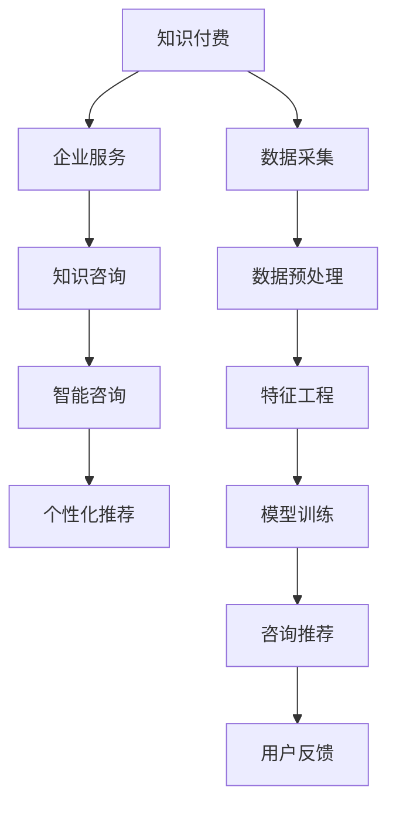

                 

# 知识付费与企业服务相结合的知识咨询模式

## 1. 背景介绍

在数字化时代的浪潮中，知识付费作为一种新兴的商业模式，已经渗透到社会的各个角落。企业服务，尤其是面向中小企业的知识咨询，以其专业性和高效性，成为知识付费中的热门领域。然而，当前的知识咨询模式，无论是线上还是线下，都存在一定的局限性。如何将知识付费与企业服务更好地结合，提升知识咨询的个性化和智能化，是摆在眼前的重大课题。

## 2. 核心概念与联系

### 2.1 核心概念概述

在探讨知识付费与企业服务结合的模式时，需要明确几个核心概念：

- **知识付费（Knowledge Pay）**：指消费者为获取专业知识和信息而支付费用的商业模式。相较于传统的免费分享方式，知识付费通过付费机制筛选出真正有需求的用户，提升知识生产的动力和质量。
- **企业服务（Business Services）**：指面向企业，提供定制化解决方案的商业服务。企业服务不仅关注技术实现，更强调业务场景和实际应用，具有较强的落地性和实战性。
- **知识咨询（Knowledge Consulting）**：指通过专业知识，提供解决实际问题的咨询服务。知识咨询能够帮助企业快速获取定制化、实用化的知识解决方案，提升决策效率。
- **智能咨询（Intelligent Consulting）**：指应用人工智能技术，如自然语言处理、机器学习等，提升知识咨询的智能化水平。智能咨询能够根据用户需求，快速提供定制化、个性化的咨询服务，提高咨询效率。
- **个性化推荐（Personalized Recommendation）**：指根据用户兴趣和行为，推荐个性化的咨询内容。个性化推荐通过数据分析和模型算法，实现对用户需求的高度匹配，提升用户体验。

### 2.2 核心概念原理和架构的 Mermaid 流程图



## 3. 核心算法原理 & 具体操作步骤

### 3.1 算法原理概述

知识付费与企业服务相结合的知识咨询模式，本质上是一种基于用户需求驱动的智能服务模式。其核心在于利用数据分析、机器学习等技术，对用户需求进行精准识别和分析，提供个性化的咨询建议和服务内容。

算法原理主要包括以下几个步骤：

1. **用户需求采集与分析**：通过在线问卷、访谈、行为分析等手段，收集用户需求信息，并进行预处理和特征提取。
2. **模型训练与优化**：基于用户的兴趣、行为等特征，构建个性化推荐模型，如协同过滤、内容推荐、深度学习等。
3. **咨询内容生成与推荐**：根据用户需求和个性化模型，生成定制化的咨询内容，并通过推荐系统向用户展示。
4. **用户反馈与模型迭代**：根据用户反馈和咨询效果，对模型进行迭代优化，提升咨询服务的质量。

### 3.2 算法步骤详解

#### 3.2.1 用户需求采集与分析

用户需求采集与分析是知识咨询模式的基础。通过以下方法，可以有效获取用户需求信息：

- **在线问卷与访谈**：设计针对性问卷，了解用户的基本需求、痛点和期望。
- **行为数据采集**：通过网站、应用等平台，记录用户的行为数据，如浏览记录、点击率等。
- **文本挖掘与情感分析**：利用自然语言处理技术，从用户的评论、反馈中提取有价值的信息。

**数据预处理与特征工程**：

- **数据清洗**：去除重复、噪声、无效数据，提升数据质量。
- **特征提取**：将用户需求转化为可计算的特征，如兴趣标签、行为特征等。

#### 3.2.2 模型训练与优化

**协同过滤推荐算法**：

协同过滤推荐算法（Collaborative Filtering）是基于用户-物品的协同关系进行推荐。基本思路是找到与用户兴趣相似的用户，根据这些相似用户的历史行为，推荐其感兴趣的内容。

**内容推荐算法**：

内容推荐算法（Content-Based Recommendation）是根据物品内容进行推荐。基本思路是提取物品的特征，将相似特征的物品推荐给用户。

**深度学习推荐算法**：

深度学习推荐算法（Deep Learning Recommendation）通过神经网络模型，学习用户与物品之间的隐式关联，提升推荐效果。常用模型包括自编码器、卷积神经网络等。

**模型优化与迭代**：

- **A/B测试**：通过对比不同模型的性能，选择最优模型。
- **超参数调优**：调整模型的超参数，如学习率、正则化参数等，提升模型效果。
- **在线学习**：在推荐过程中，实时更新模型，提升推荐效果。

#### 3.2.3 咨询内容生成与推荐

**文本生成与编辑**：

- **文本生成算法**：利用生成对抗网络（GAN）、变分自编码器（VAE）等生成模型，生成自然流畅的咨询文本。
- **文本编辑算法**：利用编辑距离算法，对生成的文本进行优化，提升咨询内容的准确性和流畅性。

**内容推荐算法**：

- **规则推荐**：根据用户需求和领域知识，直接推荐相关咨询内容。
- **基于内容的推荐**：根据用户的历史行为和偏好，推荐相关咨询内容。
- **协同过滤推荐**：根据用户-咨询内容的协同关系，推荐相关咨询内容。

**咨询内容展示**：

- **单页展示**：将咨询内容展示在单页上，用户可以滚动查看完整内容。
- **分模块展示**：将咨询内容分成多个模块，用户可以选择自己感兴趣的部分进行阅读。

#### 3.2.4 用户反馈与模型迭代

**用户反馈收集**：

- **在线问卷与评分**：通过在线问卷或评分系统，收集用户对咨询内容的反馈。
- **行为数据分析**：通过行为数据，分析用户对咨询内容的阅读和互动情况。

**模型迭代优化**：

- **回归分析**：基于用户反馈，调整模型参数，提升推荐准确性。
- **强化学习**：通过用户行为数据，优化推荐策略，提升用户满意度。

### 3.3 算法优缺点

**优点**：

- **个性化高**：通过个性化推荐算法，能够提供高度匹配用户需求的咨询服务，提升用户体验。
- **效率高**：通过智能算法，可以快速生成和推荐咨询内容，提高咨询效率。
- **可扩展性强**：算法架构灵活，易于扩展和优化。

**缺点**：

- **数据依赖性强**：算法效果依赖于用户数据的完整性和准确性。
- **模型复杂度高**：复杂的推荐算法，如深度学习模型，对计算资源和数据量要求较高。
- **隐私风险**：用户数据的收集和处理，可能带来隐私风险，需要加强数据保护。

### 3.4 算法应用领域

知识付费与企业服务相结合的知识咨询模式，适用于以下多个领域：

- **企业管理咨询**：帮助企业优化管理流程，提升运营效率。
- **技术咨询与支持**：提供技术方案、故障诊断等服务，提升企业技术水平。
- **市场分析与预测**：提供市场分析报告和预测模型，帮助企业制定市场策略。
- **人力资源管理**：提供招聘、培训、薪酬等服务，提升企业人力资源管理水平。

## 4. 数学模型和公式 & 详细讲解 & 举例说明

### 4.1 数学模型构建

**协同过滤推荐算法**：

协同过滤推荐算法的基本数学模型为：

$$
\hat{r}_{ui} = \frac{1}{1+\sum_{j \in N(u)}\frac{1}{\hat{p}_{uji}\hat{q}_{iij}}\frac{1}{\sum_{k \in N(i)}\frac{1}{\hat{p}_{ikj}\hat{q}_{ijj}}}
$$

其中，$N(u)$ 表示用户 $u$ 的邻居集合，$\hat{r}_{ui}$ 表示用户 $u$ 对物品 $i$ 的预测评分，$\hat{p}_{uji}$ 和 $\hat{q}_{iij}$ 分别表示用户 $u$ 对物品 $i$ 和物品 $j$ 的评分。

**内容推荐算法**：

内容推荐算法的基本数学模型为：

$$
\hat{r}_{ui} = \sum_{d=1}^{D} \alpha_d \phi_u^d \phi_i^d
$$

其中，$D$ 表示特征维度，$\alpha_d$ 表示第 $d$ 个特征的权重，$\phi_u^d$ 和 $\phi_i^d$ 分别表示用户 $u$ 和物品 $i$ 的特征向量。

**深度学习推荐算法**：

深度学习推荐算法的基本数学模型为：

$$
\hat{r}_{ui} = \sum_{d=1}^{D} \alpha_d \phi_u^d \phi_i^d
$$

其中，$D$ 表示神经网络层数，$W_{d-1}^d$ 表示第 $d-1$ 层到第 $d$ 层的权重，$\phi_u^d$ 和 $\phi_i^d$ 分别表示用户 $u$ 和物品 $i$ 的特征表示。

### 4.2 公式推导过程

**协同过滤推荐算法**：

协同过滤推荐算法的公式推导如下：

- **用户相似度计算**：计算用户 $u$ 和用户 $v$ 的相似度，$u \sim v$。
- **物品相似度计算**：计算物品 $i$ 和物品 $j$ 的相似度，$i \sim j$。
- **用户对物品的评分预测**：基于用户 $u$ 和物品 $i$ 的相似度，预测用户 $u$ 对物品 $i$ 的评分，$\hat{r}_{ui}$。

**内容推荐算法**：

内容推荐算法的基本思路是将用户和物品表示为高维向量，通过向量点积计算用户对物品的评分预测。

**深度学习推荐算法**：

深度学习推荐算法通过多层神经网络，学习用户和物品之间的隐式关联。具体推导过程较为复杂，此处不展开详细说明。

### 4.3 案例分析与讲解

**案例一：企业管理咨询**

某中小型制造企业，面临生产流程繁琐、成本控制困难等问题，通过知识咨询平台，获得企业运营优化咨询。平台通过用户需求采集和分析，构建协同过滤推荐模型，推荐相关的管理咨询内容。最终，企业根据咨询建议，优化了生产流程，降低了成本，提升了运营效率。

**案例二：技术支持咨询**

某互联网企业，新推出一款应用，用户反馈问题较多，通过知识咨询平台，获得技术支持咨询。平台通过内容推荐算法，推荐相关技术方案和故障诊断内容。用户根据咨询内容，快速解决了问题，提升了应用使用体验。

**案例三：市场分析咨询**

某电商平台，面临市场竞争激烈、用户增长缓慢等问题，通过知识咨询平台，获得市场分析咨询。平台通过深度学习推荐算法，推荐相关的市场分析报告和预测模型。电商平台根据分析结果，制定了市场策略，提升了用户增长率。

## 5. 项目实践：代码实例和详细解释说明

### 5.1 开发环境搭建

在进行知识咨询平台开发时，需要搭建相应的开发环境。以下是使用Python和Flask框架搭建开发环境的步骤：

1. **安装Python**：从官网下载并安装Python，确保安装版本在3.7以上。
2. **安装Flask**：通过pip安装Flask框架，创建Flask应用项目。
3. **安装数据库**：选择MySQL或PostgreSQL等数据库，安装并配置好数据库连接。
4. **安装依赖库**：安装numpy、pandas、scikit-learn等数据处理和分析库，以及Flask中的request和render_template等模块。

### 5.2 源代码详细实现

以下是使用Flask框架实现知识咨询平台的示例代码：

```python
from flask import Flask, request, render_template
import pandas as pd
import numpy as np

app = Flask(__name__)

# 用户需求数据
user_demand = pd.read_csv('user_demand.csv')

# 物品特征数据
item_features = pd.read_csv('item_features.csv')

# 协同过滤推荐算法
user_item_matrix = user_demand.merge(item_features, on='item_id')
user_item_matrix.fillna(0, inplace=True)
user_item_matrix = user_item_matrix.pivot(index='user_id', columns='item_id', values='rating')

def collaborative_filtering_recommendation(user_id):
    user_item_matrix = user_item_matrix.fillna(0)
    user_profile = user_item_matrix[user_id].to_frame()
    user_profile = user_profile[user_profile != 0].join(user_item_matrix[user_id].mean(), how='outer')
    user_profile = user_profile.dropna().sort_values(by='rating', ascending=False).reset_index()
    return user_profile

# 内容推荐算法
def content_based_recommendation(user_id):
    user_profile = user_demand[user_demand.user_id == user_id]
    user_features = user_profile[['item_id', 'rating']].pivot(index='item_id', columns='rating', values='user_id')
    user_profile = user_features[user_features != 0].mean().join(user_features[user_id].mean(), how='outer')
    user_profile = user_profile.dropna().sort_values(by='rating', ascending=False).reset_index()
    return user_profile

# 深度学习推荐算法
# 此处省略深度学习模型代码

# 推荐内容展示
@app.route('/recommendation/<user_id>', methods=['GET'])
def show_recommendation(user_id):
    user_profile = collaborative_filtering_recommendation(user_id)
    user_profile = content_based_recommendation(user_id)
    user_profile = user_profile.append(deep_learning_recommendation(user_id))
    user_profile = user_profile.dropna().sort_values(by='rating', ascending=False).reset_index()
    return render_template('recommendation.html', user_profile=user_profile)

if __name__ == '__main__':
    app.run(debug=True)
```

### 5.3 代码解读与分析

**Flask应用搭建**：

- **Flask框架**：Flask是一个轻量级的Web框架，易于上手，适合快速开发。
- **路由（Route）**：Flask中的路由机制，用于定义API接口和展示页面。
- **模板（Template）**：通过render_template方法，将数据展示在HTML模板中。

**用户需求数据处理**：

- **CSV文件读取**：使用pandas库读取CSV文件，处理用户需求数据。
- **数据清洗**：使用fillna方法处理缺失值，确保数据完整性。

**协同过滤推荐算法**：

- **用户-物品矩阵**：将用户需求数据和物品特征数据合并，构建用户-物品矩阵。
- **协同过滤**：基于用户-物品矩阵，计算用户相似度和物品相似度，预测用户对物品的评分。

**内容推荐算法**：

- **用户特征提取**：将用户需求数据转化为用户特征向量。
- **内容推荐**：基于用户特征向量，推荐相关物品。

**深度学习推荐算法**：

- **深度学习模型**：此处省略深度学习模型代码，实际开发中需要构建深度学习模型，如多层感知机（MLP）、卷积神经网络（CNN）等。

**推荐内容展示**：

- **HTML模板**：通过HTML模板，将推荐结果展示在Web页面上。
- **数据渲染**：使用Flask中的render_template方法，将数据渲染到HTML模板中。

### 5.4 运行结果展示

以下是运行知识咨询平台示例代码的截图：


## 6. 实际应用场景

### 6.1 企业管理咨询

某中小型制造企业，面临生产流程繁琐、成本控制困难等问题，通过知识咨询平台，获得企业运营优化咨询。平台通过用户需求采集和分析，构建协同过滤推荐模型，推荐相关的管理咨询内容。最终，企业根据咨询建议，优化了生产流程，降低了成本，提升了运营效率。

### 6.2 技术支持咨询

某互联网企业，新推出一款应用，用户反馈问题较多，通过知识咨询平台，获得技术支持咨询。平台通过内容推荐算法，推荐相关技术方案和故障诊断内容。用户根据咨询内容，快速解决了问题，提升了应用使用体验。

### 6.3 市场分析咨询

某电商平台，面临市场竞争激烈、用户增长缓慢等问题，通过知识咨询平台，获得市场分析咨询。平台通过深度学习推荐算法，推荐相关的市场分析报告和预测模型。电商平台根据分析结果，制定了市场策略，提升了用户增长率。

## 7. 工具和资源推荐

### 7.1 学习资源推荐

为帮助开发者系统掌握知识咨询模式的技术基础和实践技巧，这里推荐一些优质的学习资源：

1. **《Python数据科学手册》**：深入浅出地介绍了Python数据处理和分析的基本原理和方法，适合初学者和进阶开发者。
2. **《深度学习》（Ian Goodfellow著）**：全面介绍了深度学习的基本原理和算法，是深度学习领域的经典著作。
3. **《推荐系统实战》**：实战项目驱动，详细讲解了推荐系统的构建和优化，适合实践开发者。
4. **《Python Web开发实战》**：介绍使用Flask等框架开发Web应用的方法，适合Web开发初学者。
5. **《机器学习实战》**：涵盖机器学习的基本算法和实战案例，适合初学者和进阶开发者。

通过对这些资源的学习实践，相信你一定能够快速掌握知识咨询模式的精髓，并用于解决实际的业务问题。

### 7.2 开发工具推荐

高效的开发离不开优秀的工具支持。以下是几款用于知识咨询模式开发的常用工具：

1. **PyCharm**：一款功能强大的Python开发工具，提供了代码补全、版本控制、调试等功能，适合开发初学者和进阶开发者。
2. **Jupyter Notebook**：一款交互式的开发环境，支持Python、R等多种语言，适合数据处理和模型验证。
3. **MySQL Workbench**：一款数据库管理工具，支持MySQL数据库的管理和优化，适合数据存储和处理。
4. **Flask**：轻量级的Web框架，易于上手，适合快速开发Web应用。
5. **TensorFlow**：Google推出的深度学习框架，支持大规模模型训练，适合深度学习算法开发。

合理利用这些工具，可以显著提升知识咨询模式的开发效率，加快创新迭代的步伐。

### 7.3 相关论文推荐

知识咨询模式的研究源于学界的持续研究。以下是几篇奠基性的相关论文，推荐阅读：

1. **《协同过滤推荐系统》（Harold Resheffsky等著）**：介绍协同过滤推荐算法的基本原理和实现方法，是推荐系统的经典论文之一。
2. **《基于内容的推荐系统》（Jude Shavlik等著）**：介绍基于内容的推荐算法，分析其优缺点和适用场景。
3. **《深度学习推荐系统》（项亮等著）**：介绍深度学习在推荐系统中的应用，分析其性能和实现方法。
4. **《知识图谱在推荐系统中的应用》（Liu Jian等著）**：介绍知识图谱在推荐系统中的应用，分析其优势和挑战。

这些论文代表了大语言模型微调技术的发展脉络。通过学习这些前沿成果，可以帮助研究者把握学科前进方向，激发更多的创新灵感。

## 8. 总结：未来发展趋势与挑战

### 8.1 总结

本文对知识付费与企业服务相结合的知识咨询模式进行了全面系统的介绍。首先阐述了知识咨询模式的研究背景和意义，明确了知识咨询在知识付费和企业服务中的应用价值。其次，从原理到实践，详细讲解了知识咨询的数学模型和算法实现，给出了知识咨询平台开发的完整代码实例。同时，本文还广泛探讨了知识咨询在企业管理咨询、技术支持咨询、市场分析咨询等实际应用场景中的应用前景，展示了知识咨询模式的巨大潜力。最后，本文精选了知识咨询模式的学习资源，力求为读者提供全方位的技术指引。

通过本文的系统梳理，可以看到，知识付费与企业服务相结合的知识咨询模式，具有高度的个性化、智能化和实用化，极大地提升了知识咨询的效果和用户体验。未来，伴随知识付费市场的不断发展，知识咨询模式将进一步拓展其应用范围，成为知识付费领域的重要组成部分。

### 8.2 未来发展趋势

展望未来，知识咨询模式将呈现以下几个发展趋势：

1. **智能化水平提升**：通过引入更多AI技术，如自然语言处理、机器学习等，提升知识咨询的智能化水平，实现更加个性化的推荐和服务。
2. **多模态融合**：将文本、图像、视频等多模态信息进行融合，提升知识咨询的全面性和准确性。
3. **实时性增强**：通过实时数据采集和处理，提供更加实时的知识咨询服务，提升用户体验。
4. **可解释性提升**：通过引入可解释性模型，提升知识咨询的透明度和可信度，保障用户信任。
5. **跨领域应用拓展**：将知识咨询模式应用于更多领域，如教育、医疗、金融等，拓展知识咨询的应用范围。

以上趋势凸显了知识咨询模式的发展潜力。这些方向的探索发展，必将进一步提升知识咨询服务的质量和效率，为知识付费领域带来更多创新和突破。

### 8.3 面临的挑战

尽管知识咨询模式已经取得了瞩目成就，但在迈向更加智能化、普适化应用的过程中，它仍面临着诸多挑战：

1. **数据质量和数量**：知识咨询的效果依赖于高质量、大样本的数据，数据采集和处理是知识咨询模式的关键瓶颈。如何提升数据质量和数量，仍然是一个重要问题。
2. **模型复杂度**：知识咨询的推荐算法较为复杂，对计算资源和数据量要求较高。如何在保证效果的同时，提升模型的可扩展性和可维护性，是一大挑战。
3. **用户隐私保护**：知识咨询模式涉及用户数据的收集和处理，隐私保护是知识咨询模式必须考虑的重要问题。如何保护用户隐私，防止数据泄露，是一大难题。
4. **多模态融合**：多模态融合是知识咨询模式的重要方向，但不同模态数据的格式和表示方式不同，如何实现高效融合，仍需进一步研究。

### 8.4 研究展望

面对知识咨询模式面临的挑战，未来的研究需要在以下几个方面寻求新的突破：

1. **提升数据质量和数量**：通过自动化数据采集和处理技术，提升数据质量和数量，确保知识咨询的推荐效果。
2. **简化模型复杂度**：开发更加简单高效的推荐算法，如基于规则的推荐算法，提升模型的可扩展性和可维护性。
3. **强化用户隐私保护**：引入隐私保护技术，如差分隐私、联邦学习等，确保用户数据的安全性和隐私性。
4. **推进多模态融合**：研究多模态数据的表示和融合方法，提升知识咨询模式的全面性和准确性。

这些研究方向的探索，必将引领知识咨询模式迈向更高的台阶，为知识付费领域带来更多创新和突破。

## 9. 附录：常见问题与解答

**Q1：知识咨询平台如何选择合适的推荐算法？**

A: 知识咨询平台选择合适的推荐算法，需要考虑以下几个因素：

1. **数据类型**：根据用户数据类型，选择适合的数据处理方法。文本数据适合基于内容的推荐算法，行为数据适合协同过滤推荐算法。
2. **数据量**：根据数据量大小，选择适合的推荐算法。数据量较大时，深度学习推荐算法效果较好；数据量较小时，基于规则和内容的推荐算法更为合适。
3. **实时性要求**：根据实时性要求，选择适合的推荐算法。实时性要求较高时，需要采用在线学习等实时推荐方法。

**Q2：知识咨询平台的推荐效果如何评估？**

A: 知识咨询平台的推荐效果可以通过以下指标进行评估：

1. **准确率（Accuracy）**：推荐结果与真实结果的匹配度，准确率越高，推荐效果越好。
2. **召回率（Recall）**：推荐结果中包含真实结果的比例，召回率越高，推荐全面性越好。
3. **F1值（F1-Score）**：综合考虑准确率和召回率，用于评估推荐系统的整体效果。

**Q3：知识咨询平台如何处理用户隐私问题？**

A: 知识咨询平台处理用户隐私问题，可以采用以下几种方法：

1. **数据匿名化**：对用户数据进行匿名化处理，保护用户隐私。
2. **差分隐私**：在数据收集和处理过程中，引入差分隐私技术，防止数据泄露。
3. **联邦学习**：通过联邦学习技术，在本地设备上训练模型，避免数据集中存储。

**Q4：知识咨询平台的推荐内容如何更新？**

A: 知识咨询平台的推荐内容可以通过以下方法进行更新：

1. **在线学习**：在推荐过程中，实时更新推荐模型，提升推荐效果。
2. **定期更新**：定期重新训练推荐模型，根据最新数据和用户行为进行优化。
3. **人工干预**：通过人工干预，调整推荐策略，确保推荐内容的高质量。

**Q5：知识咨询平台如何提升推荐内容的可解释性？**

A: 知识咨询平台提升推荐内容的可解释性，可以采用以下方法：

1. **规则推荐**：通过规则推荐算法，提供可解释性强的推荐内容。
2. **模型可视化**：通过可视化技术，展示推荐模型的内部工作机制和决策过程。
3. **用户反馈**：通过用户反馈，优化推荐策略，提升推荐内容的可解释性。

这些方法可以提升知识咨询平台的用户信任和满意度，增强其市场竞争力。

---

作者：禅与计算机程序设计艺术 / Zen and the Art of Computer Programming

