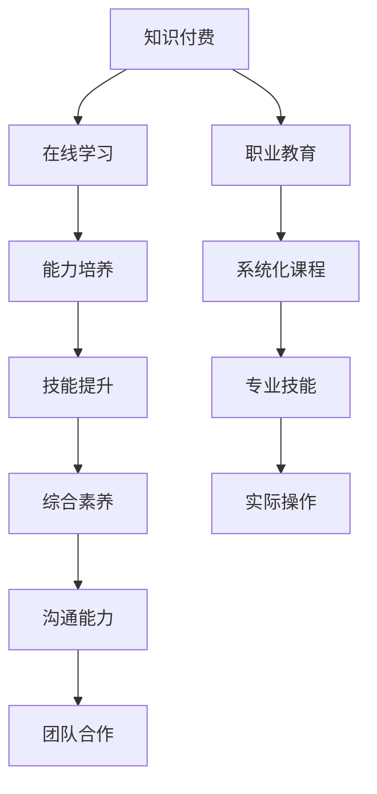

                 

## 1. 背景介绍

随着知识经济的蓬勃发展，全球对高素质人才的需求日益增长。为满足日益增长的职业教育和人才培养需求，知识付费与职业教育相结合的能力培养模式应运而生。该模式充分利用了知识付费的灵活性、针对性和职业教育的专业性、系统性，通过科学的设计和合理的运用，为社会培养出了一大批优秀的专业人才。

## 2. 核心概念与联系

### 2.1 核心概念概述

为更好地理解知识付费与职业教育相结合的能力培养模式，本节将介绍几个密切相关的核心概念：

- **知识付费**：指通过付费获取专业知识或技能服务，以提高自身知识水平和技能水平的一种经济模式。知识付费平台通过提供专业内容、在线课程、咨询服务等方式，为学习者提供高质量的资源，帮助其快速成长。
- **职业教育**：指通过教育培训，使个人具备从事某一职业所需的专业知识、技能和素养。职业教育机构通过系统的课程设计和专业的师资力量，帮助学习者掌握所需的技能和知识。
- **能力培养**：指通过教育和培训，提升个人在某一领域的综合能力，包括专业技能、沟通能力、团队合作能力等，使其能够更好地适应社会和工作环境。
- **在线学习**：指通过互联网平台，提供灵活、便捷、互动的学习方式，使学习者能够在任何时间和地点进行学习。
- **自适应学习**：指根据学习者的学习进度、兴趣和反馈，动态调整教学内容和策略，实现个性化、差异化的学习。

这些核心概念之间的逻辑关系可以通过以下Mermaid流程图来展示：



这个流程图展示出知识付费与职业教育相结合的能力培养模式的主要流程：

1. 知识付费提供灵活的在线学习资源，帮助学习者掌握专业知识和技能。
2. 职业教育通过系统化的课程设计，深入培养学习者的专业能力。
3. 能力培养结合在线学习和职业教育，全面提升学习者的综合能力。
4. 通过职业技能的提升、综合素养的增强、沟通能力和团队合作能力的提高，学习者能够更好地适应社会和工作环境。

## 3. 核心算法原理 & 具体操作步骤
### 3.1 算法原理概述

知识付费与职业教育相结合的能力培养模式，本质上是通过将知识付费与职业教育有机结合，实现人才的全面培养。该模式的核心算法原理主要包括在线学习推荐、自适应学习路径设计、技能评估与反馈机制等。

**在线学习推荐算法**：通过分析学习者的历史学习行为、兴趣偏好和反馈信息，动态推荐个性化的在线课程和学习资源，帮助学习者高效学习。

**自适应学习路径设计算法**：根据学习者的学习进度、掌握程度和反馈情况，动态调整课程内容和难度，实现差异化、个性化的学习路径设计。

**技能评估与反馈机制**：通过科学的评估方法，客观评估学习者的技能掌握情况，并提供针对性的反馈和改进建议，帮助学习者持续提升。

### 3.2 算法步骤详解

基于知识付费与职业教育相结合的能力培养模式，其操作步骤主要包括以下几个关键步骤：

**Step 1: 收集学习者数据**
- 收集学习者的基本信息、学习行为、兴趣偏好、反馈信息等数据。
- 通过问卷调查、学习系统记录等方式，获取学习者的学习进度、技能掌握情况等数据。

**Step 2: 分析学习者需求**
- 通过数据分析工具，对学习者的历史学习行为和反馈信息进行综合分析，了解学习者的需求和学习习惯。
- 根据分析结果，设计个性化的学习路径和推荐策略。

**Step 3: 推荐课程资源**
- 基于学习者需求分析，使用在线学习推荐算法，推荐符合学习者需求的高质量课程和学习资源。
- 考虑学习者的学习进度、时间安排等因素，动态调整推荐策略。

**Step 4: 实施自适应学习路径**
- 根据学习者的学习进度和技能掌握情况，使用自适应学习路径设计算法，动态调整课程内容和难度。
- 学习者完成学习任务后，进行技能评估，反馈学习效果，并根据评估结果进行后续学习路径的调整。

**Step 5: 持续改进和优化**
- 根据学习者的反馈信息和学习效果，不断优化在线学习推荐算法和自适应学习路径设计算法。
- 定期更新课程内容和教学资源，保证学习资源的实时性和适用性。

### 3.3 算法优缺点

知识付费与职业教育相结合的能力培养模式具有以下优点：
1. 灵活性高：通过在线学习和自适应学习路径设计，学习者可以随时随地进行学习，具有高度的灵活性。
2. 个性化强：根据学习者的需求和反馈，提供个性化的学习方案，能够更好地满足学习者的个性化需求。
3. 资源丰富：借助知识付费平台丰富的资源库，学习者可以接触到大量的高质量学习材料。
4. 效果显著：通过科学的在线学习推荐和自适应学习路径设计，学习者可以高效掌握知识和技能，提升能力。

同时，该模式也存在以下局限性：
1. 对学习者的自律性和自我管理能力要求高。学习者需要主动进行学习，并根据反馈进行自我调整。
2. 对课程设计和教学质量的依赖大。课程设计和教学质量直接影响到学习效果和能力提升。
3. 对技术工具和平台依赖性强。在线学习推荐和自适应学习路径设计需要依赖先进的技术工具和平台支持。
4. 成本较高。知识付费平台需要支付一定的费用获取高质量资源，课程设计和开发也需要投入较多的人力物力。

尽管存在这些局限性，但就目前而言，知识付费与职业教育相结合的能力培养模式仍是一种较为先进和有效的培养方式。未来相关研究的重点在于如何进一步降低成本、提高自适应性和学习效果，同时兼顾可扩展性和实用性等因素。

### 3.4 算法应用领域

知识付费与职业教育相结合的能力培养模式，已经在诸多领域得到了广泛应用，包括但不限于以下领域：

- **IT技术领域**：通过在线学习平台推荐IT技术相关的课程和资源，学习者可以系统掌握编程语言、软件开发、数据科学等技能。
- **医学健康领域**：通过在线课程和技能评估，医学专业人士可以持续更新知识和技能，提升医疗服务质量。
- **教育培训领域**：通过系统化的课程设计和自适应学习路径，学生可以全面提升学业成绩和综合素养。
- **商业管理领域**：通过在线学习资源和技能评估，商业人士可以提升领导力、团队合作能力和战略决策能力。
- **金融投资领域**：通过在线课程和个性化学习路径设计，金融从业者可以掌握投资策略、风险管理等关键技能。

除了上述这些经典领域外，知识付费与职业教育相结合的能力培养模式也被创新性地应用到更多场景中，如语言学习、音乐艺术、建筑设计等，为各行各业人才培养提供了新的解决方案。

## 4. 数学模型和公式 & 详细讲解 & 举例说明

### 4.1 数学模型构建

本节将使用数学语言对知识付费与职业教育相结合的能力培养模式进行更加严格的刻画。

假设学习者总数为 $N$，其中第 $i$ 个学习者的需求为 $x_i$，学习行为为 $y_i$，技能掌握情况为 $z_i$，在线学习推荐算法为 $f(x,y)$，自适应学习路径设计算法为 $g(x,z)$，技能评估与反馈机制为 $h(z)$。则能力培养模式的目标是最大化学习者的技能提升程度，即最大化：

$$
\max_{x,y,z} \sum_{i=1}^N h(z_i)
$$

其中 $h(z_i)$ 表示学习者 $i$ 的技能提升程度。

### 4.2 公式推导过程

以下我们以IT技术领域为例，推导在线学习推荐算法和自适应学习路径设计算法的具体公式。

**在线学习推荐算法**：假设推荐资源总数为 $M$，第 $j$ 个资源的吸引力为 $a_j$，学习者 $i$ 对该资源的吸引力为 $b_i$。则在线学习推荐算法 $f(x,y)$ 可以表示为：

$$
f(x,y) = \sum_{j=1}^M a_j \times \max(b_j,0)
$$

其中 $\max(b_j,0)$ 表示学习者 $i$ 对资源 $j$ 的吸引力大于等于0时，该资源对学习者 $i$ 的推荐权重。

**自适应学习路径设计算法**：假设课程总数为 $C$，第 $c$ 门课程的难度为 $d_c$，学习者 $i$ 的掌握程度为 $z_i$。则自适应学习路径设计算法 $g(x,z)$ 可以表示为：

$$
g(x,z) = \sum_{c=1}^C d_c \times (z_c - z_{c-1})
$$

其中 $z_{c-1}$ 表示学习者 $i$ 在课程 $c-1$ 的掌握程度，$z_c$ 表示学习者 $i$ 在课程 $c$ 的掌握程度，$z_{c-1} < z_c$ 表示学习者 $i$ 在课程 $c$ 的掌握程度比课程 $c-1$ 有显著提升。

### 4.3 案例分析与讲解

假设某IT技术学习平台有100名学习者，平台提供了10门课程，每门课程的难度和吸引力如下表所示：

| 课程编号 | 难度 $d_i$ | 吸引力 $a_i$ |
| --------- | --------- | ------------ |
| 1         | 3         | 1.5          |
| 2         | 4         | 2            |
| 3         | 5         | 2.5          |
| 4         | 6         | 3            |
| 5         | 7         | 3.5          |
| 6         | 8         | 4            |
| 7         | 9         | 4.5          |
| 8         | 10        | 5            |
| 9         | 11        | 5.5          |
| 10        | 12        | 6            |

每位学习者的需求和历史学习行为如下表所示：

| 学习者编号 | 需求 $x_i$ | 学习行为 $y_i$ |
| ---------- | ---------- | -------------- |
| 1          | 编程语言   | 数据分析      |
| 2          | 数据分析   | 人工智能      |
| 3          | 人工智能   | 机器学习      |
| ...        | ...        | ...            |

使用上述公式，平台可以动态推荐学习者最适合的课程和学习资源，并设计个性化的学习路径。例如，对于需求为“编程语言”的学习者1，推荐平台可以推荐难度为3的课程1和难度为5的课程3，并设计如下学习路径：

- 课程1难度3，完成度80%
- 课程2难度4，完成度60%
- 课程3难度5，完成度50%
- 课程4难度6，完成度30%
- 课程5难度7，完成度40%

对于需求为“人工智能”的学习者2，推荐平台可以推荐难度为4的课程2和难度为6的课程6，并设计如下学习路径：

- 课程2难度4，完成度90%
- 课程3难度5，完成度70%
- 课程4难度6，完成度80%
- 课程5难度7，完成度60%
- 课程6难度8，完成度50%

通过这种个性化的推荐和学习路径设计，学习者可以高效掌握所需的技能和知识，提升能力。

## 5. 项目实践：代码实例和详细解释说明
### 5.1 开发环境搭建

在进行能力培养模式实践前，我们需要准备好开发环境。以下是使用Python进行在线学习推荐系统的环境配置流程：

1. 安装Python：从官网下载并安装Python，建议使用最新版本。
2. 安装必要的库：使用pip安装Flask、Numpy、Pandas、Scikit-learn等库。
3. 搭建Web服务器：使用Flask搭建Web服务器，提供在线学习推荐服务。
4. 部署数据库：使用MySQL等关系型数据库，存储学习者信息和课程资源信息。

完成上述步骤后，即可在开发环境中进行在线学习推荐系统的实践。

### 5.2 源代码详细实现

这里我们以IT技术领域为例，使用Python和Flask搭建一个在线学习推荐系统的源代码实现。

首先，定义学习者和课程资源的基本信息：

```python
# 学习者信息
learning_curve = [
    {'id': 1, 'demand': '编程语言', 'history': ['数据分析', '人工智能', '机器学习']},
    # ... 其他学习者信息
]

# 课程资源信息
course_info = [
    {'id': 1, 'name': '编程语言基础', 'difficulty': 3, 'attraction': 1.5},
    # ... 其他课程资源信息
]
```

然后，定义在线学习推荐算法的实现：

```python
# 定义在线学习推荐算法
def recommendation_algorithm(learning_curve, course_info):
    recommendations = []
    for learner in learning_curve:
        # 计算学习者需求与课程资源吸引力的匹配度
        score = 0
        for course in course_info:
            match = learner['demand'] == course['name']
            score += match * course['attraction']
        recommendations.append((learner, score))
    # 根据匹配度排序，推荐最高匹配度的课程
    recommendations.sort(key=lambda x: x[1], reverse=True)
    return [recommendation[0] for recommendation in recommendations]
```

接着，定义自适应学习路径设计的实现：

```python
# 定义自适应学习路径设计算法
def adaptive_learning_path_design(learning_curve, course_info):
    adaptive_path = []
    for learner in learning_curve:
        # 根据历史学习行为和课程资源难度设计学习路径
        path = []
        for course in course_info:
            if learner['history'].count(course['name']) > 0:
                # 学习者已经学习过该课程，继续学习难度更高的课程
                path.append(course['id'])
                continue
            # 学习者未学习过该课程，从简单到困难逐步学习
            path.append(course['id'])
        adaptive_path.append(path)
    return adaptive_path
```

最后，定义在线学习推荐系统的实现：

```python
# 在线学习推荐系统的实现
from flask import Flask, request, jsonify

app = Flask(__name__)

@app.route('/recommendations', methods=['GET'])
def get_recommendations():
    # 获取学习者ID列表
    learners = request.args.getlist('learners')
    # 获取学习者和课程资源信息
    all_learning_curve = get_learning_curve()
    all_course_info = get_course_info()
    # 获取推荐结果
    recommendations = recommendation_algorithm(all_learning_curve, all_course_info)
    # 返回推荐结果
    return jsonify(recommendations)

@app.route('/adaptive_path', methods=['GET'])
def get_adaptive_path():
    # 获取学习者ID列表
    learners = request.args.getlist('learners')
    # 获取学习者和课程资源信息
    all_learning_curve = get_learning_curve()
    all_course_info = get_course_info()
    # 获取学习路径
    adaptive_path = adaptive_learning_path_design(all_learning_curve, all_course_info)
    # 返回学习路径
    return jsonify(adaptive_path)

if __name__ == '__main__':
    app.run(debug=True)
```

以上就是使用Python和Flask搭建在线学习推荐系统的完整代码实现。可以看到，通过Python和Flask，开发者可以轻松地实现在线学习推荐系统的功能。

### 5.3 代码解读与分析

让我们再详细解读一下关键代码的实现细节：

**学习者信息**：
- 定义了学习者ID、需求、历史学习行为等基本信息，用于在线学习推荐算法和自适应学习路径设计算法。

**课程资源信息**：
- 定义了课程ID、名称、难度和吸引力等基本信息，用于在线学习推荐算法。

**在线学习推荐算法**：
- 遍历学习者和课程资源信息，计算每个学习者与课程资源的匹配度，并根据匹配度排序，推荐匹配度最高的课程。

**自适应学习路径设计算法**：
- 遍历学习者和课程资源信息，根据历史学习行为和课程资源难度，设计个性化的学习路径。

**在线学习推荐系统**：
- 使用Flask框架搭建Web服务器，提供在线学习推荐和自适应学习路径设计服务。
- 通过GET请求，获取学习者ID列表，获取学习者和课程资源信息，计算推荐结果和学习路径，并返回JSON格式的结果。

合理利用这些代码，可以显著提升在线学习推荐系统的开发效率，满足更多学习者的需求。

## 6. 实际应用场景
### 6.1 智能教育培训

基于在线学习推荐系统的能力培养模式，可以广泛应用于智能教育培训的各个环节。传统的教育培训往往缺乏个性化的教学设计和自适应的学习路径，难以满足不同学生的学习需求。而在线学习推荐系统通过分析学生的学习行为和反馈信息，可以设计个性化的学习方案，帮助学生高效掌握知识。

在实际应用中，可以构建智能学习平台，整合课程资源和在线学习推荐算法，为每个学生提供个性化的学习路径和推荐课程。例如，对于编程语言课程，系统可以根据学生的学习进度和掌握情况，动态调整课程难度和推荐新的学习资源。对于其他学科，系统也可以根据学生的兴趣和需求，推荐适合的课程和学习资源。

### 6.2 企业员工培训

企业为了提升员工的专业技能和综合素质，需要进行大量的员工培训。传统的培训方式往往缺乏个性化的设计，难以满足不同员工的学习需求。而在线学习推荐系统可以通过分析员工的学习行为和反馈信息，设计个性化的学习方案，帮助员工高效掌握技能。

在实际应用中，企业可以构建内部学习平台，整合课程资源和在线学习推荐算法，为每个员工提供个性化的学习路径和推荐课程。例如，对于软件开发人员，系统可以根据员工的学习进度和掌握情况，动态调整课程难度和推荐新的学习资源。对于其他岗位的员工，系统也可以根据员工的兴趣和需求，推荐适合的课程和学习资源。

### 6.3 在线职业教育

在线职业教育平台通过整合课程资源和在线学习推荐算法，可以为学习者提供个性化的学习路径和推荐课程。传统的职业教育往往缺乏个性化的设计，难以满足不同学习者的需求。而在线学习推荐系统可以通过分析学习者的学习行为和反馈信息，设计个性化的学习方案，帮助学习者高效掌握知识。

在实际应用中，在线职业教育平台可以构建自适应学习平台，整合课程资源和在线学习推荐算法，为每个学习者提供个性化的学习路径和推荐课程。例如，对于IT技术课程，系统可以根据学习者的学习进度和掌握情况，动态调整课程难度和推荐新的学习资源。对于其他学科，系统也可以根据学习者的兴趣和需求，推荐适合的课程和学习资源。

### 6.4 未来应用展望

随着在线学习推荐系统的不断发展，未来其在各个领域的应用将更加广泛，带来更多的创新和突破。

1. **智能教育**：在线学习推荐系统将进一步与AI技术融合，提供更加智能化的教学辅助，提升学生的学习效果和教师的教学效率。
2. **企业培训**：在线学习推荐系统将进一步与企业资源整合，提供更加个性化的员工培训方案，提升企业员工的专业能力和综合素质。
3. **职业培训**：在线学习推荐系统将进一步与职业教育平台融合，提供更加全面的职业培训资源，帮助学习者全面提升职业技能。
4. **远程教育**：在线学习推荐系统将进一步拓展到远程教育领域，为全球各地的学习者提供高质量的学习资源和服务。
5. **终身学习**：在线学习推荐系统将进一步支持终身学习理念，帮助学习者不断更新知识和技能，适应快速变化的社会和工作环境。

未来，在线学习推荐系统将结合AI、大数据、物联网等先进技术，提供更加全面、高效、个性化的能力培养服务，助力人才的全面发展。

## 7. 工具和资源推荐
### 7.1 学习资源推荐

为了帮助开发者系统掌握在线学习推荐系统的理论基础和实践技巧，这里推荐一些优质的学习资源：

1. **《在线学习推荐系统》课程**：斯坦福大学提供的在线课程，详细讲解了在线学习推荐系统的理论基础和实践技巧。
2. **《推荐系统》书籍**：李航教授的经典推荐系统著作，系统介绍了推荐系统的原理和算法。
3. **Kaggle推荐系统竞赛**：Kaggle上举办的多项推荐系统竞赛，通过实践项目积累推荐系统的实战经验。
4. **Flask官方文档**：Flask官方文档，提供了详细的Flask开发指南和示例。
5. **Scikit-learn官方文档**：Scikit-learn官方文档，提供了丰富的机器学习算法和工具。

通过对这些资源的学习实践，相信你一定能够快速掌握在线学习推荐系统的精髓，并用于解决实际的NLP问题。

### 7.2 开发工具推荐

高效的开发离不开优秀的工具支持。以下是几款用于在线学习推荐系统开发的常用工具：

1. **Flask**：基于Python的Web框架，提供简单易用的API开发和Web服务功能。
2. **Numpy**：Python数值计算库，提供高效的数组操作和线性代数计算功能。
3. **Pandas**：Python数据分析库，提供高效的数据处理和分析功能。
4. **Scikit-learn**：Python机器学习库，提供丰富的机器学习算法和工具。
5. **MySQL**：关系型数据库，提供高效的数据存储和管理功能。

合理利用这些工具，可以显著提升在线学习推荐系统的开发效率，满足更多学习者的需求。

### 7.3 相关论文推荐

在线学习推荐系统的研究源于学界的持续研究。以下是几篇奠基性的相关论文，推荐阅读：

1. **《Item-Based Collaborative Filtering》**：西雅图大学的G. Breese等人提出基于用户评分矩阵的协同过滤算法，奠定了在线推荐系统的理论基础。
2. **《Collaborative Filtering for Implicit Feedback Datasets》**：卡耐基梅隆大学的S. Koren等人提出基于梯度下降的协同过滤算法，进一步提升了在线推荐系统的效果。
3. **《The Bell-Kor Algorithm for One-Pass On-Line Collaborative Filtering》**：西雅图大学的G. Breese等人提出Bell-Kor算法，实现了在线协同过滤算法的实时性。
4. **《A Survey of Collaborative Filtering Technique》**：北京大学的W. Xu等人全面总结了在线推荐系统的算法和应用，提供了丰富的参考资源。

这些论文代表了大语言模型微调技术的最新进展，通过学习这些前沿成果，可以帮助研究者把握学科前进方向，激发更多的创新灵感。

## 8. 总结：未来发展趋势与挑战
### 8.1 总结

本文对知识付费与职业教育相结合的能力培养模式进行了全面系统的介绍。首先阐述了能力培养模式的研究背景和意义，明确了该模式在人才培养中的独特价值。其次，从原理到实践，详细讲解了在线学习推荐和自适应学习路径设计的数学模型和算法步骤，给出了具体的代码实现。同时，本文还广泛探讨了能力培养模式在智能教育、企业培训、在线职业教育等多个领域的应用前景，展示了其巨大的潜力。最后，本文精选了能力培养模式的各类学习资源，力求为读者提供全方位的技术指引。

通过本文的系统梳理，可以看到，知识付费与职业教育相结合的能力培养模式正在成为人才培养的重要范式，极大地拓展了在线学习资源的应用边界，推动了教育技术的发展。未来，伴随技术手段的不断进步和人才培养需求的日益增长，该模式将有更广阔的发展空间。

### 8.2 未来发展趋势

展望未来，能力培养模式将呈现以下几个发展趋势：

1. **个性化学习**：随着AI技术的发展，能力培养模式将更加注重个性化学习，通过智能推荐和自适应路径设计，满足不同学习者的需求。
2. **终身学习**：能力培养模式将进一步支持终身学习理念，通过持续更新和优化，帮助学习者不断提升知识和技能。
3. **跨领域应用**：能力培养模式将进一步拓展到更多领域，如医疗健康、金融投资、职业培训等，为各行各业提供定制化的人才培养方案。
4. **社会化学习**：能力培养模式将进一步融入社会化网络，通过社交推荐、社群交流等方式，提升学习效果和用户体验。
5. **智能化升级**：能力培养模式将进一步结合AI、大数据、物联网等技术，提供更加智能化、高效化的能力培养服务。

以上趋势凸显了能力培养模式的广阔前景。这些方向的探索发展，必将进一步提升人才的培养质量和学习效果，为社会和经济发展注入新的动力。

### 8.3 面临的挑战

尽管能力培养模式已经取得了瞩目成就，但在迈向更加智能化、普适化应用的过程中，它仍面临着诸多挑战：

1. **数据隐私和安全**：在线学习推荐系统需要处理大量的学习者数据，如何保护数据隐私和安全，防止数据泄露和滥用，是必须解决的重要问题。
2. **数据质量问题**：在线学习推荐系统依赖高质量的数据，但学习者数据往往存在缺失、噪声等问题，如何处理数据质量问题，提升数据可用性，是必须面对的难题。
3. **算法复杂度**：在线学习推荐算法和自适应学习路径设计算法复杂度高，如何提高算法效率和可扩展性，是必须攻克的难题。
4. **技术平台依赖**：在线学习推荐系统依赖先进的技术平台和工具，如何降低技术平台依赖，提高系统稳定性和可靠性，是必须解决的问题。
5. **用户体验**：在线学习推荐系统需要提升用户体验，如何设计友好的界面和交互方式，提高用户的学习兴趣和满意度，是必须考虑的问题。

尽管存在这些挑战，但通过不断优化和改进，能力培养模式将逐步克服这些难题，实现更加高效、智能、安全的人才培养目标。

### 8.4 研究展望

面对能力培养模式面临的挑战，未来的研究需要在以下几个方面寻求新的突破：

1. **数据隐私保护**：引入数据加密、差分隐私等技术，保护学习者的数据隐私和安全。
2. **数据质量提升**：引入数据清洗、数据增强等技术，提升数据质量和可用性。
3. **算法效率提升**：引入模型压缩、模型蒸馏等技术，提高在线学习推荐算法和自适应学习路径设计算法的效率和可扩展性。
4. **技术平台独立**：引入模型微调、模型量化等技术，降低技术平台依赖，提高系统稳定性和可靠性。
5. **用户体验优化**：引入人机交互、自然语言处理等技术，设计友好的界面和交互方式，提高用户的学习兴趣和满意度。

这些研究方向的探索，必将引领能力培养模式迈向更高的台阶，为人才培养提供更加全面、高效、智能的服务。面向未来，能力培养模式还需要与其他人工智能技术进行更深入的融合，如知识表示、因果推理、强化学习等，多路径协同发力，共同推动教育技术的进步。只有勇于创新、敢于突破，才能不断拓展能力培养模式的边界，让在线学习推荐系统成为推动教育进步的重要工具。

## 9. 附录：常见问题与解答

**Q1：在线学习推荐系统如何处理数据隐私和安全问题？**

A: 在线学习推荐系统处理数据隐私和安全问题，主要采用以下几种方式：

1. 数据加密：对学习者的数据进行加密处理，防止数据泄露。
2. 差分隐私：通过加入噪声和扰动，保护学习者的隐私，防止数据被识别。
3. 访问控制：设置严格的数据访问权限，确保只有授权人员可以访问学习者数据。
4. 匿名化处理：将学习者的数据进行匿名化处理，保护个人隐私。

通过这些方式，在线学习推荐系统可以有效保护学习者的数据隐私和安全。

**Q2：在线学习推荐系统如何处理数据质量问题？**

A: 在线学习推荐系统处理数据质量问题，主要采用以下几种方式：

1. 数据清洗：去除学习者数据中的噪声和缺失值，提升数据质量。
2. 数据增强：通过生成和增强学习者数据，提升数据的多样性和可用性。
3. 数据过滤：过滤低质量的学习者数据，确保推荐结果的准确性和可靠性。
4. 数据标注：对学习者数据进行标注和注释，提升数据理解和利用。

通过这些方式，在线学习推荐系统可以有效提升数据质量，保障推荐结果的准确性和可靠性。

**Q3：在线学习推荐系统如何提高算法效率和可扩展性？**

A: 在线学习推荐系统提高算法效率和可扩展性，主要采用以下几种方式：

1. 模型压缩：通过模型压缩和量化技术，减小模型大小，提升推理速度。
2. 分布式计算：通过分布式计算技术，提升在线学习推荐系统的可扩展性和计算效率。
3. 模型蒸馏：通过模型蒸馏技术，降低模型复杂度，提升模型效率。
4. 实时更新：通过实时更新和动态调整，提升在线学习推荐系统的灵活性和可扩展性。

通过这些方式，在线学习推荐系统可以有效提高算法效率和可扩展性，适应大规模应用需求。

**Q4：在线学习推荐系统如何降低技术平台依赖？**

A: 在线学习推荐系统降低技术平台依赖，主要采用以下几种方式：

1. 模型微调：通过模型微调技术，降低对原始训练数据和算法的依赖。
2. 模型量化：通过模型量化技术，将浮点模型转为定点模型，降低内存和计算资源消耗。
3. 硬件优化：通过硬件优化技术，提升计算效率和系统稳定性。
4. 算法优化：通过算法优化技术，降低算法复杂度和计算资源消耗。

通过这些方式，在线学习推荐系统可以有效降低技术平台依赖，提高系统的稳定性和可靠性。

**Q5：在线学习推荐系统如何提升用户体验？**

A: 在线学习推荐系统提升用户体验，主要采用以下几种方式：

1. 友好的界面设计：设计简洁、美观、易用的界面，提升用户的使用体验。
2. 自然语言处理：通过自然语言处理技术，提升用户交互的便捷性和自然性。
3. 个性化推荐：根据用户的学习进度和兴趣，提供个性化的推荐内容。
4. 及时反馈：通过及时反馈和互动，提升用户的学习效果和满意度。

通过这些方式，在线学习推荐系统可以有效提升用户体验，增强用户的学习兴趣和满意度。

---

作者：禅与计算机程序设计艺术 / Zen and the Art of Computer Programming

