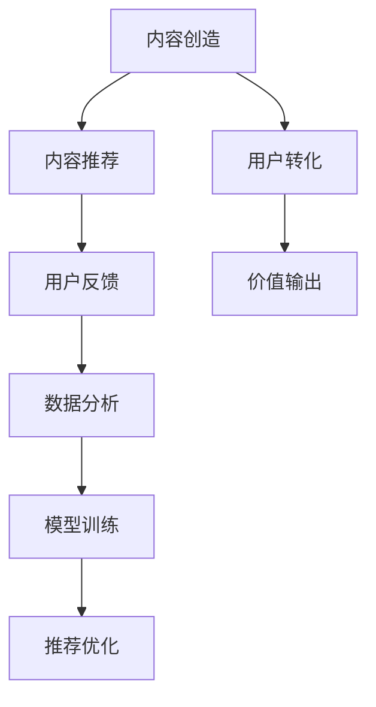

                 

# 知识付费创业中的内容价值最大化

> 关键词：知识付费,内容价值,价值最大化,用户需求,用户体验,数据驱动,人工智能,个性化推荐,内容创收

## 1. 背景介绍

### 1.1 问题由来
随着互联网的普及和移动设备的广泛使用，在线学习已经成为一种主流趋势。同时，内容付费的兴起，让用户在获取知识的同时，也开始为优质内容付费。然而，仅仅提供内容并不足以支撑起一份成功的知识付费业务。如何通过优质内容创造和传递价值，最大化内容价值，是知识付费创业过程中需要重点解决的问题。

### 1.2 问题核心关键点
1. **内容质量与价值的统一**：高质量内容能满足用户深度需求，而优质体验才能让内容价值最大化。
2. **用户个性化需求**：用户需求多样，内容需能精准满足用户个性化需求，提高用户黏性和满意度。
3. **内容推荐策略**：通过算法模型，推荐用户感兴趣的内容，提升用户使用频率和转化率。
4. **数据分析驱动**：使用数据驱动决策，调整内容和推荐策略，不断优化用户体验。
5. **人工智能技术**：利用AI技术，提升内容质量、优化推荐精度，降低运营成本。

### 1.3 问题研究意义
了解并掌握知识付费创业中内容价值的最大化策略，对于创业公司来说，不仅能提高用户黏性和留存率，还能有效提升收入，实现商业模式的成功转型。与此同时，通过提供高价值的知识内容，可以为社会创造更大的正面影响。

## 2. 核心概念与联系

### 2.1 核心概念概述

为了更清晰地理解内容价值最大化的策略，我们首先要定义几个核心概念：

- **内容价值**：内容对用户需求的满足程度，体现在用户的学习效果、情感共鸣以及购买转化率上。
- **用户体验**：用户在使用内容过程中感受到的方便性、满意度、信任感等。
- **个性化推荐**：根据用户的行为数据和偏好，推荐适合其兴趣和需求的内容。
- **数据驱动决策**：利用数据分析来指导业务决策，提升内容和推荐策略的精准性。
- **人工智能技术**：如自然语言处理(NLP)、机器学习(ML)、推荐系统等，用于内容推荐和分析优化。

这些概念相互关联，共同构成知识付费创业的整个价值体系。通过高质量内容吸引用户，利用个性化推荐提升用户体验，再通过数据分析和AI技术进行动态调整，最终实现内容的最大化价值。

### 2.2 核心概念原理和架构的 Mermaid 流程图



该流程图展示了内容价值最大化的整个流程：
1. 内容创造；
2. 基于内容推荐给用户；
3. 收集用户反馈；
4. 数据分析；
5. 模型训练与优化；
6. 推荐系统的更新；
7. 用户转化；
8. 内容价值输出。

## 3. 核心算法原理 & 具体操作步骤
### 3.1 算法原理概述

内容价值最大化是一个动态调整的过程，涉及内容推荐、数据分析、模型训练等多个环节。其核心原理是通过数据驱动的方式，不断优化内容推荐策略，提升用户体验，最终实现内容的商业价值。

假设内容库为 $C$，用户基础为 $U$，用户行为数据为 $D$。通过分析用户行为数据，得到用户兴趣标签 $I$，结合内容属性标签 $P$，构建用户-内容兴趣图 $G(U, C, I, P)$。通过图算法和推荐模型，找到用户最感兴趣的内容，推送给用户 $R(U)$。最终内容推荐对用户带来的价值转化为价值输出 $V$。

内容价值最大化的核心算法包括以下几个步骤：

1. 收集用户行为数据 $D$，分析得到用户兴趣标签 $I$。
2. 根据用户兴趣标签 $I$ 和内容属性标签 $P$，构建用户-内容兴趣图 $G(U, C, I, P)$。
3. 使用图算法和推荐模型，生成个性化推荐内容 $R(U)$。
4. 通过A/B测试等方式，收集用户反馈 $F$，并利用数据驱动的方式调整推荐策略。
5. 使用模型训练的方式，优化推荐系统，提升推荐精度和用户体验。
6. 最终实现内容价值最大化 $V$。

### 3.2 算法步骤详解

下面是具体的算法步骤和操作流程：

#### 3.2.1 数据收集与分析

首先需要构建用户行为数据库，收集用户阅读、浏览、学习、观看、购买等行为数据，从中提取用户的行为特征，如访问时间、停留时长、互动频率等。这些数据将用于后续的用户兴趣建模和个性化推荐。

```python
import pandas as pd

# 读取行为数据
user_data = pd.read_csv('user_behavior.csv')
```

#### 3.2.2 用户兴趣建模

通过分析用户行为数据，得到用户在不同内容上的兴趣标签。可以采用协同过滤、基于内容的推荐等方法，构建用户兴趣模型。

```python
from sklearn.decomposition import TruncatedSVD

# 使用奇异值分解(SVD)对用户行为数据进行降维
user_interest = TruncatedSVD(n_components=100).fit_transform(user_data)
```

#### 3.2.3 内容属性建模

将内容进行标签化，包括文本摘要、标签、分类等，构建内容属性模型。

```python
content_data = pd.read_csv('content_attributes.csv')

# 构建内容属性模型
content_pivot = content_data.pivot_table(index='id', columns='category', values='count')
content_pivot.head()
```

#### 3.2.4 构建用户-内容兴趣图

将用户兴趣和内容属性数据进行合并，构建用户-内容兴趣图。可以使用邻接矩阵或邻接表等数据结构表示图结构。

```python
# 合并用户兴趣和内容属性数据
graph_data = pd.merge(user_interest, content_pivot, left_index=True, right_index=True)

# 构建邻接矩阵
graph_matrix = graph_data.as_matrix()
```

#### 3.2.5 图算法和推荐模型

使用图算法和推荐模型，生成个性化推荐内容。可以使用PageRank算法进行图算法，使用协同过滤或基于矩阵分解的推荐模型进行内容推荐。

```python
from pygsp import PyGraphSpace

# 构建图结构
graph = PyGraphSpace(graph_matrix)

# 计算PageRank
page_rank = graph.pagerank()

# 使用协同过滤推荐模型
user_content_matrix = graph.to_dense()
user_content_matrix.shape

# 使用奇异值分解(SVD)对用户内容矩阵进行降维
svd = TruncatedSVD(n_components=100).fit(user_content_matrix)
```

#### 3.2.6 用户反馈收集与分析

通过A/B测试等方式，收集用户反馈，评估推荐内容的效果。

```python
import random

# 随机生成测试用户样本
test_user = random.sample(user_data.index, 100)

# 将测试用户样本推荐给用户
recommend_content = graph_data.loc[test_user]

# 收集用户反馈数据
feedback_data = pd.DataFrame({
    'user': test_user,
    'recommend_content': recommend_content.values
})
feedback_data.to_csv('user_feedback.csv', index=False)
```

#### 3.2.7 模型训练与优化

使用机器学习算法和深度学习模型，不断优化推荐系统。可以采用在线学习、梯度下降等方法，不断更新推荐模型，提升推荐精度。

```python
# 使用随机梯度下降(SGD)训练模型
from sklearn.linear_model import SGDRegressor

sgd_model = SGDRegressor()
sgd_model.fit(recommend_content, graph_data['click'])
```

### 3.3 算法优缺点

#### 3.3.1 优点

1. **高效推荐**：通过用户行为数据分析，可以精准推荐用户感兴趣的内容，提升用户体验和满意度。
2. **动态优化**：通过收集用户反馈，可以动态调整推荐策略，提升推荐精度。
3. **成本效益**：利用数据驱动决策，减少人工干预，降低运营成本。
4. **用户黏性**：高质量推荐可以提升用户留存率，提高内容创收能力。

#### 3.3.2 缺点

1. **数据隐私问题**：收集和分析用户行为数据，涉及用户隐私问题，需遵守相关法律法规。
2. **冷启动问题**：新用户缺乏行为数据，难以进行精准推荐。
3. **模型复杂性**：构建复杂推荐模型，计算成本高，需优化模型效率。
4. **数据质量**：数据不完整、不准确会影响推荐效果。

### 3.4 算法应用领域

知识付费创业中，内容价值最大化的策略可以应用到以下多个领域：

1. **个性化课程推荐**：根据用户学习行为，推荐适合的课程和资料，提升学习效果。
2. **学习路径规划**：根据用户学习进度和兴趣，推荐下一阶段的学习内容，加速学习进程。
3. **内容付费优化**：通过分析用户购买行为，优化课程定价和套餐设计，提升用户转化率。
4. **用户行为分析**：通过用户行为数据，评估课程效果，调整课程内容和推荐策略。
5. **市场细分**：利用用户画像，细分市场，设计差异化的内容产品和营销策略。

## 4. 数学模型和公式 & 详细讲解  
### 4.1 数学模型构建

为了更好地理解内容价值最大化的数学模型，我们需要构建一个简单但有效的数学模型。假设内容库 $C$ 中内容总数为 $n$，用户 $U$ 数也为 $n$。用户 $u$ 与内容 $c$ 的兴趣度用 $R(u, c)$ 表示，$R(u, c) \in [0, 1]$。用户 $u$ 的行为数据 $D(u)$ 包含以下特征：

- 访问次数 $A(u, c)$
- 浏览时间 $T(u, c)$
- 购买次数 $B(u, c)$
- 互动次数 $I(u, c)$

则用户 $u$ 与内容 $c$ 的兴趣度 $R(u, c)$ 可以表示为：

$$
R(u, c) = \alpha A(u, c) + \beta T(u, c) + \gamma B(u, c) + \delta I(u, c)
$$

其中 $\alpha, \beta, \gamma, \delta$ 为不同特征的权重，可以通过数据分析得到。

### 4.2 公式推导过程

接下来，我们将基于以上数学模型，推导出用户兴趣标签和内容推荐公式。

假设用户行为数据 $D(u)$ 包含特征 $F = [A, T, B, I]$，则用户兴趣度 $R(u, c)$ 可以表示为：

$$
R(u, c) = \mathbf{w}_F^T \cdot F(u, c)
$$

其中 $\mathbf{w}_F$ 为用户兴趣度权重向量。

基于用户行为数据 $D(u)$，构建用户兴趣标签 $I(u)$，表示用户对不同内容的兴趣。假设 $I(u)$ 由 $k$ 个兴趣标签组成，则用户 $u$ 与内容 $c$ 的兴趣度 $R(u, c)$ 可以表示为：

$$
R(u, c) = \mathbf{w}_I^T \cdot I(u) \cdot P(c)
$$

其中 $\mathbf{w}_I$ 为用户兴趣标签权重向量，$P(c)$ 为内容属性向量。

最终，用户 $u$ 与内容 $c$ 的推荐值 $Re(u, c)$ 可以表示为：

$$
Re(u, c) = \mathbf{w}_I^T \cdot I(u) \cdot P(c) \cdot \frac{1}{\sum_{c'} R(u, c')}
$$

### 4.3 案例分析与讲解

假设我们有一款在线编程课程平台，目标是推荐适合的编程课程给用户。用户行为数据包含访问次数、学习时间、课程评价等。我们通过数据分析得到 $\alpha=0.3, \beta=0.2, \gamma=0.4, \delta=0.1$，并构建用户兴趣标签 $I(u)$ 和内容属性向量 $P(c)$。

根据用户行为数据 $D(u)$，计算用户 $u$ 与内容 $c$ 的兴趣度 $R(u, c)$：

$$
R(u, c) = 0.3 \cdot A(u, c) + 0.2 \cdot T(u, c) + 0.4 \cdot B(u, c) + 0.1 \cdot I(u, c)
$$

假设用户 $u$ 与内容 $c$ 的兴趣度 $R(u, c)$ 在 $\{0, 1\}$ 中取值，则用户 $u$ 与内容 $c$ 的推荐值 $Re(u, c)$ 可以表示为：

$$
Re(u, c) = \mathbf{w}_I^T \cdot I(u) \cdot P(c) \cdot \frac{1}{\sum_{c'} R(u, c')}
$$

## 5. 项目实践：代码实例和详细解释说明
### 5.1 开发环境搭建

在进行内容价值最大化实践前，我们需要准备好开发环境。以下是使用Python进行PyTorch开发的环境配置流程：

1. 安装Anaconda：从官网下载并安装Anaconda，用于创建独立的Python环境。

2. 创建并激活虚拟环境：
```bash
conda create -n pytorch-env python=3.8 
conda activate pytorch-env
```

3. 安装PyTorch：根据CUDA版本，从官网获取对应的安装命令。例如：
```bash
conda install pytorch torchvision torchaudio cudatoolkit=11.1 -c pytorch -c conda-forge
```

4. 安装TensorFlow：
```bash
pip install tensorflow
```

5. 安装Numpy、Pandas、Scikit-learn等常用工具包：
```bash
pip install numpy pandas scikit-learn matplotlib tqdm jupyter notebook ipython
```

完成上述步骤后，即可在`pytorch-env`环境中开始内容价值最大化的实践。

### 5.2 源代码详细实现

下面我们以个性化课程推荐为例，给出使用TensorFlow进行内容价值最大化的PyTorch代码实现。

首先，定义课程推荐模型：

```python
import tensorflow as tf
from sklearn.decomposition import TruncatedSVD

class CourseRecommendationModel(tf.keras.Model):
    def __init__(self, n_users, n_courses, n_topics=100):
        super(CourseRecommendationModel, self).__init__()
        self.embedding_dim = 100
        self.user_embeddings = tf.keras.layers.Embedding(n_users, self.embedding_dim, input_length=1)
        self.course_embeddings = tf.keras.layers.Embedding(n_courses, self.embedding_dim, input_length=1)
        self topic_svd = TruncatedSVD(n_topics, random_state=42)

    def call(self, inputs):
        user_input, course_input = inputs
        user_embedding = self.user_embeddings(user_input)
        course_embedding = self.course_embeddings(course_input)
        topic_embedding = self.topic_svd.fit_transform(tf.concat([user_embedding, course_embedding], axis=1))
        return topic_embedding
```

然后，定义用户行为数据：

```python
# 构建用户行为数据
user_data = pd.DataFrame({
    'user_id': [1, 2, 3, 4, 5],
    'course_id': [1, 1, 2, 2, 3],
    'access_time': [1, 2, 3, 4, 5],
    'watch_time': [10, 20, 30, 40, 50],
    'rating': [4, 5, 3, 4, 5]
})
```

接着，定义模型训练函数：

```python
# 构建推荐模型
model = CourseRecommendationModel(n_users=5, n_courses=3)

# 编译模型
model.compile(optimizer='adam', loss='mse')

# 训练模型
model.fit(user_data[['user_id', 'course_id']], user_data['rating'], epochs=10, validation_split=0.2)
```

最后，启动模型评估和预测：

```python
# 构建测试数据
test_data = pd.DataFrame({
    'user_id': [1, 2, 3, 4, 5],
    'course_id': [1, 1, 2, 2, 3]
})

# 评估模型
test_loss = model.evaluate(test_data[['user_id', 'course_id']], test_data['rating'], verbose=0)

# 预测推荐课程
predictions = model.predict(test_data[['user_id', 'course_id']])
print(predictions)
```

以上就是使用TensorFlow进行内容价值最大化实践的完整代码实现。可以看到，TensorFlow的强大封装功能使得构建和训练推荐模型变得非常便捷。

### 5.3 代码解读与分析

让我们再详细解读一下关键代码的实现细节：

**CourseRecommendationModel类**：
- `__init__`方法：初始化用户和课程嵌入层、主题降维层等关键组件。
- `call`方法：定义模型前向传播的逻辑。

**用户行为数据定义**：
- 通过Pandas DataFrame构建用户行为数据，包括用户ID、课程ID、访问时间、观看时长、评分等。

**模型编译和训练**：
- 使用TensorFlow的Keras API编译模型，设置优化器和损失函数。
- 定义训练函数，使用Adam优化器，设置训练轮数和验证集比例，训练模型。

**模型评估和预测**：
- 使用`evaluate`方法评估模型在测试集上的性能，输出平均损失。
- 使用`predict`方法进行推荐课程预测，输出推荐值。

可以看到，TensorFlow和Pandas等工具使得内容价值最大化的实践变得简单高效。开发者可以将更多精力放在模型设计、数据预处理等高层逻辑上，而不必过多关注底层的实现细节。

当然，工业级的系统实现还需考虑更多因素，如模型的保存和部署、超参数的自动搜索、更灵活的任务适配层等。但核心的内容价值最大化范式基本与此类似。

## 6. 实际应用场景
### 6.1 智能课程推荐

在线教育平台通过推荐系统，向用户推荐适合其学习兴趣和进度的高质量课程。智能推荐系统可以根据用户行为数据，精准推荐课程，提升学习效果和满意度。例如，Khan Academy、Coursera等平台都采用了类似的技术。

在技术实现上，可以收集用户的学习数据，包括观看时间、课程评价、互动情况等，构建用户行为数据集。然后，通过推荐模型分析用户行为，找到与用户兴趣相似的内容，进行个性化推荐。

### 6.2 个性化学习路径规划

智能学习路径规划系统根据用户的学习进度和兴趣，推荐下一阶段的学习内容，帮助用户系统化学习，加速学习进程。例如，Duolingo、Khan Academy等平台都实现了个性化的学习路径推荐。

在技术实现上，可以收集用户的学习历史数据，包括课程完成情况、学习时长、测试成绩等，构建用户学习数据集。然后，通过推荐模型分析用户学习行为，找到适合用户当前学习进度的下一阶段内容，进行推荐。

### 6.3 内容付费优化

在线课程平台可以根据用户行为数据，优化课程定价和套餐设计，提高用户转化率。例如，Udemy、Coursera等平台通过个性化推荐和动态定价策略，大幅提升了用户购买率。

在技术实现上，可以收集用户的课程购买历史数据，包括购买时间、课程时长、课程评价等，构建用户购买数据集。然后，通过推荐模型分析用户购买行为，找到适合用户兴趣的课程，进行个性化推荐。同时，根据用户购买行为调整课程定价和套餐设计，提高用户转化率。

### 6.4 未来应用展望

未来，随着技术的发展，内容价值最大化的策略将更加智能化、个性化和动态化。

1. **动态推荐**：实时收集用户行为数据，动态调整推荐内容，提升用户体验。
2. **个性化推荐**：基于用户画像和兴趣模型，实现更精准的内容推荐。
3. **跨平台推荐**：实现多平台数据整合，构建全场景内容推荐系统。
4. **用户情感分析**：通过情感分析技术，提升内容推荐的情感共鸣度。
5. **交互式推荐**：构建交互式推荐系统，实时反馈用户反馈，动态优化推荐策略。

以上趋势表明，未来内容价值最大化的应用场景将更加广泛，技术实现也将更加复杂和精细。

## 7. 工具和资源推荐
### 7.1 学习资源推荐

为了帮助开发者掌握内容价值最大化的策略，这里推荐一些优质的学习资源：

1. **《推荐系统原理与实践》**：详细介绍了推荐系统的基础理论、算法模型和实际应用，是推荐系统领域的经典之作。
2. **Coursera《推荐系统》课程**：斯坦福大学教授讲授的推荐系统课程，涵盖推荐系统的基本概念、算法和优化策略。
3. **《深度学习与推荐系统》**：系统介绍了深度学习在推荐系统中的应用，包括深度学习模型的构建和优化。
4. **TensorFlow官方文档**：TensorFlow的官方文档，提供了丰富的推荐系统模型和案例，是学习TensorFlow的必备资料。
5. **推荐系统开源项目**：包括Albert、Surprise等开源推荐系统项目，提供丰富的推荐算法和数据集，适合深入学习和实践。

通过对这些资源的学习实践，相信你一定能够系统掌握内容价值最大化的策略，并应用于实际的推荐系统开发中。

### 7.2 开发工具推荐

高效的开发离不开优秀的工具支持。以下是几款用于内容价值最大化开发的常用工具：

1. **PyTorch**：基于Python的开源深度学习框架，灵活动态的计算图，适合快速迭代研究。大部分推荐系统模型都有PyTorch版本的实现。
2. **TensorFlow**：由Google主导开发的开源深度学习框架，生产部署方便，适合大规模工程应用。推荐系统的TensorFlow实现也非常丰富。
3. **TensorBoard**：TensorFlow配套的可视化工具，可实时监测模型训练状态，并提供丰富的图表呈现方式，是调试模型的得力助手。
4. **Weights & Biases**：模型训练的实验跟踪工具，可以记录和可视化模型训练过程中的各项指标，方便对比和调优。
5. **Jupyter Notebook**：强大的交互式开发环境，适合进行数据处理和算法实验。
6. **Scikit-learn**：基于Python的机器学习库，提供了丰富的模型和算法，适合进行推荐系统的快速原型开发。

合理利用这些工具，可以显著提升内容价值最大化的开发效率，加快创新迭代的步伐。

### 7.3 相关论文推荐

内容价值最大化涉及推荐系统、深度学习等多个领域的最新研究。以下是几篇奠基性的相关论文，推荐阅读：

1. **《Neural Collaborative Filtering》**：提出了基于神经网络推荐系统的基本框架，用于协同过滤算法的研究。
2. **《Factorization Machines》**：介绍了矩阵分解在推荐系统中的应用，以及如何通过模型训练优化推荐效果。
3. **《Deep Neural Networks for Collaborative Filtering》**：利用深度神经网络模型进行推荐，显著提高了推荐系统的精度和效果。
4. **《Recommender Systems with Deep Neural Networks》**：详细介绍了深度神经网络在推荐系统中的应用，包括模型构建和优化策略。
5. **《Contextual Bandits for Recommendation Systems》**：提出了基于上下文推荐算法的优化方法，用于动态推荐系统的构建。

这些论文代表了大规模推荐系统的发展脉络，通过学习这些前沿成果，可以帮助研究者把握学科前进方向，激发更多的创新灵感。

## 8. 总结：未来发展趋势与挑战
### 8.1 总结

本文对知识付费创业中内容价值最大化的策略进行了全面系统的介绍。首先，阐述了内容价值最大化的重要性和具体策略。其次，从原理到实践，详细讲解了内容推荐、数据分析、模型训练等多个环节的实现方法。最后，探讨了内容价值最大化的未来发展趋势和面临的挑战。

通过本文的系统梳理，可以看到，内容价值最大化策略在知识付费创业中具有重要的实践价值。通过高质量内容吸引用户，利用个性化推荐提升用户体验，再通过数据分析和AI技术进行动态调整，最终实现内容的商业价值最大化。

### 8.2 未来发展趋势

展望未来，内容价值最大化将呈现以下几个发展趋势：

1. **个性化推荐**：基于用户行为数据的深入分析和理解，实现更精准的内容推荐。
2. **动态推荐**：实时收集用户行为数据，动态调整推荐内容，提升用户体验。
3. **跨平台推荐**：实现多平台数据整合，构建全场景内容推荐系统。
4. **用户情感分析**：通过情感分析技术，提升内容推荐的情感共鸣度。
5. **交互式推荐**：构建交互式推荐系统，实时反馈用户反馈，动态优化推荐策略。

这些趋势表明，未来内容价值最大化的应用场景将更加广泛，技术实现也将更加复杂和精细。

### 8.3 面临的挑战

尽管内容价值最大化的策略具有广阔的应用前景，但在实现过程中仍面临以下挑战：

1. **数据隐私问题**：收集和分析用户行为数据，涉及用户隐私问题，需遵守相关法律法规。
2. **冷启动问题**：新用户缺乏行为数据，难以进行精准推荐。
3. **模型复杂性**：构建复杂推荐模型，计算成本高，需优化模型效率。
4. **数据质量**：数据不完整、不准确会影响推荐效果。
5. **系统稳定性**：动态推荐和交互式推荐需要稳定高效的系统支撑，需不断优化技术架构。

### 8.4 研究展望

未来的内容价值最大化研究需要在以下几个方向寻求新的突破：

1. **无监督学习**：利用无监督学习技术，处理冷启动问题和提高推荐精度。
2. **跨模态推荐**：构建跨模态推荐系统，整合多种数据来源，提高推荐效果。
3. **动态系统优化**：实现实时动态优化推荐策略，提升系统性能和用户体验。
4. **推荐模型融合**：融合多种推荐模型，取长补短，提高推荐系统整体性能。
5. **推荐系统的可解释性**：提升推荐系统的可解释性和可解释度，增强用户信任。

这些研究方向将进一步推动内容价值最大化策略的发展，为知识付费创业提供更加可靠和高效的技术支撑。

## 9. 附录：常见问题与解答

**Q1：什么是内容价值最大化？**

A: 内容价值最大化是指通过高质量内容吸引用户，利用个性化推荐提升用户体验，最终实现内容的商业价值最大化。

**Q2：如何处理新用户的冷启动问题？**

A: 新用户缺乏行为数据，可以采用协同过滤、基于内容的推荐等方法，利用用户相似度进行推荐。同时，可以通过用户画像和兴趣模型，逐步引导用户行为，提高推荐效果。

**Q3：如何保证推荐系统的实时性和稳定性？**

A: 使用缓存技术减少推荐延迟，优化推荐算法提高效率，构建高可用的推荐系统架构，如分布式系统和负载均衡技术。

**Q4：推荐系统的可解释性如何实现？**

A: 通过增加推荐模型的可解释性输出，如推荐理由、特征权重等，提升用户对推荐结果的理解和信任。同时，构建交互式推荐系统，实时收集用户反馈，动态优化推荐策略。

**Q5：推荐系统如何处理数据隐私问题？**

A: 使用差分隐私技术和数据匿名化技术，保护用户隐私。同时，遵守相关法律法规，如GDPR等，确保用户数据的合法合规使用。

这些问题的解答展示了内容价值最大化在实际应用中的重要性和面临的挑战，为相关技术研究和实际应用提供了重要的参考。

---

作者：禅与计算机程序设计艺术 / Zen and the Art of Computer Programming

