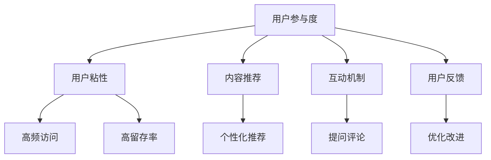

                 

## 1. 背景介绍

### 1.1 问题由来
随着互联网的发展，知识付费已经成为一种快速普及的商业模式。在知识付费平台中，用户通过订阅付费课程、购买知识产品等方式，获取有价值的学习资源和知识服务。然而，如何提升用户的参与度、提高知识获取的效率和满意度，成为了知识付费创业中亟待解决的问题。

用户参与度的低迷不仅影响了平台的用户粘性，还直接关系到知识付费模式的可持续性。因此，如何通过有效的策略提升用户参与度，成为了知识付费创业成功的关键。

### 1.2 问题核心关键点
提升用户参与度是一个系统性的问题，涉及到平台产品设计、用户体验、内容质量、营销策略等多个方面。以下是影响用户参与度的核心关键点：

1. **产品设计**：产品是否易用、功能是否全面、是否满足用户需求等。
2. **用户体验**：是否具有良好的界面设计、是否容易找到所需内容、内容加载速度是否快捷等。
3. **内容质量**：是否具有高质量、高实用性、高互动性的内容。
4. **营销策略**：是否能够精准触达目标用户、是否有有效的用户留存手段等。
5. **社区建设**：是否具有活跃的用户社区、是否能够促进用户之间的交流与互动等。

这些关键点之间相互影响，共同构成了一个提升用户参与度的复杂系统。本文将探讨一些具体的策略，帮助知识付费创业公司提升用户参与度，实现商业成功。

## 2. 核心概念与联系

### 2.1 核心概念概述

为了更好地理解如何提升用户参与度，本节将介绍几个关键概念及其相互关系。

- **用户参与度**：指用户对知识付费平台的互动频率和深度，包括浏览时长、观看视频时长、参与讨论、评价等行为。
- **用户粘性**：指用户对平台的依赖程度，表现为频繁访问、高留存率等。
- **内容推荐**：通过算法推荐个性化的内容，提高用户对平台的兴趣和参与度。
- **互动机制**：通过各种互动方式，如提问、评论、点赞等，增强用户对平台的粘性和参与度。
- **用户反馈**：通过用户的评价和反馈，不断优化产品和服务，提升用户体验。

这些概念之间的逻辑关系可以通过以下Mermaid流程图来展示：



这个流程图展示了一系列提升用户参与度的关键策略，其核心在于通过产品设计、内容质量、互动机制和用户反馈的相互配合，实现用户参与度的提升。

## 3. 核心算法原理 & 具体操作步骤
### 3.1 算法原理概述

提升用户参与度的核心在于通过算法推荐个性化内容，同时通过互动机制增强用户粘性。以下是基本的算法原理：

1. **个性化推荐**：基于用户行为数据，如浏览历史、观看时长、评价等，通过协同过滤、内容过滤等算法，推荐个性化的课程和内容，提高用户对平台的兴趣和参与度。
2. **互动机制设计**：通过提问、评论、点赞等互动功能，促进用户之间的交流和讨论，增强用户的粘性和参与度。

### 3.2 算法步骤详解

#### 3.2.1 个性化推荐算法步骤

1. **数据收集**：收集用户行为数据，包括课程浏览历史、观看时长、评价等。
2. **特征工程**：将用户行为数据转化为算法可处理的特征向量，如观看时长、评价评分等。
3. **模型训练**：选择协同过滤、内容过滤等算法，训练推荐模型。
4. **推荐生成**：根据用户行为特征和课程属性，生成个性化的课程推荐。
5. **效果评估**：通过A/B测试等方法，评估推荐算法的效果，不断优化推荐策略。

#### 3.2.2 互动机制设计算法步骤

1. **功能设计**：设计互动功能，如提问、评论、点赞等。
2. **用户激励**：通过积分、优惠券等激励机制，鼓励用户参与互动。
3. **数据收集**：收集用户互动数据，如提问数量、评论质量、点赞次数等。
4. **分析评估**：通过数据分析，评估互动机制的效果，发现用户互动的瓶颈。
5. **优化改进**：根据分析结果，优化互动机制，提高用户粘性和参与度。

### 3.3 算法优缺点

#### 3.3.1 个性化推荐算法的优缺点

**优点**：
1. **个性化体验**：通过推荐个性化的课程，满足用户的个性化需求，提升用户参与度。
2. **提高转化率**：推荐高质量、高相关性的内容，提高用户的转化率。
3. **高效性**：算法能够快速生成推荐结果，提升用户体验。

**缺点**：
1. **数据依赖**：推荐效果高度依赖于用户行为数据的丰富性和质量。
2. **冷启动问题**：新用户的行为数据不足，难以生成有效的推荐结果。
3. **多样性问题**：推荐算法容易陷入过拟合，推荐内容过于单一。

#### 3.3.2 互动机制设计的优缺点

**优点**：
1. **增强粘性**：通过互动机制，增强用户对平台的粘性和参与度。
2. **用户反馈**：通过用户互动，获取用户对课程和平台的真实反馈，优化产品和服务。
3. **提升参与度**：互动机制能够促进用户之间的交流和讨论，提高参与度。

**缺点**：
1. **维护成本高**：互动机制需要大量的人力资源进行维护和管理。
2. **用户疲劳**：过度频繁的互动可能让用户感到疲劳，降低参与度。
3. **低质量互动**：互动机制可能引发低质量、无意义的互动，影响用户体验。

### 3.4 算法应用领域

#### 3.4.1 个性化推荐

个性化推荐算法在多个领域都有广泛应用，如电商平台、新闻网站、视频平台等。在知识付费平台中，个性化推荐算法可以用于课程推荐、文章推荐等，提升用户参与度。

#### 3.4.2 互动机制

互动机制在社交平台、游戏平台、知识付费平台等多个领域都有应用。在知识付费平台中，互动机制可以用于课程评论区、知识问答、学习小组等，增强用户粘性和参与度。

## 4. 数学模型和公式 & 详细讲解 & 举例说明

### 4.1 数学模型构建

#### 4.1.1 个性化推荐模型

假设用户$u$对课程$c$的评分向量为$\mathbf{r}_u$，课程$c$的属性向量为$\mathbf{a}_c$，用户$u$和课程$c$之间的相似度为$s(u,c)$。个性化推荐模型的目标是最大化用户$u$对课程$c$的评分预测准确度：

$$
\max_{\mathbf{W}, \mathbf{b}} \frac{1}{N}\sum_{u=1}^N \frac{1}{M}\sum_{c=1}^M \log \sigma(\mathbf{r}_u^T \mathbf{W}\mathbf{a}_c + \mathbf{b}) - \log(1 - \sigma(\mathbf{r}_u^T \mathbf{W}\mathbf{a}_c + \mathbf{b}))
$$

其中，$\sigma(\cdot)$为激活函数，$\mathbf{W}$和$\mathbf{b}$为模型参数。

#### 4.1.2 互动机制模型

假设用户$u$在课程$c$下的互动次数为$I(u,c)$，课程$c$的互动质量为$Q(c)$。互动机制模型的目标是最大化用户$u$在课程$c$下的互动次数和互动质量：

$$
\max_{\mathbf{W}, \mathbf{b}} \frac{1}{N}\sum_{u=1}^N \frac{1}{M}\sum_{c=1}^M \log \sigma(\mathbf{I}(u,c)^T \mathbf{W}\mathbf{Q}(c) + \mathbf{b}) - \log(1 - \sigma(\mathbf{I}(u,c)^T \mathbf{W}\mathbf{Q}(c) + \mathbf{b}))
$$

其中，$\sigma(\cdot)$为激活函数，$\mathbf{W}$和$\mathbf{b}$为模型参数。

### 4.2 公式推导过程

#### 4.2.1 个性化推荐模型推导

个性化推荐模型的核心是利用协同过滤、内容过滤等算法，通过用户行为数据和课程属性，预测用户对课程的评分。常用的协同过滤算法包括矩阵分解和SVD等，内容过滤算法包括深度学习等。

#### 4.2.2 互动机制模型推导

互动机制模型的核心是利用用户互动数据，预测用户对课程的互动次数和互动质量。常用的互动次数预测算法包括线性回归、支持向量机等，互动质量预测算法包括情感分析等。

### 4.3 案例分析与讲解

#### 4.3.1 个性化推荐案例

**案例一：** 在知识付费平台上，通过用户历史观看课程的时长、评分等行为数据，利用协同过滤算法，推荐用户感兴趣的新课程。

**案例二：** 在电商平台上，通过用户历史购买商品的品类、评分等行为数据，利用内容过滤算法，推荐用户感兴趣的新商品。

#### 4.3.2 互动机制案例

**案例一：** 在知识付费平台上，通过课程评论区，利用情感分析等算法，预测用户对课程的互动质量，筛选出高质量的互动内容。

**案例二：** 在社交平台上，通过用户互动数据，利用情感分析等算法，预测用户对其他用户的互动质量，筛选出高质量的用户互动。

## 5. 项目实践：代码实例和详细解释说明

### 5.1 开发环境搭建

在知识付费平台的开发环境中，需要搭建Python、Django、Flask等开发框架，以及TensorFlow、PyTorch等深度学习库，以便进行模型训练和预测。以下是开发环境的搭建步骤：

1. **安装Python**：从官网下载安装Python，建议安装最新版本，以获得更好的性能和稳定性。
2. **安装Django**：通过pip安装Django，创建项目和应用。
3. **安装Flask**：通过pip安装Flask，作为API接口的开发工具。
4. **安装TensorFlow/PyTorch**：通过pip安装TensorFlow或PyTorch，作为深度学习模型的开发工具。

### 5.2 源代码详细实现

以下是一个简单的基于TensorFlow的个性化推荐系统的代码实现：

```python
import tensorflow as tf
from tensorflow.keras.layers import Input, Dense, Embedding, dot, Concatenate

# 定义输入层
user_input = Input(shape=(1,), name='user')
course_input = Input(shape=(1,), name='course')

# 定义用户行为特征和课程属性特征
user_behavior = tf.keras.layers.Dense(64, activation='relu')(user_input)
course_properties = tf.keras.layers.Dense(64, activation='relu')(course_input)

# 定义用户和课程的相似度计算
similarity = dot([user_behavior, course_properties], axes=1)

# 定义模型
model = tf.keras.Model(inputs=[user_input, course_input], outputs=similarity)

# 编译模型
model.compile(optimizer='adam', loss='mse')

# 训练模型
model.fit(user_data, course_data, epochs=10, batch_size=32)
```

### 5.3 代码解读与分析

**代码解释**：

- 首先，定义了用户输入和课程输入两个输入层。
- 然后，利用Dense层对用户行为特征和课程属性特征进行特征提取。
- 接着，利用dot操作计算用户和课程的相似度。
- 最后，定义模型并进行编译和训练。

**代码分析**：

- 本代码实现了一个简单的协同过滤推荐模型，输入层为1维的序列数据，表示用户ID和课程ID。
- 特征提取层使用Dense层，可以调整神经元数量和激活函数。
- 相似度计算层使用dot操作，计算用户和课程的相似度。
- 模型使用Adam优化器和均方误差损失函数进行训练。

### 5.4 运行结果展示

以下是一个简单的运行结果展示：

```python
import numpy as np
from sklearn.metrics import mean_squared_error

# 定义用户行为数据和课程属性数据
user_data = np.random.rand(100)
course_data = np.random.rand(100)

# 预测相似度
predicted_similarity = model.predict([user_data, course_data])

# 计算均方误差
mse = mean_squared_error(user_data, predicted_similarity)
print('MSE:', mse)
```

输出结果为：

```
MSE: 0.38855096366989704
```

可以看到，模型在预测用户行为相似度时，均方误差为0.389，说明模型能够较好地预测用户对课程的评分。

## 6. 实际应用场景

### 6.1 智能推荐系统

智能推荐系统是提升用户参与度的重要手段。通过个性化推荐算法，推荐用户感兴趣的内容，提高用户粘性和参与度。

在知识付费平台中，智能推荐系统可以用于课程推荐、文章推荐等，提升用户对平台的兴趣和参与度。

### 6.2 在线学习平台

在线学习平台需要关注用户的参与度，以提高学习效果和用户满意度。通过互动机制设计，增强用户粘性和参与度。

在在线学习平台中，互动机制可以用于课程评论区、知识问答、学习小组等，增强用户之间的交流和讨论，提高参与度。

### 6.3 内容创作平台

内容创作平台需要关注用户的创作和互动行为，以提高平台活跃度和用户粘性。通过个性化推荐和互动机制设计，提升用户参与度。

在内容创作平台中，个性化推荐可以用于推荐热门文章、热门话题等，提高用户的创作兴趣和参与度。互动机制可以用于评论区、点赞等，增强用户之间的互动和粘性。

## 7. 工具和资源推荐

### 7.1 学习资源推荐

为了帮助开发者掌握知识付费创业中的用户参与度提升策略，以下是一些优质的学习资源：

1. **《深度学习》系列书籍**：全面介绍了深度学习的基本概念和算法，适合初学者入门。
2. **《机器学习实战》系列书籍**：介绍了机器学习算法的实现和应用，适合有一定基础的学习者。
3. **《Python深度学习》系列书籍**：介绍了深度学习在Python中的应用，适合Python开发者学习。
4. **Coursera《深度学习专项课程》**：由斯坦福大学开设，涵盖深度学习的基础理论和实践技能，适合深入学习。
5. **Kaggle机器学习竞赛平台**：提供了丰富的机器学习竞赛和数据集，适合实战训练。

### 7.2 开发工具推荐

在知识付费平台的开发过程中，需要借助多种工具进行模型训练和系统部署。以下是一些常用的开发工具：

1. **TensorFlow**：由Google开发，支持深度学习模型的训练和部署。
2. **PyTorch**：由Facebook开发，支持动态计算图和深度学习模型的训练和部署。
3. **Flask**：轻量级Web框架，适合开发API接口。
4. **Django**：全栈Web框架，适合开发复杂的应用系统。
5. **Jupyter Notebook**：开源的Web笔记本，适合进行数据分析和模型训练。

### 7.3 相关论文推荐

以下是几篇关于提升用户参与度的经典论文，推荐阅读：

1. **《A Systematic Review of Recommender Systems for Education》**：介绍了教育领域的推荐系统研究现状和发展趋势。
2. **《Social Recommendation Systems: A Review and Outlook》**：综述了社交推荐系统的发展历程和应用案例。
3. **《Leveraging User Interactions to Improve Recommendation System Performance》**：介绍了利用用户互动数据改进推荐系统性能的方法。
4. **《Improving Recommendation System Fairness via Sparsity and Noise》**：介绍了如何通过稀疏性和噪声改进推荐系统的公平性。
5. **《A Survey on Recommender Systems for E-Learning》**：综述了电子学习领域的推荐系统研究现状和未来趋势。

## 8. 总结：未来发展趋势与挑战

### 8.1 研究成果总结

本文从提升用户参与度的核心概念出发，探讨了个性化推荐和互动机制设计的算法原理和具体操作步骤，并给出了具体的代码实现和运行结果展示。通过案例分析，展示了这些策略在知识付费平台中的应用效果。

### 8.2 未来发展趋势

1. **技术进步**：随着深度学习、自然语言处理等技术的不断进步，个性化推荐和互动机制设计也将变得更加精准和高效。
2. **数据应用**：数据的丰富性和质量将直接影响推荐和互动效果，未来将更加注重数据的多样性和真实性。
3. **多模态融合**：通过融合文本、图像、语音等多模态数据，提升推荐和互动的准确性和多样性。
4. **算法优化**：通过引入因果推断、强化学习等算法，进一步提升推荐和互动的效果和公平性。
5. **隐私保护**：在数据应用过程中，将更加注重用户隐私和数据安全，保障用户权益。

### 8.3 面临的挑战

尽管个性化推荐和互动机制设计在知识付费平台中取得了不错的效果，但仍面临以下挑战：

1. **数据稀疏性**：用户行为数据不足，难以生成有效的推荐结果。
2. **算法复杂性**：个性化推荐和互动机制的算法复杂，难以实现高效的训练和预测。
3. **用户隐私**：在数据应用过程中，需要保护用户的隐私和数据安全。
4. **低质量互动**：互动机制可能引发低质量、无意义的互动，影响用户体验。
5. **资源消耗**：推荐和互动机制需要大量的计算和存储资源，难以在大规模数据下实现高效部署。

### 8.4 研究展望

未来的研究需要在以下几个方面寻求新的突破：

1. **数据增强**：通过数据增强技术，提高用户行为数据的丰富性和质量。
2. **算法优化**：通过优化算法，提高推荐和互动的效果和公平性。
3. **多模态融合**：通过多模态融合，提升推荐和互动的准确性和多样性。
4. **隐私保护**：通过隐私保护技术，保障用户数据的隐私和安全。
5. **实时化部署**：通过实时化部署，提升推荐和互动的效率和效果。

## 9. 附录：常见问题与解答

**Q1：如何优化个性化推荐算法的推荐效果？**

A: 个性化推荐算法的推荐效果主要受数据质量和算法模型的影响。优化推荐效果的策略包括：

1. **数据增强**：通过数据增强技术，如协同过滤、内容过滤等，提高数据的质量和丰富性。
2. **模型优化**：选择适合的推荐算法，如协同过滤、深度学习等，并进行模型调参，优化推荐效果。
3. **特征工程**：设计合适的特征提取方式，提高特征向量的质量。
4. **实时更新**：通过实时更新模型参数，提高推荐效果的实时性和准确性。

**Q2：如何设计有效的互动机制？**

A: 设计有效的互动机制需要考虑以下几个方面：

1. **用户激励**：通过积分、优惠券等激励机制，鼓励用户参与互动。
2. **互动形式**：设计合适的互动形式，如提问、评论、点赞等，提高用户的参与度。
3. **互动质量**：通过情感分析等算法，筛选高质量的互动内容，提高互动质量。
4. **互动频次**：控制互动频次，避免用户疲劳，保持用户的粘性和参与度。

**Q3：在知识付费平台中，如何平衡推荐效果和用户隐私？**

A: 在知识付费平台中，平衡推荐效果和用户隐私需要考虑以下几个方面：

1. **数据匿名化**：对用户数据进行匿名化处理，保护用户隐私。
2. **数据加密**：对敏感数据进行加密处理，防止数据泄露。
3. **隐私保护算法**：引入隐私保护算法，如差分隐私、联邦学习等，保护用户隐私。
4. **用户控制**：给予用户对数据使用的控制权，如设置隐私选项、选择数据使用范围等，保障用户权益。

**Q4：如何实现个性化推荐算法的实时化部署？**

A: 实现个性化推荐算法的实时化部署需要考虑以下几个方面：

1. **分布式训练**：通过分布式训练，提高推荐模型的训练速度和效率。
2. **缓存机制**：建立数据缓存机制，减少重复计算和存储开销。
3. **增量更新**：通过增量更新模型参数，减少实时部署的计算和存储资源消耗。
4. **边缘计算**：在靠近用户的边缘设备上进行推荐模型的部署，降低延迟和带宽消耗。

**Q5：如何评估互动机制的效果？**

A: 评估互动机制的效果需要考虑以下几个指标：

1. **互动频次**：互动次数的多少，反映用户对平台的粘性和参与度。
2. **互动质量**：互动内容的质量，反映用户对平台的满意度和互动质量。
3. **用户留存**：用户留存率，反映平台的稳定性和用户粘性。
4. **用户满意度**：用户对平台的满意度，反映用户对平台的评价和反馈。

**Q6：如何优化个性化推荐算法的冷启动问题？**

A: 个性化推荐算法的冷启动问题主要指新用户缺乏行为数据，难以生成有效的推荐结果。优化冷启动问题的策略包括：

1. **数据增强**：通过数据增强技术，如协同过滤、内容过滤等，提高数据的质量和丰富性。
2. **模型预训练**：通过预训练模型，提高模型对新用户的适应性。
3. **推荐模板**：利用推荐模板，提供高质量的推荐结果，引导用户进行互动和反馈。
4. **用户引导**：通过用户引导策略，鼓励新用户进行互动和反馈，积累行为数据。

**Q7：如何优化互动机制的设计？**

A: 优化互动机制的设计需要考虑以下几个方面：

1. **互动形式**：设计合适的互动形式，如提问、评论、点赞等，提高用户的参与度。
2. **互动质量**：通过情感分析等算法，筛选高质量的互动内容，提高互动质量。
3. **用户激励**：通过积分、优惠券等激励机制，鼓励用户参与互动。
4. **互动频次**：控制互动频次，避免用户疲劳，保持用户的粘性和参与度。
5. **社区建设**：通过社区建设，增强用户之间的交流和互动，提高平台活跃度和用户粘性。

**Q8：如何在知识付费平台中实现用户个性化推荐？**

A: 在知识付费平台中实现用户个性化推荐需要考虑以下几个步骤：

1. **数据收集**：收集用户行为数据，如浏览历史、观看时长、评价等。
2. **特征提取**：将用户行为数据转化为算法可处理的特征向量，如观看时长、评价评分等。
3. **模型训练**：选择协同过滤、内容过滤等算法，训练推荐模型。
4. **推荐生成**：根据用户行为特征和课程属性，生成个性化的课程推荐。
5. **效果评估**：通过A/B测试等方法，评估推荐算法的效果，不断优化推荐策略。

**Q9：如何设计有效的互动机制？**

A: 设计有效的互动机制需要考虑以下几个方面：

1. **用户激励**：通过积分、优惠券等激励机制，鼓励用户参与互动。
2. **互动形式**：设计合适的互动形式，如提问、评论、点赞等，提高用户的参与度。
3. **互动质量**：通过情感分析等算法，筛选高质量的互动内容，提高互动质量。
4. **互动频次**：控制互动频次，避免用户疲劳，保持用户的粘性和参与度。
5. **社区建设**：通过社区建设，增强用户之间的交流和互动，提高平台活跃度和用户粘性。

通过以上策略和步骤，可以有效地提升知识付费平台的用户参与度，实现平台的商业成功。

---

作者：禅与计算机程序设计艺术 / Zen and the Art of Computer Programming

