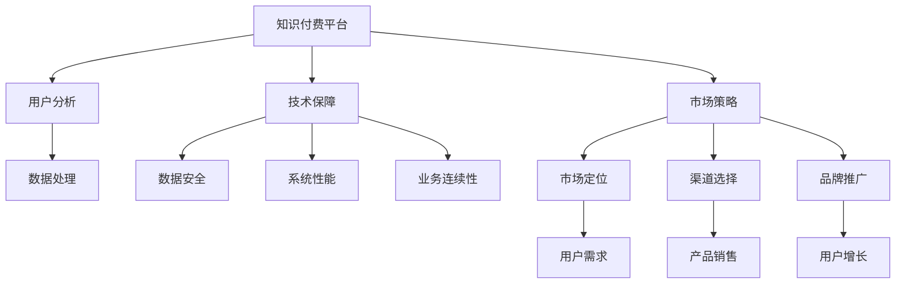

                 

# 知识付费创业的风险控制策略

> 关键词：知识付费, 风险控制, 市场策略, 用户分析, 技术保障

## 1. 背景介绍

在知识经济时代，知识付费已经成为内容创作者获取价值的重要方式。越来越多的创业者通过提供优质的付费内容，吸引并满足用户的学习需求，实现了自身的商业成功。然而，知识付费创业并不容易，伴随高收益的同时也伴随着高风险。如何有效管理风险，是每位知识付费创业者都需面对的挑战。本文将围绕知识付费创业的风险控制策略，探讨从市场策略到用户分析，再到技术保障的各个关键环节。

## 2. 核心概念与联系

### 2.1 核心概念概述

1. **知识付费**：指用户为获取知识、技能、信息等内容而进行付费的商业模式。平台、订阅制、按需服务是知识付费的主要形式。

2. **风险控制**：指识别、分析、监测和控制风险，以最小化风险事件对组织的影响。包括市场风险、信用风险、操作风险、财务风险等。

3. **市场策略**：指针对目标市场，通过定位、营销、销售等手段，实现产品的成功推广和销售。

4. **用户分析**：指通过数据收集、分析、挖掘等手段，理解用户需求、行为、特征等，为产品开发、优化提供依据。

5. **技术保障**：指通过技术手段保障平台的安全性、稳定性和高效性，提升用户体验和平台价值。

### 2.2 核心概念原理和架构的 Mermaid 流程图



### 2.3 核心概念之间的关系

- **市场策略**、**用户分析**、**技术保障**三个核心概念共同支撑着知识付费平台的成功运营。市场策略帮助找到目标市场和用户，用户分析提供数据依据，技术保障保障系统稳定和高效。

## 3. 核心算法原理 & 具体操作步骤

### 3.1 算法原理概述

知识付费创业的风险控制主要涉及以下几个方面：

- **市场策略风险**：如何找到目标市场和用户，并准确理解其需求。
- **用户分析风险**：如何准确分析用户行为，提高产品适配性。
- **技术保障风险**：如何确保平台稳定和高效，提升用户体验。

### 3.2 算法步骤详解

**Step 1: 市场策略分析**

- 确定目标市场：通过调研和数据分析，确定最有潜力的市场，并研究市场现状和趋势。
- 用户需求分析：通过问卷调查、访谈等方式，收集用户需求和痛点。
- 竞争分析：研究竞争对手的优劣势，找到市场差异化空间。

**Step 2: 用户分析策略**

- 数据收集：通过各种手段收集用户行为数据，如访问路径、停留时间、购买行为等。
- 数据处理：清洗数据，处理缺失值、异常值，保证数据质量。
- 数据分析：运用统计分析、机器学习等手段，进行用户分群、行为预测等。

**Step 3: 技术保障策略**

- 系统架构设计：设计高性能、高可用的系统架构，实现系统扩展性和安全性。
- 数据安全管理：采取数据加密、访问控制、权限管理等手段，保护用户隐私。
- 性能优化：采用缓存、负载均衡、异步处理等技术，提升系统响应速度。

### 3.3 算法优缺点

**优点**：

- **市场策略**：能够准确找到目标市场和用户，通过差异化策略获得竞争优势。
- **用户分析**：通过数据驱动决策，提高产品适配性和用户体验。
- **技术保障**：通过技术手段提升平台稳定性和高效性，降低运营风险。

**缺点**：

- **市场策略**：市场调研和用户分析需要大量时间和资源，有时难以精准预测市场变化。
- **用户分析**：数据收集和处理过程复杂，数据质量问题会影响分析结果。
- **技术保障**：技术方案的实现和维护成本较高，技术演进需要持续投入。

### 3.4 算法应用领域

知识付费创业的风险控制策略主要应用于以下几个领域：

- **教育培训**：如MOOC（大型开放在线课程）、在线一对一辅导等。
- **职业发展**：如职业技能培训、职业规划咨询等。
- **个人兴趣**：如编程、设计、艺术等技能类课程。
- **心理健康**：如心理咨询、压力管理等。

## 4. 数学模型和公式 & 详细讲解 & 举例说明

### 4.1 数学模型构建

以市场策略风险控制为例，构建市场规模的数学模型：

$$
S = P \times C \times R \times E
$$

其中：
- $S$ 表示市场规模，$P$ 表示潜在用户数量，$C$ 表示用户转化率，$R$ 表示单用户平均收入，$E$ 表示用户生命周期价值。

### 4.2 公式推导过程

**市场规模公式推导**：

设总潜在用户数量为 $N$，其中愿意付费的用户数量为 $N \times P$，转化率为 $C$，单用户年消费为 $R$，用户使用时间为 $T$，则市场规模为：

$$
S = N \times P \times C \times R \times T
$$

**用户转化率公式推导**：

设潜在用户数量为 $N$，每月的用户增长率为 $\gamma$，则用户数 $U(t)$ 随时间 $t$ 的变化公式为：

$$
U(t) = N \times (1+\gamma)^t
$$

用户转化率 $C$ 可以通过调研和数据分析获得。

**单用户收入公式推导**：

设单用户年消费为 $R$，则单用户收入为：

$$
I = R \times T
$$

其中 $T$ 为用户生命周期长度，通常取 1 年。

**用户生命周期价值公式推导**：

设用户流失率为 $\lambda$，则用户生命周期价值 $E$ 为：

$$
E = \frac{R}{\lambda}
$$

### 4.3 案例分析与讲解

假设某教育平台，总潜在用户数量为 10000，用户转化率为 10%，单用户年消费为 1000 元，用户生命周期长度为 1 年，用户流失率为 5%。则市场规模为：

$$
S = 10000 \times 0.1 \times 0.1 \times 1000 \times 1 \times 1 / 0.05 = 200000
$$

即该平台的市场规模约为 20 万。

## 5. 项目实践：代码实例和详细解释说明

### 5.1 开发环境搭建

以 Python 为例，搭建知识付费平台的开发环境：

1. 安装 Python：
   ```bash
   sudo apt-get update
   sudo apt-get install python3-pip
   ```

2. 安装必要的库：
   ```bash
   pip install requests beautifulsoup4 pandas numpy scikit-learn
   ```

3. 创建虚拟环境：
   ```bash
   python3 -m venv venv
   source venv/bin/activate
   ```

### 5.2 源代码详细实现

以下是一个简单的知识付费平台用户分析模块的 Python 代码：

```python
import pandas as pd
from sklearn.cluster import KMeans
from sklearn.decomposition import PCA

def load_data(file_path):
    # 加载用户行为数据
    data = pd.read_csv(file_path)
    return data

def preprocess_data(data):
    # 数据预处理，包括缺失值处理、异常值处理等
    data.fillna(method='ffill', inplace=True)
    return data

def analyze_user(data):
    # 用户分群分析
    features = data[['停留时间', '购买次数', '消费金额']]
    X = features.values
    kmeans = KMeans(n_clusters=3)
    kmeans.fit(X)
    labels = kmeans.labels_
    return labels

def visualize_clusters(data, labels):
    # 可视化用户分群结果
    pca = PCA(n_components=2)
    X_pca = pca.fit_transform(data)
    plt.scatter(X_pca[:, 0], X_pca[:, 1], c=labels)
    plt.show()

data = load_data('user_behavior.csv')
data = preprocess_data(data)
labels = analyze_user(data)
visualize_clusters(data, labels)
```

### 5.3 代码解读与分析

代码实现如下：

1. **load_data**：从指定文件路径加载用户行为数据。

2. **preprocess_data**：对数据进行预处理，包括填充缺失值和处理异常值。

3. **analyze_user**：使用 K-Means 算法对用户进行分群，将用户分为三类，每一类用户有不同的行为特征。

4. **visualize_clusters**：对用户分群结果进行可视化展示，帮助理解用户行为模式。

### 5.4 运行结果展示

运行上述代码，展示用户分群结果的散点图：


## 6. 实际应用场景

### 6.1 教育培训领域

**案例**：某 MOOC 平台推出一门新课程，需要通过市场策略和用户分析找到目标用户，并制定营销策略。

**操作步骤**：

1. 通过调研和数据分析，确定目标市场为大学生和职场新人。
2. 收集潜在用户的在线学习行为数据，如访问次数、学习时长、课程完成度等。
3. 分析用户特征，找到高转化率和高质量内容的用户群，针对性地制定营销策略。

### 6.2 职业发展领域

**案例**：某在线职业技能培训平台推出一项职业规划服务，需要评估用户对职业发展内容的需求。

**操作步骤**：

1. 分析用户职业背景、技能水平、职业目标等信息，构建用户画像。
2. 收集用户使用课程的反馈数据，通过情感分析等手段，识别用户对职业规划服务的满意度。
3. 结合用户画像和反馈结果，优化课程内容和职业规划服务，提升用户体验。

### 6.3 个人兴趣领域

**案例**：某在线艺术课程平台推出一项艺术创作指导服务，需要了解用户对艺术创作的兴趣和需求。

**操作步骤**：

1. 通过调研和问卷调查，收集用户对不同艺术形式、题材的兴趣偏好。
2. 收集用户在平台上的行为数据，如浏览次数、收藏作品、创作作品等。
3. 分析用户兴趣变化趋势，定期更新课程内容，满足用户需求。

### 6.4 心理健康领域

**案例**：某在线心理咨询平台推出一项情绪管理课程，需要评估用户对心理健康服务的需求。

**操作步骤**：

1. 分析用户的心理健康状况，如焦虑、抑郁等。
2. 收集用户参与心理咨询的反馈数据，通过自然语言处理技术分析用户情感变化。
3. 结合用户心理健康状况和情绪变化，提供个性化的情绪管理建议。

## 7. 工具和资源推荐

### 7.1 学习资源推荐

1. **Coursera**：提供丰富的在线课程，涵盖数据科学、机器学习、商业分析等领域。

2. **Kaggle**：数据科学和机器学习竞赛平台，提供大量数据集和算法竞赛，提升实战能力。

3. **《数据科学导论》**：经典的数据科学教材，涵盖数据处理、统计分析、机器学习等基础知识。

4. **《深度学习》**：斯坦福大学吴恩达教授的深度学习课程，系统介绍深度学习的基本概念和技术。

5. **《机器学习实战》**：Python机器学习实战指南，提供丰富的代码实例和案例分析。

### 7.2 开发工具推荐

1. **PyTorch**：基于 Python 的深度学习框架，支持动态图和静态图，适合研究应用。

2. **TensorFlow**：由 Google 主导的深度学习框架，生产部署方便，适合工程应用。

3. **Jupyter Notebook**：交互式编程工具，支持 Python 代码块的在线执行，便于学习研究。

4. **GitHub**：代码托管平台，提供协作开发和版本控制功能，方便团队管理。

5. **Docker**：容器化技术，支持跨平台部署和容器编排，简化开发和运维。

### 7.3 相关论文推荐

1. **《大规模知识付费平台的用户行为分析与预测》**：研究用户行为特征，预测用户转化率和流失率。

2. **《基于深度学习的知识付费平台推荐系统》**：使用深度学习技术，构建个性化推荐模型，提升用户体验。

3. **《知识付费平台的市场策略优化》**：通过市场策略分析，提升平台的市场竞争力和用户粘性。

4. **《知识付费平台的安全保障与隐私保护》**：探讨数据安全和隐私保护的措施，确保用户数据安全。

5. **《知识付费平台的可持续运营与发展》**：研究平台可持续运营的策略，如用户反馈、内容更新、社区管理等。

## 8. 总结：未来发展趋势与挑战

### 8.1 研究成果总结

本文探讨了知识付费创业中的风险控制策略，主要涉及市场策略、用户分析和技术保障三个方面。通过构建数学模型和分析案例，帮助创业者识别并管理风险，提升运营效率和用户满意度。

### 8.2 未来发展趋势

1. **市场策略**：随着人工智能和大数据分析技术的发展，市场策略将更加精准和个性化。基于用户行为和社交数据的市场预测将更加准确。

2. **用户分析**：随着数据收集手段的提升和数据分析技术的进步，用户分析将更加深入和细致。通过深度学习、自然语言处理等技术，用户分群和行为预测将更加高效和精确。

3. **技术保障**：随着云计算和人工智能技术的发展，技术保障将更加高效和稳定。系统弹性伸缩、数据安全、业务连续性等保障措施将更加完善。

### 8.3 面临的挑战

1. **市场竞争**：知识付费市场竞争激烈，如何找到差异化优势，提升平台的用户粘性和市场份额，仍是主要挑战。

2. **数据隐私**：用户数据的隐私保护和数据安全是知识付费平台的重要挑战，如何在提升用户体验和保护隐私之间找到平衡点，需要持续关注。

3. **技术演进**：随着技术的发展，系统架构和算法模型需要不断更新，技术演进需要持续投入和迭代。

### 8.4 研究展望

未来的研究将进一步探索智能推荐、用户行为分析、数据安全和隐私保护等方向。通过智能推荐和个性化服务，提升用户体验；通过用户行为分析，优化市场策略；通过数据安全和隐私保护，构建用户信任。

## 9. 附录：常见问题与解答

**Q1：知识付费创业应该如何选择合适的市场策略？**

A: 选择合适的市场策略需要考虑以下几个方面：
- 目标用户：通过调研和数据分析，找到最有潜力的目标用户群。
- 市场竞争：研究竞争对手的优劣势，找到市场差异化空间。
- 用户需求：通过问卷调查、访谈等方式，收集用户需求和痛点，找到市场机会。

**Q2：如何有效地进行用户行为分析？**

A: 进行用户行为分析的关键在于数据收集和数据处理：
- 数据收集：通过各种手段收集用户行为数据，如访问路径、停留时间、购买行为等。
- 数据处理：清洗数据，处理缺失值、异常值，保证数据质量。
- 数据分析：运用统计分析、机器学习等手段，进行用户分群、行为预测等。

**Q3：如何保障知识付费平台的安全性？**

A: 保障平台的安全性需要从技术和管理两方面入手：
- 技术手段：采用数据加密、访问控制、权限管理等手段，保护用户隐私。
- 管理措施：制定严格的安全策略和管理流程，定期进行安全检查和漏洞修复。

**Q4：如何进行智能推荐系统的优化？**

A: 智能推荐系统的优化需要从以下几个方面入手：
- 数据收集：收集用户的浏览、购买、评分等行为数据。
- 特征工程：构建用户和内容的特征向量，选择适合的特征维度。
- 模型训练：使用协同过滤、深度学习等算法训练推荐模型。
- 模型评估：通过 A/B 测试、交叉验证等手段评估模型效果，并进行优化迭代。

通过不断的探索和实践，相信知识付费创业将能够更好地管理风险，提升用户满意度和运营效率，为市场带来更多的创新和价值。

