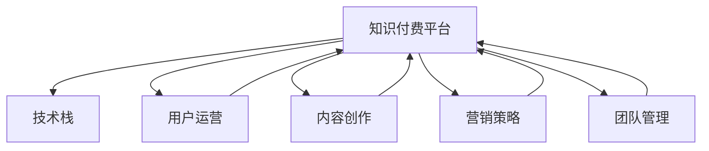

                 

# 知识付费创业者的日常工作安排

> 关键词：知识付费, 创业, 日常工作, 技术栈, 用户运营, 内容创作, 营销策略, 团队管理

## 1. 背景介绍

### 1.1 问题由来

在互联网快速发展的今天，知识付费行业迎来了爆发式增长，吸引了大量创业者和投资者的关注。然而，进入这一领域的门槛并不低，技术、市场、运营、内容等多个方面都需要具备深厚的积累和敏锐的洞察。本文将详细解析知识付费创业者在日常工作中需要关注的重点领域，帮助读者更全面地理解这一领域的技术栈、业务逻辑和运营策略。

## 2. 核心概念与联系

### 2.1 核心概念概述

- **知识付费平台**：通过互联网平台提供知识产品或服务的商业模式，涵盖在线课程、电子书、音频、视频等多种形式。
- **技术栈**：指知识付费平台所使用的技术工具和框架，包括但不限于服务器端、客户端、数据存储、数据分析等。
- **用户运营**：指通过各种手段增加用户黏性、提高用户留存率和转化率的过程。
- **内容创作**：指知识付费平台上的优质内容生产，包括课程制作、文章撰写、视频拍摄等。
- **营销策略**：指通过线上线下的市场推广活动，提升品牌知名度和吸引更多用户的过程。
- **团队管理**：指通过有效的人才配置和激励机制，打造高效团队，实现企业目标。

这些概念之间有着紧密的联系。技术栈决定了平台的性能和服务质量，用户运营和内容创作是平台的核心竞争力，营销策略是吸引用户和提升收入的关键，团队管理则是支持上述各环节顺利运行的基础。

### 2.2 核心概念原理和架构的 Mermaid 流程图



## 3. 核心算法原理 & 具体操作步骤

### 3.1 算法原理概述

知识付费平台的核心算法通常围绕用户行为分析和内容推荐展开。这些算法主要解决以下几个问题：
- **用户画像构建**：通过分析用户行为数据，生成详细的用户画像，用于个性化推荐和精准营销。
- **内容推荐算法**：基于用户画像和内容特征，推荐用户可能感兴趣的内容，提升用户黏性。
- **定价策略优化**：通过动态调整课程价格和优惠活动，最大化平台的收入。

### 3.2 算法步骤详解

**Step 1: 用户画像构建**

1. **数据收集**：收集用户在平台上的所有操作数据，如浏览记录、购买记录、评分反馈等。
2. **特征提取**：提取用户行为中的关键特征，如兴趣偏好、活跃度、课程学习进度等。
3. **模型训练**：使用机器学习算法训练用户画像模型，用于生成详细用户画像。

**Step 2: 内容推荐算法**

1. **特征工程**：提取课程内容的关键特征，如课程难度、课程时长、授课风格等。
2. **模型训练**：训练推荐模型，使用协同过滤、深度学习等算法预测用户可能感兴趣的课程。
3. **实时推荐**：根据用户实时行为，动态调整推荐结果，提升用户体验。

**Step 3: 定价策略优化**

1. **价格弹性分析**：分析不同价格区间下用户购买行为的变化，找出最优定价策略。
2. **动态定价**：根据市场竞争和用户需求，动态调整课程价格。
3. **促销活动**：设计限时优惠、团体优惠等促销活动，吸引用户购买。

### 3.3 算法优缺点

**优点**：
- **个性化推荐**：通过用户画像和内容推荐算法，能够提供个性化的内容推荐，提升用户黏性。
- **精准营销**：基于用户画像的精准营销，能够提高广告的点击率和转化率。
- **收入最大化**：通过动态定价和促销活动，最大化平台的收入。

**缺点**：
- **数据隐私问题**：用户行为数据的收集和分析可能涉及隐私问题，需严格遵守相关法律法规。
- **模型复杂度**：复杂的推荐算法和定价模型需要大量计算资源，对技术栈要求较高。
- **用户需求变化快**：用户需求和市场环境的变化快，算法需要不断迭代优化。

### 3.4 算法应用领域

基于上述核心算法原理，知识付费平台的运营涵盖了以下领域：
- **课程推荐系统**：帮助用户快速找到适合的内容。
- **广告投放系统**：通过精准营销提升收入。
- **用户增长策略**：通过运营活动吸引新用户。
- **个性化定价**：优化课程定价策略，提升转化率。

## 4. 数学模型和公式 & 详细讲解 & 举例说明

### 4.1 数学模型构建

以推荐系统为例，假设平台上有 $N$ 个用户，$M$ 个课程，每个用户对每个课程有一个评分 $r_{i,j}$，其中 $i$ 表示用户，$j$ 表示课程。推荐模型旨在预测用户对课程的评分，通过评分最大化选择最佳推荐。

推荐模型的数学表达为：
$$
\hat{r}_{i,j} = w_0 + \sum_{k=1}^K w_k x_{i,k} \cdot y_{j,k}
$$
其中，$w_0, w_k$ 为模型参数，$x_{i,k}, y_{j,k}$ 为特征向量。

### 4.2 公式推导过程

推荐模型的目标是最大化用户和课程的评分：
$$
\max_{w_0, w_k} \sum_{i=1}^N \sum_{j=1}^M r_{i,j} \cdot \hat{r}_{i,j}
$$

使用梯度下降法求解，优化目标函数为：
$$
L(w_0, w_k) = -\sum_{i=1}^N \sum_{j=1}^M r_{i,j} \cdot \hat{r}_{i,j}
$$

对参数求导得：
$$
\frac{\partial L}{\partial w_0} = -\sum_{i=1}^N \sum_{j=1}^M r_{i,j}
$$
$$
\frac{\partial L}{\partial w_k} = -\sum_{i=1}^N \sum_{j=1}^M r_{i,j} \cdot x_{i,k}
$$

### 4.3 案例分析与讲解

以协同过滤推荐算法为例，其基本思路是通过用户的历史行为数据和物品相似性计算推荐结果。假设用户 $i$ 对物品 $j$ 的评分已知，即 $r_{i,j}$，平台要为用户 $i$ 推荐物品 $k$。

协同过滤推荐算法分为基于用户的协同过滤和基于物品的协同过滤两种。基于用户的协同过滤算法通过找到与用户 $i$ 兴趣相似的用户 $u$，推荐其喜欢的物品给用户 $i$。基于物品的协同过滤算法通过找到与物品 $j$ 相似的物品 $k$，推荐给用户 $i$。

协同过滤算法的核心是计算用户和物品之间的相似度，常见的相似度计算方法包括余弦相似度和皮尔逊相关系数。

## 5. 项目实践：代码实例和详细解释说明

### 5.1 开发环境搭建

开发环境搭建包括服务器端和客户端两部分：

**服务器端**：
- **操作系统**：Ubuntu 20.04
- **编程语言**：Python 3.8
- **Web框架**：Django 3.2
- **数据库**：MySQL 8.0
- **数据处理库**：Pandas、NumPy

**客户端**：
- **编程语言**：React Native
- **开发环境**：Android Studio、Xcode
- **第三方库**：Axios、Lodash

### 5.2 源代码详细实现

**服务器端代码**：

```python
from django.views.decorators.csrf import csrf_exempt
from django.http import JsonResponse

@csrf_exempt
def get_recommendations(request):
    if request.method == 'POST':
        user_id = request.POST['user_id']
        num_recommendations = request.POST['num_recommendations']
        
        # 获取用户画像和课程特征
        user_profile = get_user_profile(user_id)
        course_features = get_course_features()
        
        # 计算推荐结果
        recommendations = compute_recommendations(user_profile, course_features, num_recommendations)
        
        # 返回推荐结果
        return JsonResponse(recommendations, safe=False)
```

**客户端代码**：

```javascript
import React, { useState, useEffect } from 'react';
import axios from 'axios';

function RecommendationComponent() {
    const [recommendations, setRecommendations] = useState([]);
    
    useEffect(() => {
        axios.post('/api/recommendations', { user_id: userId, num_recommendations: 5 })
            .then(response => {
                setRecommendations(response.data);
            })
            .catch(error => {
                console.error(error);
            });
    }, [userId]);
    
    return (
        <div>
            {recommendations.map((recommendation) => {
                return <div key={recommendation.id}>{recommendation.title}</div>;
            })}
        </div>
    );
}
```

### 5.3 代码解读与分析

**服务器端代码解析**：
- `get_recommendations` 函数通过 `POST` 请求接收用户 ID 和推荐数量，调用内部函数 `get_user_profile` 和 `get_course_features` 获取用户画像和课程特征，然后调用 `compute_recommendations` 函数计算推荐结果，并返回推荐列表。

**客户端代码解析**：
- `RecommendationComponent` 组件在 `useEffect` 钩子中发送 `POST` 请求，获取推荐结果，并使用 `setRecommendations` 函数更新组件状态。

### 5.4 运行结果展示

运行上述代码，服务器端返回推荐结果后，客户端将渲染出推荐列表，用户可以看到平台推荐的内容。

## 6. 实际应用场景

### 6.1 智能客服系统

智能客服系统能够自动回答用户问题，提升用户体验和平台效率。在知识付费平台上，智能客服可以用于解答用户课程购买、支付、学习进度等常见问题，减轻人工客服的负担。

### 6.2 用户画像分析

用户画像分析通过收集和分析用户行为数据，帮助平台理解用户需求和行为模式，用于个性化推荐和精准营销。

### 6.3 动态定价策略

动态定价策略通过实时监控市场和用户需求，优化课程价格和促销活动，最大化平台的收入。

### 6.4 未来应用展望

未来，知识付费平台将更加注重用户运营和内容创作，通过更多的技术手段提升用户黏性和内容质量。例如，利用大数据分析和人工智能技术，提升个性化推荐和广告投放的精准度，以及开发更多元化的知识产品形式。

## 7. 工具和资源推荐

### 7.1 学习资源推荐

1. **《机器学习实战》**：涵盖机器学习的基本概念和常见算法，适合初学者学习。
2. **《深度学习》**：介绍深度学习的基本原理和实践技巧，适合进阶学习。
3. **Coursera**：提供丰富的在线课程，涵盖机器学习、深度学习、数据科学等领域。
4. **Kaggle**：数据科学和机器学习竞赛平台，提供大量实际问题解决的案例。
5. **《Python深度学习》**：讲解深度学习在Python中的实现，适合技术栈切换。

### 7.2 开发工具推荐

1. **Jupyter Notebook**：用于数据分析和模型开发的交互式环境。
2. **PyCharm**：Python开发工具，提供代码高亮、自动补全等功能。
3. **GitHub**：版本控制系统，便于团队协作和代码管理。
4. **Postman**：API测试工具，便于测试和调试接口。
5. **Amazon AWS**：云服务提供商，提供高效的计算和存储资源。

### 7.3 相关论文推荐

1. **《推荐系统：架构与算法》**：介绍推荐系统的一般架构和常见算法。
2. **《深度学习在推荐系统中的应用》**：介绍深度学习在推荐系统中的应用和优化策略。
3. **《用户画像分析：理论与实践》**：讲解用户画像的构建和应用。
4. **《动态定价策略优化》**：介绍动态定价策略的理论基础和优化方法。

## 8. 总结：未来发展趋势与挑战

### 8.1 研究成果总结

本文介绍了知识付费创业者的日常工作安排，涵盖了技术栈、用户运营、内容创作、营销策略和团队管理等核心领域。通过案例分析和技术实例，帮助读者更好地理解和应用这些知识。

### 8.2 未来发展趋势

知识付费行业将继续保持快速发展，未来趋势包括：
- **AI技术的应用**：利用AI技术提升个性化推荐和广告投放的精准度。
- **多元化内容形式**：开发更多元化的知识产品形式，满足不同用户的需求。
- **全球化布局**：拓展国际市场，提升平台的用户基数和收入。

### 8.3 面临的挑战

尽管知识付费行业前景广阔，但仍面临以下挑战：
- **技术门槛高**：需要掌握大数据、机器学习、云计算等多领域知识。
- **内容质量难以保障**：高质量内容的生产成本高，周期长。
- **用户需求快速变化**：需要不断迭代产品和服务，以适应市场变化。

### 8.4 研究展望

未来研究将聚焦于：
- **技术栈优化**：探索更高效、更稳定的技术解决方案。
- **用户运营优化**：通过大数据分析提升用户黏性和转化率。
- **内容创新**：开发更多元化的知识产品，提升用户体验。
- **团队管理**：通过高效的人才配置和激励机制，打造高效团队。

## 9. 附录：常见问题与解答

**Q1: 如何提升平台的个性化推荐准确度？**

A: 提升个性化推荐准确度可以从以下几个方面入手：
1. **数据质量**：确保数据完整性和准确性，减少噪声数据的影响。
2. **特征工程**：选择和构造有意义的特征，提升模型的表现。
3. **算法优化**：选择合适的推荐算法，并进行参数调优和模型迭代。
4. **在线学习**：通过在线学习机制，实时更新模型，适应用户行为的变化。

**Q2: 如何在知识付费平台中实现高效的动态定价策略？**

A: 实现高效的动态定价策略，可以从以下几个方面入手：
1. **市场监测**：实时监测市场动态和用户需求变化。
2. **竞争分析**：分析竞争对手的定价策略和市场反应。
3. **价格弹性分析**：通过分析不同价格区间下用户购买行为的变化，找出最优定价策略。
4. **促销活动设计**：设计限时优惠、团体优惠等促销活动，吸引用户购买。

**Q3: 如何在知识付费平台中实现高效的用户画像分析？**

A: 实现高效的用户画像分析，可以从以下几个方面入手：
1. **数据收集**：全面收集用户在平台上的行为数据，如浏览记录、购买记录、评分反馈等。
2. **特征提取**：提取用户行为中的关键特征，如兴趣偏好、活跃度、课程学习进度等。
3. **模型训练**：使用机器学习算法训练用户画像模型，用于生成详细用户画像。
4. **实时更新**：通过在线学习机制，实时更新用户画像，适应用户行为的变化。

**Q4: 如何在知识付费平台中实现高效的团队管理？**

A: 实现高效的团队管理，可以从以下几个方面入手：
1. **明确目标**：制定清晰的团队目标和KPI指标。
2. **人才配置**：根据团队目标，合理配置人才，确保各岗位的专业性和互补性。
3. **激励机制**：设计合理的激励机制，激发团队成员的积极性和创造力。
4. **沟通协作**：建立高效的沟通渠道，促进团队成员之间的协作和信息共享。

---

作者：禅与计算机程序设计艺术 / Zen and the Art of Computer Programming

