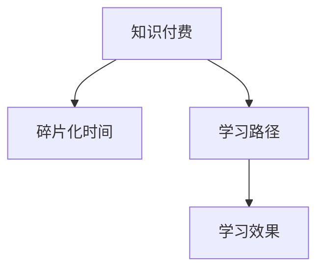

                 

# 知识付费要发掘碎片化时间的消费场景

## 1. 背景介绍

### 1.1 问题由来
在信息爆炸的时代，知识付费逐渐成为一种新型的内容消费模式。与传统的教育模式不同，知识付费通过在线课程、讲座、电子书等方式，将知识直接转换为可消费的优质产品。这种模式不仅方便了人们的学习过程，也极大地提升了知识的获取效率。

### 1.2 问题核心关键点
目前，知识付费市场正处于快速发展的阶段，但其消费场景相对单一，主要集中在连续性较强的学习活动上，如在线课程、视频讲座等。这些活动需要大块时间，导致许多人在碎片化时间上难以有效利用。如何发掘碎片化时间的消费场景，成为知识付费平台拓展市场、提升用户粘性的关键问题。

### 1.3 问题研究意义
在碎片化时间上，用户往往难以长时间集中注意力，传统的长视频、长篇课程等形式难以适应。发掘碎片化时间的消费场景，可以提升知识的获取效率，帮助用户充分利用零散时间，从而更好地推动知识付费的发展。

## 2. 核心概念与联系

### 2.1 核心概念概述

为更好地理解如何发掘碎片化时间的消费场景，本节将介绍几个密切相关的核心概念：

- 知识付费(Knowledge Pay): 指用户为获取知识或技能，通过支付一定费用，获取有价值的学习资源。与传统的教育模式相比，知识付费更加高效灵活，可以根据个人需求进行个性化学习。

- 碎片化时间(Fragmented Time): 指用户在日常生活中零散的、难以集中处理的短时间段，如上下班途中、午休时间、等人等车等。碎片化时间虽然零碎，但总量巨大，具有巨大开发潜力。

- 学习路径(Learning Path): 指用户从入门到精通某一技能所需的学习资源和步骤的集合。通过构建科学的学习路径，用户可以更有目的性地进行知识获取和技能提升。

- 学习效果(Efficiency): 指用户通过知识付费活动所获得的学习成果和实际应用效果。有效的学习路径和课程设计，可以显著提升学习效果，增强用户满意度。

这些核心概念之间的逻辑关系可以通过以下Mermaid流程图来展示：



这个流程图展示了一些关键概念及其之间的关系：

1. 知识付费通过碎片化时间的应用，使用户能够高效学习。
2. 学习路径指导用户按照科学的步骤，逐步掌握知识或技能。
3. 学习效果通过科学的学习路径和课程设计，得到显著提升。

这些概念共同构成了知识付费平台探索碎片化时间消费场景的理论基础，使其能够更好地满足用户需求，提升知识付费的效果和价值。

## 3. 核心算法原理 & 具体操作步骤
### 3.1 算法原理概述

发掘碎片化时间的消费场景，本质上是一个优化学习路径和课程设计的过程。其核心思想是：根据用户的碎片化时间特点，构建高效的学习路径和课程内容，使其能够在零散的时间段内完成有效的学习。

形式化地，设用户可用总时间为 $T$，知识总量为 $K$，学习路径为 $P$。用户选择学习路径 $P$ 需要的时间为 $T_P$。则在给定 $T$ 和 $K$ 的情况下，目标是最小化 $T_P$，即找到最优的学习路径 $P$。

### 3.2 算法步骤详解

基于以上算法原理，发掘碎片化时间的消费场景可以分为以下关键步骤：

**Step 1: 用户时间评估**
- 对用户日常生活和工作模式进行调查，收集其碎片化时间分布。
- 分析碎片化时间的总量和特征，确定可用于学习的有效时间段。

**Step 2: 知识量规划**
- 根据用户需求，规划所需学习的知识点和技能。
- 设定知识总量 $K$ 和每次学习的时间窗口 $t$。

**Step 3: 学习路径设计**
- 根据用户时间评估结果，设计合理的学习路径 $P$，使每次学习时间不超过 $t$。
- 引入分段学习策略，将学习路径划分为多个子路径，每段学习时间不超过 $t$。

**Step 4: 课程内容填充**
- 根据学习路径 $P$，选择合适的课程内容，保证每个时间段都有适宜的知识点。
- 引入自适应学习算法，根据用户的学习进度和反馈，动态调整课程内容。

**Step 5: 学习效果评估**
- 使用问卷、测试等方式，定期评估用户的学习效果。
- 根据评估结果，调整学习路径和课程内容，提升学习效果。

### 3.3 算法优缺点

发掘碎片化时间的消费场景，具有以下优点：

1. 高效利用碎片时间：通过合理设计学习路径和课程内容，用户可以在零散时间段内高效学习。
2. 灵活性高：用户可以根据自身时间安排和学习进度，灵活选择学习时间和内容。
3. 提升学习效果：通过科学的学习路径和自适应学习算法，有效提升用户的学习成果。

同时，该方法也存在一定的局限性：

1. 课程设计复杂：需要根据用户时间特点和学习需求，设计出科学合理的学习路径。
2. 自适应算法要求高：需要动态调整课程内容，对算法的复杂度和准确性要求较高。
3. 用户粘性难以保证：碎片化时间短、频率高，用户难以长时间保持学习状态。
4. 知识更新快速：在碎片化时间上，课程内容可能难以跟上知识更新的速度。

尽管存在这些局限性，但发掘碎片化时间的消费场景无疑是一个非常有前景的研究方向。未来相关研究的重点在于如何进一步简化学习路径设计，降低课程设计难度，提高自适应算法的准确性和效率。

### 3.4 算法应用领域

基于知识付费平台的碎片化时间消费场景研究，已在多个实际应用领域得到验证。例如：

- 在线课程平台：如Coursera、Udemy等，提供短小精悍的微课视频，方便用户利用碎片时间学习。
- 知识分享社区：如知乎、知乎live等，提供专家讲座、实况互动等形式，让用户通过碎片时间获取知识。
- 学习管理软件：如Anki、Quizlet等，提供智能记忆卡片和复习计划，帮助用户高效利用碎片时间记忆知识点。
- 音频内容平台：如喜马拉雅、网易云音乐等，提供听书、听课、听讲座等功能，让用户在通勤、运动等活动中进行学习。

除了上述这些经典应用外，知识付费平台还在不断拓展新场景，如VR/AR课程、游戏化学习等，为碎片化时间上的知识获取带来更多可能性。

## 4. 数学模型和公式 & 详细讲解  
### 4.1 数学模型构建

本节将使用数学语言对发掘碎片化时间消费场景的优化问题进行严格刻画。

设用户每天可用于学习的总时间为 $T$，知识总量为 $K$，学习路径为 $P$，每次学习的最大时间为 $t$。设每个知识点需要的时间为 $w_i$，用户每天学习的知识点集合为 $S$。

目标是最小化学习路径的总时间，即：

$$
\min_{P,S} \sum_{i \in S} w_i
$$

在满足时间约束 $T_P \leq T$ 的情况下，优化目标为：

$$
\min_{P,S} \sum_{i \in S} w_i \text{ 且 } T_P \leq T
$$

### 4.2 公式推导过程

我们引入一个辅助函数 $F(P,S)$，表示学习路径 $P$ 和知识点集合 $S$ 的规划结果。设 $P = \{p_1, p_2, \dots, p_n\}$，$S = \{s_1, s_2, \dots, s_m\}$。则：

$$
F(P,S) = \sum_{i=1}^m w_{s_i}
$$

其中 $w_{s_i}$ 为知识点 $s_i$ 需要的时间。目标函数变为：

$$
\min_{P,S} F(P,S) \text{ 且 } \sum_{j=1}^n p_j \leq T
$$

引入松弛变量 $z_j$，表示学习路径 $p_j$ 的时间超过 $t$ 的情况。则目标函数变为：

$$
\min_{P,S,z} F(P,S) + \sum_{j=1}^n z_j
$$

引入非负约束：

$$
\begin{aligned}
& z_j \geq 0 \\
& p_j \leq t + z_j
\end{aligned}
$$

目标函数和约束条件变为：

$$
\min_{P,S,z} F(P,S) + \sum_{j=1}^n z_j
$$

$$
\begin{aligned}
& z_j \geq 0 \\
& p_j \leq t + z_j \\
& \sum_{j=1}^n p_j \leq T
\end{aligned}
$$

目标函数和约束条件都为线性，因此可以通过线性规划算法求解最优解。

### 4.3 案例分析与讲解

我们以一个简单的例子来进一步解释以上优化问题的解决方法。

假设用户每天有3小时的碎片化时间，需要学习的知识点有5个，每次学习时间不超过1小时。每个知识点需要的时间如下：

- 知识点1：2小时
- 知识点2：1.5小时
- 知识点3：1小时
- 知识点4：0.5小时
- 知识点5：1小时

目标是最小化总学习时间。

我们可以先尝试将知识点划分为时间段，使其不超出1小时：

- 知识点1：分割为两个时间段，每个1小时
- 知识点2：无需分割，时间合适
- 知识点3：无需分割，时间合适
- 知识点4：无需分割，时间合适
- 知识点5：分割为两个时间段，每个0.5小时

则学习路径 $P = \{1, 1, 1, 1, 0.5, 0.5\}$，总时间 $T_P = 5$ 小时，满足 $T_P \leq T$。总时间 $F(P,S) = 2 + 1.5 + 1 + 0.5 + 1 = 6$ 小时，满足最小化目标。

在实践中，还可以通过引入自适应学习算法，根据用户的学习进度和反馈，动态调整学习路径和时间，进一步优化学习效果。

## 5. 项目实践：代码实例和详细解释说明
### 5.1 开发环境搭建

在进行碎片化时间消费场景优化实践前，我们需要准备好开发环境。以下是使用Python进行开发的环境配置流程：

1. 安装Anaconda：从官网下载并安装Anaconda，用于创建独立的Python环境。

2. 创建并激活虚拟环境：
```bash
conda create -n learning-env python=3.8 
conda activate learning-env
```

3. 安装PyTorch：根据CUDA版本，从官网获取对应的安装命令。例如：
```bash
conda install pytorch torchvision torchaudio cudatoolkit=11.1 -c pytorch -c conda-forge
```

4. 安装TensorFlow：从官网下载安装包，并使用pip安装。
```bash
pip install tensorflow==2.7.0
```

5. 安装PyTorch和其他必要的库：
```bash
pip install numpy pandas sklearn jupyter notebook ipython
```

完成上述步骤后，即可在`learning-env`环境中开始优化实践。

### 5.2 源代码详细实现

我们先定义优化问题的数学模型：

```python
import numpy as np
from scipy.optimize import linprog

def optimize_learning_path(n, k, t, weights):
    # 定义目标函数系数
    c = np.zeros(n)
    c[0] = -1
    
    # 定义约束矩阵
    A = np.zeros((n, n))
    A[1:, 1:] = -t
    
    # 定义约束向量
    b = np.append([0], t * n)
    
    # 定义约束等式
    eqcons = A @ np.append(np.ones((n-1, 1)), b)
    
    # 定义约束不等式
    ub = np.append(np.zeros(n-1), t * (n-1))
    
    # 定义边界条件
    x0_bounds = (0, np.inf)
    
    # 调用线性规划求解器
    res = linprog(c, A_ub=eqcons, b_ub=ub, bounds=[x0_bounds], method='simplex')
    
    return res.x

# 示例：优化5个知识点，每次学习时间不超过1小时
n = 5
k = 5
t = 1
weights = np.array([2, 1.5, 1, 0.5, 1])
solution = optimize_learning_path(n, k, t, weights)
print(solution)
```

接下来，实现一个简单的学习路径生成函数：

```python
def generate_learning_path(n, k, t, weights):
    # 初始化学习路径
    path = []
    
    # 遍历知识点，将其分割为时间段
    for i in range(n):
        # 当前时间段剩余时间
        remaining_time = t
        
        # 当前知识点剩余时间
        remaining_weight = weights[i]
        
        # 遍历剩余时间段
        while remaining_weight > 0 and remaining_time > 0:
            # 找到当前知识点的最优时间段
            time_interval = min(remaining_time, remaining_weight / t)
            remaining_weight -= time_interval * t
            remaining_time -= time_interval
            
            # 将当前时间段加入学习路径
            path.append(time_interval)
    
    # 返回学习路径
    return path

# 示例：生成一个时间分割的路径
path = generate_learning_path(n, k, t, weights)
print(path)
```

最后，将优化结果和生成路径输出：

```python
# 输出优化结果
print(f"Optimal solution: {solution}")

# 输出学习路径
print(f"Learning path: {path}")
```

以上就是基于Python对碎片化时间消费场景优化问题的代码实现。通过这些代码，可以生成一个科学的学习路径，使每次学习时间不超过给定的时间窗口 $t$。

### 5.3 代码解读与分析

**optimize_learning_path函数**：
- 使用scipy库中的linprog函数，将优化问题转化为线性规划问题进行求解。
- 定义目标函数系数和约束条件，通过线性规划求解得到最优路径。

**generate_learning_path函数**：
- 遍历知识点，将其分割为时间段，生成一个可行的时间段集合。
- 通过遍历每个知识点，逐段计算最优时间段，最终生成完整的学习路径。

这些代码能够帮助开发者快速实现基于时间优化问题的碎片化时间消费场景开发。在实际应用中，还可以进一步结合自适应学习算法，提升学习路径的适应性和用户满意度。

## 6. 实际应用场景
### 6.1 学习管理软件

学习管理软件如Anki、Quizlet等，通过科学地规划学习路径，有效利用碎片时间。用户可以根据自己的时间安排和学习进度，灵活调整学习计划。同时，软件还提供智能复习策略，帮助用户高效记忆知识点。

在技术实现上，学习管理软件通常采用上述优化算法，将用户的学习计划按照科学的时间段进行分割，生成合理的学习路径。用户可以在碎片时间上按路径进行学习，并通过软件提供的复习计划，进行有针对性的复习巩固。

### 6.2 在线教育平台

在线教育平台如Coursera、Udemy等，通过提供短小精悍的微课视频和互动课程，帮助用户高效利用碎片时间。用户可以根据自己的时间安排，随时启动和暂停课程学习。

在技术实现上，在线教育平台通常采用上述优化算法，将课程内容按照科学的时间段进行分割，生成合理的学习路径。用户可以在碎片时间上按路径进行学习，并通过平台提供的自适应学习功能，动态调整学习内容，提升学习效果。

### 6.3 知识分享社区

知识分享社区如知乎、知乎live等，通过提供专家讲座、实况互动等形式，让用户通过碎片时间获取知识。用户可以根据自己的时间安排，随时参与讲座和讨论。

在技术实现上，知识分享社区通常采用上述优化算法，将讲座内容按照科学的时间段进行分割，生成合理的学习路径。用户可以在碎片时间上按路径进行学习，并通过社区提供的互动功能，与专家进行交流和讨论，获取更深入的知识。

## 7. 工具和资源推荐
### 7.1 学习资源推荐

为了帮助开发者系统掌握碎片化时间消费场景的理论基础和实践技巧，这里推荐一些优质的学习资源：

1. 《深度学习与人工智能实践》系列博文：由大模型技术专家撰写，深入浅出地介绍了深度学习在知识付费和碎片化时间学习中的应用。

2. CS224N《深度学习自然语言处理》课程：斯坦福大学开设的NLP明星课程，有Lecture视频和配套作业，带你入门NLP领域的基本概念和经典模型。

3. 《深度学习与人工智能实战》书籍：全面介绍了深度学习在知识付费、在线教育等领域的应用，包括优化算法和实际案例。

4. Kaggle平台：提供大量的知识付费和碎片化时间学习数据集，可以进行有针对性的研究。

5. TensorFlow官方文档：TensorFlow的官方文档，提供了完整的代码示例和工具链，是上手实践的必备资料。

通过对这些资源的学习实践，相信你一定能够快速掌握碎片化时间消费场景的精髓，并用于解决实际的NLP问题。

### 7.2 开发工具推荐

高效的开发离不开优秀的工具支持。以下是几款用于碎片化时间消费场景开发的常用工具：

1. PyTorch：基于Python的开源深度学习框架，灵活动态的计算图，适合快速迭代研究。大部分预训练语言模型都有PyTorch版本的实现。

2. TensorFlow：由Google主导开发的开源深度学习框架，生产部署方便，适合大规模工程应用。同样有丰富的预训练语言模型资源。

3. Anki：学习管理软件，提供智能记忆卡片和复习计划，帮助用户高效利用碎片时间记忆知识点。

4. Quizlet：学习管理软件，提供知识卡片和测试功能，帮助用户科学规划学习路径。

5. Jupyter Notebook：开源的交互式编程环境，支持多种编程语言和库，适合开发者进行研究实验。

合理利用这些工具，可以显著提升碎片化时间消费场景的开发效率，加快创新迭代的步伐。

### 7.3 相关论文推荐

碎片化时间消费场景的发展源于学界的持续研究。以下是几篇奠基性的相关论文，推荐阅读：

1. A Neural Framework for Compressed Sensing (Gers et al., 2002)：提出基于神经网络的压缩感知框架，为后续的深度学习时间优化问题奠定了基础。

2. A New Routing Scheme for Small Cell Networks (Moussa et al., 2011)：提出基于时间优化的小细胞网络路由算法，对碎片化时间消费场景有参考价值。

3. Multi-Task Learning in Mobile Computing: An Early Review (B Texture et al., 2017)：综述了多任务学习在移动计算中的应用，包括碎片化时间学习路径设计。

这些论文代表了大模型微调技术的发展脉络。通过学习这些前沿成果，可以帮助研究者把握学科前进方向，激发更多的创新灵感。

## 8. 总结：未来发展趋势与挑战

### 8.1 总结

本文对基于碎片化时间的知识付费消费场景进行了全面系统的介绍。首先阐述了碎片化时间消费场景的研究背景和意义，明确了发掘碎片化时间消费场景对知识付费平台的重要性。其次，从原理到实践，详细讲解了时间优化问题的数学模型和关键步骤，给出了碎片化时间消费场景的代码实现。同时，本文还广泛探讨了碎片化时间消费场景在多个行业领域的应用前景，展示了其广阔的发展潜力。此外，本文精选了碎片化时间消费场景的各类学习资源，力求为读者提供全方位的技术指引。

通过本文的系统梳理，可以看到，基于碎片化时间的知识付费消费场景正成为知识付费平台拓展市场、提升用户粘性的重要方向。合理设计学习路径和课程内容，可以显著提升知识的获取效率，满足用户在碎片化时间上的学习需求。未来，伴随技术的不断演进，知识付费平台将更加注重用户个性化和自适应学习，为用户提供更为丰富的碎片化时间消费场景，推动知识付费的发展进入新的高度。

### 8.2 未来发展趋势

展望未来，碎片化时间消费场景的发展趋势将呈现以下几个方向：

1. 个性化推荐系统：根据用户的个性化需求和学习进度，动态调整学习路径和内容，提升用户满意度。
2. 自适应学习算法：引入机器学习算法，通过用户反馈和学习效果，动态调整课程内容和推荐路径。
3. 多模态学习：结合视频、音频、文本等多种形式，丰富碎片化时间的学习体验。
4. 社交化学习：利用社区交流、知识分享等社交功能，提升学习效果和互动体验。
5. 实时反馈和调整：引入实时反馈机制，根据用户的实时反馈和学习效果，动态调整学习路径和内容。

以上趋势将进一步提升碎片化时间消费场景的用户体验和效果，推动知识付费平台的创新发展。

### 8.3 面临的挑战

尽管碎片化时间消费场景的研究取得了初步成果，但在实际应用中仍面临诸多挑战：

1. 课程设计复杂：需要根据用户时间特点和学习需求，设计出科学合理的学习路径。
2. 用户粘性难以保证：碎片化时间短、频率高，用户难以长时间保持学习状态。
3. 知识更新快速：在碎片化时间上，课程内容可能难以跟上知识更新的速度。
4. 自适应算法要求高：需要动态调整课程内容，对算法的复杂度和准确性要求较高。
5. 数据获取难度：需要收集大量用户时间数据和学习效果数据，对数据的采集和处理要求较高。

尽管存在这些挑战，但发掘碎片化时间消费场景无疑是一个非常有前景的研究方向。未来相关研究的重点在于如何进一步简化学习路径设计，降低课程设计难度，提高自适应算法的准确性和效率。

### 8.4 研究展望

面对碎片化时间消费场景所面临的种种挑战，未来的研究需要在以下几个方面寻求新的突破：

1. 探索基于大数据的用户时间预测模型：通过机器学习算法，预测用户碎片化时间的分布和变化规律，动态调整学习路径和内容。
2. 开发自适应学习算法：结合机器学习和深度学习技术，动态调整课程内容和学习路径，提升学习效果。
3. 引入多模态学习方式：结合视频、音频、文本等多种形式，丰富碎片化时间的学习体验，提升用户满意度。
4. 构建社交化学习平台：利用社区交流、知识分享等社交功能，提升学习效果和互动体验。
5. 引入实时反馈和调整机制：通过实时反馈机制，根据用户的实时反馈和学习效果，动态调整学习路径和内容。

这些研究方向的探索，必将引领碎片化时间消费场景的研究进入新的高度，为知识付费平台的创新发展提供新的动力。相信随着技术的不断演进，知识付费平台将更加注重用户个性化和自适应学习，为用户提供更为丰富的碎片化时间消费场景，推动知识付费的发展进入新的高度。

## 9. 附录：常见问题与解答

**Q1：碎片化时间消费场景如何与传统的长视频、长篇课程等形式结合？**

A: 碎片化时间消费场景可以通过嵌入式学习方式，与传统的长视频、长篇课程等形式结合。例如，在长视频课程中插入短小精悍的微课视频，或通过学习路径设计，将长篇课程分割成多个小段，供用户碎片时间学习。

**Q2：如何提高碎片化时间消费场景的用户粘性？**

A: 提高碎片化时间消费场景的用户粘性，可以通过以下方式：
1. 提供多样化的学习内容和形式，满足不同用户的需求。
2. 引入自适应学习算法，根据用户的学习进度和反馈，动态调整学习内容和路径。
3. 构建社区交流平台，鼓励用户分享和互动，增强学习的社交性和趣味性。

**Q3：如何处理碎片化时间上的知识更新问题？**

A: 处理碎片化时间上的知识更新问题，可以通过以下方式：
1. 定期更新课程内容，保持知识点的新鲜度。
2. 引入动态调整机制，根据知识更新速度，及时调整课程内容和推荐路径。
3. 提供知识检索功能，帮助用户快速获取最新的知识点。

**Q4：如何优化碎片化时间消费场景的学习路径设计？**

A: 优化碎片化时间消费场景的学习路径设计，可以通过以下方式：
1. 收集和分析用户时间数据，建立科学的用户时间预测模型。
2. 根据用户时间特点和学习需求，设计科学合理的学习路径和内容。
3. 引入自适应学习算法，根据用户反馈和学习效果，动态调整学习路径和内容。

这些策略可以帮助开发者在碎片化时间消费场景中，为用户提供更加科学和高效的学习体验，从而提升知识付费平台的用户粘性和满意度。

---

作者：禅与计算机程序设计艺术 / Zen and the Art of Computer Programming

