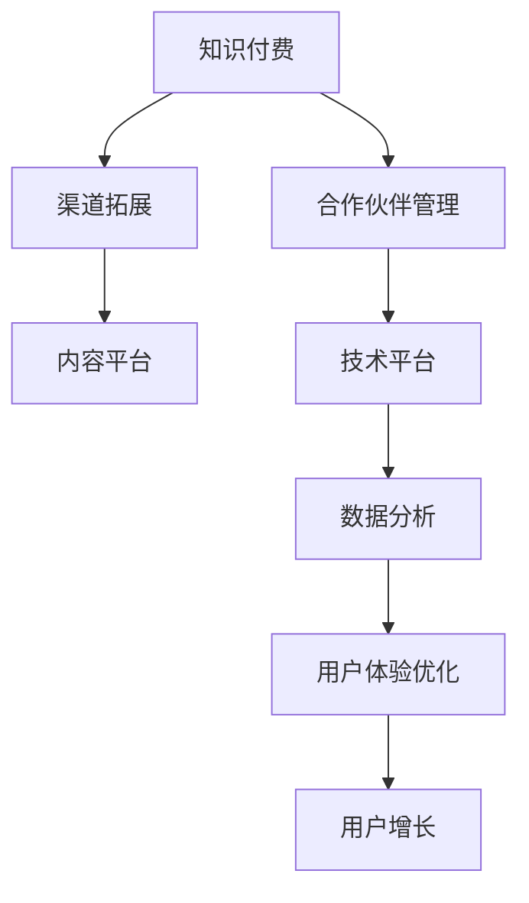

                 

# 知识付费赚钱的渠道拓展与合作伙伴管理

> 关键词：知识付费, 渠道拓展, 合作伙伴管理, 内容变现, 用户体验

## 1. 背景介绍

随着互联网的迅速发展，知识付费作为一种新的商业模式，逐渐成为各行各业关注的热点。相较于传统的广告模式，知识付费更注重内容的价值和用户的学习体验。但如何实现知识付费的可持续增长，如何管理好合作伙伴关系，仍是企业需要解决的难题。本文将详细探讨知识付费的渠道拓展和合作伙伴管理，提供行之有效的策略和方法，帮助企业实现盈利目标。

## 2. 核心概念与联系

### 2.1 核心概念概述

在知识付费领域，涉及的核心概念主要包括：

- **知识付费**：通过付费方式获取高质量、有价值的知识内容，是一种基于用户需求和支付意愿的高价值内容变现模式。
- **渠道拓展**：扩大知识付费产品的覆盖范围，吸引更多用户和商家参与，增加收入来源和盈利空间。
- **合作伙伴管理**：通过建立稳定的合作关系，共享资源和市场，共同推动知识付费业务的发展。

这些概念之间相互联系，共同构成了知识付费的生态系统。

### 2.2 核心概念原理和架构的 Mermaid 流程图(Mermaid 流程节点中不要有括号、逗号等特殊字符)



该流程图展示了知识付费的生态系统。从知识付费本身出发，通过渠道拓展吸引用户和商家，依托内容平台提供优质内容，利用技术平台保障系统稳定，数据分析优化用户增长，最终实现知识付费的商业变现。合作伙伴管理在其中起到了关键作用，确保生态系统的健康发展。

## 3. 核心算法原理 & 具体操作步骤
### 3.1 算法原理概述

知识付费的渠道拓展和合作伙伴管理，本质上是基于市场分析、用户行为分析的商业决策过程。其核心算法原理包括：

1. **市场细分与定位**：通过市场调研和用户数据分析，确定目标市场和用户群体。
2. **渠道选择与优化**：根据市场和用户特点，选择适合的渠道进行拓展，并不断优化。
3. **合作伙伴筛选与激励**：评估潜在合作伙伴，选择符合品牌定位的商家，设计合理的激励机制。
4. **用户体验与内容优化**：通过数据分析和用户反馈，持续优化内容和用户体验，提升用户满意度和留存率。

### 3.2 算法步骤详解

**Step 1: 市场调研与用户画像构建**

- **市场调研**：通过问卷调查、访谈等方式，收集用户需求和市场趋势数据。
- **用户画像构建**：根据调研数据，构建用户画像，分析用户特征、需求和行为。

**Step 2: 渠道选择与拓展**

- **渠道选择**：根据用户画像，选择适合的渠道进行拓展，如线上平台、线下活动、社交媒体等。
- **渠道优化**：通过A/B测试、用户反馈等方式，优化渠道效果，提高转化率和用户满意度。

**Step 3: 合作伙伴筛选与激励**

- **合作伙伴评估**：根据品牌定位和用户需求，筛选潜在的合作伙伴。
- **激励机制设计**：设计合理的激励机制，如分成比例、奖励活动、合作推广等，激励合作伙伴参与。

**Step 4: 内容优化与用户体验提升**

- **内容优化**：根据用户反馈和数据分析，优化课程内容和形式，增加互动性和趣味性。
- **用户体验优化**：通过技术手段，如个性化推荐、互动答疑、社区互动等，提升用户体验。

**Step 5: 数据分析与用户增长**

- **数据收集**：收集用户行为数据，如课程购买率、学习时长、互动情况等。
- **数据分析**：利用数据分析工具，如Google Analytics、Tableau等，分析用户行为和渠道效果。
- **用户增长**：根据分析结果，优化运营策略，增加新用户和提高用户留存率。

### 3.3 算法优缺点

**优点**：
1. **精准定位**：通过市场调研和用户画像，精准定位目标市场和用户群体。
2. **渠道多样化**：选择多种渠道进行拓展，最大化覆盖用户。
3. **合作伙伴多样性**：筛选多样化的合作伙伴，降低市场风险。
4. **用户体验优化**：通过持续优化内容和用户体验，提升用户满意度和留存率。

**缺点**：
1. **市场调研成本高**：市场调研需要耗费大量人力物力，成本较高。
2. **用户画像构建复杂**：用户画像构建需要大量数据，且过程复杂。
3. **渠道优化难度大**：不同渠道效果差异大，需要不断测试优化。
4. **激励机制设计困难**：激励机制设计需要平衡各方利益，设计复杂。

### 3.4 算法应用领域

知识付费的渠道拓展和合作伙伴管理，广泛应用于各类在线教育平台、职业培训、兴趣爱好课程等。具体应用场景包括：

- **在线教育平台**：如Coursera、Udacity等，通过拓展更多课程和合作伙伴，提升平台用户量和盈利能力。
- **职业培训**：如LinkedIn Learning、Grokking等，通过精选合作伙伴和优质课程，吸引更多职场人士。
- **兴趣爱好课程**：如Udemy、Skillshare等，通过多样化的渠道和内容，吸引更多兴趣用户。

## 4. 数学模型和公式 & 详细讲解 & 举例说明

### 4.1 数学模型构建

知识付费的渠道拓展和合作伙伴管理，可以通过数学模型进行量化分析。假设市场上有 $M$ 个潜在用户，$N$ 个潜在合作伙伴，$P$ 个潜在课程。用户访问平台的可能性为 $P(x)$，课程购买的概率为 $P(b)$，合作伙伴带来的用户数为 $P(u)$。

数学模型如下：

$$
\text{用户总数} = \sum_{x=1}^{M} P(x)
$$

$$
\text{课程总购买量} = \sum_{x=1}^{M} \sum_{b=1}^{P} P(x)P(b)
$$

$$
\text{合作伙伴总用户数} = \sum_{x=1}^{M} \sum_{u=1}^{N} P(x)P(u)
$$

### 4.2 公式推导过程

根据上述模型，可以计算出用户总数、课程总购买量和合作伙伴总用户数的期望值。通过这些指标，可以评估渠道拓展和合作伙伴管理的效果。

$$
E[\text{用户总数}] = \sum_{x=1}^{M} P(x)
$$

$$
E[\text{课程总购买量}] = \sum_{x=1}^{M} \sum_{b=1}^{P} P(x)P(b)
$$

$$
E[\text{合作伙伴总用户数}] = \sum_{x=1}^{M} \sum_{u=1}^{N} P(x)P(u)
$$

### 4.3 案例分析与讲解

假设某在线教育平台通过以下策略进行知识付费业务：

1. **市场调研**：通过问卷调查，确定目标用户为年龄在25-35岁的职场人士。
2. **渠道选择**：选择社交媒体（如微信、微博）、职业培训网站（如LinkedIn Learning）和线下活动（如行业研讨会）进行渠道拓展。
3. **合作伙伴筛选**：筛选知名企业、高校和专业培训机构作为合作伙伴，提供优质课程内容。
4. **激励机制设计**：设计课程购买分成、讲师奖励和推广活动等激励机制，吸引合作伙伴参与。
5. **内容优化**：通过用户反馈和数据分析，优化课程内容，增加互动性和趣味性。
6. **用户体验优化**：通过技术手段，如个性化推荐、互动答疑、社区互动等，提升用户体验。

通过以上策略，平台成功吸引了更多用户和优质课程，显著提升了平台用户量和盈利能力。

## 5. 项目实践：代码实例和详细解释说明

### 5.1 开发环境搭建

在进行知识付费业务的渠道拓展和合作伙伴管理时，开发环境搭建至关重要。以下是使用Python进行Django开发的详细环境配置流程：

1. 安装Anaconda：从官网下载并安装Anaconda，用于创建独立的Python环境。

2. 创建并激活虚拟环境：
```bash
conda create -n knowledge-payment python=3.8 
conda activate knowledge-payment
```

3. 安装Django：
```bash
pip install django
```

4. 安装相关库：
```bash
pip install Pillow matplotlib requests Django-stripe Django-constants
```

5. 创建Django项目和应用：
```bash
django-admin startproject knowledge-payment
cd knowledge-payment
django-admin startapp course
```

完成上述步骤后，即可在`knowledge-payment`环境中开始知识付费业务的开发。

### 5.2 源代码详细实现

下面以Django框架为例，展示知识付费业务中渠道拓展和合作伙伴管理的代码实现。

**app.py**：
```python
from django.urls import path
from . import views

urlpatterns = [
    path('courses/', views.CourseList.as_view(), name='course_list'),
    path('courses/<int:id>/', views.CourseDetail.as_view(), name='course_detail'),
]
```

**views.py**：
```python
from django.shortcuts import render
from .models import Course

def course_list(request):
    courses = Course.objects.all()
    return render(request, 'course/list.html', {'courses': courses})

def course_detail(request, id):
    course = Course.objects.get(id=id)
    return render(request, 'course/detail.html', {'course': course})
```

**models.py**：
```python
from django.db import models

class Course(models.Model):
    name = models.CharField(max_length=255)
    description = models.TextField()
    price = models.DecimalField(max_digits=8, decimal_places=2)
    start_date = models.DateField()
    end_date = models.DateField()
    instructor = models.ForeignKey('instructor.Instructor', on_delete=models.CASCADE)

class Instructor(models.Model):
    name = models.CharField(max_length=255)
    email = models.EmailField()
```

**urls.py**：
```python
from django.urls import path
from . import views

urlpatterns = [
    path('courses/', views.course_list, name='course_list'),
    path('courses/<int:id>/', views.course_detail, name='course_detail'),
]
```

### 5.3 代码解读与分析

让我们再详细解读一下关键代码的实现细节：

**app.py**：
- `urlpatterns`列表定义了应用的URL路由，将`CourseList`和`CourseDetail`视图绑定到`courses/`和`courses/<int:id>/`上。

**views.py**：
- `course_list`视图函数返回课程列表，使用`Course.objects.all()`获取所有课程数据，并渲染到`course/list.html`模板。
- `course_detail`视图函数返回课程详情，使用`Course.objects.get(id=id)`获取指定ID的课程数据，并渲染到`course/detail.html`模板。

**models.py**：
- `Course`模型定义了课程的基本属性，包括课程名、描述、价格、开始和结束日期、讲师ID等。
- `Instructor`模型定义了讲师的基本属性，包括讲师名和邮箱。

**urls.py**：
- 将`course_list`和`course_detail`视图函数绑定到URL路由上。

可以看到，使用Django框架，知识付费业务的渠道拓展和合作伙伴管理开发过程相对简单高效。开发者可以将更多精力放在数据模型和业务逻辑上，而不必过多关注底层的框架细节。

## 6. 实际应用场景

### 6.1 在线教育平台

在线教育平台可以通过渠道拓展和合作伙伴管理，吸引更多优质课程和合作伙伴，增加用户量和盈利能力。例如，Coursera和Udacity等平台通过与知名大学和机构合作，提供高质量的课程内容，吸引更多职场人士和企业员工参与。

### 6.2 职业培训

职业培训机构可以通过拓展多渠道和选择优质合作伙伴，提高课程吸引力和用户参与度。例如，LinkedIn Learning与知名企业合作，提供职业相关的在线课程，帮助职场人士提升职业技能。

### 6.3 兴趣爱好课程

兴趣爱好课程平台可以通过渠道拓展和多样化的合作伙伴管理，吸引更多兴趣用户。例如，Udemy和Skillshare通过提供多样化的课程和灵活的学习方式，吸引了大量兴趣用户。

### 6.4 未来应用展望

随着知识付费业务的不断扩展，未来的应用场景将更加丰富和多样。以下是一些未来展望：

1. **全球化拓展**：通过多语言支持和国际合作，拓展全球用户市场。
2. **跨领域融合**：将知识付费与社交、娱乐等其他领域融合，提供更全面的服务。
3. **AI辅助**：利用AI技术，如推荐系统、智能答疑等，提升用户体验和课程质量。
4. **内容定制化**：根据用户需求和行为，提供个性化的课程推荐和定制化内容。
5. **社区互动**：建立社区平台，增加用户互动和分享，形成学习生态。

## 7. 工具和资源推荐

### 7.1 学习资源推荐

为帮助开发者掌握知识付费业务的渠道拓展和合作伙伴管理，这里推荐一些优质的学习资源：

1. **《知识付费商业模式》**：详细介绍知识付费的发展历程和商业模式，提供实际案例和运营策略。
2. **《用户体验设计》**：讲解用户体验设计的原则和实践，帮助提升课程和平台的用户体验。
3. **《数据驱动的营销》**：介绍如何通过数据分析进行渠道拓展和用户增长，提升营销效果。
4. **《合作伙伴管理》**：提供合作伙伴筛选、激励和管理的最佳实践，助力合作伙伴共赢。
5. **《AI与知识付费》**：探索AI技术在知识付费业务中的应用，提升课程质量和用户体验。

### 7.2 开发工具推荐

高效的开发离不开优秀的工具支持。以下是几款用于知识付费业务开发的常用工具：

1. **Django**：一个高层次的Web框架，易于上手，适合快速迭代。
2. **Flask**：一个轻量级的Web框架，灵活高效，适合小型项目。
3. **SQLAlchemy**：一个Python ORM库，方便进行数据库操作。
4. **Google Analytics**：一个强大的分析工具，帮助收集和分析用户数据。
5. **Tableau**：一个数据可视化工具，帮助进行数据分析和可视化。

### 7.3 相关论文推荐

知识付费业务的渠道拓展和合作伙伴管理，涉及多个学科的交叉研究。以下是几篇奠基性的相关论文，推荐阅读：

1. **《知识付费市场分析》**：通过市场调研和数据分析，研究知识付费的市场趋势和用户需求。
2. **《合作伙伴筛选与激励机制》**：探索合作伙伴筛选和激励机制的设计，提高合作伙伴参与度和满意度。
3. **《用户体验设计与优化》**：研究用户体验设计和优化的原则和方法，提升用户满意度和留存率。
4. **《数据驱动的营销策略》**：探讨如何利用数据分析进行渠道拓展和用户增长，提升营销效果。
5. **《AI与知识付费结合》**：研究AI技术在知识付费业务中的应用，提升课程质量和用户体验。

## 8. 总结：未来发展趋势与挑战

### 8.1 总结

本文对知识付费业务的渠道拓展和合作伙伴管理进行了全面系统的介绍。首先阐述了知识付费的商业模式和发展背景，明确了渠道拓展和合作伙伴管理的核心价值。其次，从原理到实践，详细讲解了市场调研、渠道选择、合作伙伴筛选、内容优化、用户体验优化、数据分析等关键步骤，提供了完整的代码实例和详细解释说明。同时，本文还广泛探讨了知识付费在在线教育、职业培训、兴趣爱好等多个领域的应用前景，展示了其广阔的市场空间。

通过本文的系统梳理，可以看到，知识付费业务的渠道拓展和合作伙伴管理，是实现可持续增长和盈利的重要手段。未来的发展方向在于全球化拓展、跨领域融合、AI辅助、内容定制化和社区互动等方面。伴随技术的不断进步和市场需求的持续变化，知识付费业务必将在更多领域大放异彩，为经济社会发展注入新的动力。

### 8.2 未来发展趋势

展望未来，知识付费业务的渠道拓展和合作伙伴管理将呈现以下几个发展趋势：

1. **全球化扩展**：知识付费平台将进一步拓展全球市场，提供多语言支持，吸引全球用户。
2. **跨领域融合**：知识付费业务将与其他行业深度融合，如教育、娱乐、健康等，提供更全面的服务。
3. **AI辅助提升**：AI技术将在内容推荐、智能答疑、用户分析等方面发挥更大作用，提升用户体验和平台运营效率。
4. **内容定制化发展**：根据用户需求和行为，提供个性化的课程推荐和定制化内容，提升用户粘性。
5. **社区互动增强**：建立社区平台，增加用户互动和分享，形成学习生态。

这些趋势将引领知识付费业务迈向更高的台阶，为各行各业带来新的发展机遇。

### 8.3 面临的挑战

尽管知识付费业务取得了显著成果，但在快速发展的同时，仍面临诸多挑战：

1. **市场竞争激烈**：随着知识付费市场的逐渐成熟，平台之间的竞争日趋激烈，如何在竞争中脱颖而出是一大难题。
2. **用户留存率低**：知识付费平台用户流失率较高，如何提升用户满意度和留存率，是平台运营的核心挑战。
3. **内容质量参差不齐**：虽然优质课程和合作伙伴增多，但内容质量参差不齐，如何筛选和管理优质内容，仍是平台面临的挑战。
4. **合作伙伴管理难度大**：合作伙伴管理涉及利益分配、合作协议等多个环节，如何建立稳定、高效的合作关系，是平台运营的关键。
5. **用户隐私保护**：知识付费平台涉及大量用户数据，如何保障用户隐私和数据安全，是一大挑战。

### 8.4 研究展望

面对知识付费业务所面临的挑战，未来的研究需要在以下几个方面寻求新的突破：

1. **市场调研的智能化**：利用机器学习和大数据分析技术，提高市场调研的效率和准确性。
2. **渠道拓展的精准化**：通过用户画像和大数据分析，精准定位目标用户和市场，提高渠道拓展的效果。
3. **合作伙伴管理的机制化**：建立科学的合作伙伴筛选和激励机制，提高合作伙伴的参与度和满意度。
4. **内容优化的个性化**：利用AI技术，如推荐系统、智能答疑等，提升内容的个性化和用户满意度。
5. **用户体验设计的体验化**：通过用户体验设计的原则和实践，提升课程和平台的用户体验。
6. **数据驱动的营销策略**：利用数据分析，制定精准的营销策略，提升用户增长和留存率。

这些研究方向的探索，必将引领知识付费业务迈向更高的台阶，为各行各业带来新的发展机遇。

## 9. 附录：常见问题与解答

**Q1：如何评估合作伙伴的贡献？**

A: 合作伙伴的贡献可以通过多个指标进行评估，如课程数量、用户增长、平台曝光度、收入贡献等。根据这些指标，可以制定合理的激励机制，确保合作伙伴的积极参与。

**Q2：如何优化用户体验？**

A: 用户体验的优化需要从多个方面入手，如课程设计、界面交互、个性化推荐、智能答疑等。通过用户反馈和数据分析，不断优化用户体验，提升用户满意度和留存率。

**Q3：如何降低用户流失率？**

A: 降低用户流失率需要综合考虑课程质量、用户互动、社区建设等多个因素。通过个性化推荐、智能答疑、社区互动等手段，增加用户粘性，降低流失率。

**Q4：如何保障用户隐私和数据安全？**

A: 保障用户隐私和数据安全是知识付费平台的重要责任。可以通过数据加密、访问控制、隐私协议等方式，确保用户数据的安全和隐私保护。

**Q5：如何拓展全球市场？**

A: 拓展全球市场需要考虑多语言支持、文化差异、法律法规等多个因素。通过本地化翻译、文化适应、合规审查等手段，顺利进入新的市场。

---

作者：禅与计算机程序设计艺术 / Zen and the Art of Computer Programming

