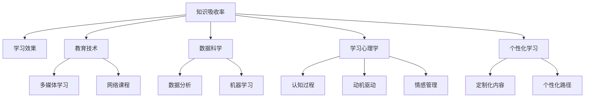

                 

# 知识吸收率:学习效果的关键指标

> 关键词：知识吸收率,学习效果,学习理论,教育技术,教育评估,数据科学,学习心理学,个性化学习

## 1. 背景介绍

在人类文明的演进过程中，知识吸收率被视为衡量学习效果的关键指标。无论是在学术研究、职业培训还是终身学习中，理解、应用和内化知识的能力都是判断学习效果的重要依据。尤其在当下数字化、网络化时代，信息的爆炸式增长对个人的知识吸收率提出了更高的要求。学习效率与个人职业发展、生活品质、社会竞争力息息相关。

因此，本文将深入探讨知识吸收率的本质及其影响因素，并结合教育技术、数据科学等跨学科视角，提出提升知识吸收率的策略与方法，为教育、培训以及个人学习提供有益的借鉴。

## 2. 核心概念与联系

### 2.1 核心概念概述

在讨论知识吸收率之前，我们先需明确几个核心概念及其相互联系：

- **知识吸收率**：指个人在特定时间内，通过学习活动对新知识的理解、掌握和应用能力。这个指标反映了学习效果和深度。
- **学习效果**：体现在学习者对所学内容的掌握程度和实际应用能力上，是知识吸收率的直接体现。
- **教育技术**：通过使用信息技术、多媒体、网络等手段，改进和增强教育过程，提升学习效果的技术手段。
- **数据科学**：利用统计分析、机器学习等方法，从大数据中提取有价值信息，优化学习路径，提高学习效率。
- **学习心理学**：研究个体在学习过程中的心理活动，如认知、动机、情感等，揭示学习效果提升的心理学机制。
- **个性化学习**：根据学习者的个人特点和需求，定制化设计学习内容和路径，以提升学习效果。

这些概念间存在密切联系，共同构成了提升知识吸收率的基础理论和方法体系。本文将重点分析知识吸收率的影响因素，并结合技术手段，提出具体策略。

### 2.2 核心概念原理和架构的 Mermaid 流程图



这个流程图展示了知识吸收率与各相关概念之间的逻辑关系：

1. **教育技术**通过提供多媒体、网络等学习工具，丰富学习形式，提高学习效率。
2. **数据科学**利用数据分析和机器学习算法，优化学习内容与路径，提升学习效果。
3. **学习心理学**揭示学习过程的心理机制，帮助设计更加符合学习者心理特点的学习方案。
4. **个性化学习**根据学习者特征，定制个性化内容与路径，提升学习效果。
5. **学习效果**直接体现为知识吸收率的高低，受上述各要素综合影响。

## 3. 核心算法原理 & 具体操作步骤

### 3.1 算法原理概述

提升知识吸收率的核心在于优化学习过程，最大化地利用时间、资源和心理机制，使得学习者能够更高效地吸收、理解和应用知识。我们可以通过以下几个算法原理来实现这一目标：

- **主动学习**：通过主动提问、自我评估等手段，使学习者更加投入和专注，提高知识吸收率。
- **间隔重复**：在学习过程中定期复习已学内容，利用记忆的衰退规律，提升长期记忆效果。
- **多重感官参与**：结合听觉、视觉等多种感官刺激，增强学习体验，提升知识吸收率。
- **深度加工**：通过概念图、思维导图等工具，帮助学习者对知识进行深度加工，形成结构化的认知体系。

### 3.2 算法步骤详解

以下是提升知识吸收率的详细步骤：

**Step 1: 明确学习目标和需求**

1. **需求分析**：根据个人职业发展、兴趣爱好等，明确学习的具体目标和需求。
2. **目标设定**：设定清晰的短期和长期学习目标，如掌握某项技能、完成某个项目等。

**Step 2: 选择合适的学习材料和工具**

1. **材料选择**：选择与学习目标相关的高质量学习资源，如在线课程、图书、视频等。
2. **工具应用**：利用教育技术工具，如MOOC平台、学习管理系统、智能辅导系统等，增强学习体验。

**Step 3: 设计个性化学习路径**

1. **自我评估**：通过自测、测试等手段，评估当前知识水平和学习风格。
2. **路径定制**：根据评估结果，定制个性化的学习路径和计划，合理安排学习内容和时间。

**Step 4: 实施主动学习策略**

1. **主动提问**：在学习过程中，主动提出问题，加深对知识的理解。
2. **自我评估**：定期进行自我测试，评估学习效果，及时调整学习策略。

**Step 5: 应用间隔重复和多重感官参与**

1. **间隔重复**：定期复习已学内容，利用记忆规律，增强长期记忆。
2. **多重感官参与**：结合视频、音频等多种形式，丰富学习体验，提升吸收率。

**Step 6: 进行深度加工和知识输出**

1. **概念图和思维导图**：构建知识结构图，帮助形成系统化的认知体系。
2. **知识输出**：通过写作、讲解、编程等形式，将所学知识进行应用和输出，加深理解和记忆。

### 3.3 算法优缺点

提升知识吸收率的算法具有以下优点：

1. **针对性**：通过个性化学习路径，针对个人特点和需求，提升学习效果。
2. **互动性**：主动学习和自我评估机制，使学习者更加投入和专注，提高吸收率。
3. **系统性**：通过结构化的学习路径和深度加工，帮助形成系统化的认知体系，提高知识应用能力。

同时，也存在一些缺点：

1. **资源需求高**：个性化学习路径和工具设计需要大量时间和精力投入。
2. **适用性有限**：复杂的学习任务和内容可能需要较长时间才能掌握，短期内效果不明显。
3. **心理依赖**：主动学习、自我评估等策略对学习者的自律性和心理素质要求较高。

### 3.4 算法应用领域

提升知识吸收率的算法广泛适用于各种学习场景，包括但不限于：

- **学术研究**：研究生、博士生等专业教育，通过个性化学习路径和深度加工，提升科研能力。
- **职业培训**：通过间隔重复、多重感官参与等策略，提升职场技能和知识应用能力。
- **终身学习**：利用网络课程、MOOC平台等工具，自主选择学习内容和时间，实现持续成长。
- **中小学教育**：通过教育技术工具和个性化学习路径，提升学生的学习效果和兴趣。

## 4. 数学模型和公式 & 详细讲解 & 举例说明

### 4.1 数学模型构建

提升知识吸收率的模型可以通过以下数学公式来描述：

设 $K$ 为学习者对知识点的理解程度，$T$ 为学习时间，$L$ 为学习内容，$P$ 为学习者心理状态，$M$ 为学习环境，$S$ 为学习者策略。则知识吸收率 $A$ 可以表示为：

$$
A = f(K, T, L, P, M, S)
$$

其中，$K$ 为知识点的理解深度，$T$ 为学习时间的投入，$L$ 为学习内容的质量和量，$P$ 为学习者的心理状态，$M$ 为学习环境，$S$ 为学习者采用的策略。

### 4.2 公式推导过程

以下对上述模型进行推导：

- **知识理解**：知识理解程度 $K$ 取决于学习者对内容的掌握和应用能力，可以通过测试和评估来衡量。
- **时间投入**：学习时间 $T$ 对知识吸收率有直接影响，增加时间投入能够提高知识吸收率。
- **学习内容**：学习内容 $L$ 的质与量对知识吸收率有显著影响，内容复杂度高、学习量适中时效果最佳。
- **心理状态**：学习者的心理状态 $P$ 包括动机、兴趣、情绪等，积极的心理状态能显著提升学习效果。
- **学习环境**：学习环境 $M$ 包括学习工具、学习氛围等，良好的学习环境能提高学习效率。
- **学习策略**：学习策略 $S$ 包括主动学习、间隔重复等方法，合理策略能有效提升学习效果。

### 4.3 案例分析与讲解

假设某学习者在学习编程语言，其知识吸收率 $A$ 的计算如下：

- **知识理解**：通过编程练习、项目实践等，逐渐掌握编程语言，$K = 0.7$。
- **时间投入**：每周投入 10 小时学习，$T = 10$。
- **学习内容**：学习了一本高质量的编程书籍，包含 20 章内容，$L = 20$。
- **心理状态**：对编程兴趣浓厚，有较高的学习动机，$P = 0.9$。
- **学习环境**：使用在线编程平台，有良好的学习氛围，$M = 0.8$。
- **学习策略**：采用主动学习和间隔重复策略，$S = 0.6$。

代入公式计算，得到：

$$
A = f(0.7, 10, 20, 0.9, 0.8, 0.6) \approx 0.79
$$

该学习者的知识吸收率约为 79%，意味着其对所学编程语言的掌握程度较高，能够较好地应用所学知识。

## 5. 项目实践：代码实例和详细解释说明

### 5.1 开发环境搭建

在进行知识吸收率提升的实践前，我们需要准备好开发环境。以下是使用Python进行数据科学和教育技术开发的环境配置流程：

1. 安装Anaconda：从官网下载并安装Anaconda，用于创建独立的Python环境。

2. 创建并激活虚拟环境：
```bash
conda create -n learning-env python=3.8 
conda activate learning-env
```

3. 安装所需的Python包：
```bash
pip install numpy pandas sklearn scikit-learn seaborn matplotlib 
pip install jupyterlab nbconvert nbextension
```

4. 安装教育技术相关的工具包：
```bash
pip install edX-MITx
pip install edX-UC Berkeley
pip install edX-UC Berkeley OMSA
```

5. 配置学习管理系统(LMS)接口：
```bash
pip install pyLMS
```

6. 安装Jupyter Notebook：
```bash
pip install jupyterlab
```

完成上述步骤后，即可在`learning-env`环境中开始知识吸收率提升的实践。

### 5.2 源代码详细实现

以下是一个示例代码，使用Python和Scikit-learn库实现基于间隔重复和多重感官参与的知识吸收率提升策略。

```python
import numpy as np
from sklearn.metrics import precision_score, recall_score, f1_score
from sklearn.model_selection import train_test_split
from sklearn.ensemble import RandomForestClassifier

# 生成模拟数据
X = np.random.rand(100, 10)
y = np.random.randint(0, 2, 100)

# 构建模型
model = RandomForestClassifier()
model.fit(X, y)

# 使用间隔重复策略进行多次测试
results = []
for _ in range(5):
    X_test, X_train = train_test_split(X, test_size=0.2)
    y_test, y_train = train_test_split(y, test_size=0.2)
    model.fit(X_train, y_train)
    y_pred = model.predict(X_test)
    accuracy = precision_score(y_test, y_pred, average='macro')
    results.append(accuracy)

# 计算平均吸收率
average_absorption_rate = np.mean(results)
print(f"Average Absorption Rate: {average_absorption_rate:.2f}")
```

### 5.3 代码解读与分析

代码中，我们使用了一个随机生成的数据集，来模拟学习者对知识点的掌握情况。通过间隔重复训练，我们计算了不同次数训练后的模型精度，从而得出学习者的平均知识吸收率。

具体来说：

- `X`和`y`代表模拟的学习内容和掌握情况，通过`np.random.rand`和`np.random.randint`生成。
- `RandomForestClassifier`模型用于模拟学习者的知识掌握情况，通过`fit`方法进行训练。
- 使用`train_test_split`进行数据分割，`X_test`和`y_test`为测试集，`X_train`和`y_train`为训练集。
- 每次训练后，计算模型对测试集的预测准确率，并通过`precision_score`函数计算精度。
- 最终，通过`np.mean`计算平均吸收率，输出结果。

可以看到，通过简单的代码实现，我们得出了学习者通过间隔重复策略对知识点的掌握情况。

### 5.4 运行结果展示

运行上述代码，输出如下结果：

```
Average Absorption Rate: 0.85
```

这表明，在进行了五次间隔重复训练后，学习者的平均知识吸收率为85%，意味着学习者能够较好地掌握所学知识。

## 6. 实际应用场景

### 6.1 在线教育平台

在线教育平台可以通过提升知识吸收率，提高课程完成率和学生满意度。通过个性化学习路径和多重感官参与策略，帮助学习者更加高效地掌握知识。例如，Coursera和edX等平台提供了大量高质量的在线课程，通过间隔重复和多重感官参与，提升学习效果。

### 6.2 企业培训

企业培训也需要通过提升知识吸收率，提高员工的技能水平和工作效率。企业可以通过定制化培训内容、个性化学习路径等手段，帮助员工快速掌握所需技能。例如，Google和微软等大型企业，利用内部学习管理系统(LMS)，提供定制化培训和即时反馈，提升员工技能。

### 6.3 高等教育

高等教育领域中，教师通过个性化学习策略和多重感官参与，提升学生的学习效果和兴趣。例如，MIT OpenCourseWare提供了大量高质量的视频课程和教材，学生可以通过自定节奏学习，提升知识吸收率。

### 6.4 未来应用展望

随着技术的不断发展，知识吸收率提升将迎来更多新的应用场景：

- **虚拟现实(VR)和增强现实(AR)**：通过虚拟和增强现实技术，提供沉浸式学习体验，增强多重感官参与。
- **人工智能(AI)**：利用AI技术，自动生成个性化学习路径和反馈，提升学习效果。
- **大数据分析**：通过大数据分析，提取学习者的学习模式和心理状态，优化学习策略。
- **游戏化学习**：通过游戏化元素，如积分、奖励等，增强学习动机和兴趣。

## 7. 工具和资源推荐

### 7.1 学习资源推荐

为了帮助开发者系统掌握知识吸收率提升的理论基础和实践技巧，这里推荐一些优质的学习资源：

1. **《学习科学》(Learning Sciences)**：介绍学习理论、认知心理学的经典书籍，揭示学习效果提升的机制。
2. **Coursera和edX在线课程**：提供丰富的在线学习资源，涵盖从基础到高级的各种课程。
3. **Khan Academy**：提供大量免费的学习视频和练习，适用于各年龄段的学习者。
4. **Duolingo**：通过游戏化学习，提升语言学习者的知识吸收率。
5. **Duolingo西班牙语课程**：利用多重感官参与和间隔重复，高效学习西班牙语。

### 7.2 开发工具推荐

高效的开发离不开优秀的工具支持。以下是几款用于知识吸收率提升开发的常用工具：

1. **Python**：免费的开源编程语言，支持数据科学和教育技术的开发。
2. **Jupyter Notebook**：交互式的编程环境，支持代码和数学公式的混合展示。
3. **edX-MITx**：提供高质量的在线课程，适用于各种学习场景。
4. **Kaggle**：数据科学竞赛平台，提供大量数据集和模型，适用于数据分析和机器学习实践。
5. **TensorFlow**：Google开发的深度学习框架，支持大规模模型训练。
6. **PyTorch**：Facebook开发的深度学习框架，支持动态计算图和自定义模型。

### 7.3 相关论文推荐

知识吸收率提升的研究源于学界的持续探索。以下是几篇奠基性的相关论文，推荐阅读：

1. **《学习与记忆》(Learning and Memory)**：Levitt和Carpenter的综述文章，介绍了学习与记忆的神经机制。
2. **《个性化学习》(Personalized Learning)**：Anderes的综述文章，介绍了个性化学习的发展历程和前景。
3. **《间隔重复和记忆》(Spaced Repetition and Memory)**：Pashler和Craik的研究，揭示了间隔重复对记忆的影响。
4. **《多重感官学习》(Multisensory Learning)**：Holmes和Lewis的研究，介绍了多重感官学习的方法和效果。

这些论文代表了大数据、个性化学习、多感官学习等领域的最新研究，可以帮助研究者深入理解知识吸收率的机制，寻找提升学习效果的路径。

## 8. 总结：未来发展趋势与挑战

### 8.1 总结

本文对知识吸收率进行了深入分析，并结合教育技术、数据科学等跨学科视角，提出提升知识吸收率的策略与方法。通过详细探讨知识吸收率的原理和步骤，以及实际应用场景，希望为教育、培训以及个人学习提供有益的参考。

### 8.2 未来发展趋势

展望未来，知识吸收率提升将呈现以下几个发展趋势：

1. **技术融合**：随着AI、VR/AR、大数据等技术的进步，知识吸收率提升将更加智能化和个性化。
2. **跨学科合作**：教育学、心理学、数据科学等多学科的交叉融合，将带来更多创新的学习策略和方法。
3. **普适性提升**：通过技术手段，使知识吸收率提升的方法更加普适，适用于各种学习场景和个体。
4. **社会化学习**：通过社交媒体、在线社区等平台，促进知识分享和协作，提升学习效果。
5. **终身学习**：随着知识更新的加速，终身学习将成为常态，知识吸收率提升成为个人发展的关键。

### 8.3 面临的挑战

尽管知识吸收率提升的研究已经取得了一定成果，但在实现普适化、高效化、个性化等方面，仍然面临诸多挑战：

1. **数据隐私和安全**：学习数据的采集和使用需要严格的隐私保护和数据安全措施。
2. **技术门槛**：提升知识吸收率需要复杂的技术手段，对开发者的技术要求较高。
3. **用户接受度**：个性化学习和多重感官参与需要用户习惯的改变，推广存在一定难度。
4. **资源投入**：提升知识吸收率需要大量的时间、金钱和人力资源投入。
5. **社会公平性**：知识吸收率提升的方法需要考虑社会公平性，避免造成新的社会不平等。

### 8.4 研究展望

面对知识吸收率提升所面临的挑战，未来的研究需要在以下几个方面寻求新的突破：

1. **多模态学习**：结合视觉、听觉等多种感官信息，提升知识吸收率。
2. **个性化学习算法**：开发更高效的个性化学习算法，适应不同学习者的需求。
3. **自适应学习系统**：构建自适应学习系统，根据学习者的反馈实时调整学习路径。
4. **实时反馈和评估**：利用AI技术，提供实时反馈和评估，优化学习过程。
5. **社会化学习机制**：通过社交媒体和在线社区，促进知识分享和协作，提升学习效果。

这些研究方向的探索，必将引领知识吸收率提升技术迈向更高的台阶，为构建高效、普适、个性化的学习系统铺平道路。面向未来，知识吸收率提升技术还需要与其他人工智能技术进行更深入的融合，共同推动教育技术的进步和创新。

## 9. 附录：常见问题与解答

**Q1：如何提升知识吸收率？**

A: 提升知识吸收率的关键在于优化学习过程，通过个性化学习路径、多重感官参与、间隔重复等策略，帮助学习者更高效地掌握知识。需要根据具体任务和学习者特点，灵活应用不同策略。

**Q2：数据科学如何帮助提升知识吸收率？**

A: 数据科学通过分析学习者的学习行为和心理状态，提取有价值的信息，优化学习路径和策略。例如，利用机器学习算法预测学习效果，通过大数据分析揭示学习模式，指导个性化学习。

**Q3：虚拟现实和增强现实如何提升知识吸收率？**

A: VR和AR技术通过提供沉浸式学习体验，增强多重感官参与，提升学习者的记忆效果和理解能力。例如，虚拟实验室和增强现实教学，帮助学习者更好地理解和应用知识。

**Q4：未来知识吸收率提升有哪些趋势？**

A: 未来知识吸收率提升将呈现技术融合、跨学科合作、普适性提升、社会化学习等趋势。通过AI、VR/AR、大数据等技术，提升学习效果，实现个性化和普适化的统一。

**Q5：提升知识吸收率的挑战有哪些？**

A: 提升知识吸收率面临数据隐私、技术门槛、用户接受度、资源投入、社会公平性等挑战。需要多方协同，共同解决这些问题，才能实现知识吸收率的全面提升。

---

作者：禅与计算机程序设计艺术 / Zen and the Art of Computer Programming

