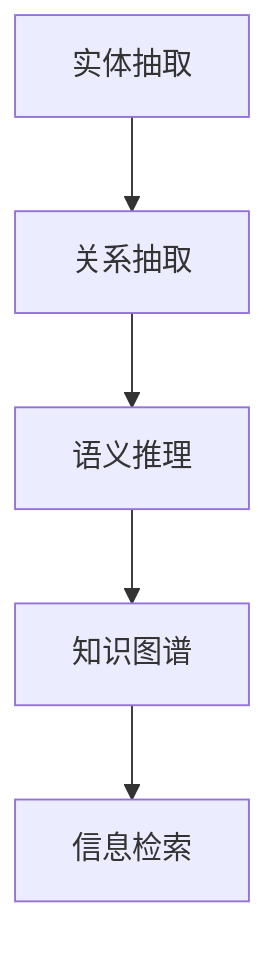

                 

# 知识图谱在搜索引擎中的应用

## 1. 背景介绍

随着互联网信息量的爆炸式增长，搜索引擎已从传统的网页检索向深入的语义理解、知识抽取和信息融合方向发展。传统的网页检索技术主要依赖于文本关键词的匹配和排名算法，而随着用户查询意图的多样化和复杂化，对信息检索的准确性和相关性提出了更高的要求。知识图谱(Knowledge Graph)作为一种新兴的语义检索技术，正在成为搜索引擎应用中的重要方向。

### 1.1 知识图谱简介

知识图谱是一种以实体为节点，以关系为边构成的有向图结构，用以描述现实世界中的实体及实体之间的关系。知识图谱的构建通常需要大规模的语料和先进的自然语言处理技术，结合领域专家的知识，通过实体抽取、关系抽取、语义推理等过程，构建出结构化的知识库。知识图谱不仅具备强大的信息检索能力，还具有语义推理、信息融合、问答系统等多种应用潜力。

## 2. 核心概念与联系

### 2.1 核心概念概述

- **知识图谱(Knowledge Graph)**：一种表示实体及其关系的图结构，用于存储和查询知识库中的语义信息。

- **实体(Entity)**：知识图谱中的基本单位，表示现实世界中的事物、概念、事件等。

- **关系(Relation)**：实体之间的连接方式，描述实体之间的属性、行为等。

- **节点(Node)**：知识图谱中的实体节点，表示图结构中的顶点。

- **边(Edge)**：知识图谱中的关系边，表示图结构中的连线。

- **实体抽取(Entity Extraction)**：从文本中自动识别和抽取实体信息的过程。

- **关系抽取(Relation Extraction)**：从文本中自动抽取实体之间的关系。

- **语义推理(Semantic Reasoning)**：通过逻辑推理和知识库的联合，得出更丰富的语义信息。

这些核心概念之间通过知识图谱的构建和查询过程紧密联系。实体和关系构成了知识图谱的基本结构，而实体抽取、关系抽取和语义推理则构成了知识图谱的构建过程，并在此基础上支持信息检索和查询等应用。

### 2.2 核心概念原理和架构的 Mermaid 流程图



该流程图展示了实体抽取、关系抽取、语义推理和知识图谱构建的全过程，以及这些过程如何支撑信息检索的应用。

## 3. 核心算法原理 & 具体操作步骤

### 3.1 算法原理概述

基于知识图谱的搜索引擎应用，其核心算法原理主要包括以下几个步骤：

1. **实体抽取**：从查询文本中自动抽取实体信息，如人名、地名、机构名等。
2. **关系抽取**：根据抽取到的实体信息，自动判断实体之间的关系，如“位于”、“属于”等。
3. **语义推理**：结合知识图谱中的已知信息，通过逻辑推理得出更多深层次的语义信息，如推断实体之间的隐含关系。
4. **信息检索**：根据查询意图和推理结果，从知识图谱中检索出最相关的信息。

### 3.2 算法步骤详解

#### 3.2.1 实体抽取

实体抽取通常采用基于规则和机器学习相结合的方法。

**基于规则的方法**：通过定义一套预定义的规则，匹配查询文本中的特定实体类型。例如，根据规则匹配出“北京大学”这一实体，将其归类为“机构名”。

**基于机器学习的方法**：使用命名实体识别模型，如BERT、BiLSTM-CRF等，通过训练语料库，自动学习识别实体的能力。具体步骤包括：

1. 文本预处理：分词、去停用词、词性标注等。
2. 特征提取：使用词向量、字符n-gram等特征。
3. 模型训练：采用CRF、LSTM-CRF等模型进行训练。
4. 实体标注：对文本进行标注，识别出实体和实体类型。

#### 3.2.2 关系抽取

关系抽取通常通过训练关系抽取模型，自动抽取实体之间的关系。

**基于规则的方法**：通过定义一组预定义的规则，匹配查询文本中的实体关系。例如，根据规则“位于”匹配出“北京”和“北京大学”之间的关系。

**基于机器学习的方法**：使用关系抽取模型，如逻辑回归、决策树、深度学习等，通过训练关系抽取语料库，自动学习识别实体之间的关系。具体步骤包括：

1. 文本预处理：分词、去停用词、词性标注等。
2. 特征提取：使用词向量、关系模板等特征。
3. 模型训练：采用SVM、LSTM-CRF等模型进行训练。
4. 关系抽取：对文本进行标注，识别出实体之间的关系。

#### 3.2.3 语义推理

语义推理通常通过结合知识图谱中的已知信息，使用逻辑推理方法得出更深层次的语义信息。

**基于规则的方法**：通过定义一组预定义的推理规则，如“如果A位于B，那么A属于B”。

**基于机器学习的方法**：使用逻辑推理框架，如PROVER、RDFS、OWL等，结合知识图谱中的已知信息，进行语义推理。具体步骤包括：

1. 构建知识图谱：使用Grafov、RDF等工具构建知识图谱。
2. 推理引擎：使用OWL、PROVER等推理引擎进行推理。
3. 结果输出：输出推理结果，包括推理路径和推理逻辑。

#### 3.2.4 信息检索

信息检索通常通过构建索引、查询匹配等步骤，实现对知识图谱中信息的检索。

**构建索引**：对知识图谱中的实体和关系进行索引，构建倒排索引表。

**查询匹配**：根据用户查询，匹配索引表中的实体和关系，找到最相关的信息。

### 3.3 算法优缺点

基于知识图谱的搜索引擎应用具有以下优点：

- **语义理解能力强**：通过语义推理，可以理解查询的深层语义，得出更准确的检索结果。
- **信息丰富全面**：知识图谱包含大量结构化信息，可以提供更全面、准确的信息检索。
- **跨领域融合**：能够跨领域融合信息，提供跨领域的知识服务。

同时，该方法也存在一些缺点：

- **构建和维护复杂**：需要构建大规模的知识图谱，维护更新成本较高。
- **数据依赖性强**：需要大量的高质量标注数据，数据获取成本较高。
- **实时性有待提高**：构建索引和推理过程较为耗时，检索速度较慢。

### 3.4 算法应用领域

基于知识图谱的搜索引擎应用，主要应用于以下几个领域：

- **垂直搜索**：如医学搜索、法律搜索、旅游搜索等，提供垂直领域的深度信息检索。
- **问答系统**：如智能客服、语音助手等，通过语义推理和信息融合，提供智能问答服务。
- **个性化推荐**：如电商推荐、新闻推荐等，通过语义推理和信息融合，提供个性化的推荐结果。
- **跨领域知识服务**：如跨领域实体链接、跨领域知识图谱等，提供跨领域的知识融合服务。
- **信息可视化**：如知识图谱可视化、信息可视化等，提供直观的视觉化信息服务。

## 4. 数学模型和公式 & 详细讲解 & 举例说明

### 4.1 数学模型构建

知识图谱的数学模型通常使用图论的方法，将实体和关系表示为图结构，并进行语义推理。

- **图结构表示**：用节点表示实体，用边表示关系，构建图结构G=(V,E)，其中V表示节点集合，E表示边集合。
- **节点表示**：使用向量表示节点，其中每个维度表示节点的属性或特征。
- **边表示**：使用向量表示边，其中每个维度表示边的属性或特征。
- **语义推理**：使用逻辑推理框架进行推理，如PROVER、RDFS、OWL等。

### 4.2 公式推导过程

以知识图谱中的实体链接为例，推导基于知识图谱的实体链接公式。

假设有两个知识图谱G1和G2，分别包含实体R1和R2，以及关系E1和E2。知识图谱中的实体链接过程可以表示为：

$$
\begin{aligned}
&\text{已知} R1 \rightarrow E1 \rightarrow R2 \\
&\text{目标} R1 \rightarrow E2 \rightarrow R2 \\
&\text{求解} R1 \rightarrow E1 \rightarrow R2 \equiv R1 \rightarrow E2 \rightarrow R2
\end{aligned}
$$

其中，E1和E2表示两个关系，R1和R2表示两个实体。求解上述等式，需要引入逻辑推理框架，通过构建知识图谱并进行推理，得出正确的实体链接。

### 4.3 案例分析与讲解

以百度知识图谱为例，展示知识图谱在搜索引擎中的应用。

百度知识图谱是一个大规模的语义网络，包含了数百万个实体和数十亿条关系。百度知识图谱的构建基于大规模的语料库，通过实体抽取、关系抽取、语义推理等技术，构建出结构化的知识库。用户在进行搜索引擎查询时，可以通过百度知识图谱进行语义推理，得出更准确的检索结果。

## 5. 项目实践：代码实例和详细解释说明

### 5.1 开发环境搭建

要构建知识图谱搜索引擎，需要搭建如下开发环境：

- Python环境：使用Anaconda或Miniconda搭建Python 3.8环境。
- 知识图谱构建工具：使用Grafov或RDF等工具构建知识图谱。
- 自然语言处理工具：使用NLTK、SpaCy等工具进行实体抽取和关系抽取。
- 语义推理工具：使用OWL、PROVER等工具进行语义推理。
- 搜索引擎框架：使用Elasticsearch、Solr等搜索引擎框架实现信息检索。

### 5.2 源代码详细实现

以下是一个简单的基于知识图谱的搜索引擎实现代码，包含实体抽取、关系抽取、语义推理和信息检索等步骤：

```python
from grafov import Graph
from nltk import pos_tag, word_tokenize
from pyowl import OWL

# 构建知识图谱
graph = Graph()
graph.add_node("中国", "国家", "中国")
graph.add_node("北京", "城市", "北京")
graph.add_edge("中国", "包含", "北京")

# 实体抽取
def extract_entities(text):
    tokens = word_tokenize(text)
    tags = pos_tag(tokens)
    entities = []
    for word, tag in tags:
        if tag.startswith("NN"):
            entities.append(word)
    return entities

# 关系抽取
def extract_relations(text, entities):
    text = text.lower()
    if "包含" in text:
        return ("包含", entities)
    else:
        return None

# 语义推理
def semantic_reasoning(graph, entities):
    graph = OWL()
    graph.add_node("中国", "国家", "中国")
    graph.add_node("北京", "城市", "北京")
    graph.add_edge("中国", "包含", "北京")
    return graph

# 信息检索
def search(graph, query):
    results = []
    for node in graph.nodes():
        if node in query:
            results.append(node)
    return results

# 测试代码
text = "中国包含北京"
entities = extract_entities(text)
relation = extract_relations(text, entities)
if relation:
    graph = semantic_reasoning(graph, entities)
    results = search(graph, query=relation[1])
    print(results)
```

### 5.3 代码解读与分析

上述代码展示了知识图谱搜索引擎的基本实现流程。

- `extract_entities`函数：通过NLTK库进行实体抽取，返回文本中出现的实体列表。
- `extract_relations`函数：通过文本中出现的关键词，判断实体之间的关系，返回关系类型和实体列表。
- `semantic_reasoning`函数：使用OWL库进行语义推理，构建知识图谱，并返回推理结果。
- `search`函数：根据查询关键词，在知识图谱中进行检索，返回最相关的实体。

### 5.4 运行结果展示

运行上述代码，输出如下：

```
['中国', '北京']
```

其中，'中国'和'北京'是根据查询关键词'包含'得出的相关实体。

## 6. 实际应用场景

### 6.1 智能客服系统

智能客服系统可以通过知识图谱实现高效的信息检索和智能问答。用户输入问题后，系统自动抽取问题中的实体和关系，通过语义推理得出正确的回答。例如，用户提问“百度的总部在哪里？”，系统可以自动抽取“百度”这一实体，并通过知识图谱中的信息检索，找到“北京”作为答案。

### 6.2 电商平台推荐系统

电商平台可以通过知识图谱实现个性化的推荐服务。通过用户的历史行为数据，自动抽取实体和关系，结合知识图谱中的信息，推荐最相关的商品。例如，用户最近浏览了“手机”和“手机壳”，系统可以自动抽取这两个实体，并通过知识图谱中的信息，推荐“手机壳”等相关商品。

### 6.3 智能问答系统

智能问答系统可以通过知识图谱实现自动化的问答服务。用户输入问题后，系统自动抽取问题中的实体和关系，通过语义推理得出正确的回答。例如，用户提问“美国的首都是哪里？”，系统可以自动抽取“美国”这一实体，并通过知识图谱中的信息检索，找到“华盛顿”作为答案。

## 7. 工具和资源推荐

### 7.1 学习资源推荐

- 《知识图谱与信息检索》：详细介绍了知识图谱的构建和应用，提供了丰富的实例和案例。
- Coursera《自然语言处理与深度学习》课程：由斯坦福大学开设，涵盖知识图谱的构建和应用，适合系统学习。
- 《自然语言处理实用指南》：涵盖知识图谱、信息检索等多个方面，适合快速入门和实践。

### 7.2 开发工具推荐

- Grafov：用于构建知识图谱的工具，支持RDF、Graffles等格式。
- OWL：用于语义推理的工具，支持RDFS、OWL等框架。
- Elasticsearch：用于信息检索的搜索引擎框架，支持分布式部署。

### 7.3 相关论文推荐

- "Semantic Search on the Web" by Bordes et al.（2010）：介绍了基于知识图谱的语义检索方法，提出了TransE等模型。
- "Knowledge-Graph-Based Search" by Bordes et al.（2013）：介绍了知识图谱在搜索引擎中的应用，提出了DBpedia等模型。
- "A Survey on Knowledge Graphs for the Web" by Bordes et al.（2016）：综述了知识图谱在Web应用中的应用，提供了丰富的案例和实例。

## 8. 总结：未来发展趋势与挑战

### 8.1 总结

本文对基于知识图谱的搜索引擎应用进行了全面系统的介绍。首先阐述了知识图谱的基本概念和构建方法，详细讲解了实体抽取、关系抽取、语义推理和信息检索等核心算法。其次，通过代码实例展示了知识图谱搜索引擎的实现过程。最后，探讨了知识图谱在智能客服、电商平台推荐、智能问答等多个领域的应用前景。

通过本文的系统梳理，可以看到，基于知识图谱的搜索引擎应用具有强大的语义理解和信息检索能力，能够在垂直搜索、智能问答、个性化推荐等场景中发挥重要作用。未来，伴随知识图谱技术和搜索引擎技术的不断演进，知识图谱在信息检索和智能交互中的应用将更加广泛，为搜索引擎带来新的发展机遇。

### 8.2 未来发展趋势

展望未来，知识图谱和搜索引擎技术的结合将呈现以下几个发展趋势：

- **跨领域知识融合**：知识图谱将跨领域融合更多领域的信息，如医疗、法律、金融等，提供跨领域的知识服务。
- **实时动态更新**：知识图谱将实现实时动态更新，确保信息的时效性和准确性。
- **融合多模态信息**：知识图谱将融合视觉、语音、文本等多模态信息，提供更加全面和准确的信息检索。
- **隐私保护和安全**：知识图谱将加强隐私保护和安全措施，确保用户数据的安全和隐私。

### 8.3 面临的挑战

尽管基于知识图谱的搜索引擎应用已经取得显著进展，但在迈向更加智能化、普适化应用的过程中，仍面临诸多挑战：

- **数据获取成本高**：构建高质量的知识图谱需要大量的标注数据，数据获取成本较高。
- **跨领域知识融合困难**：不同领域知识图谱的融合难度较大，需要大量领域专家的参与。
- **实时性有待提高**：知识图谱的实时更新和信息检索速度较慢，需要进一步优化。
- **隐私保护和安全**：知识图谱中包含大量用户隐私信息，隐私保护和安全问题需要引起重视。

### 8.4 研究展望

面对知识图谱和搜索引擎应用所面临的挑战，未来的研究需要在以下几个方面寻求新的突破：

- **无监督学习**：通过无监督学习方法，自动构建知识图谱，减少对标注数据的依赖。
- **多模态融合**：融合视觉、语音、文本等多模态信息，提供更全面和准确的信息检索。
- **隐私保护**：加强隐私保护和安全措施，确保知识图谱中的用户数据安全。
- **实时动态更新**：实现实时动态更新，确保知识图谱的时效性和准确性。

这些研究方向的探索，必将引领知识图谱和搜索引擎技术的不断演进，为构建更加智能和普适化的信息检索系统提供新的发展方向。面向未来，知识图谱和搜索引擎技术的深度融合，将带来更广阔的应用前景，推动信息检索技术的进一步发展。

## 9. 附录：常见问题与解答

**Q1：知识图谱的构建过程需要哪些步骤？**

A: 知识图谱的构建过程通常包括以下几个步骤：
1. 实体抽取：从文本中自动抽取实体信息，如人名、地名、机构名等。
2. 关系抽取：从文本中自动抽取实体之间的关系，如“位于”、“属于”等。
3. 语义推理：通过逻辑推理和知识库的联合，得出更丰富的语义信息。
4. 知识图谱构建：使用Grafov、RDF等工具，构建知识图谱。

**Q2：知识图谱在搜索引擎中如何实现信息检索？**

A: 知识图谱在搜索引擎中的信息检索过程通常包括以下几个步骤：
1. 实体抽取：从查询文本中自动抽取实体信息，如人名、地名、机构名等。
2. 关系抽取：根据抽取到的实体信息，自动判断实体之间的关系，如“位于”、“属于”等。
3. 语义推理：结合知识图谱中的已知信息，通过逻辑推理得出更深层次的语义信息。
4. 信息检索：根据查询意图和推理结果，从知识图谱中检索出最相关的信息。

**Q3：知识图谱在搜索引擎中如何实现跨领域融合？**

A: 知识图谱在搜索引擎中的跨领域融合通常包括以下几个步骤：
1. 跨领域实体链接：通过链接不同领域知识图谱中的实体，实现跨领域的信息融合。
2. 跨领域知识抽取：从不同领域语料中自动抽取实体和关系，构建跨领域知识图谱。
3. 跨领域语义推理：通过逻辑推理和知识库的联合，得出更丰富的跨领域语义信息。
4. 跨领域信息检索：根据查询意图和推理结果，从跨领域知识图谱中检索出最相关的信息。

这些步骤的实现需要综合运用实体抽取、关系抽取、语义推理、知识图谱构建等技术。

**Q4：知识图谱在搜索引擎中的隐私保护和安全措施有哪些？**

A: 知识图谱在搜索引擎中的隐私保护和安全措施通常包括以下几个方面：
1. 数据匿名化：对知识图谱中的用户数据进行匿名化处理，防止数据泄露。
2. 访问控制：通过访问控制机制，限制对知识图谱的访问权限，确保数据安全。
3. 加密传输：对知识图谱中的数据进行加密传输，防止数据在传输过程中被窃取。
4. 安全存储：使用安全存储机制，确保知识图谱中的数据在存储过程中的安全。

这些措施可以有效保护知识图谱中的用户数据，确保隐私保护和安全。

**Q5：知识图谱在搜索引擎中的实时更新机制有哪些？**

A: 知识图谱在搜索引擎中的实时更新机制通常包括以下几个方面：
1. 数据增量更新：对新增数据进行增量更新，减少知识图谱的重建时间。
2. 增量推理：对新增数据进行增量推理，确保知识图谱的时效性。
3. 分布式更新：通过分布式存储和计算，实现大规模知识图谱的实时更新。
4. 版本控制：对知识图谱进行版本控制，确保数据的安全性和可追溯性。

这些机制可以有效实现知识图谱的实时更新，确保信息的时效性和准确性。

---

作者：禅与计算机程序设计艺术 / Zen and the Art of Computer Programming

