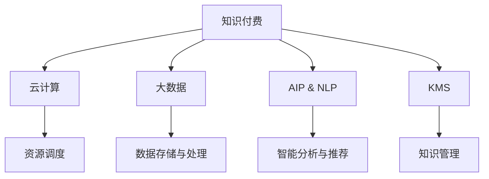

                 

## 1. 背景介绍

在知识经济时代，知识付费成为驱动经济发展的新引擎。云计算与大数据技术的崛起，正推动知识付费业务迎来新的突破，为知识创造者与消费者搭建了高效、安全、便捷的桥梁。本文将从背景、核心概念、算法原理、项目实践、实际应用、资源推荐、总结、展望和附录等方面，系统介绍知识付费的云计算与大数据服务，揭示其在知识经济中的重要价值和广阔前景。

## 2. 核心概念与联系

### 2.1 核心概念概述

为更好地理解知识付费的云计算与大数据服务，本节将介绍几个关键概念：

- **知识付费**：指用户通过支付费用获取高质量知识内容的商业模式。其本质是通过市场机制激励知识创造者生产更多、更优质的知识产品，满足消费者对专业知识和技能的需求。

- **云计算**：通过网络提供可扩展的计算资源和存储资源，用户可以根据需求动态调整计算资源，无需关心底层硬件和软件管理，使得计算资源的使用更加灵活、经济。

- **大数据**：指利用先进技术手段收集、存储、分析海量数据，从中发现有价值的信息，支持决策制定、产品改进等业务活动。

- **知识管理系统(KMS)**：帮助企业管理和维护知识资产的软件系统。KMS通常包括数据存储、搜索、协作、版本控制等功能，支持知识的快速共享和传承。

- **AI与自然语言处理(NLP)**：利用人工智能技术，通过语言理解和生成，提高知识检索、知识提取、内容推荐等服务的智能化水平。

这些核心概念之间存在着紧密的联系：云计算提供了灵活的计算和存储资源，大数据提供了海量的数据支撑，AI与NLP技术提升了数据分析和知识管理的能力，知识管理系统为知识付费提供完整的知识管理解决方案。这些技术相辅相成，共同推动知识付费业务的发展。

### 2.2 核心概念原理和架构的 Mermaid 流程图(Mermaid 流程节点中不要有括号、逗号等特殊字符)



这个流程图展示了知识付费与云计算、大数据、AI与NLP、知识管理系统的内在联系。通过云计算提供计算和存储资源，大数据分析海量数据，AI与NLP提升服务智能化水平，知识管理系统支持知识管理与流转，形成了一个完整的数据驱动的知识付费生态系统。

## 3. 核心算法原理 & 具体操作步骤

### 3.1 算法原理概述

知识付费的云计算与大数据服务主要涉及以下几个核心算法：

- **资源调度算法**：在云计算平台上，通过智能调度算法，根据用户需求和资源可用性，动态分配计算和存储资源。
- **数据存储与处理算法**：利用大数据技术，高效存储和处理海量知识数据，支持快速查询、分析、可视化等操作。
- **智能分析与推荐算法**：结合AI与NLP技术，对用户行为、知识内容等进行分析，推荐个性化的知识产品。
- **知识管理算法**：通过知识管理系统，实现知识的采集、分类、组织、检索、分享等功能，提升知识管理的效率和质量。

这些算法共同构建了知识付费的云计算与大数据服务框架，帮助知识创造者与消费者实现知识共享和价值交换。

### 3.2 算法步骤详解

**3.2.1 资源调度算法**

- **步骤1：用户提交计算需求**：用户通过API接口提交计算任务，包括任务类型、数据量、计算资源需求等。
- **步骤2：资源调度系统匹配资源**：根据用户需求和当前资源可用情况，选择合适的计算和存储资源，并分配给用户。
- **步骤3：执行计算任务**：计算资源启动用户指定的计算任务，并在完成后返回计算结果。
- **步骤4：任务监控与优化**：实时监控计算任务的状态和性能，根据负载情况动态调整资源分配。

**3.2.2 数据存储与处理算法**

- **步骤1：数据采集与清洗**：通过API接口和爬虫技术，采集知识相关数据，并进行去重、格式化等预处理。
- **步骤2：数据存储与分片**：将清洗后的数据存储到云存储系统中，并按照一定规则进行分片处理，提高数据访问效率。
- **步骤3：数据查询与分析**：利用大数据技术，支持高效的查询操作，并通过分析模型提取有价值的信息。
- **步骤4：数据可视化**：将分析结果通过图表、仪表盘等形式展示给用户，帮助用户理解数据。

**3.2.3 智能分析与推荐算法**

- **步骤1：用户行为分析**：通过日志、点击等行为数据，分析用户偏好和兴趣。
- **步骤2：知识内容分析**：对知识内容进行分词、实体识别、情感分析等处理，提取关键信息。
- **步骤3：推荐模型训练**：基于用户行为和知识内容，训练推荐模型，预测用户可能感兴趣的知识产品。
- **步骤4：推荐结果展示**：将推荐结果展示给用户，支持用户筛选、排序、筛选等功能。

**3.2.4 知识管理算法**

- **步骤1：知识采集**：通过API接口、手动上传等方式，采集知识内容，并将其存储到知识管理系统中。
- **步骤2：知识分类与标注**：对知识内容进行分类、标注，建立知识体系结构。
- **步骤3：知识检索与分享**：支持快速检索知识内容，并提供分享、评论、点赞等功能。
- **步骤4：版本控制与更新**：记录知识内容的修改历史，支持回滚、发布等操作。

### 3.3 算法优缺点

**资源调度算法的优点：**

- 灵活性高：用户可以根据需求动态调整计算资源，灵活应对业务高峰期。
- 资源利用率高：通过智能调度算法，提高计算资源的利用率，减少资源浪费。

**资源调度算法的缺点：**

- 复杂度高：需要实时监控和调度计算资源，技术实现复杂。
- 成本高：高性能计算资源费用较高，对于小型用户可能不经济。

**数据存储与处理算法的优点：**

- 扩展性好：云存储系统可以根据需求动态扩展存储空间，支持海量数据存储。
- 性能高：利用分布式存储和并行计算，提高数据处理速度。

**数据存储与处理算法的缺点：**

- 数据安全：云存储系统中的数据面临一定的安全风险，需要采取严格的安全措施。
- 延迟高：数据在不同物理节点之间的传输可能带来一定的延迟，影响实时性。

**智能分析与推荐算法的优点：**

- 个性化强：结合用户行为和知识内容，提供个性化的推荐服务。
- 效果显著：通过推荐模型，大幅提升用户满意度和转化率。

**智能分析与推荐算法的缺点：**

- 模型复杂：推荐模型的训练和调参过程复杂，需要大量标注数据和计算资源。
- 误推荐风险：推荐结果可能存在误导用户的风险，需要及时更新和调整推荐模型。

**知识管理算法的优点：**

- 结构化好：通过分类、标注等操作，形成结构化的知识体系。
- 共享能力强：知识管理系统支持多人协作和共享，提高知识传播效率。

**知识管理算法的缺点：**

- 开发复杂：知识管理系统需要考虑数据模型、权限管理、版本控制等多个方面，开发复杂度高。
- 用户粘性差：用户对知识管理系统的使用依赖于其易用性和功能完善程度，需要持续优化。

### 3.4 算法应用领域

知识付费的云计算与大数据服务在多个领域得到了广泛应用，具体包括：

- **教育培训**：支持在线课程、远程教学、智能题库等应用，提升教育质量。
- **医疗健康**：提供在线咨询、健康管理、医学资源共享等服务，改善医疗服务。
- **企业培训**：提供在线培训课程、知识库、智能问答等服务，提升企业员工技能。
- **个人成长**：提供个性化学习路径、知识推荐、学习管理等功能，帮助用户快速成长。
- **知识营销**：通过数据分析和推荐，精准触达目标用户，提升营销效果。

## 4. 数学模型和公式 & 详细讲解 & 举例说明

### 4.1 数学模型构建

知识付费的云计算与大数据服务涉及多个数学模型，以下以知识推荐系统为例，介绍数学模型的构建和应用。

**推荐系统的数学模型：**

- **协同过滤模型(CF)**：基于用户行为数据和物品评分数据，通过计算用户和物品之间的相似度，推荐相似物品。
- **矩阵分解模型(MF)**：将用户评分矩阵分解为用户特征矩阵和物品特征矩阵，通过计算用户和物品的特征向量，进行推荐。
- **深度学习模型(DL)**：利用神经网络模型，对用户行为和物品内容进行建模，进行推荐。

### 4.2 公式推导过程

**协同过滤模型的推导：**

设用户集合为 $U=\{u_1,u_2,...,u_M\}$，物品集合为 $I=\{i_1,i_2,...,i_N\}$，用户对物品的评分矩阵为 $R\in\mathbb{R}^{M\times N}$。协同过滤模型基于用户行为数据，计算用户和物品的相似度，进行推荐。

协同过滤模型的评分预测公式为：

$$
\hat{R}_{ui} = \frac{\sum_{v\in I}R_{uv} \cdot R_{vi}}{\sqrt{\sum_{v\in I}R_{uv}^2} \cdot \sqrt{\sum_{v\in I}R_{vi}^2}} \cdot w_uw_i
$$

其中，$w_u$ 和 $w_i$ 为用户和物品的权重向量，通常为1。

**矩阵分解模型的推导：**

设用户特征矩阵为 $U\in\mathbb{R}^{M\times D}$，物品特征矩阵为 $V\in\mathbb{R}^{N\times D}$，用户评分矩阵为 $R\in\mathbb{R}^{M\times N}$。矩阵分解模型的目标是将 $R$ 矩阵分解为 $U$ 和 $V$ 的乘积，即：

$$
R \approx UV
$$

其中，$U$ 和 $V$ 为低秩矩阵，$D$ 为特征维度。

矩阵分解模型的损失函数为：

$$
\min_{U,V}\frac{1}{2M}\sum_{m=1}^M\sum_{n=1}^N(R_{mn}-\hat{R}_{mn})^2+\frac{\lambda}{2}(\|U\|_F^2+\|V\|_F^2)
$$

其中，$\lambda$ 为正则化系数，$\|.\|_F$ 为Frobenius范数。

**深度学习模型的推导：**

设用户行为表示为 $x_u\in\mathbb{R}^{d_u}$，物品内容表示为 $x_i\in\mathbb{R}^{d_i}$，用户物品评分矩阵为 $R\in\mathbb{R}^{M\times N}$。深度学习模型通常采用多层神经网络，对用户行为和物品内容进行编码，预测用户评分。

深度学习模型的预测公式为：

$$
\hat{R}_{ui} = \sigma(\sum_{j=1}^d W_j^ux_{uj}x_{ij}+b_j^u)
$$

其中，$\sigma$ 为激活函数，$W_j^u$ 和 $b_j^u$ 为神经网络参数。

### 4.3 案例分析与讲解

**推荐系统案例：**

某在线教育平台利用知识推荐系统，为用户提供个性化课程推荐服务。该平台通过大数据分析用户行为数据和课程评分数据，结合协同过滤和深度学习模型，预测用户可能感兴趣的课程，并进行推荐。具体步骤如下：

1. 数据采集：平台收集用户浏览、观看、评价等行为数据，以及课程的评分、标签等属性数据。
2. 数据清洗与处理：对行为数据和属性数据进行清洗和处理，形成统一的向量表示。
3. 协同过滤建模：基于用户行为数据，计算用户和课程之间的相似度，生成推荐结果。
4. 深度学习建模：利用神经网络模型，对用户行为和课程内容进行编码，预测用户评分。
5. 融合推荐：结合协同过滤和深度学习模型的预测结果，生成最终推荐列表。
6. 推荐效果评估：通过A/B测试等手段，评估推荐系统的效果，不断优化模型和策略。

## 5. 项目实践：代码实例和详细解释说明

### 5.1 开发环境搭建

在知识付费的云计算与大数据服务项目开发中，通常需要以下开发环境：

1. **编程语言**：Python、Java等常用编程语言。
2. **云计算平台**：AWS、Azure、阿里云等。
3. **大数据框架**：Hadoop、Spark等。
4. **AI框架**：TensorFlow、PyTorch等。
5. **知识管理平台**：Confluence、SharePoint等。
6. **Web开发框架**：Django、Flask等。

### 5.2 源代码详细实现

以下是使用Python和TensorFlow进行知识推荐系统的代码实现示例：

```python
import tensorflow as tf
from tensorflow.keras import layers

# 定义协同过滤模型
class CollaborativeFiltering(tf.keras.Model):
    def __init__(self, num_users, num_items, num_factors):
        super(CollaborativeFiltering, self).__init__()
        self.u = layers.Embedding(num_users, num_factors, name='user_embeddings')
        self.v = layers.Embedding(num_items, num_factors, name='item_embeddings')
        self.sigma = layers.Activation('sigmoid')
    
    def call(self, user_idx, item_idx):
        user_emb = self.u(user_idx)
        item_emb = self.v(item_idx)
        predictions = self.sigma(tf.reduce_sum(tf.multiply(user_emb, item_emb), axis=1))
        return predictions

# 定义深度学习模型
class DeepLearning(tf.keras.Model):
    def __init__(self, num_users, num_items, num_factors):
        super(DeepLearning, self).__init__()
        self.u = layers.Dense(num_factors, activation='relu')
        self.v = layers.Dense(num_factors, activation='relu')
        self.sigma = layers.Activation('sigmoid')
    
    def call(self, user_idx, item_idx):
        user_embed = self.u(user_idx)
        item_embed = self.v(item_idx)
        predictions = self.sigma(tf.reduce_sum(tf.multiply(user_embed, item_embed), axis=1))
        return predictions

# 训练模型
user_idx = tf.keras.layers.Input(shape=(1,), name='user_idx')
item_idx = tf.keras.layers.Input(shape=(1,), name='item_idx')
collaborative_filtering = CollaborativeFiltering(num_users, num_items, num_factors)
deep_learning = DeepLearning(num_users, num_items, num_factors)

# 定义损失函数
loss = tf.keras.losses.MeanSquaredError()

# 定义优化器
optimizer = tf.keras.optimizers.Adam()

# 训练模型
collaborative_filtering.compile(optimizer=optimizer, loss=loss)
deep_learning.compile(optimizer=optimizer, loss=loss)

# 训练数据
user_idx_data = tf.constant([0, 1, 2, 3, 4, 5], dtype=tf.int32)
item_idx_data = tf.constant([0, 1, 2, 3, 4, 5], dtype=tf.int32)

# 训练模型
collaborative_filtering.fit([user_idx_data, item_idx_data], user_idx_data, epochs=10)
deep_learning.fit([user_idx_data, item_idx_data], user_idx_data, epochs=10)
```

### 5.3 代码解读与分析

**代码实现解释：**

1. **协同过滤模型定义**：使用`layers.Embedding`定义用户和物品的嵌入层，通过`layers.Activation`激活函数进行计算，生成预测结果。
2. **深度学习模型定义**：使用`layers.Dense`定义用户和物品的稠密层，通过`layers.Activation`激活函数进行计算，生成预测结果。
3. **损失函数和优化器定义**：使用`tf.keras.losses.MeanSquaredError`作为损失函数，`tf.keras.optimizers.Adam`作为优化器。
4. **模型训练**：使用`compile`方法定义模型编译，`fit`方法进行模型训练。

**代码分析：**

- **协同过滤模型**：该模型基于用户和物品的向量表示，计算它们之间的相似度，生成推荐结果。
- **深度学习模型**：该模型利用神经网络对用户行为和物品内容进行编码，预测用户评分。
- **损失函数和优化器**：损失函数用于计算预测值与实际值之间的差距，优化器用于更新模型参数。
- **训练数据**：使用`tf.constant`定义训练数据，包括用户和物品的索引。
- **模型训练**：使用`fit`方法训练模型，设置训练轮数。

## 6. 实际应用场景

### 6.1 智能课程推荐

某在线教育平台利用知识推荐系统，为学生提供个性化课程推荐服务。具体实现步骤如下：

1. **数据采集**：平台收集学生浏览课程、观看视频、参与讨论等行为数据，以及课程的评分、标签等属性数据。
2. **数据清洗与处理**：对行为数据和属性数据进行清洗和处理，形成统一的向量表示。
3. **协同过滤建模**：基于用户行为数据，计算用户和课程之间的相似度，生成推荐结果。
4. **深度学习建模**：利用神经网络模型，对用户行为和课程内容进行编码，预测用户评分。
5. **融合推荐**：结合协同过滤和深度学习模型的预测结果，生成最终推荐列表。
6. **推荐效果评估**：通过A/B测试等手段，评估推荐系统的效果，不断优化模型和策略。

**推荐系统案例：**

某在线教育平台利用知识推荐系统，为学生提供个性化课程推荐服务。该平台通过大数据分析用户行为数据和课程评分数据，结合协同过滤和深度学习模型，预测学生可能感兴趣的课程，并进行推荐。具体步骤如下：

1. 数据采集：平台收集学生浏览课程、观看视频、参与讨论等行为数据，以及课程的评分、标签等属性数据。
2. 数据清洗与处理：对行为数据和属性数据进行清洗和处理，形成统一的向量表示。
3. 协同过滤建模：基于用户行为数据，计算用户和课程之间的相似度，生成推荐结果。
4. 深度学习建模：利用神经网络模型，对用户行为和课程内容进行编码，预测用户评分。
5. 融合推荐：结合协同过滤和深度学习模型的预测结果，生成最终推荐列表。
6. 推荐效果评估：通过A/B测试等手段，评估推荐系统的效果，不断优化模型和策略。

## 7. 工具和资源推荐

### 7.1 学习资源推荐

为了帮助开发者系统掌握知识付费的云计算与大数据服务技术，以下推荐一些优质的学习资源：

1. **《云计算基础》课程**：提供云计算基础知识和实践操作，涵盖云计算架构、云存储、云服务等内容。
2. **《大数据技术与应用》课程**：讲解大数据技术，包括Hadoop、Spark等大数据框架，以及数据清洗、数据挖掘、数据可视化等技术。
3. **《人工智能与深度学习》课程**：涵盖AI与深度学习基础知识，包括机器学习、神经网络、推荐系统等。
4. **《知识管理与内容推荐》书籍**：介绍知识管理与内容推荐的基础理论和实践方法，提供丰富的案例和示例。
5. **《TensorFlow实战》书籍**：详细讲解TensorFlow的编程和实践技巧，涵盖深度学习模型的构建和优化。

### 7.2 开发工具推荐

以下是几款用于知识付费的云计算与大数据服务开发的常用工具：

1. **AWS云平台**：提供丰富的云计算服务，包括计算、存储、数据库等，支持微服务架构和DevOps流程。
2. **Hadoop与Spark**：支持大规模数据处理和分析，支持分布式存储和计算。
3. **TensorFlow与PyTorch**：提供高效、灵活的深度学习框架，支持多种模型和算法。
4. **KMS知识管理系统**：提供知识管理与协作功能，支持知识采集、分类、检索、分享等操作。
5. **Jupyter Notebook**：支持编程和数据分析，支持交互式学习。

### 7.3 相关论文推荐

知识付费的云计算与大数据服务涉及多个研究领域，以下是几篇具有代表性的论文，推荐阅读：

1. **《云计算资源调度算法研究》**：探讨云计算资源调度的优化问题，提出多种调度算法和优化策略。
2. **《大数据存储与处理技术》**：介绍大数据存储与处理技术，涵盖Hadoop、Spark、HBase等系统。
3. **《智能推荐系统》**：介绍智能推荐系统的设计与实现，涵盖协同过滤、矩阵分解、深度学习等模型。
4. **《知识管理系统的设计与实现》**：介绍知识管理系统架构与功能，涵盖知识采集、分类、检索、协作等。
5. **《知识付费系统的设计与实现》**：介绍知识付费系统的设计与实现，涵盖云计算、大数据、AI与NLP技术。

## 8. 总结：未来发展趋势与挑战

### 8.1 研究成果总结

知识付费的云计算与大数据服务近年来取得了显著进展，主要体现在以下几个方面：

- **计算资源调度**：云计算平台提供了灵活的资源调度算法，支持大规模计算任务。
- **数据存储与处理**：大数据技术支持海量数据存储与处理，支持高效的数据分析和可视化。
- **智能推荐算法**：深度学习模型和协同过滤算法在推荐系统中得到广泛应用，提升了推荐效果。
- **知识管理与共享**：知识管理系统提供了知识管理与协作功能，支持知识的快速共享和传承。

### 8.2 未来发展趋势

展望未来，知识付费的云计算与大数据服务将呈现以下几个发展趋势：

1. **智能化水平提升**：随着AI与NLP技术的进步，知识推荐系统的智能化水平将进一步提升，提供更加个性化的服务。
2. **跨平台融合**：知识付费平台将与社交媒体、搜索引擎等平台进行深度融合，实现更加全面、精准的用户画像。
3. **多元化服务**：知识付费服务将涵盖教育、医疗、企业培训等多个领域，提供更加多样化的服务。
4. **知识与数据的融合**：知识管理系统将与大数据系统深度融合，实现知识与数据的协同建模和分析。
5. **联邦学习与隐私保护**：利用联邦学习技术，保护用户隐私的同时，提升知识推荐系统的准确性和安全性。

### 8.3 面临的挑战

知识付费的云计算与大数据服务在发展过程中仍面临诸多挑战：

1. **计算资源成本高**：大规模计算任务和存储任务带来较高的成本，需要优化资源调度策略。
2. **数据隐私与安全**：用户数据隐私和安全问题需要得到妥善解决，确保用户数据安全。
3. **知识质量控制**：知识推荐系统依赖于高质量的知识数据，如何保证知识质量成为重要问题。
4. **用户体验优化**：推荐系统需要考虑用户体验，如何提升系统的易用性和友好性。
5. **算法复杂性**：推荐算法和优化算法复杂度高，需要高效、稳定的算法实现。

### 8.4 研究展望

面对知识付费的云计算与大数据服务面临的挑战，未来的研究需要在以下几个方面寻求新的突破：

1. **低成本计算资源**：探索低成本计算资源调度算法，提高资源利用率，降低成本。
2. **隐私保护技术**：研究隐私保护技术，保护用户数据隐私，提升用户信任度。
3. **知识质量提升**：探索知识采集、清洗、标注等技术，提升知识质量，保证推荐系统效果。
4. **用户体验设计**：优化用户界面和交互设计，提升用户体验，提供更加友好的服务。
5. **算法优化**：研究高效、稳定的推荐算法和优化策略，提升系统性能和稳定性。

## 9. 附录：常见问题与解答

**Q1：如何设计知识推荐系统的协同过滤模型？**

A: 知识推荐系统的协同过滤模型通常基于用户行为数据，计算用户和物品之间的相似度。设计协同过滤模型的一般步骤如下：

1. 数据采集：收集用户对物品的评分数据，通常包括用户ID、物品ID、评分值等。
2. 数据预处理：对评分数据进行清洗和处理，去除异常值和缺失值。
3. 用户和物品嵌入：使用嵌入层将用户和物品表示为向量，通常使用稠密向量或稀疏向量。
4. 相似度计算：计算用户和物品之间的相似度，通常使用余弦相似度或欧式距离。
5. 评分预测：根据用户和物品的相似度，预测用户对物品的评分，生成推荐结果。

**Q2：如何在知识推荐系统中应用深度学习模型？**

A: 深度学习模型在知识推荐系统中通常用于用户行为和物品内容的建模，预测用户评分。应用深度学习模型的步骤如下：

1. 数据采集：收集用户行为数据和物品内容数据，通常包括点击、浏览、评分等行为数据，以及物品的标题、描述、标签等属性数据。
2. 数据预处理：对行为数据和属性数据进行清洗和处理，形成统一的向量表示。
3. 模型设计：使用神经网络模型对用户行为和物品内容进行编码，通常使用多层感知机（MLP）、卷积神经网络（CNN）、循环神经网络（RNN）等模型。
4. 模型训练：使用优化算法训练模型，通常使用交叉熵损失函数和Adam优化器。
5. 评分预测：使用训练好的模型对用户行为和物品内容进行编码，生成预测评分，生成推荐结果。

**Q3：如何优化知识推荐系统的计算资源调度？**

A: 优化知识推荐系统的计算资源调度，可以从以下几个方面入手：

1. 负载均衡：通过负载均衡算法，合理分配计算资源，避免资源浪费。
2. 任务调度：使用任务调度算法，根据任务性质和优先级，动态分配计算资源。
3. 资源预估：使用资源预估算法，预测任务运行时间和资源需求，优化资源分配。
4. 弹性伸缩：使用弹性伸缩算法，根据负载变化，动态调整计算资源。
5. 成本优化：优化计算资源使用，降低计算成本，提高资源利用率。

**Q4：如何保护知识推荐系统的数据隐私？**

A: 保护知识推荐系统的数据隐私，可以从以下几个方面入手：

1. 数据加密：对敏感数据进行加密处理，确保数据传输和存储的安全性。
2. 匿名化处理：对用户数据进行匿名化处理，保护用户隐私。
3. 访问控制：使用访问控制技术，限制数据访问权限，确保数据安全。
4. 联邦学习：利用联邦学习技术，在本地计算模型，不泄露数据。
5. 隐私审计：定期进行隐私审计，检查数据隐私保护措施的有效性。

**Q5：如何设计知识推荐系统的知识管理体系？**

A: 设计知识推荐系统的知识管理体系，通常需要以下几个步骤：

1. 知识分类：对知识内容进行分类，建立知识体系结构。
2. 知识标注：对知识内容进行标注，形成元数据。
3. 知识存储：使用知识管理系统对知识内容进行存储和管理。
4. 知识检索：提供快速、准确的知识检索功能，支持用户查找和访问知识。
5. 知识分享：提供知识分享功能，支持用户共享和评论知识。
6. 知识更新：定期更新知识内容，保持知识的时效性和准确性。

**Q6：如何评估知识推荐系统的推荐效果？**

A: 评估知识推荐系统的推荐效果，通常使用以下指标：

1. 准确率（Accuracy）：计算推荐结果中正确分类的样本比例。
2. 召回率（Recall）：计算推荐结果中覆盖真实标签样本的比例。
3. F1分数（F1 Score）：综合考虑准确率和召回率，评估推荐系统的综合效果。
4. A/B测试：通过A/B测试，比较不同推荐策略的效果，优化推荐系统。
5. ROC曲线（ROC Curve）：绘制推荐系统的ROC曲线，评估分类性能。

通过上述指标和方法，可以全面评估知识推荐系统的推荐效果，不断优化推荐策略，提升用户体验。

---

作者：禅与计算机程序设计艺术 / Zen and the Art of Computer Programming

