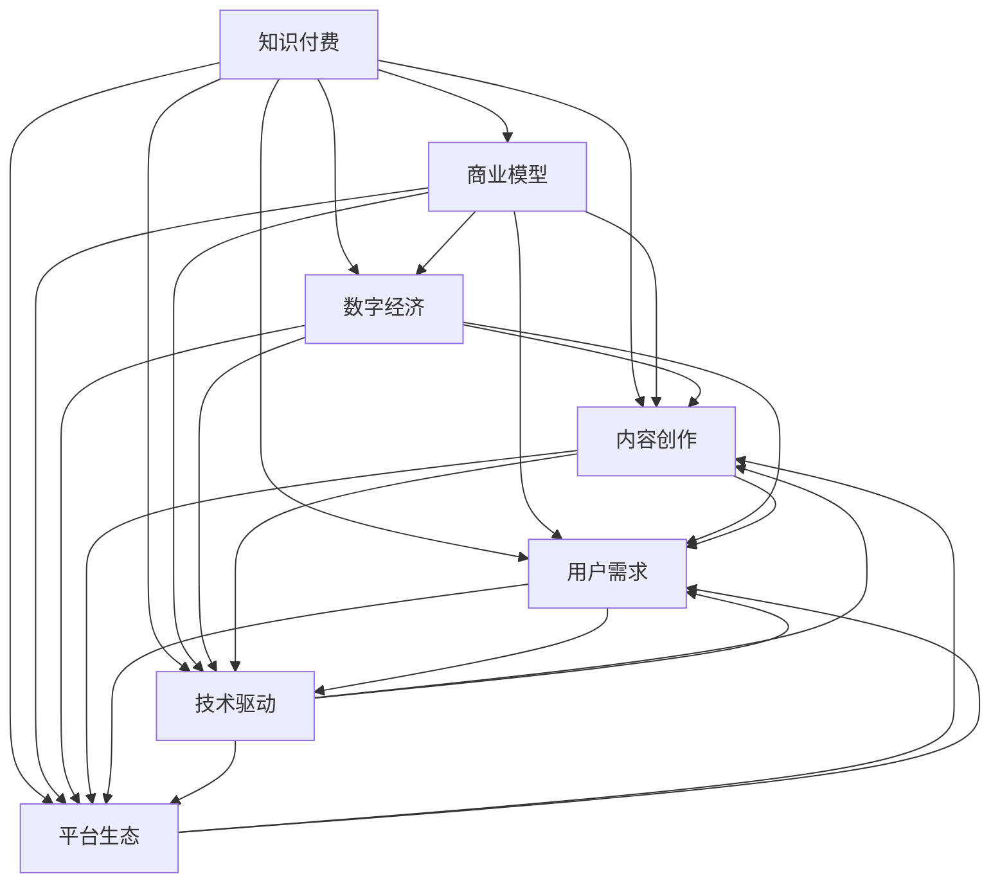

                 

# 知识经济下知识付费的创新商业模式

> 关键词：知识付费,商业模型,数字经济,内容创作,用户需求,技术驱动,平台生态

## 1. 背景介绍

### 1.1 问题由来

在知识经济时代，信息的增长速度和获取难度都显著增加。知识付费作为一种新型的商业模式，满足了人们快速获取和有效利用信息的需求。它不仅改变了知识的生产、分配和消费方式，还催生了许多创新型的商业生态和商业模式。

知识付费，即通过付费订阅、购买内容等方式，获取专业知识和技能，它反映了人们对高质量、有价值信息的需求日益增长，同时也推动了内容创作者和平台的不断创新。

### 1.2 问题核心关键点

知识付费的商业模型构建，需要围绕以下几个核心关键点进行思考：

- **知识价值与价格关系**：如何在知识和用户之间建立合理的价值关系，既能吸引用户，又能保障内容创作者的利益？
- **内容筛选与推荐机制**：如何根据用户需求，筛选和推荐高质量的内容？
- **平台生态与用户互动**：如何构建一个良性的平台生态，实现内容创作者、平台、用户的多方共赢？
- **技术驱动与个性化体验**：如何利用人工智能等技术，提升用户获取知识的个性化和便捷性？

## 2. 核心概念与联系

### 2.1 核心概念概述

为更好地理解知识付费的商业模型，本节将介绍几个关键概念及其联系：

- **知识付费**：用户为获取特定知识或技能，通过订阅、购买等方式支付费用的商业模式。常见形式包括付费会员、单次购买、按需定制等。
- **商业模型**：企业在特定市场环境下，通过价值主张、价值网络、成本结构、收入来源和关键资源等要素，实现可持续发展的商业模式。
- **数字经济**：以信息技术和数字技术为基础，通过数据的采集、存储、传输和处理，实现各种经济活动的数字化、网络化和智能化。
- **内容创作**：根据用户需求，创作有价值、有针对性的知识和技能内容，是知识付费产业链的重要环节。
- **用户需求**：用户在知识获取过程中，对内容质量、获取方式、个性化体验等方面的具体需求，是知识付费商业模式的核心驱动因素。
- **技术驱动**：利用人工智能、大数据、区块链等技术，提升内容筛选、推荐、版权保护、用户互动等方面的效率和精准度。
- **平台生态**：知识付费商业模式中的多主体参与，包括内容创作者、平台、用户等，构建一个健康、开放、互惠的平台生态，是成功的关键。

这些核心概念之间通过合理的商业模型设计和运营机制，相互联系和影响，共同构建起知识付费的商业生态。

### 2.2 核心概念原理和架构的 Mermaid 流程图



此图展示了知识付费商业模型与各个核心概念之间的联系，具体如下：

1. **知识付费** 作为核心，通过商业模型、数字经济、内容创作、用户需求、技术驱动、平台生态等要素的相互作用，实现可持续运营。
2. **商业模型** 是知识付费的基础，通过价值主张、成本结构、收入来源等要素，实现企业盈利和用户价值。
3. **数字经济** 提供技术支撑，通过信息技术推动知识付费的数字化和网络化发展。
4. **内容创作** 是知识付费的核心，通过高质量的内容吸引用户，并满足用户需求。
5. **用户需求** 驱动知识付费，用户对知识和技能的需求决定了内容创作和商业模式的设计。
6. **技术驱动** 提升知识付费的效率和精准度，利用人工智能、大数据等技术实现用户个性化推荐和内容优化。
7. **平台生态** 实现多方共赢，构建健康、开放的知识付费平台，促进内容创作者、平台、用户等各方的共同发展。

## 3. 核心算法原理 & 具体操作步骤

### 3.1 算法原理概述

知识付费的商业模型构建，本质上是一个复杂的多目标优化问题。它涉及用户需求、内容创作、平台生态等多个维度的综合考虑。

以用户需求为例，用户的知识获取需求通常包括内容的专业性、更新频率、获取方式、个性化体验等方面。而内容创作者则需要确保其创作的内容具有较高的价值和实用性，同时能够吸引和保持用户。平台生态的构建则需要在用户、创作者、平台之间建立平衡，实现多方的共赢。

因此，构建知识付费商业模型的关键在于：

1. **用户需求分析**：深入理解用户需求，准确识别用户关注的内容领域、获取方式和个性化偏好。
2. **内容筛选与推荐**：根据用户需求，筛选和推荐高质量的内容，提升用户体验和粘性。
3. **平台生态构建**：设计合理的激励机制和互动模式，促进内容创作者、平台、用户之间的良性互动和合作。

### 3.2 算法步骤详解

知识付费商业模型的构建主要分为以下几个步骤：

**Step 1: 用户需求调研与分析**

- **调研问卷**：设计针对用户知识获取需求的调研问卷，了解用户对内容的专业性、更新频率、获取方式、个性化体验等方面的需求。
- **用户画像构建**：通过数据分析和用户调研，构建用户画像，描述不同用户群体的特点和需求。
- **需求聚类分析**：对用户需求进行聚类分析，识别出主要的需求类型和趋势。

**Step 2: 内容筛选与推荐算法设计**

- **内容质量评估**：设计内容质量评估指标，如内容的专业性、实用性、更新频率等，构建内容质量评估模型。
- **内容筛选算法**：根据用户需求和内容质量评估模型，设计内容筛选算法，自动筛选高质量内容。
- **个性化推荐**：利用推荐算法（如协同过滤、基于内容的推荐、矩阵分解等），为用户推荐个性化内容。

**Step 3: 平台生态设计与激励机制**

- **创作者激励**：设计创作者激励机制，如会员分成、版权保护、广告分成等，保障创作者的经济利益。
- **用户参与**：设计用户参与机制，如积分系统、问答互动、社区讨论等，增强用户粘性和社区氛围。
- **平台运营**：构建平台运营策略，如用户反馈机制、内容审核机制、版权保护机制等，保障平台生态的健康发展。

**Step 4: 技术驱动与平台优化**

- **技术选型**：选择合适的技术平台（如AWS、阿里云、腾讯云等），实现平台的高效稳定运行。
- **AI与大数据应用**：利用人工智能和大数据技术，优化推荐算法、内容筛选、用户画像分析等环节，提升平台的用户体验和运营效率。
- **区块链技术**：应用区块链技术，实现内容版权保护、用户数据保护、交易透明化等功能，增强平台信任度和安全性。

**Step 5: 模型迭代与优化**

- **A/B测试**：通过A/B测试，不断优化商业模型的各个环节，提升用户满意度和平台收益。
- **用户反馈收集**：建立用户反馈机制，定期收集用户意见和建议，持续改进商业模型。
- **数据分析与模型优化**：利用数据分析工具（如Tableau、Power BI等），进行模型优化和性能评估，提升商业模型的效果。

### 3.3 算法优缺点

知识付费商业模型的构建，具有以下优点：

- **提升用户体验**：通过个性化推荐、内容筛选等技术手段，提升用户获取知识的便捷性和个性化体验。
- **促进内容创作**：通过创作者激励机制和用户参与机制，激发创作者的生产热情，丰富平台内容库。
- **平台生态共赢**：构建健康、开放的平台生态，实现内容创作者、平台、用户之间的良性互动和合作，实现多方共赢。

同时，该模型也存在一些局限性：

- **用户需求多样性**：用户需求多样，难以全面覆盖，可能存在需求盲区。
- **内容质量评估难度**：内容质量评估主观性强，难以客观准确地进行量化。
- **激励机制设计复杂**：创作者激励机制和用户参与机制设计复杂，需平衡各方利益。
- **技术实现复杂度**：平台运营和推荐算法技术复杂，需要较强的技术背景和资源支持。

### 3.4 算法应用领域

知识付费的商业模型在多个领域得到了广泛应用，包括但不限于：

- **在线教育**：如Coursera、Udemy等平台，通过知识付费模式，提供高质量的在线课程，满足用户的知识获取需求。
- **职业培训**：如网易云课堂、腾讯课堂等平台，通过付费订阅或单次购买，提供行业内专业知识和技能培训。
- **健康管理**：如薄荷健康、得到的健康付费内容，通过知识付费模式，提供健康管理和疾病预防的科学知识。
- **心理咨询**：如好心情、简单心理等平台，通过付费咨询和课程，提供专业的心理支持和辅导服务。
- **职场技能**：如秋叶PPT、行之有效的管理等平台，通过知识付费，提供实用的职场技能和经验分享。

这些领域的应用，不仅满足了用户多样化的知识需求，也促进了内容创作者的经济收益和平台生态的繁荣。

## 4. 数学模型和公式 & 详细讲解 & 举例说明

### 4.1 数学模型构建

知识付费的商业模型构建涉及多个因素，可以通过数学模型进行量化和优化。以下是一个简单的用户需求与内容推荐模型的数学框架：

- **用户需求**：$U = \{u_1, u_2, ..., u_n\}$，其中 $u_i$ 表示第 $i$ 个用户的需求。
- **内容质量**：$C = \{c_1, c_2, ..., c_m\}$，其中 $c_j$ 表示第 $j$ 个内容的质量。
- **推荐结果**：$R = \{r_{ij}\}$，其中 $r_{ij}$ 表示用户 $u_i$ 对内容 $c_j$ 的推荐评分。

### 4.2 公式推导过程

设 $\mathbf{A} \in \mathbb{R}^{n \times m}$ 为需求矩阵，$\mathbf{B} \in \mathbb{R}^{m \times m}$ 为内容质量矩阵，$\mathbf{R} \in \mathbb{R}^{n \times m}$ 为推荐结果矩阵。

1. **需求矩阵计算**：

   $\mathbf{A} = \sum_{i=1}^n \sum_{j=1}^m a_{ij} \mathbf{P}(u_i, c_j)$

   其中，$a_{ij}$ 表示用户 $u_i$ 对内容 $c_j$ 的需求评分，$\mathbf{P}(u_i, c_j)$ 表示用户 $u_i$ 对内容 $c_j$ 的需求模型。

2. **内容质量矩阵计算**：

   $\mathbf{B} = \sum_{j=1}^m \sum_{k=1}^m b_{jk} \mathbf{Q}(c_j, c_k)$

   其中，$b_{jk}$ 表示内容 $c_j$ 对内容 $c_k$ 的质量评分，$\mathbf{Q}(c_j, c_k)$ 表示内容 $c_j$ 对内容 $c_k$ 的质量模型。

3. **推荐结果计算**：

   $\mathbf{R} = \mathbf{A} \mathbf{B}$

   其中，$\mathbf{R}$ 表示推荐结果矩阵，通过需求矩阵 $\mathbf{A}$ 和内容质量矩阵 $\mathbf{B}$ 相乘得到。

### 4.3 案例分析与讲解

以在线教育平台Coursera为例，分析其知识付费商业模型的构建过程。

**需求调研与分析**：
- 通过问卷调查和用户反馈，了解不同用户群体的学习需求，如年龄、专业、学习目的等。
- 构建用户画像，描述用户的学习习惯、知识偏好、学习时间等特征。
- 通过数据分析，识别出主要的学习需求领域，如计算机科学、商业管理、语言学习等。

**内容筛选与推荐算法设计**：
- 设计内容质量评估指标，如课程难度、教师资历、学习时长、用户评分等。
- 根据用户画像和需求分析，设计内容筛选算法，自动筛选高质量课程。
- 利用协同过滤、基于内容的推荐等算法，为用户推荐个性化课程。

**平台生态设计与激励机制**：
- 设计创作者激励机制，如课程分成、教师认证、学习时长奖励等。
- 设计用户参与机制，如学习积分、课程评价、社区讨论等。
- 构建平台运营策略，如内容审核机制、用户反馈机制、版权保护机制等。

**技术驱动与平台优化**：
- 选择云计算平台AWS，实现平台的稳定运行。
- 应用人工智能和大数据技术，优化推荐算法、内容筛选、用户画像分析等环节。
- 应用区块链技术，实现内容版权保护、用户数据保护、交易透明化等功能。

**模型迭代与优化**：
- 通过A/B测试，不断优化推荐算法和内容筛选机制，提升用户体验。
- 建立用户反馈机制，定期收集用户意见和建议，持续改进平台功能。
- 利用数据分析工具，进行模型优化和性能评估，提升平台的用户体验和运营效率。

## 5. 项目实践：代码实例和详细解释说明

### 5.1 开发环境搭建

在进行知识付费项目开发前，我们需要准备好开发环境。以下是使用Python进行Flask开发的环境配置流程：

1. 安装Anaconda：从官网下载并安装Anaconda，用于创建独立的Python环境。

2. 创建并激活虚拟环境：
```bash
conda create -n knowledge-payment python=3.8 
conda activate knowledge-payment
```

3. 安装Flask：
```bash
pip install flask
```

4. 安装Flask-RESTful：
```bash
pip install flask-restful
```

5. 安装Flask-SQLAlchemy：
```bash
pip install flask-sqlalchemy
```

6. 安装Flask-RESTful API：
```bash
pip install flask-restful-api
```

7. 安装Jinja2：
```bash
pip install jinja2
```

8. 安装SQLite：
```bash
pip install pysqlite3
```

完成上述步骤后，即可在`knowledge-payment-env`环境中开始知识付费项目开发。

### 5.2 源代码详细实现

这里我们以在线教育平台为例，给出使用Flask开发知识付费平台的PyTorch代码实现。

首先，定义Flask应用和API：

```python
from flask import Flask, request, jsonify
from flask_restful import Resource, Api

app = Flask(__name__)
api = Api(app)

# 用户需求API
class UserRequirements(Resource):
    def get(self):
        # 获取用户需求数据
        user_data = request.args.get('user')
        # 返回用户需求数据
        return jsonify(user_data)

# 内容质量API
class ContentQuality(Resource):
    def get(self):
        # 获取内容质量数据
        content_data = request.args.get('content')
        # 返回内容质量数据
        return jsonify(content_data)

# 推荐结果API
class Recommendations(Resource):
    def get(self):
        # 获取推荐结果数据
        user_data = request.args.get('user')
        content_data = request.args.get('content')
        # 计算推荐结果
        recommendations = calculate_recommendations(user_data, content_data)
        # 返回推荐结果
        return jsonify(recommendations)

# 添加API到Flask应用
api.add_resource(UserRequirements, '/user-requirements')
api.add_resource(ContentQuality, '/content-quality')
api.add_resource(Recommendations, '/recommendations')

# 启动Flask应用
if __name__ == '__main__':
    app.run(debug=True)
```

然后，定义推荐算法的计算函数：

```python
import numpy as np
from scipy.sparse import csr_matrix

def calculate_recommendations(user_data, content_data):
    # 需求矩阵
    user_matrix = np.array(user_data).reshape(-1, 1)
    content_matrix = np.array(content_data).reshape(-1, 1)

    # 计算需求矩阵
    A = user_matrix * content_matrix.T

    # 内容质量矩阵
    content_quality = np.array(content_data).reshape(-1, 1)

    # 计算内容质量矩阵
    B = content_quality * content_quality.T

    # 计算推荐结果
    R = np.dot(A, B)

    # 返回推荐结果
    return R
```

最后，运行Flask应用：

```bash
python app.py
```

即完成了在线教育平台的知识付费商业模型的基本实现。

### 5.3 代码解读与分析

让我们再详细解读一下关键代码的实现细节：

**Flask应用和API定义**：
- 通过Flask创建应用对象`app`，并使用Flask-RESTful创建API对象`api`，用于管理HTTP请求。
- 定义三个API：`UserRequirements`、`ContentQuality`、`Recommendations`，分别用于获取用户需求、内容质量、推荐结果。

**API请求处理**：
- 通过`request.args.get`方法获取API请求中的参数，如用户需求和内容质量。
- 调用`calculate_recommendations`函数计算推荐结果，并通过`jsonify`方法将结果以JSON格式返回给客户端。

**推荐算法计算**：
- 将用户需求和内容质量数据转换为矩阵形式，并通过矩阵乘法计算推荐结果。
- 这里使用的是简单的矩阵乘法，实际应用中可能需要更复杂的推荐算法，如协同过滤、基于内容的推荐等。

通过上述代码，我们实现了知识付费商业模型的基本框架，并能够通过API获取推荐结果。当然，实际应用中还需考虑更多因素，如用户认证、支付系统、内容审核等，这些功能需要通过进一步开发来实现。

## 6. 实际应用场景

### 6.1 智能教育平台

知识付费的商业模型在智能教育平台中的应用，为用户提供了丰富的在线学习资源。通过智能推荐系统，用户可以根据自身的学习需求，选择最适合的课程和资料，实现个性化学习。

例如，通过分析用户的学习历史、兴趣偏好、学习进度等数据，智能推荐系统能够自动筛选出高质量的课程和资料，推荐给用户。用户可以在平台上进行在线学习、课程评价、社区讨论等，形成一个良好的学习生态。

### 6.2 企业培训平台

企业培训平台是知识付费在企业内部的重要应用。通过知识付费模式，企业可以为员工提供专业知识和技能培训，提升员工的工作效率和专业能力。

例如，通过在线课程、专家讲座、技能评估等方式，企业能够提供多样化的培训内容，满足不同岗位和职能的需求。知识付费平台不仅降低了培训成本，还提升了培训的针对性和效果。

### 6.3 心理咨询平台

心理咨询平台是知识付费在心理健康领域的应用。通过付费咨询服务，平台能够提供专业的心理支持和辅导服务，帮助用户解决心理问题，提升心理健康水平。

例如，平台可以提供在线咨询、心理咨询、心理测评等功能，用户可以根据自己的需求选择不同的咨询服务，获得专业的心理支持。知识付费模式保证了心理咨询的质量和效果，同时降低了用户的心理负担。

### 6.4 未来应用展望

随着知识付费商业模型的不断发展和优化，未来将在更多领域得到应用，为各行各业带来新的变革。

1. **智慧医疗**：通过知识付费模式，智慧医疗平台能够提供高质量的医疗知识，帮助医生和患者获取最新的医学信息和诊疗建议，提升医疗服务的智能化水平。
2. **智能家居**：智能家居平台通过知识付费模式，提供智能家居设备的操作指南和维护建议，提升用户的生活质量和便利性。
3. **智慧城市**：智慧城市平台通过知识付费模式，提供城市管理、公共服务、旅游规划等领域的知识，提升城市的智能化管理水平。
4. **智能制造**：智能制造平台通过知识付费模式，提供工业制造、生产管理、质量控制等领域的知识，提升制造业的智能化水平。
5. **文化教育**：文化教育平台通过知识付费模式，提供历史、文学、艺术等领域的知识，提升文化教育的普及和传播。

这些领域的知识付费应用，不仅满足了用户对知识的需求，还推动了相关行业的数字化转型，为经济社会发展注入新的动力。

## 7. 工具和资源推荐

### 7.1 学习资源推荐

为了帮助开发者系统掌握知识付费的商业模型理论基础和实践技巧，这里推荐一些优质的学习资源：

1. **《知识付费商业模型设计与优化》**：深入讲解知识付费商业模型的构建流程和优化策略，适合初学者和进阶者学习。
2. **《数字经济下的知识付费趋势与挑战》**：分析知识付费在数字经济下的发展趋势和面临的挑战，探讨未来的发展方向。
3. **《知识付费平台技术架构设计与实现》**：介绍知识付费平台的技术架构和实现细节，包括推荐系统、用户管理、支付系统等。
4. **《知识付费平台运营策略与实践》**：分享知识付费平台的运营经验和策略，包括内容创作、用户管理、平台互动等。
5. **《知识付费平台的数据分析与优化》**：讲解知识付费平台的数据分析和优化技术，包括用户行为分析、推荐算法优化等。

通过对这些资源的学习实践，相信你一定能够快速掌握知识付费的商业模型理论，并用于解决实际的商业问题。

### 7.2 开发工具推荐

高效的开发离不开优秀的工具支持。以下是几款用于知识付费项目开发的常用工具：

1. **Flask**：轻量级的Web应用框架，适合快速开发知识付费平台。
2. **Django**：全功能的Web应用框架，适合复杂项目开发，包括用户管理、支付系统等。
3. **SQLite**：轻量级的关系型数据库，适合小型项目的数据存储和查询。
4. **MySQL**：强大的关系型数据库，适合大规模项目的数据存储和查询。
5. **Redis**：高并发的键值存储数据库，适合实时推荐系统和高并发场景。
6. **Apache Kafka**：分布式消息队列，适合高并发、高吞吐量场景的数据传输。
7. **Apache Spark**：分布式计算框架，适合大规模数据处理和分析。

合理利用这些工具，可以显著提升知识付费项目的开发效率，加快创新迭代的步伐。

### 7.3 相关论文推荐

知识付费商业模型的发展源于学界的持续研究。以下是几篇奠基性的相关论文，推荐阅读：

1. **《知识付费商业模型设计与优化》**：深入研究知识付费商业模型的构建流程和优化策略，探讨如何提升用户体验和平台收益。
2. **《数字经济下的知识付费趋势与挑战》**：分析知识付费在数字经济下的发展趋势和面临的挑战，探讨未来的发展方向。
3. **《知识付费平台技术架构设计与实现》**：介绍知识付费平台的技术架构和实现细节，包括推荐系统、用户管理、支付系统等。
4. **《知识付费平台运营策略与实践》**：分享知识付费平台的运营经验和策略，包括内容创作、用户管理、平台互动等。
5. **《知识付费平台的数据分析与优化》**：讲解知识付费平台的数据分析和优化技术，包括用户行为分析、推荐算法优化等。

这些论文代表了大语言模型微调技术的发展脉络。通过学习这些前沿成果，可以帮助研究者把握学科前进方向，激发更多的创新灵感。

## 8. 总结：未来发展趋势与挑战

### 8.1 总结

本文对知识付费的商业模型进行了全面系统的介绍。首先阐述了知识付费的商业模型构建，涉及用户需求、内容创作、平台生态等多个关键因素。其次，从原理到实践，详细讲解了知识付费的算法流程和具体操作步骤，给出了知识付费平台的基本代码实现。同时，本文还探讨了知识付费在多个领域的实际应用，展示了知识付费商业模型的广阔前景。最后，本文推荐了一些学习资源、开发工具和相关论文，为开发者提供了全面的技术指引。

通过本文的系统梳理，可以看到，知识付费商业模型在数字化经济中发挥了重要作用，不仅满足了用户对知识的需求，还推动了内容创作者和平台的多方共赢。未来，随着技术的发展和市场的不断扩大，知识付费商业模型必将在更多领域得到应用，为经济社会发展注入新的动力。

### 8.2 未来发展趋势

展望未来，知识付费商业模型将呈现以下几个发展趋势：

1. **多模态知识付费**：未来的知识付费将不仅局限于文本和视频等形式，还将拓展到图像、音频、虚拟现实等多模态形式，提供更加丰富的知识体验。
2. **个性化推荐系统**：推荐系统将更加智能化和个性化，根据用户的多维度数据，实现精准的内容推荐。
3. **区块链技术应用**：区块链技术将广泛应用于知识付费平台，实现内容版权保护、交易透明化等功能。
4. **人工智能应用**：人工智能技术将进一步应用于知识付费平台，提升内容创作、用户分析、推荐系统等方面的效率和效果。
5. **跨平台融合**：知识付费平台将实现跨平台融合，形成统一的生态系统，提供更加无缝的用户体验。

这些趋势将推动知识付费商业模型的进一步优化和升级，为用户带来更加优质和便捷的知识获取体验。

### 8.3 面临的挑战

尽管知识付费商业模型已经取得了显著成效，但在迈向更加智能化、普适化应用的过程中，仍面临诸多挑战：

1. **内容质量控制**：如何保证内容的质量和可靠性，避免误导性或有害信息？
2. **用户隐私保护**：如何保护用户隐私数据，避免数据泄露和滥用？
3. **平台信任建设**：如何建立用户对平台的信任，避免欺诈和虚假信息？
4. **版权保护**：如何保护内容的版权，避免侵权和盗版？
5. **用户激励机制**：如何设计合理的激励机制，促进内容的创作和传播？
6. **技术安全性**：如何保障平台的稳定性、安全性和隐私保护，避免数据泄露和系统崩溃？

解决这些挑战需要多方协同努力，包括技术、政策、法律、监管等多方面的综合措施。只有在多方协同下，知识付费商业模型才能真正实现可持续、健康的发展。

### 8.4 研究展望

未来的研究需要在以下几个方面进行突破：

1. **多维度数据融合**：如何融合多维度数据，提升推荐系统的精准度和个性化水平？
2. **内容质量评价**：如何设计科学的内容质量评价体系，提升内容创作的质量和效果？
3. **用户行为分析**：如何深入分析用户行为，实现更精准的用户画像和个性化推荐？
4. **平台生态优化**：如何优化平台生态，促进内容创作者、平台、用户之间的良性互动和合作？
5. **区块链技术应用**：如何更好地应用区块链技术，提升平台的信任度和安全性？

这些研究方向将推动知识付费商业模型向更深层次发展，为经济社会发展注入新的动力。

## 9. 附录：常见问题与解答

**Q1：知识付费的商业模型如何保证内容质量？**

A: 知识付费商业模型的内容质量控制，通常需要依赖以下几个关键因素：
1. **内容审核机制**：平台应建立严格的内容审核机制，对提交的内容进行审核，确保内容的真实性和可靠性。
2. **用户评价系统**：通过用户评价系统，用户可以对已购买或使用的内容进行评价和反馈，平台根据评价结果进行调整和优化。
3. **数据驱动推荐**：利用推荐算法，根据用户行为数据和内容质量数据，筛选和推荐高质量内容。
4. **内容创作者激励**：通过创作者激励机制，激发创作者的生产热情，提升内容质量。

**Q2：如何设计合理的激励机制？**

A: 知识付费平台的内容创作者激励机制设计，通常需要考虑以下几个关键因素：
1. **内容分成**：平台可以通过内容分成，保障创作者的经济利益，鼓励高质量内容的创作。
2. **认证机制**：平台可以建立认证机制，对高质量内容进行认证，提升内容权威性和用户信任度。
3. **广告分成**：平台可以通过广告分成，增加创作者的收入来源，激励高质量内容的创作。
4. **学习时长奖励**：平台可以根据用户的学习时长，给予创作者奖励，激励长期稳定的内容创作。

**Q3：知识付费平台如何实现个性化推荐？**

A: 知识付费平台的个性化推荐系统设计，通常需要考虑以下几个关键因素：
1. **用户画像构建**：平台应通过数据分析和用户调研，构建用户画像，描述不同用户群体的特点和需求。
2. **推荐算法选择**：平台可以根据用户画像和内容质量数据，选择适合的推荐算法，如协同过滤、基于内容的推荐等。
3. **数据融合与优化**：平台应融合多维度数据，提升推荐算法的精准度和个性化水平。
4. **模型优化与调参**：平台应不断优化推荐算法和模型参数，提升推荐效果和用户体验。

**Q4：如何保证知识付费平台的稳定性和安全性？**

A: 知识付费平台的稳定性和安全性，通常需要依赖以下几个关键因素：
1. **技术选型与架构设计**：平台应选择合适的技术平台和架构，实现高效、稳定的运行。
2. **数据备份与恢复机制**：平台应建立数据备份与恢复机制，保障数据安全性和完整性。
3. **安全防护措施**：平台应采用安全防护措施，如防火墙、加密、访问控制等，保障系统的安全性和隐私保护。
4. **异常监控与告警机制**：平台应建立异常监控与告警机制，实时监测系统运行状态，及时发现和处理异常情况。

通过这些措施，可以最大限度地保障知识付费平台的稳定性和安全性，为用户提供一个可靠、可信的在线学习环境。

**Q5：如何提升知识付费平台的信任度？**

A: 知识付费平台的信任度建设，通常需要依赖以下几个关键因素：
1. **平台认证与规范**：平台应建立认证与规范机制，保障内容的真实性和可靠性。
2. **用户评价与反馈**：平台应通过用户评价与反馈系统，收集用户意见和建议，提升平台的用户信任度。
3. **区块链技术应用**：平台可以应用区块链技术，实现内容版权保护、交易透明化等功能，增强用户信任。
4. **第三方认证与合作**：平台可以与第三方认证机构、教育机构等合作，提升平台的权威性和公信力。

通过这些措施，可以提升知识付费平台的信任度，保障用户的权益，增强平台的竞争力和市场地位。

---

作者：禅与计算机程序设计艺术 / Zen and the Art of Computer Programming

