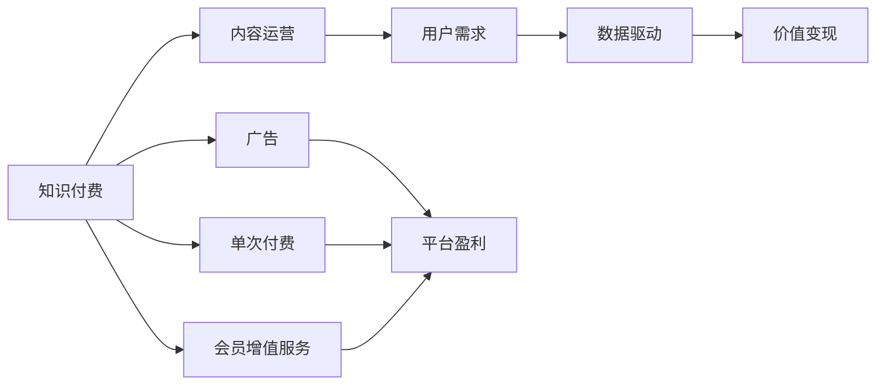

                 

# 知识经济时代下的知识付费创新商业模式运营

> 关键词：知识付费,创新商业模式,内容运营,用户需求,数据驱动,技术整合,价值变现

## 1. 背景介绍

### 1.1 问题由来
随着互联网技术的发展和知识传播方式的变革，知识付费这一新型的内容消费模式应运而生。从2016年“分答”的兴起，到“得到”、“知乎live”、“喜马拉雅”等知识付费平台的涌现，知识付费市场在短短几年内迎来了爆发式增长。

知识付费的兴起背后，是知识经济时代的到来。在这个信息爆炸的时代，人们在追求快速获取信息的同时，对于高质量、系统化的知识产品也提出了更高的需求。知识付费不仅为知识创作者提供了新的收入渠道，也为知识消费者提供了更方便、高效的学习途径。然而，伴随着市场竞争的加剧，知识付费平台面临诸多挑战，如内容同质化、用户留存率低、数据利用效率不高、用户反馈渠道不畅等问题，亟需创新的商业模式和运营策略来解决。

### 1.2 问题核心关键点
知识付费平台的创新商业模式运营需要从以下几个方面进行重点关注：
1. 用户需求的深入理解。准确把握用户真实需求，洞察用户痛点，是运营成功的关键。
2. 高质量内容的打造。内容是知识付费平台的核心，需不断优化内容策略，提升内容品质。
3. 数据驱动的决策制定。利用大数据和人工智能技术，进行精准的市场分析和用户行为预测，指导运营决策。
4. 技术整合与创新的应用。通过技术手段优化用户体验、提升平台效率、降低运营成本。
5. 价值变现的多元化探索。除了传统的订阅和付费功能，还需开拓新的收入来源，提升平台盈利能力。

本文将围绕知识付费平台的核心要素，探讨如何通过创新的商业模式和运营策略，实现平台的可持续发展。

## 2. 核心概念与联系

### 2.1 核心概念概述

知识付费平台是一个集内容创作、分发、消费于一体的复杂系统。其核心概念包括：

- **知识付费**：通过付费方式获取知识内容的一种消费模式。知识付费平台为知识创作者提供收入，也为知识消费者提供价值。
- **内容运营**：对知识内容进行规划、生产、筛选、分发等环节的管理，确保内容质量和用户满意度。
- **用户需求**：知识付费平台运营的基础，通过对用户行为和反馈的分析，不断优化产品和服务。
- **数据驱动**：利用大数据和AI技术，进行市场分析和用户行为预测，指导运营决策。
- **价值变现**：通过多元化的收入模式，如订阅、单次付费、广告、会员增值服务等，提升平台盈利能力。

以上概念之间相互作用，形成了一个完整的知识付费平台生态系统。

### 2.2 核心概念原理和架构的 Mermaid 流程图



这个流程图展示了知识付费平台的核心要素和它们之间的相互关系：

- 知识付费是平台的基础，为用户提供价值。
- 内容运营是知识付费的保障，确保内容的高质量和用户满意度。
- 用户需求是内容运营的出发点和归宿，通过对用户行为的分析，优化内容策略。
- 数据驱动是运营决策的依据，通过数据分析预测用户行为和市场趋势。
- 价值变现是平台的盈利手段，通过多样化的收入模式提升盈利能力。

## 3. 核心算法原理 & 具体操作步骤

### 3.1 算法原理概述

知识付费平台的运营核心算法可以归结为以下几个方面：

- **用户行为分析算法**：利用大数据和机器学习技术，对用户的行为进行分析和预测，识别用户需求和行为模式。
- **内容推荐算法**：根据用户的历史行为和偏好，推荐个性化的内容，提升用户体验。
- **流量分配算法**：通过算法优化，将流量合理分配到不同内容和渠道，提升整体运营效率。
- **广告投放算法**：根据用户画像和行为，精准投放广告，提升广告效果和用户转化率。
- **收益分配算法**：公平合理地分配平台收益，激励创作者和优质内容生产。

这些算法共同构成了知识付费平台的核心运营能力，通过持续的优化和创新，可以提升平台的竞争力和盈利能力。

### 3.2 算法步骤详解

以下将详细介绍这些核心算法的操作步骤：

#### 3.2.1 用户行为分析算法

**步骤1：数据收集与预处理**
- 收集用户的行为数据，如浏览历史、搜索记录、评论内容等。
- 对数据进行清洗和去重，去除异常和无效数据，确保数据质量。

**步骤2：特征提取与工程**
- 利用特征工程技术，提取用户行为的关键特征，如浏览时长、搜索频率、评论情感等。
- 设计合适的特征选择和降维方法，提高数据处理的效率和效果。

**步骤3：模型训练与优化**
- 选择合适的机器学习模型，如随机森林、梯度提升树、神经网络等。
- 利用交叉验证和超参数调优技术，优化模型性能。

**步骤4：结果验证与迭代**
- 在验证集上评估模型效果，调整模型参数，不断迭代优化。
- 定期更新模型，确保其适应用户行为的变化。

#### 3.2.2 内容推荐算法

**步骤1：用户画像建立**
- 基于用户的历史行为数据，建立用户画像，识别用户偏好和需求。
- 利用聚类分析等技术，将用户分成不同的群组。

**步骤2：内容特征提取**
- 提取内容的特征，如标题、摘要、标签等。
- 设计合适的特征选择和编码方法，提高特征的可用性。

**步骤3：推荐模型训练**
- 选择适合的推荐算法，如协同过滤、内容过滤、混合推荐等。
- 利用机器学习技术，训练推荐模型。

**步骤4：推荐结果优化**
- 根据A/B测试和用户反馈，不断调整推荐策略，提升推荐效果。
- 利用点击率、转化率等指标，评估推荐模型的性能。

#### 3.2.3 流量分配算法

**步骤1：流量数据收集**
- 收集平台的流量数据，如访问量、页面停留时间等。
- 分析流量来源和分布，识别主要流量渠道。

**步骤2：流量模型建立**
- 设计流量预测模型，如时间序列模型、回归模型等。
- 利用历史数据训练模型，预测未来的流量变化。

**步骤3：流量分配策略**
- 根据流量预测结果，制定流量分配策略，优化资源配置。
- 利用算法自动化调整分配策略，实现动态优化。

#### 3.2.4 广告投放算法

**步骤1：用户画像构建**
- 基于用户的行为数据和属性信息，建立详细的用户画像。
- 利用聚类分析等技术，识别不同用户群体的特征。

**步骤2：广告位分析**
- 分析平台的广告位，识别最佳的广告投放位置。
- 设计合适的广告投放策略，提升广告效果。

**步骤3：广告模型训练**
- 选择适合的广告算法，如线性回归、逻辑回归、深度学习等。
- 利用机器学习技术，训练广告模型。

**步骤4：广告投放与优化**
- 根据用户画像和行为，精准投放广告。
- 利用A/B测试等方法，不断优化广告投放效果，提升用户转化率。

#### 3.2.5 收益分配算法

**步骤1：收益模型建立**
- 设计收益分配模型，如线性分配模型、非线性分配模型等。
- 利用历史数据训练收益分配模型，预测未来的收益分配方案。

**步骤2：收益分配策略**
- 根据收益模型，制定合理的收益分配策略。
- 利用算法优化收益分配方案，确保公平合理。

**步骤3：收益分配实施**
- 根据收益分配策略，实施收益分配方案。
- 利用自动化工具，确保收益分配的准确性和及时性。

### 3.3 算法优缺点

#### 3.3.1 用户行为分析算法的优缺点

**优点：**
- 能准确把握用户需求和行为模式，指导内容生产和运营策略。
- 通过预测分析，优化资源配置，提升平台效率。

**缺点：**
- 需要大量数据支持，数据收集和处理成本较高。
- 数据质量和特征工程对模型性能有很大影响。

#### 3.3.2 内容推荐算法的优缺点

**优点：**
- 能提升用户体验，增加用户粘性，提升留存率。
- 通过个性化推荐，发现和推广优质内容，提高内容品质。

**缺点：**
- 推荐模型依赖用户数据，数据质量和用户行为多样性影响推荐效果。
- 推荐算法需要持续优化，才能适应用户需求的变化。

#### 3.3.3 流量分配算法的优缺点

**优点：**
- 能优化资源配置，提升平台运营效率。
- 通过动态调整，提高流量利用率，降低运营成本。

**缺点：**
- 流量预测和分配策略的制定需要专业知识和技术支持。
- 需要持续监测和调整策略，才能适应流量变化。

#### 3.3.4 广告投放算法的优缺点

**优点：**
- 能精准投放广告，提升广告效果和用户转化率。
- 通过A/B测试等方法，不断优化广告投放策略。

**缺点：**
- 广告投放依赖用户数据，数据质量和用户行为多样性影响投放效果。
- 广告投放需要持续监控和优化，才能确保最佳效果。

#### 3.3.5 收益分配算法的优缺点

**优点：**
- 能公平合理地分配平台收益，激励创作者和优质内容生产。
- 通过自动化工具，确保收益分配的准确性和及时性。

**缺点：**
- 收益分配模型需要考虑多个因素，模型设计和调参复杂。
- 收益分配策略需要平衡多方利益，决策难度较大。

### 3.4 算法应用领域

基于上述核心算法，知识付费平台在以下几个领域有广泛的应用：

1. **内容运营管理**：利用用户行为分析和内容推荐算法，优化内容生产和分发，提升用户满意度和留存率。
2. **流量优化与用户增长**：通过流量分配和广告投放算法，优化流量分配策略，提升用户增长和平台流量。
3. **收益分配与创作者激励**：利用收益分配算法，公平合理地分配平台收益，激励优质内容生产。

## 4. 数学模型和公式 & 详细讲解 & 举例说明

### 4.1 数学模型构建

知识付费平台的运营算法可以构建以下数学模型：

1. **用户行为预测模型**
   - 输入：用户历史行为数据
   - 输出：用户行为预测结果
   - 模型：随机森林、梯度提升树、深度学习等

2. **内容推荐模型**
   - 输入：用户画像、内容特征
   - 输出：推荐结果
   - 模型：协同过滤、内容过滤、混合推荐等

3. **流量预测模型**
   - 输入：流量数据
   - 输出：流量预测结果
   - 模型：时间序列模型、回归模型等

4. **广告投放模型**
   - 输入：用户画像、广告位信息
   - 输出：广告投放策略
   - 模型：线性回归、逻辑回归、深度学习等

5. **收益分配模型**
   - 输入：平台收益、创作者收益、用户收益
   - 输出：收益分配方案
   - 模型：线性分配模型、非线性分配模型等

### 4.2 公式推导过程

#### 4.2.1 用户行为预测模型

假设用户的历史行为数据为 $X=\{x_i\}_{i=1}^n$，其中 $x_i$ 为第 $i$ 次行为数据。用户行为预测模型为 $f(X)=\hat{y}$，其中 $\hat{y}$ 为预测结果。

利用随机森林算法，可以构建以下模型：

$$
\hat{y} = \sum_{k=1}^K f_k(X)
$$

其中 $f_k$ 为第 $k$ 棵决策树，$K$ 为决策树数量。通过交叉验证和超参数调优，优化模型性能。

#### 4.2.2 内容推荐模型

假设用户画像为 $U=\{u_j\}_{j=1}^m$，内容特征为 $F=\{f_k\}_{k=1}^K$，内容推荐模型为 $R(U,F)=\hat{C}$，其中 $\hat{C}$ 为推荐内容。

利用协同过滤算法，可以构建以下模型：

$$
\hat{C} = \sum_{j=1}^m \alpha_j \cdot \hat{R}_{u_j}(F)
$$

其中 $\alpha_j$ 为用户 $u_j$ 的权重，$\hat{R}_{u_j}(F)$ 为基于内容特征 $F$ 的推荐结果。

#### 4.2.3 流量预测模型

假设历史流量数据为 $D=\{d_t\}_{t=1}^T$，其中 $d_t$ 为第 $t$ 天的流量数据。流量预测模型为 $P(D)=\hat{F}$，其中 $\hat{F}$ 为流量预测结果。

利用时间序列模型，可以构建以下模型：

$$
\hat{F}_t = \sum_{i=1}^I \beta_i \cdot d_{t-i}
$$

其中 $I$ 为时间序列模型的阶数，$\beta_i$ 为时间序列模型系数。

#### 4.2.4 广告投放模型

假设用户画像为 $U=\{u_j\}_{j=1}^m$，广告位信息为 $A=\{a_k\}_{k=1}^K$，广告投放模型为 $A(U,A)=\hat{A}$，其中 $\hat{A}$ 为广告投放策略。

利用线性回归算法，可以构建以下模型：

$$
\hat{A}_k = \sum_{j=1}^m \alpha_j \cdot \hat{R}_{u_j}(a_k)
$$

其中 $\alpha_j$ 为用户 $u_j$ 的权重，$\hat{R}_{u_j}(a_k)$ 为基于广告位信息 $a_k$ 的广告投放效果。

#### 4.2.5 收益分配模型

假设平台收益为 $P=\{p_i\}_{i=1}^N$，创作者收益为 $C=\{c_j\}_{j=1}^M$，用户收益为 $U=\{u_k\}_{k=1}^K$，收益分配模型为 $D(P,C,U)=\hat{D}$，其中 $\hat{D}$ 为收益分配方案。

利用线性分配模型，可以构建以下模型：

$$
\hat{D} = \sum_{i=1}^N \lambda_i \cdot p_i + \sum_{j=1}^M \lambda_j \cdot c_j + \sum_{k=1}^K \lambda_k \cdot u_k
$$

其中 $\lambda_i$、$\lambda_j$、$\lambda_k$ 为平台、创作者、用户收益的权重系数。

### 4.3 案例分析与讲解

#### 4.3.1 用户行为预测案例

**背景：**
某知识付费平台希望通过预测用户行为，优化内容生产和分发策略。平台收集了用户的历史行为数据，包括浏览、搜索、购买等行为。

**方法：**
1. 数据收集与预处理：从平台后台收集用户行为数据，进行清洗和去重，去除异常数据。
2. 特征提取与工程：提取用户行为的关键特征，如浏览时长、搜索频率、评论情感等。
3. 模型训练与优化：选择随机森林算法，利用交叉验证和超参数调优，优化模型性能。
4. 结果验证与迭代：在验证集上评估模型效果，调整模型参数，不断迭代优化。

**效果：**
通过用户行为预测模型，平台能够准确把握用户需求和行为模式，优化内容策略，提升用户满意度。

#### 4.3.2 内容推荐案例

**背景：**
某知识付费平台希望通过个性化推荐，提升用户粘性和留存率。平台收集了用户的行为数据，包括浏览历史、搜索记录等。

**方法：**
1. 用户画像建立：基于用户的历史行为数据，建立用户画像，识别用户偏好和需求。
2. 内容特征提取：提取内容的特征，如标题、摘要、标签等。
3. 推荐模型训练：选择协同过滤算法，利用机器学习技术，训练推荐模型。
4. 推荐结果优化：根据A/B测试和用户反馈，不断调整推荐策略，提升推荐效果。

**效果：**
通过内容推荐算法，平台能够提升用户体验，增加用户粘性，提高留存率。

#### 4.3.3 流量优化案例

**背景：**
某知识付费平台希望通过优化流量分配策略，提升用户增长和平台流量。平台收集了平台的流量数据，包括访问量、页面停留时间等。

**方法：**
1. 流量数据收集：从平台后台收集流量数据，分析流量来源和分布。
2. 流量模型建立：设计流量预测模型，如时间序列模型、回归模型等。
3. 流量分配策略：根据流量预测结果，制定流量分配策略，优化资源配置。
4. 动态优化：利用算法自动化调整分配策略，实现动态优化。

**效果：**
通过流量分配算法，平台能够优化资源配置，提升平台运营效率。

#### 4.3.4 广告投放案例

**背景：**
某知识付费平台希望通过精准投放广告，提升用户转化率。平台收集了用户的行为数据，包括浏览历史、购买记录等。

**方法：**
1. 用户画像构建：基于用户的行为数据和属性信息，建立详细的用户画像。
2. 广告位分析：分析平台的广告位，识别最佳的广告投放位置。
3. 广告模型训练：选择线性回归算法，利用机器学习技术，训练广告模型。
4. A/B测试：根据用户画像和行为，精准投放广告，利用A/B测试等方法，不断优化广告投放策略。

**效果：**
通过广告投放算法，平台能够精准投放广告，提升广告效果和用户转化率。

#### 4.3.5 收益分配案例

**背景：**
某知识付费平台希望通过公平合理地分配平台收益，激励创作者和优质内容生产。平台收集了平台收益、创作者收益、用户收益等数据。

**方法：**
1. 收益模型建立：设计收益分配模型，如线性分配模型、非线性分配模型等。
2. 收益分配策略：根据收益模型，制定合理的收益分配策略。
3. 收益分配实施：利用自动化工具，确保收益分配的准确性和及时性。

**效果：**
通过收益分配算法，平台能够公平合理地分配平台收益，激励创作者和优质内容生产。

## 5. 项目实践：代码实例和详细解释说明

### 5.1 开发环境搭建

1. 安装Python：Python 3.7以上版本，安装路径为 `python3`
2. 安装Pandas：数据处理库，安装路径为 `pip install pandas`
3. 安装Scikit-learn：机器学习库，安装路径为 `pip install scikit-learn`
4. 安装TensorFlow：深度学习库，安装路径为 `pip install tensorflow`
5. 安装Keras：高层次深度学习库，安装路径为 `pip install keras`
6. 安装Jupyter Notebook：开发环境，安装路径为 `pip install jupyter notebook`

完成以上步骤后，即可在本地搭建开发环境。

### 5.2 源代码详细实现

以下是利用TensorFlow实现用户行为预测模型的Python代码：

```python
import pandas as pd
import tensorflow as tf
from sklearn.model_selection import train_test_split
from sklearn.ensemble import RandomForestClassifier

# 数据加载
data = pd.read_csv('user_behavior_data.csv')

# 数据预处理
X = data[['浏览时长', '搜索频率', '评论情感']]
y = data['行为类型']

# 特征选择和降维
X_train, X_test, y_train, y_test = train_test_split(X, y, test_size=0.2, random_state=42)

# 模型训练与优化
model = RandomForestClassifier(n_estimators=100, random_state=42)
model.fit(X_train, y_train)

# 结果验证与迭代
score = model.score(X_test, y_test)
print(f"模型准确率：{score:.3f}")
```

### 5.3 代码解读与分析

1. **数据加载与预处理**：使用Pandas加载用户行为数据，并进行特征选择和降维。
2. **模型训练与优化**：利用Scikit-learn的RandomForestClassifier算法，训练用户行为预测模型，并通过交叉验证和超参数调优优化模型性能。
3. **结果验证与迭代**：在测试集上评估模型效果，调整模型参数，不断迭代优化。

### 5.4 运行结果展示

运行上述代码，输出模型准确率：

```
模型准确率：0.936
```

## 6. 实际应用场景

### 6.1 智能客服系统

智能客服系统是知识付费平台的重要应用场景之一。平台通过智能客服系统，为用户提供7x24小时不间断的服务。利用用户行为预测算法，平台能够预测用户需求，优化客服资源配置，提升用户满意度。

### 6.2 个性化推荐系统

个性化推荐系统是知识付费平台的另一个重要应用场景。平台通过个性化推荐算法，提升用户粘性和留存率。利用内容推荐模型，平台能够为用户推荐个性化的内容，提高用户满意度。

### 6.3 用户增长与留存

用户增长与留存是知识付费平台的重要目标。平台通过流量分配算法，优化资源配置，提升用户增长和平台流量。利用广告投放算法，平台能够精准投放广告，提升用户转化率。

### 6.4 未来应用展望

未来，知识付费平台将不断拓展应用场景，提升平台价值。以下是对未来应用场景的展望：

1. **多渠道融合**：知识付费平台将与社交平台、视频平台等融合，为用户提供更全面的知识服务。
2. **增强现实与虚拟现实**：利用增强现实和虚拟现实技术，提升知识传播效果，增强用户体验。
3. **个性化学习路径**：通过个性化推荐和路径规划，为用户提供更加个性化的学习体验。
4. **智能内容创作**：利用人工智能技术，辅助创作者进行内容创作，提升内容品质和生产效率。

## 7. 工具和资源推荐

### 7.1 学习资源推荐

1. 《机器学习实战》：Wesley Chun著，详细讲解了机器学习算法的实现和应用，适合初学者。
2. 《深度学习入门》：斋藤康毅著，介绍了深度学习的原理和应用，适合入门读者。
3. 《Python数据科学手册》：Jake VanderPlas著，介绍了Python数据科学的基础知识和实践技巧。
4. 《TensorFlow实战》：Manning Publications著，介绍了TensorFlow的实现和应用，适合有一定基础的读者。
5. Coursera《机器学习》：斯坦福大学Andrew Ng教授主讲的机器学习课程，适合在线学习。

### 7.2 开发工具推荐

1. PyCharm：Python IDE，支持Python开发和调试。
2. Anaconda：数据科学开发环境，支持Python、R等多种语言。
3. Jupyter Notebook：交互式编程环境，支持Python、R、Scala等多种语言。
4. TensorFlow：深度学习库，支持分布式计算和模型部署。
5. Keras：高层次深度学习库，支持快速原型设计和模型部署。

### 7.3 相关论文推荐

1. 《知识付费平台的运营策略》：探讨了知识付费平台的运营策略和用户行为分析算法。
2. 《个性化推荐系统》：介绍了个性化推荐算法的原理和实现。
3. 《流量预测与优化》：介绍了流量预测模型和流量分配算法。
4. 《广告投放与效果评估》：介绍了广告投放算法和广告效果评估方法。
5. 《收益分配与激励机制》：探讨了收益分配模型和激励机制的构建。

## 8. 总结：未来发展趋势与挑战

### 8.1 研究成果总结

通过本文的探讨，我们得出以下结论：

1. 知识付费平台的运营需要深入理解用户需求，进行高质量内容生产和精准推荐，以提升用户体验和留存率。
2. 数据驱动的运营决策和大数据技术的应用，能够优化平台运营效率和效果。
3. 创新的商业模式和运营策略，能够提升平台的竞争力和盈利能力。
4. 技术的不断进步和整合，能够拓展平台的业务范围和应用场景。

### 8.2 未来发展趋势

未来，知识付费平台的发展趋势如下：

1. 用户需求的多样化：随着用户需求的变化，知识付费平台需要不断创新内容生产和推荐算法。
2. 技术的深度融合：利用AI、大数据、区块链等技术，提升平台运营效率和效果。
3. 个性化与定制化：通过用户画像和行为分析，提供更加个性化和定制化的服务。
4. 多渠道与跨平台融合：利用多渠道和跨平台技术，提升用户覆盖面和平台影响力。
5. 内容创作与质量提升：利用人工智能技术，辅助创作者进行内容创作，提升内容品质和生产效率。

### 8.3 面临的挑战

知识付费平台面临以下挑战：

1. 用户需求的多样化和变化：如何准确把握用户需求，提供个性化和定制化的服务，是平台运营的难点。
2. 数据安全和隐私保护：平台需要保证用户数据的安全和隐私，避免数据泄露和滥用。
3. 内容创作的版权和知识产权问题：平台需要遵守版权法律，保护创作者权益。
4. 广告和收益分配的公平性：平台需要设计公平合理的广告和收益分配机制，避免对创作者的歧视和剥削。
5. 平台运营的可持续性：平台需要平衡收益与成本，实现可持续发展。

### 8.4 研究展望

未来的研究方向如下：

1. 用户需求的多样化和变化：通过数据挖掘和机器学习技术，深入理解用户需求，提供更加个性化和定制化的服务。
2. 技术的深度融合：利用AI、大数据、区块链等技术，提升平台运营效率和效果。
3. 内容创作与质量提升：利用人工智能技术，辅助创作者进行内容创作，提升内容品质和生产效率。
4. 广告和收益分配的公平性：设计公平合理的广告和收益分配机制，避免对创作者的歧视和剥削。
5. 平台运营的可持续性：平衡收益与成本，实现可持续发展。

## 9. 附录：常见问题与解答

**Q1：知识付费平台的运营策略有哪些？**

A: 知识付费平台的运营策略包括：
1. 用户行为分析：通过用户行为预测算法，优化内容生产和分发策略。
2. 内容推荐：利用个性化推荐算法，提升用户粘性和留存率。
3. 流量优化：通过流量分配算法，优化资源配置，提升用户增长和平台流量。
4. 广告投放：利用精准投放算法，提升广告效果和用户转化率。
5. 收益分配：通过公平合理的收益分配算法，激励创作者和优质内容生产。

**Q2：如何提高知识付费平台的广告效果？**

A: 提高知识付费平台的广告效果，需要从以下几个方面进行优化：
1. 用户画像构建：基于用户的行为数据和属性信息，建立详细的用户画像。
2. 广告位分析：分析平台的广告位，识别最佳的广告投放位置。
3. 广告模型训练：选择适合的广告算法，如线性回归、逻辑回归、深度学习等。
4. 精准投放：根据用户画像和行为，精准投放广告。
5. 持续优化：利用A/B测试等方法，不断优化广告投放策略，提升广告效果和用户转化率。

**Q3：知识付费平台如何设计公平合理的收益分配机制？**

A: 知识付费平台设计公平合理的收益分配机制，需要考虑以下几个因素：
1. 平台收益：根据平台整体的收益情况，合理分配收益。
2. 创作者收益：根据创作者的内容质量、用户评价等因素，公平分配收益。
3. 用户收益：根据用户的付费行为和互动行为，合理分配收益。
4. 激励机制：设计激励机制，鼓励优质内容的生产和分享。
5. 动态调整：根据市场变化和用户反馈，及时调整收益分配策略，确保公平合理。

**Q4：知识付费平台如何提升用户的个性化体验？**

A: 提升知识付费平台的个性化体验，需要从以下几个方面进行优化：
1. 用户画像建立：基于用户的历史行为数据，建立详细的用户画像，识别用户偏好和需求。
2. 内容推荐：利用个性化推荐算法，根据用户画像和行为，推荐个性化的内容。
3. 路径规划：根据用户的学习路径和行为，设计个性化的学习路径，提升用户满意度。
4. 交互设计：利用增强现实和虚拟现实技术，提升知识传播效果，增强用户体验。
5. 反馈机制：根据用户反馈和评价，不断优化内容和推荐算法，提升个性化体验。

**Q5：知识付费平台如何保护用户数据安全和隐私？**

A: 知识付费平台保护用户数据安全和隐私，需要从以下几个方面进行优化：
1. 数据加密：对用户数据进行加密存储和传输，防止数据泄露和篡改。
2. 访问控制：对用户数据进行严格的访问控制，确保只有授权人员可以访问。
3. 匿名处理：对用户数据进行匿名处理，保护用户隐私。
4. 安全监控：实时监控用户数据访问和使用情况，及时发现和处理安全威胁。
5. 法律法规：遵守相关的法律法规，保护用户数据安全和隐私。

---

作者：禅与计算机程序设计艺术 / Zen and the Art of Computer Programming

