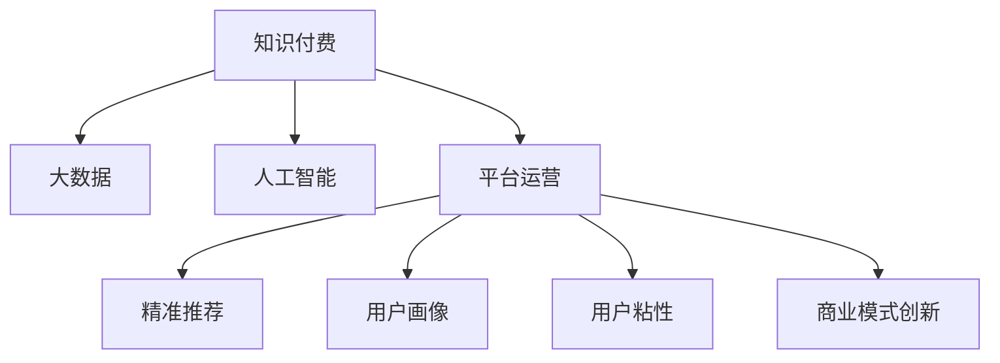

                 

# 知识经济时代下的知识付费创新商业模式运营

> 关键词：知识付费, 大数据, 人工智能, 平台运营, 精准推荐, 用户画像, 用户粘性, 商业模式创新

## 1. 背景介绍

### 1.1 问题由来
在知识经济时代，信息爆炸与知识短缺并存，如何高效获取和应用知识成为企业和社会的重要课题。传统的线下知识传播方式面临着时间和空间限制，难以满足人们对知识的即时性、个性化和可访问性需求。而知识付费作为新兴的互联网商业模式，通过在线化、互动化、个性化的知识服务，有效地解决了这一问题。然而，随着知识付费市场的发展，平台面临用户流失、内容同质化、盈利模式单一等诸多挑战。如何在知识经济时代下，创新知识付费商业模式，提升平台运营效率和用户体验，成为亟待解决的问题。

### 1.2 问题核心关键点
知识付费平台的创新运营，核心在于如何通过技术手段，实现对知识内容的精准推荐、用户行为数据的深度挖掘和用户粘性的有效提升。这一过程中，大数据、人工智能、平台运营等技术的应用尤为关键。本文将系统介绍知识付费平台的运营原理，并从技术、市场和政策多个维度，探讨其未来的发展方向。

## 2. 核心概念与联系

### 2.1 核心概念概述

为更好地理解知识付费平台的运营，本节将介绍几个密切相关的核心概念：

- 知识付费(Information Economy)：基于互联网，用户为获取特定知识或信息而支付费用的商业模式。包括在线课程、电子书、在线咨询等多种形式。
- 大数据(Big Data)：海量规模的数据集，通过先进的数据分析技术，挖掘出有价值的商业洞见，应用于市场、运营和用户体验提升。
- 人工智能(AI)：通过机器学习、深度学习等技术，使机器具备类似人类的智能能力，如语音识别、图像处理、自然语言处理等。
- 平台运营(Partition Operation)：对知识付费平台的用户、内容和流量进行科学管理和精准运营，提升用户满意度和平台盈利能力。
- 精准推荐(Precision Recommendation)：利用用户行为数据和机器学习技术，向用户推荐最相关的知识产品，提高转化率和用户粘性。
- 用户画像(User Persona)：通过数据分析和机器学习技术，构建用户行为、兴趣和需求的精细化模型，实现个性化服务。
- 用户粘性(User Stickiness)：用户对知识付费平台的持续使用和忠诚度，反映平台的服务质量和用户满意度。
- 商业模式创新(Business Model Innovation)：在知识付费平台运营中，探索新的盈利模式和服务形式，如知识众筹、内容付费订阅等。

这些核心概念之间的逻辑关系可以通过以下Mermaid流程图来展示：



这个流程图展示了这个概念体系的核心逻辑关系：

1. 知识付费是商业模式的总体形态，通过大数据和人工智能等技术手段进行平台运营。
2. 平台运营涵盖了精准推荐、用户画像、用户粘性等多个方面，提升用户体验和平台价值。
3. 精准推荐和大数据分析紧密相关，通过用户行为数据驱动个性化服务。
4. 用户画像和用户粘性是平台运营的重要基础，构建精细化的用户画像，才能实现精准推荐和提升用户粘性。
5. 商业模式创新为知识付费平台提供新的盈利模式，促进其可持续发展。

## 3. 核心算法原理 & 具体操作步骤
### 3.1 算法原理概述

知识付费平台的精准推荐和大数据分析过程，本质上是一个机器学习过程。其核心思想是：通过用户的搜索行为、浏览记录、支付历史等数据，构建用户画像，利用算法模型进行推荐，从而提高用户的转化率和满意度。

形式化地，假设知识付费平台有 $N$ 个用户，每个用户有 $M$ 个行为记录，每个行为记录包含 $K$ 个特征 $x_i$，用户的目标行为为 $y_i$。大数据平台通过数据预处理和特征工程，得到训练集 $\{(x_i,y_i)\}_{i=1}^N$，在此基础上应用监督学习算法 $M$，得到推荐模型 $f$。推荐模型根据用户的行为数据，预测用户对每个知识产品的兴趣评分，推荐得分最高的知识产品。

### 3.2 算法步骤详解

基于知识付费平台的大数据分析和推荐系统，一般包括以下几个关键步骤：

**Step 1: 数据采集与预处理**
- 收集用户的历史行为数据，包括浏览、搜索、购买记录等。
- 对数据进行去重、清洗、归一化等预处理，保证数据质量和一致性。

**Step 2: 特征工程**
- 提取用户的特征，包括行为特征（如浏览时间、点击次数）、用户特征（如年龄、地域）和知识产品特征（如课程难度、价格）。
- 使用独热编码、归一化、因子分解等技术，构建特征向量。

**Step 3: 模型训练**
- 选择合适的机器学习模型，如协同过滤、基于内容的推荐、深度学习等。
- 在训练集上训练模型，调整超参数，最小化预测误差。
- 使用交叉验证等技术，验证模型泛化能力。

**Step 4: 推荐计算**
- 根据用户的行为数据，通过推荐模型计算用户对每个知识产品的兴趣评分。
- 根据评分排序，选择前 $K$ 个产品进行推荐。
- 实时更新用户画像和模型，保证推荐结果的准确性。

**Step 5: 效果评估与优化**
- 在验证集和测试集上评估推荐效果，如精确率、召回率、点击率等指标。
- 根据评估结果，调整模型和特征，优化推荐算法。

### 3.3 算法优缺点

基于知识付费平台的大数据分析和推荐系统，具有以下优点：
1. 个性化推荐：根据用户行为数据，提供个性化内容推荐，提升用户体验。
2. 精准营销：通过用户画像，实现精准用户定位和定向广告，提高营销效果。
3. 用户粘性提升：推荐引擎不断优化，吸引用户持续使用平台。
4. 数据驱动决策：大数据分析帮助平台优化运营策略，提升盈利能力。

同时，该方法也存在一定的局限性：
1. 数据隐私：大量用户行为数据涉及隐私，需采取严格的数据保护措施。
2. 模型偏差：推荐模型可能存在算法偏见，需注意平衡公平性和个性化。
3. 冷启动问题：新用户缺乏历史行为数据，导致推荐效果不佳。
4. 计算资源消耗：大规模数据处理和模型训练需要高性能计算资源。

尽管存在这些局限性，但就目前而言，基于大数据和人工智能的推荐系统是知识付费平台的重要支柱，能够显著提升用户满意度和服务质量。

### 3.4 算法应用领域

大数据和人工智能在知识付费平台中的应用，不仅限于推荐系统，还广泛渗透到平台的各个环节。以下是几个主要应用领域：

- **个性化推荐系统**：根据用户行为数据，提供个性化内容推荐，提升用户体验。
- **精准营销**：通过用户画像，实现精准用户定位和定向广告，提高营销效果。
- **用户行为分析**：利用数据分析技术，监控用户行为变化，优化平台运营策略。
- **内容生成**：使用自然语言处理技术，自动生成高质量的课程大纲、广告文案等。
- **风险控制**：通过机器学习模型，识别和防范欺诈行为，保护平台利益。

## 4. 数学模型和公式 & 详细讲解  
### 4.1 数学模型构建

本节将使用数学语言对知识付费平台的推荐系统进行更加严格的刻画。

记用户行为数据为 $D=\{(x_i,y_i)\}_{i=1}^N, x_i \in \mathcal{X}, y_i \in \{0,1\}$，其中 $x_i$ 为用户的第 $i$ 次行为数据，$y_i$ 为用户的最终行为。

假设推荐模型为 $f: \mathcal{X} \rightarrow [0,1]$，将用户行为映射到区间 $[0,1]$ 的兴趣评分上。推荐目标为最大化预测精度和用户满意度。

定义推荐模型的平均损失函数为：

$$
\mathcal{L}(f)=\frac{1}{N} \sum_{i=1}^N \ell(f(x_i),y_i)
$$

其中 $\ell$ 为预测误差函数，如均方误差（MSE）、交叉熵（CE）等。

## 5. 项目实践：代码实例和详细解释说明
### 5.1 开发环境搭建

在进行知识付费平台推荐系统开发前，我们需要准备好开发环境。以下是使用Python进行PyTorch开发的环境配置流程：

1. 安装Anaconda：从官网下载并安装Anaconda，用于创建独立的Python环境。

2. 创建并激活虚拟环境：
```bash
conda create -n pytorch-env python=3.8 
conda activate pytorch-env
```

3. 安装PyTorch：根据CUDA版本，从官网获取对应的安装命令。例如：
```bash
conda install pytorch torchvision torchaudio cudatoolkit=11.1 -c pytorch -c conda-forge
```

4. 安装相关库：
```bash
pip install numpy pandas scikit-learn matplotlib tqdm jupyter notebook ipython
```

完成上述步骤后，即可在`pytorch-env`环境中开始推荐系统开发。

### 5.2 源代码详细实现

这里我们以协同过滤推荐系统为例，给出使用PyTorch进行知识付费平台推荐系统的代码实现。

首先，定义推荐系统的基本类：

```python
import torch
from torch import nn
from torch.nn import functional as F

class CollaborativeFiltering(nn.Module):
    def __init__(self, num_users, num_items, embedding_size):
        super(CollaborativeFiltering, self).__init__()
        self.user_embedding = nn.Embedding(num_users, embedding_size)
        self.item_embedding = nn.Embedding(num_items, embedding_size)
        self.dot_product = nn.Linear(embedding_size, 1)
    
    def forward(self, user, item):
        user_embed = self.user_embedding(user)
        item_embed = self.item_embedding(item)
        scores = self.dot_product((user_embed * item_embed).sum(1))
        return F.sigmoid(scores)
```

然后，定义推荐系统的数据处理函数：

```python
from torch.utils.data import Dataset
import numpy as np

class DataLoaderDataset(Dataset):
    def __init__(self, users, items, ratings):
        self.users = users
        self.items = items
        self.ratings = ratings
        
    def __len__(self):
        return len(self.users)
    
    def __getitem__(self, item):
        user = self.users[item]
        item = self.items[item]
        rating = self.ratings[item]
        return {'user': user, 'item': item, 'rating': rating}

# 生成训练集
np.random.seed(1)
num_users = 1000
num_items = 1000
embedding_size = 100
train_data = np.random.randn(num_users, num_items)
train_dataset = DataLoaderDataset(np.arange(num_users), np.arange(num_items), train_data)

# 定义模型和优化器
model = CollaborativeFiltering(num_users, num_items, embedding_size)
optimizer = torch.optim.Adam(model.parameters(), lr=0.001)
loss_fn = nn.BCEWithLogitsLoss()

# 训练推荐模型
num_epochs = 10
for epoch in range(num_epochs):
    for user, item, rating in train_dataset:
        model.train()
        preds = model(user, item)
        loss = loss_fn(preds, rating)
        optimizer.zero_grad()
        loss.backward()
        optimizer.step()
        print(f'Epoch {epoch+1}, loss: {loss.item()}')

print(f'Epoch {epoch+1}, prediction: {model(torch.tensor([0]))}')
```

以上代码实现了一个基本的协同过滤推荐系统。在实际应用中，推荐系统需要处理更加复杂的数据，并集成到知识付费平台的后端服务中。

### 5.3 代码解读与分析

让我们再详细解读一下关键代码的实现细节：

**CollaborativeFiltering类**：
- `__init__`方法：初始化用户、物品、评分等关键组件，定义线性层的输入和输出维度。
- `forward`方法：前向传播计算用户和物品嵌入的加权和，并使用线性层和sigmoid函数计算推荐评分。

**DataLoaderDataset类**：
- `__init__`方法：初始化训练集的输入和输出数据。
- `__len__`方法：返回数据集的样本数量。
- `__getitem__`方法：返回单个样本的特征和标签，方便模型训练。

**推荐模型训练**：
- 在训练循环中，每个epoch内对每个样本进行前向传播和反向传播，最小化损失函数。
- 使用Adam优化器更新模型参数，并在每个epoch输出损失函数值。
- 在训练结束后，展示模型对新样本的推荐预测。

可以看到，PyTorch框架使得推荐系统的开发变得简洁高效。开发者可以将更多精力放在数据处理、模型改进等高层逻辑上，而不必过多关注底层的实现细节。

当然，工业级的系统实现还需考虑更多因素，如模型的保存和部署、超参数的自动搜索、更灵活的任务适配层等。但核心的推荐范式基本与此类似。

## 6. 实际应用场景
### 6.1 智能推荐系统

智能推荐系统是知识付费平台的核心功能，通过精准推荐个性化内容，提升用户体验。平台利用大数据和机器学习技术，实时分析用户行为数据，构建用户画像，利用协同过滤、内容推荐等算法，实现精准推荐。

在技术实现上，可以收集用户浏览、搜索、购买等行为数据，提取和用户交互的知识点信息。将知识点的描述和标签作为模型输入，通过协同过滤、矩阵分解等技术，构建用户对知识点的兴趣评分。在生成推荐列表时，将推荐得分最高的知识产品推荐给用户，同时根据用户反馈不断优化推荐算法，提升推荐效果。

### 6.2 精准广告投放

精准广告投放是知识付费平台的另一个重要功能。平台通过数据分析，了解用户的兴趣和行为特征，向其推送相关广告。通过精准的广告投放，不仅能提升平台的收入，还能增加用户粘性，提升平台的品牌认知度。

在技术实现上，可以构建用户画像，包括年龄、地域、职业等基本信息，以及行为数据如浏览次数、购买金额等。通过精准广告投放平台，将广告内容和投放策略与用户画像进行匹配，实现定向广告的投放。同时，平台应实时监控广告效果，通过A/B测试等手段，不断优化广告内容，提升广告投放的转化率。

### 6.3 用户行为分析

用户行为分析是平台运营的重要环节，通过分析用户的行为数据，平台可以优化内容推荐、调整产品策略，提升用户体验。通过数据分析技术，平台可以实时监控用户的行为变化，识别用户流失的原因，及时采取措施，提升用户的满意度和留存率。

在技术实现上，可以构建用户行为模型，包括用户的浏览历史、搜索记录、点击行为等。通过数据分析，平台可以发现用户流失的原因，如内容匹配度低、推荐准确率不足等，及时调整推荐算法，优化内容生态。同时，平台应不断更新数据模型，保持用户画像的实时性，提升用户行为分析的准确性。

### 6.4 未来应用展望

随着大数据和人工智能技术的不断进步，知识付费平台的推荐系统将呈现以下几个发展趋势：

1. 个性化推荐系统的进一步优化：通过深度学习、强化学习等技术，实现更加精准的推荐，提升用户满意度和留存率。
2. 用户画像的精细化构建：通过多模态数据融合，构建更全面、准确的用户画像，实现更加个性化的服务。
3. 推荐系统的跨平台优化：通过联邦学习等技术，实现多平台数据融合，提升推荐的普适性和覆盖面。
4. 实时化推荐引擎的构建：通过流式计算技术，实现实时数据处理和推荐，提升推荐的时效性和准确性。
5. 推荐系统的伦理与安全：通过用户隐私保护、算法透明化等措施，提升推荐系统的公平性和安全性，保障用户权益。

以上趋势凸显了知识付费平台推荐系统的发展潜力，为提升平台的运营效率和用户体验提供了新的方向。

## 7. 工具和资源推荐
### 7.1 学习资源推荐

为了帮助开发者系统掌握知识付费平台的推荐系统原理和实践技巧，这里推荐一些优质的学习资源：

1. 《推荐系统实战》系列书籍：全面介绍了推荐系统的工作原理和应用场景，结合实际案例，深入浅出地讲解了推荐系统的设计思想和实现技巧。
2. 《深度学习与推荐系统》课程：清华大学开设的推荐系统在线课程，涵盖了推荐系统的前沿技术和经典算法，适合初学者入门。
3. 《推荐系统基础》论文：介绍推荐系统的主要算法和优化策略，如协同过滤、矩阵分解、深度学习等，是推荐系统学习的经典教材。
4. Weights & Biases：推荐系统实验跟踪工具，可以记录和可视化模型训练过程中的各项指标，方便对比和调优。
5. TensorBoard：TensorFlow配套的可视化工具，可实时监测模型训练状态，并提供丰富的图表呈现方式，是调试推荐模型的得力助手。

通过对这些资源的学习实践，相信你一定能够快速掌握知识付费平台的推荐系统原理，并用于解决实际的推荐问题。

### 7.2 开发工具推荐

高效的开发离不开优秀的工具支持。以下是几款用于知识付费平台推荐系统开发的常用工具：

1. PyTorch：基于Python的开源深度学习框架，灵活动态的计算图，适合快速迭代研究。大部分推荐系统都有PyTorch版本的实现。
2. TensorFlow：由Google主导开发的开源深度学习框架，生产部署方便，适合大规模工程应用。推荐系统同样有丰富的推荐模型资源。
3. Transformers库：HuggingFace开发的NLP工具库，集成了众多SOTA推荐模型，支持PyTorch和TensorFlow，是推荐系统开发的利器。
4. Weights & Biases：推荐系统实验跟踪工具，可以记录和可视化模型训练过程中的各项指标，方便对比和调优。
5. TensorBoard：TensorFlow配套的可视化工具，可实时监测模型训练状态，并提供丰富的图表呈现方式，是调试推荐模型的得力助手。
6. Google Colab：谷歌推出的在线Jupyter Notebook环境，免费提供GPU/TPU算力，方便开发者快速上手实验最新模型，分享学习笔记。

合理利用这些工具，可以显著提升推荐系统的开发效率，加快创新迭代的步伐。

### 7.3 相关论文推荐

知识付费平台推荐系统的发展源于学界的持续研究。以下是几篇奠基性的相关论文，推荐阅读：

1. Personalized Top-N Recommendation with Hidden Multi-Aspect Modes（PMF）：提出隐式多模特征模型，提升推荐系统的泛化能力和个性化。
2. Item-Response Theory-based Recommender System（BPR）：引入隐式反馈模型，通过响应理论计算用户对物品的兴趣评分。
3. Collaborative Filtering with Regularized Matrix Factorization（Matrix Factorization）：提出矩阵分解算法，通过矩阵分解技术实现协同过滤。
4. Item-based Collaborative Filtering for Recommendation in Big Data（ALS）：提出基于项的协同过滤算法，适用于大规模推荐系统。
5. Deep Recommendation Models（DNN）：引入深度神经网络，提升推荐系统的精度和可解释性。

这些论文代表了大规模推荐系统的研究脉络。通过学习这些前沿成果，可以帮助研究者把握学科前进方向，激发更多的创新灵感。

## 8. 总结：未来发展趋势与挑战
### 8.1 总结

本文对知识付费平台的推荐系统进行了全面系统的介绍。首先阐述了推荐系统在知识付费平台中的重要性和应用场景，明确了推荐系统在提升用户体验、优化运营策略、增加平台收入等方面的核心价值。其次，从原理到实践，详细讲解了推荐系统的数学模型和关键步骤，给出了推荐系统开发的具体代码实现。同时，本文还广泛探讨了推荐系统在智能推荐、精准广告投放、用户行为分析等多个场景下的应用前景，展示了推荐系统的大数据价值。

通过本文的系统梳理，可以看到，推荐系统作为知识付费平台的核心功能，通过大数据和人工智能等技术手段，实现了对用户行为的深度挖掘和个性化服务，为平台运营提供了强大的技术支撑。未来，伴随大数据和人工智能技术的持续演进，推荐系统将不断提升其推荐效果和用户体验，为知识付费平台的可持续发展提供坚实的基础。

### 8.2 未来发展趋势

展望未来，知识付费平台的推荐系统将呈现以下几个发展趋势：

1. 推荐系统的进一步优化：通过深度学习、强化学习等技术，实现更加精准的推荐，提升用户满意度和留存率。
2. 用户画像的精细化构建：通过多模态数据融合，构建更全面、准确的用户画像，实现更加个性化的服务。
3. 推荐系统的跨平台优化：通过联邦学习等技术，实现多平台数据融合，提升推荐的普适性和覆盖面。
4. 实时化推荐引擎的构建：通过流式计算技术，实现实时数据处理和推荐，提升推荐的时效性和准确性。
5. 推荐系统的伦理与安全：通过用户隐私保护、算法透明化等措施，提升推荐系统的公平性和安全性，保障用户权益。

以上趋势凸显了知识付费平台推荐系统的发展潜力，为提升平台的运营效率和用户体验提供了新的方向。

### 8.3 面临的挑战

尽管知识付费平台的推荐系统已经取得了瞩目成就，但在迈向更加智能化、普适化应用的过程中，它仍面临着诸多挑战：

1. 数据隐私：大量用户行为数据涉及隐私，需采取严格的数据保护措施。
2. 模型偏差：推荐模型可能存在算法偏见，需注意平衡公平性和个性化。
3. 冷启动问题：新用户缺乏历史行为数据，导致推荐效果不佳。
4. 计算资源消耗：大规模数据处理和模型训练需要高性能计算资源。

尽管存在这些挑战，但推荐系统在知识付费平台中的核心地位依然稳固，未来将通过不断优化推荐算法、提升数据质量、拓展数据来源等手段，不断提升推荐效果和用户体验。

### 8.4 研究展望

面对知识付费平台推荐系统所面临的种种挑战，未来的研究需要在以下几个方面寻求新的突破：

1. 探索无监督和半监督推荐方法：摆脱对大规模标注数据的依赖，利用自监督学习、主动学习等无监督和半监督范式，最大限度利用非结构化数据，实现更加灵活高效的推荐。
2. 研究参数高效和计算高效的推荐范式：开发更加参数高效的推荐方法，在固定大部分预训练参数的同时，只更新极少量的任务相关参数。同时优化推荐模型的计算图，减少前向传播和反向传播的资源消耗，实现更加轻量级、实时性的部署。
3. 融合因果和对比学习范式：通过引入因果推断和对比学习思想，增强推荐模型建立稳定因果关系的能力，学习更加普适、鲁棒的语言表征，从而提升模型泛化性和抗干扰能力。
4. 引入更多先验知识：将符号化的先验知识，如知识图谱、逻辑规则等，与推荐系统进行巧妙融合，引导推荐过程学习更准确、合理的知识表征。同时加强不同模态数据的整合，实现视觉、语音等多模态信息与推荐系统的协同建模。
5. 结合因果分析和博弈论工具：将因果分析方法引入推荐系统，识别出推荐过程的关键特征，增强输出解释的因果性和逻辑性。借助博弈论工具刻画人机交互过程，主动探索并规避推荐系统的脆弱点，提高系统稳定性。
6. 纳入伦理道德约束：在推荐系统训练目标中引入伦理导向的评估指标，过滤和惩罚有偏见、有害的输出倾向。同时加强人工干预和审核，建立推荐系统的监管机制，确保输出符合人类价值观和伦理道德。

这些研究方向将推动知识付费平台推荐系统迈向更高的台阶，为提升推荐系统的推荐效果和用户体验提供新的技术手段。面向未来，推荐系统需要在推荐精度、个性化、用户粘性等方面进行全面优化，以实现知识付费平台的可持续发展。

## 9. 附录：常见问题与解答

**Q1：推荐系统是如何实现个性化推荐的？**

A: 推荐系统通过收集和分析用户的浏览、搜索、购买等行为数据，构建用户画像，利用机器学习算法，计算用户对不同知识产品的兴趣评分。推荐系统根据评分排序，将最匹配的知识产品推荐给用户。

**Q2：推荐系统如何处理冷启动问题？**

A: 冷启动问题是指新用户缺乏历史行为数据，导致推荐效果不佳。推荐系统通常采用以下几种方法：
1. 利用用户的基础信息（如年龄、地域）和初始偏好（如兴趣领域），生成初步推荐。
2. 使用内容推荐（如知识点的类别、难度），通过机器学习模型进行推荐。
3. 引入用户引导（如新用户注册时填写兴趣问卷），获取更多用户行为数据，提升推荐效果。

**Q3：推荐系统如何保障用户隐私？**

A: 推荐系统处理大量用户行为数据，涉及隐私保护。推荐系统通常采用以下几种方法：
1. 匿名化处理：去除用户标识信息，保护用户隐私。
2. 数据加密：对敏感数据进行加密处理，防止数据泄露。
3. 数据权限管理：根据用户授权，限制数据访问权限，确保数据安全。

这些策略在保障用户隐私的同时，也能确保推荐系统的正常运行。

**Q4：推荐系统如何优化模型性能？**

A: 推荐系统性能优化主要通过以下几种方法：
1. 数据预处理：清洗、归一化、特征工程等预处理手段，提升数据质量。
2. 模型选择：选择适合的机器学习模型，如协同过滤、深度学习、强化学习等。
3. 超参数调优：通过网格搜索、随机搜索等技术，优化模型参数，提升推荐精度。
4. 特征工程：构建高维特征向量，提升模型的表达能力。
5. 模型集成：将多个模型进行集成，提升推荐效果。

通过不断优化推荐系统的各个环节，可以实现更精准、高效的推荐效果。

**Q5：推荐系统如何处理低质量数据？**

A: 低质量数据是指数据缺失、噪声较多等问题。推荐系统通常采用以下几种方法：
1. 数据清洗：删除或修正缺失数据，去除噪声数据。
2. 数据补全：通过用户行为预测，补全缺失数据。
3. 异常检测：识别和处理异常数据，保证数据质量。
4. 数据融合：通过多种数据源的数据融合，提升数据质量。

通过数据清洗和处理，可以有效提高推荐系统的数据质量，提升推荐效果。

总之，推荐系统在知识付费平台的运营中具有重要的战略地位，通过技术手段提升推荐精度、提升用户满意度和留存率，是平台取得成功的重要保证。面向未来，推荐系统需要在数据、算法、工程等多个维度进行全面优化，才能实现更加高效、精准的推荐服务。

