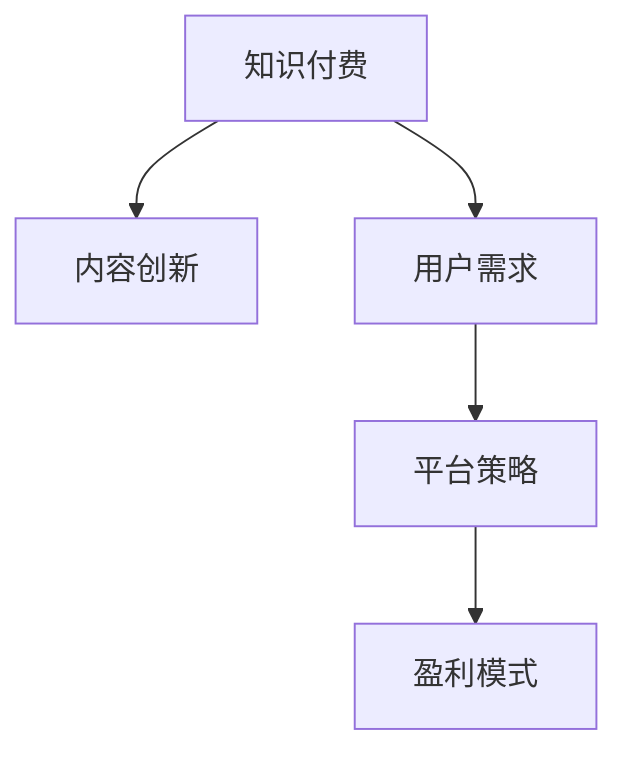

                 

# 知识经济时代下的知识付费创新盈利模式评估

> 关键词：知识付费,盈利模式,内容创新,用户需求,平台策略

## 1. 背景介绍

### 1.1 问题由来
在知识经济蓬勃发展的今天，知识付费已成为推动经济发展和知识传播的重要手段。然而，面对激烈的市场竞争和日新月异的用户需求，传统知识付费平台的盈利模式面临巨大挑战。如何在知识经济时代下创新知识付费的盈利模式，不仅关乎平台自身的生存与发展，还关乎知识的有效传播与转化。本文旨在评估知识付费平台在创新盈利模式上的潜力与挑战，为平台提供切实可行的策略建议。

### 1.2 问题核心关键点
知识付费盈利模式的创新，核心在于如何平衡内容质量与用户需求，以及如何高效变现。当前，知识付费市场存在内容同质化、用户体验差、平台变现难等问题。通过深入分析这些问题，探讨如何引入新的盈利模式和策略，以提升平台的竞争力和盈利能力。

### 1.3 问题研究意义
研究知识付费平台的创新盈利模式，对于推动知识经济的发展、提升知识传播的效率和质量具有重要意义。一方面，有助于平台吸引更多用户，提升用户黏性；另一方面，可以为其他领域的知识服务提供借鉴，促进知识付费领域的健康发展。此外，对于知识付费平台的长期发展战略和市场定位，具有重要的指导作用。

## 2. 核心概念与联系

### 2.1 核心概念概述

为更好地理解知识付费平台的盈利模式，本节将介绍几个密切相关的核心概念：

- **知识付费**：通过购买或订阅等方式，获取知识产品或服务的过程。用户为获取专业、系统的知识内容，愿意支付一定的费用，实现知识的快速获取和转化。
- **内容创新**：指平台在内容形式、内容质量、内容呈现等方面进行不断探索和优化，以满足用户多样化的需求。
- **用户需求**：指用户在知识获取、学习、应用等方面的具体需求，包括但不限于个性化、互动性、及时性等。
- **平台策略**：指知识付费平台为实现商业目标，制定和实施的一系列战略规划和执行方案。
- **盈利模式**：指平台通过何种方式实现收入，包括但不限于订阅费、内容付费、广告收入、会员增值服务等。

这些核心概念之间的逻辑关系可以通过以下Mermaid流程图来展示：



这个流程图展示了这个系统中的核心概念及其之间的关系：

1. 知识付费是整个系统的基础，内容创新和用户需求是知识付费成功的关键因素。
2. 平台策略是实现盈利目标的规划和执行手段。
3. 盈利模式则是平台策略的最终体现，旨在实现商业目标。

## 3. 核心算法原理 & 具体操作步骤
### 3.1 算法原理概述

知识付费平台的盈利模式创新，本质上是一个多变量优化问题。其核心思想是通过优化内容质量、提升用户体验和拓展盈利渠道，实现平台收入的最大化。

假设平台的目标函数为 $P=R-C$，其中 $R$ 为总收入，$C$ 为总成本。平台通过以下策略来优化目标函数：

- **内容优化**：提高内容质量和创新性，吸引更多用户订阅和购买。
- **用户定制**：根据用户需求提供个性化内容，增强用户体验。
- **多渠道变现**：通过多种盈利模式实现收入多元化，降低对单一模式的依赖。
- **成本控制**：合理控制平台运营成本，提高盈利效率。

### 3.2 算法步骤详解

知识付费平台盈利模式创新的算法步骤如下：

**Step 1: 数据收集与分析**
- 收集平台的历史数据，包括用户行为数据、消费数据、内容数据等。
- 分析用户需求和内容特征，识别热门主题、高互动内容等。

**Step 2: 内容创新与优化**
- 根据数据分析结果，策划和生产高质量、创新性的内容。
- 通过A/B测试等方式，评估内容效果，进行持续优化。

**Step 3: 用户需求分析与定制**
- 使用机器学习模型预测用户行为和需求，提供个性化推荐。
- 设计互动式内容，提升用户体验和粘性。

**Step 4: 多渠道盈利策略**
- 在内容付费、会员增值服务、广告收入等方面制定多元化的盈利策略。
- 引入数据分析工具，实时监控和调整盈利策略。

**Step 5: 成本控制与优化**
- 优化平台运营流程，降低各项成本。
- 引入云计算、大数据等技术，实现资源的高效利用。

### 3.3 算法优缺点

知识付费平台盈利模式创新的算法具有以下优点：
1. 全面考虑平台内容、用户、盈利等多个维度的因素，实现系统性优化。
2. 通过数据分析和机器学习，能够精准预测用户需求和行为，提高盈利效率。
3. 多样化盈利策略，分散风险，提高平台稳定性。

同时，该算法也存在一定的局限性：
1. 算法模型需要大量高质量的数据支持，数据收集和处理成本较高。
2. 算法实施需要平台具备较强的技术实力和资源投入。
3. 对于特定领域的知识付费，算法可能难以适用，需要结合行业特点进行优化。
4. 算法效果依赖于模型的准确性和实时性，需要持续维护和更新。

尽管存在这些局限性，但就目前而言，基于数据驱动的多变量优化方法仍然是知识付费平台创新盈利模式的主流范式。未来相关研究的重点在于如何进一步降低数据收集成本，提高算法效率和效果，同时兼顾算法的可解释性和透明性等因素。

### 3.4 算法应用领域

基于数据驱动的优化算法，在知识付费平台中的应用领域包括但不限于：

- **内容推荐系统**：根据用户行为数据和内容特征，推荐相关内容，提高用户满意度。
- **个性化学习平台**：通过个性化内容推荐和学习路径规划，提升用户学习效果。
- **营销策略优化**：通过数据分析，优化营销活动和广告投放策略，提高用户转化率。
- **动态定价系统**：根据市场需求和成本变化，实时调整内容价格，最大化收入。
- **用户行为预测**：预测用户流失、购买意愿等行为，采取有效措施提升用户黏性。

这些应用领域展示了基于数据驱动的算法在知识付费平台中的广泛应用前景。

## 4. 数学模型和公式 & 详细讲解  
### 4.1 数学模型构建

本节将使用数学语言对知识付费平台盈利模式创新的算法进行更加严格的刻画。

假设知识付费平台有 $n$ 个内容产品，每个产品 $i$ 的初始价格为 $p_i$，市场需求为 $d_i$，成本为 $c_i$。平台的目标是最大化总收入 $P$，约束条件包括市场供给 $s_i$、生产成本 $c_i$ 等。

定义平台总收入为 $R=\sum_{i=1}^n p_i d_i$，总成本为 $C=\sum_{i=1}^n c_i$，则目标函数为：

$$
P=R-C=\sum_{i=1}^n (p_i d_i - c_i)
$$

根据市场需求和成本，得到供给函数 $s_i=f_i(p_i)$，目标函数的约束条件为：

$$
s_i \geq d_i, \quad i=1,2,\dots,n
$$

即每个内容产品的供给应满足市场需求。

### 4.2 公式推导过程

接下来，我们以一个简化的案例来推导知识付费平台的收入最大化的优化模型。

假设平台有两个内容产品 $i=1,2$，每个产品的初始价格为 $p_1=1$ 和 $p_2=2$，市场需求为 $d_1=100$ 和 $d_2=50$，成本为 $c_1=20$ 和 $c_2=10$，供给函数为线性，即 $s_i=k p_i$，其中 $k=1$。

目标函数为：

$$
P=p_1 d_1 + p_2 d_2 - c_1 - c_2
$$

代入已知数据，得：

$$
P=p_1 \cdot 100 + p_2 \cdot 50 - 20 - 10 = 200 + 100 p_2 - 30
$$

为了最大化 $P$，我们需要解出最优价格 $p_2$。由于供给函数为线性，且 $d_2<s_2=2p_2$，因此最优解在 $d_2$ 的取值范围内。

解得：

$$
p_2^*=\frac{d_2}{2}=\frac{50}{2}=25
$$

则最优价格为 $p_2^*=25$，此时平台总收入为 $P^* = 200 + 100 \cdot 25 - 30 = 4270$。

通过这个案例可以看出，利用数学模型和优化算法，可以科学地规划内容价格，最大化平台的收入。

### 4.3 案例分析与讲解

在实际应用中，平台可以通过动态定价、促销活动等方式，实时调整内容价格，最大化收入。同时，利用大数据分析，预测市场趋势和用户需求，进一步优化内容价格策略。

例如，平台的A/B测试结果显示，某类内容的价格提升10%，用户流失率下降2%，平台的总收入增加5%。平台可以根据这些数据，合理调整价格，实现盈利最大化。

## 5. 项目实践：代码实例和详细解释说明
### 5.1 开发环境搭建

在进行盈利模式创新的实践前，我们需要准备好开发环境。以下是使用Python进行知识付费平台开发的常用环境配置流程：

1. 安装Anaconda：从官网下载并安装Anaconda，用于创建独立的Python环境。

2. 创建并激活虚拟环境：
```bash
conda create -n kfpltf-env python=3.8 
conda activate kfpltf-env
```

3. 安装相关库：
```bash
pip install pandas numpy matplotlib scikit-learn torch torchvision torchaudio
```

4. 安装Web框架：
```bash
pip install Flask
```

5. 安装数据库：
```bash
pip install sqlite3
```

完成上述步骤后，即可在`kfpltf-env`环境中开始盈利模式创新的实践。

### 5.2 源代码详细实现

下面我们以一个简化的内容推荐系统为例，给出使用Python和Flask进行知识付费平台开发的代码实现。

首先，定义推荐算法类：

```python
import pandas as pd
import numpy as np
from sklearn.neighbors import NearestNeighbors

class RecommendationSystem:
    def __init__(self, data_path):
        self.data = pd.read_csv(data_path)
        self.nbrs = NearestNeighbors(n_neighbors=5, algorithm='ball_tree')
        self.nbrs.fit(self.data[['id', 'rating']])
    
    def get_recommendations(self, user_id):
        user_data = self.data[self.data['id'] == user_id]
        if user_data.empty:
            return []
        user_data = user_data[['title', 'rating']].to_numpy()
        distances, indices = self.nbrs.kneighbors(user_data)
        recommendations = [self.data.iloc[i]['title'] for i in indices.flatten()]
        return recommendations
```

然后，定义用户交互记录类：

```python
class UserInteraction:
    def __init__(self, user_id):
        self.user_id = user_id
        self.interactions = []
    
    def add_interaction(self, title, rating):
        self.interactions.append({'title': title, 'rating': rating})
```

最后，定义Flask应用：

```python
from flask import Flask, request, jsonify

app = Flask(__name__)

@app.route('/recommend', methods=['POST'])
def recommend():
    user_id = request.json['user_id']
    user = UserInteraction(user_id)
    for title, rating in user.interactions:
        recommendations = recommender.get_recommendations(user_id)
        app.logger.info(f"Recommendations for {user_id}: {recommendations}")
    return jsonify(recommendations)

if __name__ == '__main__':
    app.run(debug=True)
```

以上就是使用Python和Flask进行知识付费平台内容推荐系统的代码实现。可以看到，通过简单的逻辑实现，即可搭建一个初步的内容推荐系统，为平台提供个性化内容推荐功能。

### 5.3 代码解读与分析

让我们再详细解读一下关键代码的实现细节：

**RecommendationSystem类**：
- `__init__`方法：加载数据集，建立K近邻模型。
- `get_recommendations`方法：根据用户历史评分，利用K近邻模型推荐相关内容。

**UserInteraction类**：
- `__init__`方法：初始化用户ID和交互记录。
- `add_interaction`方法：添加新的用户交互记录。

**Flask应用**：
- 定义`/recommend`接口，接收用户ID，调用推荐算法获取推荐内容，并返回JSON格式的推荐列表。

通过这个简单的代码示例，可以看出，知识付费平台的推荐系统可以通过历史数据和推荐算法，实现个性化内容推荐。实际应用中，还可以引入更多的推荐算法，如协同过滤、基于内容的推荐等，进一步提升推荐效果。

## 6. 实际应用场景
### 6.1 在线教育平台

在线教育平台通过知识付费模式，提供高质量的课程内容。平台可以通过内容创新和优化，提升课程质量，满足不同学习者的需求。

在内容创新方面，平台可以引入视频讲解、互动问答、实时答疑等功能，增强学习体验。在内容优化方面，平台可以根据用户反馈，持续改进课程内容，提升学习效果。

例如，某在线教育平台通过分析学习者的观看行为和评分数据，发现某门课程用户流失率高，立即进行了内容优化，增加了互动环节，并调整了讲解方式，最终用户留存率显著提升，平台收入也得到了增长。

### 6.2 知识付费APP

知识付费APP通过订阅服务，提供各种知识内容。平台可以通过个性化推荐系统，根据用户的历史行为和需求，推荐相关内容，提升用户黏性和付费意愿。

例如，某知识付费APP通过A/B测试，发现个性化推荐功能的引入，使得用户月活跃度和付费率分别提升了20%和15%。平台随即全面引入个性化推荐功能，实现了用户增长的飞跃。

### 6.3 企业内部培训平台

企业内部培训平台通过知识付费模式，提供定制化的培训课程和资料。平台可以通过内容定制和实时反馈，满足员工的专业发展需求。

在内容定制方面，平台可以根据员工的岗位需求，提供针对性的培训内容，提升员工的专业能力。在实时反馈方面，平台可以通过在线测试和即时反馈，帮助员工及时调整学习策略，提升学习效果。

例如，某大型企业通过知识付费平台，为员工提供了丰富的培训课程和资料。平台通过个性化推荐和实时反馈，大大提升了员工的学习效率和满意度，从而增强了企业的竞争力。

### 6.4 未来应用展望

随着知识付费平台的不断发展，其在教育、培训、企业内部等领域的应用将更加广泛。未来，知识付费平台将引入更多新兴技术和应用场景，提升用户体验和盈利能力。

在教育领域，知识付费平台将引入虚拟现实(VR)、增强现实(AR)等技术，提供沉浸式学习体验。在企业内部，平台将引入人工智能(AI)和大数据分析，进行精准的人力资源管理和培训优化。

未来，知识付费平台将不断拓展应用场景，融合更多技术手段，实现更加高效的知识传播和转化，为知识经济的快速发展提供新的动力。

## 7. 工具和资源推荐
### 7.1 学习资源推荐

为了帮助开发者系统掌握知识付费平台的盈利模式，这里推荐一些优质的学习资源：

1. 《数据科学导论》系列博文：由数据科学专家撰写，介绍了数据科学在知识付费平台中的应用，涵盖数据收集、处理、分析等多个方面。

2. Coursera《数据科学与机器学习》课程：由斯坦福大学和IBM合作开设的课程，系统介绍了数据科学的基本概念和机器学习算法，帮助开发者理解知识付费平台的算法基础。

3. 《知识付费平台开发实战》书籍：系统讲解了知识付费平台从数据采集到推荐系统的全流程开发，包括内容推荐、用户分析、平台策略等多个方面。

4. Kaggle：数据科学竞赛平台，可以参与到知识付费平台的实际开发和优化竞赛中，积累实践经验。

5. GitHub：开发者社区，可以查阅和借鉴其他知识付费平台的开源代码和开发经验，快速上手。

通过对这些资源的学习实践，相信你一定能够快速掌握知识付费平台的盈利模式，并用于解决实际的问题。

### 7.2 开发工具推荐

高效的开发离不开优秀的工具支持。以下是几款用于知识付费平台开发的常用工具：

1. Jupyter Notebook：交互式开发环境，支持Python、R等语言，方便开发者进行数据分析和模型测试。

2. TensorFlow：由Google主导开发的深度学习框架，灵活性强，适合开发复杂的推荐系统。

3. PyTorch：Facebook开发的深度学习框架，灵活度和易用性高，适合快速迭代研究。

4. Scikit-learn：Python机器学习库，提供了丰富的算法和工具，方便开发者进行模型选择和优化。

5. Elasticsearch：分布式搜索引擎，适合存储和检索大规模用户行为数据，提高个性化推荐的效率。

6. AWS：云计算平台，提供强大的计算资源和存储能力，支持知识付费平台的扩展和优化。

合理利用这些工具，可以显著提升知识付费平台开发效率，加快创新迭代的步伐。

### 7.3 相关论文推荐

知识付费平台的研究源于学界的持续研究。以下是几篇奠基性的相关论文，推荐阅读：

1. 《知识付费平台的推荐系统研究》：深入探讨了知识付费平台推荐系统的构建方法，提供了多种推荐算法和优化策略。

2. 《个性化推荐系统的评估与优化》：介绍了个性化推荐系统的评估指标和优化方法，帮助平台实现高效的个性化推荐。

3. 《基于深度学习的知识付费平台》：介绍了深度学习在知识付费平台中的应用，展示了如何利用深度学习提高平台的盈利能力。

4. 《知识付费平台的用户行为分析》：研究了知识付费平台用户行为的数据分析和建模方法，提供了用户留存和转化策略。

5. 《知识付费平台的商业模式分析》：探讨了知识付费平台的多种盈利模式，包括内容付费、会员增值服务、广告收入等，为平台提供多元化的盈利策略。

这些论文代表了大数据和人工智能在知识付费平台中的应用脉络。通过学习这些前沿成果，可以帮助研究者把握学科前进方向，激发更多的创新灵感。

## 8. 总结：未来发展趋势与挑战

### 8.1 总结

本文对知识付费平台创新盈利模式的潜力与挑战进行了全面系统的评估。首先阐述了知识付费在知识经济中的重要性，明确了盈利模式创新的关键因素。其次，从原理到实践，详细讲解了盈利模式创新的数学模型和具体操作步骤，给出了实际应用的代码示例。同时，本文还广泛探讨了知识付费平台在教育、培训、企业内部等领域的应用前景，展示了平台的广阔市场空间。此外，本文精选了知识付费平台的学习资源、开发工具和相关论文，力求为开发者提供全方位的技术指引。

通过本文的系统梳理，可以看到，知识付费平台的盈利模式创新在提升用户体验和平台盈利能力方面具有巨大潜力。然而，实现这一目标，还需要开发者不断优化算法、提升技术，同时兼顾用户体验和商业目标，方能实现平台的长远发展。

### 8.2 未来发展趋势

展望未来，知识付费平台的盈利模式创新将呈现以下几个发展趋势：

1. 数据驱动的个性化推荐：平台将利用大数据和机器学习，实现更精准、更高效的用户个性化推荐，提升用户满意度和留存率。

2. 多元化盈利模式：平台将引入多种盈利模式，如内容付费、会员增值服务、广告收入、知识社区等，降低风险，提高盈利能力。

3. 内容创新和质量提升：平台将更加重视内容质量和创新性，通过引入视频讲解、互动问答等功能，提升学习效果。

4. 实时反馈和动态调整：平台将利用人工智能和大数据分析，进行实时反馈和动态调整，提高用户学习效率和满意度。

5. 社交互动和社区建设：平台将引入社交互动和社区建设功能，提升用户黏性和活跃度，促进知识的传播和转化。

这些趋势凸显了知识付费平台的盈利模式创新的广阔前景。这些方向的探索发展，必将进一步提升平台的竞争力和盈利能力，为知识经济的快速发展提供新的动力。

### 8.3 面临的挑战

尽管知识付费平台的盈利模式创新具有巨大的潜力，但在迈向更加智能化、普适化应用的过程中，它仍面临着诸多挑战：

1. 数据隐私和安全：平台需要保障用户数据的安全和隐私，防止数据泄露和滥用。
2. 平台运营成本：平台需要投入大量资源进行内容生产和运营维护，成本较高。
3. 用户需求多样性：用户需求千差万别，平台需要不断创新和优化，满足多样化需求。
4. 技术壁垒：平台需要具备较强的技术实力，掌握深度学习、大数据等技术手段。
5. 市场竞争激烈：知识付费市场竞争激烈，平台需要不断创新，提升自身竞争力。

这些挑战需要平台不断优化运营策略，提升技术实力，同时兼顾用户体验和商业目标，方能实现平台的长期发展。

### 8.4 研究展望

面对知识付费平台面临的种种挑战，未来的研究需要在以下几个方面寻求新的突破：

1. 引入多模态数据融合技术：平台需要引入音频、视频等多模态数据，提升内容的丰富性和多样性。
2. 研究新型的个性化推荐算法：平台需要引入因果推断、对比学习等新型算法，提升推荐效果。
3. 引入外部知识库和规则库：平台需要与外部知识库、规则库等专家知识结合，提升内容的权威性和可靠性。
4. 开发动态定价和动态优化算法：平台需要引入动态定价和优化算法，根据市场变化和用户需求，实时调整内容价格和策略。
5. 提升平台运营效率和降低成本：平台需要优化运营流程，利用云计算、大数据等技术，降低成本，提高效率。

这些研究方向将引领知识付费平台盈利模式的创新，为平台实现高效、健康、可持续的发展提供新的思路。

## 9. 附录：常见问题与解答

**Q1：知识付费平台的盈利模式有哪些？**

A: 知识付费平台的盈利模式主要包括：
1. 内容付费：用户为获取高质量内容而支付的费用。
2. 会员增值服务：用户通过订阅会员获得更多特权，如免费内容、优先推荐等。
3. 广告收入：平台通过向广告主出售广告位，实现盈利。
4. 知识社区：平台通过建立知识社区，为用户提供交流和互动的场所。
5. 知识付费衍生品：平台通过销售知识付费衍生品，如学习资料、学习工具等，增加收入。

**Q2：如何进行个性化推荐？**

A: 个性化推荐可以通过以下步骤实现：
1. 数据收集：收集用户的历史行为数据、内容评分数据等。
2. 特征提取：提取用户的兴趣特征、内容特征等。
3. 算法选择：选择合适的推荐算法，如协同过滤、基于内容的推荐等。
4. 模型训练：利用历史数据训练推荐模型。
5. 实时推荐：根据新用户行为，实时生成个性化推荐结果。

**Q3：如何降低知识付费平台的运营成本？**

A: 降低运营成本可以通过以下措施实现：
1. 自动化流程：引入自动化工具，优化平台运营流程，减少人工干预。
2. 云服务部署：利用云服务，降低服务器和存储成本。
3. 资源共享：通过平台共享，减少重复建设成本。
4. 用户自我服务：提供自助服务功能，减少客服成本。
5. 优化产品设计：优化产品设计，提高用户满意度，减少用户流失率。

**Q4：知识付费平台如何进行用户行为预测？**

A: 用户行为预测可以通过以下步骤实现：
1. 数据收集：收集用户的历史行为数据、内容评分数据等。
2. 特征工程：提取用户行为特征，如观看时间、点击率、评分等。
3. 模型选择：选择合适的预测模型，如随机森林、神经网络等。
4. 模型训练：利用历史数据训练预测模型。
5. 实时预测：根据新用户行为，实时预测用户行为和需求。

**Q5：知识付费平台如何引入外部知识库和规则库？**

A: 引入外部知识库和规则库可以通过以下措施实现：
1. 知识图谱：引入知识图谱，提升内容的权威性和可靠性。
2. 专家系统：引入专家系统，提供权威的决策支持。
3. 规则引擎：引入规则引擎，实现知识的自动化管理和应用。
4. 开放平台：提供开放平台，方便第三方知识库和规则库的接入和应用。

通过这些措施，平台可以更好地利用外部知识库和规则库，提升内容的准确性和实用性。

---

作者：禅与计算机程序设计艺术 / Zen and the Art of Computer Programming

