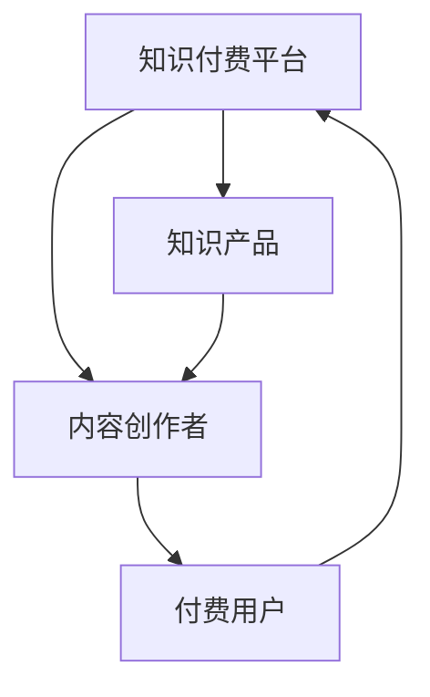

                 

# 知识经济时代下的知识付费发展趋势

## 1. 背景介绍

在知识经济的时代背景下，知识付费模式日益成为互联网经济的重要组成部分。这种模式以内容为核心，通过知识付费平台和形式多样的知识产品，向用户提供个性化、高价值的信息服务，既满足了人们对于知识的需求，也为内容创作者和平台带来了收益。

### 1.1 知识付费的兴起背景
随着信息爆炸时代的到来，知识的获取途径日益多样。但是，优质的内容往往被海量信息淹没，使得用户在海量内容中筛选有效信息的时间和成本增加。知识付费模式应运而生，旨在通过付费订阅或按需购买的形式，将高质量内容筛选并呈现给用户，节省用户寻找和筛选的时间，提升知识获取的效率。

### 1.2 知识付费的现状
当前，知识付费领域已有多家知名平台和内容创作者，如得到、喜马拉雅、知乎live等，覆盖了各种主题，如职业技能、生活常识、兴趣爱好等。这些平台和内容创作者通过优质的内容和服务，积累了大量的用户和市场份额。

### 1.3 知识付费的影响
知识付费不仅改变了人们的知识获取方式，也对教育、出版、媒体等行业产生了深远影响。它推动了知识生产的数字化、专业化，促进了知识传播和消费的细分化、个性化，促进了知识市场的健康发展。

## 2. 核心概念与联系

### 2.1 核心概念概述
在知识付费的发展过程中，涉及多个关键概念，包括：

- **知识付费平台**：提供在线付费内容的平台，如得到、喜马拉雅、知乎live等。
- **内容创作者**：提供专业知识的个体或团队，如讲师、作家、专家等。
- **付费用户**：愿意为获取特定知识或信息付费的群体。
- **知识产品**：平台和创作者提供的内容形式，如课程、音频、视频、电子书等。
- **知识市场**：由平台、创作者和用户组成的信息交易市场。

### 2.2 核心概念联系
知识付费的生态系统由以上概念构成，相互之间存在紧密联系。知识付费平台提供交易平台和支付渠道，内容创作者提供知识产品，付费用户为知识产品和服务付费，知识市场作为交易环境，形成了一个完整的闭环。

### 2.3 核心概念联系的Mermaid流程图


## 3. 核心算法原理 & 具体操作步骤

### 3.1 算法原理概述

知识付费模式的核心算法原理主要涉及内容推荐算法和定价策略。内容推荐算法用于帮助用户发现符合自己兴趣和需求的知识产品，定价策略则用于确定知识产品的价格，吸引用户购买。

### 3.2 算法步骤详解

#### 3.2.1 内容推荐算法
内容推荐算法主要分为以下步骤：

1. **数据采集**：收集用户的历史行为数据，如浏览、购买、评分等，以及知识产品的属性数据，如课程主题、难度等。
2. **特征工程**：将数据转化为算法可处理的特征，如用户兴趣标签、知识产品类别等。
3. **模型训练**：使用机器学习或深度学习模型训练推荐模型，如协同过滤、基于内容的推荐、深度神经网络等。
4. **推荐展示**：根据用户行为数据和模型预测，向用户展示最相关的知识产品。

#### 3.2.2 定价策略
定价策略主要涉及以下步骤：

1. **成本核算**：计算知识产品的生产成本，包括内容创作、平台运营、市场推广等。
2. **市场需求分析**：分析目标用户对知识产品的需求程度，如市场需求量、价格敏感度等。
3. **定价模型**：根据成本和需求，确定知识产品的定价策略，如市场导向定价、成本加成定价、动态定价等。
4. **价格调整**：根据市场反馈和定价效果，调整定价策略，实现最优价格。

### 3.3 算法优缺点

#### 3.3.1 内容推荐算法的优点
- **个性化推荐**：能够根据用户的历史行为和偏好，提供个性化推荐，提升用户体验。
- **多维度特征融合**：可以综合利用用户行为数据和知识产品属性数据，提高推荐效果。

#### 3.3.2 内容推荐算法的缺点
- **冷启动问题**：新用户或新知识产品缺乏历史数据，难以进行有效推荐。
- **数据隐私**：用户行为数据可能涉及隐私问题，需要妥善处理。

#### 3.3.3 定价策略的优点
- **灵活性**：可以根据市场需求和平台运营情况，灵活调整定价策略，实现最优收益。
- **用户引导**：通过价格机制，引导用户进行高质量内容的付费和购买，提升平台收益。

#### 3.3.4 定价策略的缺点
- **市场风险**：定价过高可能影响用户购买意愿，定价过低可能无法覆盖成本。
- **动态调整难度**：市场环境变化迅速，定价策略需要频繁调整，增加了运营复杂性。

### 3.4 算法应用领域

知识付费模式不仅应用于在线教育、知识分享等领域，还可以扩展到以下领域：

- **职业技能培训**：提供专业技能的在线课程，帮助用户提升职业技能。
- **健康管理**：提供健康知识的在线咨询和课程，帮助用户保持健康。
- **心理咨询**：提供在线心理咨询服务和课程，帮助用户解决心理问题。
- **法律咨询**：提供法律知识和在线咨询，帮助用户解决法律问题。

## 4. 数学模型和公式 & 详细讲解

### 4.1 数学模型构建

知识付费模式中的推荐算法和定价策略可以抽象为数学模型。以协同过滤推荐算法为例，其数学模型如下：

假设用户集为 $U$，物品集为 $I$，用户对物品的评分矩阵为 $R \in \mathbb{R}^{m \times n}$，其中 $m$ 为物品数量，$n$ 为用户数量，$R_{ui}=a_{ui}+b_{ui}\sum_{v=1}^nR_{uv}+a_{iu}+b_{iu}\sum_{v=1}^nR_{vi}$。其中，$a_{ui},b_{ui}$ 为物品 $i$ 的特征向量，$a_{iu},b_{iu}$ 为用户 $u$ 的特征向量。

### 4.2 公式推导过程

协同过滤推荐算法的基本推导过程如下：

1. **用户-物品评分矩阵计算**：根据用户行为数据计算用户对物品的评分矩阵 $R$。
2. **用户特征向量计算**：计算用户 $u$ 的特征向量 $a_u,b_u$。
3. **物品特征向量计算**：计算物品 $i$ 的特征向量 $a_i,b_i$。
4. **推荐分数计算**：根据用户特征向量和物品特征向量，计算用户 $u$ 对物品 $i$ 的推荐分数。
5. **推荐排序**：根据推荐分数，对所有物品进行排序，选择得分最高的物品推荐给用户。

### 4.3 案例分析与讲解

以得到平台上的一门课程为例，假设课程的主题为“编程基础”，难度为“中等”，用户对其评分如下：

| 用户 | 评分 |
| --- | --- |
| 用户1 | 5 |
| 用户2 | 4 |
| 用户3 | 3 |

根据上述评分矩阵，可以计算用户特征向量和物品特征向量，进而计算用户对课程的推荐分数。假设用户特征向量为 $a_u=(0.1,0.3,0.2)$，物品特征向量为 $a_i=(0.2,0.4,0.3)$，则用户1对课程的推荐分数为：

$$
\begin{align*}
R_{1i} &= 0.1 \times 0.2 + 0.3 \times 0.4 + 0.2 \times 0.3 \\
&= 0.02 + 0.12 + 0.06 \\
&= 0.20
\end{align*}
$$

根据推荐分数排序，课程“编程基础”将被推荐给用户1。

## 5. 项目实践：代码实例和详细解释说明

### 5.1 开发环境搭建

在进行知识付费推荐系统的开发实践前，需要先搭建好开发环境。以下是Python开发环境的搭建流程：

1. **安装Python**：下载并安装Python 3.x版本。
2. **安装Pip**：安装Python包管理工具Pip，用于安装第三方库。
3. **安装第三方库**：安装所需第三方库，如numpy、pandas、scikit-learn等。
4. **安装Jupyter Notebook**：安装Jupyter Notebook，用于编写和运行代码。

### 5.2 源代码详细实现

以下是一个简单的协同过滤推荐系统实现，以Python为例：

```python
import numpy as np

# 用户-物品评分矩阵
R = np.array([[5, 4, 3],
              [0, 0, 0],
              [0, 0, 0]])

# 用户特征向量
a_u = np.array([0.1, 0.3, 0.2])

# 物品特征向量
a_i = np.array([0.2, 0.4, 0.3])

# 物品特征向量
b_u = np.array([0.5, 0.5, 0.5])

# 物品特征向量
b_i = np.array([0.1, 0.1, 0.1])

# 计算推荐分数
R_u = np.dot(a_u, b_i) + np.dot(a_i, b_u) + np.dot(R, a_u) + np.dot(R.T, b_u)

# 推荐排序
index = np.argsort(R_u)[::-1]
```

在上述代码中，我们首先定义了用户-物品评分矩阵 $R$、用户特征向量 $a_u$、物品特征向量 $a_i$、用户特征向量 $b_u$、物品特征向量 $b_i$。然后，根据协同过滤推荐算法计算推荐分数 $R_u$，并根据推荐分数对物品进行排序，最后输出推荐结果。

### 5.3 代码解读与分析

代码中，我们首先定义了评分矩阵 $R$，其中用户对物品的评分已经给出。然后，我们定义了用户特征向量 $a_u$ 和物品特征向量 $a_i$，这些向量可以用于计算推荐分数。接着，我们定义了用户特征向量 $b_u$ 和物品特征向量 $b_i$，这些向量用于平衡用户和物品的特征。

在计算推荐分数时，我们使用了线性代数运算，通过矩阵乘法和向量的点积计算出推荐分数 $R_u$。最后，我们使用 `argsort` 函数对推荐分数进行排序，得到物品的推荐顺序。

### 5.4 运行结果展示

运行上述代码后，我们得到了物品的推荐顺序。假设用户1对课程“编程基础”的推荐分数最高，则课程“编程基础”将被推荐给用户1。

## 6. 实际应用场景

### 6.1 在线教育平台

在线教育平台如得到、Coursera、Udemy等，利用知识付费模式提供各种在线课程。这些平台通过推荐算法为用户推荐合适的课程，使用户能够高效学习新知识。

### 6.2 健康管理平台

健康管理平台如健康之路、keep等，利用知识付费模式提供健康知识服务，如健身课程、健康饮食指导等。用户可以通过付费订阅或单次购买获取相关知识产品。

### 6.3 心理咨询平台

心理咨询平台如简单心理、525心理网等，利用知识付费模式提供心理咨询服务，如在线咨询、心理测评等。用户可以通过付费预约专业心理咨询师，获得个性化心理健康服务。

### 6.4 未来应用展望

未来，知识付费模式将在更多领域得到应用，如职业技能培训、健康管理、法律咨询等。知识付费平台将更加多元化、个性化，为用户提供更多有价值的服务。

## 7. 工具和资源推荐

### 7.1 学习资源推荐

以下是一些学习资源，推荐阅读：

1. **《知识付费：模式、机制与未来》**：深入分析知识付费模式的现状、机制和未来发展方向。
2. **《知识付费产品设计指南》**：提供知识付费产品设计方法和案例分析，帮助内容创作者提升产品竞争力。
3. **《知识付费平台运营实战》**：分享知识付费平台运营经验和策略，帮助平台管理者提升平台效益。
4. **《知识付费用户行为分析》**：分析用户行为数据，帮助内容创作者优化内容推荐策略。

### 7.2 开发工具推荐

以下是一些开发工具，推荐使用：

1. **Jupyter Notebook**：用于编写和运行代码，支持多种编程语言，如Python、R等。
2. **Python**：易学易用、功能强大的编程语言，适合开发知识付费推荐系统。
3. **NumPy**：用于高效处理多维数组和矩阵计算，适合数值计算和科学计算。
4. **Pandas**：用于数据处理和分析，支持多种数据格式和操作。

### 7.3 相关论文推荐

以下是一些相关论文，推荐阅读：

1. **《协同过滤推荐系统》**：介绍协同过滤推荐算法的原理和实现方法，适合知识付费推荐系统开发人员阅读。
2. **《知识付费推荐系统的用户行为分析》**：分析用户行为数据，优化知识付费推荐算法，适合内容创作者和平台管理者阅读。
3. **《知识付费平台定价策略》**：分析知识付费定价策略，适合平台管理者阅读。

## 8. 总结：未来发展趋势与挑战

### 8.1 研究成果总结

知识付费模式在知识经济时代具有广阔的市场前景，已成为互联网经济的重要组成部分。本文从内容推荐算法和定价策略两个方面，详细介绍了知识付费模式的核心算法原理和操作步骤。

### 8.2 未来发展趋势

未来，知识付费模式将呈现以下发展趋势：

1. **个性化推荐**：推荐算法将更加智能化、个性化，满足用户多样化需求。
2. **多模态推荐**：推荐系统将融合多模态数据，提升推荐效果。
3. **动态定价**：定价策略将更加灵活，动态调整，提升用户满意度和平台收益。
4. **技术创新**：知识付费平台将引入更多前沿技术，如人工智能、大数据等，提升平台竞争力。

### 8.3 面临的挑战

尽管知识付费模式前景广阔，但也面临一些挑战：

1. **内容质量问题**：低质量内容难以吸引用户，平台需加强内容审核和质量控制。
2. **用户留存问题**：用户流失率较高，平台需提升用户体验和服务质量。
3. **数据隐私问题**：用户行为数据涉及隐私问题，平台需加强数据保护。
4. **市场竞争**：知识付费市场竞争激烈，平台需不断创新和优化。

### 8.4 研究展望

未来的知识付费模式将在多个方面进行创新和突破，如内容质量提升、用户留存策略、数据隐私保护和市场竞争应对。这些研究将推动知识付费模式的不断发展，为知识经济时代的用户提供更多优质的服务。

## 9. 附录：常见问题与解答

### 9.1 问题解答

**Q1: 知识付费平台如何进行内容审核？**

A: 知识付费平台通常采用多种方式进行内容审核，如人工审核、机器审核、用户反馈等。其中，机器审核可以利用自然语言处理技术，对内容进行关键词过滤、语法检查等，提升审核效率。

**Q2: 知识付费平台如何保护用户隐私？**

A: 知识付费平台需遵守相关法律法规，如《个人信息保护法》等，保护用户隐私。平台需建立完善的数据保护机制，如数据加密、访问控制等，确保用户数据的安全性和隐私性。

**Q3: 知识付费平台如何提升用户留存率？**

A: 知识付费平台可以通过以下方式提升用户留存率：

1. **优化推荐算法**：根据用户行为和偏好，提供个性化推荐，提升用户体验。
2. **增强内容质量**：提供高质量、有价值的内容，满足用户需求。
3. **提供互动功能**：增加用户互动和参与度，提升用户粘性。

作者：禅与计算机程序设计艺术 / Zen and the Art of Computer Programming

