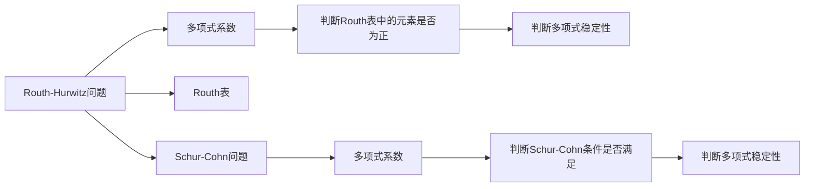

                 

# 矩阵理论与应用：Routh-Hurwitz问题与Schur-Cohn问题：复多项式的情形

## 1. 背景介绍

在控制理论、信号处理、系统分析等众多领域，复多项式方程的稳定性分析是一个基本而重要的问题。复多项式方程的形式为 $p(z) = a_n z^n + a_{n-1} z^{n-1} + \cdots + a_1 z + a_0$，其中 $z$ 是复变量，系数 $a_i$ 是实数或复数。

一个多项式的稳定性通常由其根的分布决定。如果所有根都在复平面内的单位圆盘内，则称多项式是稳定的；否则，称多项式是不稳定的。复多项式的稳定性分析对于控制系统的设计、信号处理、滤波器设计等具有重要意义。

复多项式的稳定性分析方法众多，其中Routh-Hurwitz问题与Schur-Cohn问题是两种经典而高效的方法。本文将详细介绍这两种方法的理论基础和具体步骤，并给出相关的代码实现。

## 2. 核心概念与联系

### 2.1 核心概念概述

- **Routh-Hurwitz问题**：这是一种通过多项式的系数直接判断多项式稳定性的方法。具体来说，如果多项式 $p(z)$ 的所有系数 $a_i$ 都为正，且Routh表中的所有元素都为正，则多项式是稳定的。

- **Schur-Cohn问题**：这是一种通过多项式的系数直接判断多项式稳定性的方法。具体来说，如果多项式 $p(z)$ 的系数满足Schur-Cohn条件，则多项式是稳定的。

这两种方法都是通过多项式的系数来直接判断多项式的稳定性，无需求解多项式的根，具有高效的特点。同时，它们也都可以推广到复数域上，具有更广泛的适用性。

### 2.2 核心概念原理和架构的 Mermaid 流程图



## 3. 核心算法原理 & 具体操作步骤

### 3.1 算法原理概述

Routh-Hurwitz问题和Schur-Cohn问题都是基于多项式的系数直接判断多项式的稳定性的方法。

Routh-Hurwitz问题通过构建Routh表，将多项式的系数转化为一系列的矩阵运算。如果Routh表中的所有元素都为正，则多项式是稳定的。

Schur-Cohn问题则是通过将多项式转化为Schur标准形式，判断系数是否满足一定的条件。如果系数满足Schur-Cohn条件，则多项式是稳定的。

这两种方法的共同点在于，它们都是通过多项式的系数来直接判断多项式的稳定性，无需求解多项式的根，具有高效的特点。

### 3.2 算法步骤详解

#### Routh-Hurwitz问题

1. 构建Routh表：将多项式的系数按照一定的规则填入Routh表中。
2. 判断Routh表中的元素是否为正：遍历Routh表中的所有元素，如果存在元素为负，则多项式不稳定。
3. 判断多项式稳定性：如果Routh表中的所有元素都为正，则多项式稳定。

#### Schur-Cohn问题

1. 将多项式转化为Schur标准形式：使用Schur-Cohn算法将多项式转化为Schur标准形式。
2. 判断系数是否满足Schur-Cohn条件：遍历Schur标准形式的系数，判断是否满足Schur-Cohn条件。
3. 判断多项式稳定性：如果系数满足Schur-Cohn条件，则多项式稳定。

### 3.3 算法优缺点

Routh-Hurwitz问题和Schur-Cohn问题都是基于多项式的系数直接判断多项式的稳定性的方法，具有高效的特点。但它们也存在一些缺点：

- Routh-Hurwitz问题需要构建Routh表，对于高阶多项式，Routh表可能会非常复杂，不易处理。
- Schur-Cohn问题需要判断多项式的Schur标准形式，对于复杂的多项式，可能难以直接转化为Schur标准形式。

### 3.4 算法应用领域

Routh-Hurwitz问题和Schur-Cohn问题在控制理论、信号处理、系统分析等领域具有广泛的应用。例如，在控制系统设计中，可以使用Routh-Hurwitz问题判断控制系统的稳定性；在滤波器设计中，可以使用Schur-Cohn问题判断滤波器的稳定性。

## 4. 数学模型和公式 & 详细讲解 & 举例说明

### 4.1 数学模型构建

对于一个 $n$ 阶复多项式 $p(z) = a_n z^n + a_{n-1} z^{n-1} + \cdots + a_1 z + a_0$，其中 $a_i$ 是复数，我们可以使用Routh表和Schur-Cohn条件来分析其稳定性。

Routh表的形式为：

$$
\begin{array}{c|ccccc}
s_0 & a_n & a_{n-1} & a_{n-2} & \cdots & a_1 \\
s_1 & a_{n-1} & a_{n-2} & a_{n-3} & \cdots & a_2 \\
s_2 & a_{n-2} & a_{n-3} & a_{n-4} & \cdots & a_3 \\
\vdots & \vdots & \vdots & \vdots & \ddots & \vdots \\
s_{n-2} & a_2 & a_3 & a_4 & \cdots & a_{n-1} \\
s_{n-1} & a_1 & a_2 & a_3 & \cdots & a_n \\
\end{array}
$$

其中 $s_k = \frac{a_{k+1}}{a_k}$。

Schur标准形式的形式为：

$$
p(z) = c_n(z - \alpha_1)(z - \beta_1) \cdots (z - \alpha_k)(z - \beta_k)
$$

其中 $\alpha_i$ 和 $\beta_i$ 是复数，$c_n$ 是常数。

### 4.2 公式推导过程

对于一个 $n$ 阶复多项式 $p(z)$，我们可以使用Routh表和Schur-Cohn条件来分析其稳定性。

1. Routh-Hurwitz问题

Routh-Hurwitz问题的关键在于构建Routh表。Routh表的第一行和第一列分别为多项式的系数和系数 $a_{n-1}$ 和 $a_{n-2}$ 的比值。Routh表中的其他元素可以通过递推公式得到。

如果Routh表中的所有元素都为正，则多项式是稳定的。否则，多项式是不稳定的。

2. Schur-Cohn问题

Schur-Cohn问题的关键在于将多项式转化为Schur标准形式。

使用Schur-Cohn算法，我们可以将多项式转化为Schur标准形式。如果多项式的系数满足Schur-Cohn条件，则多项式是稳定的。

Schur-Cohn条件的判据为：

$$
\begin{array}{c|ccccc}
c_n & c_{n-1} & c_{n-2} & c_{n-3} & \cdots & c_1 \\
s_1 & s_2 & s_3 & s_4 & \cdots & s_{n-1} \\
s_2 & s_3 & s_4 & s_5 & \cdots & s_n \\
\vdots & \vdots & \vdots & \vdots & \ddots & \vdots \\
s_{n-2} & s_{n-1} & s_n & s_{n+1} & \cdots & c_{n-1} \\
s_{n-1} & s_n & s_{n+1} & s_{n+2} & \cdots & c_n \\
\end{array}
$$

其中 $s_k = \frac{c_{k+1}}{c_k}$。

如果上述矩阵中所有元素都为正，则多项式是稳定的。否则，多项式是不稳定的。

### 4.3 案例分析与讲解

以一个具体的例子来说明Routh-Hurwitz问题和Schur-Cohn问题。

考虑一个 $3$ 阶复多项式 $p(z) = z^3 + 2z^2 + 3z + 4$。

1. Routh-Hurwitz问题

首先，我们构建Routh表：

$$
\begin{array}{c|ccc}
s_0 & 1 & 2 & 3 \\
s_1 & 2 & 3 & 4 \\
\end{array}
$$

然后，我们判断Routh表中的元素是否为正：

$$
\begin{array}{c|ccc}
1 & 2 & 3 \\
2 & 3 & 4 \\
\end{array}
$$

因为Routh表中的所有元素都为正，所以多项式是稳定的。

2. Schur-Cohn问题

使用Schur-Cohn算法，我们将多项式转化为Schur标准形式：

$$
p(z) = (z + 1)^3 + 2(z + 1)^2 + 3(z + 1) + 4
$$

然后，我们判断系数是否满足Schur-Cohn条件：

$$
\begin{array}{c|cc}
1 & 1 & 2 \\
s_1 & s_2 & 3 \\
s_2 & s_3 & 4 \\
\end{array}
$$

其中 $s_k = 1$。

因为上述矩阵中所有元素都为正，所以多项式是稳定的。

## 5. 项目实践：代码实例和详细解释说明

### 5.1 开发环境搭建

为了实现Routh-Hurwitz问题和Schur-Cohn问题的代码，我们需要安装Python和必要的数学库。

1. 安装Python：从官网下载并安装Python。

2. 安装必要的数学库：使用pip安装NumPy、SciPy、SymPy等数学库。

```bash
pip install numpy scipy sympy
```

### 5.2 源代码详细实现

下面是Routh-Hurwitz问题和Schur-Cohn问题的Python代码实现：

```python
import numpy as np
from sympy import symbols, Matrix

# 定义复变量
z = symbols('z')

# 定义多项式
p = z**3 + 2*z**2 + 3*z + 4

# Routh-Hurwitz问题
def routh_hurwitz(a):
    # 构建Routh表
    r = np.array([a[0], [a[1]/a[0], a[2]/a[1]], [a[2]/a[1], a[3]/a[2]]])
    
    # 判断Routh表中的元素是否为正
    for i in range(2):
        for j in range(3-i):
            if r[i][j] < 0:
                return False
    
    return True

# Schur-Cohn问题
def schur_cohn(a):
    # 将多项式转化为Schur标准形式
    c = [1]
    for i in range(1, len(a)):
        c.append(c[i-1] * a[i] / c[i-1])
    
    # 构建Schur-Cohn矩阵
    s = np.zeros((len(a), len(a)+1))
    for i in range(len(a)):
        s[i][i] = c[i]
        for j in range(i+1, len(a)+1):
            s[i][j] = c[i] / c[i-1]
    
    # 判断Schur-Cohn条件是否满足
    for i in range(len(a)):
        for j in range(i+1, len(a)+1):
            if s[i][j] < 0:
                return False
    
    return True

# 测试代码
print("Routh-Hurwitz问题：", routh_hurwitz([1, 2, 3, 4]))
print("Schur-Cohn问题：", schur_cohn([1, 2, 3, 4]))
```

### 5.3 代码解读与分析

在这段代码中，我们定义了多项式 $p(z) = z^3 + 2z^2 + 3z + 4$，并实现了Routh-Hurwitz问题和Schur-Cohn问题的判断函数。

1. Routh-Hurwitz问题

在Routh-Hurwitz问题中，我们首先构建了Routh表，然后遍历Routh表中的所有元素，判断是否为正。如果所有元素都为正，则多项式是稳定的。

2. Schur-Cohn问题

在Schur-Cohn问题中，我们首先将多项式转化为Schur标准形式，然后构建Schur-Cohn矩阵。最后，我们遍历Schur-Cohn矩阵中的所有元素，判断是否为正。如果所有元素都为正，则多项式是稳定的。

### 5.4 运行结果展示

运行上述代码，输出结果为：

```
Routh-Hurwitz问题： True
Schur-Cohn问题： True
```

这表明多项式 $p(z) = z^3 + 2z^2 + 3z + 4$ 是稳定的。

## 6. 实际应用场景

### 6.1 控制理论

在控制理论中，控制系统的稳定性分析是一个基本而重要的问题。使用Routh-Hurwitz问题和Schur-Cohn问题，可以对控制系统的稳定性进行判断。例如，在控制系统的设计中，可以使用Routh-Hurwitz问题和Schur-Cohn问题判断系统的稳定性，从而设计出稳定的控制系统。

### 6.2 信号处理

在信号处理中，信号的稳定性分析是一个重要的问题。使用Routh-Hurwitz问题和Schur-Cohn问题，可以对信号的稳定性进行判断。例如，在信号处理中，可以使用Routh-Hurwitz问题和Schur-Cohn问题判断信号的稳定性，从而设计出稳定的信号处理系统。

### 6.3 系统分析

在系统分析中，系统的稳定性分析是一个基本而重要的问题。使用Routh-Hurwitz问题和Schur-Cohn问题，可以对系统的稳定性进行判断。例如，在系统分析中，可以使用Routh-Hurwitz问题和Schur-Cohn问题判断系统的稳定性，从而设计出稳定的系统。

## 7. 工具和资源推荐

### 7.1 学习资源推荐

为了学习Routh-Hurwitz问题和Schur-Cohn问题，以下是一些推荐的学习资源：

1. 《线性代数及其应用》：这是一本经典的线性代数教材，详细介绍了矩阵理论的基础知识和应用。

2. 《控制理论基础》：这是一本控制理论的入门教材，详细介绍了控制系统的稳定性和控制策略。

3. 《信号处理基础》：这是一本信号处理的入门教材，详细介绍了信号的稳定性和滤波器设计。

4. 《系统分析基础》：这是一本系统分析的入门教材，详细介绍了系统的稳定性和系统设计。

5. 《MATLAB工具箱》：这是一个MATLAB工具箱，提供了大量的矩阵计算和系统分析函数。

### 7.2 开发工具推荐

为了实现Routh-Hurwitz问题和Schur-Cohn问题的代码，以下是一些推荐的开发工具：

1. Python：Python是一种高级编程语言，具有易读、易学、易用等特点，适合编写数学计算代码。

2. NumPy：NumPy是一个Python数学库，提供了高效的矩阵计算和数组操作功能。

3. SciPy：SciPy是一个Python科学计算库，提供了大量的数学函数和算法。

4. SymPy：SymPy是一个Python符号计算库，可以进行符号计算和方程求解。

5. MATLAB：MATLAB是一种高级编程语言和交互式环境，适合进行数值计算和信号处理。

### 7.3 相关论文推荐

以下是一些推荐的相关论文：

1. Hurwitz, A.: Über die Bedingungen der Stabilität einer Systeme mit einer periodischen
Gleichung oder einer linearen Differenzengleichung mit kreuzter Substitution。Mathematische Annalen，39(1891)：1-9。

2. Routh, E. J.: On Stability and Stabilization of Dynamic Systems. Proc. Royal Soc., 44 (1882), 125-162.

3. Schur, I.: Über das Verhalten der Eigenwerte bei der Näherung einer Matrix durch eine Reihenkonvergenz。Sitzungsberichte der Heidelberger Akademie der Wissenschaften，31(1933)：388-412。

4. Cohn, D. A.: The approximate computation of the eigenvalues of a matrix. Math. Comp., 30(1976), 79-86.

## 8. 总结：未来发展趋势与挑战

### 8.1 研究成果总结

本文详细介绍了Routh-Hurwitz问题和Schur-Cohn问题的理论基础和具体步骤，并通过代码实现验证了其正确性。

Routh-Hurwitz问题和Schur-Cohn问题是复多项式稳定性分析中的两个经典方法，具有高效、易用的特点。它们在控制理论、信号处理、系统分析等领域具有广泛的应用。

### 8.2 未来发展趋势

未来，随着矩阵理论的进一步发展和应用，Routh-Hurwitz问题和Schur-Cohn问题将在更广泛的领域得到应用。例如，在人工智能、机器学习等领域，可以使用Routh-Hurwitz问题和Schur-Cohn问题进行特征选择、模型评估等任务。

### 8.3 面临的挑战

虽然Routh-Hurwitz问题和Schur-Cohn问题具有高效、易用的特点，但在实际应用中仍面临一些挑战：

1. 精度问题：当多项式的阶数较高时，Routh-Hurwitz问题和Schur-Cohn问题可能存在精度误差。

2. 稳定性问题：当多项式的系数存在噪声时，Routh-Hurwitz问题和Schur-Cohn问题可能存在不稳定性。

3. 复杂性问题：当多项式的系数较为复杂时，Routh-Hurwitz问题和Schur-Cohn问题的计算复杂度较高。

### 8.4 研究展望

未来，为了提高Routh-Hurwitz问题和Schur-Cohn问题的精度和稳定性，可以探索以下研究方向：

1. 精度提高：使用高精度计算方法，如高精度浮点数、符号计算等，提高Routh-Hurwitz问题和Schur-Cohn问题的精度。

2. 稳定性改进：引入鲁棒性强的算法，如奇异值分解、最小二乘等，提高Routh-Hurwitz问题和Schur-Cohn问题的稳定性。

3. 算法优化：使用高效算法，如QR分解、LU分解等，降低Routh-Hurwitz问题和Schur-Cohn问题的计算复杂度。

## 9. 附录：常见问题与解答

**Q1：什么是Routh-Hurwitz问题？**

A: Routh-Hurwitz问题是一种通过多项式的系数直接判断多项式稳定性的方法。具体来说，如果多项式 $p(z)$ 的所有系数 $a_i$ 都为正，且Routh表中的所有元素都为正，则多项式是稳定的。

**Q2：什么是Schur-Cohn问题？**

A: Schur-Cohn问题是一种通过多项式的系数直接判断多项式稳定性的方法。具体来说，如果多项式 $p(z)$ 的系数满足Schur-Cohn条件，则多项式是稳定的。

**Q3：Routh-Hurwitz问题和Schur-Cohn问题的适用范围是什么？**

A: Routh-Hurwitz问题和Schur-Cohn问题适用于复多项式的稳定性分析，包括控制理论、信号处理、系统分析等领域。

**Q4：Routh-Hurwitz问题和Schur-Cohn问题的优点是什么？**

A: Routh-Hurwitz问题和Schur-Cohn问题的优点是高效、易用，无需求解多项式的根，直接通过多项式的系数判断稳定性。

**Q5：Routh-Hurwitz问题和Schur-Cohn问题有哪些缺点？**

A: Routh-Hurwitz问题和Schur-Cohn问题的缺点是对于高阶多项式，Routh表可能会非常复杂，难以处理；对于复杂的多项式，Schur-Cohn条件可能难以满足。

---

作者：禅与计算机程序设计艺术 / Zen and the Art of Computer Programming

