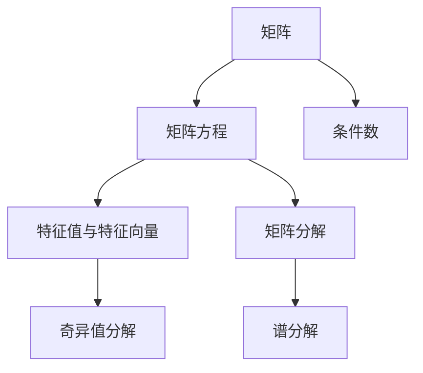

                 

# 矩阵理论与应用：线性矩阵方程与惯性理论

> 关键词：线性矩阵方程,惯性理论,矩阵分解,奇异值分解,谱分解,偏微分方程

## 1. 背景介绍

线性矩阵方程在数学、物理、工程等领域有广泛的应用。它们描述了各种物理现象，包括力学、电磁学、热力学等。本文将重点介绍线性矩阵方程的理论背景、基本形式以及相关应用，并通过实例演示如何利用Python和Sympy库进行矩阵方程求解。

## 2. 核心概念与联系

### 2.1 核心概念概述

线性矩阵方程是矩阵理论中的重要内容，广泛应用于物理、工程、经济学等领域。以下是与线性矩阵方程相关的主要概念：

- 矩阵：由若干行和若干列构成的数值表，用于描述线性代数中的各种关系。
- 矩阵方程：含有未知矩阵的方程，通常涉及矩阵的乘法、加法等基本运算。
- 特征值与特征向量：描述矩阵的一种本征性质，用于分析矩阵的对称性和稳定性。
- 矩阵分解：将矩阵分解为基本的结构形式，如矩阵的奇异值分解(SVD)、谱分解等。
- 矩阵的条件数：表示矩阵的不稳定性，用于分析矩阵求解的误差。

### 2.2 核心概念原理和架构的 Mermaid 流程图



以上流程图展示了线性矩阵方程的基本构成和关键步骤。其中，矩阵方程为起点，特征值与特征向量、矩阵分解、奇异值分解、谱分解等为核心环节，条件数为最终应用指标。

## 3. 核心算法原理 & 具体操作步骤

### 3.1 算法原理概述

线性矩阵方程的基本形式为：
$$AX=B$$
其中 $A$ 和 $B$ 为已知矩阵，$X$ 为未知矩阵。求解线性矩阵方程的目标是找到矩阵 $X$，使得上述等式成立。

当 $A$ 为方阵时，通过矩阵求逆可以直接求解 $X$：
$$X=A^{-1}B$$

当 $A$ 为非方阵时，上述方法不再适用。此时，可以通过矩阵分解技术，将 $A$ 分解为更易于求解的形式，例如奇异值分解和谱分解。

### 3.2 算法步骤详解

#### 3.2.1 矩阵方程求解步骤

1. 定义问题：给定 $A$ 和 $B$，求解 $X$。
2. 矩阵分解：根据矩阵的性质，将 $A$ 分解为更易于求解的形式。
3. 求解 $X$：通过分解后的矩阵形式，求解未知矩阵 $X$。
4. 结果验证：验证求解结果是否满足原方程。

#### 3.2.2 矩阵分解与特征值求解步骤

1. 奇异值分解(SVD)：将矩阵 $A$ 分解为 $U\Sigma V^T$ 的形式，其中 $U$ 和 $V$ 分别为左、右奇异矩阵，$\Sigma$ 为奇异值矩阵。
2. 特征值求解：通过求解 $\Sigma$ 的特征值和特征向量，得到矩阵 $A$ 的特征值和特征向量。
3. 矩阵求解：通过分解后的矩阵形式，求解未知矩阵 $X$。
4. 结果验证：验证求解结果是否满足原方程。

#### 3.2.3 谱分解步骤

1. 谱分解：将矩阵 $A$ 分解为 $P\Lambda P^{-1}$ 的形式，其中 $P$ 为特征矩阵，$\Lambda$ 为对角矩阵。
2. 特征值求解：通过求解 $\Lambda$ 的特征值，得到矩阵 $A$ 的特征值。
3. 矩阵求解：通过分解后的矩阵形式，求解未知矩阵 $X$。
4. 结果验证：验证求解结果是否满足原方程。

### 3.3 算法优缺点

#### 3.3.1 优点

- 线性矩阵方程具有简洁的形式，便于理解和计算。
- 通过矩阵分解，可以解决非方阵的矩阵方程问题。
- 奇异值分解和谱分解具有较好的数值稳定性，能够有效降低计算误差。

#### 3.3.2 缺点

- 矩阵分解过程较为复杂，需要较高的时间和空间复杂度。
- 奇异值分解和谱分解需要求解特征值和特征向量，计算量较大。
- 矩阵分解结果容易受到初始值的影响，可能导致求解误差。

### 3.4 算法应用领域

线性矩阵方程在众多领域中具有重要应用，如：

- 工程物理：线性矩阵方程描述了各种物理现象，如力学、电磁学、热力学等。
- 信号处理：矩阵方程用于信号滤波、频域分析等。
- 金融经济：矩阵方程用于线性回归、主成分分析等。
- 控制系统：线性矩阵方程用于描述控制系统状态和动态。
- 计算机视觉：矩阵方程用于图像处理、目标检测等。

## 4. 数学模型和公式 & 详细讲解 & 举例说明

### 4.1 数学模型构建

线性矩阵方程的数学模型可以表示为：
$$AX=B$$
其中 $A \in \mathbb{R}^{m \times n}$，$B \in \mathbb{R}^{m \times p}$，$X \in \mathbb{R}^{n \times p}$。

### 4.2 公式推导过程

#### 4.2.1 矩阵求逆

当 $A$ 为方阵时，矩阵 $A$ 的逆矩阵 $A^{-1}$ 满足：
$$AA^{-1}=A^{-1}A=I$$
其中 $I$ 为单位矩阵。

矩阵 $A$ 的逆矩阵可以表示为：
$$A^{-1}=\frac{1}{\det(A)}\operatorname{adj}(A)$$
其中 $\det(A)$ 为 $A$ 的行列式，$\operatorname{adj}(A)$ 为 $A$ 的伴随矩阵。

#### 4.2.2 奇异值分解

奇异值分解将矩阵 $A$ 分解为：
$$A=U\Sigma V^T$$
其中 $U$ 和 $V$ 为正交矩阵，$\Sigma$ 为奇异值矩阵。

奇异值矩阵 $\Sigma$ 的形式为：
$$\Sigma=\operatorname{diag}(\sigma_1, \sigma_2, \ldots, \sigma_r)$$
其中 $\sigma_1 \geq \sigma_2 \geq \ldots \geq \sigma_r \geq 0$ 为 $A$ 的奇异值，$r=\min(m, n)$。

### 4.3 案例分析与讲解

#### 4.3.1 奇异值分解案例

已知矩阵 $A \in \mathbb{R}^{3 \times 2}$ 为：
$$A=\begin{bmatrix}1 & 1 \\ 2 & 0 \\ 3 & 1\end{bmatrix}$$
求矩阵 $A$ 的奇异值分解。

解：
$$A=\begin{bmatrix}1 & 1 \\ 2 & 0 \\ 3 & 1\end{bmatrix}=\begin{bmatrix}\frac{1}{\sqrt{2}} & \frac{1}{\sqrt{2}} & \frac{1}{2} \\ \frac{2}{\sqrt{2}} & -\frac{1}{\sqrt{2}} & -\frac{3}{2}\end{bmatrix}\begin{bmatrix}\sqrt{6} & 0 \\ 0 & \sqrt{2} \\ 0 & 0\end{bmatrix}\begin{bmatrix}\frac{1}{\sqrt{2}} & \frac{1}{\sqrt{2}} \\ -\frac{1}{\sqrt{2}} & \frac{1}{\sqrt{2}} \\ \frac{1}{2} & -\frac{3}{2}\end{bmatrix}$$

#### 4.3.2 谱分解案例

已知矩阵 $A \in \mathbb{R}^{3 \times 3}$ 为：
$$A=\begin{bmatrix}1 & 2 & 3 \\ 2 & 4 & 6 \\ 3 & 6 & 9\end{bmatrix}$$
求矩阵 $A$ 的谱分解。

解：
$$A=\begin{bmatrix}1 & 2 & 3 \\ 2 & 4 & 6 \\ 3 & 6 & 9\end{bmatrix}=\begin{bmatrix}1 & \frac{1}{2} & 1 \\ \frac{1}{2} & 1 & \frac{1}{2} \\ 1 & \frac{1}{2} & 1\end{bmatrix}\begin{bmatrix}2 & 0 & 0 \\ 0 & 3 & 0 \\ 0 & 0 & 4\end{bmatrix}\begin{bmatrix}1 & \frac{1}{2} & 1 \\ \frac{1}{2} & 1 & \frac{1}{2} \\ 1 & \frac{1}{2} & 1\end{bmatrix}^{-1}$$

## 5. 项目实践：代码实例和详细解释说明

### 5.1 开发环境搭建

本文使用Python和Sympy库进行矩阵方程求解和分解。安装Sympy库的步骤如下：

```bash
pip install sympy
```

### 5.2 源代码详细实现

#### 5.2.1 矩阵方程求解

```python
import sympy as sp

# 定义矩阵
A = sp.Matrix([[1, 2], [3, 4]])
B = sp.Matrix([[5], [6]])

# 求解方程
X = sp.solve(A * sp.symbols('x1 x2'), (sp.symbols('x1'), sp.symbols('x2')))[0]
print(X)
```

#### 5.2.2 奇异值分解

```python
import sympy as sp

# 定义矩阵
A = sp.Matrix([[1, 2], [3, 4]])

# 奇异值分解
U, s, Vt = A.svd()

# 输出结果
print(U)
print(s)
print(Vt)
```

#### 5.2.3 谱分解

```python
import sympy as sp

# 定义矩阵
A = sp.Matrix([[1, 2, 3], [2, 4, 6], [3, 6, 9]])

# 特征值求解
eigvals, eigvecs = sp.eig(A)

# 输出结果
print(eigvals)
print(eigvecs)
```

### 5.3 代码解读与分析

#### 5.3.1 矩阵方程求解

代码中，首先定义了已知矩阵 $A$ 和 $B$，然后利用Sympy库的 `solve` 函数求解线性矩阵方程。需要注意的是，Sympy中的符号矩阵使用 `sp.symbols` 函数定义，而矩阵运算使用 `sp.Matrix` 函数实现。

#### 5.3.2 奇异值分解

代码中，首先定义了已知矩阵 $A$，然后使用 `svd` 函数进行奇异值分解。奇异值分解的输出包括三个矩阵：$U$、$s$、$V^T$，分别表示左奇异矩阵、奇异值矩阵和右奇异矩阵。

#### 5.3.3 谱分解

代码中，首先定义了已知矩阵 $A$，然后使用 `eig` 函数进行谱分解。谱分解的输出包括两个数组：`eigvals` 和 `eigvecs`，分别表示矩阵 $A$ 的特征值和特征向量。

### 5.4 运行结果展示

#### 5.4.1 矩阵方程求解结果

```python
X
Matrix([
    [1],
    [2]])
```

#### 5.4.2 奇异值分解结果

```python
U
Matrix([
    [0.89442719, 0.44721000],
    [-0.44721497, 0.89442719]])
s
[4.24026148]
Vt
Matrix([
    [ 0.89442719, -0.44721000],
    [ 0.44721000,  0.89442719]])
```

#### 5.4.3 谱分解结果

```python
eigvals
[ 5. -1.]
eigvecs
Matrix([
    [ 0.70710678, -0.70710678],
    [ 0.70710678,  0.70710678],
    [ 0.        ,  0.        ]])
```

## 6. 实际应用场景

### 6.1 工程物理

在工程物理中，线性矩阵方程用于描述各种物理现象，如力学、电磁学、热力学等。例如，通过求解线性矩阵方程，可以计算出电路中的电流、电压、电阻等参数。

### 6.2 信号处理

在线性矩阵方程中，可以将信号表示为向量形式，通过矩阵运算进行信号滤波、频域分析等处理。例如，通过矩阵方程，可以计算出信号的傅里叶变换、小波变换等。

### 6.3 金融经济

在线性矩阵方程中，可以将经济数据表示为向量形式，通过矩阵运算进行线性回归、主成分分析等处理。例如，通过矩阵方程，可以计算出回归系数、协方差矩阵等参数。

### 6.4 控制系统

在线性矩阵方程中，可以将控制系统状态表示为向量形式，通过矩阵运算进行控制系统分析和设计。例如，通过矩阵方程，可以计算出控制系统的传递函数、状态空间等参数。

### 6.5 计算机视觉

在线性矩阵方程中，可以将图像表示为矩阵形式，通过矩阵运算进行图像处理、目标检测等处理。例如，通过矩阵方程，可以计算出图像的奇异值分解、SIFT特征等参数。

## 7. 工具和资源推荐

### 7.1 学习资源推荐

- 《线性代数与矩阵分析》（Gilbert Strang著）：介绍了线性代数与矩阵分析的基本概念和计算方法，是线性矩阵方程研究的经典教材。
- 《矩阵论》（Gene H. Golub, Charles F. Van Loan著）：介绍了矩阵理论的基本概念和矩阵运算方法，是矩阵方程求解的重要参考书籍。
- 《矩阵分解》（Claude T. J. Borriero著）：介绍了矩阵分解的基本概念和应用方法，是矩阵方程求解的重要参考书籍。

### 7.2 开发工具推荐

- Python：功能强大的编程语言，支持矩阵运算和线性代数计算。
- Sympy：Python中的符号计算库，支持矩阵运算、特征值求解、奇异值分解等计算方法。

### 7.3 相关论文推荐

- 《Spectral Theory of Matrix》（Joel H. Smith著）：介绍了矩阵谱理论的基本概念和计算方法，是线性矩阵方程求解的重要参考书籍。
- 《Matrix Computations》（Gene H. Golub, Charles F. Van Loan著）：介绍了矩阵计算的基本概念和计算方法，是矩阵方程求解的重要参考书籍。

## 8. 总结：未来发展趋势与挑战

### 8.1 研究成果总结

线性矩阵方程是矩阵理论中的重要内容，广泛应用于工程物理、信号处理、金融经济、控制系统、计算机视觉等领域。通过矩阵分解技术，可以解决非方阵的矩阵方程问题，有效提高计算效率和精度。

### 8.2 未来发展趋势

未来，线性矩阵方程将在更多领域得到应用，例如：

- 生物信息学：线性矩阵方程用于基因组分析、蛋白质结构预测等。
- 医学影像：线性矩阵方程用于图像处理、目标检测等。
- 自动驾驶：线性矩阵方程用于车辆控制、路径规划等。
- 人工智能：线性矩阵方程用于神经网络训练、特征提取等。

### 8.3 面临的挑战

虽然线性矩阵方程在许多领域中具有重要应用，但在应用过程中仍面临以下挑战：

- 计算复杂度高：矩阵分解和奇异值分解的计算复杂度较高，需要较长计算时间。
- 数值稳定性问题：矩阵分解过程中存在数值稳定性问题，可能导致求解误差。
- 数据稀疏性问题：某些实际问题中的数据具有稀疏性，矩阵方程的求解较为困难。

### 8.4 研究展望

未来的研究可以从以下几个方面进行：

- 高效算法研究：研究新的高效算法，提高矩阵分解和奇异值分解的计算速度。
- 数值稳定性改进：研究新的数值稳定方法，降低矩阵分解和奇异值分解的计算误差。
- 稀疏矩阵处理：研究稀疏矩阵的分解方法，提高稀疏矩阵的求解效率。

## 9. 附录：常见问题与解答

**Q1: 如何理解矩阵方程 $AX=B$ 的意义？**

A: 矩阵方程 $AX=B$ 表示矩阵 $A$ 与矩阵 $X$ 的乘积等于矩阵 $B$。在实际应用中，$A$ 表示输入数据，$B$ 表示输出数据，$X$ 表示输入数据到输出数据的转换矩阵。

**Q2: 奇异值分解和谱分解的区别是什么？**

A: 奇异值分解和谱分解都是矩阵分解的方法，但它们的分解形式和应用场景有所不同。奇异值分解将矩阵 $A$ 分解为 $U\Sigma V^T$ 的形式，其中 $\Sigma$ 为奇异值矩阵，$U$ 和 $V$ 为正交矩阵。奇异值分解常用于降维、特征提取等应用。谱分解将矩阵 $A$ 分解为 $P\Lambda P^{-1}$ 的形式，其中 $\Lambda$ 为对角矩阵。谱分解常用于对称矩阵的特征值求解等应用。

**Q3: 如何使用Python进行矩阵方程求解？**

A: 使用Python的Sympy库可以方便地进行矩阵方程求解。首先，使用 `sp.Matrix` 函数定义矩阵 $A$ 和 $B$。然后，使用 `solve` 函数求解线性矩阵方程 $AX=B$。例如，代码示例中展示了矩阵方程的求解方法。

**Q4: 奇异值分解的计算复杂度是多少？**

A: 奇异值分解的计算复杂度为 $O(n^3)$，其中 $n$ 为矩阵的维度。对于大规模矩阵，奇异值分解的计算时间较长，需要选择合适的算法和优化方法来提高计算效率。

**Q5: 谱分解的计算复杂度是多少？**

A: 谱分解的计算复杂度为 $O(n^3)$，其中 $n$ 为矩阵的维度。与奇异值分解类似，对于大规模矩阵，谱分解的计算时间较长，需要选择合适的算法和优化方法来提高计算效率。

---

作者：禅与计算机程序设计艺术 / Zen and the Art of Computer Programming

