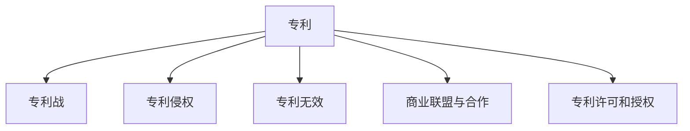

                 

# 硅谷专利战争:知识产权保护之争

> 关键词：专利战,知识产权,保护,美国,硅谷,科技公司,法律,商业策略,竞争,维权,创新,人工智能

## 1. 背景介绍

### 1.1 问题由来
随着信息技术的飞速发展，尤其是移动互联网、云计算和大数据等技术的普及，科技创新和知识产权保护问题变得越来越突出。尤其在硅谷，作为全球科技创新和知识产权纠纷的高发地带，众多科技巨头公司之间围绕专利展开了一系列激烈的争夺和诉讼，形成了闻名遐迩的“专利战争”。

硅谷专利战争不仅涉及技术层面的问题，还牵扯到复杂的法律、商业和伦理层面，折射出在技术快速迭代、市场竞争激烈的当代社会，知识产权保护和商业竞争的微妙平衡。

### 1.2 问题核心关键点
硅谷专利战争的核心关键点主要包括：

- **专利布局策略**：科技公司如何通过专利布局来构建技术壁垒和竞争优势。
- **侵权诉讼**：面对专利侵权指控，公司如何应对和反击。
- **商业联盟与合作**：在激烈的市场竞争中，公司如何通过商业联盟、专利交叉许可等方式减少专利诉讼风险。
- **专利无效挑战**：被指控侵犯专利的公司如何通过法律手段质疑专利的有效性，甚至成功将其无效化。
- **市场竞争与合作并存**：硅谷的科技公司如何在市场竞争和合作之间找到平衡。

这些关键点构成了硅谷专利战争的复杂局面，映射出知识产权保护和商业竞争的复杂关系。

### 1.3 问题研究意义
研究硅谷专利战争，对于理解知识产权保护机制在现代科技和商业环境中的实际运作，评估专利战对技术创新和市场竞争的影响，以及寻找在激烈竞争中平衡专利与创新的策略具有重要意义：

- **揭示技术竞争的隐秘规则**：专利战争揭示了科技公司在市场竞争中的隐秘策略，对于理解技术市场的运作机制提供了深入视角。
- **促进知识产权保护完善**：通过分析专利战案例，可以反思和改进现行知识产权法律和政策，提升对创新成果的保护水平。
- **指导企业战略决策**：对于即将踏入硅谷的科技公司，研究硅谷专利战争的经验教训，可以帮助其制定更有效的专利战略和市场竞争策略。
- **推动技术创新与合作**：在专利战中，一些公司通过专利共享和交叉许可，实现了技术合作与创新，这为其他企业提供了有益的借鉴。
- **引导社会公众对专利战的认识**：专利战争不仅关乎科技公司，也涉及社会公众对技术创新和知识产权保护的理解和认识，有助于提升社会对专利法律和政策的支持。

## 2. 核心概念与联系

### 2.1 核心概念概述

为更好地理解硅谷专利战争，本节将介绍几个密切相关的核心概念：

- **专利**：法律规定的权利，保护发明人对其创新的独占使用权。
- **专利战**：科技公司之间围绕专利展开的诉讼和竞争行为。
- **知识产权**：包括专利、商标、版权等多种形式的法律保护，保障创新成果的商业价值。
- **技术壁垒**：通过专利布局构建的技术屏障，防止竞争对手复制和改进。
- **专利侵权**：未经授权使用他人专利的行为，通常导致法律诉讼和巨额赔偿。
- **专利无效**：对专利法律效力进行质疑，寻求将其无效化的法律程序。
- **商业联盟与合作**：通过签署专利交叉许可协议，公司之间实现专利资源的共享和互惠。
- **专利许可和授权**：公司通过授权他人使用其专利，获取商业回报。

这些核心概念之间的逻辑关系可以通过以下Mermaid流程图来展示：



这个流程图展示出专利与专利战争之间紧密联系，专利侵权、专利无效、商业联盟与合作等概念构成了专利战争的各个维度。

## 3. 核心算法原理 & 具体操作步骤
### 3.1 算法原理概述

硅谷专利战争的算法原理基于法律和商业战略的组合。科技公司通过一系列策略，构建专利壁垒，保护自己不被侵犯，同时寻找机会反击竞争对手。核心算法原理包括：

- **专利布局策略**：选择战略性地申请和公开专利，构建起覆盖关键技术的专利网络。
- **侵权检测与诉讼**：通过技术监控和分析，识别可能的侵权行为，并通过法律手段进行反击。
- **商业联盟与合作**：签订交叉许可协议，共享专利资源，降低诉讼风险。
- **专利无效挑战**：通过法律途径，对竞争对手的专利有效性提出质疑，降低其专利壁垒。

这些策略共同构成了硅谷专利战争的算法基础，帮助公司在激烈的市场竞争中保护和利用专利资源。

### 3.2 算法步骤详解

硅谷专利战争的算法步骤可以总结如下：

**Step 1: 战略专利布局**
- 确定核心技术，制定专利布局策略。
- 申请专利，并在公开文献中战略性地披露专利信息。
- 持续跟踪科技发展动态，及时调整专利布局策略。

**Step 2: 专利侵权检测**
- 部署监控系统，实时分析市场和竞争对手的技术动向。
- 对可能侵犯自己专利的行为进行记录和初步评估。
- 必要时展开法律调查，获取侵权证据。

**Step 3: 专利侵权诉讼**
- 根据侵权证据，制定诉讼策略。
- 通过法律途径提起专利侵权诉讼，寻求赔偿或禁止令。
- 在诉讼过程中，采取和解谈判、专利交叉许可等手段，争取和解。

**Step 4: 商业联盟与合作**
- 与竞争对手或潜在的合作伙伴，签订专利交叉许可协议。
- 共享专利资源，降低专利诉讼风险。
- 建立合作联盟，提升技术生态系统的整体竞争力。

**Step 5: 专利无效挑战**
- 对竞争对手的专利提出无效申请。
- 收集证据，证明竞争对手的专利存在技术缺陷或违反法律规定。
- 通过法院程序，成功使竞争对手的专利无效化。

通过这些步骤，科技公司能够在硅谷激烈的市场竞争中，有效利用专利资源，保护和扩大自己的市场份额。

### 3.3 算法优缺点

硅谷专利战争的算法具有以下优点：

- **战略防御与进攻并举**：通过战略专利布局和专利无效挑战，科技公司能够有效防御自身专利被侵犯，同时寻找机会攻击竞争对手。
- **降低诉讼成本**：通过专利交叉许可和商业联盟，公司可以降低专利诉讼的风险和成本。
- **促进技术合作**：通过共享专利资源，科技公司可以更快地技术迭代，推动创新发展。

然而，专利战争也存在一些缺点：

- **法律复杂度高**：专利战涉及复杂的法律程序和条款，对公司的法律团队要求高。
- **高昂的诉讼成本**：专利战成本高昂，且不确定性大，对公司的财务状况构成较大压力。
- **可能损害技术创新**：过度的专利战可能抑制技术创新，阻碍市场竞争的健康发展。
- **影响市场信任**：频繁的专利诉讼和冲突可能损害公司间的信任，影响长期合作和市场生态。

### 3.4 算法应用领域

硅谷专利战争的算法应用主要集中在高科技行业，包括但不限于：

- **电子信息**：如半导体、芯片、移动通信等领域。
- **生物医药**：如基因工程、新药研发等领域。
- **软件和互联网**：如云计算、大数据、人工智能等领域。
- **汽车和航空**：如智能驾驶、新能源等领域。
- **能源和材料**：如可再生能源、新能源材料等领域。

在这些领域，由于技术更新快、市场竞争激烈，专利战成为公司保护自身技术、攻击竞争对手的重要手段。

## 4. 数学模型和公式 & 详细讲解 & 举例说明

### 4.1 数学模型构建

在硅谷专利战争的背景下，专利侵权诉讼、专利无效挑战等过程可以通过数学模型来量化和分析。以下我们以专利侵权诉讼为例，构建数学模型：

设原告的专利价值为 $P$，被告的侵权行为带来的经济损失为 $L$，专利诉讼成本为 $C$，胜诉后获得的赔偿为 $D$，则专利侵权诉讼的期望利润为：

$$
E = \frac{1}{2}(P+L)-C-D
$$

其中 $\frac{1}{2}$ 表示诉讼结果的随机性，即原告胜诉和败诉的概率各为 $0.5$。

### 4.2 公式推导过程

专利侵权诉讼的期望利润模型可以通过简单推导得到：

设原告胜诉的概率为 $p$，败诉的概率为 $1-p$，则胜诉后原告的期望利润为：

$$
E_{\text{win}} = pD - C
$$

败诉后原告的期望利润为：

$$
E_{\text{lose}} = (1-p)(-P) - C
$$

原告的期望利润为两者加权平均：

$$
E = \frac{1}{2}E_{\text{win}} + \frac{1}{2}E_{\text{lose}} = \frac{1}{2}(pD - C) + \frac{1}{2}((1-p)(-P) - C)
$$

化简得：

$$
E = \frac{1}{2}(P+L)-C-D
$$

### 4.3 案例分析与讲解

以下我们以IBM诉苹果公司（IBM v. Apple）的案例为例，分析专利侵权诉讼的数学模型：

- **专利价值 $P$**：IBM对苹果公司专利诉讼索赔的金额。
- **侵权损失 $L$**：苹果公司因侵权行为可能带来的市场损失。
- **诉讼成本 $C$**：IBM为专利诉讼支付的律师费、诉讼费等。
- **赔偿 $D$**：胜诉后，IBM可能获得的赔偿金额。

假设IBM胜诉的概率为 $p=0.6$，败诉的概率为 $1-p=0.4$，赔偿金额 $D=2000$ 万美元，其他成本 $C=500$ 万美元，则IBM的期望利润为：

$$
E = \frac{1}{2}(2000+2000)-500-2000 = 200 - 500 = -300
$$

这意味着，根据数学模型计算，IBM在这次诉讼中预计亏损 300 万美元。然而，实际情况中，IBM通过和解谈判获得了5亿美元的和解金，远超期望的损失。这一结果显示，专利战的实际过程和数学模型的计算结果存在差异。

## 5. 项目实践：代码实例和详细解释说明
### 5.1 开发环境搭建

在进行硅谷专利战争的研究时，我们需要准备开发环境。以下是使用Python进行数据分析和模型构建的环境配置流程：

1. 安装Anaconda：从官网下载并安装Anaconda，用于创建独立的Python环境。

2. 创建并激活虚拟环境：
```bash
conda create -n patent-env python=3.8 
conda activate patent-env
```

3. 安装必要的库：
```bash
conda install numpy pandas scipy matplotlib seaborn
```

4. 安装数据分析库：
```bash
pip install pandas-profiling
```

5. 安装机器学习库：
```bash
pip install scikit-learn xgboost
```

6. 安装可视化工具：
```bash
pip install plotly
```

完成上述步骤后，即可在`patent-env`环境中开始专利战的研究和分析。

### 5.2 源代码详细实现

下面是一个简单的Python代码示例，用于分析和可视化专利战中不同因素对期望利润的影响：

```python
import numpy as np
import pandas as pd
import matplotlib.pyplot as plt
import seaborn as sns

# 定义参数
p = 0.6  # 胜诉概率
D = 2000  # 赔偿金额
C = 500  # 诉讼成本

# 计算期望利润
E = (p * D - C) + (1 - p) * (-P - C)

# 创建数据框
data = pd.DataFrame({
    '专利价值': np.linspace(0, 10000, 100),
    '赔偿金额': np.linspace(0, 10000, 100),
    '诉讼成本': np.linspace(0, 10000, 100)
})

# 计算期望利润
data['期望利润'] = E

# 绘制散点图
sns.scatterplot(data=data, x='专利价值', y='期望利润')
plt.title('专利战期望利润分析')
plt.xlabel('专利价值')
plt.ylabel('期望利润')
plt.show()
```

### 5.3 代码解读与分析

让我们再详细解读一下关键代码的实现细节：

**数据分析**：
- 使用numpy生成线性空间的专利价值、赔偿金额和诉讼成本数据。
- 计算期望利润，创建数据框。
- 使用seaborn绘制散点图，可视化专利价值对期望利润的影响。

**数学模型应用**：
- 通过数学模型计算期望利润，分析不同参数对期望利润的影响。
- 使用可视化工具绘制散点图，直观展示专利战中关键因素的相互关系。

**代码优化**：
- 通过合理的数据生成和模型计算，简洁实现专利战期望利润的分析和可视化。
- 使用seaborn等高级可视化工具，提升数据展示效果。

## 6. 实际应用场景
### 6.1 专利布局与防御

大公司通常会制定战略性专利布局计划，以构建技术壁垒，防御竞争对手的攻击。例如：

- **专利密集区**：如高通公司在通信领域拥有大量的专利，形成技术垄断。
- **先发优势**：如苹果公司在早期申请大量与智能手机相关的专利，形成专利壁垒。
- **专利交叉许可**：如微软与谷歌签订专利交叉许可协议，降低专利诉讼风险。

这些策略有助于公司在激烈的市场竞争中保护自身技术，减少侵权诉讼的风险。

### 6.2 专利侵权检测

科技公司通常会部署专利监控系统，实时分析市场和竞争对手的技术动向，防止专利侵权行为的发生。例如：

- **市场监控**：通过爬虫和网络爬取技术公开文献和专利信息，实时监控市场动向。
- **竞争对手分析**：通过数据分析，识别潜在的侵权行为，制定应对方案。
- **法律预警**：在发现可能侵权行为后，及时启动法律程序，进行权利保护。

这些监控和预警机制能够帮助公司及时发现并应对专利侵权行为，减少可能的法律风险和经济损失。

### 6.3 专利侵权诉讼

面对专利侵权指控，公司通常会通过以下步骤进行反击：

- **调查取证**：收集侵权证据，确认侵权事实。
- **法律程序**：通过专利侵权诉讼，寻求赔偿或禁止令。
- **和解谈判**：在诉讼过程中，采取和解谈判、专利交叉许可等手段，争取和解。

例如，高通公司在智能手机市场面临多起专利侵权诉讼，通过一系列法律程序和专利反击，成功获得大额赔偿。

### 6.4 专利无效挑战

科技公司通过以下步骤挑战竞争对手的专利有效性：

- **证据收集**：收集证据，证明竞争对手的专利存在技术缺陷或违反法律规定。
- **法律程序**：通过专利无效程序，向法院提起诉讼。
- **无效结果**：成功使竞争对手的专利无效化，降低其专利壁垒。

例如，三星公司曾成功挑战苹果公司多项专利，通过专利无效诉讼，削弱了苹果公司的专利防御能力。

### 6.5 商业联盟与合作

科技公司通过以下方式构建商业联盟与合作：

- **签署交叉许可协议**：公司之间签署专利交叉许可协议，共享专利资源。
- **技术共享平台**：建立技术共享平台，促进技术合作和创新。
- **联合研发**：通过联合研发，提升技术水平和市场竞争力。

例如，英特尔和微软签署了多项交叉许可协议，共享专利资源，降低专利诉讼风险。

## 7. 工具和资源推荐
### 7.1 学习资源推荐

为了帮助开发者系统掌握硅谷专利战争的理论基础和实践技巧，这里推荐一些优质的学习资源：

1. **《硅谷法脉》**：由知名科技法律专家撰写，深入剖析硅谷专利战争的法律和商业策略。
2. **《专利法原理与应用》**：国内法律学者撰写的经典著作，详细讲解专利法的基础知识和应用案例。
3. **《专利战案例分析》**：精选硅谷专利战典型案例，分析其中的法律、商业和科技要素。
4. **《科技公司专利战略》**：介绍科技公司专利布局、专利侵权诉讼等实战策略。
5. **《商业联盟与合作》**：分析商业联盟、专利交叉许可等合作模式的优点和策略。
6. **《技术专利与市场竞争》**：讨论技术专利与市场竞争的关系，以及如何在竞争中运用专利策略。

通过对这些资源的学习实践，相信你一定能够快速掌握硅谷专利战争的精髓，并用于解决实际的知识产权保护问题。

### 7.2 开发工具推荐

高效的开发离不开优秀的工具支持。以下是几款用于硅谷专利战争开发的常用工具：

1. **PATent**：专业专利信息查询工具，能够快速检索和分析专利数据。
2. **PatentMap**：提供专利地图和可视化工具，帮助企业分析专利布局和竞争态势。
3. **PatentScout**：结合专利监控和分析功能，帮助企业实时监控市场和技术动向。
4. **PatentAdvisor**：提供专利无效挑战和诉讼策略的专家咨询和工具支持。
5. **PatentAtlas**：提供专利资产管理和分析工具，帮助企业评估专利价值和投资回报。

合理利用这些工具，可以显著提升硅谷专利战争的开发效率，加快创新迭代的步伐。

### 7.3 相关论文推荐

硅谷专利战争的发展源于学界的持续研究。以下是几篇奠基性的相关论文，推荐阅读：

1. **《硅谷的专利战争：创新与法律的博弈》**：分析硅谷专利战争的法律和商业背景，探讨其中的博弈关系。
2. **《科技公司专利战略研究》**：通过大量案例分析，揭示科技公司在专利战中的战略选择和效果。
3. **《专利战的数学模型与应用》**：使用数学模型分析专利战中的期望利润和决策过程。
4. **《专利侵权诉讼与和解谈判》**：探讨专利侵权诉讼和解谈判的策略和步骤，提供案例分析。
5. **《商业联盟与合作》**：研究专利交叉许可和商业联盟模式，分析其优缺点和应用策略。

这些论文代表了大专利战争的发展脉络。通过学习这些前沿成果，可以帮助研究者把握学科前进方向，激发更多的创新灵感。

## 8. 总结：未来发展趋势与挑战
### 8.1 总结

本文对硅谷专利战争进行了全面系统的介绍。首先阐述了专利战争的背景和核心关键点，明确了专利战在现代科技和商业环境中的重要地位。其次，从原理到实践，详细讲解了专利战的数学模型和操作步骤，给出了专利战任务开发的完整代码实例。同时，本文还广泛探讨了专利战在专利布局、专利侵权检测、专利侵权诉讼、专利无效挑战、商业联盟与合作等多个行业领域的应用前景，展示了专利战范式的广泛适用性。此外，本文精选了专利战技术的各类学习资源，力求为读者提供全方位的技术指引。

通过本文的系统梳理，可以看到，硅谷专利战争不仅关乎法律和商业，还涉及到技术创新和市场竞争的微妙平衡。专利战的算法策略和实践经验，为科技公司提供了宝贵的借鉴和参考。

### 8.2 未来发展趋势

展望未来，硅谷专利战争的算法将呈现以下几个发展趋势：

1. **数据驱动与AI辅助**：通过大数据分析和机器学习技术，提高专利战策略的精确性和效率。
2. **自动化专利监控**：利用AI技术，自动化监控市场和竞争对手的技术动向，提升专利战的实时性和准确性。
3. **区块链技术的应用**：引入区块链技术，增强专利交易和许可的透明度和可信度。
4. **跨国专利战略**：随着全球化的发展，跨国专利布局和策略将成为新的重要方向。
5. **智能合约与自动化执行**：利用智能合约技术，实现专利许可和转让的自动化执行，降低法律和商业风险。
6. **多边专利联盟**：建立跨公司和跨领域的专利联盟，提升技术生态系统的整体竞争力。

这些趋势展示了专利战技术的未来发展方向，将推动硅谷乃至全球专利战的策略和实践不断进步。

### 8.3 面临的挑战

尽管硅谷专利战争在技术和管理上取得了显著进展，但在迈向更加智能化、全球化的未来过程中，它仍面临诸多挑战：

1. **法律环境的不确定性**：专利法律和政策的不确定性可能影响专利战的长期规划和策略。
2. **技术创新的快速迭代**：技术快速迭代带来的专利变化，增加了专利战的复杂性和不确定性。
3. **跨国法律的复杂性**：跨国专利战涉及多国法律，增加了复杂性和协调难度。
4. **知识产权纠纷的解决**：专利战中的法律纠纷和诉讼过程，可能耗费大量时间和资源。
5. **技术专利的安全性**：如何在专利战中保护技术安全，防止核心技术被侵犯或泄漏。
6. **专利资源的分配**：如何在全球范围内合理分配专利资源，平衡公司间的利益。

这些挑战需要学界、企业和法律界共同努力，才能在未来的专利战中取得更好的效果。

### 8.4 研究展望

面对硅谷专利战争所面临的挑战，未来的研究需要在以下几个方面寻求新的突破：

1. **法律与技术结合**：探索法律与技术深度融合的途径，提升专利战的效率和效果。
2. **人工智能辅助决策**：利用AI技术，优化专利战的策略和决策过程，提高智能化水平。
3. **国际合作与协调**：加强跨国专利战的合作与协调，推动全球专利生态系统的健康发展。
4. **技术创新的知识产权保护**：研究如何更好地保护技术创新成果，避免专利战对技术创新的抑制。
5. **专利战伦理与安全**：研究如何在专利战中保障技术安全、伦理规范和公共利益。
6. **可持续的专利战略**：探索可持续的专利战略，平衡创新与竞争，实现共赢发展。

这些研究方向的探索，必将引领硅谷专利战技术迈向更高的台阶，为构建更公平、更健康的专利生态系统提供新的思路。

## 9. 附录：常见问题与解答

**Q1：专利战对企业创新有负面影响吗？**

A: 专利战在一定程度上可能抑制企业的技术创新，特别是在高度竞争的市场环境中。过度的法律纠纷和诉讼可能耗费大量时间和资源，影响企业的研发投入和技术迭代。然而，有效的专利战策略，如专利交叉许可和商业联盟，也可以在保护企业利益的同时，促进技术合作和创新。

**Q2：专利战是否会影响企业的市场信任？**

A: 频繁的专利诉讼和冲突可能损害企业间的信任，影响长期合作和市场生态。为了避免这种情况，企业应该遵守商业道德，尊重知识产权，通过透明和公正的法律程序解决纠纷。同时，企业也可以建立专利共享平台，促进技术合作和创新，增强市场信任。

**Q3：专利战的胜负如何决定？**

A: 专利战的胜负取决于多种因素，包括专利的效力、侵权证据的强弱、法律程序的复杂性、法律团队的实力等。通过合理的策略和团队协作，企业可以提升专利战的胜算。同时，专利无效挑战和商业联盟等手段，也可以帮助企业获得优势。

**Q4：如何应对跨国专利战？**

A: 跨国专利战涉及多国法律，企业需要具备全球化的视角和策略。可以通过建立国际法律团队，了解不同国家的法律环境和专利制度。同时，企业可以参与国际专利联盟，增强国际竞争力，平衡不同国家的利益。

**Q5：如何在专利战中保护核心技术？**

A: 企业可以通过专利密集区、先发优势和智能合约等手段，保护核心技术不被侵犯。同时，企业也可以加强技术保密和访问控制，确保核心技术的安全性。

通过这些常见问题的解答，相信你能够更好地理解硅谷专利战争的复杂性和挑战，并找到应对之道。

