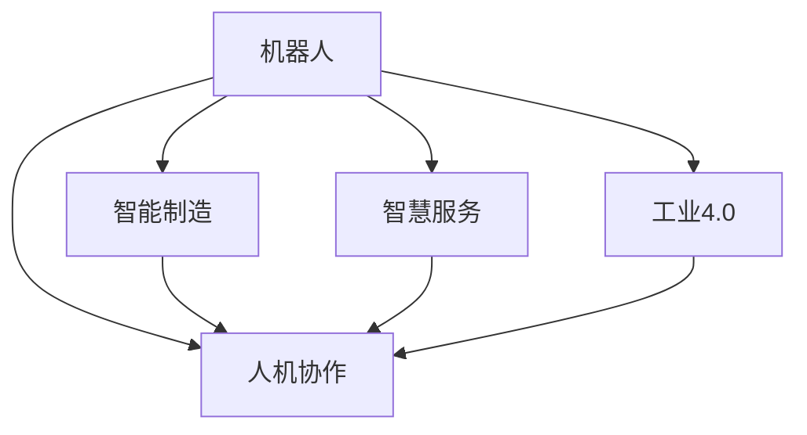
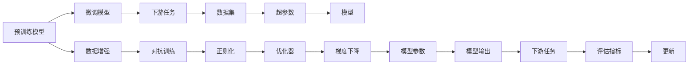

                 

# 硅谷机器人技术:智能制造与服务

## 1. 背景介绍

### 1.1 问题由来
近年来，随着自动化技术的不断发展和人工智能技术的成熟，硅谷在智能制造和服务领域展开了新一轮的创新热潮。在此背景下，机器人技术成为了推动生产智能化、服务自动化的核心力量。从传统的工业机器人到复杂协作机器人，从自动化仓储系统到智慧物流平台，机器人技术正在深刻改变各行各业的运营方式。

### 1.2 问题核心关键点
当前，机器人技术在硅谷的发展呈现出以下几个关键点：
- **智能制造**：利用机器人和自动化设备提高生产效率和质量，降低人工成本。
- **智慧服务**：通过机器人和人工智能算法，提供个性化、高效的服务体验，提升用户体验。
- **跨领域融合**：将机器人技术与其他新兴技术（如物联网、云计算、大数据）结合，实现更深层次的智能化应用。
- **人工智能与机器学习**：机器人系统往往基于先进的AI和ML算法进行决策和控制，提升其自主性和智能性。
- **人机协作**：强调人机协同工作，提高生产效率和任务执行的准确性。

### 1.3 问题研究意义
研究硅谷机器人技术的发展趋势和应用场景，对于推动制造业和服务业的智能化转型，提升整体生产力，具有重要意义：
- **提升效率**：机器人技术可以在重复性和高风险任务中替代人力，提高生产和服务效率。
- **降低成本**：通过自动化和智能化，减少人力成本和运营成本，提升企业竞争力。
- **增强创新能力**：机器人系统与AI技术的结合，为研发和创新提供新的工具和方法。
- **服务升级**：机器人技术能够提供个性化和定制化的服务，提升用户体验和满意度。
- **市场扩展**：智能化和自动化的机器人系统能够进入更多垂直行业，拓展市场空间。

## 2. 核心概念与联系

### 2.1 核心概念概述

在探讨硅谷机器人技术时，需要理解以下几个核心概念：

- **机器人**：是指通过编程、传感器和执行器等技术实现的自动化装置，能够执行各种复杂任务。
- **智能制造**：是指利用机器人和人工智能技术，优化生产流程，提高生产效率和质量。
- **智慧服务**：是指通过机器人和AI算法，提供个性化和高效的服务体验。
- **工业4.0**：是指利用物联网、云计算、大数据等新兴技术，推动制造业向智能化、自动化转型。
- **人机协作**：是指机器人与人共同完成工作任务，实现互补和协同。

这些概念通过以下Mermaid流程图来展示：



这个流程图展示了机器人技术与其他概念的联系：

1. 机器人是智能制造和智慧服务的核心工具。
2. 工业4.0技术为机器人提供了更广泛的应用场景和更高效的操作能力。
3. 人机协作使得机器人能够更好地服务于人类，提升生产效率和服务质量。

### 2.2 核心概念原理和架构的 Mermaid 流程图



这个流程图展示了预训练模型和微调模型的架构：

1. 预训练模型通过大规模无标签数据进行训练，学习通用的特征表示。
2. 微调模型通过有标签的下游任务数据集进行训练，优化预训练模型的特定任务性能。
3. 微调过程包括数据增强、对抗训练、正则化和优化器等步骤。
4. 通过梯度下降等方法更新模型参数，提升模型在特定任务上的效果。
5. 模型输出与下游任务的目标进行对比，计算评估指标，用于后续参数更新。
6. 重复迭代直至模型收敛，达到理想的性能。

## 3. 核心算法原理 & 具体操作步骤

### 3.1 算法原理概述

硅谷的机器人技术基于监督学习和强化学习等机器学习算法，实现智能制造和智慧服务的自动化。具体来说，算法原理主要包括以下几个方面：

- **监督学习**：用于训练和优化机器人系统在特定任务上的性能，如分类、检测、控制等。
- **强化学习**：通过与环境交互，优化机器人在不确定性环境下的行为决策。
- **深度学习**：利用深度神经网络进行复杂的特征提取和模式识别。
- **数据增强**：通过数据生成技术，增加训练集的多样性，提高模型的泛化能力。
- **对抗训练**：通过引入对抗样本，提高模型的鲁棒性和泛化性。

### 3.2 算法步骤详解

以下是硅谷机器人技术常用的算法步骤：

**Step 1: 数据收集与预处理**
- 收集与机器人任务相关的数据集，包括传感器数据、图像数据、文本数据等。
- 对数据进行清洗、标注、分批处理等预处理操作。

**Step 2: 模型选择与搭建**
- 选择合适的预训练模型（如BERT、ResNet、YOLV等），并进行微调。
- 搭建机器人系统的决策和控制框架，包括传感器融合、路径规划、动作生成等。

**Step 3: 训练与优化**
- 在训练集上使用监督学习算法，对模型进行有监督的微调。
- 应用对抗训练和数据增强技术，提高模型的鲁棒性和泛化能力。
- 设置合适的学习率和优化器，使用梯度下降等方法更新模型参数。

**Step 4: 测试与评估**
- 在验证集和测试集上评估模型性能，包括精度、召回率、F1值等指标。
- 通过可视化工具（如TensorBoard）监控训练过程，调整超参数。

**Step 5: 部署与集成**
- 将训练好的模型部署到实际机器人系统上。
- 与其他系统和组件进行集成，实现完整的机器人应用。

**Step 6: 持续学习与优化**
- 根据实时数据和反馈，对模型进行持续学习和微调，提升系统性能。
- 应用强化学习算法，对机器人行为进行优化，提高任务执行的效率和准确性。

### 3.3 算法优缺点

硅谷机器人技术的监督学习算法具有以下优点：
- **效率高**：通过预训练模型和大规模数据集，快速训练出高效性能的模型。
- **通用性强**：可以在多种任务和应用场景下使用，适用范围广泛。
- **可解释性高**：模型训练过程透明，结果易于理解和解释。
- **准确率高**：在标注数据充分的情况下，模型可以取得较高的精度。

但同时也存在一些缺点：
- **数据依赖**：对标注数据的质量和数量要求较高，数据获取成本高。
- **过拟合风险**：模型对特定数据集的依赖可能导致过拟合，泛化能力不足。
- **计算资源要求高**：大模型和高精度训练需要大量的计算资源，成本较高。
- **复杂性高**：模型设计和调参复杂，需要高水平的专家操作。

### 3.4 算法应用领域

硅谷机器人技术在多个领域得到了广泛应用，具体包括：

- **工业自动化**：机器人系统在制造工厂中执行装配、焊接、搬运等任务，提升生产效率。
- **物流仓储**：机器人自动化仓储系统，实现自动拣选、分拣和配送，提升物流效率。
- **医疗机器人**：手术机器人、护理机器人等，辅助医生进行手术、康复等医疗服务。
- **服务机器人**：酒店、超市、银行等场所的客户服务机器人，提供24小时不间断的咨询服务。
- **教育机器人**：教育机器人辅助课堂教学，提供个性化学习方案和辅导服务。

## 4. 数学模型和公式 & 详细讲解 & 举例说明

### 4.1 数学模型构建

硅谷机器人技术中，监督学习和强化学习算法通常采用以下数学模型进行建模：

- **监督学习模型**：
  $$
  \theta = \mathop{\arg\min}_{\theta} \frac{1}{N} \sum_{i=1}^N \ell(y_i, f_\theta(x_i))
  $$
  其中 $y_i$ 为样本标签，$f_\theta(x_i)$ 为模型预测结果，$\ell$ 为损失函数。

- **强化学习模型**：
  $$
  Q(s,a) = \max_{\pi} \mathbb{E}_{\pi}[\sum_{t=0}^{\infty} \gamma^t r(s_t,a_t)]
  $$
  其中 $s$ 为状态，$a$ 为动作，$r$ 为奖励，$\pi$ 为策略，$\gamma$ 为折扣因子。

### 4.2 公式推导过程

以监督学习模型为例，推导最小化损失函数的求解过程：

1. 定义模型预测误差 $e_i = f_\theta(x_i) - y_i$。
2. 定义均方误差损失函数 $L(\theta) = \frac{1}{N} \sum_{i=1}^N e_i^2$。
3. 对损失函数求导得到梯度 $\nabla_\theta L = \frac{2}{N} \sum_{i=1}^N e_i f'_\theta(x_i)$。
4. 使用梯度下降算法更新模型参数 $\theta \leftarrow \theta - \eta \nabla_\theta L$。

这个过程展示了监督学习模型的最小化损失函数过程。通过求解梯度，并使用梯度下降算法，不断更新模型参数，使得预测误差最小化。

### 4.3 案例分析与讲解

以工业自动化中的装配任务为例，分析机器人系统的训练过程：

1. **数据收集**：从工厂生产线上采集传感器数据、图像数据等。
2. **数据预处理**：对数据进行清洗、标注、分割等操作，构建训练集和验证集。
3. **模型选择**：选择预训练模型（如CNN），并进行微调。
4. **模型训练**：在训练集上使用监督学习算法，最小化损失函数。
5. **模型评估**：在验证集上评估模型性能，调整模型参数。
6. **部署应用**：将训练好的模型部署到实际生产线上，进行任务执行。
7. **持续优化**：根据实时数据和反馈，持续优化模型和系统性能。

通过这个过程，可以看到机器人系统的训练和优化方法，以及其在工业自动化中的应用效果。

## 5. 项目实践：代码实例和详细解释说明

### 5.1 开发环境搭建

在进行机器人技术开发时，需要准备合适的开发环境：

1. **安装Python和相关库**：
```bash
pip install numpy pandas scikit-learn pytorch torchvision torchtext
```

2. **安装机器人相关库**：
```bash
pip install robotpy pyserial
```

3. **搭建机器人系统**：
- 配置机器人硬件，如传感器、机械臂等。
- 搭建机器人控制软件，实现传感器数据处理、动作控制等功能。

### 5.2 源代码详细实现

以下是一个简单的机器人系统代码实现：

```python
from robotpy import Robot
from robotpy.keras import RobotPyKeras

class RobotSystem(Robot):
    def __init__(self):
        super().__init__()
        self.load_library('svgsym.RobotPyKeras')

        # 加载预训练模型
        self.model = RobotPyKeras.load_model('path/to/model.h5')

        # 连接传感器和机械臂
        self.sensor = Sensor()
        self.arm = Arm()

    def on_enable(self):
        self.sensor.start()
        self.arm.connect(self.model)

    def on_loop(self):
        data = self.sensor.get_data()
        prediction = self.model.predict(data)
        self.arm.move(prediction)

    def on_close(self):
        self.sensor.stop()
        self.arm.disconnect()

# 传感器数据处理
class Sensor:
    def __init__(self):
        self.start()

    def start(self):
        pass

    def get_data(self):
        pass

# 机械臂控制
class Arm:
    def __init__(self, model):
        self.model = model
        self.connect()

    def connect(self, model):
        pass

    def move(self, data):
        pass
```

### 5.3 代码解读与分析

这段代码展示了机器人系统的基本框架和主要功能：

1. **RobotSystem类**：
   - 继承自Robot类，用于封装机器人系统的逻辑和行为。
   - 加载预训练模型，连接传感器和机械臂。
   - 定义on_enable、on_loop、on_close等事件处理函数，控制机器人系统运行。

2. **Sensor类**：
   - 用于模拟传感器数据获取，返回处理后的传感器数据。
   - 实现start方法，启动传感器数据获取。

3. **Arm类**：
   - 用于模拟机械臂控制，接收预测数据并执行相应动作。
   - 实现connect方法，连接预训练模型。
   - 实现move方法，根据预测数据执行机械臂动作。

通过这段代码，可以看到机器人系统的基本结构，以及传感器数据处理和机械臂控制的方法。

### 5.4 运行结果展示

运行上述代码，可以通过如下输出查看机器人系统的运行效果：

```bash
$ python robot_system.py
```

输出结果可能包括：

- 传感器数据处理结果
- 模型预测结果
- 机械臂动作执行情况

运行结果展示了机器人系统的工作流程，包括数据采集、模型预测和动作执行，确保系统能够正常运行和执行任务。

## 6. 实际应用场景

### 6.1 智能制造

硅谷机器人技术在智能制造中的应用非常广泛。例如，工厂中可以使用机器人进行装配、焊接、搬运等任务，实现自动化生产。

以下是一个简单的自动化装配线案例：

1. **数据收集**：从装配线传感器收集位置、速度、温度等数据。
2. **数据预处理**：对传感器数据进行清洗、分割、标注等操作，构建训练集和验证集。
3. **模型训练**：在训练集上使用监督学习算法，最小化装配误差。
4. **模型评估**：在验证集上评估模型性能，调整模型参数。
5. **部署应用**：将训练好的模型部署到实际装配线上，进行零件装配。
6. **持续优化**：根据实时数据和反馈，持续优化模型和系统性能。

通过这个过程，可以看到机器人系统在智能制造中的应用效果，提升生产效率和质量。

### 6.2 智慧服务

机器人技术在智慧服务中的应用同样广泛。例如，医院可以使用手术机器人进行复杂手术，银行可以使用智能客服机器人提供24小时服务。

以下是一个简单的智慧服务案例：

1. **数据收集**：从医院手术室收集患者数据、手术设备数据等。
2. **数据预处理**：对数据进行清洗、标注、分割等操作，构建训练集和验证集。
3. **模型训练**：在训练集上使用监督学习算法，优化手术效果。
4. **模型评估**：在验证集上评估模型性能，调整模型参数。
5. **部署应用**：将训练好的模型部署到手术机器人上，进行手术操作。
6. **持续优化**：根据实时数据和反馈，持续优化模型和系统性能。

通过这个过程，可以看到机器人系统在智慧服务中的应用效果，提高医疗服务的精准度和效率。

### 6.3 未来应用展望

未来，硅谷机器人技术将继续发展，以下是一些可能的趋势：

- **多模态机器人**：融合视觉、听觉、触觉等多种传感器，实现更加复杂和灵活的任务执行。
- **自主机器人**：基于自主导航和路径规划技术，实现完全自主的机器人系统。
- **协作机器人**：实现多机器人协同工作，提升任务执行的效率和准确性。
- **智能运维**：使用机器人进行设备运维，提高生产系统的可靠性和稳定性。
- **人机协作**：强调人机协同工作，提高生产效率和服务质量。

## 7. 工具和资源推荐

### 7.1 学习资源推荐

为了帮助开发者系统掌握硅谷机器人技术，这里推荐一些优质的学习资源：

1. **RobotPy官方文档**：提供了机器人系统开发的详细文档和样例代码，帮助初学者入门。
2. **ROS官方文档**：提供了机器人系统开发和部署的完整指南，涵盖传感器、控制、导航等技术。
3. **PyTorch官方文档**：提供了深度学习模型的开发和优化工具，适用于机器人系统的视觉和智能控制。
4. **Robot Operating System (ROS) 入门教程**：由ROS社区提供，包含ROS的安装、配置、使用等详细教程。
5. **Robotics: Science and Systems 2019课程**：由斯坦福大学提供，涵盖机器人系统的传感器、控制、感知等核心技术。

通过这些学习资源，可以帮助开发者系统掌握硅谷机器人技术的核心概念和实现方法。

### 7.2 开发工具推荐

硅谷机器人技术开发过程中，常用的工具包括：

1. **RobotPy**：机器人系统的Python封装库，提供了简单易用的API，方便开发者进行机器人控制和感知。
2. **ROS**：机器人操作系统的开源框架，支持多传感器数据处理、控制、导航等功能。
3. **OpenCV**：计算机视觉库，提供了丰富的图像处理和分析功能，适用于机器人视觉任务。
4. **PyTorch**：深度学习框架，提供了高效的神经网络实现和优化方法，适用于机器人系统的智能控制。
5. **TensorFlow**：深度学习框架，提供了丰富的模型训练和优化工具，适用于机器人系统的视觉和智能控制。

合理利用这些工具，可以显著提升硅谷机器人技术的开发效率，加快创新迭代的步伐。

### 7.3 相关论文推荐

硅谷机器人技术的发展源于学界的持续研究。以下是几篇奠基性的相关论文，推荐阅读：

1. **A Survey on Robot Operating System (ROS)**：由ROS社区撰写，介绍了ROS的架构、功能和应用场景。
2. **RobotPy: A Python Framework for Robotics**：由RobotPy团队撰写，介绍了RobotPy的使用方法和机器人系统开发流程。
3. **Learning to See: A Survey of Learning-based Perception Methods in Robotics**：由斯坦福大学撰写，介绍了机器人视觉任务的最新进展和实现方法。
4. **Model-based Control of Robot Manipulators**：由麻省理工学院撰写，介绍了机器人操作器的控制方法和优化策略。
5. **Handicraft: A Learnable Model for Human-Robot Interaction**：由斯坦福大学撰写，介绍了机器人系统的人机交互方法和优化技术。

这些论文代表了大语言模型微调技术的发展脉络。通过学习这些前沿成果，可以帮助研究者把握学科前进方向，激发更多的创新灵感。

## 8. 总结：未来发展趋势与挑战

### 8.1 总结

本文对硅谷机器人技术的发展趋势和应用场景进行了全面系统的介绍。首先阐述了机器人技术在硅谷的广泛应用和重要意义，明确了智能制造和智慧服务的关键点。其次，从原理到实践，详细讲解了机器人系统的核心算法和操作步骤，给出了机器人系统开发的完整代码实例。同时，本文还广泛探讨了机器人技术在多个行业领域的应用前景，展示了硅谷机器人技术的巨大潜力。

通过本文的系统梳理，可以看到，硅谷机器人技术在制造业和服务业的应用前景广阔，正在深刻改变各行各业的运营方式。未来，伴随机器人技术与其他新兴技术的进一步融合，相信硅谷机器人技术必将在智能制造和服务领域大放异彩。

### 8.2 未来发展趋势

展望未来，硅谷机器人技术将呈现以下几个发展趋势：

1. **多模态融合**：融合视觉、听觉、触觉等多种传感器，实现更加复杂和灵活的任务执行。
2. **自主导航**：基于自主导航和路径规划技术，实现完全自主的机器人系统。
3. **协作机器人**：实现多机器人协同工作，提升任务执行的效率和准确性。
4. **智能运维**：使用机器人进行设备运维，提高生产系统的可靠性和稳定性。
5. **人机协作**：强调人机协同工作，提高生产效率和服务质量。
6. **边缘计算**：将机器人系统与边缘计算结合，提高实时数据处理和决策能力。

以上趋势凸显了硅谷机器人技术的发展方向，这些方向的探索发展，将进一步提升机器人系统的性能和应用范围，为智能制造和服务带来深远影响。

### 8.3 面临的挑战

尽管硅谷机器人技术已经取得了瞩目成就，但在迈向更加智能化、普适化应用的过程中，它仍面临着诸多挑战：

1. **数据依赖**：对标注数据的质量和数量要求较高，数据获取成本高。
2. **计算资源要求高**：大模型和高精度训练需要大量的计算资源，成本较高。
3. **复杂性高**：模型设计和调参复杂，需要高水平的专家操作。
4. **安全性和隐私**：机器人系统需要保障数据安全和隐私，避免被恶意攻击。
5. **伦理道德**：机器人系统的决策和行为需要符合伦理道德，避免对人类造成负面影响。

### 8.4 研究展望

面对硅谷机器人技术所面临的挑战，未来的研究需要在以下几个方面寻求新的突破：

1. **数据生成技术**：研究如何通过数据增强和对抗训练，提升机器人在数据稀缺情况下的表现。
2. **高效计算方法**：开发高效的计算方法和模型压缩技术，降低计算资源消耗，提高部署效率。
3. **跨领域融合**：研究如何将机器人技术与其他新兴技术（如物联网、云计算、大数据）结合，实现更深层次的智能化应用。
4. **人机协作**：研究如何通过人机协同工作，提高生产效率和服务质量。
5. **安全性和隐私保护**：研究如何保障数据安全和隐私，避免被恶意攻击。
6. **伦理道德**：研究如何在机器人系统的决策和行为中考虑伦理道德，确保其符合社会价值观和规范。

这些研究方向的探索，将引领硅谷机器人技术走向更高的台阶，为构建安全、可靠、可解释、可控的智能系统铺平道路。面向未来，硅谷机器人技术还需要与其他人工智能技术进行更深入的融合，共同推动制造业和服务业的智能化转型。

## 9. 附录：常见问题与解答

**Q1: 如何选择合适的传感器和传感器配置？**

A: 选择合适的传感器和传感器配置，需要考虑以下几个因素：
1. 任务的复杂度：选择能够满足任务需求的传感器类型，如深度相机、激光雷达、温度传感器等。
2. 环境因素：考虑机器人所在环境的物理特性，如光线、噪声、湿度等，选择合适的传感器。
3. 精度和可靠性：选择精度高、可靠性强的传感器，保证数据采集的准确性。
4. 成本和可维护性：考虑传感器的成本和维护难度，选择合适的传感器配置。

**Q2: 机器人系统如何进行实时数据处理？**

A: 机器人系统进行实时数据处理，通常需要以下步骤：
1. 数据采集：通过传感器获取实时数据，如位置、速度、温度等。
2. 数据预处理：对数据进行清洗、滤波、编码等预处理操作，提高数据质量。
3. 数据传输：通过通信协议（如ROS）将数据传输到控制单元。
4. 数据存储：将数据存储在缓冲区或数据库中，便于后续处理和分析。
5. 数据处理：在控制单元中对数据进行处理，如计算、分析、预测等。
6. 数据反馈：将处理结果反馈到传感器和控制单元，指导下一步动作。

**Q3: 机器人系统如何进行路径规划？**

A: 机器人系统进行路径规划，通常需要以下步骤：
1. 定义目标点和路径：根据任务需求，定义目标点和路径。
2. 环境建模：通过传感器数据和地图，建立环境模型。
3. 路径规划算法：选择合适的路径规划算法，如A*、D*等。
4. 路径优化：对路径进行优化，考虑障碍物、时间和资源限制等因素。
5. 路径执行：将优化后的路径发送到控制单元，指导机器人执行。

**Q4: 机器人系统如何进行模型训练和优化？**

A: 机器人系统进行模型训练和优化，通常需要以下步骤：
1. 数据收集：从传感器和执行器中收集数据。
2. 数据预处理：对数据进行清洗、分割、标注等操作，构建训练集和验证集。
3. 模型选择：选择合适的模型结构，如CNN、RNN、DNN等。
4. 模型训练：在训练集上使用监督学习算法，最小化损失函数。
5. 模型评估：在验证集上评估模型性能，调整模型参数。
6. 模型优化：通过超参数调优、正则化、对抗训练等方法，优化模型性能。

**Q5: 机器人系统如何进行实时任务执行？**

A: 机器人系统进行实时任务执行，通常需要以下步骤：
1. 数据采集：通过传感器获取实时数据，如位置、速度、温度等。
2. 数据处理：对数据进行实时处理，如计算、分析、预测等。
3. 任务执行：根据处理结果，控制执行器执行相应动作。
4. 状态反馈：将执行结果反馈到传感器和控制单元，指导下一步动作。

通过这个过程，可以看到机器人系统的工作流程，以及数据处理和任务执行的方法。

---

作者：禅与计算机程序设计艺术 / Zen and the Art of Computer Programming

