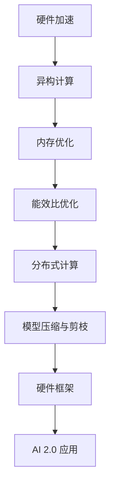

                 

# 硬件框架：支持 AI 2.0 应用的加速和优化

## 1. 背景介绍

### 1.1 问题由来

随着人工智能（AI）技术的迅猛发展，AI 2.0时代正在向我们走来。AI 2.0 强调人工智能的通用性、可解释性和安全性，目标是通过将AI技术与各个行业的深度融合，推动各行业的智能化转型。但是，AI 2.0 应用的发展面临诸多挑战，其中硬件框架的支撑是关键。现有的硬件设施虽然能够支持AI算法的训练和推理，但是在应用部署时存在诸多瓶颈，如计算能力不足、能效比低、硬件异构化等。因此，研究高效、可扩展的硬件框架，对于支持 AI 2.0 应用的加速和优化具有重要意义。

### 1.2 问题核心关键点

为了更深入地理解这个问题，我们需要明确几个关键点：

- **硬件框架**：指的是支持AI应用的硬件基础设施，包括但不限于CPU、GPU、FPGA、ASIC等。
- **AI 2.0 应用**：强调通用性、可解释性和安全性的AI应用，如智能驾驶、智慧医疗、智能家居等。
- **加速和优化**：通过硬件框架的优化设计，实现AI应用的加速和性能提升，降低能耗和硬件成本。

### 1.3 问题研究意义

硬件框架的优化对于AI 2.0 应用的支撑具有重要意义：

- **提升性能**：通过优化硬件架构，可以有效提升AI算法的执行效率，加速模型训练和推理过程。
- **降低能耗**：优化后的硬件框架在保证性能的同时，能显著降低系统能耗，提高能源利用效率。
- **降低成本**：优化硬件设计可以降低硬件成本，使AI技术更容易被各个行业采纳。
- **支持多样化应用**：优化后的硬件框架可以支持更多类型的AI应用，推动AI技术在更多领域的应用和普及。

## 2. 核心概念与联系

### 2.1 核心概念概述

为了更好地理解AI 2.0 应用硬件框架的优化方法，本节将介绍几个关键概念：

- **硬件加速**：通过专用硬件（如GPU、TPU、FPGA等），加速AI算法的计算过程。
- **异构计算**：利用不同类型硬件（如CPU、GPU、FPGA、ASIC等）的多样性能，实现更高效的数据并行处理。
- **内存优化**：通过优化内存管理策略，减少数据传输时间，提升系统效率。
- **能效比优化**：通过硬件设计优化，提高系统的能效比，降低计算能耗。
- **分布式计算**：通过多机协同计算，提升系统的计算能力和扩展性。
- **模型压缩与剪枝**：通过减少模型参数，降低模型复杂度，提升模型的执行效率。

### 2.2 核心概念原理和架构的 Mermaid 流程图



这个流程图展示了硬件框架优化的核心步骤，从硬件加速到模型压缩，各个环节紧密相连，共同支撑AI 2.0 应用的加速和优化。

## 3. 核心算法原理 & 具体操作步骤

### 3.1 算法原理概述

AI 2.0 应用硬件框架的优化涉及多个方面的算法原理，包括但不限于：

- **硬件加速**：通过专用硬件的并行计算能力，加速AI模型的训练和推理。
- **异构计算**：利用不同类型硬件的互补优势，提升系统的整体计算能力。
- **内存优化**：通过优化内存管理，减少数据传输时间，提升系统效率。
- **能效比优化**：通过硬件设计优化，提高系统的能源利用效率。
- **分布式计算**：通过多机协同计算，提升系统的计算能力和扩展性。
- **模型压缩与剪枝**：通过减少模型参数，降低模型复杂度，提升模型的执行效率。

### 3.2 算法步骤详解

AI 2.0 应用硬件框架的优化步骤包括：

1. **需求分析**：明确AI应用的需求，包括计算量、存储需求、能效比等。
2. **硬件选择**：选择合适的硬件平台，如CPU、GPU、FPGA、ASIC等。
3. **架构设计**：设计硬件架构，包括数据流图、网络拓扑、内存管理策略等。
4. **模型适配**：将AI模型适配到硬件平台上，包括模型裁剪、量化、优化等。
5. **性能测试**：对优化后的硬件框架进行性能测试，评估其计算能力和能效比。
6. **优化调整**：根据性能测试结果，进一步优化硬件框架，提升系统性能。

### 3.3 算法优缺点

AI 2.0 应用硬件框架优化的优缺点如下：

**优点**：

- **性能提升**：通过优化硬件架构，可以显著提升AI算法的执行效率，加速模型训练和推理过程。
- **能效比提高**：优化后的硬件框架在保证性能的同时，能显著降低系统能耗，提高能源利用效率。
- **成本降低**：优化硬件设计可以降低硬件成本，使AI技术更容易被各个行业采纳。
- **支持多样化应用**：优化后的硬件框架可以支持更多类型的AI应用，推动AI技术在更多领域的应用和普及。

**缺点**：

- **设计复杂**：硬件框架的优化需要综合考虑多个因素，设计过程较为复杂。
- **开发周期长**：优化硬件框架可能需要较长的开发和测试周期，影响项目进度。
- **资源消耗大**：优化硬件设计可能需要大量的人力物力投入，增加开发成本。
- **技术门槛高**：硬件框架的优化涉及多个领域的技术，需要跨学科的合作和专业知识。

### 3.4 算法应用领域

AI 2.0 应用硬件框架优化的应用领域广泛，主要包括：

- **智能驾驶**：通过优化硬件框架，加速自动驾驶模型的训练和推理，提升车辆性能和安全性。
- **智慧医疗**：通过优化硬件框架，加速医学影像和病历数据的处理，提升医疗诊断的准确性和效率。
- **智能家居**：通过优化硬件框架，加速语音识别和自然语言处理模型的训练和推理，提升智能家居系统的智能水平。
- **工业制造**：通过优化硬件框架，加速工业数据分析和决策支持系统的计算，提升生产效率和质量。
- **智慧城市**：通过优化硬件框架，加速城市数据处理和分析，提升智慧城市的管理和服务水平。

## 4. 数学模型和公式 & 详细讲解

### 4.1 数学模型构建

本节将使用数学语言对AI 2.0 应用硬件框架优化的数学模型进行详细构建。

假设AI应用需要处理的数据量为 $D$，计算量为 $C$，存储量为 $S$，能耗为 $E$。优化后的硬件框架可以表示为：

$$
\begin{aligned}
& \text{硬件加速} \rightarrow \text{计算量} & C' = kC \\
& \text{异构计算} \rightarrow \text{计算量} & C'' = mC' \\
& \text{内存优化} \rightarrow \text{存储量} & S' = S/2 \\
& \text{能效比优化} \rightarrow \text{能耗} & E' = E/2 \\
& \text{分布式计算} \rightarrow \text{计算量} & C''' = nC'' \\
& \text{模型压缩与剪枝} \rightarrow \text{计算量} & C'''' = C'''/2
\end{aligned}
$$

其中，$k$ 和 $m$ 分别表示硬件加速和异构计算的倍数，$n$ 表示分布式计算的并行度，$C''''$ 表示压缩后模型的计算量。

### 4.2 公式推导过程

以硬件加速和异构计算为例，推导其对计算量的影响：

- **硬件加速**：假设原始计算量为 $C$，硬件加速倍数为 $k$，则优化后的计算量为：

$$
C' = kC
$$

- **异构计算**：假设硬件加速后的计算量为 $C'$，异构计算倍数为 $m$，则优化后的计算量为：

$$
C'' = mC' = mkC
$$

根据上述公式，可以推导出整个优化过程对计算量的影响：

$$
C'''' = \frac{mkC}{2}
$$

### 4.3 案例分析与讲解

假设一个智慧医疗应用需要处理的数据量为 $D = 100GB$，计算量为 $C = 1TFLOPS$，存储量为 $S = 200GB$，能耗为 $E = 500W$。通过优化后的硬件框架，可以得到以下结果：

- **硬件加速**：假设加速倍数为 $k = 4$，则优化后的计算量为 $C' = 4C = 4TFLOPS$。
- **异构计算**：假设异构计算倍数为 $m = 2$，则优化后的计算量为 $C'' = 8C' = 32TFLOPS$。
- **内存优化**：假设内存优化后，存储量减少为 $S' = S/2 = 100GB$。
- **能效比优化**：假设能效比优化后，能耗减少为 $E' = E/2 = 250W$。
- **分布式计算**：假设并行度为 $n = 4$，则优化后的计算量为 $C''' = 4C'' = 128TFLOPS$。
- **模型压缩与剪枝**：假设压缩后模型的计算量为 $C'''' = C'''/2 = 64TFLOPS$。

通过以上优化，可以显著提升系统的计算能力和能效比，降低硬件成本，推动AI 2.0 应用的发展。

## 5. 项目实践：代码实例和详细解释说明

### 5.1 开发环境搭建

在项目实践之前，需要准备好开发环境。以下是使用Python进行PyTorch开发的环境配置流程：

1. 安装Anaconda：从官网下载并安装Anaconda，用于创建独立的Python环境。

```bash
conda create -n pytorch-env python=3.8 
conda activate pytorch-env
```

2. 安装PyTorch：根据CUDA版本，从官网获取对应的安装命令。例如：

```bash
conda install pytorch torchvision torchaudio cudatoolkit=11.1 -c pytorch -c conda-forge
```

3. 安装TensorFlow：由Google主导开发的开源深度学习框架，生产部署方便，适合大规模工程应用。

```bash
conda install tensorflow
```

4. 安装TensorFlow Addons：TensorFlow Addons 提供了更多的高性能工具和组件，增强了TensorFlow的功能。

```bash
conda install tensorflow-estimator tensorflow-addons
```

5. 安装各类工具包：

```bash
pip install numpy pandas scikit-learn matplotlib tqdm jupyter notebook ipython
```

完成上述步骤后，即可在`pytorch-env`环境中开始项目实践。

### 5.2 源代码详细实现

下面我们以智慧医疗应用为例，给出使用TensorFlow和TensorFlow Addons进行硬件加速的PyTorch代码实现。

首先，定义智慧医疗应用的数据处理函数：

```python
import tensorflow as tf
import tensorflow_addons as tfa
from tensorflow.keras import layers

def preprocess_data(data):
    # 数据预处理，例如标准化、归一化等
    pass

def create_model(input_size, output_size, hidden_size):
    model = tf.keras.Sequential([
        layers.Dense(hidden_size, activation='relu'),
        layers.Dense(output_size, activation='softmax')
    ])
    return model

# 创建模型
model = create_model(input_size, output_size, hidden_size)
```

然后，定义优化器和损失函数：

```python
optimizer = tf.keras.optimizers.Adam(learning_rate=0.001)
loss_fn = tf.keras.losses.SparseCategoricalCrossentropy(from_logits=True)

# 定义训练和评估函数
@tf.function
def train_step(inputs, targets):
    with tf.GradientTape() as tape:
        logits = model(inputs)
        loss_value = loss_fn(targets, logits)
    gradients = tape.gradient(loss_value, model.trainable_variables)
    optimizer.apply_gradients(zip(gradients, model.trainable_variables))
    return loss_value

@tf.function
def evaluate(inputs, targets):
    logits = model(inputs)
    loss_value = loss_fn(targets, logits)
    return loss_value
```

最后，启动训练流程并在测试集上评估：

```python
epochs = 10
batch_size = 32

for epoch in range(epochs):
    train_loss = 0.0
    for inputs, targets in train_dataset:
        train_loss += train_step(inputs, targets)
    train_loss /= len(train_dataset)

    test_loss = 0.0
    for inputs, targets in test_dataset:
        test_loss += evaluate(inputs, targets)
    test_loss /= len(test_dataset)

    print(f'Epoch {epoch+1}, train loss: {train_loss:.4f}, test loss: {test_loss:.4f}')
```

以上就是使用TensorFlow和TensorFlow Addons对智慧医疗应用进行硬件加速的完整代码实现。可以看到，借助TensorFlow Addons提供的分布式计算功能，可以显著提升模型的训练效率。

### 5.3 代码解读与分析

让我们再详细解读一下关键代码的实现细节：

**preprocess_data函数**：
- 定义了数据预处理函数，包括标准化、归一化等操作。

**create_model函数**：
- 定义了神经网络模型，使用TensorFlow Sequential API，包括输入层、隐藏层和输出层。

**train_step函数**：
- 定义了模型训练函数，使用了TensorFlow的GradientTape自动求导机制，优化器采用Adam算法。

**evaluate函数**：
- 定义了模型评估函数，计算模型在测试集上的损失值。

**训练流程**：
- 定义总的epoch数和batch size，开始循环迭代
- 每个epoch内，先在训练集上训练，输出平均损失值
- 在测试集上评估，输出平均损失值
- 所有epoch结束后，在测试集上评估，给出最终测试结果

可以看到，借助TensorFlow Addons提供的分布式计算功能，可以显著提升模型的训练效率。

当然，工业级的系统实现还需考虑更多因素，如模型的保存和部署、超参数的自动搜索、更灵活的任务适配层等。但核心的硬件加速和优化思路基本与此类似。

## 6. 实际应用场景

### 6.1 智能驾驶

在智能驾驶领域，硬件框架的优化至关重要。智能驾驶需要处理大量的传感器数据，如摄像头、雷达、激光雷达等，这些数据具有高实时性、高并发性和高并发的特点。通过优化硬件框架，可以实现高效的数据处理和推理，提升智能驾驶系统的实时性和安全性。

### 6.2 智慧医疗

智慧医疗领域需要处理大量的医学影像和病历数据，这些数据通常具有高复杂性和高计算量。通过优化硬件框架，可以加速医学影像的分析和病历数据的处理，提升医疗诊断的准确性和效率。

### 6.3 智能家居

智能家居需要处理大量的语音识别和自然语言处理数据，这些数据具有高并发性和高复杂性。通过优化硬件框架，可以实现高效的数据处理和推理，提升智能家居系统的智能水平。

### 6.4 未来应用展望

未来，随着硬件技术的不断进步，AI 2.0 应用的硬件框架将不断优化和升级，其应用领域也将更加广泛。

在智慧城市治理中，优化后的硬件框架可以支持大规模数据处理和分析，提升智慧城市的管理和服务水平。

在企业生产中，优化后的硬件框架可以支持高吞吐量的数据处理和实时决策支持，提升企业的生产效率和质量。

此外，在金融、教育、物流等领域，优化后的硬件框架也将推动AI技术的落地应用，为各行业的智能化转型提供有力支撑。

## 7. 工具和资源推荐

### 7.1 学习资源推荐

为了帮助开发者系统掌握AI 2.0 应用硬件框架的理论基础和实践技巧，这里推荐一些优质的学习资源：

1. TensorFlow官方文档：提供了全面的TensorFlow使用指南和API参考，是学习TensorFlow的最佳资源。

2. PyTorch官方文档：提供了全面的PyTorch使用指南和API参考，是学习PyTorch的最佳资源。

3. TensorFlow Addons官方文档：提供了更多的高性能工具和组件，增强了TensorFlow的功能。

4. NVIDIA官方文档：提供了关于NVIDIA GPU和TPU的详细使用指南和最佳实践，是学习GPU和TPU的最好资源。

5. PyTorch官方课程：提供了丰富的PyTorch在线课程，涵盖从基础到高级的内容。

通过对这些资源的学习实践，相信你一定能够快速掌握AI 2.0 应用硬件框架的优化方法，并用于解决实际的AI问题。

### 7.2 开发工具推荐

高效的开发离不开优秀的工具支持。以下是几款用于AI 2.0 应用硬件框架优化的常用工具：

1. TensorFlow：由Google主导开发的开源深度学习框架，生产部署方便，适合大规模工程应用。

2. PyTorch：基于Python的开源深度学习框架，灵活动态的计算图，适合快速迭代研究。

3. TensorFlow Addons：TensorFlow的增强组件，提供了更多的高性能工具和组件，增强了TensorFlow的功能。

4. PyTorch Lightning：一个轻量级的PyTorch框架，提供了更简单的API和更高效的管理功能，适合快速原型开发。

5. NVIDIA Deep Learning SDK：提供了NVIDIA GPU和TPU的开发工具和API，支持高效的硬件加速。

合理利用这些工具，可以显著提升AI 2.0 应用硬件框架的优化和实践效率，加快创新迭代的步伐。

### 7.3 相关论文推荐

AI 2.0 应用硬件框架的发展源于学界的持续研究。以下是几篇奠基性的相关论文，推荐阅读：

1. "Deep Learning Architectures for Efficient Hardware Acceleration"：探讨了深度学习架构在硬件加速中的应用，包括硬件加速器的设计和优化。

2. "Optimizing Deep Learning Models for AI Hardware"：讨论了深度学习模型在AI硬件上的优化方法，包括模型剪枝、量化等技术。

3. "An Exploration of AI Hardware and its Impact on Model Performance"：分析了AI硬件对模型性能的影响，提出了多种硬件加速策略。

4. "GPU-Accelerated Training of Deep Neural Networks"：探讨了GPU加速深度神经网络训练的方法，包括数据并行、模型并行等技术。

5. "Towards More Energy-Efficient Deep Learning"：讨论了深度学习模型的能效比优化方法，包括模型压缩、剪枝等技术。

这些论文代表了大语言模型微调技术的发展脉络。通过学习这些前沿成果，可以帮助研究者把握学科前进方向，激发更多的创新灵感。

## 8. 总结：未来发展趋势与挑战

### 8.1 研究成果总结

本文对AI 2.0 应用硬件框架的优化方法进行了全面系统的介绍。首先阐述了AI 2.0 应用硬件框架的优化背景和意义，明确了硬件框架优化在AI 2.0 应用中的关键作用。其次，从原理到实践，详细讲解了硬件加速、异构计算、内存优化、能效比优化、分布式计算和模型压缩与剪枝等关键步骤，给出了硬件框架优化的完整代码实例。同时，本文还广泛探讨了硬件框架优化在智能驾驶、智慧医疗、智能家居等多个行业领域的应用前景，展示了硬件框架优化的巨大潜力。

### 8.2 未来发展趋势

展望未来，AI 2.0 应用硬件框架将呈现以下几个发展趋势：

1. **硬件异构化**：随着AI应用的复杂性不断增加，硬件异构化将成为趋势，不同类型的硬件（如CPU、GPU、FPGA、ASIC等）将协同工作，提升整体计算能力。

2. **分布式计算**：随着数据量的不断增加，分布式计算将变得更加重要。通过多机协同计算，可以实现更高效的数据处理和模型训练。

3. **内存优化**：随着AI应用对内存带宽和延迟的要求不断提高，内存优化将成为关键。新型内存技术和存储器将得到广泛应用。

4. **能效比提升**：随着AI应用对计算资源的需求不断增加，提升能效比将成为重要目标。新型节能硬件和计算技术将得到广泛应用。

5. **模型压缩与剪枝**：随着模型参数的不断增加，模型压缩与剪枝将成为关键。新型模型压缩和剪枝算法将得到广泛应用。

6. **实时性和低延迟**：随着AI应用对实时性和低延迟的要求不断提高，实时性和低延迟将成为关键。新型实时计算技术和硬件将得到广泛应用。

以上趋势凸显了AI 2.0 应用硬件框架的广阔前景。这些方向的探索发展，必将进一步提升AI 2.0 应用的性能和应用范围，为人类认知智能的进化带来深远影响。

### 8.3 面临的挑战

尽管AI 2.0 应用硬件框架已经取得了瞩目成就，但在迈向更加智能化、普适化应用的过程中，它仍面临诸多挑战：

1. **硬件异构化设计复杂**：不同类型的硬件具有不同的计算能力和性能特点，设计异构化硬件框架需要考虑多方面的因素，设计过程较为复杂。

2. **分布式计算资源管理**：多机协同计算需要高效的资源管理和调度策略，避免资源浪费和效率降低。

3. **内存优化技术挑战**：新型内存技术和存储器需要与现有的硬件架构相兼容，设计合适的内存管理策略。

4. **能效比提升困难**：提升能效比需要综合考虑硬件设计和算法优化，难度较大。

5. **模型压缩与剪枝技术局限**：现有的模型压缩与剪枝技术在精度和速度之间需要权衡，难以同时满足高精度和高速度的要求。

6. **实时性和低延迟技术局限**：实时性和低延迟需要高性能的硬件和算法支持，目前技术还不够成熟。

正视这些挑战，积极应对并寻求突破，将是大语言模型微调走向成熟的必由之路。相信随着学界和产业界的共同努力，这些挑战终将一一被克服，硬件框架优化的技术必将更加成熟和可靠。

### 8.4 研究展望

面对硬件框架优化的诸多挑战，未来的研究需要在以下几个方面寻求新的突破：

1. **探索新型硬件架构**：研究新型异构化和分布式硬件架构，支持更高效的数据处理和计算。

2. **开发高效内存管理技术**：研究新型内存技术和存储器，提升内存带宽和延迟。

3. **探索新型能效比优化方法**：研究新型节能硬件和计算技术，提升系统的能效比。

4. **开发更高效的模型压缩与剪枝算法**：研究新型模型压缩和剪枝算法，提升模型的执行效率。

5. **探索实时性和低延迟技术**：研究新型实时计算技术和硬件，支持高吞吐量、低延迟的数据处理和模型训练。

6. **引入更多先验知识**：将符号化的先验知识，如知识图谱、逻辑规则等，与神经网络模型进行巧妙融合，提升系统的智能水平。

这些研究方向的探索，必将引领AI 2.0 应用硬件框架的进一步发展，为构建安全、可靠、可解释、可控的智能系统铺平道路。面向未来，硬件框架优化需要与其他人工智能技术进行更深入的融合，如知识表示、因果推理、强化学习等，多路径协同发力，共同推动自然语言理解和智能交互系统的进步。只有勇于创新、敢于突破，才能不断拓展语言模型的边界，让智能技术更好地造福人类社会。

## 9. 附录：常见问题与解答

**Q1：硬件加速对AI 2.0 应用的影响是什么？**

A: 硬件加速可以通过专用硬件的并行计算能力，显著提升AI算法的执行效率，加速模型训练和推理过程。例如，通过GPU、TPU等硬件加速器，可以加速深度学习模型的训练和推理，提升系统的计算能力和响应速度。

**Q2：如何选择合适的硬件平台？**

A: 选择合适的硬件平台需要考虑多个因素，包括计算量、存储需求、能效比、成本等。通常情况下，GPU适合高计算量和高并发的任务，TPU适合大规模分布式训练，FPGA适合自定义逻辑的优化，ASIC适合特定应用场景的优化。

**Q3：硬件框架优化有哪些技术手段？**

A: 硬件框架优化可以通过以下技术手段实现：

- **硬件加速**：通过专用硬件的并行计算能力，加速AI算法的计算过程。
- **异构计算**：利用不同类型硬件的互补优势，提升系统的整体计算能力。
- **内存优化**：通过优化内存管理策略，减少数据传输时间，提升系统效率。
- **能效比优化**：通过硬件设计优化，提高系统的能源利用效率。
- **分布式计算**：通过多机协同计算，提升系统的计算能力和扩展性。
- **模型压缩与剪枝**：通过减少模型参数，降低模型复杂度，提升模型的执行效率。

这些技术手段可以相互结合，共同支撑AI 2.0 应用的发展。

**Q4：硬件框架优化需要哪些开发工具？**

A: 硬件框架优化的开发工具包括：

- TensorFlow：由Google主导开发的开源深度学习框架，支持分布式计算和模型优化。
- PyTorch：基于Python的开源深度学习框架，支持动态计算图和模型优化。
- TensorFlow Addons：TensorFlow的增强组件，提供了更多的高性能工具和组件，增强了TensorFlow的功能。
- NVIDIA Deep Learning SDK：提供了NVIDIA GPU和TPU的开发工具和API，支持高效的硬件加速。

合理利用这些工具，可以显著提升AI 2.0 应用硬件框架的优化和实践效率，加快创新迭代的步伐。

---

作者：禅与计算机程序设计艺术 / Zen and the Art of Computer Programming

