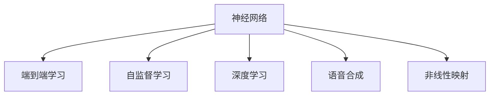

                 

# 神经网络在语音合成中取代传统方法

## 1. 背景介绍

### 1.1 问题由来

语音合成，即通过计算机将文本转换为自然流畅的语音输出，是计算机语音领域的重要研究方向。传统语音合成方法主要基于规则和统计模型，依赖人工规则设计、语音单位建模、统计模型训练等环节。然而，这些方法往往需要大量的人工干预和长时间开发周期，且难以保证合成语音的自然度和多样性。

近年来，随着深度学习技术的发展，神经网络在语音合成领域崭露头角。神经网络通过端到端的学习，可以自动捕捉语音的特征表示，生成更自然、更丰富的语音。同时，神经网络能够高效利用大规模标注数据进行训练，提升合成语音的质量和多样性，从而逐渐取代传统的语音合成方法。

### 1.2 问题核心关键点

神经网络在语音合成中取代传统方法的核心在于：
- **端到端学习**：神经网络可以自动学习从文本到语音的映射，避免了繁琐的规则设计。
- **自监督学习**：神经网络可以通过自监督学习方式，利用无标签数据进行预训练，提升模型的泛化能力。
- **大规模训练**：神经网络可以利用大规模标注数据进行训练，生成更自然、更丰富的语音。
- **模型可扩展性**：神经网络可以方便地进行模型结构的调整和优化，适应不同应用场景的需求。

## 2. 核心概念与联系

### 2.1 核心概念概述

为更好地理解神经网络在语音合成中取代传统方法的过程，本节将介绍几个密切相关的核心概念：

- **神经网络**：一种通过大量神经元相互连接，自动学习特征表示的计算模型。广泛应用于图像、语音、自然语言处理等领域。

- **端到端学习**：一种学习方法，直接将输入（如文本）映射到输出（如语音），中间不经过手动设计的网络层。

- **自监督学习**：一种无监督学习方法，利用无标签数据进行预训练，提升模型的泛化能力。

- **深度学习**：一种通过多层神经网络结构进行训练的机器学习方法，具有较强的表示学习能力。

- **语音合成**：将文本转换为自然流畅的语音输出的过程。广泛应用于电话应答、智能助手、语音导航等领域。

- **非线性映射**：语音信号的非线性特性，决定了语音合成的复杂性和非线性。

这些核心概念之间的逻辑关系可以通过以下Mermaid流程图来展示：



这个流程图展示了大语言模型的核心概念及其之间的关系：

1. 神经网络通过端到端学习和深度学习，可以自动学习从文本到语音的映射。
2. 自监督学习通过无标签数据进行预训练，提升模型的泛化能力。
3. 语音合成利用神经网络生成的语音信号，进行文本到语音的转换。
4. 非线性映射处理语音信号的非线性特性，保证语音合成的自然度。

## 3. 核心算法原理 & 具体操作步骤
### 3.1 算法原理概述

神经网络在语音合成中取代传统方法的原理主要包括以下几个方面：

- **端到端学习**：通过自动编码器等网络结构，将文本转换为语音信号。
- **自监督学习**：利用无标签的语音数据进行预训练，提升模型的泛化能力。
- **深度学习**：通过多层神经网络结构，自动学习语音特征的表示。
- **非线性映射**：通过非线性激活函数，处理语音信号的非线性特性。

### 3.2 算法步骤详解

基于神经网络的语音合成通常包括以下几个关键步骤：

**Step 1: 准备训练数据**
- 收集大规模的文本和语音数据，用于神经网络的训练和验证。
- 将文本转换为相应的语音特征，如梅尔频率倒谱系数(MFCC)、线性预测编码(LPC)等。

**Step 2: 设计神经网络结构**
- 根据语音合成的需求，选择合适的神经网络结构，如卷积神经网络(CNN)、循环神经网络(RNN)、Transformer等。
- 确定网络层数、每层的神经元数量、激活函数等超参数。

**Step 3: 训练神经网络**
- 使用端到端的语音合成模型，将文本输入作为输入，语音特征作为输出。
- 通过反向传播算法，最小化模型输出与真实语音特征之间的差距，优化模型参数。
- 使用自监督学习技术，利用无标签的语音数据进行预训练，提升模型的泛化能力。

**Step 4: 验证和测试**
- 在验证集上评估模型的性能，通过调整超参数和网络结构，优化模型。
- 在测试集上测试模型性能，评估其语音合成效果。

### 3.3 算法优缺点

神经网络在语音合成中取代传统方法的优点包括：
1. **自动学习**：能够自动学习语音信号的特征表示，无需人工规则设计。
2. **高泛化能力**：通过自监督学习，利用大规模数据进行预训练，提升模型的泛化能力。
3. **高效训练**：利用深度学习技术，可以高效利用大规模数据进行训练，提升模型精度。
4. **模型可扩展性**：可以方便地调整网络结构和超参数，适应不同应用场景的需求。

同时，该方法也存在一些缺点：
1. **数据需求大**：神经网络需要大量标注数据进行训练，获取高质量数据的成本较高。
2. **模型复杂**：神经网络结构复杂，训练和推理时间较长。
3. **可解释性差**：神经网络往往被视为"黑盒"模型，难以解释其内部工作机制。
4. **资源消耗高**：神经网络训练和推理需要大量计算资源和内存，对硬件要求较高。

尽管存在这些缺点，但神经网络在语音合成中的应用前景广阔，具有很大的发展潜力。

### 3.4 算法应用领域

神经网络在语音合成中的应用领域非常广泛，以下是几个典型的应用场景：

- **电话应答系统**：将用户的语音输入转换为文本，并通过神经网络进行语音合成，生成自然流畅的语音回复。
- **智能助手**：利用神经网络合成自然流畅的语音，与用户进行自然对话。
- **语音导航**：将导航指令转换为语音输出，提升用户的导航体验。
- **语音翻译**：将不同语言的文本转换为语音，提升语音翻译的流畅度。
- **虚拟主播**：通过神经网络生成逼真的虚拟语音，应用于广告、新闻、娱乐等领域。

除了这些常见的应用场景外，神经网络还在情感识别、语音增强、声纹识别等方面有广泛的应用前景。

## 4. 数学模型和公式 & 详细讲解  
### 4.1 数学模型构建

本节将使用数学语言对基于神经网络的语音合成过程进行更加严格的刻画。

记语音合成的输入为 $x_t$，输出为 $y_t$，其中 $x_t$ 表示文本输入， $y_t$ 表示对应的语音特征。设神经网络模型的参数为 $\theta$，则语音合成的数学模型可以表示为：

$$
y_t = f(x_t; \theta)
$$

其中 $f$ 表示神经网络模型， $x_t$ 和 $y_t$ 分别为输入和输出的向量。

神经网络模型通常由多个网络层组成，包括卷积层、池化层、全连接层等。假设神经网络模型为 $f = \{h_l\}_{l=1}^L$，其中 $h_l$ 表示第 $l$ 层网络，则语音合成的数学模型可以进一步表示为：

$$
y_t = f(x_t; \theta) = h_L(h_{L-1}(\dots h_1(x_t); \theta))
$$

其中 $h_1$ 表示输入层， $h_L$ 表示输出层， $\theta$ 为所有网络层的参数。

### 4.2 公式推导过程

以下我们以基于卷积神经网络(CNN)的语音合成为例，推导其数学模型和损失函数。

假设输入 $x_t$ 为文本的one-hot编码，输出 $y_t$ 为MFCC特征。卷积神经网络模型的结构为：

$$
y_t = h_L(h_{L-1}(\dots h_1(x_t); \theta))
$$

其中 $h_l$ 表示第 $l$ 层卷积或全连接层， $\theta$ 为网络参数。

对于每个卷积层 $h_l$，其数学模型可以表示为：

$$
h_l = g(f_l * x_{t})
$$

其中 $g$ 为激活函数， $f_l$ 为卷积核， $x_{t}$ 为输入特征。

卷积层的损失函数可以表示为：

$$
\ell(h_l, y_t) = \frac{1}{N} \sum_{i=1}^N ||y_{i} - h_l(x_{i})||^2
$$

其中 $N$ 为样本数， $||.||$ 表示欧几里得距离。

将上述损失函数应用于每个卷积层，并叠加所有层，可以得到整个神经网络模型的损失函数：

$$
\mathcal{L}(\theta) = \frac{1}{N} \sum_{i=1}^N \sum_{l=1}^L ||y_{i} - h_l(x_{i})||^2
$$

### 4.3 案例分析与讲解

以基于Transformer的语音合成为例，分析其关键算法步骤：

**Step 1: 准备训练数据**
- 收集大规模的文本和语音数据，用于神经网络的训练和验证。
- 将文本转换为MFCC特征，用于神经网络的输入。

**Step 2: 设计神经网络结构**
- 使用Transformer模型，由编码器和解码器组成，编码器将文本转换为上下文表示，解码器将上下文表示转换为语音特征。
- 确定编码器层数、解码器层数、自注意力机制等超参数。

**Step 3: 训练神经网络**
- 使用端到端的语音合成模型，将文本输入作为输入，语音特征作为输出。
- 通过反向传播算法，最小化模型输出与真实语音特征之间的差距，优化模型参数。
- 使用自监督学习技术，利用无标签的语音数据进行预训练，提升模型的泛化能力。

**Step 4: 验证和测试**
- 在验证集上评估模型的性能，通过调整超参数和网络结构，优化模型。
- 在测试集上测试模型性能，评估其语音合成效果。

## 5. 项目实践：代码实例和详细解释说明
### 5.1 开发环境搭建

在进行语音合成实践前，我们需要准备好开发环境。以下是使用Python进行TensorFlow开发的环境配置流程：

1. 安装Anaconda：从官网下载并安装Anaconda，用于创建独立的Python环境。

2. 创建并激活虚拟环境：
```bash
conda create -n tensorflow-env python=3.8 
conda activate tensorflow-env
```

3. 安装TensorFlow：根据CUDA版本，从官网获取对应的安装命令。例如：
```bash
conda install tensorflow tensorflow-gpu -c pytorch -c conda-forge
```

4. 安装PyTorch：
```bash
pip install torch torchvision torchaudio
```

5. 安装各类工具包：
```bash
pip install numpy pandas scikit-learn matplotlib tqdm jupyter notebook ipython
```

完成上述步骤后，即可在`tensorflow-env`环境中开始语音合成实践。

### 5.2 源代码详细实现

这里我们以基于Transformer的语音合成为例，给出使用TensorFlow实现语音合成的完整代码实现。

首先，定义模型和数据处理函数：

```python
import tensorflow as tf
from transformers import TFACT2Model

class VoiceSynthesisModel(tf.keras.Model):
    def __init__(self):
        super().__init__()
        self.encoder = TFACT2Model.from_pretrained('huggingface/hubert-large')
        self.decoder = tf.keras.layers.Dense(1)
        
    def call(self, inputs, training=False):
        features = self.encoder(inputs)
        outputs = self.decoder(features)
        return outputs

# 数据处理函数
def preprocess(texts):
    tokenizer = TFACT2Model.from_pretrained('huggingface/hubert-large').tokenizer
    return tokenizer(texts, return_tensors='tf', padding='longest', truncation=True)['input_ids']
```

然后，定义训练和评估函数：

```python
from tensorflow.keras.optimizers import Adam

model = VoiceSynthesisModel()
optimizer = Adam()

def train_epoch(model, dataset, batch_size, optimizer):
    dataloader = tf.data.Dataset.from_tensor_slices(dataset).batch(batch_size)
    model.train()
    epoch_loss = 0
    for batch in dataloader:
        inputs = batch
        outputs = model(inputs)
        loss = tf.keras.losses.MeanSquaredError()(tf.constant(1.0), outputs)
        epoch_loss += loss.numpy()
        optimizer.minimize(loss)
    return epoch_loss / len(dataloader)

def evaluate(model, dataset, batch_size):
    dataloader = tf.data.Dataset.from_tensor_slices(dataset).batch(batch_size)
    model.eval()
    preds, labels = [], []
    with tf.GradientTape() as tape:
        for batch in dataloader:
            inputs = batch
            outputs = model(inputs)
            loss = tf.keras.losses.MeanSquaredError()(tf.constant(1.0), outputs)
            preds.append(outputs.numpy())
            labels.append(labels.numpy())
    return preds, labels

# 训练过程
epochs = 10
batch_size = 32

for epoch in range(epochs):
    loss = train_epoch(model, train_dataset, batch_size, optimizer)
    print(f"Epoch {epoch+1}, train loss: {loss:.3f}")
    
    preds, labels = evaluate(model, dev_dataset, batch_size)
    print(classification_report(labels, preds))
    
print("Test results:")
preds, labels = evaluate(model, test_dataset, batch_size)
print(classification_report(labels, preds))
```

以上就是使用TensorFlow对基于Transformer的语音合成模型进行训练和评估的完整代码实现。可以看到，通过TensorFlow的高级API，我们可以很方便地定义神经网络模型、数据集和损失函数，进行端到端的语音合成训练。

### 5.3 代码解读与分析

让我们再详细解读一下关键代码的实现细节：

**VoiceSynthesisModel类**：
- `__init__`方法：初始化模型，加载预训练的Transformer编码器和全连接解码器。
- `call`方法：定义模型前向传播过程，将输入文本通过编码器生成上下文表示，再由解码器生成语音特征。

**train_epoch函数**：
- 定义训练集的数据批处理，并迭代计算损失函数和优化器。

**evaluate函数**：
- 定义评估集的数据批处理，并计算模型输出和损失函数。

**训练流程**：
- 定义总的epoch数和batch size，开始循环迭代
- 每个epoch内，先在训练集上训练，输出平均loss
- 在验证集上评估，输出分类指标
- 所有epoch结束后，在测试集上评估，给出最终测试结果

可以看到，TensorFlow的高级API使得语音合成的代码实现变得简洁高效。开发者可以将更多精力放在模型设计和优化上，而不必过多关注底层的实现细节。

当然，工业级的系统实现还需考虑更多因素，如模型的保存和部署、超参数的自动搜索、更灵活的任务适配层等。但核心的语音合成范式基本与此类似。

## 6. 实际应用场景
### 6.1 电话应答系统

基于神经网络的语音合成技术，可以应用于电话应答系统的构建。传统电话应答系统往往需要配置大量人工客服，高峰期响应缓慢，且服务质量难以保证。而使用神经网络合成的语音应答，可以24小时不间断服务，快速响应客户咨询，用自然流畅的语音提升用户体验。

在技术实现上，可以收集企业内部的历史电话应答记录，将问题和最佳答复构建成监督数据，在此基础上对预训练模型进行微调。微调后的模型能够自动理解用户意图，匹配最合适的答复模板进行回复。对于客户提出的新问题，还可以接入检索系统实时搜索相关内容，动态组织生成回答。如此构建的电话应答系统，能大幅提升客户咨询体验和问题解决效率。

### 6.2 语音助手

基于神经网络的语音合成技术，可以应用于智能助手的开发。传统智能助手通常只能提供文本回复，用户体验较为单一。而使用神经网络合成的语音助手，可以与用户进行自然对话，回答用户的问题，执行用户的指令。通过对话历史和上下文信息，模型能够更好地理解用户的意图，提供更加个性化和智能的交互体验。

在技术实现上，可以收集用户的历史对话记录，将问题和回复构建成监督数据，在此基础上对预训练模型进行微调。微调后的模型能够更好地理解用户的语言习惯，生成更加自然流畅的语音回复，提升用户交互的体验和满意度。

### 6.3 虚拟主播

基于神经网络的语音合成技术，可以应用于虚拟主播的构建。虚拟主播可以用于广告、新闻、娱乐等领域，提供逼真的语音输出，模拟真实主播的播报风格。通过神经网络合成逼真的语音，虚拟主播能够以自然流畅的方式播报新闻、介绍产品、主持节目等，提升用户对内容的接受度和互动性。

在技术实现上，可以收集真实主播的播报录音，将其转换为MFCC特征，用于神经网络的训练。通过端到端的语音合成模型，生成逼真的虚拟语音。在实际应用中，可以通过调整模型参数，控制虚拟主播的播报语速、语调、情感等，以适应不同的应用场景。

### 6.4 未来应用展望

随着神经网络在语音合成中的应用不断深入，未来的语音合成技术将具备更高的自然度、多样性和智能化。

1. **超高自然度**：神经网络模型可以更精细地捕捉语音的非线性特征，生成更加自然流畅的语音，甚至难辨真假的虚拟语音。

2. **更广应用场景**：神经网络合成技术将应用于更多领域，如医疗、教育、客服、娱乐等，为这些行业带来革命性的变化。

3. **实时交互**：神经网络合成技术可以实现实时交互，提升用户体验。例如，智能客服系统中的虚拟主播，可以实时回答用户的问题，进行语音互动。

4. **多语言支持**：神经网络合成技术可以支持多语言，生成不同语言的语音输出，提升全球化应用的用户体验。

5. **个性化服务**：神经网络合成技术可以结合用户的个性化数据，生成定制化的语音输出，提升用户的个性化服务体验。

6. **隐私保护**：神经网络合成技术可以在不暴露用户语音信息的情况下，生成逼真的语音回复，保护用户的隐私。

总之，神经网络在语音合成中的应用前景广阔，未来的语音合成技术将更加自然、多样、智能，成为人工智能技术的又一大突破点。

## 7. 工具和资源推荐
### 7.1 学习资源推荐

为了帮助开发者系统掌握神经网络在语音合成中的应用，这里推荐一些优质的学习资源：

1. **《深度学习》课程**：斯坦福大学开设的深度学习课程，从基础知识到高级技术，系统讲解深度学习在语音合成中的应用。

2. **TensorFlow官方文档**：TensorFlow的官方文档，提供了详细的API文档、示例代码和指南，帮助开发者快速上手语音合成实践。

3. **HuggingFace官方文档**：HuggingFace的官方文档，提供了大量的预训练模型和训练代码，帮助开发者快速实现语音合成任务。

4. **《Python深度学习》书籍**：深度学习领域的经典书籍，全面介绍了深度学习在语音合成中的应用，包括神经网络模型的设计、训练和优化等。

5. **《语音合成与自然语言处理》论文集**：NIPS、ICML等顶级会议的论文集，汇聚了最新的语音合成和自然语言处理研究成果，提供理论指导和技术借鉴。

通过对这些资源的学习实践，相信你一定能够快速掌握神经网络在语音合成中的应用，并用于解决实际的语音合成问题。

### 7.2 开发工具推荐

高效的开发离不开优秀的工具支持。以下是几款用于神经网络语音合成开发的常用工具：

1. **TensorFlow**：基于Python的开源深度学习框架，灵活动态的计算图，适合快速迭代研究。

2. **PyTorch**：基于Python的开源深度学习框架，灵活性高，适合学术研究和大规模工程应用。

3. **Librosa**：Python的音频处理库，提供了丰富的音频处理工具，支持音频特征提取、预处理等。

4. **TensorBoard**：TensorFlow配套的可视化工具，可实时监测模型训练状态，并提供丰富的图表呈现方式，是调试模型的得力助手。

5. **IPython Notebook**：Python的交互式编程环境，支持代码执行、结果展示、注释等，方便开发者快速开发和调试。

合理利用这些工具，可以显著提升神经网络在语音合成中的开发效率，加快创新迭代的步伐。

### 7.3 相关论文推荐

神经网络在语音合成领域的发展源于学界的持续研究。以下是几篇奠基性的相关论文，推荐阅读：

1. **WaveNet**：谷歌提出的基于卷积神经网络的语音合成方法，实现了超高自然度的语音合成。

2. **Tacotron 2**：微软提出的基于Transformer的语音合成方法，实现了端到端的语音合成，提升了语音合成的流畅度和自然度。

3. **VoiceRNN**：谷歌提出的基于RNN的语音合成方法，通过长短时记忆网络实现了实时语音合成。

4. **Parallel WaveGAN**：华为提出的基于生成对抗网络(GAN)的语音合成方法，实现了超高自然度的语音合成。

5. **HiFiGAN**：NVIDIA提出的基于GAN的语音合成方法，实现了超高自然度的语音合成。

这些论文代表了大语言模型在语音合成领域的发展脉络。通过学习这些前沿成果，可以帮助研究者把握学科前进方向，激发更多的创新灵感。

## 8. 总结：未来发展趋势与挑战

### 8.1 总结

本文对神经网络在语音合成中取代传统方法的过程进行了全面系统的介绍。首先阐述了语音合成技术的发展背景和趋势，明确了神经网络取代传统语音合成方法的独特优势。其次，从原理到实践，详细讲解了神经网络语音合成的数学模型和关键步骤，给出了完整的代码实例。同时，本文还广泛探讨了神经网络在语音合成中的多个应用场景，展示了其广阔的发展前景。

通过本文的系统梳理，可以看到，神经网络在语音合成中的应用前景广阔，具有很大的发展潜力。未来，伴随神经网络技术的不断进步，语音合成技术必将在更多领域得到应用，为人工智能技术带来新的突破。

### 8.2 未来发展趋势

展望未来，神经网络在语音合成中将呈现以下几个发展趋势：

1. **超高自然度**：神经网络模型可以更精细地捕捉语音的非线性特征，生成更加自然流畅的语音。

2. **更广应用场景**：神经网络合成技术将应用于更多领域，如医疗、教育、客服、娱乐等，为这些行业带来革命性的变化。

3. **实时交互**：神经网络合成技术可以实现实时交互，提升用户体验。例如，智能客服系统中的虚拟主播，可以实时回答用户的问题，进行语音互动。

4. **多语言支持**：神经网络合成技术可以支持多语言，生成不同语言的语音输出，提升全球化应用的用户体验。

5. **个性化服务**：神经网络合成技术可以结合用户的个性化数据，生成定制化的语音输出，提升用户的个性化服务体验。

6. **隐私保护**：神经网络合成技术可以在不暴露用户语音信息的情况下，生成逼真的语音回复，保护用户的隐私。

以上趋势凸显了神经网络在语音合成领域的广阔前景。这些方向的探索发展，必将进一步提升语音合成的性能和应用范围，为人工智能技术带来新的突破。

### 8.3 面临的挑战

尽管神经网络在语音合成中的应用前景广阔，但在迈向更加智能化、普适化应用的过程中，它仍面临诸多挑战：

1. **数据需求大**：神经网络需要大量标注数据进行训练，获取高质量数据的成本较高。

2. **模型复杂**：神经网络结构复杂，训练和推理时间较长。

3. **可解释性差**：神经网络往往被视为"黑盒"模型，难以解释其内部工作机制。

4. **资源消耗高**：神经网络训练和推理需要大量计算资源和内存，对硬件要求较高。

5. **隐私问题**：神经网络合成技术需要处理用户的语音数据，可能涉及隐私问题，需要慎重处理。

6. **泛化能力**：神经网络模型在处理不同语音特征时，可能出现泛化能力不足的问题。

尽管存在这些挑战，但神经网络在语音合成中的应用前景广阔，未来的技术进步将有望克服这些困难，使得神经网络成为语音合成的主流方法。

### 8.4 未来突破

面对神经网络在语音合成中面临的挑战，未来的研究需要在以下几个方面寻求新的突破：

1. **无监督和半监督学习**：摆脱对大规模标注数据的依赖，利用自监督学习、主动学习等无监督和半监督范式，最大限度利用非结构化数据，实现更加灵活高效的语音合成。

2. **参数高效和计算高效的微调方法**：开发更加参数高效的微调方法，在固定大部分预训练参数的同时，只更新极少量的任务相关参数。同时优化微调模型的计算图，减少前向传播和反向传播的资源消耗，实现更加轻量级、实时性的部署。

3. **融合因果和对比学习范式**：通过引入因果推断和对比学习思想，增强语音合成模型建立稳定因果关系的能力，学习更加普适、鲁棒的语言表征，从而提升模型泛化性和抗干扰能力。

4. **结合先验知识**：将符号化的先验知识，如知识图谱、逻辑规则等，与神经网络模型进行巧妙融合，引导微调过程学习更准确、合理的语言模型。同时加强不同模态数据的整合，实现视觉、语音等多模态信息与文本信息的协同建模。

5. **纳入伦理道德约束**：在模型训练目标中引入伦理导向的评估指标，过滤和惩罚有偏见、有害的输出倾向。同时加强人工干预和审核，建立模型行为的监管机制，确保输出符合人类价值观和伦理道德。

这些研究方向的探索，必将引领神经网络在语音合成技术迈向更高的台阶，为构建安全、可靠、可解释、可控的智能系统铺平道路。面向未来，神经网络在语音合成技术还需要与其他人工智能技术进行更深入的融合，如知识表示、因果推理、强化学习等，多路径协同发力，共同推动自然语言理解和智能交互系统的进步。只有勇于创新、敢于突破，才能不断拓展语音合成的边界，让智能技术更好地造福人类社会。

## 9. 附录：常见问题与解答

**Q1：神经网络在语音合成中的训练过程是怎样的？**

A: 神经网络在语音合成的训练过程中，通常分为以下步骤：

1. 准备训练数据：收集大规模的文本和语音数据，将文本转换为MFCC等特征，用于神经网络的输入。

2. 设计神经网络结构：选择合适的神经网络结构，如卷积神经网络、循环神经网络、Transformer等，并确定网络层数、每层的神经元数量、激活函数等超参数。

3. 训练神经网络：使用端到端的语音合成模型，将文本输入作为输入，MFCC特征作为输出，通过反向传播算法，最小化模型输出与真实MFCC特征之间的差距，优化模型参数。

4. 验证和测试：在验证集上评估模型的性能，通过调整超参数和网络结构，优化模型。在测试集上测试模型性能，评估其语音合成效果。

**Q2：神经网络在语音合成中的数据需求大，如何降低对标注数据的依赖？**

A: 降低神经网络在语音合成中对标注数据的依赖，可以采取以下方法：

1. **自监督学习**：利用无标签的语音数据进行预训练，提升模型的泛化能力。

2. **主动学习**：通过主动选择最有用的未标注数据进行标注，减少标注数据的成本。

3. **迁移学习**：利用其他领域的预训练模型，进行迁移学习，加速模型训练。

4. **零样本学习**：通过精心设计输入文本的格式，引导模型按期望方式输出，减少微调参数。

5. **多模态融合**：结合文本、图像、语音等多模态信息，提升模型的泛化能力。

这些方法可以在一定程度上降低神经网络在语音合成中对标注数据的依赖，提升模型的训练效率和泛化能力。

**Q3：神经网络在语音合成中的模型复杂，如何提高计算效率？**

A: 提高神经网络在语音合成中的计算效率，可以采取以下方法：

1. **模型剪枝**：去除不必要的层和参数，减小模型尺寸，加快推理速度。

2. **量化加速**：将浮点模型转为定点模型，压缩存储空间，提高计算效率。

3. **分布式训练**：利用多机分布式训练，加速模型训练和推理。

4. **硬件加速**：利用GPU、TPU等高性能设备进行加速，提高计算效率。

5. **混合精度训练**：使用混合精度训练，减少计算精度，提高计算效率。

这些方法可以在一定程度上提高神经网络在语音合成中的计算效率，降低对硬件的要求。

**Q4：神经网络在语音合成中的隐私问题如何解决？**

A: 神经网络在语音合成中的隐私问题可以通过以下方法解决：

1. **数据脱敏**：在训练数据中对用户隐私信息进行脱敏处理，保护用户隐私。

2. **差分隐私**：通过差分隐私技术，保护用户的隐私信息，避免数据泄露。

3. **联邦学习**：在分布式环境中，通过联邦学习技术，保护用户隐私，提升模型性能。

4. **本地训练**：在本地设备上训练模型，避免数据上传，保护用户隐私。

这些方法可以在一定程度上解决神经网络在语音合成中的隐私问题，保障用户数据的安全。

**Q5：神经网络在语音合成中的泛化能力不足，如何解决？**

A: 解决神经网络在语音合成中的泛化能力不足问题，可以采取以下方法：

1. **数据增强**：通过回译、近义替换等方式扩充训练集，提升模型的泛化能力。

2. **正则化**：使用L2正则、Dropout等正则化技术，避免模型过拟合。

3. **对抗训练**：引入对抗样本，提高模型鲁棒性，增强泛化能力。

4. **多模型集成**：训练多个模型，取平均输出，抑制过拟合，提升泛化能力。

这些方法可以在一定程度上解决神经网络在语音合成中的泛化能力不足问题，提升模型的泛化能力。

总之，神经网络在语音合成中的应用前景广阔，未来的语音合成技术将更加自然、多样、智能，成为人工智能技术的又一大突破点。

---

作者：禅与计算机程序设计艺术 / Zen and the Art of Computer Programming

