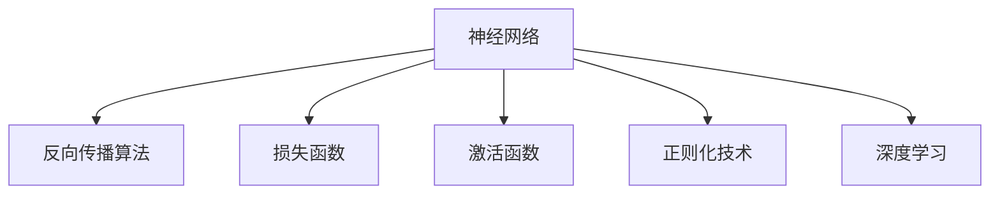

                 

## 1. 背景介绍

### 1.1 问题由来

随着人工智能技术的飞速发展，神经网络（Neural Networks）作为最成功的人工智能技术之一，已经在图像识别、自然语言处理、语音识别等众多领域展示了强大的能力。神经网络通过模拟人类大脑的神经元工作原理，利用复杂的权重调整机制，进行数据的特征提取、分类和预测。

然而，尽管神经网络已经在众多领域取得了巨大成功，其背后的原理仍然是一个复杂的谜题。如何更好地理解神经网络，探索其应用潜力，成为当前科技界的重大挑战。本文将从背景介绍开始，深入浅出地阐述神经网络的基本原理和应用，并对其未来发展趋势进行展望。

### 1.2 问题核心关键点

神经网络的关键核心在于其复杂的权重调整机制和梯度下降优化算法。通过反向传播算法，神经网络能够不断地优化其权重，从而提高其预测准确度。这一机制使得神经网络能够在处理非线性数据时具有优越的表现。然而，神经网络的过度复杂性也带来了训练时间长、参数量大、难以解释等问题。

此外，神经网络在实际应用中也存在诸多挑战，如数据标注成本高、模型泛化能力差、对抗样本攻击等。这些问题都需要在理论和技术上进行进一步探索和优化。

## 2. 核心概念与联系

### 2.1 核心概念概述

为更好地理解神经网络的基本原理和应用，本节将介绍几个密切相关的核心概念：

- **神经网络**：一种基于计算图模型的人工智能技术，由多个神经元层级结构组成，能够通过学习自动提取输入数据的特征，并输出相应的预测结果。
- **反向传播算法**：一种梯度下降算法的变种，用于计算神经网络中每一层权重对输出结果的影响，从而反向更新权重，提高预测准确度。
- **损失函数**：用于衡量神经网络预测结果与真实标签之间的差异，常见的损失函数包括均方误差、交叉熵等。
- **激活函数**：一种非线性变换函数，用于神经网络层级之间引入非线性特性，如ReLU、Sigmoid、Tanh等。
- **正则化技术**：一种防止过拟合的技术，如L2正则、Dropout、数据增强等。
- **深度学习**：一种基于多层神经网络的机器学习技术，通过多层次特征提取和组合，实现更加复杂的模式识别和预测。

这些核心概念之间的逻辑关系可以通过以下Mermaid流程图来展示：



这个流程图展示了几大核心概念之间的联系：

1. 神经网络通过反向传播算法优化权重，提高预测准确度。
2. 损失函数用于衡量预测结果与真实标签的差异，指导神经网络的优化过程。
3. 激活函数为神经网络引入非线性特性，提升模型的表达能力。
4. 正则化技术防止模型过拟合，提高模型的泛化能力。
5. 深度学习通过多层特征提取，提升模型的复杂性和预测准确度。

## 3. 核心算法原理 & 具体操作步骤

### 3.1 算法原理概述

神经网络的基本原理是通过多层线性变换和激活函数引入非线性特性，自动提取输入数据的特征，并输出预测结果。其核心思想是：利用反向传播算法和梯度下降优化，不断调整网络中每一层的权重，使得网络能够逼近真实的预测函数。

形式化地，假设神经网络模型为 $f_{\theta}$，其中 $\theta$ 为网络中的所有权重。给定训练数据集 $D=\{(x_i,y_i)\}_{i=1}^N$，其中 $x_i$ 为输入，$y_i$ 为真实标签。神经网络的目标是最小化损失函数 $\mathcal{L}(\theta)$：

$$
\mathcal{L}(\theta) = \frac{1}{N}\sum_{i=1}^N \ell(f_{\theta}(x_i),y_i)
$$

其中 $\ell$ 为损失函数，$\ell(f_{\theta}(x_i),y_i)$ 表示在输入 $x_i$ 下，模型 $f_{\theta}$ 预测的输出 $f_{\theta}(x_i)$ 与真实标签 $y_i$ 的差异。

通过反向传播算法和梯度下降优化，神经网络可以不断调整权重 $\theta$，使得模型输出逼近真实标签，最终得到最优的预测函数。

### 3.2 算法步骤详解

神经网络的训练一般包括以下几个关键步骤：

**Step 1: 数据预处理**
- 将原始数据进行预处理，如标准化、归一化、分词等。
- 将数据划分为训练集、验证集和测试集。

**Step 2: 构建模型**
- 选择合适的神经网络架构，如全连接神经网络、卷积神经网络、循环神经网络等。
- 定义每一层的神经元数量、激活函数和正则化策略。

**Step 3: 初始化权重**
- 随机初始化网络中的所有权重。
- 一般采用均值为0，方差较小的正态分布。

**Step 4: 前向传播**
- 将训练集数据输入网络，计算每一层的输出。
- 利用激活函数引入非线性特性。

**Step 5: 计算损失**
- 将网络的输出与真实标签进行比较，计算损失函数。
- 常见的损失函数包括均方误差、交叉熵等。

**Step 6: 反向传播**
- 利用反向传播算法计算每一层的梯度。
- 根据梯度更新每一层的权重。

**Step 7: 训练过程**
- 重复Step 4至Step 6，直至模型收敛或达到预设的迭代次数。

**Step 8: 验证和测试**
- 在验证集上评估模型性能，调整超参数。
- 在测试集上最终评估模型性能，生成预测结果。

### 3.3 算法优缺点

神经网络的优势在于其强大的非线性表达能力和自动特征提取能力，能够在处理复杂数据时表现出色。同时，深度学习技术的发展也使得神经网络在图像、自然语言处理等领域取得了突破性进展。

然而，神经网络也存在一些固有的局限性：
1. 训练时间长，计算资源需求高。大规模数据和复杂模型需要大量的计算资源和时间。
2. 参数量大，难以解释。神经网络通过大量的参数进行优化，其内部工作机制难以解释。
3. 泛化能力受限。在处理不同分布的数据时，神经网络的泛化能力可能较差。
4. 对抗样本攻击脆弱。神经网络对于对抗样本的攻击难以抵抗。

尽管存在这些局限性，神经网络仍是目前最成功的人工智能技术之一，广泛应用于图像识别、自然语言处理、语音识别等领域。未来，研究者将继续探索和优化神经网络，以进一步提升其性能和可解释性。

### 3.4 算法应用领域

神经网络已经在众多领域展示了其强大的应用潜力，以下是一些典型的应用场景：

- **图像识别**：利用卷积神经网络，对图像进行分类、物体检测等任务。
- **自然语言处理**：利用循环神经网络、Transformer等模型，进行语言建模、机器翻译、情感分析等任务。
- **语音识别**：利用卷积神经网络、RNN等模型，对语音进行分类、识别等任务。
- **推荐系统**：利用神经网络进行用户行为分析、商品推荐等任务。
- **自动驾驶**：利用卷积神经网络、循环神经网络等模型，进行环境感知、路径规划等任务。
- **金融风控**：利用神经网络进行风险评估、信用评分等任务。

除了上述这些经典应用外，神经网络还在医疗、生物信息学、气象预测等领域展现了其强大的应用潜力。随着技术的发展，神经网络的应用领域将不断扩展，为各个行业带来新的变革。

## 4. 数学模型和公式 & 详细讲解 & 举例说明

### 4.1 数学模型构建

本节将使用数学语言对神经网络的基本原理进行严格刻画。

假设神经网络模型为 $f_{\theta}$，其中 $\theta$ 为网络中的所有权重。给定训练数据集 $D=\{(x_i,y_i)\}_{i=1}^N$，其中 $x_i$ 为输入，$y_i$ 为真实标签。神经网络的目标是最小化损失函数 $\mathcal{L}(\theta)$：

$$
\mathcal{L}(\theta) = \frac{1}{N}\sum_{i=1}^N \ell(f_{\theta}(x_i),y_i)
$$

其中 $\ell$ 为损失函数，$\ell(f_{\theta}(x_i),y_i)$ 表示在输入 $x_i$ 下，模型 $f_{\theta}$ 预测的输出 $f_{\theta}(x_i)$ 与真实标签 $y_i$ 的差异。

神经网络的输出可以表示为：

$$
f_{\theta}(x) = \sigma(\sum_{i=1}^{n} w_i x_i + b_i)
$$

其中 $\sigma$ 为激活函数，$w_i$ 为权重，$b_i$ 为偏置。

### 4.2 公式推导过程

以二分类问题为例，假设神经网络的目标是对输入数据 $x$ 进行二分类，输出 $y$ 表示正类的概率。模型的输出可以表示为：

$$
f_{\theta}(x) = \sigma(\sum_{i=1}^{n} w_i x_i + b_i)
$$

其中 $\sigma$ 为Sigmoid函数，$f_{\theta}(x)$ 为输出概率。

损失函数为：

$$
\ell(f_{\theta}(x),y) = -[y\log f_{\theta}(x) + (1-y)\log(1-f_{\theta}(x))]
$$

将其代入经验风险公式，得：

$$
\mathcal{L}(\theta) = -\frac{1}{N}\sum_{i=1}^N [y_i\log f_{\theta}(x_i)+(1-y_i)\log(1-f_{\theta}(x_i))]
$$

根据链式法则，损失函数对权重 $\theta_k$ 的梯度为：

$$
\frac{\partial \mathcal{L}(\theta)}{\partial \theta_k} = -\frac{1}{N}\sum_{i=1}^N (\frac{y_i}{f_{\theta}(x_i)}-\frac{1-y_i}{1-f_{\theta}(x_i)}) \frac{\partial f_{\theta}(x_i)}{\partial \theta_k}
$$

其中 $\frac{\partial f_{\theta}(x_i)}{\partial \theta_k}$ 可进一步递归展开，利用自动微分技术完成计算。

### 4.3 案例分析与讲解

假设有一个简单的神经网络，包含一个输入层、一个隐藏层和一个输出层。输入层有3个神经元，隐藏层有4个神经元，输出层有1个神经元。激活函数为ReLU。

该网络的目标是对输入 $x=(x_1,x_2,x_3)$ 进行分类，其中 $x_1,x_2,x_3$ 分别表示样本的特征。假设隐藏层的权重为 $w_1,w_2,w_3,w_4$，偏置为 $b_1,b_2,b_3,b_4$，输出层的权重为 $w_5$，偏置为 $b_5$。

神经网络的前向传播过程如下：

1. 输入层：
   $$
   x_1' = w_1 x_1 + b_1
   $$
   $$
   x_2' = w_2 x_2 + b_2
   $$
   $$
   x_3' = w_3 x_3 + b_3
   $$

2. 隐藏层：
   $$
   h_1 = \max(0, x_1')
   $$
   $$
   h_2 = \max(0, x_2')
   $$
   $$
   h_3 = \max(0, x_3')
   $$
   $$
   h_4 = \max(0, w_4 h_1 + b_4)
   $$

3. 输出层：
   $$
   y = \sigma(w_5 h_4 + b_5)
   $$

该网络的反向传播过程如下：

1. 输出层的误差：
   $$
   \delta_5 = \frac{\partial \ell}{\partial y} \frac{\partial y}{\partial h_4}
   $$

2. 隐藏层的误差：
   $$
   \delta_4 = \frac{\partial \ell}{\partial h_4} \frac{\partial h_4}{\partial h_1}
   $$
   $$
   \delta_3 = \frac{\partial \ell}{\partial h_4} \frac{\partial h_4}{\partial h_2}
   $$
   $$
   \delta_2 = \frac{\partial \ell}{\partial h_4} \frac{\partial h_4}{\partial h_3}
   $$

3. 输入层的误差：
   $$
   \delta_1 = \frac{\partial \ell}{\partial x_1'} \frac{\partial x_1'}{\partial x_1}
   $$
   $$
   \delta_2 = \frac{\partial \ell}{\partial x_2'} \frac{\partial x_2'}{\partial x_2}
   $$
   $$
   \delta_3 = \frac{\partial \ell}{\partial x_3'} \frac{\partial x_3'}{\partial x_3}
   $$

利用上述误差，可以计算每一层的梯度，并更新权重。

## 5. 项目实践：代码实例和详细解释说明

### 5.1 开发环境搭建

在进行神经网络项目开发前，需要准备好开发环境。以下是使用Python进行TensorFlow和Keras开发的Python环境配置流程：

1. 安装Anaconda：从官网下载并安装Anaconda，用于创建独立的Python环境。

2. 创建并激活虚拟环境：
```bash
conda create -n pytorch-env python=3.8 
conda activate pytorch-env
```

3. 安装TensorFlow：根据CUDA版本，从官网获取对应的安装命令。例如：
```bash
conda install tensorflow -c conda-forge -c pytorch -c nvidia
```

4. 安装Keras：
```bash
pip install keras
```

5. 安装各类工具包：
```bash
pip install numpy pandas scikit-learn matplotlib tqdm jupyter notebook ipython
```

完成上述步骤后，即可在`pytorch-env`环境中开始神经网络项目开发。

### 5.2 源代码详细实现

这里我们以手写数字识别为例，使用Keras框架进行神经网络的实现。

```python
from keras.datasets import mnist
from keras.models import Sequential
from keras.layers import Dense, Flatten, Conv2D, MaxPooling2D
from keras.utils import to_categorical

# 加载数据集
(x_train, y_train), (x_test, y_test) = mnist.load_data()

# 数据预处理
x_train = x_train.reshape(-1, 28, 28, 1).astype('float32') / 255.0
x_test = x_test.reshape(-1, 28, 28, 1).astype('float32') / 255.0

y_train = to_categorical(y_train)
y_test = to_categorical(y_test)

# 构建模型
model = Sequential()
model.add(Conv2D(32, kernel_size=(3, 3), activation='relu', input_shape=(28, 28, 1)))
model.add(MaxPooling2D(pool_size=(2, 2)))
model.add(Flatten())
model.add(Dense(128, activation='relu'))
model.add(Dense(10, activation='softmax'))

# 编译模型
model.compile(loss='categorical_crossentropy', optimizer='adam', metrics=['accuracy'])

# 训练模型
model.fit(x_train, y_train, epochs=10, batch_size=64, validation_data=(x_test, y_test))
```

### 5.3 代码解读与分析

让我们再详细解读一下关键代码的实现细节：

**数据加载和预处理**：
- `mnist.load_data()`：加载MNIST手写数字数据集。
- `x_train.reshape(-1, 28, 28, 1).astype('float32') / 255.0`：将训练数据和测试数据重塑为二维张量，并进行归一化处理。
- `y_train = to_categorical(y_train)`：将标签进行one-hot编码。

**模型构建**：
- `Sequential()`：定义序列模型，顺序添加各个层。
- `Conv2D(32, kernel_size=(3, 3), activation='relu', input_shape=(28, 28, 1))`：添加卷积层，进行特征提取。
- `MaxPooling2D(pool_size=(2, 2))`：添加池化层，降低数据维度。
- `Flatten()`：将二维张量展平，准备全连接层输入。
- `Dense(128, activation='relu')`：添加全连接层，引入非线性特性。
- `Dense(10, activation='softmax')`：添加输出层，进行多分类。

**模型编译**：
- `model.compile(loss='categorical_crossentropy', optimizer='adam', metrics=['accuracy'])`：定义损失函数、优化器和评估指标。

**模型训练**：
- `model.fit(x_train, y_train, epochs=10, batch_size=64, validation_data=(x_test, y_test))`：定义训练过程，指定训练轮数、批次大小和验证集。

可以看到，Keras框架使得神经网络的构建和训练变得非常简单。开发者可以更加专注于模型的架构设计和数据处理，而不必过多关注底层实现细节。

当然，工业级的系统实现还需考虑更多因素，如模型的保存和部署、超参数的自动搜索、更灵活的网络结构等。但核心的神经网络训练范式基本与此类似。

## 6. 实际应用场景

### 6.1 智能客服系统

基于神经网络的智能客服系统，可以广泛应用于企业客户服务的自动化。传统客服系统依赖大量人力，响应速度慢且容易出错。而使用神经网络构建的智能客服系统，能够24小时在线服务，快速响应客户咨询，提升客户满意度。

在技术实现上，可以收集企业内部历史客服对话记录，将问题和最佳答复构建成监督数据，在此基础上对神经网络模型进行训练。训练好的模型能够自动理解用户意图，匹配最合适的答复进行回复。对于用户提出的新问题，还可以接入检索系统实时搜索相关内容，动态组织生成回答。如此构建的智能客服系统，能大幅提升客户咨询体验和问题解决效率。

### 6.2 金融风控

金融机构需要实时监测市场风险，及时应对金融风险。传统的风控方式依赖大量人工进行风险评估，成本高、效率低。而使用神经网络进行风险评估，能够实时处理海量数据，快速识别异常行为，提高风险管理的自动化和精准度。

在实际应用中，可以收集用户的交易记录、信用评分等信息，作为训练数据。训练好的神经网络模型能够自动分析用户行为，识别出潜在的风险点，如异常交易、信用欺诈等。系统可以根据模型预测结果，采取相应的风险控制措施，保护用户的资金安全。

### 6.3 推荐系统

推荐系统是电商、视频、音乐等平台的重要功能，能够为用户提供个性化的内容推荐。传统的推荐系统依赖协同过滤、内容相似度等方法，难以捕捉用户真实兴趣。而使用神经网络进行推荐，能够更好地挖掘用户行为背后的语义信息，从而提供更精准、多样的推荐内容。

在实践中，可以收集用户浏览、点击、评论、分享等行为数据，提取和商品、视频、音乐等内容的文本描述。将文本描述作为模型输入，用户的后续行为作为监督信号，在此基础上对神经网络模型进行微调。训练好的模型能够从文本描述中准确把握用户的兴趣点，生成个性化的推荐结果。

### 6.4 未来应用展望

随着神经网络技术的不断发展，其在更多领域的应用前景将更加广阔。

在智慧医疗领域，基于神经网络的医疗影像诊断、药物研发等应用将提升医疗服务的智能化水平，辅助医生诊疗，加速新药开发进程。

在智能教育领域，神经网络可应用于作业批改、学情分析、知识推荐等方面，因材施教，促进教育公平，提高教学质量。

在智慧城市治理中，神经网络可应用于城市事件监测、舆情分析、应急指挥等环节，提高城市管理的自动化和智能化水平，构建更安全、高效的未来城市。

此外，在企业生产、社会治理、文娱传媒等众多领域，基于神经网络的人工智能应用也将不断涌现，为经济社会发展注入新的动力。相信随着技术的日益成熟，神经网络技术将继续拓展应用范围，推动人工智能技术迈向更高的台阶。

## 7. 工具和资源推荐

### 7.1 学习资源推荐

为了帮助开发者系统掌握神经网络的基本原理和实践技巧，这里推荐一些优质的学习资源：

1. **《深度学习》书籍**：Ian Goodfellow等人所著，全面介绍了深度学习的基本概念和经典算法，是入门深度学习的经典读物。
2. **CS231n《卷积神经网络》课程**：斯坦福大学开设的计算机视觉课程，有Lecture视频和配套作业，涵盖卷积神经网络的基本原理和应用。
3. **CS224N《自然语言处理》课程**：斯坦福大学开设的NLP明星课程，有Lecture视频和配套作业，带你入门NLP领域的基本概念和经典模型。
4. **Deep Learning Specialization**：由Andrew Ng开设的深度学习系列课程，涵盖深度学习的基本概念和前沿技术，适合进阶学习。
5. **《Python深度学习》书籍**：François Chollet所著，介绍了使用Keras框架进行深度学习的实践技巧，适合实际开发。

通过对这些资源的学习实践，相信你一定能够快速掌握神经网络的基本原理和实践技巧，并用于解决实际的机器学习问题。

### 7.2 开发工具推荐

高效的开发离不开优秀的工具支持。以下是几款用于神经网络开发的常用工具：

1. **TensorFlow**：由Google主导开发的深度学习框架，支持分布式计算、模型优化，适用于大规模工程应用。
2. **Keras**：基于TensorFlow等后端的高级神经网络框架，适合快速原型设计和实验。
3. **PyTorch**：Facebook开发的深度学习框架，动态计算图，适合研究和原型设计。
4. **MXNet**：由Apache开发的深度学习框架，支持多种编程语言，适合分布式训练和模型优化。
5. **Theano**：基于CPU和GPU加速的深度学习框架，支持高效的数值计算。
6. **Caffe**：由Berkeley Vision and Learning Center开发的深度学习框架，适合计算机视觉任务。

合理利用这些工具，可以显著提升神经网络的开发效率，加快创新迭代的步伐。

### 7.3 相关论文推荐

神经网络技术的发展源于学界的持续研究。以下是几篇奠基性的相关论文，推荐阅读：

1. **《深度学习》**：Ian Goodfellow等人所著，全面介绍了深度学习的基本概念和经典算法。
2. **《ImageNet Classification with Deep Convolutional Neural Networks》**：Alex Krizhevsky等人所著，展示了卷积神经网络在图像识别任务中的优越性能。
3. **《Natural Language Processing (almost) from Scratch》**：Yann LeCun等人所著，介绍了使用神经网络进行自然语言处理的原理和实践。
4. **《Going Deeper with Convolutions》**：Christian Szegedy等人所著，展示了深度卷积神经网络在图像识别任务中的性能提升。
5. **《Learning Phrases and Sentences from Scratch》**：Christopher Manning等人所著，展示了使用神经网络进行语言建模和句子分类的原理和实践。

这些论文代表了大规模神经网络的研究脉络。通过学习这些前沿成果，可以帮助研究者把握学科前进方向，激发更多的创新灵感。

## 8. 总结：未来发展趋势与挑战

### 8.1 研究成果总结

本文对神经网络的基本原理和应用进行了全面系统的介绍。从背景介绍到核心概念，从算法原理到实际操作，从学习资源到开发工具，全面梳理了神经网络的基本框架和技术细节。

通过本文的系统梳理，可以看到，神经网络技术在图像识别、自然语言处理、语音识别等领域展示了强大的应用潜力，为各个行业带来了新的变革。未来，研究者将继续探索和优化神经网络，以进一步提升其性能和可解释性。

### 8.2 未来发展趋势

展望未来，神经网络技术将继续在多个领域展现出其强大的应用潜力。

1. **模型规模持续增大**：随着算力成本的下降和数据规模的扩张，神经网络的参数量将持续增长，超大规模神经网络将带来更丰富的语义信息和表达能力。
2. **模型结构多样化**：除了传统的卷积神经网络、循环神经网络等，更多新型神经网络结构将被开发和应用，如Transformer、Graph Neural Network等，进一步提升神经网络的表现力。
3. **迁移学习与预训练**：预训练神经网络在特定任务上进行微调，成为新一轮研究热点。迁移学习和预训练技术将进一步提升神经网络的泛化能力和鲁棒性。
4. **可解释性增强**：如何赋予神经网络更强的可解释性，解释其内部工作机制和决策逻辑，将成为重要的研究方向。
5. **融合多模态数据**：将神经网络与其他模态数据融合，如视觉、语音、文本等，实现跨模态信息的协同建模，提升神经网络的复杂性和表现力。
6. **自动化与可控性**：如何自动化地设计神经网络架构，减少人工干预，增强模型的可控性和鲁棒性，将是未来的重要研究方向。

### 8.3 面临的挑战

尽管神经网络技术取得了巨大的成功，但在应用过程中仍面临诸多挑战：

1. **训练成本高**：大规模神经网络的训练需要大量的计算资源和时间，训练成本高昂。
2. **模型可解释性差**：神经网络的黑盒特性使得其内部工作机制难以解释，缺乏可解释性。
3. **对抗样本攻击**：神经网络对对抗样本的攻击容易受到干扰，导致模型鲁棒性差。
4. **数据依赖性高**：神经网络的性能高度依赖于训练数据的质量和数量，数据标注成本高。
5. **模型泛化能力差**：神经网络在处理不同分布的数据时，泛化能力可能较差，难以应用于实际问题。

### 8.4 研究展望

面对神经网络技术所面临的挑战，未来的研究需要在以下几个方面寻求新的突破：

1. **模型压缩与加速**：如何压缩神经网络规模，提高推理速度，是未来的一个重要研究方向。
2. **对抗样本鲁棒性**：如何增强神经网络对对抗样本的鲁棒性，提高模型的安全性。
3. **可解释性增强**：如何赋予神经网络更强的可解释性，解释其内部工作机制和决策逻辑，是未来的重要研究方向。
4. **多模态融合**：如何将神经网络与其他模态数据融合，实现跨模态信息的协同建模，提升神经网络的复杂性和表现力。
5. **自动化设计**：如何自动化地设计神经网络架构，减少人工干预，增强模型的可控性和鲁棒性，将是未来的重要研究方向。
6. **隐私保护**：如何在保证模型性能的同时，保护用户隐私，防止数据泄露，是未来的重要研究方向。

## 9. 附录：常见问题与解答

**Q1: 神经网络的优势和局限性分别有哪些？**

A: 神经网络的优势在于其强大的非线性表达能力和自动特征提取能力，能够在处理复杂数据时表现出色。同时，深度学习技术的发展也使得神经网络在图像、自然语言处理等领域取得了突破性进展。

然而，神经网络也存在一些固有的局限性：
1. 训练时间长，计算资源需求高。大规模数据和复杂模型需要大量的计算资源和时间。
2. 参数量大，难以解释。神经网络通过大量的参数进行优化，其内部工作机制难以解释。
3. 泛化能力受限。在处理不同分布的数据时，神经网络的泛化能力可能较差。
4. 对抗样本攻击脆弱。神经网络对于对抗样本的攻击难以抵抗。

尽管存在这些局限性，神经网络仍是目前最成功的人工智能技术之一，广泛应用于图像识别、自然语言处理、语音识别等领域。未来，研究者将继续探索和优化神经网络，以进一步提升其性能和可解释性。

**Q2: 神经网络与传统机器学习算法的区别有哪些？**

A: 神经网络与传统机器学习算法的主要区别在于其建模方式和训练过程：
1. 建模方式：神经网络是一种基于计算图模型的人工智能技术，通过反向传播算法自动学习输入数据的特征表示，而传统机器学习算法通常需要手工设计特征。
2. 训练过程：神经网络通过大量数据进行梯度下降优化，自动调整模型参数，而传统机器学习算法通常需要手工调整模型参数和超参数。
3. 可解释性：神经网络往往被视为黑盒模型，其内部工作机制难以解释，而传统机器学习算法通常具有较好的可解释性。
4. 适应性：神经网络通过自动学习数据特征，适应复杂数据分布的能力较强，而传统机器学习算法通常需要手工设计特征和调整参数，适应复杂数据的能力较差。

尽管存在这些区别，神经网络与传统机器学习算法在一些场景下可以相互补充，共同解决实际问题。

**Q3: 神经网络的未来发展方向有哪些？**

A: 神经网络的未来发展方向主要包括以下几个方面：
1. 模型规模持续增大：随着算力成本的下降和数据规模的扩张，神经网络的参数量将持续增长，超大规模神经网络将带来更丰富的语义信息和表达能力。
2. 模型结构多样化：除了传统的卷积神经网络、循环神经网络等，更多新型神经网络结构将被开发和应用，如Transformer、Graph Neural Network等，进一步提升神经网络的表现力。
3. 迁移学习与预训练：预训练神经网络在特定任务上进行微调，成为新一轮研究热点。迁移学习和预训练技术将进一步提升神经网络的泛化能力和鲁棒性。
4. 可解释性增强：如何赋予神经网络更强的可解释性，解释其内部工作机制和决策逻辑，将成为重要的研究方向。
5. 融合多模态数据：将神经网络与其他模态数据融合，如视觉、语音、文本等，实现跨模态信息的协同建模，提升神经网络的复杂性和表现力。
6. 自动化设计：如何自动化地设计神经网络架构，减少人工干预，增强模型的可控性和鲁棒性，将是未来的重要研究方向。

**Q4: 神经网络在医疗领域有哪些应用？**

A: 神经网络在医疗领域的应用主要包括以下几个方面：
1. 医学影像诊断：利用卷积神经网络对医学影像进行分类、分割和分析，辅助医生进行诊断。
2. 疾病预测：利用神经网络对患者的医疗记录、基因信息等进行建模，预测疾病风险。
3. 药物研发：利用神经网络对药物分子结构进行预测和优化，加速新药开发进程。
4. 健康管理：利用神经网络对用户的生理数据进行监测和分析，提供个性化的健康管理方案。
5. 医疗咨询：利用神经网络进行自然语言处理，提供智能化的医疗咨询服务，提升患者体验。

这些应用将有助于提升医疗服务的智能化水平，降低医疗成本，提高医疗质量。

**Q5: 神经网络在金融风控中的应用有哪些？**

A: 神经网络在金融风控中的应用主要包括以下几个方面：
1. 风险评估：利用神经网络对用户的交易记录、信用评分等信息进行建模，识别出潜在的风险点，如异常交易、信用欺诈等。
2. 信用评分：利用神经网络对用户的信用记录、社交媒体信息等进行建模，评估用户的信用风险。
3. 交易监控：利用神经网络对交易数据进行实时监控，识别出异常行为，防止金融诈骗和洗钱等违法行为。
4. 客户分析：利用神经网络对客户的行为数据进行分析和预测，提升客户管理的自动化和精准度。
5. 算法交易：利用神经网络进行金融市场的预测和分析，进行自动化的算法交易，提高投资回报率。

这些应用将有助于提升金融机构的风险管理能力，保护用户的资金安全，提高金融服务的智能化水平。

**Q6: 神经网络在推荐系统中的应用有哪些？**

A: 神经网络在推荐系统中的应用主要包括以下几个方面：
1. 用户行为分析：利用神经网络对用户的浏览、点击、评论、分享等行为数据进行建模，挖掘用户的兴趣和偏好。
2. 物品推荐：利用神经网络对物品的文本描述、标签等信息进行建模，生成个性化的推荐结果。
3. 内容生成：利用神经网络进行文本生成、图像生成等，提升推荐系统的多样性和新颖性。
4. 个性化推荐：利用神经网络对用户的特征和行为数据进行综合分析，生成个性化的推荐结果。
5. 推荐效果优化：利用神经网络对推荐算法进行优化，提升推荐效果和用户体验。

这些应用将有助于提升推荐系统的准确性和多样性，提高用户满意度和平台粘性。

---

作者：禅与计算机程序设计艺术 / Zen and the Art of Computer Programming

