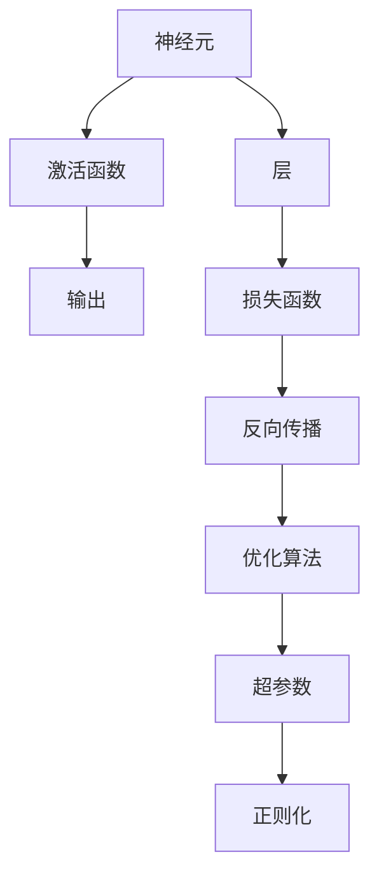

                 

# 神经网络：改变世界的技术

## 1. 背景介绍

神经网络（Neural Network, NN），又称为人工神经网络（Artificial Neural Network, ANN），是一种模拟人类大脑神经元之间相互连接的计算模型。其最早由英国数学家麦卡洛克（McCulloch）和皮特（Pitts）在1943年提出，后来在1980年代逐步发展成现在的结构。神经网络作为一种强大的机器学习工具，已在计算机视觉、自然语言处理、语音识别、推荐系统等多个领域取得突破性进展，成为了改变世界的技术之一。

### 1.1 问题由来

神经网络的核心思想是，通过大量的数据输入和训练，学习并提取数据的特征表示，从而实现对数据的分类、回归等任务。它模拟了人类大脑的神经元之间的连接方式，通过层层传递信息和调整权重，最终输出结果。神经网络不仅在学术界引起了广泛关注，也在工业界得到了广泛应用，从自动驾驶、图像识别到智能客服，无处不在。

然而，尽管神经网络带来了革命性的突破，也存在一些问题。例如，神经网络的训练过程复杂，需要大量的标注数据和计算资源；其黑盒特性使得模型的解释性较弱，难以解释其内部工作机制和决策逻辑；此外，神经网络模型的可解释性和可控性也是当前研究的一个重要方向。

## 2. 核心概念与联系

### 2.1 核心概念概述

神经网络的核心概念包括：

- **神经元（Neuron）**：神经网络的基本组成单元，类似于人脑的神经元，接受输入、进行加权计算和激活函数，产生输出。
- **层（Layer）**：神经网络按功能分为输入层、隐藏层和输出层。隐藏层负责提取特征，输出层负责最终输出。
- **激活函数（Activation Function）**：神经元的非线性激活函数，如Sigmoid、ReLU等，用于增加神经网络的非线性特性。
- **损失函数（Loss Function）**：用于衡量神经网络输出与真实标签之间的差异，如交叉熵损失、均方误差损失等。
- **反向传播（Backpropagation）**：通过链式法则计算损失函数对每个参数的梯度，更新模型参数，优化模型性能。
- **超参数（Hyperparameter）**：如学习率、批大小等，需要手动调整的参数。
- **正则化（Regularization）**：如L1正则、L2正则、Dropout等，用于防止模型过拟合。
- **优化算法（Optimization Algorithm）**：如梯度下降、Adam、SGD等，用于更新模型参数。

这些概念之间的联系可以通过以下Mermaid流程图来展示：



这个流程图展示神经网络的核心概念及其之间的关系：

1. 神经元接受输入，通过激活函数产生输出，层层传递。
2. 输出层与真实标签计算损失函数，衡量模型误差。
3. 通过反向传播计算梯度，优化模型参数。
4. 超参数和正则化技术用于调整模型行为。
5. 优化算法用于更新模型参数。

## 3. 核心算法原理 & 具体操作步骤

### 3.1 算法原理概述

神经网络的训练过程主要通过反向传播算法实现。反向传播算法利用链式法则，计算损失函数对每个参数的梯度，并通过优化算法（如梯度下降）更新模型参数，最小化损失函数，从而优化模型性能。

具体而言，神经网络由多个层组成，每个层包含多个神经元，每个神经元接收前一层的输出，并通过激活函数产生新的输出，再传递给下一层。最终的输出层输出结果，与真实标签计算损失函数。反向传播算法通过计算损失函数对每个参数的梯度，使用优化算法更新模型参数，最小化损失函数。

### 3.2 算法步骤详解

神经网络的训练过程一般包括以下几个关键步骤：

**Step 1: 准备数据集**

- 收集训练集、验证集和测试集，并对数据进行预处理（如归一化、标准化等）。

**Step 2: 搭建神经网络**

- 定义神经网络的结构，包括输入层、隐藏层和输出层的神经元数量，以及激活函数和正则化技术。

**Step 3: 选择优化算法**

- 选择合适的优化算法（如梯度下降、Adam、SGD等），并设置学习率、批大小等超参数。

**Step 4: 训练模型**

- 在训练集上使用优化算法，更新模型参数，最小化损失函数。
- 在验证集上评估模型性能，调整超参数。
- 在测试集上最终评估模型性能。

**Step 5: 模型应用**

- 将训练好的模型应用到实际问题中，进行预测或分类。

### 3.3 算法优缺点

神经网络的优点包括：

- **强大的非线性表达能力**：能够学习复杂的非线性关系，适用于各种复杂的数据分布。
- **可扩展性强**：通过增加隐藏层和神经元数量，可以处理更大规模和更复杂的问题。
- **适应性强**：适用于各种类型的输入数据，如图像、文本、音频等。

神经网络的缺点包括：

- **训练复杂度高**：需要大量的标注数据和计算资源，训练时间较长。
- **黑盒特性**：模型的内部工作机制难以解释，难以理解和调试。
- **过拟合风险**：如果没有正则化技术，容易在训练集上过度拟合，泛化性能差。

### 3.4 算法应用领域

神经网络已经在计算机视觉、自然语言处理、语音识别、推荐系统等多个领域取得突破性进展，具体应用领域包括：

- **图像分类**：如图像识别、物体检测、人脸识别等。通过多层卷积神经网络（Convolutional Neural Network, CNN）提取图像特征。
- **自然语言处理**：如机器翻译、情感分析、文本分类等。通过循环神经网络（Recurrent Neural Network, RNN）或Transformer等结构处理文本数据。
- **语音识别**：如语音识别、说话人识别、情感识别等。通过卷积神经网络或长短时记忆网络（Long Short-Term Memory, LSTM）处理语音信号。
- **推荐系统**：如商品推荐、新闻推荐、视频推荐等。通过协同过滤、内容推荐等方法，实现个性化推荐。

## 4. 数学模型和公式 & 详细讲解  
### 4.1 数学模型构建

神经网络的基本数学模型包括：

- **输入层**：将原始数据转化为神经网络可以处理的向量形式。
- **隐藏层**：通过加权求和和激活函数，提取特征表示。
- **输出层**：根据任务类型，输出分类或回归结果。

设神经网络模型为 $f(x)$，输入为 $x$，权重矩阵为 $W$，偏置向量为 $b$，激活函数为 $f_{\text{act}}$，损失函数为 $L$。则数学模型可以表示为：

$$
y = f(x) = f_{\text{act}}(Wx+b)
$$

其中 $x \in \mathbb{R}^n$，$y \in \mathbb{R}^m$，$W \in \mathbb{R}^{m \times n}$，$b \in \mathbb{R}^m$，$n$ 为输入维度，$m$ 为输出维度。

### 4.2 公式推导过程

以二分类任务为例，假设有 $N$ 个训练样本，每个样本的输入为 $x_i$，输出为 $y_i \in \{0,1\}$，目标为 $y_{\text{target}} \in \{0,1\}$。则损失函数可以定义为：

$$
L = \frac{1}{N} \sum_{i=1}^N -(y_i \log f(x_i) + (1-y_i) \log (1-f(x_i)))
$$

其中，$f(x_i)$ 为神经网络的输出，即 $f(x_i) = \sigma(Wx_i + b)$，$\sigma$ 为Sigmoid函数。

通过链式法则，计算损失函数对每个参数的梯度，得到：

$$
\frac{\partial L}{\partial W} = \frac{1}{N} \sum_{i=1}^N [(y_i - f(x_i))x_i^T]
$$

$$
\frac{\partial L}{\partial b} = \frac{1}{N} \sum_{i=1}^N [(y_i - f(x_i))]
$$

$$
\frac{\partial L}{\partial x} = \frac{1}{N} \sum_{i=1}^N [(y_i - f(x_i)) \sigma'(Wx_i + b)]
$$

其中 $\sigma'$ 为Sigmoid函数的导数。

### 4.3 案例分析与讲解

以图像分类任务为例，神经网络通常采用卷积神经网络（CNN）结构。CNN通过卷积层、池化层、全连接层等模块，提取图像特征，并进行分类。

在卷积层中，神经元通过卷积核（Convolution Kernel）提取图像局部特征。假设输入图像大小为 $H \times W \times C$，卷积核大小为 $k \times k$，则卷积层的输出大小为 $(H-k+1) \times (W-k+1) \times \frac{C}{k^2}$。

在池化层中，通过最大池化或平均池化等操作，减少特征维度，增加特征的不变性。

在全连接层中，通过将高维特征映射到低维空间，进行分类或回归。假设全连接层的输入维度为 $N$，输出维度为 $K$，则输出为 $f(x) = \sigma(Wx+b)$，其中 $W \in \mathbb{R}^{K \times N}$，$b \in \mathbb{R}^K$。

## 5. 项目实践：代码实例和详细解释说明
### 5.1 开发环境搭建

在进行神经网络实践前，我们需要准备好开发环境。以下是使用Python进行PyTorch开发的环境配置流程：

1. 安装Anaconda：从官网下载并安装Anaconda，用于创建独立的Python环境。

2. 创建并激活虚拟环境：
```bash
conda create -n pytorch-env python=3.8 
conda activate pytorch-env
```

3. 安装PyTorch：根据CUDA版本，从官网获取对应的安装命令。例如：
```bash
conda install pytorch torchvision torchaudio cudatoolkit=11.1 -c pytorch -c conda-forge
```

4. 安装TensorFlow：由Google主导开发的开源深度学习框架，生产部署方便，适合大规模工程应用。同样有丰富的预训练语言模型资源。

5. 安装各类工具包：
```bash
pip install numpy pandas scikit-learn matplotlib tqdm jupyter notebook ipython
```

完成上述步骤后，即可在`pytorch-env`环境中开始神经网络实践。

### 5.2 源代码详细实现

下面我们以手写数字识别任务为例，给出使用PyTorch进行神经网络实践的完整代码实现。

首先，定义数据处理函数：

```python
import torch
from torchvision import datasets, transforms

# 定义数据增强和预处理
transform_train = transforms.Compose([
    transforms.RandomHorizontalFlip(),
    transforms.RandomCrop(32, padding=4),
    transforms.ToTensor(),
    transforms.Normalize((0.1307,), (0.3081,))
])

transform_test = transforms.Compose([
    transforms.ToTensor(),
    transforms.Normalize((0.1307,), (0.3081,))
])

train_dataset = datasets.MNIST('mnist_data/', train=True, download=True, transform=transform_train)
test_dataset = datasets.MNIST('mnist_data/', train=False, transform=transform_test)

# 定义批大小和迭代次数
batch_size = 64
num_epochs = 5

# 定义数据加载器
train_loader = torch.utils.data.DataLoader(train_dataset, batch_size=batch_size, shuffle=True)
test_loader = torch.utils.data.DataLoader(test_dataset, batch_size=batch_size, shuffle=False)
```

然后，定义神经网络模型：

```python
import torch.nn as nn
import torch.nn.functional as F

class Net(nn.Module):
    def __init__(self):
        super(Net, self).__init__()
        self.conv1 = nn.Conv2d(1, 32, 3, padding=1)
        self.conv2 = nn.Conv2d(32, 64, 3, padding=1)
        self.pool = nn.MaxPool2d(2, 2)
        self.fc1 = nn.Linear(64 * 7 * 7, 512)
        self.fc2 = nn.Linear(512, 10)
        self.dropout = nn.Dropout(0.5)

    def forward(self, x):
        x = F.relu(self.conv1(x))
        x = self.pool(x)
        x = F.relu(self.conv2(x))
        x = self.pool(x)
        x = x.view(-1, 64 * 7 * 7)
        x = self.dropout(x)
        x = F.relu(self.fc1(x))
        x = self.dropout(x)
        x = self.fc2(x)
        return x

# 实例化神经网络模型
model = Net()
```

接着，定义损失函数和优化器：

```python
import torch.optim as optim

criterion = nn.CrossEntropyLoss()
optimizer = optim.Adam(model.parameters(), lr=0.001)
```

最后，执行模型训练和测试：

```python
from tqdm import tqdm

for epoch in range(num_epochs):
    running_loss = 0.0
    for i, (inputs, labels) in enumerate(train_loader):
        inputs, labels = inputs.to(device), labels.to(device)

        # 前向传播
        outputs = model(inputs)
        loss = criterion(outputs, labels)

        # 反向传播和优化
        optimizer.zero_grad()
        loss.backward()
        optimizer.step()

        # 输出日志
        running_loss += loss.item()
        if i % 100 == 99:
            print('[%d, %5d] loss: %.3f' %
                  (epoch + 1, i + 1, running_loss / 100))
            running_loss = 0.0

# 在测试集上评估模型性能
correct = 0
total = 0
with torch.no_grad():
    for images, labels in test_loader:
        images, labels = images.to(device), labels.to(device)
        outputs = model(images)
        _, predicted = torch.max(outputs.data, 1)
        total += labels.size(0)
        correct += (predicted == labels).sum().item()

print('Accuracy of the network on the 10000 test images: %d %%' % (
    100 * correct / total))
```

以上就是使用PyTorch进行手写数字识别任务神经网络实践的完整代码实现。可以看到，得益于PyTorch的强大封装和易用性，神经网络的搭建和训练变得非常简单。

### 5.3 代码解读与分析

让我们再详细解读一下关键代码的实现细节：

**定义数据集**：
- 使用`datasets.MNIST`加载MNIST数据集，并进行数据增强和预处理。
- 定义训练集和测试集的批大小和迭代次数，使用`DataLoader`进行数据加载。

**定义神经网络模型**：
- 定义神经网络的结构，包括卷积层、池化层、全连接层和Dropout层。
- 实例化神经网络模型。

**定义损失函数和优化器**：
- 使用`nn.CrossEntropyLoss`作为分类任务的损失函数。
- 使用`Adam`优化器进行模型训练。

**训练模型**：
- 在训练集上使用`DataLoader`迭代数据，前向传播计算损失，反向传播更新模型参数。
- 使用`tqdm`显示训练日志。
- 在测试集上评估模型性能，打印准确率。

## 6. 实际应用场景
### 6.1 智能推荐系统

神经网络在推荐系统中的应用非常广泛。通过分析用户的历史行为数据，神经网络可以学习到用户的行为模式和偏好，从而实现个性化推荐。

推荐系统的关键在于如何表示用户和物品的特征，以及如何捕捉用户和物品之间的关联关系。常用的方法是使用协同过滤、内容推荐等方法，通过神经网络进行特征提取和关系建模。例如，可以使用深度神经网络（Deep Neural Network, DNN）、卷积神经网络（CNN）、长短时记忆网络（LSTM）等结构，提取用户和物品的特征表示，并进行推荐。

### 6.2 图像识别

神经网络在图像识别任务中应用广泛，如图像分类、物体检测、人脸识别等。通过卷积神经网络（CNN）等结构，神经网络可以从图像中提取特征，并进行分类或检测。

在图像分类任务中，CNN通常采用多层次卷积和池化操作，提取图像的局部特征和全局特征。然后通过全连接层进行分类。例如，可以使用VGG、ResNet、Inception等经典架构，或者Transformer等新兴结构，进行图像分类。

### 6.3 自然语言处理

神经网络在自然语言处理（NLP）中的应用也非常广泛，如机器翻译、情感分析、文本分类等。通过循环神经网络（RNN）、长短时记忆网络（LSTM）、Transformer等结构，神经网络可以处理文本数据，并进行分类、回归等任务。

在机器翻译任务中，使用编码器-解码器（Encoder-Decoder）结构，将源语言序列编码成向量表示，再解码成目标语言序列。例如，可以使用基于Transformer的Seq2Seq模型，进行机器翻译。

### 6.4 未来应用展望

随着神经网络技术的发展，未来其在各个领域的应用将更加广泛和深入。以下是几个可能的未来应用方向：

1. **自动驾驶**：通过神经网络进行视觉感知、路径规划、决策等，实现自动驾驶。
2. **医疗影像分析**：使用神经网络进行医学影像的分类、分割、检测等，辅助医疗诊断。
3. **智能客服**：通过神经网络进行语音识别、自然语言理解、对话生成等，提升客户服务体验。
4. **智能制造**：使用神经网络进行设备故障检测、生产调度、质量控制等，提升制造效率。
5. **金融风险控制**：使用神经网络进行金融舆情监测、风险预测、欺诈检测等，提高金融风险管理能力。

## 7. 工具和资源推荐
### 7.1 学习资源推荐

为了帮助开发者系统掌握神经网络的理论基础和实践技巧，这里推荐一些优质的学习资源：

1. 《深度学习》系列书籍：由多位专家合著，详细介绍了深度学习的理论基础和实践技巧，涵盖了各种神经网络结构和算法。

2. 《神经网络与深度学习》书籍：作者Yoshua Bengio、Ian Goodfellow等，全面介绍了神经网络的发展历程、理论和应用。

3. DeepLearning.ai在线课程：由Andrew Ng创办的深度学习在线课程，涵盖神经网络、卷积神经网络、循环神经网络等主题，适合初学者和进阶者。

4. Coursera深度学习专项课程：由斯坦福大学、密歇根大学等顶尖高校提供的深度学习课程，涵盖神经网络、计算机视觉、自然语言处理等领域。

5. Kaggle竞赛：参与Kaggle深度学习竞赛，实战练习，提升技能。

通过对这些资源的学习实践，相信你一定能够快速掌握神经网络的核心技术和应用方法。

### 7.2 开发工具推荐

高效的开发离不开优秀的工具支持。以下是几款用于神经网络开发的常用工具：

1. PyTorch：基于Python的开源深度学习框架，灵活动态的计算图，适合快速迭代研究。PyTorch提供丰富的预训练模型和高效的神经网络框架。

2. TensorFlow：由Google主导开发的开源深度学习框架，生产部署方便，适合大规模工程应用。TensorFlow提供丰富的预训练模型和高效的神经网络框架。

3. MXNet：由亚马逊主导开发的深度学习框架，支持多种编程语言，适合分布式训练和推理。

4. Keras：基于TensorFlow和Theano的高级神经网络框架，易于使用，适合快速搭建和训练模型。

5. JAX：基于Numpy和XLA的深度学习框架，支持高效的自动微分和分布式训练。

合理利用这些工具，可以显著提升神经网络开发和研究的效率，加快创新迭代的步伐。

### 7.3 相关论文推荐

神经网络技术的发展源于学界的持续研究。以下是几篇奠基性的相关论文，推荐阅读：

1. Deep Blue: The Revolution in Artificial Intelligence（Deep Blue与人工智能的革命）：IBM开发的国际象棋计算机，通过神经网络进行计算。

2. ImageNet Classification with Deep Convolutional Neural Networks（深度卷积神经网络在ImageNet分类上的应用）：AlexNet在ImageNet图像分类任务上取得了突破性进展。

3. Learning Word Vectors in Context（上下文中的词向量学习）：Word2Vec通过神经网络学习单词的向量表示，广泛应用于NLP任务。

4. A Tutorial on Deep Learning（深度学习教程）：Andrej Karpathy撰写的人工智能基础教程，介绍了深度学习的核心概念和应用。

5. Large-Scale Image Recognition with Deep Convolutional Neural Networks（基于深度卷积神经网络的图像识别）：LeNet在手写数字识别任务上取得了突破性进展。

这些论文代表了大神经网络的发展脉络。通过学习这些前沿成果，可以帮助研究者把握学科前进方向，激发更多的创新灵感。

## 8. 总结：未来发展趋势与挑战

### 8.1 研究成果总结

神经网络技术经过数十年的发展，已经从最初的感知机、BP网络，发展到了如今的深度卷积神经网络、循环神经网络、Transformer等结构。神经网络在计算机视觉、自然语言处理、语音识别等领域取得了突破性进展，广泛应用于智能推荐系统、图像识别、自然语言处理、智能客服等应用场景。

### 8.2 未来发展趋势

展望未来，神经网络技术将呈现以下几个发展趋势：

1. **模型的可解释性**：随着模型的复杂度不断提高，模型的可解释性变得越来越重要。未来的研究将更加注重模型的可解释性和可控性，以便更好地理解和调试模型。

2. **模型的泛化性能**：神经网络模型的泛化性能需要进一步提升，以应对更加复杂和多变的数据分布。未来的研究将更加注重模型的鲁棒性和泛化性能，以适应更多实际应用场景。

3. **模型的自适应性**：未来的研究将更加注重模型的自适应性和持续学习能力，以便在数据分布变化的情况下，模型能够持续学习新知识，适应新的任务。

4. **模型的资源效率**：神经网络模型的资源效率需要进一步提升，以应对计算资源的限制。未来的研究将更加注重模型的计算效率和资源利用率，以便在资源受限的情况下，依然能够高效地运行模型。

5. **模型的多模态融合**：未来的研究将更加注重多模态数据的融合，以实现跨模态的联合建模。神经网络将不仅能够处理文本、图像、语音等单一模态数据，还能够进行多模态数据的融合，提升模型的表现能力。

6. **模型的伦理和安全**：未来的研究将更加注重模型的伦理和安全问题，以确保模型在实际应用中不会对用户和社会造成负面影响。

### 8.3 面临的挑战

尽管神经网络技术已经取得了巨大的成功，但也面临着诸多挑战：

1. **计算资源的限制**：神经网络模型的计算资源需求非常高，计算速度较慢，难以应对大规模数据的处理。未来的研究需要开发更加高效的计算框架和算法，以提高模型的计算效率。

2. **数据隐私和安全**：神经网络模型的训练和应用涉及到大量的数据，数据隐私和安全问题需要进一步解决。未来的研究需要开发更加安全的数据存储和传输机制，以保护用户的隐私和数据安全。

3. **模型的泛化性能**：神经网络模型在训练集上的表现往往优于测试集，存在一定的过拟合风险。未来的研究需要开发更加有效的正则化和泛化技术，以提高模型的泛化性能。

4. **模型的可解释性**：神经网络模型通常被视为“黑盒”系统，难以解释其内部工作机制和决策逻辑。未来的研究需要开发更加可解释的模型，以提高模型的透明度和可信度。

5. **模型的伦理问题**：神经网络模型在实际应用中可能存在偏见和歧视等问题，未来的研究需要开发更加公平和公正的模型，以确保模型符合伦理道德标准。

### 8.4 研究展望

面对神经网络所面临的挑战，未来的研究需要在以下几个方面寻求新的突破：

1. **模型的可解释性**：开发更加可解释的模型，提高模型的透明度和可信度。研究如何通过可视化和解释技术，解释模型的内部工作机制和决策逻辑。

2. **模型的资源效率**：开发更加高效的计算框架和算法，提高模型的计算效率和资源利用率。研究如何通过分布式计算、模型压缩等技术，减少计算资源的需求。

3. **模型的泛化性能**：开发更加有效的正则化和泛化技术，提高模型的泛化性能。研究如何通过对抗训练、生成对抗网络等技术，提高模型的鲁棒性和泛化能力。

4. **模型的多模态融合**：开发跨模态的联合建模方法，提高模型的表现能力。研究如何通过多模态数据的融合，实现跨模态的联合表示和推理。

5. **模型的伦理和安全**：研究如何开发更加公平和公正的模型，确保模型符合伦理道德标准。研究如何通过数据脱敏、隐私保护等技术，保护用户的隐私和数据安全。

这些研究方向将引领神经网络技术的发展，推动人工智能技术的不断进步。相信通过学界和产业界的共同努力，未来的神经网络技术将更加强大、高效、可信，为社会带来更加广泛和深远的影响。

## 9. 附录：常见问题与解答

**Q1：神经网络与传统机器学习算法有何不同？**

A: 神经网络与传统机器学习算法的不同在于，神经网络具有非线性表达能力和自适应学习能力，可以处理更加复杂和多变的数据分布。神经网络通过学习特征表示，自动提取数据中的隐含关系，能够更好地适应新的数据和任务。

**Q2：神经网络模型如何避免过拟合？**

A: 神经网络模型可以通过以下方法避免过拟合：
1. 数据增强：通过图像旋转、裁剪、翻转等方式扩充训练集，增加数据的多样性。
2. 正则化：通过L1正则、L2正则、Dropout等方式，防止模型在训练集上过拟合。
3. 早停策略：在验证集上监控模型的性能，一旦性能不再提升，即停止训练，避免过拟合。
4. 模型压缩：通过剪枝、量化等技术，减少模型的参数量和计算量，提高泛化性能。

**Q3：神经网络模型的训练时间和资源需求如何？**

A: 神经网络模型的训练时间和资源需求非常高，需要大量的计算资源和时间。具体的资源需求取决于模型的复杂度和数据规模。通常情况下，一个复杂的神经网络模型需要数十个GPU或者TPU进行训练，训练时间可能长达数天甚至数周。

**Q4：神经网络模型的应用场景有哪些？**

A: 神经网络模型可以应用于各种领域，如计算机视觉、自然语言处理、语音识别、推荐系统、智能客服、智能制造等。以下是一些常见的应用场景：
1. 图像识别：如图像分类、物体检测、人脸识别等。
2. 自然语言处理：如机器翻译、情感分析、文本分类等。
3. 智能推荐：如商品推荐、新闻推荐、视频推荐等。
4. 智能客服：如语音识别、自然语言理解、对话生成等。
5. 自动驾驶：如视觉感知、路径规划、决策等。

通过神经网络模型的应用，可以在多个领域中实现智能化和自动化，提升生产效率和生活质量。

