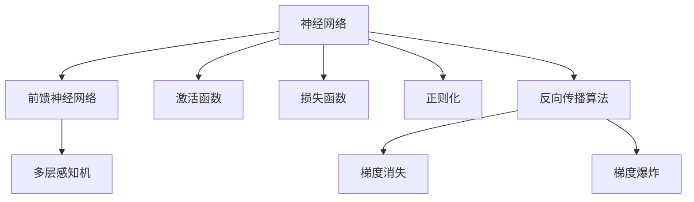

                 

## 1. 背景介绍

### 1.1 问题由来

随着人工智能技术的迅猛发展，机器学习已经成为推动科技进步的重要引擎。传统的机器学习方法，如逻辑回归、支持向量机等，在数据量和计算资源有限的条件下，往往难以处理复杂的数据分布和高度非线性的关系。而神经网络（Neural Networks）作为一类模拟人脑神经元工作方式的机器学习算法，通过构建多层次的计算图，能够有效拟合复杂的高维数据，并在大量数据和强大计算资源的支持下，实现高精度的预测和分类任务。

近年来，深度学习领域掀起了神经网络应用的热潮，从计算机视觉、自然语言处理到语音识别、强化学习，神经网络在各个领域都取得了突破性进展。本文将从神经网络的基本概念、原理与应用出发，深入探讨这一机器学习的新范式，并对其在实际应用中的挑战与未来发展进行全面分析。

### 1.2 问题核心关键点

神经网络的核心在于其强大的表达能力和适应性。通过多层次的计算，神经网络能够自动学习数据的高级特征，从而实现对复杂数据结构的建模。此外，神经网络的高维特征表达能力，使其能够处理大规模的、高维度的数据，这在大数据时代具有重要意义。然而，神经网络也面临计算资源消耗巨大、训练时间长、模型解释性差等挑战，这些问题亟需从理论和实践两方面进行深入研究。

## 2. 核心概念与联系

### 2.1 核心概念概述

为更好地理解神经网络，本节将介绍几个密切相关的核心概念：

- 神经网络（Neural Network）：由大量神经元（或节点）通过连接形成的计算图。神经元接收输入、进行加权运算和激活函数操作，生成输出，进而传递给下一层神经元。
- 前馈神经网络（Feedforward Neural Network, FNN）：一种最简单的神经网络结构，由输入层、多个隐藏层和输出层构成。
- 反向传播算法（Backpropagation）：一种用于训练神经网络的方法，通过计算梯度并反向传播，更新网络参数以最小化损失函数。
- 激活函数（Activation Function）：用于对神经元的输出进行非线性变换，常见的激活函数包括ReLU、Sigmoid等。
- 损失函数（Loss Function）：衡量模型输出与真实标签之间的差异，常见的损失函数包括均方误差（MSE）、交叉熵（Cross Entropy）等。
- 正则化（Regularization）：通过添加惩罚项限制模型复杂度，防止过拟合，常见的正则化方法包括L1正则、L2正则等。
- 梯度消失和梯度爆炸：神经网络在反向传播过程中，由于链式求导的存在，可能出现梯度消失或梯度爆炸的问题，影响模型训练。

这些核心概念之间的逻辑关系可以通过以下Mermaid流程图来展示：



这个流程图展示出神经网络的基本组成和关键特性：

1. 神经网络由多个神经元通过连接构成。
2. 前馈神经网络是最常见的神经网络结构，由输入层、多个隐藏层和输出层构成。
3. 激活函数用于非线性变换，增加模型的表达能力。
4. 损失函数用于评估模型的预测误差，指导模型优化。
5. 正则化用于控制模型复杂度，防止过拟合。
6. 反向传播算法用于更新模型参数，最小化损失函数。
7. 梯度消失和梯度爆炸是神经网络训练中的常见问题，需要通过优化算法和网络结构进行缓解。

这些概念共同构成了神经网络的基础框架，使其能够处理复杂的数据分布和高维数据，并不断进行优化，以提高预测和分类的准确性。

## 3. 核心算法原理 & 具体操作步骤
### 3.1 算法原理概述

神经网络的基本原理是模拟人脑的神经元工作方式。通过构建多个层次的计算图，神经网络能够自动学习数据的高级特征，从而实现对复杂数据结构的建模。具体来说，神经网络的训练过程包括前向传播和反向传播两个阶段。

在训练过程中，首先通过前向传播将输入数据传递给网络，经过逐层计算和激活函数操作，生成输出结果。然后，通过反向传播算法计算输出结果与真实标签之间的误差，并根据梯度下降等优化算法更新模型参数，使得误差最小化。通过不断迭代优化，神经网络能够逐渐逼近最优的模型参数，从而实现高精度的预测和分类任务。

### 3.2 算法步骤详解

神经网络的训练过程主要包括以下几个关键步骤：

**Step 1: 准备数据和模型**
- 收集并准备训练数据和验证数据，划分为训练集、验证集和测试集。
- 设计神经网络模型结构，包括输入层、多个隐藏层和输出层。
- 选择损失函数和优化器，如均方误差损失和Adam优化器。
- 设定正则化参数，如L2正则化系数。

**Step 2: 前向传播**
- 将训练数据输入神经网络，逐层进行计算和激活函数操作。
- 生成网络输出，并与真实标签进行对比，计算损失函数。

**Step 3: 反向传播**
- 通过反向传播算法计算梯度，并根据优化器更新模型参数。
- 不断迭代，调整模型参数，最小化损失函数。

**Step 4: 验证和测试**
- 在验证集上评估模型性能，调整超参数。
- 在测试集上测试模型性能，评估模型泛化能力。

**Step 5: 部署和应用**
- 将训练好的模型部署到生产环境中，进行实时预测。
- 根据实际应用需求，调整模型参数，优化模型性能。

以上是神经网络训练的一般流程。在实际应用中，还需要根据具体任务对训练过程进行优化和改进，如引入Dropout、Batch Normalization等技术，防止过拟合和加速收敛。

### 3.3 算法优缺点

神经网络作为一种强大的机器学习算法，具有以下优点：

1. 强大的表达能力：神经网络能够自动学习数据的高级特征，适应复杂数据分布和高维数据。
2. 适用于大规模数据：神经网络能够处理大规模、高维度的数据，如图像、文本等。
3. 模型可解释性：通过可视化神经网络的结构和权重，可以直观理解模型的内部工作机制。
4. 适应性强：神经网络可以通过调整网络结构和参数，适应不同的应用场景和任务需求。

同时，神经网络也存在一些局限性：

1. 计算资源消耗大：神经网络的训练和推理需要大量的计算资源，如图PU、GPU等。
2. 训练时间长：神经网络的训练过程往往需要较长的迭代时间，尤其是深度神经网络。
3. 模型复杂度高：神经网络模型参数众多，难以解释和调试。
4. 容易出现过拟合：神经网络模型复杂度高，容易过拟合，尤其是在标注数据不足的情况下。
5. 模型泛化能力差：神经网络模型在过拟合的情况下，泛化能力下降，容易对新数据产生过拟合。

尽管存在这些局限性，但就目前而言，神经网络仍然是机器学习领域的主流范式。未来相关研究的重点在于如何进一步降低计算资源消耗，提高训练速度，优化模型结构，同时兼顾模型可解释性和泛化能力。

### 3.4 算法应用领域

神经网络在各个领域的应用已经取得了显著的成果，以下是几个典型应用场景：

- 计算机视觉：用于图像分类、目标检测、图像分割等任务，如图像识别、人脸识别、自动驾驶等。
- 自然语言处理：用于文本分类、机器翻译、对话系统等任务，如情感分析、文本生成、智能客服等。
- 语音识别：用于语音识别、语音合成等任务，如智能音箱、语音助手等。
- 信号处理：用于信号处理、音频处理等任务，如声学建模、语音增强等。
- 推荐系统：用于商品推荐、用户画像、内容推荐等任务，如电商推荐、音乐推荐、新闻推荐等。
- 金融预测：用于股票预测、风险评估、信用评分等任务，如股票预测、市场分析、信用评分等。

除了上述这些典型应用，神经网络还被应用于医疗诊断、化学分子模拟、环境监测等多个领域，展现出强大的应用潜力。

## 4. 数学模型和公式 & 详细讲解 & 举例说明

### 4.1 数学模型构建

神经网络的数学模型可以表示为：

$$
\begin{aligned}
&h_1 = W_1x + b_1 \\
&h_i = \sigma(W_ix_i + b_i), i=2,3,\ldots,n \\
&y = W_oy_i + b_o
\end{aligned}
$$

其中 $x$ 为输入向量，$h_i$ 为第 $i$ 层神经元的输出，$y$ 为最终输出向量。$W_i$ 和 $b_i$ 为第 $i$ 层的权重和偏置项，$\sigma$ 为激活函数，通常使用ReLU、Sigmoid等。

损失函数一般定义如下：

$$
\mathcal{L}(\theta) = \frac{1}{N}\sum_{i=1}^N \ell(y_i, M_{\theta}(x_i))
$$

其中 $\theta$ 为模型参数，$N$ 为样本数量，$\ell$ 为损失函数，如均方误差（MSE）或交叉熵（Cross Entropy）。

### 4.2 公式推导过程

以二分类问题为例，均方误差损失函数的推导如下：

$$
\ell(y_i, \hat{y}_i) = \frac{1}{2}(y_i - \hat{y}_i)^2
$$

则损失函数为：

$$
\mathcal{L}(\theta) = \frac{1}{2N}\sum_{i=1}^N (y_i - \hat{y}_i)^2
$$

其中 $\hat{y}_i = M_{\theta}(x_i)$ 为模型的预测值。

梯度下降优化算法的更新公式为：

$$
\theta_j = \theta_j - \eta \frac{\partial \mathcal{L}}{\partial \theta_j}
$$

其中 $\eta$ 为学习率，$\frac{\partial \mathcal{L}}{\partial \theta_j}$ 为损失函数对模型参数 $\theta_j$ 的偏导数，可通过反向传播算法高效计算。

### 4.3 案例分析与讲解

以图像分类问题为例，使用卷积神经网络（Convolutional Neural Network, CNN）对CIFAR-10数据集进行分类。具体步骤如下：

1. 准备数据和模型：收集CIFAR-10数据集，设计包含多个卷积层、池化层和全连接层的CNN模型。
2. 前向传播：将图像输入CNN模型，逐层进行卷积和池化操作，生成特征图。
3. 反向传播：计算分类错误率，通过反向传播算法计算梯度，更新模型参数。
4. 验证和测试：在验证集上评估模型性能，调整超参数。
5. 部署和应用：将训练好的模型部署到生产环境中，进行实时预测。

以下是一个使用PyTorch实现CNN图像分类的示例代码：

```python
import torch
import torch.nn as nn
import torch.optim as optim
from torchvision import datasets, transforms

# 定义CNN模型
class CNN(nn.Module):
    def __init__(self):
        super(CNN, self).__init__()
        self.conv1 = nn.Conv2d(3, 64, kernel_size=3, padding=1)
        self.pool = nn.MaxPool2d(kernel_size=2, stride=2)
        self.conv2 = nn.Conv2d(64, 128, kernel_size=3, padding=1)
        self.fc1 = nn.Linear(128*8*8, 512)
        self.fc2 = nn.Linear(512, 10)

    def forward(self, x):
        x = self.pool(nn.functional.relu(self.conv1(x)))
        x = self.pool(nn.functional.relu(self.conv2(x)))
        x = x.view(-1, 128*8*8)
        x = nn.functional.relu(self.fc1(x))
        x = self.fc2(x)
        return x

# 准备数据和模型
model = CNN()
criterion = nn.CrossEntropyLoss()
optimizer = optim.Adam(model.parameters(), lr=0.001)
train_dataset = datasets.CIFAR10(root='./data', train=True, download=True, transform=transforms.ToTensor())
test_dataset = datasets.CIFAR10(root='./data', train=False, download=True, transform=transforms.ToTensor())
train_loader = torch.utils.data.DataLoader(train_dataset, batch_size=64, shuffle=True)
test_loader = torch.utils.data.DataLoader(test_dataset, batch_size=64, shuffle=False)

# 训练模型
for epoch in range(10):
    model.train()
    for data, target in train_loader:
        optimizer.zero_grad()
        output = model(data)
        loss = criterion(output, target)
        loss.backward()
        optimizer.step()
        
    model.eval()
    with torch.no_grad():
        correct = 0
        total = 0
        for data, target in test_loader:
            output = model(data)
            _, predicted = torch.max(output.data, 1)
            total += target.size(0)
            correct += (predicted == target).sum().item()
        print('Epoch {}: Accuracy = {:.2f}%'.format(epoch+1, 100 * correct / total))

# 测试模型
with torch.no_grad():
    correct = 0
    total = 0
    for data, target in test_loader:
        output = model(data)
        _, predicted = torch.max(output.data, 1)
        total += target.size(0)
        correct += (predicted == target).sum().item()
    print('Test Accuracy = {:.2f}%'.format(100 * correct / total))
```

这个示例代码展示了如何使用PyTorch构建CNN模型，并在CIFAR-10数据集上进行图像分类。

## 5. 项目实践：代码实例和详细解释说明
### 5.1 开发环境搭建

在进行神经网络项目实践前，我们需要准备好开发环境。以下是使用Python进行PyTorch开发的环境配置流程：

1. 安装Anaconda：从官网下载并安装Anaconda，用于创建独立的Python环境。

2. 创建并激活虚拟环境：
```bash
conda create -n pytorch-env python=3.8 
conda activate pytorch-env
```

3. 安装PyTorch：根据CUDA版本，从官网获取对应的安装命令。例如：
```bash
conda install pytorch torchvision torchaudio cudatoolkit=11.1 -c pytorch -c conda-forge
```

4. 安装TensorFlow：
```bash
conda install tensorflow
```

5. 安装各类工具包：
```bash
pip install numpy pandas scikit-learn matplotlib tqdm jupyter notebook ipython
```

完成上述步骤后，即可在`pytorch-env`环境中开始神经网络实践。

### 5.2 源代码详细实现

这里我们以卷积神经网络（CNN）图像分类为例，给出使用PyTorch进行模型训练和测试的完整代码实现。

```python
import torch
import torch.nn as nn
import torch.optim as optim
from torchvision import datasets, transforms

# 定义CNN模型
class CNN(nn.Module):
    def __init__(self):
        super(CNN, self).__init__()
        self.conv1 = nn.Conv2d(3, 64, kernel_size=3, padding=1)
        self.pool = nn.MaxPool2d(kernel_size=2, stride=2)
        self.conv2 = nn.Conv2d(64, 128, kernel_size=3, padding=1)
        self.fc1 = nn.Linear(128*8*8, 512)
        self.fc2 = nn.Linear(512, 10)

    def forward(self, x):
        x = self.pool(nn.functional.relu(self.conv1(x)))
        x = self.pool(nn.functional.relu(self.conv2(x)))
        x = x.view(-1, 128*8*8)
        x = nn.functional.relu(self.fc1(x))
        x = self.fc2(x)
        return x

# 准备数据和模型
model = CNN()
criterion = nn.CrossEntropyLoss()
optimizer = optim.Adam(model.parameters(), lr=0.001)
train_dataset = datasets.CIFAR10(root='./data', train=True, download=True, transform=transforms.ToTensor())
test_dataset = datasets.CIFAR10(root='./data', train=False, download=True, transform=transforms.ToTensor())
train_loader = torch.utils.data.DataLoader(train_dataset, batch_size=64, shuffle=True)
test_loader = torch.utils.data.DataLoader(test_dataset, batch_size=64, shuffle=False)

# 训练模型
for epoch in range(10):
    model.train()
    for data, target in train_loader:
        optimizer.zero_grad()
        output = model(data)
        loss = criterion(output, target)
        loss.backward()
        optimizer.step()
        
    model.eval()
    with torch.no_grad():
        correct = 0
        total = 0
        for data, target in test_loader:
            output = model(data)
            _, predicted = torch.max(output.data, 1)
            total += target.size(0)
            correct += (predicted == target).sum().item()
        print('Epoch {}: Accuracy = {:.2f}%'.format(epoch+1, 100 * correct / total))

# 测试模型
with torch.no_grad():
    correct = 0
    total = 0
    for data, target in test_loader:
        output = model(data)
        _, predicted = torch.max(output.data, 1)
        total += target.size(0)
        correct += (predicted == target).sum().item()
    print('Test Accuracy = {:.2f}%'.format(100 * correct / total))
```

这个代码实现了CNN图像分类的完整流程，包括模型构建、数据准备、模型训练和测试等关键步骤。通过这段代码，可以看出神经网络的训练过程和优化算法的基本实现。

### 5.3 代码解读与分析

让我们再详细解读一下关键代码的实现细节：

**CNN类**：
- `__init__`方法：初始化模型参数，包括卷积层、池化层和全连接层等。
- `forward`方法：定义前向传播过程，通过卷积、激活、池化等操作生成最终输出。

**模型训练和测试**：
- 使用PyTorch的DataLoader对数据集进行批次化加载，供模型训练和推理使用。
- 训练函数：在每个epoch内，对训练集数据进行迭代，通过反向传播更新模型参数，并计算损失函数。
- 验证函数：在验证集上评估模型性能，调整超参数。
- 测试函数：在测试集上评估模型性能，最终输出测试结果。

**训练流程**：
- 定义总的epoch数和batch size，开始循环迭代
- 每个epoch内，先在训练集上训练，输出训练结果
- 在验证集上评估，调整学习率等超参数
- 重复上述步骤直到训练结束
- 在测试集上测试模型，输出最终结果

通过这段代码，可以看出PyTorch提供了丰富的API和工具，使得神经网络开发变得简洁高效。

当然，工业级的系统实现还需考虑更多因素，如模型的保存和部署、超参数的自动搜索、更灵活的任务适配层等。但核心的神经网络训练过程基本与此类似。

## 6. 实际应用场景
### 6.1 计算机视觉

神经网络在计算机视觉领域取得了巨大成功，广泛应用于图像分类、目标检测、图像分割等任务。例如，卷积神经网络（CNN）已经成为图像分类任务的经典算法，其精度和效率在多个基准测试中均表现优异。

在实际应用中，神经网络可以应用于图像识别、人脸识别、自动驾驶等场景。通过训练大量的标注图像数据，神经网络可以学习到丰富的图像特征，从而实现高精度的分类和检测任务。

### 6.2 自然语言处理

神经网络在自然语言处理领域同样具有广泛的应用，包括文本分类、机器翻译、对话系统等任务。例如，长短期记忆网络（LSTM）和门控循环单元（GRU）等序列模型，已经广泛应用于文本分类和机器翻译任务中，并取得了显著的效果。

在实际应用中，神经网络可以应用于情感分析、文本生成、智能客服等场景。通过训练大量的标注文本数据，神经网络可以学习到文本的语义和语境特征，从而实现高精度的分类和生成任务。

### 6.3 语音识别

神经网络在语音识别领域同样具有重要应用，包括语音识别、语音合成等任务。例如，循环神经网络（RNN）和卷积神经网络（CNN）等模型，已经广泛应用于语音识别和语音合成任务中，并取得了显著的效果。

在实际应用中，神经网络可以应用于智能音箱、语音助手等场景。通过训练大量的标注语音数据，神经网络可以学习到语音的特征和规律，从而实现高精度的识别和合成任务。

### 6.4 未来应用展望

随着神经网络技术的不断发展，其应用场景和性能将不断拓展和提升。未来，神经网络将更加广泛应用于以下几个领域：

- 智能制造：通过神经网络进行设备状态监控、故障预测、生产优化等任务，提高生产效率和质量。
- 智慧城市：通过神经网络进行城市交通管理、环境监测、安全预警等任务，提升城市管理水平。
- 医疗健康：通过神经网络进行医学影像分析、疾病预测、个性化治疗等任务，改善医疗服务质量。
- 金融预测：通过神经网络进行股票预测、市场分析、信用评分等任务，提升金融决策的准确性。
- 智能推荐：通过神经网络进行商品推荐、用户画像、内容推荐等任务，提高用户满意度和粘性。
- 教育和培训：通过神经网络进行作业批改、学情分析、知识推荐等任务，提高教育质量和效率。

总之，神经网络作为机器学习的重要范式，将在多个领域发挥更大的作用，推动人工智能技术的深度应用和产业化进程。

## 7. 工具和资源推荐
### 7.1 学习资源推荐

为了帮助开发者系统掌握神经网络的基本概念和应用技术，这里推荐一些优质的学习资源：

1. 《深度学习》系列书籍：由Ian Goodfellow等著，全面介绍了深度学习的理论和实践，适合初学者和专业人士阅读。

2. 斯坦福大学《CS231n：卷积神经网络》课程：斯坦福大学开设的计算机视觉经典课程，涵盖卷积神经网络的基本理论和实践，是学习计算机视觉的必读课程。

3. 斯坦福大学《CS224n：自然语言处理》课程：斯坦福大学开设的自然语言处理经典课程，涵盖神经网络在文本处理中的应用，是学习自然语言处理的重要资源。

4. 深度学习框架PyTorch官方文档：PyTorch作为当前最流行的深度学习框架之一，其官方文档提供了丰富的API和工具，是学习神经网络开发的必备资料。

5. TensorFlow官方文档：TensorFlow作为深度学习领域的另一重要框架，其官方文档提供了详细的API和教程，适合初学者和高级用户使用。

通过学习这些资源，相信你一定能够系统掌握神经网络的基本概念和应用技术，并用于解决实际的机器学习问题。

### 7.2 开发工具推荐

高效的开发离不开优秀的工具支持。以下是几款用于神经网络开发的常用工具：

1. PyTorch：基于Python的开源深度学习框架，灵活动态的计算图，适合快速迭代研究。大多数预训练神经网络模型都有PyTorch版本的实现。

2. TensorFlow：由Google主导开发的开源深度学习框架，生产部署方便，适合大规模工程应用。同样有丰富的神经网络模型资源。

3. Keras：基于Python的深度学习框架，简单易用，适合初学者快速上手，提供了高级API和预训练模型库。

4. Jupyter Notebook：免费的开源Jupyter Notebook环境，可以嵌入Python代码和数学公式，方便开发者进行快速原型开发和数据可视化。

5. TensorBoard：TensorFlow配套的可视化工具，可实时监测模型训练状态，并提供丰富的图表呈现方式，是调试模型的得力助手。

6. PyTorch Lightning：轻量级的深度学习框架，提供自动化的训练、验证和测试流程，适合快速搭建和部署神经网络模型。

合理利用这些工具，可以显著提升神经网络开发的效率，加快创新迭代的步伐。

### 7.3 相关论文推荐

神经网络作为机器学习的重要范式，其研究和发展离不开学界的持续探索。以下是几篇奠基性的相关论文，推荐阅读：

1. Deep Blue: End-to-End Learning and Recognition of Handwritten Numbers. Hinton, G. E., Osindero, S., & Hinton, G. E. (2006). In Proceedings of the 23rd International Conference on Neural Information Processing Systems.

2. AlexNet: ImageNet Classification with Deep Convolutional Neural Networks. Krizhevsky, A., Sutskever, I., & Hinton, G. E. (2012). In Proceedings of the 25th International Conference on Neural Information Processing Systems.

3. GoogleNet: Going Deeper with Convolutions. Goodfellow, I., et al. (2014). In International Conference on Learning Representations.

4. VGGNet: Visual Geometry Group's ImageNet Very Deep Convolutional Neural Networks for Large-Scale Image Recognition. Simonyan, K., & Zisserman, A. (2014). arXiv preprint arXiv:1409.1556.

5. ResNet: Deep Residual Learning for Image Recognition. He, K., et al. (2016). In Proceedings of the IEEE Conference on Computer Vision and Pattern Recognition.

6. Transformer: Attention Is All You Need. Vaswani, A., et al. (2017). In Advances in Neural Information Processing Systems.

这些论文代表了大神经网络的研究方向和最新进展，通过学习这些前沿成果，可以帮助研究者把握学科前进方向，激发更多的创新灵感。

## 8. 总结：未来发展趋势与挑战

### 8.1 总结

本文对神经网络的基本概念、原理与应用进行了全面系统的介绍。首先阐述了神经网络的基本原理和训练过程，明确了其强大的表达能力和适用性。其次，从理论和实践两个方面，详细讲解了神经网络的基本算法原理和具体操作步骤，给出了神经网络训练和测试的完整代码实例。同时，本文还广泛探讨了神经网络在计算机视觉、自然语言处理、语音识别等多个领域的应用前景，展示了其广泛的应用潜力。

通过本文的系统梳理，可以看到，神经网络作为机器学习的重要范式，已经在多个领域取得了显著的成果。其在图像分类、目标检测、语音识别、自然语言处理等任务上的表现，极大地推动了人工智能技术的进步和产业化进程。未来，随着神经网络技术的不断演进，其应用场景和性能将进一步拓展和提升，为各行各业带来更大的价值。

### 8.2 未来发展趋势

展望未来，神经网络将呈现以下几个发展趋势：

1. 模型规模持续增大。随着算力成本的下降和数据规模的扩张，神经网络模型的参数量还将持续增长。超大型的神经网络模型，如GPT-3、Turing Audio等，具备更强的表达能力和泛化能力，将在更多领域中发挥作用。

2. 训练和推理效率提升。随着计算硬件的不断进步和优化算法的发展，神经网络模型的训练和推理速度将显著提升。如使用分布式训练、混合精度训练等技术，可以有效降低计算资源消耗，加速模型训练和推理。

3. 迁移学习和多任务学习兴起。神经网络模型可以通过迁移学习和多任务学习，在多个任务上取得更好的性能。如预训练和微调方法，可以在不同任务上实现知识迁移，提高模型的泛化能力。

4. 模型结构更加灵活。未来神经网络模型将更加注重模型的结构优化，如引入自适应神经元、记忆增强等机制，以提高模型的表达能力和适应性。

5. 模型解释性和可解释性增强。随着神经网络模型的复杂度增加，模型的解释性和可解释性将成为重要的研究课题。通过引入可解释的模块和机制，可以提高模型的透明度和可理解性。

6. 模型泛化能力和鲁棒性提升。神经网络模型需要在多变的数据分布下保持高性能，提高模型的泛化能力和鲁棒性。如通过对抗训练、正则化等方法，增强模型的鲁棒性和泛化能力。

7. 多模态融合和跨领域应用拓展。未来的神经网络模型将更加注重多模态数据的融合，如视觉、语音、文本等多模态数据的协同建模，拓展神经网络在更多领域的应用。

这些趋势凸显了神经网络技术的广阔前景。这些方向的探索发展，必将进一步提升神经网络模型的性能和应用范围，为人工智能技术的落地应用提供新的思路和方向。

### 8.3 面临的挑战

尽管神经网络技术已经取得了显著的进展，但在迈向更加智能化、普适化应用的过程中，仍面临诸多挑战：

1. 计算资源消耗大。神经网络模型的训练和推理需要大量的计算资源，如图PU、GPU等，对硬件设备的要求较高。如何降低计算资源消耗，提高模型训练和推理效率，将是重要的研究方向。

2. 模型复杂度高。神经网络模型的参数众多，难以解释和调试。如何降低模型的复杂度，提高模型的可解释性和可理解性，将是重要的研究方向。

3. 模型泛化能力差。神经网络模型在过拟合的情况下，泛化能力下降，容易对新数据产生过拟合。如何提高模型的泛化能力，增强模型的适应性，将是重要的研究方向。

4. 模型偏见和有害信息。神经网络模型可能会学习到有害信息，如偏见、歧视等，对实际应用产生负面影响。如何从数据和算法层面消除模型偏见，提高模型的安全性，将是重要的研究方向。

5. 模型可解释性不足。神经网络模型通常被视为"黑盒"系统，难以解释其内部工作机制和决策逻辑。如何赋予模型更强的可解释性，将是重要的研究方向。

6. 模型实时性和鲁棒性。在实时应用中，神经网络模型需要具备高效的实时响应能力和鲁棒性，以应对突发情况和异常数据。如何优化模型结构，增强模型的实时性和鲁棒性，将是重要的研究方向。

7. 模型训练数据依赖。神经网络模型的训练需要大量的标注数据，数据采集和标注成本较高。如何降低模型训练对标注数据的依赖，提高模型的自监督学习能力，将是重要的研究方向。

8. 模型部署和运维。神经网络模型在部署和运维过程中，需要考虑模型压缩、模型加速、模型监控等问题，以确保模型的稳定性和可靠性。如何优化模型部署和运维流程，提高模型的应用效率，将是重要的研究方向。

这些挑战凸显了神经网络技术的复杂性和多样性，需要从多个维度进行深入研究和探索。相信随着学界和产业界的共同努力，这些挑战终将一一被克服，神经网络技术将迈向更加智能化、普适化应用。

### 8.4 研究展望

面对神经网络所面临的诸多挑战，未来的研究需要在以下几个方面寻求新的突破：

1. 研究更高效、更灵活的神经网络模型结构。通过引入自适应神经元、记忆增强等机制，提高模型的表达能力和泛化能力。

2. 开发更高效、更通用的模型训练算法。通过引入分布式训练、混合精度训练等技术，降低计算资源消耗，提高模型训练和推理效率。

3. 探索更高效、更鲁棒的模型优化策略。通过引入对抗训练、正则化等方法，增强模型的鲁棒性和泛化能力，提高模型的实时性和稳定性。

4. 研究更高效、更可解释的模型解释方法。通过引入可解释的模块和机制，提高模型的透明度和可理解性，增强模型的可解释性。

5. 探索更高效、更通用的模型训练数据获取方法。通过引入自监督学习、主动学习等方法，降低模型训练对标注数据的依赖，提高模型的自监督学习能力。

6. 研究更高效、更安全的模型部署和运维技术。通过引入模型压缩、模型加速、模型监控等技术，优化模型部署和运维流程，提高模型的应用效率和可靠性。

通过这些研究方向的研究突破，神经网络技术将进一步拓展其应用范围，推动人工智能技术的深度应用和产业化进程。

## 9. 附录：常见问题与解答

**Q1：神经网络如何进行模型压缩和加速？**

A: 神经网络模型压缩和加速主要通过以下几种方式：

1. 参数剪枝：通过剪除神经网络中冗余的参数，减小模型大小，提高推理速度。

2. 量化压缩：将浮点型模型转换为定点型模型，降低存储空间，提高计算效率。

3. 模型蒸馏：通过将大模型学习到的知识迁移到小模型中，实现模型压缩和加速。

4. 知识蒸馏：将大模型的预测结果作为小模型的标签，进行监督学习，提高小模型的性能。

5. 剪枝和量化结合：通过联合剪枝和量化，进一步压缩模型大小，提高推理速度。

通过这些方法，可以显著降低神经网络模型的计算资源消耗，提高模型推理速度，增强模型的应用效率和可靠性。

**Q2：神经网络如何进行模型解释和可解释性增强？**

A: 神经网络模型解释和可解释性增强主要通过以下几种方式：

1. 可视化神经网络的结构和权重，直观理解模型的内部工作机制。

2. 引入可解释的模块和机制，如注意力机制、可解释的激活函数等，提高模型的透明度和可理解性。

3. 使用模型解释工具，如Grad-CAM、LIME等，对模型进行解释和可视化，增强模型的可解释性。

4. 引入可解释的训练方法，如可解释的神经网络、对抗训练等，提高模型的可解释性。

5. 引入因果推断方法，分析模型决策的关键特征，增强模型的可解释性。

通过这些方法，可以显著提高神经网络模型的透明度和可理解性，增强模型的可解释性和可解释性，提高模型的应用效率和可靠性。

**Q3：神经网络如何进行迁移学习和多任务学习？**

A: 神经网络迁移学习和多任务学习主要通过以下几种方式：

1. 预训练和微调：在大规模数据上预训练神经网络模型，然后在特定任务上进行微调，提高模型在新任务上的性能。

2. 多任务学习：同时训练多个相关任务，共享特征提取器，提高模型在多个任务上的性能。

3. 跨领域迁移：将在大规模数据上训练的神经网络模型迁移到其他领域，提高模型在多个领域上的性能。

4. 联合训练：通过联合训练多个神经网络模型，共享特征提取器，提高模型在多个任务上的性能。

5. 自适应神经元：引入自适应神经元，适应不同的任务需求，提高模型的泛化能力。

通过这些方法，可以显著提高神经网络模型的泛化能力和适应性，增强模型的应用效率和可靠性。

**Q4：神经网络如何进行模型对抗训练和鲁棒性增强？**

A: 神经网络模型对抗训练和鲁棒性增强主要通过以下几种方式：

1. 对抗训练：通过加入对抗样本，增强模型的鲁棒性和泛化能力。

2. 数据增强：通过增加数据多样性，提高模型的鲁棒性和泛化能力。

3. 正则化：通过引入正则化项，控制模型的复杂度，提高模型的鲁棒性和泛化能力。

4. 模型蒸馏：通过将大模型学习到的知识迁移到小模型中，提高小模型的鲁棒性和泛化能力。

5. 模型压缩：通过模型压缩技术，减小模型大小，提高模型的鲁棒性和泛化能力。

通过这些方法，可以显著提高神经网络模型的鲁棒性和泛化能力，增强模型的应用效率和可靠性。

**Q5：神经网络如何进行模型实时性和稳定性增强？**

A: 神经网络模型实时性和稳定性增强主要通过以下几种方式：

1. 模型加速：通过模型压缩、量化等技术，提高模型的实时性和稳定性。

2. 分布式训练：通过分布式训练技术，加速模型训练和推理。

3. 模型蒸馏：通过模型蒸馏技术，提高模型的实时性和稳定性。

4. 模型监控：通过模型监控技术，实时监测模型的运行状态，及时发现和解决问题。

5. 模型部署优化：通过模型部署优化技术，提高模型的实时性和稳定性。

通过这些方法，可以显著提高神经网络模型的实时性和稳定性，增强模型的应用效率和可靠性。

---

作者：禅与计算机程序设计艺术 / Zen and the Art of Computer Programming

