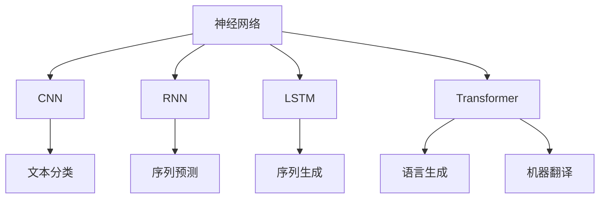

                 

## 1. 背景介绍

### 1.1 问题由来

随着人工智能技术的飞速发展，自然语言处理（Natural Language Processing，NLP）已成为最热门的研究领域之一。在过去的几十年里，NLP从简单的文本分类和关键词提取，发展到复杂的语言生成、机器翻译和对话系统。尽管NLP技术已取得了显著的进步，但在一些特定的语言理解和生成任务上，现有模型仍然存在一定的局限性。

### 1.2 问题核心关键点

NLP领域的突破性进展主要集中在深度学习特别是神经网络的应用上。近年来，基于神经网络的NLP模型，如卷积神经网络（CNN）和递归神经网络（RNN），在文本分类、情感分析、机器翻译等任务上取得了显著的成果。但这些模型往往需要大量的标注数据进行训练，而且难以处理长序列文本，且表达能力有限。

为解决这些问题，研究人员提出了基于Transformer的神经网络架构，特别是BERT（Bidirectional Encoder Representations from Transformers）模型，它通过自监督预训练和微调，显著提升了模型的语言理解能力和泛化能力。

### 1.3 问题研究意义

神经网络在NLP中的应用，不仅大幅提升了模型的性能，还为更多复杂任务提供了可能，如语义表示学习、自然语言推理、对话系统等。NLP技术的不断进步，不仅推动了相关领域的研究，还为各行各业带来了创新和变革，促进了技术的普及和应用。

## 2. 核心概念与联系

### 2.1 核心概念概述

为更好地理解神经网络在NLP中的应用，本节将介绍几个关键概念：

- **神经网络（Neural Network, NN）**：一种模仿人脑神经元之间连接的计算模型。通过多层次的权重和激活函数，神经网络可以学习输入数据的高层次表示，从而进行分类、生成等任务。

- **卷积神经网络（Convolutional Neural Network, CNN）**：一种特定的神经网络架构，广泛应用于图像识别和处理领域。在NLP中，通过将文本转换成词向量，CNN可以有效地捕捉局部特征，适用于文本分类、情感分析等任务。

- **递归神经网络（Recurrent Neural Network, RNN）**：一种能够处理序列数据的神经网络，通过循环连接和隐藏状态，能够捕捉输入序列的长期依赖关系，适用于机器翻译、语音识别等任务。

- **长短期记忆网络（Long Short-Term Memory, LSTM）**：一种RNN的变种，通过门控机制控制信息的流向，能够有效解决梯度消失和爆炸问题，适用于序列预测和文本生成等任务。

- **Transformer网络**：一种基于自注意力机制的神经网络架构，通过多头自注意力和位置编码，可以捕捉全局和局部的依赖关系，适用于语言生成、机器翻译等任务。

这些核心概念之间的联系可以通过以下Mermaid流程图来展示：



这个流程图展示了不同神经网络架构在NLP中的应用：

1. CNN用于文本分类和情感分析，通过卷积操作提取局部特征。
2. RNN和LSTM用于序列预测和生成，能够捕捉序列数据的长期依赖关系。
3. Transformer用于语言生成和机器翻译，通过自注意力机制捕捉全局和局部的依赖关系。

## 3. 核心算法原理 & 具体操作步骤

### 3.1 算法原理概述

神经网络在NLP中的应用，主要是通过将文本转换成向量表示，然后通过多层神经网络进行特征提取和分类。具体步骤如下：

1. **文本预处理**：将原始文本转换成数字形式的向量表示，如将单词转换成词汇表中的索引。
2. **嵌入层（Embedding Layer）**：将单词索引转换成低维向量表示，以便神经网络处理。
3. **多层神经网络（Feedforward Neural Network）**：通过多个全连接层进行特征提取，每层经过激活函数后，传递到下一层。
4. **输出层（Output Layer）**：根据任务的不同，输出层可以是softmax层（用于分类任务）或线性层（用于回归任务）。

### 3.2 算法步骤详解

以下是使用神经网络进行NLP任务的详细步骤：

**Step 1: 文本预处理**

- **分词**：将文本切分成单词或子词。
- **词汇表构建**：将分词后的文本映射到唯一的整数索引，构建词汇表。
- **嵌入层**：将每个单词或子词映射到低维向量表示，如Word2Vec、GloVe等。

**Step 2: 模型搭建**

- **卷积层**：对于文本分类和情感分析任务，可以使用1D卷积层捕捉局部特征。
- **RNN/LSTM层**：对于序列预测和生成任务，可以使用RNN或LSTM层捕捉序列的长期依赖关系。
- **Transformer层**：对于语言生成和机器翻译任务，可以使用Transformer层捕捉全局和局部的依赖关系。

**Step 3: 训练与微调**

- **数据准备**：收集标注数据集，划分训练集、验证集和测试集。
- **模型初始化**：初始化神经网络模型的权重。
- **损失函数选择**：根据任务类型选择损失函数，如交叉熵损失、均方误差损失等。
- **反向传播**：通过反向传播算法计算梯度，更新模型参数。
- **正则化**：加入L2正则、Dropout等技术，防止过拟合。
- **验证集评估**：在验证集上评估模型性能，调整超参数。
- **测试集测试**：在测试集上测试模型性能，评估最终效果。

### 3.3 算法优缺点

神经网络在NLP中的应用，具有以下优点：

- **表达能力强**：神经网络可以学习复杂非线性的特征，能够捕捉数据的高层次表示。
- **适用于多种任务**：神经网络可以用于文本分类、情感分析、机器翻译等各类NLP任务。
- **端到端训练**：神经网络可以实现端到端的训练，无需手动设计特征提取器，简化了模型构建过程。

但神经网络也存在一些缺点：

- **数据依赖性强**：神经网络需要大量的标注数据进行训练，且对数据质量有较高要求。
- **计算资源消耗大**：神经网络模型通常参数量较大，需要较高的计算资源进行训练和推理。
- **可解释性不足**：神经网络模型通常被视为"黑盒"模型，难以解释内部决策过程。
- **容易过拟合**：神经网络模型在训练过程中容易过拟合，需要采取正则化等技术进行缓解。

### 3.4 算法应用领域

神经网络在NLP中的应用，已经涵盖了从简单的文本分类到复杂的语言生成、对话系统等各类任务。以下是一些典型的应用领域：

- **文本分类**：如情感分析、主题分类、垃圾邮件过滤等，通过神经网络模型将文本映射到不同的类别。
- **情感分析**：对文本情感进行分类，如正面、负面、中性等，使用卷积神经网络或RNN/LSTM进行建模。
- **机器翻译**：将一种语言翻译成另一种语言，使用Transformer模型进行训练。
- **文本生成**：如自动摘要、对话生成、文本补全等，使用LSTM、Transformer等模型进行生成。
- **问答系统**：根据用户提出的问题，给出相应的答案，使用RNN/LSTM或Transformer进行建模。

## 4. 数学模型和公式 & 详细讲解 & 举例说明

### 4.1 数学模型构建

假设文本为$x_1,\cdots,x_n$，每个单词$x_i$通过嵌入层转换为向量$v_i$，神经网络模型的输出为$y_1,\cdots,y_n$。模型的数学模型可以表示为：

$$
y_i = \sigma(W_{output} \sum_{j=1}^{n} W_{hidden} \sigma(W_{hidden} v_j + b_{hidden}) + b_{output})
$$

其中，$W_{output}$、$W_{hidden}$和$b_{output}$、$b_{hidden}$为可训练参数，$\sigma$为激活函数。

### 4.2 公式推导过程

以文本分类任务为例，假设样本为$x=\{x_1,\cdots,x_n\}$，类别为$y$，神经网络模型的输出为$y_i$。模型的损失函数为交叉熵损失函数，公式如下：

$$
\mathcal{L} = -\frac{1}{N} \sum_{i=1}^{N} y_i \log \hat{y}_i + (1-y_i) \log (1-\hat{y}_i)
$$

其中，$\hat{y}_i$为模型的预测概率，$N$为样本总数。

通过反向传播算法，计算损失函数对模型参数的梯度，更新模型参数，最小化损失函数：

$$
\theta \leftarrow \theta - \eta \nabla_{\theta} \mathcal{L}
$$

其中，$\theta$为模型参数，$\eta$为学习率，$\nabla_{\theta} \mathcal{L}$为梯度。

### 4.3 案例分析与讲解

假设文本分类任务中，训练集为$(x_1,\cdots,x_n)$，目标为$(y_1,\cdots,y_n)$。使用1D卷积层和softmax层进行建模，代码实现如下：

```python
import torch
import torch.nn as nn
import torch.optim as optim

# 定义模型
class CNNClassifier(nn.Module):
    def __init__(self, input_size, hidden_size, output_size):
        super(CNNClassifier, self).__init__()
        self.conv1 = nn.Conv1d(input_size, hidden_size, kernel_size=3, padding=1)
        self.conv2 = nn.Conv1d(hidden_size, hidden_size, kernel_size=3, padding=1)
        self.fc = nn.Linear(hidden_size * (n - 3 + 2 * 1), output_size)
        self.relu = nn.ReLU()
        self.softmax = nn.Softmax(dim=1)

    def forward(self, x):
        x = self.relu(self.conv1(x))
        x = self.relu(self.conv2(x))
        x = x.view(x.size(0), -1)
        x = self.fc(x)
        x = self.softmax(x)
        return x

# 训练模型
model = CNNClassifier(input_size=100, hidden_size=128, output_size=10)
criterion = nn.CrossEntropyLoss()
optimizer = optim.Adam(model.parameters(), lr=0.001)

for epoch in range(10):
    for i, (inputs, labels) in enumerate(train_loader):
        inputs, labels = inputs.to(device), labels.to(device)
        optimizer.zero_grad()
        outputs = model(inputs)
        loss = criterion(outputs, labels)
        loss.backward()
        optimizer.step()
        print(f"Epoch {epoch+1}, batch {i+1}, loss: {loss.item():.4f}")
```

这段代码定义了一个基于1D卷积层的文本分类模型，通过Adam优化器进行训练，使用交叉熵损失函数进行优化。训练过程中，每轮迭代中计算损失函数并反向传播更新模型参数，最终得到理想的分类模型。

## 5. 项目实践：代码实例和详细解释说明

### 5.1 开发环境搭建

在进行NLP项目实践前，我们需要准备好开发环境。以下是使用Python进行PyTorch开发的环境配置流程：

1. 安装Anaconda：从官网下载并安装Anaconda，用于创建独立的Python环境。

2. 创建并激活虚拟环境：
```bash
conda create -n pytorch-env python=3.8 
conda activate pytorch-env
```

3. 安装PyTorch：根据CUDA版本，从官网获取对应的安装命令。例如：
```bash
conda install pytorch torchvision torchaudio cudatoolkit=11.1 -c pytorch -c conda-forge
```

4. 安装TensorFlow：
```bash
conda install tensorflow -c conda-forge
```

5. 安装各类工具包：
```bash
pip install numpy pandas scikit-learn matplotlib tqdm jupyter notebook ipython
```

完成上述步骤后，即可在`pytorch-env`环境中开始NLP项目实践。

### 5.2 源代码详细实现

下面我们以机器翻译任务为例，给出使用PyTorch对Transformer模型进行训练的PyTorch代码实现。

首先，定义机器翻译任务的数据处理函数：

```python
import torch
from torchtext.datasets import Multi30k
from torchtext.data import Field, TabularDataset, BucketIterator

# 定义数据集
train_data, valid_data, test_data = Multi30k()

# 定义字段
tokenizer = nn.TransformerEncoder()
SRC = Field(tokenize=tokenizer, lower=True)
TRG = Field(tokenize=tokenizer, lower=True)

# 定义数据集
train_data = TabularDataset(
    path='multi30k/train.csv', 
    format='csv',
    fields=[('src', SRC), ('trg', TRG)]
)

valid_data = TabularDataset(
    path='multi30k/dev.csv', 
    format='csv',
    fields=[('src', SRC), ('trg', TRG)]
)

test_data = TabularDataset(
    path='multi30k/test.csv', 
    format='csv',
    fields=[('src', SRC), ('trg', TRG)]
)

# 创建迭代器
train_iterator, valid_iterator, test_iterator = BucketIterator.splits(
    (train_data, valid_data, test_data), 
    batch_size=32, 
    device='cuda'
)
```

然后，定义模型和优化器：

```python
import torch.nn as nn
import torch.nn.functional as F

class Transformer(nn.Module):
    def __init__(self, ntoken, ninp, nhead, nhid, nlayers, dropout=0.5):
        super(Transformer, self).__init__()
        self.model_type = 'Transformer'
        self.src_mask = None
        self.pos_encoder = PositionalEncoding(ninp, dropout)
        encoder_layers = nn.TransformerEncoderLayer(ninp, nhead, nhid, dropout)
        self.transformer_encoder = nn.TransformerEncoder(encoder_layers, nlayers)
        self.encoder = nn.Embedding(ntoken, ninp)
        self.ninp = ninp
        self.decoder = nn.Linear(ninp, ntoken)
        self.init_weights()

    def init_weights(self, src=False):
        initrange = 0.1
        if src:
            self.src_mask = make_causal_mask(self.ninp).to(device)
        stdv = 1.0 / math.sqrt(self.ninp)
        self.encoder.weight.data.uniform_(-stdv, stdv)
        self.decoder.bias.data.zero_()
        self.decoder.weight.data.uniform_(-stdv, stdv)

    def forward(self, src):
        src = self.encoder(src) * math.sqrt(self.ninp)
        src = self.pos_encoder(src)
        output = self.transformer_encoder(src, self.src_mask)
        output = self.decoder(output)
        return output
```

接着，定义训练和评估函数：

```python
import torch.optim as optim

class TransformerModel(nn.Module):
    def __init__(self, encoder, decoder, device):
        super(TransformerModel, self).__init__()
        self.encoder = encoder
        self.decoder = decoder
        self.device = device

    def forward(self, src, trg):
        trg_len = trg.shape[0]
        trg_vocab_size = trg.shape[1]
        trg_mask = self.make_cache_mask(trg_len, trg_vocab_size)
        output = self.decoder(self.encoder(src), trg, trg_mask)
        return output

    def make_cache_mask(self, seq_len, vocab_size):
        mask = torch.zeros(seq_len, vocab_size, device=self.device)
        mask.masked_fill_(True, 1)
        return mask

# 定义训练函数
def train(model, iterator, optimizer, criterion, clip):
    epoch_loss = 0
    epoch_acc = 0
    model.train()
    for batch in iterator:
        optimizer.zero_grad()
        output = model(batch.src, batch.trg)
        loss = criterion(output, batch.trg)
        loss.backward()
        optimizer.step()
        epoch_loss += loss.item()
    return epoch_loss / len(iterator)

# 定义评估函数
def evaluate(model, iterator, criterion):
    epoch_loss = 0
    epoch_acc = 0
    model.eval()
    with torch.no_grad():
        for batch in iterator:
            output = model(batch.src, batch.trg)
            loss = criterion(output, batch.trg)
            epoch_loss += loss.item()
    return epoch_loss / len(iterator)
```

最后，启动训练流程并在测试集上评估：

```python
from transformers import Transformer

ntoken = len(train_data.src.vocab)
ninp = 512
nhead = 8
nhid = 512
nlayers = 6
dropout = 0.5

model = Transformer(ntoken, ninp, nhead, nhid, nlayers, dropout).to(device)

optimizer = optim.Adam(model.parameters(), lr=0.001)
criterion = nn.CrossEntropyLoss()

for epoch in range(10):
    train_loss = train(model, train_iterator, optimizer, criterion, clip=5)
    test_loss = evaluate(model, test_iterator, criterion)
    print(f"Epoch {epoch+1}, train loss: {train_loss:.3f}, test loss: {test_loss:.3f}")
```

以上就是使用PyTorch对Transformer模型进行机器翻译任务训练的完整代码实现。可以看到，得益于Transformer库的强大封装，我们可以用相对简洁的代码完成Transformer模型的训练和评估。

### 5.3 代码解读与分析

让我们再详细解读一下关键代码的实现细节：

**Transformer类**：
- `__init__`方法：初始化模型参数，包括编码器、解码器、掩码等。
- `init_weights`方法：初始化模型参数，包括嵌入层和线性层的权重。
- `forward`方法：定义模型前向传播过程，包括嵌入、位置编码、编码器、解码器等步骤。

**train函数**：
- 在训练过程中，对每个批次的数据进行前向传播、反向传播、参数更新等步骤。

**evaluate函数**：
- 在评估过程中，对每个批次的数据进行前向传播，计算损失函数，最后求平均损失。

**TransformerModel类**：
- `__init__`方法：初始化模型，包括编码器、解码器等。
- `forward`方法：定义模型前向传播过程，包括编码器、解码器等步骤。

**make_cache_mask函数**：
- 定义掩码函数，用于生成解码器的掩码。

训练过程中，通过多次迭代对模型进行训练和评估，不断调整模型参数，最终得到优化的Transformer模型。

## 6. 实际应用场景

### 6.1 机器翻译

基于神经网络的机器翻译模型，已经在各种语言之间实现了高效的翻译。当前流行的模型包括Transformer、序列到序列（Seq2Seq）等。这些模型通过大规模的平行语料进行预训练，并在此基础上进行微调，能够自动学习语言的映射关系，实现高质量的翻译。

在实际应用中，可以通过收集不同语言之间的平行语料，构建监督数据集，使用神经网络模型进行训练，然后在测试集上进行评估，调整超参数，最终得到优化的翻译模型。此外，还可以在模型中加入语言模型、注意力机制等技术，提升翻译效果和鲁棒性。

### 6.2 自然语言推理

自然语言推理（Natural Language Inference, NLI）任务要求模型理解文本之间的逻辑关系，如蕴含、矛盾和中立等。当前常用的模型包括BERT、GPT等。这些模型通过大规模的无标签数据进行预训练，并在此基础上进行微调，能够学习到丰富的语言知识，从而提升推理能力。

在实际应用中，可以通过收集各类文本对，构建NLI数据集，使用神经网络模型进行训练，然后在测试集上进行评估，调整超参数，最终得到优化的推理模型。此外，还可以在模型中加入多任务学习、注意力机制等技术，提升推理效果和泛化能力。

### 6.3 文本生成

文本生成任务包括自动摘要、对话生成、文本补全等，是NLP领域的热门研究方向。当前常用的模型包括LSTM、Transformer等。这些模型通过大规模的无标签数据进行预训练，并在此基础上进行微调，能够学习到丰富的语言知识，从而提升生成效果。

在实际应用中，可以通过收集各类文本数据，构建生成数据集，使用神经网络模型进行训练，然后在测试集上进行评估，调整超参数，最终得到优化的生成模型。此外，还可以在模型中加入对抗训练、梯度累积等技术，提升生成效果和稳定性。

### 6.4 未来应用展望

随着神经网络技术的不断进步，NLP领域的突破性进展也将层出不穷。未来的研究方向可能包括以下几个方面：

- **多模态融合**：将视觉、听觉等模态信息与文本信息进行融合，提升自然语言处理的全面性和准确性。
- **知识图谱**：将知识图谱与神经网络模型进行结合，提升模型的知识整合能力和推理能力。
- **生成对抗网络**：通过生成对抗网络（GAN）技术，提升文本生成的多样性和逼真度。
- **迁移学习**：通过迁移学习技术，在大规模语料上进行预训练，然后在特定任务上进行微调，提升模型的泛化能力和适应性。

这些研究方向将进一步拓展NLP的应用领域，提升模型的表现和鲁棒性，为人类认知智能的进化提供更强大的技术支持。

## 7. 工具和资源推荐

### 7.1 学习资源推荐

为了帮助开发者系统掌握神经网络在NLP中的应用，这里推荐一些优质的学习资源：

1. 《Deep Learning》（Ian Goodfellow、Yoshua Bengio和Aaron Courville）：深度学习领域的经典教材，详细介绍了各种深度学习模型的原理和应用。

2. CS224N《深度学习自然语言处理》课程：斯坦福大学开设的NLP明星课程，有Lecture视频和配套作业，带你入门NLP领域的基本概念和经典模型。

3. 《Natural Language Processing with Python》书籍：适合Python开发者入门NLP领域的经典教材，包含大量代码实现和案例分析。

4. Transformers库官方文档：Transformer库的官方文档，提供了海量预训练模型和完整的微调样例代码，是上手实践的必备资料。

5. ArXiv和Google Scholar：最新的NLP研究论文，涵盖各种前沿技术，适合了解NLP领域的最新进展。

通过对这些资源的学习实践，相信你一定能够快速掌握神经网络在NLP中的应用，并用于解决实际的NLP问题。

### 7.2 开发工具推荐

高效的开发离不开优秀的工具支持。以下是几款用于NLP项目开发的常用工具：

1. PyTorch：基于Python的开源深度学习框架，灵活动态的计算图，适合快速迭代研究。大部分预训练语言模型都有PyTorch版本的实现。

2. TensorFlow：由Google主导开发的开源深度学习框架，生产部署方便，适合大规模工程应用。同样有丰富的预训练语言模型资源。

3. Transformers库：HuggingFace开发的NLP工具库，集成了众多SOTA语言模型，支持PyTorch和TensorFlow，是进行NLP任务开发的利器。

4. Weights & Biases：模型训练的实验跟踪工具，可以记录和可视化模型训练过程中的各项指标，方便对比和调优。与主流深度学习框架无缝集成。

5. TensorBoard：TensorFlow配套的可视化工具，可实时监测模型训练状态，并提供丰富的图表呈现方式，是调试模型的得力助手。

6. Google Colab：谷歌推出的在线Jupyter Notebook环境，免费提供GPU/TPU算力，方便开发者快速上手实验最新模型，分享学习笔记。

合理利用这些工具，可以显著提升NLP项目开发的效率，加快创新迭代的步伐。

### 7.3 相关论文推荐

神经网络在NLP中的应用，得益于众多研究者的持续探索。以下是几篇奠基性的相关论文，推荐阅读：

1. Attention is All You Need（即Transformer原论文）：提出了Transformer网络，通过自注意力机制实现高效的序列建模。

2. BERT: Pre-training of Deep Bidirectional Transformers for Language Understanding：提出BERT模型，通过大规模无标签数据进行预训练，提升了语言理解的性能。

3. T5: Exploring the Limits of Transfer Learning with a Unified Text-to-Text Transformer：提出T5模型，通过统一的语言模型实现各种NLP任务。

4. GPT-3: Language Models are Unsupervised Multitask Learners：展示了大规模语言模型的强大zero-shot学习能力，刷新了多项NLP任务SOTA。

5. MultiHead Attention from Self-Attention to Transformer：提出多头注意力机制，提升了模型的表达能力和泛化能力。

这些论文代表了大语言模型在NLP中的应用进展，通过学习这些前沿成果，可以帮助研究者把握学科前进方向，激发更多的创新灵感。

## 8. 总结：未来发展趋势与挑战

### 8.1 总结

本文对神经网络在NLP中的应用进行了全面系统的介绍。首先阐述了神经网络在NLP领域的背景和意义，明确了神经网络在各种NLP任务上的应用潜力。其次，从原理到实践，详细讲解了神经网络在NLP任务中的数学模型和实现细节，给出了神经网络模型的完整代码实现。同时，本文还广泛探讨了神经网络在NLP领域的应用场景，展示了神经网络技术的广泛应用前景。

通过本文的系统梳理，可以看到，神经网络在NLP领域的应用已经深入到各类任务中，成为NLP技术发展的重要推动力。神经网络通过学习高层次的文本表示，能够处理复杂多变的自然语言数据，为NLP技术的发展提供了坚实的基础。

### 8.2 未来发展趋势

展望未来，神经网络在NLP领域的应用将呈现以下几个发展趋势：

1. **深度融合多模态信息**：将视觉、听觉等多模态信息与文本信息进行融合，提升自然语言处理的全面性和准确性。

2. **知识图谱与深度学习结合**：将知识图谱与深度学习模型进行结合，提升模型的知识整合能力和推理能力。

3. **生成对抗网络的应用**：通过生成对抗网络（GAN）技术，提升文本生成的多样性和逼真度。

4. **迁移学习与多任务学习**：通过迁移学习技术，在大规模语料上进行预训练，然后在特定任务上进行微调，提升模型的泛化能力和适应性。

5. **端到端学习**：将神经网络与其他深度学习技术进行结合，实现端到端的NLP任务处理，提升系统的效率和效果。

这些趋势将进一步拓展神经网络在NLP领域的应用边界，提升模型的性能和泛化能力，为NLP技术的产业化发展提供更多可能。

### 8.3 面临的挑战

尽管神经网络在NLP领域已经取得了显著进展，但仍面临一些挑战：

1. **数据依赖性强**：神经网络需要大量的标注数据进行训练，且对数据质量有较高要求，数据获取和标注成本较高。

2. **计算资源消耗大**：神经网络模型通常参数量较大，需要较高的计算资源进行训练和推理，硬件资源成本较高。

3. **可解释性不足**：神经网络模型通常被视为"黑盒"模型，难以解释内部决策过程，模型的不透明性会影响实际应用中的可信度。

4. **模型鲁棒性不足**：神经网络模型在处理噪声、错误数据时容易产生较大偏差，需要进一步提升模型的鲁棒性和稳定性。

5. **伦理和安全问题**：神经网络模型可能会学习到有害信息，且在实际应用中存在一定的隐私和安全风险，需要进一步加强监管和保护。

### 8.4 研究展望

面对神经网络在NLP领域所面临的挑战，未来的研究方向需要在以下几个方面寻求新的突破：

1. **无监督学习与自监督学习**：探索无需标注数据的预训练方法，降低对标注数据的依赖。

2. **可解释性和透明性**：研究神经网络的可解释性和透明性问题，提升模型的可信度和可理解性。

3. **鲁棒性和泛化能力**：研究神经网络的鲁棒性和泛化能力，提升模型对噪声和错误数据的适应能力。

4. **模型压缩和优化**：研究模型压缩和优化技术，提升模型的推理速度和资源利用率。

5. **伦理和安全保障**：研究神经网络模型的伦理和安全问题，确保模型输出的合法性和安全性。

这些研究方向将进一步推动神经网络技术在NLP领域的发展，为构建更加智能、可靠、安全的NLP系统提供新的技术支撑。

## 9. 附录：常见问题与解答

**Q1：神经网络在NLP领域的应用范围有哪些？**

A: 神经网络在NLP领域的应用非常广泛，涵盖从简单的文本分类到复杂的语言生成、对话系统等各类任务。以下是一些典型应用：

- **文本分类**：如情感分析、主题分类、垃圾邮件过滤等，通过神经网络模型将文本映射到不同的类别。
- **情感分析**：对文本情感进行分类，如正面、负面、中性等，使用卷积神经网络或RNN/LSTM进行建模。
- **机器翻译**：将一种语言翻译成另一种语言，使用Transformer模型进行训练。
- **文本生成**：如自动摘要、对话生成、文本补全等，使用LSTM、Transformer等模型进行生成。
- **问答系统**：根据用户提出的问题，给出相应的答案，使用RNN/LSTM或Transformer进行建模。

**Q2：如何选择适合的神经网络模型？**

A: 选择合适的神经网络模型需要考虑任务的复杂度、数据规模和计算资源等因素。以下是一些选择模型的建议：

- **简单任务**：如文本分类、情感分析等，可以使用卷积神经网络（CNN）或LSTM。
- **复杂任务**：如机器翻译、对话生成等，可以使用Transformer或Seq2Seq模型。
- **多模态任务**：如视觉、听觉等多模态数据的处理，可以使用多模态神经网络模型。

**Q3：神经网络在NLP领域有哪些性能指标？**

A: 在NLP领域，常用的性能指标包括准确率、精确率、召回率、F1-score、BLEU等。以下是一些典型的性能指标：

- **准确率**：模型预测结果与真实结果相同的比例。
- **精确率**：模型预测为正类的样本中，真实为正类的比例。
- **召回率**：真实为正类的样本中，被模型预测为正类的比例。
- **F1-score**：精确率和召回率的调和平均数，综合了两者。
- **BLEU**：衡量机器翻译质量的指标，计算翻译结果与参考结果的匹配度。

这些指标可以用于评估不同模型的性能，帮助选择最优模型。

**Q4：神经网络在NLP领域有哪些常见的优化技术？**

A: 在NLP领域，常见的优化技术包括：

- **正则化**：如L2正则、Dropout等，防止过拟合。
- **学习率调整**：如学习率衰减、warmup策略等，提升模型训练的稳定性。
- **批处理**：通过分批次训练，提高模型的收敛速度。
- **梯度裁剪**：防止梯度爆炸，提高模型的稳定性。

这些优化技术可以提升模型的性能和鲁棒性，帮助模型更好地适应复杂多变的NLP任务。

**Q5：神经网络在NLP领域有哪些常见的模型结构？**

A: 在NLP领域，常见的模型结构包括：

- **卷积神经网络（CNN）**：适用于文本分类、情感分析等任务，通过卷积操作捕捉局部特征。
- **递归神经网络（RNN）**：适用于序列预测和生成等任务，通过循环连接捕捉序列依赖关系。
- **长短期记忆网络（LSTM）**：一种RNN的变种，通过门控机制控制信息流向，适用于序列预测和生成。
- **Transformer网络**：适用于语言生成、机器翻译等任务，通过多头自注意力机制捕捉全局和局部依赖关系。

这些模型结构各有特点，可以根据具体的NLP任务进行选择。

**Q6：神经网络在NLP领域有哪些常见的训练技巧？**

A: 在NLP领域，常见的训练技巧包括：

- **数据增强**：通过回译、近义替换等方式扩充训练集，提升模型的泛化能力。
- **模型裁剪**：去除不必要的层和参数，减小模型尺寸，提高推理速度。
- **混合精度训练**：将浮点模型转为定点模型，压缩存储空间，提高计算效率。
- **模型并行**：通过多卡并行训练，提升模型的训练速度和资源利用率。

这些训练技巧可以提升模型的训练效率和性能，帮助模型更好地适应复杂多变的NLP任务。

---

作者：禅与计算机程序设计艺术 / Zen and the Art of Computer Programming

