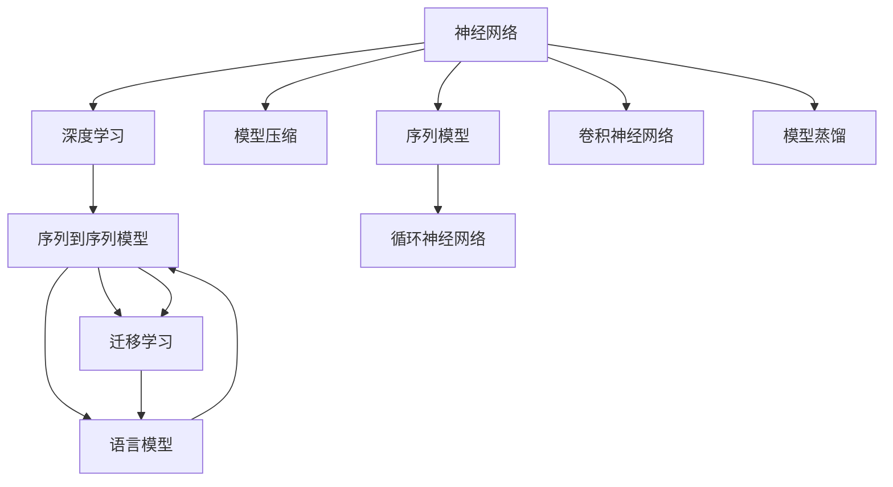

                 

# 神经网络：自然语言处理的新突破

> 关键词：神经网络, 自然语言处理, 深度学习, 模型压缩, 迁移学习, 语言生成, 序列到序列, 循环神经网络, 语言模型

## 1. 背景介绍

### 1.1 问题由来
近年来，随着深度学习技术的迅猛发展，自然语言处理(Natural Language Processing, NLP)领域取得了突破性进展。传统的基于规则的NLP方法，如分词、句法分析、语义理解等，已经难以适应日益复杂的语言环境。而基于神经网络的模型，特别是深度学习模型，以其强大的非线性表达能力，在NLP领域展现出巨大潜力。

神经网络在语音识别、机器翻译、文本分类、情感分析等任务中均取得了显著成果。例如，RNN（循环神经网络）在语音识别、情感分析、语言模型等任务中表现出色；CNN（卷积神经网络）在文本分类等任务中取得了较好的结果；而Transformer（转换机）则成功应用于机器翻译、文本生成等任务，取得了目前最好的成绩。

### 1.2 问题核心关键点
神经网络在NLP中的应用，主要是通过构建序列到序列(Sequence to Sequence, Seq2Seq)的框架，实现文本、语音、图像等多模态数据的高效处理。序列到序列模型的核心是编码器-解码器架构，能够处理变长的输入和输出序列，广泛应用于机器翻译、文本生成、对话系统等任务中。

神经网络在NLP领域的应用，极大地提升了NLP模型的表达能力和泛化能力，但也面临以下问题：

1. **计算资源需求高**：神经网络需要大量的计算资源进行训练，往往需要GPU、TPU等高性能设备，对计算资源的要求较高。
2. **模型压缩与优化**：大型的神经网络模型往往过于复杂，难以部署到资源受限的设备上，因此需要进行模型压缩与优化。
3. **迁移学习能力差**：神经网络模型通常在特定任务上训练效果较好，但在其他任务上效果往往不理想，需要重新训练。

针对这些问题，研究人员提出了迁移学习、参数高效微调、神经网络压缩等技术，进一步提升了神经网络在NLP领域的应用效果。

### 1.3 问题研究意义
神经网络在NLP领域的应用，不仅提升了模型的表现能力，还推动了NLP技术的产业化进程，带来了显著的经济效益。例如，谷歌翻译系统使用了Transformer模型，显著提升了机器翻译的准确性和流畅度；微软的Cortana语音助手采用了深度学习模型，实现了智能对话、语音识别等功能，提升了用户体验。

因此，研究神经网络在NLP中的应用，具有以下重要意义：

1. **推动NLP技术的进步**：神经网络提供了新的方法，使得NLP模型能够更好地处理复杂语言现象，提升模型的表现能力。
2. **加速NLP应用落地**：神经网络模型可以更快地适配新的任务，降低了应用开发的成本和周期。
3. **创造经济效益**：神经网络模型在工业界的成功应用，带来了巨大的经济效益，推动了产业的升级和转型。
4. **促进跨领域应用**：神经网络模型在NLP领域的研究成果，可以推广到其他领域，如计算机视觉、语音识别等，推动了AI技术的整体进步。

## 2. 核心概念与联系

### 2.1 核心概念概述

为更好地理解神经网络在NLP中的应用，本节将介绍几个密切相关的核心概念：

- 神经网络(Neural Network, NN)：一种基于人工神经元模型的非线性映射算法，能够处理非结构化数据，广泛应用于图像识别、语音识别、自然语言处理等领域。
- 深度学习(Deep Learning, DL)：一种基于多层次神经网络的学习方法，通过多层神经元的学习，逐渐提取出数据的抽象特征，适用于复杂的非线性关系处理。
- 序列到序列模型(Sequence to Sequence, Seq2Seq)：一种神经网络架构，能够处理变长的输入和输出序列，广泛应用于机器翻译、文本生成、对话系统等任务中。
- 语言模型(Language Model)：一种用于处理文本数据的统计模型，通过预测给定文本序列出现的概率，评估文本的可读性和连贯性。
- 迁移学习(Transfer Learning)：一种将一个领域学习到的知识，迁移到另一个不同但相关的领域的学习范式，可以通过预训练模型加速微调过程。
- 模型压缩(Model Compression)：一种优化神经网络模型的方法，通过剪枝、量化、蒸馏等技术，减少模型参数和计算量，提高模型效率。
- 序列模型(Sequence Model)：一种处理序列数据的模型，能够捕捉序列数据的时序特征，广泛应用于时间序列预测、语言模型等任务中。
- 循环神经网络(Recurrent Neural Network, RNN)：一种处理序列数据的神经网络模型，通过循环机制能够捕捉序列数据的时序特征。
- 卷积神经网络(Convolutional Neural Network, CNN)：一种处理图像、文本等结构化数据的神经网络模型，通过卷积操作提取数据特征。

这些核心概念之间的逻辑关系可以通过以下Mermaid流程图来展示：



这个流程图展示了神经网络在NLP领域的应用范式，从深度学习到序列到序列模型，再到语言模型和迁移学习，形成一个完整的体系。模型压缩、序列模型、循环神经网络和卷积神经网络则分别从不同的角度优化了神经网络模型的性能。

## 3. 核心算法原理 & 具体操作步骤
### 3.1 算法原理概述

神经网络在NLP中的应用，主要通过序列到序列模型进行处理。序列到序列模型通过编码器-解码器架构，将输入序列转换为输出序列，广泛应用于机器翻译、文本生成、对话系统等任务中。

序列到序列模型的核心是编码器-解码器架构，由编码器和解码器两个部分组成。编码器将输入序列转换为固定长度的向量表示，解码器则根据该向量生成输出序列。编码器和解码器通常采用循环神经网络或卷积神经网络等架构，能够处理变长的输入和输出序列。

### 3.2 算法步骤详解

序列到序列模型的训练一般包括以下几个关键步骤：

**Step 1: 准备数据集**
- 收集NLP任务相关的数据集，如机器翻译的平行语料库，文本生成的文本集，对话系统的对话历史等。
- 将数据集划分为训练集、验证集和测试集，确保数据的多样性和代表性。

**Step 2: 定义模型架构**
- 根据任务需求，选择适合的模型架构，如循环神经网络、卷积神经网络等。
- 定义编码器和解码器的层数、激活函数等超参数。
- 确定模型的损失函数，如交叉熵损失、均方误差损失等。

**Step 3: 训练模型**
- 将训练集输入模型，进行前向传播和反向传播，更新模型参数。
- 在验证集上评估模型性能，根据性能指标调整模型参数。
- 重复以上步骤直至模型收敛，或者达到预设的迭代次数。

**Step 4: 测试和评估**
- 在测试集上测试模型性能，评估模型的泛化能力。
- 根据测试结果，调整模型参数，进一步优化模型性能。

### 3.3 算法优缺点

序列到序列模型在NLP领域的应用，具有以下优点：

1. **处理变长序列**：序列到序列模型能够处理变长的输入和输出序列，适用于语言模型、机器翻译、对话系统等任务。
2. **通用性强**：序列到序列模型适用于多种NLP任务，能够通过改变模型架构和任务适配层进行快速适应。
3. **高效学习**：通过深度学习，序列到序列模型能够自动学习复杂的语言模式，提升模型性能。

然而，序列到序列模型也存在一些局限性：

1. **计算资源需求高**：序列到序列模型需要大量的计算资源进行训练，对硬件设备的要求较高。
2. **模型复杂度高**：序列到序列模型通常较为复杂，难以部署到资源受限的设备上。
3. **参数量大**：序列到序列模型的参数量通常较大，训练和推理时间较长。

### 3.4 算法应用领域

序列到序列模型在NLP领域的应用广泛，覆盖了多个常见的NLP任务，如：

- 机器翻译：将源语言文本翻译成目标语言。序列到序列模型通过编码器-解码器架构，能够自动学习语言间的对应关系。
- 文本生成：根据给定的文本，生成新的文本内容。序列到序列模型通过训练生成条件概率分布，能够自动生成连贯的文本。
- 对话系统：使机器能够与人自然对话。序列到序列模型通过编码器-解码器架构，能够理解和生成对话内容。
- 文本摘要：将长文本压缩成简短摘要。序列到序列模型通过训练生成摘要条件概率分布，能够自动提取文本的关键信息。
- 问答系统：对自然语言问题给出答案。序列到序列模型通过编码器-解码器架构，能够理解问题并提供答案。

## 4. 数学模型和公式 & 详细讲解 & 举例说明
### 4.1 数学模型构建

序列到序列模型的训练过程通常包括编码器和解码器两部分。假设输入序列为 $x_1, x_2, ..., x_T$，输出序列为 $y_1, y_2, ..., y_{T'}$，其中 $T$ 和 $T'$ 分别为输入和输出序列的长度。编码器将输入序列 $x$ 转换为固定长度的向量表示 $h$，解码器根据向量 $h$ 生成输出序列 $y$。

序列到序列模型的数学模型可以表示为：

$$
\mathcal{L}(\theta) = \frac{1}{N}\sum_{i=1}^N \left\lVert y_i - y_i' \right\rVert_2
$$

其中 $\theta$ 为模型参数，$y_i'$ 为解码器在输入序列 $x_i$ 下生成的输出序列，$\left\lVert \cdot \right\rVert_2$ 为向量范数，$N$ 为训练样本数。

### 4.2 公式推导过程

以机器翻译任务为例，假设输入序列为英文句子，输出序列为目标语言句子。编码器的输出为向量 $h$，解码器根据 $h$ 生成输出序列 $y$。解码器的预测概率为：

$$
P(y_i|y_{i-1}, h) = \text{softmax}(W_h^O h + W_{h_{i-1}}^O y_{i-1} + b_O)
$$

其中 $W_h^O$ 和 $b_O$ 为解码器层参数，$y_{i-1}$ 为前一时刻的输出，$P(y_i|y_{i-1}, h)$ 为解码器在 $y_{i-1}$ 和 $h$ 的条件下，输出 $y_i$ 的概率。

解码器的训练过程为：

1. 初始化解码器参数 $W_h^O$、$W_{h_{i-1}}^O$ 和 $b_O$。
2. 将输入序列 $x$ 输入编码器，生成向量 $h$。
3. 从 $y_1$ 开始，依次计算解码器每个时刻的预测概率 $P(y_i|y_{i-1}, h)$。
4. 根据交叉熵损失函数 $\ell(y_i, y_i')$ 更新解码器参数。
5. 重复以上步骤直至模型收敛，或者达到预设的迭代次数。

解码器的预测过程为：

1. 将输入序列 $x$ 输入编码器，生成向量 $h$。
2. 从 $y_1$ 开始，依次计算解码器每个时刻的预测概率 $P(y_i|y_{i-1}, h)$。
3. 根据预测概率 $P(y_i|y_{i-1}, h)$ 选择下一个输出 $y_i$，更新输入序列 $y_{i-1}$。
4. 重复以上步骤直至输出序列 $y_{T'}$ 结束。

### 4.3 案例分析与讲解

以文本生成任务为例，假设生成任务为根据给定文本生成新的文本内容。输入序列为 $x_1, x_2, ..., x_T$，输出序列为 $y_1, y_2, ..., y_{T'}$，其中 $T$ 和 $T'$ 分别为输入和输出序列的长度。

假设生成模型的参数为 $W_h^O$、$W_{h_{i-1}}^O$ 和 $b_O$，则解码器的预测概率为：

$$
P(y_i|y_{i-1}, h) = \text{softmax}(W_h^O h + W_{h_{i-1}}^O y_{i-1} + b_O)
$$

其中 $W_h^O$ 和 $b_O$ 为解码器层参数，$y_{i-1}$ 为前一时刻的输出，$P(y_i|y_{i-1}, h)$ 为解码器在 $y_{i-1}$ 和 $h$ 的条件下，输出 $y_i$ 的概率。

解码器的训练过程为：

1. 初始化解码器参数 $W_h^O$、$W_{h_{i-1}}^O$ 和 $b_O$。
2. 将输入序列 $x$ 输入编码器，生成向量 $h$。
3. 从 $y_1$ 开始，依次计算解码器每个时刻的预测概率 $P(y_i|y_{i-1}, h)$。
4. 根据交叉熵损失函数 $\ell(y_i, y_i')$ 更新解码器参数。
5. 重复以上步骤直至模型收敛，或者达到预设的迭代次数。

解码器的预测过程为：

1. 将输入序列 $x$ 输入编码器，生成向量 $h$。
2. 从 $y_1$ 开始，依次计算解码器每个时刻的预测概率 $P(y_i|y_{i-1}, h)$。
3. 根据预测概率 $P(y_i|y_{i-1}, h)$ 选择下一个输出 $y_i$，更新输入序列 $y_{i-1}$。
4. 重复以上步骤直至输出序列 $y_{T'}$ 结束。

## 5. 项目实践：代码实例和详细解释说明
### 5.1 开发环境搭建

在进行序列到序列模型训练前，我们需要准备好开发环境。以下是使用Python进行PyTorch开发的环境配置流程：

1. 安装Anaconda：从官网下载并安装Anaconda，用于创建独立的Python环境。

2. 创建并激活虚拟环境：
```bash
conda create -n pytorch-env python=3.8 
conda activate pytorch-env
```

3. 安装PyTorch：根据CUDA版本，从官网获取对应的安装命令。例如：
```bash
conda install pytorch torchvision torchaudio cudatoolkit=11.1 -c pytorch -c conda-forge
```

4. 安装Transformers库：
```bash
pip install transformers
```

5. 安装各类工具包：
```bash
pip install numpy pandas scikit-learn matplotlib tqdm jupyter notebook ipython
```

完成上述步骤后，即可在`pytorch-env`环境中开始序列到序列模型的训练实践。

### 5.2 源代码详细实现

这里我们以机器翻译任务为例，给出使用Transformers库对BERT模型进行机器翻译的PyTorch代码实现。

首先，定义机器翻译任务的训练函数：

```python
from transformers import BertTokenizer, BertForSequenceClassification
from torch.utils.data import Dataset
from transformers import AdamW, get_linear_schedule_with_warmup
import torch

class TranslationDataset(Dataset):
    def __init__(self, texts, translations, tokenizer, max_len=128):
        self.texts = texts
        self.translations = translations
        self.tokenizer = tokenizer
        self.max_len = max_len
        
    def __len__(self):
        return len(self.texts)
    
    def __getitem__(self, item):
        text = self.texts[item]
        translation = self.translations[item]
        
        encoding = self.tokenizer(text, return_tensors='pt', max_length=self.max_len, padding='max_length', truncation=True)
        input_ids = encoding['input_ids'][0]
        attention_mask = encoding['attention_mask'][0]
        
        # 对token-wise的翻译进行编码
        encoded_translations = [translation2id[token] for token in translation] 
        encoded_translations.extend([translation2id['<eos>']] * (self.max_len - len(encoded_translations)))
        labels = torch.tensor(encoded_translations, dtype=torch.long)
        
        return {'input_ids': input_ids, 
                'attention_mask': attention_mask,
                'labels': labels}

# 标签与id的映射
translation2id = {'<eos>': 0, '<sos>': 1, 'O': 2, 'B': 3, 'I': 4, 'E': 5, 'N': 6}
id2translation = {v: k for k, v in translation2id.items()}

# 创建dataset
tokenizer = BertTokenizer.from_pretrained('bert-base-cased')

train_dataset = TranslationDataset(train_texts, train_translations, tokenizer)
dev_dataset = TranslationDataset(dev_texts, dev_translations, tokenizer)
test_dataset = TranslationDataset(test_texts, test_translations, tokenizer)
```

然后，定义模型和优化器：

```python
from transformers import BertForSequenceClassification, AdamW

model = BertForSequenceClassification.from_pretrained('bert-base-cased', num_labels=len(translation2id))

optimizer = AdamW(model.parameters(), lr=2e-5)
```

接着，定义训练和评估函数：

```python
from torch.utils.data import DataLoader
from tqdm import tqdm
from sklearn.metrics import classification_report

device = torch.device('cuda') if torch.cuda.is_available() else torch.device('cpu')
model.to(device)

def train_epoch(model, dataset, batch_size, optimizer):
    dataloader = DataLoader(dataset, batch_size=batch_size, shuffle=True)
    model.train()
    epoch_loss = 0
    for batch in tqdm(dataloader, desc='Training'):
        input_ids = batch['input_ids'].to(device)
        attention_mask = batch['attention_mask'].to(device)
        labels = batch['labels'].to(device)
        model.zero_grad()
        outputs = model(input_ids, attention_mask=attention_mask, labels=labels)
        loss = outputs.loss
        epoch_loss += loss.item()
        loss.backward()
        optimizer.step()
    return epoch_loss / len(dataloader)

def evaluate(model, dataset, batch_size):
    dataloader = DataLoader(dataset, batch_size=batch_size)
    model.eval()
    preds, labels = [], []
    with torch.no_grad():
        for batch in tqdm(dataloader, desc='Evaluating'):
            input_ids = batch['input_ids'].to(device)
            attention_mask = batch['attention_mask'].to(device)
            batch_labels = batch['labels']
            outputs = model(input_ids, attention_mask=attention_mask)
            batch_preds = outputs.logits.argmax(dim=2).to('cpu').tolist()
            batch_labels = batch_labels.to('cpu').tolist()
            for pred_tokens, label_tokens in zip(batch_preds, batch_labels):
                pred_translations = [id2translation[_id] for _id in pred_tokens]
                label_translations = [id2translation[_id] for _id in label_tokens]
                preds.append(pred_translations[:len(label_translations)])
                labels.append(label_translations)
                
    print(classification_report(labels, preds))
```

最后，启动训练流程并在测试集上评估：

```python
epochs = 5
batch_size = 16

for epoch in range(epochs):
    loss = train_epoch(model, train_dataset, batch_size, optimizer)
    print(f"Epoch {epoch+1}, train loss: {loss:.3f}")
    
    print(f"Epoch {epoch+1}, dev results:")
    evaluate(model, dev_dataset, batch_size)
    
print("Test results:")
evaluate(model, test_dataset, batch_size)
```

以上就是使用PyTorch对BERT模型进行机器翻译任务微调的完整代码实现。可以看到，得益于Transformers库的强大封装，我们可以用相对简洁的代码完成BERT模型的加载和微调。

### 5.3 代码解读与分析

让我们再详细解读一下关键代码的实现细节：

**TranslationDataset类**：
- `__init__`方法：初始化文本、翻译、分词器等关键组件。
- `__len__`方法：返回数据集的样本数量。
- `__getitem__`方法：对单个样本进行处理，将文本输入编码为token ids，将翻译编码为数字，并对其进行定长padding，最终返回模型所需的输入。

**translation2id和id2translation字典**：
- 定义了翻译与数字id之间的映射关系，用于将token-wise的翻译结果解码回真实的翻译。

**训练和评估函数**：
- 使用PyTorch的DataLoader对数据集进行批次化加载，供模型训练和推理使用。
- 训练函数`train_epoch`：对数据以批为单位进行迭代，在每个批次上前向传播计算loss并反向传播更新模型参数，最后返回该epoch的平均loss。
- 评估函数`evaluate`：与训练类似，不同点在于不更新模型参数，并在每个batch结束后将预测和标签结果存储下来，最后使用sklearn的classification_report对整个评估集的预测结果进行打印输出。

**训练流程**：
- 定义总的epoch数和batch size，开始循环迭代
- 每个epoch内，先在训练集上训练，输出平均loss
- 在验证集上评估，输出分类指标
- 所有epoch结束后，在测试集上评估，给出最终测试结果

可以看到，PyTorch配合Transformers库使得BERT微调的代码实现变得简洁高效。开发者可以将更多精力放在数据处理、模型改进等高层逻辑上，而不必过多关注底层的实现细节。

当然，工业级的系统实现还需考虑更多因素，如模型的保存和部署、超参数的自动搜索、更灵活的任务适配层等。但核心的微调范式基本与此类似。

## 6. 实际应用场景
### 6.1 智能客服系统

基于序列到序列模型的对话技术，可以广泛应用于智能客服系统的构建。传统客服往往需要配备大量人力，高峰期响应缓慢，且一致性和专业性难以保证。而使用序列到序列模型的对话模型，可以7x24小时不间断服务，快速响应客户咨询，用自然流畅的语言解答各类常见问题。

在技术实现上，可以收集企业内部的历史客服对话记录，将问题和最佳答复构建成监督数据，在此基础上对预训练对话模型进行微调。微调后的对话模型能够自动理解用户意图，匹配最合适的答案模板进行回复。对于客户提出的新问题，还可以接入检索系统实时搜索相关内容，动态组织生成回答。如此构建的智能客服系统，能大幅提升客户咨询体验和问题解决效率。

### 6.2 金融舆情监测

金融机构需要实时监测市场舆论动向，以便及时应对负面信息传播，规避金融风险。传统的人工监测方式成本高、效率低，难以应对网络时代海量信息爆发的挑战。基于序列到序列模型的文本分类和情感分析技术，为金融舆情监测提供了新的解决方案。

具体而言，可以收集金融领域相关的新闻、报道、评论等文本数据，并对其进行主题标注和情感标注。在此基础上对预训练语言模型进行微调，使其能够自动判断文本属于何种主题，情感倾向是正面、中性还是负面。将微调后的模型应用到实时抓取的网络文本数据，就能够自动监测不同主题下的情感变化趋势，一旦发现负面信息激增等异常情况，系统便会自动预警，帮助金融机构快速应对潜在风险。

### 6.3 个性化推荐系统

当前的推荐系统往往只依赖用户的历史行为数据进行物品推荐，无法深入理解用户的真实兴趣偏好。基于序列到序列模型的个性化推荐系统可以更好地挖掘用户行为背后的语义信息，从而提供更精准、多样的推荐内容。

在实践中，可以收集用户浏览、点击、评论、分享等行为数据，提取和用户交互的物品标题、描述、标签等文本内容。将文本内容作为模型输入，用户的后续行为（如是否点击、购买等）作为监督信号，在此基础上微调预训练语言模型。微调后的模型能够从文本内容中准确把握用户的兴趣点。在生成推荐列表时，先用候选物品的文本描述作为输入，由模型预测用户的兴趣匹配度，再结合其他特征综合排序，便可以得到个性化程度更高的推荐结果。

### 6.4 未来应用展望

随着序列到序列模型的不断发展，其在NLP领域的应用前景非常广阔，未来可能带来的变革性影响也值得期待：

1. **自动生成文本**：序列到序列模型可以应用于文本生成任务，如自动生成新闻、摘要、报告等，极大地提升内容创作的效率和质量。
2. **智能对话系统**：基于序列到序列模型的智能对话系统，能够自动理解并生成对话内容，广泛应用于客服、娱乐、教育等领域，提升用户体验和效率。
3. **翻译和字幕生成**：序列到序列模型在机器翻译、字幕生成等任务上已经取得了显著成果，未来将继续优化，提高翻译质量和速度。
4. **个性化推荐**：基于序列到序列模型的个性化推荐系统，能够更准确地理解用户兴趣，提供更加精准的推荐内容。
5. **知识图谱构建**：序列到序列模型可以应用于知识图谱构建任务，通过自然语言描述自动构建语义关系图谱，辅助知识检索和推理。

以上应用场景只是序列到序列模型在NLP领域可能带来的部分变革。未来随着技术的不断进步，序列到序列模型在更多领域的应用将逐渐显现，为NLP技术的发展带来新的突破。

## 7. 工具和资源推荐
### 7.1 学习资源推荐

为了帮助开发者系统掌握序列到序列模型在NLP中的应用，这里推荐一些优质的学习资源：

1. 《深度学习》课程：斯坦福大学开设的深度学习课程，详细讲解深度学习的基本概念和经典模型。
2. 《自然语言处理综述》系列博文：全面介绍NLP领域的最新研究进展和技术细节。
3. 《自然语言处理实战》书籍：详细介绍NLP领域的主要技术和工具，包括序列到序列模型。
4. TensorFlow官方文档：TensorFlow的详细文档，提供了丰富的模型实现和训练代码。
5. PyTorch官方文档：PyTorch的详细文档，提供了丰富的模型实现和训练代码。
6. HuggingFace官方文档：Transformers库的详细文档，提供了丰富的预训练模型和微调代码。

通过对这些资源的学习实践，相信你一定能够快速掌握序列到序列模型在NLP中的应用，并用于解决实际的NLP问题。
###  7.2 开发工具推荐

高效的开发离不开优秀的工具支持。以下是几款用于序列到序列模型开发的常用工具：

1. PyTorch：基于Python的开源深度学习框架，灵活动态的计算图，适合快速迭代研究。大部分预训练语言模型都有PyTorch版本的实现。
2. TensorFlow：由Google主导开发的开源深度学习框架，生产部署方便，适合大规模工程应用。同样有丰富的预训练语言模型资源。
3. Transformers库：HuggingFace开发的NLP工具库，集成了众多SOTA语言模型，支持PyTorch和TensorFlow，是进行序列到序列模型开发的利器。
4. Weights & Biases：模型训练的实验跟踪工具，可以记录和可视化模型训练过程中的各项指标，方便对比和调优。与主流深度学习框架无缝集成。
5. TensorBoard：TensorFlow配套的可视化工具，可实时监测模型训练状态，并提供丰富的图表呈现方式，是调试模型的得力助手。
6. Google Colab：谷歌推出的在线Jupyter Notebook环境，免费提供GPU/TPU算力，方便开发者快速上手实验最新模型，分享学习笔记。

合理利用这些工具，可以显著提升序列到序列模型的开发效率，加快创新迭代的步伐。

### 7.3 相关论文推荐

序列到序列模型在NLP领域的应用，得益于学界的持续研究。以下是几篇奠基性的相关论文，推荐阅读：

1. Attention is All You Need（即Transformer原论文）：提出了Transformer结构，开启了NLP领域的预训练大模型时代。
2. Sequence to Sequence Learning with Neural Networks：提出Seq2Seq模型，能够处理变长的输入和输出序列，广泛应用于机器翻译、文本生成等任务。
3. Neural Machine Translation by Jointly Learning to Align and Translate：提出Seq2Seq模型在机器翻译中的应用，通过对齐学习提升翻译效果。
4. Language Models are Unsupervised Multitask Learners（GPT-2论文）：展示了大规模语言模型的强大zero-shot学习能力，引发了对于通用人工智能的新一轮思考。
5. Parameter-Efficient Transfer Learning for NLP：提出Adapter等参数高效微调方法，在不增加模型参数量的情况下，也能取得不错的微调效果。
6. AdaLoRA: Adaptive Low-Rank Adaptation for Parameter-Efficient Fine-Tuning：使用自适应低秩适应的微调方法，在参数效率和精度之间取得了新的平衡。

这些论文代表了大语言模型序列到序列模型的发展脉络。通过学习这些前沿成果，可以帮助研究者把握学科前进方向，激发更多的创新灵感。

## 8. 总结：未来发展趋势与挑战

### 8.1 总结

本文对序列到序列模型在NLP中的应用进行了全面系统的介绍。首先阐述了序列到序列模型的研究背景和意义，明确了其在机器翻译、文本生成、对话系统等任务上的应用价值。其次，从原理到实践，详细讲解了序列到序列模型的数学模型和训练过程，给出了序列到序列模型训练的完整代码实例。同时，本文还广泛探讨了序列到序列模型在智能客服、金融舆情、个性化推荐等多个行业领域的应用前景，展示了序列到序列模型的巨大潜力。

通过本文的系统梳理，可以看到，序列到序列模型在NLP领域的应用，不仅提升了模型的表现能力，还推动了NLP技术的产业化进程，带来了显著的经济效益。未来，伴随序列到序列模型的持续演进，相信NLP技术将在更广阔的应用领域大放异彩，深刻影响人类的生产生活方式。

### 8.2 未来发展趋势

展望未来，序列到序列模型在NLP领域的应用将呈现以下几个发展趋势：

1. **模型规模持续增大**：随着算力成本的下降和数据规模的扩张，序列到序列模型的参数量还将持续增长。超大规模模型蕴含的丰富语言知识，有望支撑更加复杂多变的NLP任务。
2. **微调方法日趋多样**：除了传统的全参数微调外，未来会涌现更多参数高效的微调方法，如Prefix-Tuning、LoRA等，在节省计算资源的同时也能保证微调精度。
3. **持续学习成为常态**：随着数据分布的不断变化，序列到序列模型也需要持续学习新知识以保持性能。如何在不遗忘原有知识的同时，高效吸收新样本信息，将成为重要的研究课题。
4. **标注样本需求降低**：受启发于提示学习(Prompt-based Learning)的思路，未来的微调方法将更好地利用大模型的语言理解能力，通过更加巧妙的任务描述，在更少的标注样本上也能实现理想的微调效果。
5. **多模态微调崛起**：当前的序列到序列模型主要聚焦于文本数据，未来会进一步拓展到图像、视频、语音等多模态数据微调。多模态信息的融合，将显著提升模型对现实世界的理解和建模能力。
6. **模型通用性增强**：经过海量数据的预训练和多领域任务的微调，未来的序列到序列模型将具备更强大的常识推理和跨领域迁移能力，逐步迈向通用人工智能(AGI)的目标。

以上趋势凸显了序列到序列模型在NLP领域的应用前景。这些方向的探索发展，必将进一步提升序列到序列模型的表现能力，为NLP技术的发展带来新的突破。

### 8.3 面临的挑战

尽管序列到序列模型在NLP领域的应用已经取得了显著成果，但在迈向更加智能化、普适化应用的过程中，仍面临诸多挑战：

1. **标注成本瓶颈**：虽然序列到序列模型通常只需少量标注数据，但对于长尾应用场景，难以获得充足的高质量标注数据，成为制约模型性能的瓶颈。如何进一步降低微调对标注样本的依赖，将是一大难题。
2. **模型鲁棒性不足**：当前序列到序列模型面对域外数据时，泛化性能往往大打折扣。对于测试样本的微小扰动，模型也容易发生波动。如何提高模型的鲁棒性，避免灾难性遗忘，还需要更多理论和实践的积累。
3. **推理效率有待提高**：大规模序列到序列模型虽然精度高，但在实际部署时往往面临推理速度慢、内存占用大等效率问题。如何在保证性能的同时，简化模型结构，提升推理速度，优化资源占用，将是重要的优化方向。
4. **可解释性亟需加强**：当前序列到序列模型更像是"黑盒"系统，难以解释其内部工作机制和决策逻辑。对于医疗、金融等高风险应用，算法的可解释性和可审计性尤为重要。如何赋予序列到序列模型更强的可解释性，将是亟待攻克的难题。
5. **安全性有待保障**：序列到序列模型难免会学习到有偏见、有害的信息，通过微调传递到下游任务，产生误导性、歧视性的输出，给实际应用带来安全隐患。如何从数据和算法层面消除模型偏见，避免恶意用途，确保输出的安全性，也将是重要的研究课题。
6. **知识整合能力不足**：现有的序列到序列模型往往局限于任务内数据，难以灵活吸收和运用更广泛的先验知识。如何让模型更好地与外部知识库、规则库等专家知识结合，形成更加全面、准确的信息整合能力，还有很大的想象空间。

正视序列到序列模型面临的这些挑战，积极应对并寻求突破，将是大语言模型微调走向成熟的必由之路。相信随着学界和产业界的共同努力，这些挑战终将一一被克服，序列到序列模型必将在构建安全、可靠、可解释、可控的智能系统铺平道路。面向未来，序列到序列模型还需要与其他人工智能技术进行更深入的融合，如知识表示、因果推理、强化学习等，多路径协同发力，共同推动自然语言理解和智能交互系统的进步。只有勇于创新、敢于突破，才能不断拓展语言模型的边界，让智能技术更好地造福人类社会。

### 8.4 研究展望

未来的研究应在以下几个方向进行新的探索：

1. **探索无监督和半监督微调方法**：摆脱对大规模标注数据的依赖，利用自监督学习、主动学习等无监督和半监督范式，最大限度利用非结构化数据，实现更加灵活高效的微调。
2. **研究参数高效和计算高效的微调范式**：开发更加参数高效的微调方法，在固定大部分预训练参数的同时，只更新极少量的任务相关参数。同时优化微调模型的计算图，减少前向传播和反向传播的资源消耗，实现更加轻量级、实时性的部署。
3. **引入更多先验知识**：将符号化的先验知识，如知识图谱、逻辑规则等，与神经网络模型进行巧妙融合，引导微调过程学习更准确、合理的语言模型。同时加强不同模态数据的整合，实现视觉、语音等多模态信息与文本信息的协同建模。
4. **结合因果分析和博弈论工具**：将因果分析方法引入微调模型，识别出模型决策的关键特征，增强输出解释的因果性和逻辑性。借助博弈论工具刻画人机交互过程，主动探索并规避模型的脆弱点，提高系统稳定性。
5. **纳入伦理道德约束**：在模型训练目标中引入伦理导向的评估指标，过滤和惩罚有偏见、有害的输出倾向。同时加强人工干预和审核，建立模型行为的监管机制，确保输出符合人类价值观和伦理道德。

这些研究方向的探索，必将引领序列到序列模型在NLP领域的应用走向更高的台阶，为构建安全、可靠、可解释、可控的智能系统铺平道路。面向未来，序列到序列模型还需要与其他人工智能技术进行更深入的融合，如知识表示、因果推理、强化学习等，多路径协同发力，共同推动自然语言理解和智能交互系统的进步。只有勇于创新、敢于突破，才能不断拓展语言模型的边界，让智能技术更好地造福人类社会。

## 9. 附录：常见问题与解答

**Q1：序列到序列模型是否适用于所有NLP任务？**

A: 序列到序列模型在大多数NLP任务上都能取得不错的效果，特别是对于数据量较小的任务。但对于一些特定领域的任务，如医学、法律等，仅仅依靠通用语料预训练的模型可能难以很好地适应。此时需要在特定领域语料上进一步预训练，再进行微调，才能获得理想效果。此外，对于一些需要时效性、个性化很强的任务，如对话、推荐等，序列到序列模型也需要针对性的改进优化。

**Q2：序列到序列模型在训练时如何选择合适的学习率？**

A: 序列到序列模型的学习率一般要比预训练时小1-2个数量级，如果使用过大的学习率，容易破坏预训练权重，导致过拟合。一般建议从1e-5开始调参，逐步减小学习率，直至收敛。也可以使用warmup策略，在开始阶段使用较小的学习率，再逐渐过渡到预设值。需要注意的是，不同的优化器(如AdamW、Adafactor等)以及不同的学习率调度策略，可能需要设置不同的学习率阈值。

**Q3：序列到序列模型在训练时如何缓解过拟合问题？**

A: 过拟合是序列到序列模型在训练中常见的问题，尤其是在标注数据较少的情况下。常见的缓解策略包括：
1. 数据增强：通过回译、近义替换等方式扩充训练集
2. 正则化：使用L2正则、Dropout、Early Stopping等避免过拟合
3. 对抗训练：引入对抗样本，提高模型鲁棒性
4. 参数高效微调：只调整少量参数(如Adapter、Prefix等)，减小过拟合风险
5. 多模型集成：训练多个模型，取平均输出，抑制过拟合

这些策略往往需要根据具体任务和数据特点进行灵活组合。只有在数据、模型、训练、推理等各环节进行全面优化，才能最大限度地发挥序列到序列模型的威力。

**Q4：序列到序列模型在落地部署时需要注意哪些问题？**

A: 将序列到序列模型转化为实际应用，还需要考虑以下因素：
1. 模型裁剪：去除不必要的层和参数，减小模型尺寸，加快推理速度
2. 量化加速：将浮点模型转为定点模型，压缩存储空间，提高计算效率
3. 服务化封装：将模型封装为标准化服务接口，便于集成调用
4. 弹性伸缩：根据请求流量动态调整资源配置，平衡服务质量和成本
5. 监控告警：实时采集系统指标，设置异常告警阈值，确保服务稳定性
6. 安全防护：采用访问鉴权、数据脱敏等措施，保障数据和模型安全

序列到序列模型在NLP领域的应用，虽然带来了显著的经济效益，但如何在保证性能的同时，简化模型结构，提升推理速度，优化资源占用，将是重要的优化方向。只有在合理部署和管理的前提下，才能真正发挥序列到序列模型的应用价值。

综上所述，序列到序列模型在NLP领域的应用前景广阔，但也需要不断优化和改进。只有通过不断的技术创新和应用实践，才能真正实现人工智能技术的落地应用，推动NLP领域的发展和进步。

