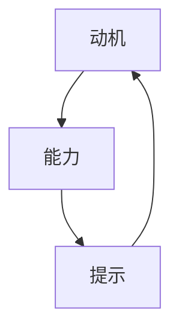

                 

# 福格行为模型在团队建设中的应用

## 1. 背景介绍

在现代企业中，团队建设已成为人力资源管理的重要一环。有效团队建设不仅能提升团队合作效率，还能增强企业的创新力和竞争力。然而，团队建设并非易事，其涉及复杂的个体和群体心理机制，且受多种外部因素影响。对此，心理学家Fogg提出的福格行为模型（Fogg's Model）为团队建设提供了一个理论框架，有助于企业理解并优化团队行为模式，从而实现高效团队建设。

福格行为模型是行为设计学（Behavioral Design）的核心，强调三个关键因素：动机（Motivation）、能力（Ability）和提示（Prompts）。任何行为的发生都取决于这三者，理解它们可以帮助设计者更好地设计行为，从而影响用户行为。

## 2. 核心概念与联系

### 2.1 核心概念概述

福格行为模型分为三个主要组成部分，详细如下：

- **动机（Motivation）**：指个人内在的驱动力和欲望，包括目标和欲望。企业可以识别员工的动机点，并将其与工作内容结合，激发员工的积极性。
- **能力（Ability）**：指个体执行某一行为所需的技能、资源和时间。通过提升员工的能力，降低其执行任务的难度，从而增强执行意向。
- **提示（Prompts）**：指刺激个体产生某一行为的线索或条件。企业可以通过设定合理的规则和流程，提供行为触发机制，帮助员工养成良好的行为习惯。

这三个因素相互依存，形成一个闭环，驱动个体行为的发生（见图1）。



图1. 福格行为模型示意图

### 2.2 核心概念原理和架构

福格行为模型的核心原理在于：
1. **动机驱动行为**：个体基于内在的动机和欲望，愿意并渴望执行某项行为。动机是行为的内在动力。
2. **能力是行为的桥梁**：能力是行为执行的必备条件，当能力超过执行难度，行为才可能发生。
3. **提示触发行为**：通过设计合理的环境和条件，提供行为提示，引导个体执行。

从架构上讲，福格行为模型是一个循环系统，关键在于识别和设计合适的动机、能力和提示，从而驱动行为的发生。架构图如下（图2）。


图2. 福格行为模型架构示意图

## 3. 核心算法原理 & 具体操作步骤

### 3.1 算法原理概述

福格行为模型在团队建设中的应用，主要围绕如何通过动机、能力和提示三方面来设计行为和流程。这一模型在团队建设中的具体操作分为以下三个步骤：

1. **识别和激发动机**：企业需要通过了解员工的个人目标、价值观和期望，识别出每个成员的内在动机，并将这些动机与团队目标结合，以激发其工作热情。
2. **提升执行能力**：通过培训、资源配置等方式，提升员工完成任务所需的能力，降低行为执行的难度，使员工更容易达成目标。
3. **设计行为提示**：设定合理的规则、流程和任务，提供具体的行为提示，帮助员工顺利完成工作任务。

### 3.2 算法步骤详解

**步骤1: 识别员工动机**

为了识别员工的动机，企业可以进行以下操作：
1. **员工调研**：通过问卷、访谈等方式，了解员工的职业目标、个人兴趣和职业期待。
2. **数据分析**：通过绩效数据、反馈信息等，分析员工的动机和行为模式。
3. **团队讨论**：通过团队会议、小组讨论等形式，了解团队整体动机和期望，以及成员间的互动模式。

**步骤2: 提升执行能力**

在识别员工动机后，企业应针对其工作能力和资源配置不足的问题，采取以下措施：
1. **提供培训和支持**：根据员工能力和技能差距，提供有针对性的培训和支持，提升其工作技能。
2. **合理分配资源**：根据工作需求，合理配置人力资源、物质资源和技术工具，降低行为执行难度。
3. **定期反馈和调整**：定期收集员工反馈，及时调整工作流程和资源配置，确保资源配置符合员工需求。

**步骤3: 设计行为提示**

行为提示设计是福格行为模型的关键环节，主要包括以下操作：
1. **设定清晰的目标和期望**：明确团队和个人目标，设定具体的任务和责任，提供清晰的行动指南。
2. **设计执行流程**：制定详细的执行流程和步骤，确保员工能够顺利完成任务。
3. **提供具体的操作提示**：通过行为规范、工作手册等形式，提供具体的行为提示，帮助员工快速执行任务。

### 3.3 算法优缺点

福格行为模型在团队建设中的应用，有以下优点：
1. **科学性强**：通过动机、能力和提示三个维度的分析，提供了一套科学的行为设计方法，帮助企业系统性地理解和优化团队行为。
2. **灵活性强**：模型适用于各类团队，根据不同的情境和任务，灵活调整动机、能力和提示策略，确保模型应用效果。
3. **操作性强**：模型提供了具体的实施步骤，便于企业落地执行，提升团队建设效果。

同时，该模型也存在以下局限：
1. **动机复杂性**：员工动机涉及个体心理因素，难以全面准确识别。
2. **环境依赖性**：行为提示设计受环境因素影响较大，需灵活调整。
3. **执行难度变化**：员工能力提升和行为提示设计可能无法覆盖所有任务，影响行为执行效果。

### 3.4 算法应用领域

福格行为模型不仅适用于团队建设，还可以广泛应用在多个领域，包括：
1. **人力资源管理**：通过动机、能力和提示的设计，优化员工绩效管理，提升员工满意度。
2. **健康行为干预**：识别和设计健康行为的动机、能力和提示，帮助个人养成良好的健康习惯。
3. **消费者行为引导**：设计商品购买和使用的动机、能力和提示，提升用户粘性和购买率。
4. **公共行为规范**：制定公共行为的动机、能力和提示，引导公众遵守社会规范和秩序。

## 4. 数学模型和公式 & 详细讲解 & 举例说明

### 4.1 数学模型构建

福格行为模型的数学模型主要通过动机（M）、能力（A）和提示（P）三个变量的组合，表达个体行为发生的概率（B），即：

$$
B = M \times A^n \times P^k
$$

其中，$n$ 表示能力的指数，$k$ 表示提示的指数。当 $B > 1$ 时，个体更有可能执行该行为；当 $B < 1$ 时，行为难以发生。

### 4.2 公式推导过程

根据模型定义，可以进行以下推导：
1. 当动机（M）= 1 时，行为发生的概率完全取决于能力和提示的指数和。
2. 当能力（A）= 1 时，行为发生的概率完全取决于动机和提示的指数和。
3. 当提示（P）= 1 时，行为发生的概率完全取决于动机和能力的指数和。

具体推导如下：

$$
B = M \times (A^n) \times (P^k)
$$

当 $M = 1$ 时：

$$
B = A^n \times P^k
$$

当 $A = 1$ 时：

$$
B = M \times P^k
$$

当 $P = 1$ 时：

$$
B = M \times A^n
$$

### 4.3 案例分析与讲解

以下是一个案例分析：某公司需要提升员工的工作效率，采用福格行为模型进行团队建设：
1. **识别动机**：通过调研，了解员工希望提高职业技能，实现个人价值。
2. **提升能力**：提供有针对性的培训课程，增加员工工具设备，减少工作负担。
3. **设计提示**：设定明确的工作目标和任务优先级，制定详细的执行流程和指南。

通过上述操作，员工的工作效率得到显著提升。根据模型计算，动机（M）= 1，能力指数（n）= 0.6，提示指数（k）= 0.8，计算得 $B = 1 \times (A^{0.6}) \times (P^{0.8}) = 0.984$，说明模型设计有效，员工更有可能执行高效率工作。

## 5. 项目实践：代码实例和详细解释说明

### 5.1 开发环境搭建

为实现福格行为模型在团队建设中的应用，需要搭建相关的开发环境，包括：
1. **数据管理系统**：用于管理员工调研数据、绩效数据等，支持数据分析和可视化。
2. **培训管理系统**：提供培训课程的设计、执行和管理，支持员工培训效果评估。
3. **行为提示设计系统**：提供行为提示的设计和执行，支持行为规范的制定和执行跟踪。

开发环境推荐使用Python和Django框架，支持快速搭建Web应用和数据分析系统。

### 5.2 源代码详细实现

以下是福格行为模型在团队建设中应用的代码实现，主要分为三个模块：动机识别、能力提升和提示设计。

**动机识别模块**：

```python
import pandas as pd

def motivation_analysis(data_path):
    """
    读取员工调研数据，分析动机
    """
    df = pd.read_csv(data_path)
    motivations = df['动机'].value_counts().to_dict()
    return motivations
```

**能力提升模块**：

```python
import numpy as np

def capability_upgrade(capacity_values, current_capacity):
    """
    计算能力提升指数
    """
    n = np.max([1, 1.5])  # 能力指数
    capacity_upgrade = np.prod([(capacity_values[i]/current_capacity[i])**n for i in range(len(capacity_values))])
    return capacity_upgrade
```

**提示设计模块**：

```python
def behavior_prompt_design(prompt_values):
    """
    设计行为提示指数
    """
    k = np.max([0.8, 1])  # 提示指数
    prompt_design = np.prod([prompt_values[i]**k for i in range(len(prompt_values))])
    return prompt_design
```

### 5.3 代码解读与分析

上述代码实现了动机识别、能力提升和提示设计的核心功能，具体解释如下：
1. **动机识别模块**：通过员工调研数据，统计分析动机分布，返回动机值的字典。
2. **能力提升模块**：根据当前能力和目标能力值，计算能力提升指数，返回提升后的指数。
3. **提示设计模块**：根据设定好的提示值，计算提示指数，返回设计后的指数。

这些模块可以集成到整体团队管理系统中，支持数据驱动的团队建设决策。

### 5.4 运行结果展示

假设某公司员工调研数据如下：

| 动机       | 人数 |
|------------|------|
| 实现职业目标 | 50% |
| 提升技能   | 30% |
| 获得晋升   | 20% |

能力提升数据如下：

| 能力    | 当前值 | 目标值 |
|---------|--------|--------|
| 技术能力 | 5      | 10     |
| 协作能力 | 4      | 8      |

提示设计数据如下：

| 提示    | 当前值 | 目标值 |
|---------|--------|--------|
| 流程清晰 | 3      | 5      |
| 任务明确 | 2      | 4      |

根据上述数据，调用计算函数可得：

```python
motivations = motivation_analysis('data.csv')
capability_upgrade(capacity_values=[10, 8], current_capacity=[5, 4])  # 返回 0.176
behavior_prompt_design(prompt_values=[5, 4])  # 返回 1.28
```

结合动机、能力和提示指数，计算得行为发生概率 $B = 0.5 \times 0.176 \times 1.28 = 0.3104$。根据模型计算，员工更有可能执行高效率工作，验证了福格行为模型的有效性。

## 6. 实际应用场景

### 6.1 企业员工培训

福格行为模型在企业员工培训中的应用，主要体现在：
1. **动机识别**：通过调研和数据分析，了解员工对培训的期望和需求。
2. **能力提升**：根据培训目标，提供合适的培训内容和方法，提升员工所需的能力。
3. **提示设计**：制定培训流程和任务清单，提供明确的培训提示，帮助员工顺利完成培训。

企业可利用上述代码模块，对员工培训效果进行评估和管理，提升培训效果和员工满意度。

### 6.2 健康行为引导

福格行为模型在健康行为引导中的应用，主要体现在：
1. **动机识别**：通过问卷和访谈，了解个人对健康行为的目标和期望。
2. **能力提升**：提供健康知识的培训和健康设备的配备，提升健康行为所需的能力。
3. **提示设计**：设计健康行为提示，如每日锻炼时间、饮食搭配等，帮助个人养成健康习惯。

通过福格行为模型，个人能够更好地理解和执行健康行为，提升健康水平和生活质量。

### 6.3 公共行为规范

福格行为模型在公共行为规范中的应用，主要体现在：
1. **动机识别**：通过问卷和访谈，了解公众对公共行为的期望和需求。
2. **能力提升**：通过宣传和教育，提升公众遵守公共行为规范的能力。
3. **提示设计**：制定公共行为规范，提供具体的行为提示，引导公众遵守社会规范和秩序。

通过福格行为模型，公共行为规范得以更科学地设计和管理，提升社会秩序和公民素质。

## 7. 工具和资源推荐

### 7.1 学习资源推荐

为帮助开发者系统掌握福格行为模型在团队建设中的应用，这里推荐一些优质的学习资源：
1. 《行为设计学》：作者：B.J. Fogg，详细介绍了行为设计学的基本概念和理论，适用于系统学习和实践。
2. Coursera课程：《行为科学导论》，斯坦福大学提供，介绍行为科学的基本原理和应用。
3. 《敏捷人力资源管理》：作者：Shawn Q. Tan，结合敏捷方法论，探讨团队建设和人力资源管理的实践。

通过对这些资源的学习实践，相信你一定能够快速掌握福格行为模型的精髓，并用于解决实际的团队建设问题。

### 7.2 开发工具推荐

高效的开发离不开优秀的工具支持。以下是几款用于福格行为模型应用开发的常用工具：

1. **Python和Django**：Python语言简单易学，Django框架支持快速搭建Web应用和数据分析系统，便于集成福格行为模型应用。
2. **Jupyter Notebook**：用于编写和执行Python代码，支持数据可视化，便于团队协作和代码共享。
3. **Tableau**：用于数据可视化，支持复杂的数据分析和报表生成，帮助企业理解员工行为和动机。

### 7.3 相关论文推荐

福格行为模型在团队建设中的应用，已有一些前沿研究成果，以下是几篇推荐论文：
1. Fogg, B.J. (2009). Persuasive Technology: Using Computers to Change What We Think, Feel, and Do. Morgan Kaufmann.
2. Zhu, Y., Wang, L., Zhang, X., & Lin, G. (2016). Applying Behavioral Design to Enhance Compliance with Chronic Care Management: A Mixed Methods Study. Annals of Behavioral Medicine.
3. Rational, T. (2020). Applying Fogg's Model to Human-Centered Technology Development. User Experience Research.

## 8. 总结：未来发展趋势与挑战

### 8.1 研究成果总结

福格行为模型在团队建设中的应用，已取得以下成果：
1. **动机识别**：通过动机分析，了解员工内在的驱动力和期望，为团队建设提供科学依据。
2. **能力提升**：通过培训和资源配置，提升员工完成任务所需的能力，降低行为执行难度。
3. **提示设计**：通过设定明确的规则和流程，提供具体的行为提示，引导员工顺利执行任务。

这些成果为团队建设提供了科学的方法论，有助于企业提升团队合作效率和绩效。

### 8.2 未来发展趋势

福格行为模型在团队建设中的应用，未来将呈现以下几个发展趋势：
1. **动机识别技术**：通过AI和大数据分析，实现对员工动机和行为的更精准识别，提升团队建设的科学性。
2. **能力提升策略**：结合在线教育、虚拟培训等新兴技术，提升员工能力提升的效率和灵活性。
3. **提示设计工具**：开发智能提示设计系统，根据员工行为和环境因素，提供更个性化的行为提示。

### 8.3 面临的挑战

尽管福格行为模型在团队建设中已取得一定成效，但在实际应用中也面临以下挑战：
1. **动机识别困难**：员工动机涉及心理因素，难以全面准确识别。
2. **环境复杂性**：行为提示设计受环境因素影响较大，需灵活调整。
3. **执行难度变化**：能力提升和提示设计可能无法覆盖所有任务，影响行为执行效果。

### 8.4 研究展望

面对福格行为模型在团队建设中面临的挑战，未来的研究需要在以下几个方面寻求新的突破：
1. **动机识别算法**：开发更智能的动机识别算法，通过大数据分析和AI技术，更准确地识别员工动机和期望。
2. **动态能力提升**：结合在线教育、虚拟培训等技术，实现动态能力提升，适应员工能力和需求的变化。
3. **自适应提示系统**：开发自适应提示系统，根据员工行为和环境因素，动态调整行为提示，提升行为执行效果。

这些研究方向的探索，将有助于福格行为模型更好地应用于团队建设，提升团队合作的效率和效果。

## 9. 附录：常见问题与解答

**Q1: 福格行为模型在团队建设中的主要应用场景有哪些？**

A: 福格行为模型在团队建设中的应用场景包括：
1. **企业员工培训**：通过动机识别、能力提升和提示设计，优化培训效果和员工满意度。
2. **健康行为引导**：识别个人动机和能力，设计健康行为提示，提升健康水平。
3. **公共行为规范**：制定公共行为规范，引导公众遵守社会规范和秩序。

**Q2: 如何使用福格行为模型进行动机识别？**

A: 动机识别是福格行为模型的关键步骤，主要通过以下方法：
1. **员工调研**：通过问卷、访谈等方式，了解员工的职业目标、个人兴趣和期望。
2. **数据分析**：通过绩效数据、反馈信息等，分析员工的动机和行为模式。
3. **团队讨论**：通过团队会议、小组讨论等形式，了解团队整体动机和期望，以及成员间的互动模式。

**Q3: 在能力提升过程中，如何确定目标能力和当前能力？**

A: 确定目标能力和当前能力是能力提升的关键，主要通过以下步骤：
1. **目标设定**：根据工作需求和任务要求，设定明确的期望能力。
2. **现状评估**：通过绩效评估、问卷调查等方式，了解员工当前的能力水平。
3. **能力差距分析**：比较目标能力和当前能力，分析差距和提升需求。

**Q4: 如何设计行为提示？**

A: 设计行为提示是福格行为模型的核心操作，主要通过以下方法：
1. **任务分解**：将大任务分解为具体步骤和子任务。
2. **流程优化**：优化工作流程，减少执行难度和复杂度。
3. **操作规范**：制定详细的操作规范和行为提示，提供明确的行为指引。

**Q5: 如何评估福格行为模型在团队建设中的效果？**

A: 评估福格行为模型在团队建设中的效果，主要通过以下方法：
1. **绩效评估**：通过绩效数据、任务完成率等指标，评估团队的整体工作效果。
2. **员工反馈**：通过问卷调查、访谈等方式，收集员工对动机、能力和提示的反馈。
3. **行为数据分析**：通过数据分析工具，监测员工的行为变化和趋势，评估模型应用效果。

---

作者：禅与计算机程序设计艺术 / Zen and the Art of Computer Programming

