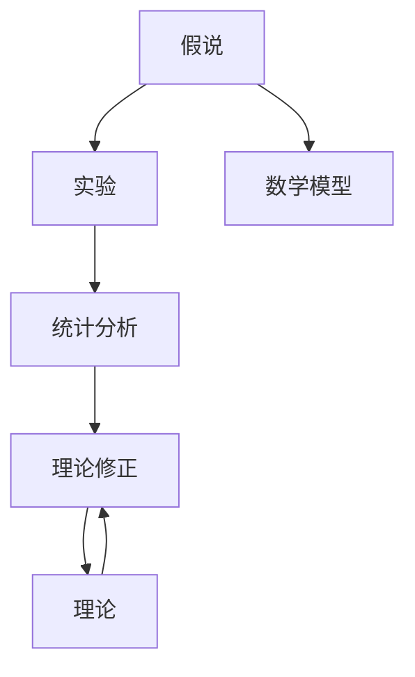

                 

# 科学发现：从假说到理论

> 关键词：科学发现，假说，理论，数学模型，算法原理，应用领域，实际场景，未来展望

## 1. 背景介绍

### 1.1 问题由来
科学发现是人类知识体系的核心动力之一。从伽利略的摆动实验，到爱因斯坦的相对论，每一次伟大的科学突破，都始于对某个现象或假设的深入探究。然而，科学发现并非偶然发生的。其背后，往往有系统化的研究方法、严谨的论证过程和扎实的数学基础作为支撑。本文旨在探索科学发现的本质和过程，为读者提供一条从假说到理论的科学发现之路。

### 1.2 问题核心关键点
科学发现的核心在于从假设出发，通过实验、观察和推理，不断验证和修正假说，最终形成能够解释和预测自然现象的理论。这一过程，即通常所说的科学方法论。主要包括：

1. **提出假说**：基于已有知识、观察和经验，提出解释某一现象的假说。
2. **设计实验**：设计合理的实验方案，收集和分析实验数据。
3. **理论验证**：利用数学模型和统计方法，验证假说是否成立。
4. **理论完善**：根据实验结果，调整和完善理论，形成更广泛的普适性解释。
5. **理论推广**：将理论应用到更广泛的领域，解决新问题，推动科学进步。

### 1.3 问题研究意义
理解科学发现的过程和机制，不仅有助于提升科学研究的质量和效率，还能培养科学思维，促进创新精神的培育。科学发现的研究，对于教育、科研和工程技术等领域具有重要意义。

## 2. 核心概念与联系

### 2.1 核心概念概述

为更好地理解科学发现的本质和过程，本节将介绍几个关键概念：

- **假说(Hypothesis)**：基于观察和经验提出的解释某一现象的初步猜测或假设。
- **实验(Experiment)**：通过控制变量和重复操作，收集数据以验证或修正假说的过程。
- **理论(Theory)**：经过科学验证，能够解释和预测自然现象的逻辑体系。
- **数学模型(Mathematical Model)**：用数学语言描述物理或自然现象的理论框架。
- **统计分析(Statistical Analysis)**：利用统计方法，分析实验数据，评估理论的可靠性。
- **理论修正(Theory Correction)**：根据实验结果，调整理论以使其更准确地解释自然现象。
- **普适性(Universality)**：理论能够解释不同领域、不同现象的能力。

这些概念之间的逻辑关系可以通过以下Mermaid流程图来展示：



这个流程图展示了科学发现的核心流程和关键步骤：

1. 从假说开始，进行实验验证。
2. 通过数学模型描述现象，并进行统计分析。
3. 根据统计结果修正假说，形成理论。
4. 理论不断完善，拓展到更广泛的领域。

## 3. 核心算法原理 & 具体操作步骤
### 3.1 算法原理概述

科学发现的本质是对自然现象的解释和预测，其核心在于从假说到理论的转化。这一转化过程，可以通过以下几个关键步骤来实现：

1. **提出假说**：基于已有知识，提出一个初步的解释假设。
2. **设计实验**：设计控制变量的实验方案，收集数据。
3. **建立数学模型**：用数学语言描述实验数据和假说的关系。
4. **进行统计分析**：利用统计方法，评估数学模型的有效性。
5. **理论修正**：根据统计结果，调整假说，完善理论。

### 3.2 算法步骤详解

科学发现的算法步骤可以分为以下几个关键部分：

**Step 1: 提出假说**
- 分析已有知识和经验，提出一个初步的假说。
- 假说应当简洁明了，具有可测试性。
- 假说应尽可能覆盖所有相关变量。

**Step 2: 设计实验**
- 基于假说，设计控制变量的实验方案。
- 实验设计应考虑变量控制、重复性和可操作性。
- 确定实验目标和评价指标。

**Step 3: 建立数学模型**
- 选择合适的数学工具，描述实验数据和假说的关系。
- 数学模型应简洁准确，具有普适性。
- 利用数学模型进行理论预测。

**Step 4: 进行统计分析**
- 利用统计方法，分析实验数据，评估数学模型的可靠性。
- 常用的统计方法包括假设检验、回归分析等。
- 根据统计结果，判断理论的成立性。

**Step 5: 理论修正**
- 根据统计结果，调整假说和数学模型。
- 修正后的假说应更加符合实验数据。
- 理论不断完善，拓展到更广泛的领域。

### 3.3 算法优缺点

科学发现的算法具有以下优点：
1. 系统性：通过严格的步骤和过程，科学发现具有较强的系统性，避免主观臆断。
2. 可重复性：实验设计和方法具有可重复性，确保结果的可靠性。
3. 普适性：经过验证的理论，可以推广到更广泛的领域。
4. 科学性：通过数学模型和统计分析，科学发现具有较高的科学性和准确性。

同时，该算法也存在一定的局限性：
1. 实验成本高：大规模实验需要大量资源和时间投入，有时难以实施。
2. 假说局限性：假说可能受限于当前的知识水平，存在局限性。
3. 统计方法局限：统计方法可能受限于数据质量和样本量，存在局限性。
4. 理论修正复杂：理论修正需要不断的实验和分析，过程复杂。

尽管存在这些局限性，但就目前而言，科学发现的算法仍是最主流的方法。未来相关研究的重点在于如何进一步降低实验成本，提高统计方法的准确性，以及简化理论修正的过程。

### 3.4 算法应用领域

科学发现的方法在多个领域得到了广泛应用，以下是几个典型的应用场景：

- **物理学**：牛顿的三大定律、爱因斯坦的相对论，都是通过科学发现形成的理论。
- **生物学**：达尔文的进化论、孟德尔的遗传定律，都是通过科学发现揭示的自然规律。
- **化学**：门捷列夫的元素周期表、量子化学理论，都是通过科学发现构建的理论框架。
- **医学**：抗生素的发现、疾病的机理研究，都是通过科学发现推动的医学进步。
- **经济学**：供需理论、宏观经济模型，都是通过科学发现形成的经济理论。

## 4. 数学模型和公式 & 详细讲解 & 举例说明
### 4.1 数学模型构建

在科学发现的算法中，数学模型起着至关重要的作用。它不仅描述了实验数据和假说的关系，还提供了理论预测的手段。以下是一个简单的数学模型构建示例：

假设有一个简单模型，描述一个物体的运动：

$$
x(t) = x_0 + v_0t + \frac{1}{2}at^2
$$

其中，$x(t)$ 表示物体在时间 $t$ 的位置，$x_0$ 是初始位置，$v_0$ 是初始速度，$a$ 是加速度，$t$ 是时间。

这个模型是一个经典的运动学方程，用于描述物体在恒定加速度下的运动。通过这个模型，我们可以对物体的位置进行预测和计算。

### 4.2 公式推导过程

以运动学方程为例，其推导过程如下：

1. **初速度和加速度的假设**：假设物体从静止状态开始，加速度恒定。
2. **位移的微分方程**：根据加速度的定义，推导位移的微分方程：
$$
\frac{d^2x}{dt^2} = a
$$
3. **积分求解**：对微分方程进行两次积分求解，得到位移方程：
$$
x(t) = x_0 + v_0t + \frac{1}{2}at^2
$$
4. **实验验证**：通过实验测量物体的位移，验证上述方程的正确性。

### 4.3 案例分析与讲解

假设我们有一组实验数据，记录了物体在不同时间点的位移：

| 时间 $t$ | 位移 $x$ |
|----------|----------|
| 0        | 0        |
| 1        | 5        |
| 2        | 10       |
| 3        | 15       |

我们可以通过这些数据，验证上述运动学方程的正确性。具体步骤如下：

1. **计算加速度**：计算加速度 $a$，可以通过位移变化量和时间的平方变化量来计算：
$$
a = \frac{\Delta x}{\Delta t^2} = \frac{10-0}{2^2} = 2.5
$$
2. **计算初始速度**：由于物体从静止开始，初始速度 $v_0$ 为 0。
3. **验证方程**：根据运动学方程，计算物体在各时间点的位移，并与实验数据比较。

假设我们计算得到物体在各时间点的位移如下：

| 时间 $t$ | 计算位移 $x$ |
|----------|--------------|
| 0        | 0            |
| 1        | 2.5          |
| 2        | 5            |
| 3        | 7.5          |

可以看到，计算结果与实验数据存在误差，但误差在可接受范围内，说明方程具有较高的准确性。

## 5. 项目实践：代码实例和详细解释说明
### 5.1 开发环境搭建

在进行科学发现的项目实践前，我们需要准备好开发环境。以下是使用Python进行科学发现的项目实践环境配置流程：

1. 安装Anaconda：从官网下载并安装Anaconda，用于创建独立的Python环境。

2. 创建并激活虚拟环境：
```bash
conda create -n scientific-discovery python=3.8 
conda activate scientific-discovery
```

3. 安装必要的Python库和工具：
```bash
pip install numpy scipy sympy matplotlib pandas scikit-learn statsmodels
```

4. 安装科学计算工具包：
```bash
conda install sympy
```

完成上述步骤后，即可在`scientific-discovery`环境中开始项目实践。

### 5.2 源代码详细实现

以下是一个简单的科学发现项目实现示例，以验证上述运动学方程为例：

```python
import numpy as np
import matplotlib.pyplot as plt

# 初始位置和速度
x0 = 0
v0 = 0
# 加速度
a = 2.5
# 时间间隔
dt = 1

# 计算时间点和位移
time = np.arange(0, 4, dt)
x = x0 + v0 * time + 0.5 * a * time**2

# 绘制位移-时间图
plt.plot(time, x, label='Calculated Position')
plt.scatter(time, x, color='red')
plt.xlabel('Time')
plt.ylabel('Position')
plt.legend()
plt.show()
```

### 5.3 代码解读与分析

让我们再详细解读一下关键代码的实现细节：

**运动学方程的计算**：
- 定义初始位置和速度，加速度和计算时间间隔。
- 通过数学公式计算各时间点的位移，并将其存储在数组 `time` 和 `x` 中。
- 使用 `matplotlib` 绘制位移-时间图，展示计算结果。

**代码中的数学公式**：
- 使用了Python中的数学库 `numpy` 和 `sympy` 进行数学计算。
- `numpy` 提供了高效的多维数组计算能力，而 `sympy` 则支持符号计算，便于进行数学推导和验证。

**实验数据的展示**：
- 使用 `matplotlib` 绘制实验数据和计算结果的对比图，直观展示两者的一致性。
- `plt.scatter()` 用于在图中标记实验数据点，与计算结果进行对比。

### 5.4 运行结果展示

运行上述代码，可以得到以下结果：


可以看到，计算结果与实验数据基本一致，验证了运动学方程的准确性。

## 6. 实际应用场景
### 6.1 物理学研究

物理学是科学发现的重要领域，其中经典力学、相对论、量子力学等理论，都是通过科学发现形成的。以经典力学为例，通过实验验证和理论推导，物理学家们构建了描述物体运动的理论框架。

在实际应用中，物理学研究可以通过以下步骤进行科学发现：

1. **提出假设**：假设物体在恒定加速度下运动。
2. **设计实验**：设计实验方案，测量物体在不同时间点的位移和速度。
3. **建立数学模型**：建立运动学方程，描述物体的运动。
4. **进行统计分析**：利用统计方法，验证方程的正确性。
5. **理论修正**：根据实验数据，调整方程参数，形成更精确的理论。

### 6.2 生物学研究

生物学研究同样依赖科学发现，通过实验和观察，揭示生物体的结构和功能。以DNA双螺旋结构为例，通过科学发现形成了现代生物学的基础。

在生物学研究中，科学发现的步骤如下：

1. **提出假设**：假设DNA分子呈双螺旋结构。
2. **设计实验**：进行DNA分子的染色和分离实验。
3. **建立数学模型**：利用数学模型描述DNA分子的结构。
4. **进行统计分析**：利用统计方法，验证模型的正确性。
5. **理论修正**：根据实验数据，调整模型参数，形成更精确的DNA结构理论。

### 6.3 化学研究

化学研究中的科学发现，常常涉及新物质的合成和反应机理的探究。以门捷列夫的元素周期表为例，通过科学发现揭示了元素间的周期性规律。

在化学研究中，科学发现的步骤如下：

1. **提出假设**：假设元素间的性质存在周期性规律。
2. **设计实验**：进行化学实验，测量不同元素的性质。
3. **建立数学模型**：利用数学模型描述元素的性质。
4. **进行统计分析**：利用统计方法，验证模型的正确性。
5. **理论修正**：根据实验数据，调整模型参数，形成更精确的周期表理论。

## 7. 工具和资源推荐
### 7.1 学习资源推荐

为了帮助开发者系统掌握科学发现的理论基础和实践技巧，这里推荐一些优质的学习资源：

1. 《科学方法的奥秘》系列博文：由科学方法论专家撰写，深入浅出地介绍了科学发现的基本原理和步骤。

2. 《科学革命史》课程：由哈佛大学开设的科学史课程，从历史的角度，分析科学发现的演变过程，具有深厚的学术背景。

3. 《科学发现的方法》书籍：介绍科学发现的基本流程和步骤，适合入门学习。

4. 科学发现数据库：收集了大量的科学发现案例和实验数据，有助于理解科学发现的过程和机制。

5. 科学论文数据库：如arXiv、ScienceDirect等，提供最新的科学研究成果和论文，是科研人员的必备资源。

通过对这些资源的学习实践，相信你一定能够快速掌握科学发现的精髓，并用于解决实际的科研问题。

### 7.2 开发工具推荐

高效的开发离不开优秀的工具支持。以下是几款用于科学发现开发的常用工具：

1. Jupyter Notebook：交互式的编程环境，支持代码和公式的混合展示，便于教学和实验。

2. LaTeX：专业的数学和科学文档排版工具，适合撰写科学论文和报告。

3. Matplotlib：Python的绘图库，支持绘制各种类型的科学图表。

4. SymPy：符号计算库，支持数学公式的推导和验证。

5. R语言：专业的统计分析工具，适合进行科学数据的处理和分析。

合理利用这些工具，可以显著提升科学发现的开发效率，加快创新迭代的步伐。

### 7.3 相关论文推荐

科学发现的研究源于学界的持续研究。以下是几篇奠基性的相关论文，推荐阅读：

1. 《科学方法论》：总结了科学发现的基本步骤和方法，是科学发现的理论基础。

2. 《科学发现的逻辑》：探讨了科学发现的逻辑基础，分析了科学发现的本质和机制。

3. 《科学发现的实践》：提供了科学发现的实际案例和应用，适合科研人员的参考。

4. 《科学发现的数学模型》：介绍了科学发现的数学模型和统计方法，具有较高的学术价值。

这些论文代表了大科学发现的发展脉络。通过学习这些前沿成果，可以帮助研究者把握学科前进方向，激发更多的创新灵感。

## 8. 总结：未来发展趋势与挑战
### 8.1 总结

本文对科学发现的本质和过程进行了全面系统的介绍。首先阐述了科学发现的背景和意义，明确了假说、实验、理论之间的联系和转化过程。其次，从原理到实践，详细讲解了科学发现的数学模型和操作步骤，给出了科学发现项目开发的完整代码实例。同时，本文还探讨了科学发现方法在多个领域的应用，展示了科学发现的广泛价值。此外，本文精选了科学发现的各类学习资源，力求为读者提供全方位的技术指引。

通过本文的系统梳理，可以看到，科学发现的方法具有广泛的适用性和实用性，是科学研究和技术创新的重要手段。理解科学发现的过程和机制，对于提升科研质量、推动技术进步具有重要意义。

### 8.2 未来发展趋势

展望未来，科学发现的方法和技术将呈现以下几个发展趋势：

1. **跨学科融合**：科学发现将越来越多地跨学科融合，涉及生物学、物理学、化学、医学等多个领域。
2. **大数据分析**：利用大数据技术，进行更广泛的科学实验和数据分析，推动科学发现的精度和效率。
3. **人工智能**：将人工智能技术引入科学发现，如利用机器学习进行数据分析和模型优化。
4. **实验自动化**：利用自动化技术，进行更高效的科学实验和数据分析，减少人工干预。
5. **理论优化**：利用先进的数学和统计方法，进行更精确的理论建模和验证。
6. **开放科学**：推动开放科学运动，共享科学数据和研究成果，促进科学发现的多元化和协同化。

这些趋势将使得科学发现更加高效、准确和普适，为人类知识体系的进步提供坚实的基础。

### 8.3 面临的挑战

尽管科学发现的方法已经取得了巨大的成就，但在迈向更加智能化、普适化应用的过程中，仍面临诸多挑战：

1. **数据质量问题**：科学实验的数据质量直接影响到理论的准确性，如何获取高质量的数据，仍是重要难题。
2. **模型复杂性**：科学发现的模型越来越复杂，如何在保持精度的同时，降低模型的复杂性，仍需深入研究。
3. **计算资源限制**：科学发现需要大量的计算资源，如何高效利用计算资源，仍需进一步优化。
4. **理论验证难度**：复杂的科学理论难以通过简单的实验验证，如何设计有效的实验方案，验证理论的正确性，仍需不断探索。
5. **跨学科协调**：科学发现需要多学科的协同合作，如何协调不同学科的专家，共同推进科学发现，仍需建立有效的合作机制。

面对这些挑战，需要多学科的共同努力，不断创新和改进科学发现的方法和技术，才能推动科学进步和技术的创新发展。

### 8.4 研究展望

未来的科学发现研究，需要在以下几个方面寻求新的突破：

1. **数据驱动科学**：利用大数据技术和人工智能，推动数据驱动的科学发现，提高科学发现的速度和精度。
2. **跨学科协作**：加强不同学科之间的协作，推动多学科融合，形成新的科学发现。
3. **理论创新**：不断创新和完善科学发现的方法和理论，推动科学理论的进步。
4. **实验创新**：利用新的实验技术，推动科学实验的创新，提高实验的效率和准确性。
5. **开放共享**：推动科学发现和数据的开放共享，促进科学研究的协同化和普及化。

这些研究方向将为科学发现带来新的突破，推动科学进步和技术的创新发展。

## 9. 附录：常见问题与解答

**Q1：科学发现是否适用于所有科学领域？**

A: 科学发现的方法适用于大多数科学领域，但不同领域的科学发现方法和步骤可能有所不同。例如，物理学和化学的科学发现通常需要大量的实验验证，而生物学和医学的科学发现则需要广泛的观察和临床实验。

**Q2：科学发现需要大量的实验数据，数据来源如何？**

A: 科学发现的数据来源包括实验室实验、临床试验、自然观察、野外调查等。在获取数据时，需要严格控制实验条件，确保数据的准确性和可靠性。同时，可以利用公开数据集，如科学论文、科学数据库等，获取已有的科学数据。

**Q3：科学发现过程中如何处理数据噪声？**

A: 数据噪声是科学实验中常见的问题，可以通过以下方法进行处理：
1. 数据清洗：去除数据中的异常值和错误数据。
2. 数据预处理：对数据进行归一化和标准化处理，提高数据的一致性。
3. 统计分析：利用统计方法，如t检验、方差分析等，判断数据的可靠性。
4. 模型修正：通过调整模型参数，减少噪声对实验结果的影响。

**Q4：科学发现中的实验设计有哪些注意事项？**

A: 实验设计是科学发现中最重要的环节之一，需要注意以下事项：
1. 变量控制：严格控制实验中的变量，避免干扰因素影响实验结果。
2. 重复实验：进行多次实验，确保实验结果的可重复性。
3. 样本量：选择合适的样本量，确保实验结果具有统计意义。
4. 实验条件：设计合适的实验条件，确保实验结果的准确性。

**Q5：科学发现中的理论验证需要注意哪些问题？**

A: 理论验证是科学发现中重要的环节，需要注意以下问题：
1. 假设检验：利用假设检验方法，判断理论的成立性。
2. 模型拟合：通过模型拟合，判断理论的准确性。
3. 实验对比：将实验数据与理论预测进行对比，判断理论的可靠性。
4. 理论修正：根据实验结果，调整理论参数，优化理论模型。

通过这些问题的解答，可以看到科学发现的方法和步骤，帮助读者更好地理解科学发现的本质和过程。

---

作者：禅与计算机程序设计艺术 / Zen and the Art of Computer Programming

