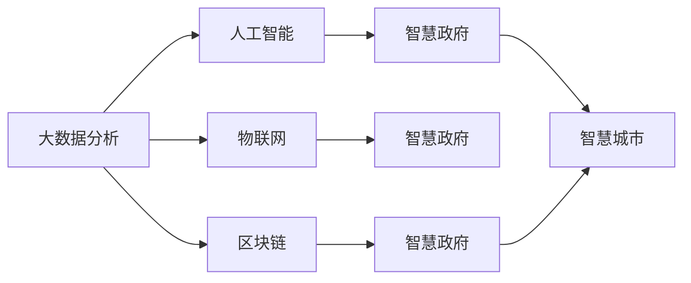

                 

# 科技创新：社会治理的新思路

科技创新，作为推动社会进步和经济发展的核心驱动力，在现代社会治理中扮演着至关重要的角色。随着大数据、人工智能、区块链等前沿技术的不断成熟，科技正在改变社会治理的方式，提升治理效率，构建智慧政府，促进社会和谐稳定。本文将从背景介绍、核心概念与联系、核心算法原理及具体操作步骤、数学模型和公式推导、项目实践、实际应用场景、工具和资源推荐以及未来发展趋势与挑战等多个方面，深入探讨科技创新在社会治理中的应用和前景。

## 1. 背景介绍

### 1.1 问题由来

当前，全球正处于数字化转型的关键时期，传统的社会治理模式面临诸多挑战。首先是人口老龄化带来的养老、医疗、社区服务等公共服务需求压力增大；其次是城市化进程中环境污染、交通拥堵、公共安全等问题的复杂性和挑战性增加；再次是信息时代下网络安全、数据隐私、信息透明等社会治理新课题的不断涌现。

这些问题催生了对科技创新在社会治理中应用的需求。通过利用大数据、云计算、人工智能等新兴技术，可以构建智能化的社会治理体系，提高治理效率，优化资源配置，提升公共服务质量，推动社会公平与和谐。

### 1.2 问题核心关键点

科技创新在社会治理中的应用主要体现在以下几个方面：

- 数据驱动决策：通过大数据分析和挖掘，发现和解决社会问题，优化政策制定和执行。
- 智能预测预警：利用机器学习、深度学习等技术，预测和预警公共安全事件，提升应急响应能力。
- 智慧社区建设：通过物联网、智能传感器等技术，实现社区的智慧管理和公共服务的精准投放。
- 智能化公共服务：通过智能客服、智能导诊、智能停车等服务，提升公共服务的便捷性和效率。
- 区块链技术应用：利用区块链的透明性、不可篡改性，实现政务信息的公开透明，增强政府的公信力。

## 2. 核心概念与联系

### 2.1 核心概念概述

为了更好地理解科技创新在社会治理中的应用，本节将介绍几个关键概念：

- **大数据分析**：利用大数据技术进行数据的采集、存储、分析和挖掘，发现数据中的规律和趋势，支持决策支持。
- **人工智能**：通过机器学习、深度学习等技术，构建智能算法，实现自动化决策和预测。
- **物联网(IoT)**：通过传感器、智能设备等将物理世界与数字世界连接起来，实现智能监控和管理。
- **区块链**：利用分布式账本技术，确保数据的安全、透明和不可篡改，提高政务服务的透明度和公信力。
- **智慧政府**：通过信息化手段，实现政府决策、执行、服务的一体化、智能化和协同化。
- **智慧城市**：构建数字基础设施和智能服务体系，提升城市的智能化水平和管理效率。

这些核心概念之间的逻辑关系可以通过以下Mermaid流程图来展示：



这个流程图展示了大数据、人工智能、物联网、区块链等关键技术在智慧政府和智慧城市中的应用关系：

1. 大数据分析提供了数据支撑，为人工智能的训练和优化提供基础。
2. 人工智能通过学习数据分析结果，实现智能决策和预测。
3. 物联网技术将物理世界数字化，为智慧城市和智慧政府提供实时数据。
4. 区块链技术保障了数据的安全性和透明度，增强了政府公信力。

这些技术共同构成了智慧社会治理的基础框架，使得社会治理更加高效、透明、智能。

## 3. 核心算法原理 & 具体操作步骤

### 3.1 算法原理概述

科技创新在社会治理中的应用，主要依托于数据驱动的算法模型和技术手段。以智慧政府为例，其核心算法包括：

- 预测模型：利用机器学习、深度学习等算法，对社会事件进行预测和预警。
- 优化模型：通过运筹学、仿真模拟等方法，优化资源配置和政策执行。
- 推荐系统：通过协同过滤、内容推荐等算法，实现智能导诊、智能客服等服务。
- 图像识别：通过卷积神经网络等技术，实现智能监控、智能安防等应用。

### 3.2 算法步骤详解

科技创新在社会治理中的应用步骤主要包括以下几个方面：

1. **数据采集**：利用传感器、摄像头、智能设备等采集各类数据，包括环境监测、交通流量、公共服务需求等。
2. **数据清洗与处理**：对采集到的数据进行清洗、预处理和特征工程，确保数据质量和可用性。
3. **模型训练与优化**：利用算法模型进行训练和优化，提升模型的准确性和泛化能力。
4. **部署与应用**：将训练好的模型部署到实际应用场景中，实现智能决策和预测。
5. **监测与评估**：对模型性能进行持续监测和评估，根据反馈进行模型更新和改进。

### 3.3 算法优缺点

科技创新在社会治理中的应用具有以下优点：

- **提升治理效率**：通过自动化和智能化手段，实现高效决策和快速响应。
- **优化资源配置**：利用算法模型，实现资源的最优配置，提升公共服务质量。
- **增强公信力**：利用区块链等技术，提升政务服务的透明度和公信力。

同时，也存在一些缺点：

- **数据隐私问题**：大数据和物联网技术在采集和处理数据时，可能涉及个人隐私和数据安全问题。
- **技术依赖问题**：科技创新在社会治理中的应用，高度依赖技术基础设施和算力资源。
- **模型泛化性不足**：算法模型在特定场景下可能表现优异，但在不同环境和数据下泛化性不足。

### 3.4 算法应用领域

科技创新在社会治理中的应用，覆盖了从城市管理到公共服务，从社会安全到环境保护等多个领域。例如：

- **智能交通管理**：通过大数据分析和人工智能，实现交通流量的智能调度，减少拥堵。
- **智能安防系统**：利用图像识别和深度学习，实现智能监控和安防，提升公共安全。
- **智慧医疗系统**：通过人工智能和大数据分析，实现智能诊断、智能导诊，提升医疗服务效率和质量。
- **环境保护监测**：利用物联网和传感器技术，实时监测环境数据，进行环境治理和污染控制。
- **社会公共服务**：通过智能客服、智能导诊、智能停车等服务，提升公共服务的便捷性和效率。

## 4. 数学模型和公式 & 详细讲解 & 举例说明

### 4.1 数学模型构建

以智慧交通管理系统为例，其数学模型主要包括以下几个部分：

- **交通流量预测模型**：利用时间序列分析和机器学习算法，预测未来的交通流量。
- **最优路径规划模型**：利用图论和优化算法，规划最优交通路径。
- **交通信号控制模型**：利用智能算法，实现交通信号的动态调整。

### 4.2 公式推导过程

以交通流量预测模型为例，其核心公式包括：

- 时间序列分析：利用ARIMA模型，对历史交通流量数据进行拟合和预测。
- 机器学习：利用随机森林或支持向量机等算法，构建预测模型。

### 4.3 案例分析与讲解

以某智慧城市的交通流量预测项目为例，项目主要流程包括：

1. **数据采集**：通过传感器、摄像头等设备，采集交通流量数据。
2. **数据清洗**：去除异常值和噪声，处理缺失值和重复值。
3. **模型训练**：利用ARIMA模型和随机森林算法，训练交通流量预测模型。
4. **模型评估**：在验证集上评估模型的准确性和泛化能力。
5. **模型应用**：将训练好的模型部署到实际交通管理系统，实现交通流量预测和最优路径规划。

## 5. 项目实践：代码实例和详细解释说明

### 5.1 开发环境搭建

在进行项目实践前，我们需要准备好开发环境。以下是使用Python进行项目开发的配置流程：

1. 安装Anaconda：从官网下载并安装Anaconda，用于创建独立的Python环境。

2. 创建并激活虚拟环境：
```bash
conda create -n pyproject python=3.8 
conda activate pyproject
```

3. 安装所需的Python包：
```bash
pip install pandas numpy scikit-learn matplotlib jupyter notebook transformers transformers
```

4. 安装TensorFlow和PyTorch：
```bash
pip install tensorflow==2.6 pytorch==1.12
```

5. 安装Gensim进行文本处理：
```bash
pip install gensim
```

完成上述步骤后，即可在`pyproject`环境中开始项目实践。

### 5.2 源代码详细实现

以下是一个使用Python进行交通流量预测的项目示例代码，包括数据处理、模型训练、模型应用等关键步骤：

```python
import pandas as pd
from sklearn.preprocessing import MinMaxScaler
from sklearn.metrics import mean_squared_error
from statsmodels.tsa.arima_model import ARIMA
import numpy as np

# 数据读取
data = pd.read_csv('traffic_flow.csv')

# 数据预处理
scaler = MinMaxScaler()
scaled_data = scaler.fit_transform(data['traffic_flow'].values.reshape(-1, 1))

# 数据切分
train_size = int(len(scaled_data) * 0.8)
train_data, test_data = scaled_data[0:train_size,:], scaled_data[train_size:,:]

# 模型训练
model = ARIMA(train_data, order=(5,1,0))
model_fit = model.fit(disp=0)

# 模型评估
train_predictions = model_fit.predict(start=0, end=train_size-1, dynamic=False)
test_predictions = model_fit.predict(start=train_size, end=len(scaled_data)-1, dynamic=False)
train_score = mean_squared_error(train_data, train_predictions)
test_score = mean_squared_error(test_data, test_predictions)
print(f'Train MSE: {train_score}')
print(f'Test MSE: {test_score}')

# 模型应用
new_data = np.array([3800.0, 3900.0, 4000.0])
new_data = scaler.transform(new_data.reshape(-1, 1))
new_forecast = model_fit.forecast(steps=3)
new_forecast = scaler.inverse_transform(new_forecast)
print(f'Forecast: {new_forecast}')
```

### 5.3 代码解读与分析

让我们再详细解读一下关键代码的实现细节：

**数据读取和预处理**：
- `pd.read_csv()`：从CSV文件中读取数据。
- `MinMaxScaler()`：对数据进行归一化处理，确保数据在[0,1]范围内。

**模型训练**：
- `ARIMA()`：使用自回归集成滑动平均模型进行交通流量预测。
- `fit()`：训练模型，并输出训练后的模型参数。

**模型评估**：
- `mean_squared_error()`：计算均方误差，评估模型的预测准确性。

**模型应用**：
- `forecast()`：使用训练好的模型进行新数据的预测。
- `inverse_transform()`：将预测结果反归一化，得到原始尺度的值。

## 6. 实际应用场景

### 6.1 智慧交通管理

智慧交通管理是科技创新在社会治理中的应用典型案例。通过利用大数据分析和人工智能算法，可以实现交通流量的预测和优化，提升交通管理的智能化水平。

以某智慧交通系统为例，其主要功能包括：

- 交通流量预测：通过机器学习算法，实时预测未来交通流量，为交通信号控制提供依据。
- 最优路径规划：利用图论和优化算法，规划最优路径，提升出行效率。
- 交通信号控制：基于实时交通数据，动态调整交通信号灯，优化交通流量。

这些技术的应用，使得城市交通管理更加智能化和高效，缓解了交通拥堵问题，提升了市民的出行体验。

### 6.2 智能安防系统

智能安防系统是利用科技创新提升公共安全的重要手段。通过物联网和人工智能技术，可以实现智能监控、智能安防和智能报警，提升公共安全水平。

例如，某智慧小区的智能安防系统通过摄像头、传感器等设备，实时监控小区的安防情况。当检测到异常行为时，系统自动触发报警，并通知安保人员处理。同时，系统还可以进行行为分析和识别，提升安防的智能化水平。

### 6.3 智慧医疗系统

智慧医疗系统通过利用科技创新，实现智能诊断、智能导诊和远程医疗，提升医疗服务的质量和效率。

例如，某智慧医院的智能诊断系统通过深度学习算法，对医学影像和病历数据进行分析，实现快速、准确的疾病诊断。同时，系统还可以根据患者的病历和历史数据，提供个性化的治疗方案和健康建议。

### 6.4 环境保护监测

环境保护监测是利用科技创新实现社会治理的重要方向。通过物联网和传感器技术，实时监测环境数据，实现环境保护和污染控制。

例如，某智慧城市的空气质量监测系统通过传感器和智能设备，实时采集空气质量数据，并进行分析和预警。系统可以实时更新空气质量信息，并根据数据进行污染源分析和治理。

### 6.5 智慧社区建设

智慧社区建设通过利用科技创新，实现社区的智慧管理和公共服务的精准投放，提升社区居民的幸福感和满意度。

例如，某智慧小区的智能门禁系统通过人脸识别和物联网技术，实现智能门禁和安全监控。同时，系统还可以根据居民的出行数据，提供个性化的服务，如智能停车、智能配送等。

## 7. 工具和资源推荐

### 7.1 学习资源推荐

为了帮助开发者系统掌握科技创新在社会治理中的应用，这里推荐一些优质的学习资源：

1. **Python数据科学手册**：详细介绍了Python在数据科学中的应用，包括数据分析、机器学习、深度学习等。

2. **TensorFlow官方文档**：提供了详细的TensorFlow使用方法和案例，适用于深度学习模型的开发和部署。

3. **Kaggle竞赛平台**：提供了大量的数据集和竞赛，帮助开发者实践和提升机器学习技能。

4. **IEEE Xplore**：IEEE的电子工程文献数据库，提供了丰富的科技创新论文和报告。

5. **Coursera和edX**：提供了大量的在线课程，涵盖机器学习、数据科学、人工智能等前沿领域。

通过对这些资源的学习实践，相信你一定能够快速掌握科技创新在社会治理中的应用，并用于解决实际的公共服务问题。

### 7.2 开发工具推荐

高效的开发离不开优秀的工具支持。以下是几款用于科技创新在社会治理中的应用开发的常用工具：

1. **Jupyter Notebook**：开源的交互式编程环境，支持Python、R等语言，适用于数据科学和机器学习项目。

2. **Jupyter Lab**：Jupyter Notebook的Web界面版本，支持大规模计算和协作开发。

3. **PyCharm**：专业的Python开发工具，支持代码高亮、调试、版本控制等功能。

4. **Anaconda Navigator**：Anaconda的图形界面工具，方便管理和安装Python包和环境。

5. **Google Colab**：谷歌提供的免费在线Jupyter Notebook环境，支持GPU和TPU计算。

合理利用这些工具，可以显著提升科技创新在社会治理中的应用开发效率，加快创新迭代的步伐。

### 7.3 相关论文推荐

科技创新在社会治理中的应用源于学界的持续研究。以下是几篇奠基性的相关论文，推荐阅读：

1. **深度学习在医疗中的应用**：探讨深度学习算法在医疗影像分析和疾病诊断中的应用。

2. **智能交通系统的研究**：介绍智能交通系统在城市交通管理和运输优化中的应用。

3. **基于物联网的智慧城市建设**：讨论物联网技术在智慧城市建设和环境监测中的应用。

4. **区块链技术在政府中的应用**：分析区块链技术在政务信息公开和透明性中的应用。

5. **智能安防系统设计与实现**：探讨智能安防系统在公共安全和智能监控中的应用。

这些论文代表了大数据、人工智能、物联网、区块链等前沿技术在社会治理中的应用发展脉络。通过学习这些前沿成果，可以帮助研究者把握学科前进方向，激发更多的创新灵感。

## 8. 总结：未来发展趋势与挑战

### 8.1 总结

本文对科技创新在社会治理中的应用进行了全面系统的介绍。首先阐述了科技创新的重要性和背景，明确了其对提升社会治理效率和质量的关键作用。其次，从原理到实践，详细讲解了科技创新在社会治理中的数学模型构建、算法步骤和具体操作步骤，给出了具体的代码实例和详细解释。同时，本文还广泛探讨了科技创新在智慧交通管理、智能安防、智慧医疗等实际应用场景中的前景和潜力，展示了科技创新的广阔应用前景。此外，本文精选了科技创新在社会治理中的学习资源、开发工具和相关论文，力求为读者提供全方位的技术指引。

通过本文的系统梳理，可以看到，科技创新在社会治理中的应用已经深入到多个领域，正在成为推动社会进步和经济发展的核心驱动力。未来，伴随科技创新的持续发展，相信科技创新将进一步优化资源配置，提升治理效率，构建智慧政府，为社会和谐稳定提供坚实的技术支撑。

### 8.2 未来发展趋势

展望未来，科技创新在社会治理中的应用将呈现以下几个发展趋势：

1. **智能化水平提升**：随着AI技术的不断成熟，社会治理将更加智能化、自动化，提升治理效率和服务质量。
2. **跨领域融合加强**：未来将更多地融合物联网、区块链等跨领域技术，构建综合性智慧治理体系。
3. **数据驱动决策深入**：利用大数据分析和机器学习算法，进行更深层次的数据挖掘和决策支持。
4. **公共服务精准化**：通过精准化数据处理和分析，实现个性化、定制化的公共服务，提升市民满意度。
5. **隐私保护和数据安全加强**：在数据采集和处理过程中，加强隐私保护和数据安全，确保信息安全和隐私权益。

这些趋势凸显了科技创新在社会治理中的广阔前景。这些方向的探索发展，必将进一步提升社会治理的智能化、透明化、高效化和精准化水平，为构建智慧社会奠定坚实基础。

### 8.3 面临的挑战

尽管科技创新在社会治理中的应用已经取得了瞩目成就，但在迈向更加智能化、普适化应用的过程中，仍面临诸多挑战：

1. **技术标准和规范缺失**：科技创新在社会治理中的应用，需要制定统一的技术标准和规范，以确保系统互操作性和数据安全。
2. **数据隐私和伦理问题**：在数据采集和处理过程中，如何保护个人隐私和数据安全，确保数据使用的合法合规，仍是一大挑战。
3. **技术基础设施薄弱**：一些欠发达地区，受限于技术基础设施，难以全面应用科技创新。
4. **跨领域协同困难**：不同领域的科技创新应用，需要打破数据孤岛，实现跨领域协同，共享数据和信息，提升整体治理效果。
5. **算法偏见和公平性不足**：科技创新应用中，可能存在算法偏见和公平性不足的问题，需要进行深入研究和改进。

这些挑战需要政府、企业和研究机构共同努力，制定标准规范，加强基础设施建设，推动跨领域合作，提升算法公平性和透明性，以实现科技创新在社会治理中的全面应用。

### 8.4 研究展望

未来的科技创新在社会治理中的应用，需要在以下几个方面寻求新的突破：

1. **跨领域智能融合**：通过跨领域技术融合，构建综合性智慧治理体系，实现多维度的数据整合和智能决策。
2. **个性化和定制化服务**：通过精准化数据分析，实现个性化的公共服务，提升市民的幸福感和满意度。
3. **数据隐私和安全保护**：在数据采集和处理过程中，加强隐私保护和数据安全，确保信息安全和隐私权益。
4. **透明性和可解释性**：提升算法的透明性和可解释性，增强公众信任和社会认同。
5. **智能和人工协同**：实现智能算法和人工干预的协同工作，提升决策的科学性和合理性。

这些研究方向将引领科技创新在社会治理中的应用走向更深层次和更广泛领域，为构建智慧社会提供技术支撑和治理方案。相信通过持续探索和创新，科技创新将在社会治理中发挥更大的作用，推动社会进步和文明发展。

## 9. 附录：常见问题与解答

**Q1：科技创新在社会治理中的应用是否具有普适性？**

A: 科技创新在社会治理中的应用具有普适性，但需要结合不同地区的实际情况进行定制化设计和应用。例如，在智慧交通管理中，不同城市的交通状况和需求不同，需要设计不同的解决方案。

**Q2：科技创新在社会治理中的应用是否会影响政府职能？**

A: 科技创新在社会治理中的应用，旨在辅助政府决策和执行，提升治理效率和服务质量，并不会取代政府职能。政府仍需发挥主导作用，确保科技创新的健康有序发展。

**Q3：科技创新在社会治理中的应用是否存在隐私和安全问题？**

A: 在数据采集和处理过程中，确实存在隐私和安全问题，需要通过法律法规和技术手段加以保障。例如，采用数据匿名化和加密技术，确保数据使用的合法合规。

**Q4：科技创新在社会治理中的应用是否面临技术标准和规范的挑战？**

A: 科技创新在社会治理中的应用，确实面临技术标准和规范缺失的挑战。需要通过政府、企业和研究机构的合作，制定统一的技术标准和规范，以确保系统互操作性和数据安全。

**Q5：科技创新在社会治理中的应用是否存在数据孤岛问题？**

A: 数据孤岛是科技创新应用中常见的问题，需要通过跨领域数据共享和协同机制，打破数据孤岛，实现数据整合和智能决策。

---

作者：禅与计算机程序设计艺术 / Zen and the Art of Computer Programming

