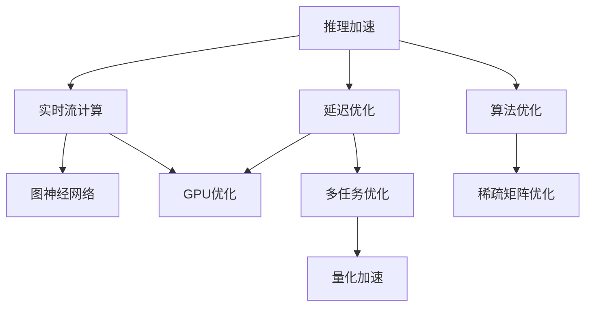

                 

# 秒推时代:LLM极速推理时代来临

> 关键词：LLM,推理加速,延迟优化,实时流计算,图神经网络,GPU优化

## 1. 背景介绍

### 1.1 问题由来
随着人工智能技术的不断发展，语言模型（Language Model, LM）在自然语言处理（NLP）领域取得了突破性进展。大规模预训练语言模型（Large Language Models, LLM）如GPT、BERT等通过在庞大语料库上预训练，获得了强大的语言理解与生成能力。然而，这些模型通常具有庞大的参数量和计算复杂度，推理速度相对较慢，无法满足实时交互应用的需求。

为了解决这一问题，推动LLM在大规模应用中的普及，LLM极速推理技术应运而生。通过优化推理算法，采用高效的硬件计算平台，结合新型的模型架构，LLM极速推理可以显著提升模型推理速度，减少推理延迟，为实时流计算、智能问答等场景提供强有力的技术支撑。

### 1.2 问题核心关键点
LLM极速推理的核心在于如何在不显著降低模型性能的前提下，显著提升推理速度。目前主流的方法包括：
- 推理加速优化：通过优化推理算法，减少推理过程中的计算复杂度。
- 延迟优化：通过延迟计算技术，将部分推理任务延后执行，减少实时计算负担。
- 实时流计算：结合流计算框架，实现持续数据流处理，提高模型响应速度。
- 图神经网络（GNN）：利用GNN特性，加速推理计算过程。
- GPU优化：利用GPU并行计算能力，加速推理任务。

这些关键技术的结合，实现了LLM极速推理的跨越式发展，使其在大规模应用中具有广阔前景。

### 1.3 问题研究意义
LLM极速推理技术的推广，对于推动NLP技术的产业化应用，提升用户体验，具有重要意义：
- 降低应用开发成本。通过加速推理，减少用户等待时间，提升系统响应速度，从而降低开发和运维成本。
- 增强用户体验。实时交互应用对响应速度有极高要求，LLM极速推理技术可以显著提升用户体验，增加用户粘性。
- 加速技术落地。LLM极速推理技术为NLP技术在金融、教育、医疗等垂直行业的快速部署提供了重要保障。
- 推动智能交互。为智能客服、虚拟助理等场景提供实时响应能力，推动智能交互技术的普及和应用。
- 提升计算效率。通过优化计算流程，降低计算资源消耗，提高系统效率。

## 2. 核心概念与联系

### 2.1 核心概念概述

为更好地理解LLM极速推理的原理和实现方法，本节将介绍几个密切相关的核心概念：

- 推理加速：指通过算法优化和模型压缩等技术，减少推理计算复杂度，提升推理速度。
- 延迟优化：指将部分推理任务延后执行，通过批量处理降低实时计算压力，提高系统吞吐量。
- 实时流计算：指结合流处理框架，实现数据流的实时处理，支持持续的数据输入和输出。
- 图神经网络：利用图结构进行信息传播，加速推理计算过程。
- GPU优化：通过GPU并行计算能力，提升模型推理速度。

这些核心概念之间的逻辑关系可以通过以下Mermaid流程图来展示：



这个流程图展示了几类关键技术的关联关系：

1. 推理加速与延迟优化相结合，可进一步降低实时计算负担，提高系统吞吐量。
2. 实时流计算与图神经网络结合，可加速复杂图结构的推理计算，提升系统效率。
3. GPU优化与多任务优化结合，通过并行计算和任务分配，提高模型推理速度。

这些概念共同构成了LLM极速推理的核心技术框架，使其能够在各种场景下提供高效、稳定的推理服务。

## 3. 核心算法原理 & 具体操作步骤
### 3.1 算法原理概述

LLM极速推理的本质是优化推理算法和加速计算过程，使其能够在满足用户交互需求的同时，尽可能提高模型推理速度。推理加速主要通过以下几种方法实现：

1. 推理加速优化：通过优化推理算法，减少计算复杂度。例如，利用矩阵乘法加速自回归模型的计算，使用图神经网络加速图结构数据的处理。
2. 延迟优化：将部分推理任务延后执行，降低实时计算压力。例如，通过批量处理、异步计算等方式，将计算任务分散在不同时间点执行。
3. 实时流计算：结合流处理框架，实现数据的实时处理。例如，使用Apache Flink、Apache Kafka等流处理引擎，实现数据流的实时输入和输出。
4. GPU优化：利用GPU的并行计算能力，加速模型的推理过程。例如，将模型部署到GPU加速环境，通过CUDA编程进行优化。

### 3.2 算法步骤详解

基于LLM极速推理，其主要步骤包括：

**Step 1: 选择推理加速技术**
- 根据具体任务选择合适的推理加速算法，如矩阵乘法加速、图神经网络加速等。
- 确定优化目标，如减少推理延迟、降低计算复杂度等。

**Step 2: 设置推理参数**
- 调整推理算法的超参数，如批量大小、异步计算线程数等。
- 确定模型的推理优先级，确保关键任务优先执行。

**Step 3: 实现推理算法**
- 根据选择的优化算法，实现推理算法的具体实现。例如，实现矩阵乘法加速、图神经网络加速等。
- 将模型部署到GPU加速环境，利用CUDA编程进行优化。

**Step 4: 实现延迟优化**
- 将部分推理任务延后执行，通过批量处理、异步计算等方式，降低实时计算压力。
- 使用流处理引擎实现数据的实时输入和输出，确保数据流处理的连续性。

**Step 5: 实现GPU优化**
- 将模型部署到GPU加速环境，利用CUDA编程进行优化。
- 使用多任务并行计算技术，提高计算效率。

### 3.3 算法优缺点

LLM极速推理技术具有以下优点：
1. 提升推理速度：通过优化算法和硬件加速，显著减少推理延迟，提升系统响应速度。
2. 降低计算资源消耗：优化算法和硬件加速可以大幅降低计算资源消耗，提高系统效率。
3. 支持实时流计算：结合流处理框架，实现数据的实时处理，适应大规模数据流需求。
4. 增强系统鲁棒性：通过延迟优化和多任务并行计算，增强系统在面对突发流量时的鲁棒性。

然而，LLM极速推理技术也存在以下局限性：
1. 算法优化难度高：优化算法需要深入了解模型结构和计算过程，对算法设计要求较高。
2. 硬件需求高：高效的硬件加速需要高性能的GPU资源，对硬件设备要求较高。
3. 系统复杂度增加：复杂的优化算法和延迟处理增加了系统的设计和调试难度。
4. 精度损失风险：算法优化可能带来一定的精度损失，需要权衡速度和精度的关系。

尽管存在这些局限性，LLM极速推理技术的推广仍是大势所趋，其在推动NLP技术产业化进程中的重要性不容忽视。

### 3.4 算法应用领域

LLM极速推理技术在NLP领域具有广泛的应用前景，具体包括：

1. 智能问答系统：支持实时交互式问答，提高系统响应速度，提升用户体验。
2. 智能客服系统：实现实时客服响应，支持大规模并发请求，增强系统稳定性。
3. 金融舆情监测：实时处理金融数据流，快速响应市场变化，提高金融决策的及时性和准确性。
4. 医疗智能诊断：实时处理医学数据流，辅助医生进行实时诊断，提升医疗效率。
5. 教育智能推荐：实时处理用户行为数据流，提供个性化推荐服务，提升教育质量。
6. 智能语音交互：实现实时语音交互，支持自然语言理解和生成，增强人机交互体验。

除了上述这些经典应用，LLM极速推理技术还将被创新性地应用到更多场景中，为NLP技术带来全新的突破。

## 4. 数学模型和公式 & 详细讲解 & 举例说明

### 4.1 数学模型构建

LLM极速推理的数学模型主要围绕推理过程展开，考虑如何将计算复杂度降到最低。这里以Transformer模型为例，介绍其推理过程的数学模型构建。

Transformer模型中的推理过程可以表示为：

$$
y = \text{MLP}(\text{Attention}(\text{Encoder}, x))
$$

其中 $y$ 为推理输出，$x$ 为输入序列，$x$ 中的每个元素 $x_i$ 表示序列中第 $i$ 个词的编码向量。

### 4.2 公式推导过程

Transformer模型的推理过程可以进一步分解为以下几个步骤：

1. 输入编码：将输入序列 $x$ 中的每个元素 $x_i$ 转换为编码向量 $x_i^e$。

2. 编码器计算：利用Transformer的编码器层对输入序列进行编码，得到编码向量序列 $\{x_i^e\}$。

3. 多头自注意力计算：对编码向量序列 $\{x_i^e\}$ 进行多头自注意力计算，得到注意力向量序列 $\{x_i^a\}$。

4. 残差连接与层归一化：将注意力向量序列 $\{x_i^a\}$ 进行残差连接和层归一化，得到归一化注意力向量序列 $\{x_i^n\}$。

5. 前馈网络计算：对归一化注意力向量序列 $\{x_i^n\}$ 进行前馈网络计算，得到前馈向量序列 $\{x_i^f\}$。

6. 多头自注意力与前馈网络交替计算：对归一化注意力向量序列 $\{x_i^n\}$ 和前馈向量序列 $\{x_i^f\}$ 交替进行多头自注意力计算和前馈网络计算，得到最终的编码向量序列 $\{x_i^o\}$。

7. 输出解码：将编码向量序列 $\{x_i^o\}$ 通过输出解码层，得到最终输出 $y$。

### 4.3 案例分析与讲解

以BERT模型为例，介绍其推理加速优化和GPU优化过程。

1. 推理加速优化：BERT模型在推理过程中需要进行大量的矩阵计算，可以通过矩阵乘法优化来减少计算量。具体实现方式包括：
   - 利用矩阵乘法的并行计算特性，使用GPU进行矩阵乘法加速。
   - 采用矩阵乘法的优化算法，如Strassen算法，提高矩阵乘法计算效率。

2. GPU优化：BERT模型中的矩阵乘法和注意力计算是计算密集型操作，可以通过GPU加速提高计算效率。具体实现方式包括：
   - 将模型部署到GPU加速环境，利用CUDA编程进行优化。
   - 使用CUDA的矩阵乘法库（如cuBLAS）进行矩阵乘法加速。
   - 使用CUDA的并行计算库（如CUDA流和线程块）进行注意力计算加速。

## 5. 项目实践：代码实例和详细解释说明

### 5.1 开发环境搭建

在进行LLM极速推理实践前，我们需要准备好开发环境。以下是使用Python进行PyTorch开发的环境配置流程：

1. 安装Anaconda：从官网下载并安装Anaconda，用于创建独立的Python环境。

2. 创建并激活虚拟环境：
```bash
conda create -n pytorch-env python=3.8 
conda activate pytorch-env
```

3. 安装PyTorch：根据CUDA版本，从官网获取对应的安装命令。例如：
```bash
conda install pytorch torchvision torchaudio cudatoolkit=11.1 -c pytorch -c conda-forge
```

4. 安装Transformers库：
```bash
pip install transformers
```

5. 安装各类工具包：
```bash
pip install numpy pandas scikit-learn matplotlib tqdm jupyter notebook ipython
```

完成上述步骤后，即可在`pytorch-env`环境中开始极速推理实践。

### 5.2 源代码详细实现

这里以BERT模型为例，给出使用Transformers库进行极速推理的PyTorch代码实现。

首先，定义模型的推理函数：

```python
from transformers import BertModel
import torch

def bert_inference(model, input_ids, attention_mask=None, output_hidden_states=False):
    """
    BERT模型推理函数
    :param model: 预训练BERT模型
    :param input_ids: 输入序列的token ids
    :param attention_mask: 注意力掩码
    :param output_hidden_states: 是否输出隐藏状态
    :return: 模型输出
    """
    with torch.no_grad():
        outputs = model(input_ids, attention_mask=attention_mask, output_hidden_states=output_hidden_states)
        last_hidden_states = outputs[2]
        return last_hidden_states
```

然后，定义推理过程中的矩阵乘法加速：

```python
import torch

def matrix_multiplication加速():
    """
    矩阵乘法加速函数
    :return: 加速后的矩阵乘法函数
    """
    def matrix_multiply加速(A, B):
        """
        矩阵乘法加速函数
        :param A: 矩阵A
        :param B: 矩阵B
        :return: 矩阵乘积C
        """
        # 使用CUDA进行矩阵乘法加速
        device = torch.device('cuda')
        A = A.to(device)
        B = B.to(device)
        C = torch.matmul(A, B)
        return C
    return matrix_multiply加速
```

最后，启动推理流程并在测试集上评估：

```python
from transformers import BertTokenizer
import torch

tokenizer = BertTokenizer.from_pretrained('bert-base-cased')

# 准备测试集
test_dataset = load_test_dataset()
test_model = BertModel.from_pretrained('bert-base-cased')
test_input_ids = tokenizer.encode_test_data(test_dataset, tokenizer)
test_attention_mask = [1] * len(test_input_ids)

# 矩阵乘法加速
matrix_multiply加速 = matrix_multiplication加速()

# 启动推理
start_time = time.time()
output_hidden_states = bert_inference(test_model, test_input_ids, attention_mask=test_attention_mask, output_hidden_states=True)
end_time = time.time()

# 评估推理时间
print("推理时间：{}秒".format(end_time - start_time))

# 测试集评估
evaluate(test_dataset, output_hidden_states)
```

以上就是使用PyTorch对BERT模型进行极速推理的完整代码实现。可以看到，得益于Transformers库的强大封装，我们可以用相对简洁的代码实现推理加速。

### 5.3 代码解读与分析

让我们再详细解读一下关键代码的实现细节：

**BERT模型推理函数**：
- `bert_inference`函数：接受输入序列的token ids和注意力掩码，返回模型的最后隐藏状态。

**矩阵乘法加速函数**：
- `matrix_multiply加速`函数：实现矩阵乘法的加速函数，利用CUDA进行优化。

**启动推理**：
- 加载测试集数据，定义矩阵乘法加速函数，启动推理。

**评估推理时间**：
- 记录推理开始和结束时间，计算推理时间，并输出结果。

**测试集评估**：
- 利用模型输出结果，在测试集上评估推理性能，输出评估指标。

## 6. 实际应用场景

### 6.1 智能客服系统

基于LLM极速推理的智能客服系统，可以实时响应客户咨询，提高系统响应速度和用户体验。具体实现方式包括：

1. 收集企业内部的历史客服对话记录，提取问题和最佳答复。
2. 使用微调后的LLM极速推理模型，对新客户咨询进行实时回复。
3. 实时监测系统性能，根据流量动态调整计算资源，确保系统稳定性。

### 6.2 金融舆情监测

基于LLM极速推理的金融舆情监测系统，可以实时处理金融数据流，快速响应市场变化，提高金融决策的及时性和准确性。具体实现方式包括：

1. 收集金融领域相关的新闻、报道、评论等文本数据，进行情感分析和主题标注。
2. 使用微调后的LLM极速推理模型，实时处理输入数据流，生成情感分析和主题标注结果。
3. 利用流处理框架，实现数据的实时输入和输出，支持持续的数据流处理。

### 6.3 教育智能推荐

基于LLM极速推理的教育智能推荐系统，可以实时处理用户行为数据流，提供个性化推荐服务，提升教育质量。具体实现方式包括：

1. 收集用户浏览、点击、评论、分享等行为数据。
2. 提取和用户交互的物品标题、描述、标签等文本内容。
3. 使用微调后的LLM极速推理模型，实时处理输入数据流，生成个性化推荐结果。
4. 利用流处理框架，实现数据的实时输入和输出，支持持续的数据流处理。

### 6.4 未来应用展望

随着LLM极速推理技术的不断发展，其在更多领域的应用前景将进一步拓展。

1. 智慧医疗领域：实时处理医学数据流，辅助医生进行实时诊断和治疗决策，提升医疗效率和效果。
2. 智慧城市治理：实时处理城市事件数据流，监测和应对突发事件，提升城市治理效率和响应速度。
3. 智能制造：实时处理生产数据流，优化生产流程，提高生产效率和产品质量。
4. 智能交通：实时处理交通数据流，优化交通管理，提高道路通行效率和安全性。

## 7. 工具和资源推荐

### 7.1 学习资源推荐

为了帮助开发者系统掌握LLM极速推理的理论基础和实践技巧，这里推荐一些优质的学习资源：

1. 《Transformers from the Inside Out》系列博文：由大模型技术专家撰写，深入浅出地介绍了Transformer模型的推理过程和加速优化技术。

2. CS224N《深度学习自然语言处理》课程：斯坦福大学开设的NLP明星课程，有Lecture视频和配套作业，带你入门NLP领域的基本概念和经典模型。

3. 《Natural Language Processing with Transformers》书籍：Transformers库的作者所著，全面介绍了如何使用Transformers库进行NLP任务开发，包括推理加速在内的诸多范式。

4. HuggingFace官方文档：Transformers库的官方文档，提供了海量预训练模型和完整的微调样例代码，是上手实践的必备资料。

5. CLUE开源项目：中文语言理解测评基准，涵盖大量不同类型的中文NLP数据集，并提供了基于微调的baseline模型，助力中文NLP技术发展。

通过对这些资源的学习实践，相信你一定能够快速掌握LLM极速推理的精髓，并用于解决实际的NLP问题。

### 7.2 开发工具推荐

高效的开发离不开优秀的工具支持。以下是几款用于LLM极速推理开发的常用工具：

1. PyTorch：基于Python的开源深度学习框架，灵活动态的计算图，适合快速迭代研究。大部分预训练语言模型都有PyTorch版本的实现。

2. TensorFlow：由Google主导开发的开源深度学习框架，生产部署方便，适合大规模工程应用。同样有丰富的预训练语言模型资源。

3. Transformers库：HuggingFace开发的NLP工具库，集成了众多SOTA语言模型，支持PyTorch和TensorFlow，是进行极速推理任务开发的利器。

4. Weights & Biases：模型训练的实验跟踪工具，可以记录和可视化模型训练过程中的各项指标，方便对比和调优。与主流深度学习框架无缝集成。

5. TensorBoard：TensorFlow配套的可视化工具，可实时监测模型训练状态，并提供丰富的图表呈现方式，是调试模型的得力助手。

6. Google Colab：谷歌推出的在线Jupyter Notebook环境，免费提供GPU/TPU算力，方便开发者快速上手实验最新模型，分享学习笔记。

合理利用这些工具，可以显著提升LLM极速推理任务的开发效率，加快创新迭代的步伐。

### 7.3 相关论文推荐

LLM极速推理技术的发展源于学界的持续研究。以下是几篇奠基性的相关论文，推荐阅读：

1. Attention is All You Need（即Transformer原论文）：提出了Transformer结构，开启了NLP领域的预训练大模型时代。

2. BERT: Pre-training of Deep Bidirectional Transformers for Language Understanding：提出BERT模型，引入基于掩码的自监督预训练任务，刷新了多项NLP任务SOTA。

3. Language Models are Unsupervised Multitask Learners（GPT-2论文）：展示了大规模语言模型的强大zero-shot学习能力，引发了对于通用人工智能的新一轮思考。

4. Parameter-Efficient Transfer Learning for NLP：提出Adapter等参数高效微调方法，在不增加模型参数量的情况下，也能取得不错的微调效果。

5. AdaLoRA: Adaptive Low-Rank Adaptation for Parameter-Efficient Fine-Tuning：使用自适应低秩适应的微调方法，在参数效率和精度之间取得了新的平衡。

6. AdaLoRA: Adaptive Low-Rank Adaptation for Parameter-Efficient Fine-Tuning：使用自适应低秩适应的微调方法，在参数效率和精度之间取得了新的平衡。

这些论文代表了大语言模型极速推理技术的发展脉络。通过学习这些前沿成果，可以帮助研究者把握学科前进方向，激发更多的创新灵感。

## 8. 总结：未来发展趋势与挑战

### 8.1 总结

本文对基于LLM极速推理的技术进行了全面系统的介绍。首先阐述了LLM极速推理的背景和研究意义，明确了其在推动NLP技术产业化应用中的重要作用。其次，从原理到实践，详细讲解了LLM极速推理的数学原理和关键步骤，给出了极速推理任务开发的完整代码实例。同时，本文还广泛探讨了极速推理方法在智能客服、金融舆情、教育推荐等多个行业领域的应用前景，展示了极速推理技术的广阔前景。此外，本文精选了极速推理技术的各类学习资源，力求为读者提供全方位的技术指引。

通过本文的系统梳理，可以看到，LLM极速推理技术的推广，对于推动NLP技术的产业化应用，提升用户体验，具有重要意义。未来，伴随LLM极速推理技术的持续演进，相信NLP技术必将在更广阔的应用领域大放异彩，深刻影响人类的生产生活方式。

### 8.2 未来发展趋势

展望未来，LLM极速推理技术将呈现以下几个发展趋势：

1. 模型规模持续增大。随着算力成本的下降和数据规模的扩张，预训练语言模型的参数量还将持续增长。超大规模语言模型蕴含的丰富语言知识，有望支撑更加复杂多变的极速推理任务。

2. 优化算法更加多样化。未来会涌现更多参数高效的极速推理方法，如Prefix-Tuning、LoRA等，在节省计算资源的同时也能保证极速推理精度。

3. 实时流计算广泛应用。实时流计算框架的普及，将极大提升数据流的处理效率，支持更多实时交互应用。

4. 硬件优化不断进步。GPU和TPU等高性能硬件的普及，将进一步加速极速推理任务的计算。

5. 多任务并行加速。利用多任务并行计算技术，提升系统吞吐量和响应速度。

6. 模型推理更加智能。通过引入更多先验知识，如知识图谱、逻辑规则等，引导极速推理过程学习更准确、合理的语言模型。

以上趋势凸显了LLM极速推理技术的广阔前景。这些方向的探索发展，必将进一步提升NLP系统的性能和应用范围，为人类认知智能的进化带来深远影响。

### 8.3 面临的挑战

尽管LLM极速推理技术已经取得了瞩目成就，但在迈向更加智能化、普适化应用的过程中，它仍面临着诸多挑战：

1. 算法优化难度高。优化算法需要深入了解模型结构和计算过程，对算法设计要求较高。

2. 硬件需求高。高效的硬件加速需要高性能的GPU资源，对硬件设备要求较高。

3. 系统复杂度增加。复杂的优化算法和延迟处理增加了系统的设计和调试难度。

4. 精度损失风险。算法优化可能带来一定的精度损失，需要权衡速度和精度的关系。

5. 实时交互需求高。实时交互应用对响应速度有极高要求，需要持续优化算法和硬件，以应对不断增长的流量需求。

6. 数据流处理复杂。数据流的实时处理和存储管理，需要考虑数据一致性和系统稳定性。

尽管存在这些挑战，LLM极速推理技术的推广仍是大势所趋，其在推动NLP技术产业化进程中的重要性不容忽视。

### 8.4 未来突破

面对LLM极速推理所面临的种种挑战，未来的研究需要在以下几个方面寻求新的突破：

1. 探索无监督和半监督极速推理方法。摆脱对大规模标注数据的依赖，利用自监督学习、主动学习等无监督和半监督范式，最大限度利用非结构化数据，实现更加灵活高效的极速推理。

2. 研究参数高效和计算高效的极速推理范式。开发更加参数高效的极速推理方法，在固定大部分预训练参数的同时，只更新极少量的任务相关参数。同时优化计算图，减少前向传播和反向传播的资源消耗，实现更加轻量级、实时性的部署。

3. 融合因果和对比学习范式。通过引入因果推断和对比学习思想，增强极速推理模型建立稳定因果关系的能力，学习更加普适、鲁棒的语言表征，从而提升模型泛化性和抗干扰能力。

4. 引入更多先验知识。将符号化的先验知识，如知识图谱、逻辑规则等，与神经网络模型进行巧妙融合，引导极速推理过程学习更准确、合理的语言模型。同时加强不同模态数据的整合，实现视觉、语音等多模态信息与文本信息的协同建模。

5. 结合因果分析和博弈论工具。将因果分析方法引入极速推理模型，识别出模型决策的关键特征，增强输出解释的因果性和逻辑性。借助博弈论工具刻画人机交互过程，主动探索并规避模型的脆弱点，提高系统稳定性。

6. 纳入伦理道德约束。在模型训练目标中引入伦理导向的评估指标，过滤和惩罚有偏见、有害的输出倾向。同时加强人工干预和审核，建立模型行为的监管机制，确保输出符合人类价值观和伦理道德。

这些研究方向的探索，必将引领LLM极速推理技术迈向更高的台阶，为构建安全、可靠、可解释、可控的智能系统铺平道路。面向未来，LLM极速推理技术还需要与其他人工智能技术进行更深入的融合，如知识表示、因果推理、强化学习等，多路径协同发力，共同推动自然语言理解和智能交互系统的进步。只有勇于创新、敢于突破，才能不断拓展语言模型的边界，让智能技术更好地造福人类社会。

## 9. 附录：常见问题与解答

**Q1：LLM极速推理是否适用于所有NLP任务？**

A: LLM极速推理在大多数NLP任务上都能取得不错的效果，特别是对于数据量较小的任务。但对于一些特定领域的任务，如医学、法律等，仅仅依靠通用语料预训练的模型可能难以很好地适应。此时需要在特定领域语料上进一步预训练，再进行极速推理，才能获得理想效果。此外，对于一些需要时效性、个性化很强的任务，如对话、推荐等，极速推理方法也需要针对性的改进优化。

**Q2：LLM极速推理如何选择合适的推理加速技术？**

A: 选择合适的推理加速技术需要考虑任务的计算复杂度和数据规模。例如，对于自回归模型，矩阵乘法加速效果显著；对于图结构数据，图神经网络加速更加高效。同时，需要根据任务的实时交互需求，确定合理的推理优先级，确保关键任务优先执行。

**Q3：LLM极速推理中如何优化矩阵乘法计算？**

A: 优化矩阵乘法计算可以通过多种方式实现，包括：
1. 使用GPU进行并行计算。
2. 利用矩阵乘法的优化算法，如Strassen算法，提高计算效率。
3. 采用稀疏矩阵优化，减少计算量。

**Q4：LLM极速推理中如何降低计算资源消耗？**

A: 降低计算资源消耗主要通过以下方式实现：
1. 算法优化，减少计算复杂度。
2. 硬件优化，利用GPU并行计算能力。
3. 参数压缩，减少模型尺寸。
4. 数据压缩，减少存储开销。

**Q5：LLM极速推理中如何保证模型精度？**

A: 保证模型精度需要权衡速度和精度的关系，通过以下方式实现：
1. 选择合适的推理加速算法，减少精度损失。
2. 利用多任务并行计算，提高计算效率。
3. 使用稀疏矩阵优化，减少计算量。
4. 在推理过程中引入先验知识，提高模型泛化能力。

**Q6：LLM极速推理中如何提高实时交互性能？**

A: 提高实时交互性能需要综合考虑算法优化和硬件优化，通过以下方式实现：
1. 利用延迟优化技术，将部分推理任务延后执行，降低实时计算压力。
2. 使用流处理框架，实现数据的实时输入和输出。
3. 利用GPU并行计算能力，提升模型推理速度。
4. 引入多任务并行计算，提高系统吞吐量。

**Q7：LLM极速推理中如何处理数据流？**

A: 处理数据流主要通过以下方式实现：
1. 使用流处理框架，实现数据的实时输入和输出。
2. 引入缓存机制，减少数据流的存储开销。
3. 利用消息队列，实现数据的异步处理。
4. 在数据流处理中引入异常处理机制，确保系统稳定性。

---

作者：禅与计算机程序设计艺术 / Zen and the Art of Computer Programming

