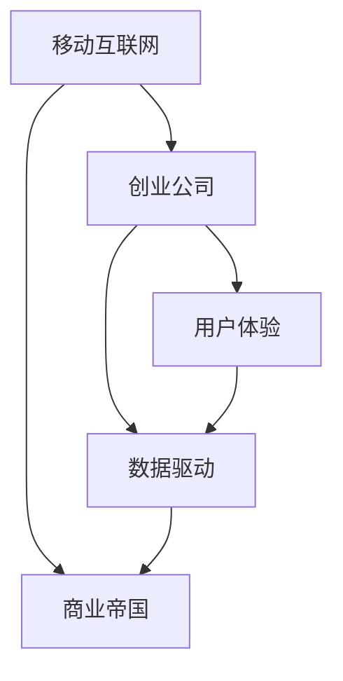

                 

## 1. 背景介绍

### 1.1 问题由来

随着移动互联网时代的到来，智能手机成为人们生活中不可或缺的一部分。据统计，全球智能手机用户数量已经超过30亿，移动互联网市场规模更是达到了数万亿美元。在这一背景下，移动互联网创业成为了新的“蓝海”。

移动互联网创业相较于传统的桌面互联网创业，有着广阔的市场空间和无限的可能性。互联网巨头纷纷加码移动互联网领域，不断拓展商业帝国，争夺未来的市场份额。因此，如何在这个充满竞争和机遇的市场中脱颖而出，成为了每一个创业者面临的重大挑战。

### 1.2 问题核心关键点

移动互联网创业的核心关键点主要包括：

1. **技术创新**：移动互联网技术的发展日新月异，要想在激烈的市场竞争中占据一席之地，必须持续关注技术前沿，进行技术创新。
2. **用户需求**：移动互联网创业的成功关键在于能够准确把握用户需求，提供有价值的服务，满足用户的痛点。
3. **商业模式**：移动互联网创业的商业模式多种多样，如何选择合适的商业模式，实现盈利和可持续发展，是一个重要的研究方向。
4. **市场策略**：移动互联网市场变化快速，如何制定有效的市场策略，快速抢占市场份额，扩大用户基础，也是创业成功的关键。
5. **团队建设**：移动互联网创业需要多学科、多领域的人才协同合作，如何组建高效的团队，充分发挥团队优势，是创业成功的保障。

### 1.3 问题研究意义

移动互联网创业不仅是技术创新和商业模式的创新，更是社会进步和经济发展的重要推动力。移动互联网技术的发展，极大地改变了人们的生活方式和消费习惯，推动了数字经济的繁荣。因此，深入研究移动互联网创业的原理和实践，具有重要的理论和实际意义。

通过深入分析移动互联网创业的核心概念和关键技术，本博客将对移动互联网创业的原理、方法、工具和未来发展趋势进行全面系统地探讨，希望能为移动互联网创业者提供一些有价值的参考。

## 2. 核心概念与联系

### 2.1 核心概念概述

为了更好地理解移动互联网创业，本节将介绍几个关键概念：

1. **移动互联网**：移动互联网是指通过无线网络，在移动设备上访问互联网的服务。其特点是随时随地的接入性和便利性，提供了更加多样化的应用场景和服务体验。
2. **创业公司**：创业公司是指在技术、市场等领域进行创新和探索，并寻求商业化的新兴企业。移动互联网创业公司则专注于移动互联网领域的创新和发展。
3. **商业帝国**：商业帝国是指企业在某个市场或领域内占据主导地位，拥有强大的品牌影响力、市场份额和盈利能力。移动互联网创业公司通过技术创新和商业模式创新，构建自己的商业帝国。
4. **用户体验(UX)**：用户体验是指用户在使用产品或服务时的感受和体验，移动互联网创业公司需要注重产品的用户体验，提升用户满意度和忠诚度。
5. **数据驱动**：移动互联网创业公司需要充分利用大数据技术，通过数据分析和挖掘，发现用户需求和市场机会，指导产品和服务的开发和优化。

这些核心概念之间的联系可以通过以下Mermaid流程图来展示：



这个流程图展示了大语言模型的核心概念及其之间的关系：

1. 移动互联网为创业公司提供了技术基础和市场空间。
2. 创业公司通过技术创新和商业模式创新，构建商业帝国。
3. 用户体验和数据驱动是创业公司成功的重要因素，能够帮助公司更好地了解用户需求和市场变化。
4. 用户体验和数据驱动通过优化产品和服务，进一步增强创业公司的市场竞争力，推动商业帝国的构建。

## 3. 核心算法原理 & 具体操作步骤

### 3.1 算法原理概述

移动互联网创业的核心算法原理主要基于以下两个方面：

1. **技术创新算法**：技术创新是移动互联网创业的基础。通过不断优化和改进现有的技术，推出新的技术产品和解决方案，是创业公司获得市场竞争力的关键。
2. **商业模式创新算法**：商业模式创新是移动互联网创业的核心。通过创新的商业模式，提供有价值的服务，实现盈利和可持续发展。

### 3.2 算法步骤详解

移动互联网创业的算法步骤主要包括以下几个关键环节：

**Step 1: 市场调研与用户需求分析**

1. 收集目标市场的数据和信息，了解市场的规模、增长趋势和竞争态势。
2. 分析目标用户的特征和需求，了解用户痛点和需求。

**Step 2: 产品设计与用户体验优化**

1. 根据市场调研和用户需求分析的结果，设计符合用户需求的产品和服务。
2. 采用用户体验设计（UX Design）的方法，优化产品的功能和界面，提升用户的使用体验。

**Step 3: 技术实现与产品开发**

1. 选择合适的技术架构和开发工具，进行产品的开发和实现。
2. 利用敏捷开发（Agile Development）的方法，快速迭代和优化产品。

**Step 4: 市场推广与用户获取**

1. 制定市场推广策略，选择合适的渠道和方式进行推广。
2. 利用社交媒体、广告、SEO等手段，吸引用户下载和使用产品。

**Step 5: 数据分析与优化**

1. 利用数据分析（Data Analytics）技术，收集和分析用户行为数据。
2. 根据分析结果，不断优化产品和服务，提升用户体验和满意度。

**Step 6: 商业合作与市场拓展**

1. 寻找合适的合作伙伴，进行商业合作和技术交流。
2. 开拓新的市场，扩大用户基础和市场份额。

### 3.3 算法优缺点

移动互联网创业的算法有以下优点：

1. **快速迭代**：移动互联网技术的发展速度较快，创业者可以通过快速迭代和优化产品，快速适应市场变化。
2. **数据驱动**：移动互联网创业公司可以通过大数据技术，了解用户需求和市场变化，指导产品和服务的设计和优化。
3. **市场空间大**：移动互联网市场空间广阔，存在许多新的商业机会和发展空间。
4. **用户基数大**：移动互联网设备的普及和用户数量的增加，为创业公司提供了更大的用户基数和市场机会。

同时，移动互联网创业也存在以下缺点：

1. **竞争激烈**：移动互联网市场竞争激烈，成功的创业公司需要具备较强的市场竞争力和创新能力。
2. **技术要求高**：移动互联网创业需要较高的技术水平和开发能力，对团队的技术要求较高。
3. **市场变化快**：移动互联网市场变化快，创业者需要具备较强的市场敏感性和应变能力。
4. **用户粘性低**：移动互联网用户更换设备的频率较高，创业公司需要不断优化用户体验和产品功能，提高用户粘性。

### 3.4 算法应用领域

移动互联网创业的算法广泛应用于以下几个领域：

1. **社交媒体**：通过技术创新和商业模式创新，提供更加多样化和个性化的社交服务。
2. **电子商务**：利用移动互联网技术和物流服务，提供线上购物、支付和配送等服务。
3. **在线教育**：利用移动互联网技术和在线直播技术，提供个性化和互动的在线教育服务。
4. **健康医疗**：利用移动互联网技术和健康数据监测，提供健康管理和医疗咨询服务。
5. **出行服务**：利用移动互联网技术和位置服务，提供便捷和安全的出行服务。
6. **金融服务**：利用移动互联网技术和区块链技术，提供便捷和安全的金融服务。

## 4. 数学模型和公式 & 详细讲解 & 举例说明

### 4.1 数学模型构建

移动互联网创业的数学模型主要基于以下两个方面：

1. **技术创新模型**：技术创新模型旨在通过数学方法，分析和优化现有的技术，预测未来的技术趋势。
2. **商业模式创新模型**：商业模式创新模型旨在通过数学方法，分析和优化商业模式，预测未来的商业模式趋势。

### 4.2 公式推导过程

以技术创新模型为例，假设创业公司采用随机梯度下降（SGD）算法进行技术创新，其数学模型如下：

$$
\min_{\theta} \sum_{i=1}^{N} \ell(\mathbf{x}_i, y_i; \theta)
$$

其中，$\theta$ 表示模型的参数，$\ell(\mathbf{x}_i, y_i; \theta)$ 表示第 $i$ 个样本的损失函数。

**公式推导过程**：

1. 根据样本 $\mathbf{x}_i$ 和对应的标签 $y_i$，计算损失函数 $\ell(\mathbf{x}_i, y_i; \theta)$。
2. 使用随机梯度下降算法，对模型参数 $\theta$ 进行优化，使损失函数最小化。

### 4.3 案例分析与讲解

**案例一：社交媒体**

假设创业公司开发了一款基于深度学习的社交媒体推荐系统。其数学模型可以表示为：

$$
\min_{\theta} \sum_{i=1}^{N} \ell(\mathbf{x}_i, y_i; \theta)
$$

其中，$\mathbf{x}_i$ 表示用户的历史行为数据，$y_i$ 表示用户对推荐内容的反馈（如点赞、分享等），$\theta$ 表示模型的参数。

**案例二：电子商务**

假设创业公司开发了一款基于机器学习的电商平台推荐系统。其数学模型可以表示为：

$$
\min_{\theta} \sum_{i=1}^{N} \ell(\mathbf{x}_i, y_i; \theta)
$$

其中，$\mathbf{x}_i$ 表示用户的历史购买记录，$y_i$ 表示用户对推荐商品的需求，$\theta$ 表示模型的参数。

## 5. 项目实践：代码实例和详细解释说明

### 5.1 开发环境搭建

在进行移动互联网创业项目实践前，我们需要准备好开发环境。以下是使用Python进行PyTorch开发的环境配置流程：

1. 安装Anaconda：从官网下载并安装Anaconda，用于创建独立的Python环境。

2. 创建并激活虚拟环境：
```bash
conda create -n pytorch-env python=3.8 
conda activate pytorch-env
```

3. 安装PyTorch：根据CUDA版本，从官网获取对应的安装命令。例如：
```bash
conda install pytorch torchvision torchaudio cudatoolkit=11.1 -c pytorch -c conda-forge
```

4. 安装TensorFlow：
```bash
pip install tensorflow
```

5. 安装Flutter和React Native等开发工具：
```bash
pip install flutter react-native
```

完成上述步骤后，即可在`pytorch-env`环境中开始移动互联网创业项目实践。

### 5.2 源代码详细实现

这里我们以社交媒体推荐系统为例，给出使用PyTorch进行开发和实现的代码实现。

```python
import torch
import torch.nn as nn
import torch.optim as optim
from torch.utils.data import DataLoader
from torchvision import datasets, transforms

# 定义模型
class SocialMediaModel(nn.Module):
    def __init__(self):
        super(SocialMediaModel, self).__init__()
        self.fc1 = nn.Linear(128, 64)
        self.fc2 = nn.Linear(64, 32)
        self.fc3 = nn.Linear(32, 2)

    def forward(self, x):
        x = torch.relu(self.fc1(x))
        x = torch.relu(self.fc2(x))
        x = self.fc3(x)
        return x

# 定义损失函数和优化器
model = SocialMediaModel()
criterion = nn.CrossEntropyLoss()
optimizer = optim.SGD(model.parameters(), lr=0.01, momentum=0.9)

# 加载数据集
train_dataset = datasets.MNIST(root='./data', train=True, download=True, transform=transforms.ToTensor())
test_dataset = datasets.MNIST(root='./data', train=False, download=True, transform=transforms.ToTensor())

# 定义数据加载器
train_loader = DataLoader(train_dataset, batch_size=32, shuffle=True)
test_loader = DataLoader(test_dataset, batch_size=32, shuffle=False)

# 训练模型
for epoch in range(10):
    model.train()
    running_loss = 0.0
    for i, data in enumerate(train_loader, 0):
        inputs, labels = data
        optimizer.zero_grad()
        outputs = model(inputs)
        loss = criterion(outputs, labels)
        loss.backward()
        optimizer.step()
        running_loss += loss.item()
    print(f"Epoch {epoch+1}, loss: {running_loss/len(train_loader):.4f}")

# 测试模型
model.eval()
correct = 0
total = 0
with torch.no_grad():
    for data in test_loader:
        inputs, labels = data
        outputs = model(inputs)
        _, predicted = torch.max(outputs.data, 1)
        total += labels.size(0)
        correct += (predicted == labels).sum().item()
print(f"Accuracy: {100 * correct / total:.2f}%")
```

以上代码实现了基于PyTorch的社交媒体推荐系统的开发和训练。在实际应用中，可以根据具体业务需求进行调整和优化。

### 5.3 代码解读与分析

让我们再详细解读一下关键代码的实现细节：

**SocialMediaModel类**：
- `__init__`方法：初始化模型的层和激活函数。
- `forward`方法：定义前向传播的计算过程。

**criterion和optimizer**：
- `criterion`：定义损失函数，这里使用交叉熵损失。
- `optimizer`：定义优化器，这里使用随机梯度下降。

**train_loader和test_loader**：
- `train_loader`：定义训练数据加载器，包括数据集、批大小和是否打乱顺序。
- `test_loader`：定义测试数据加载器，批大小和顺序相同。

**训练过程**：
- `model.train()`：将模型设置为训练模式。
- 在每个epoch内，使用`train_loader`进行训练，计算损失并反向传播更新参数。
- 在每个epoch结束后，计算平均损失并输出。

**测试过程**：
- `model.eval()`：将模型设置为评估模式。
- 使用`test_loader`进行测试，计算准确率和输出结果。

## 6. 实际应用场景

### 6.1 社交媒体

社交媒体是移动互联网创业的主要应用场景之一。通过技术创新和商业模式创新，社交媒体平台可以为用户提供更加个性化和互动的社交服务。

**应用案例**：微信朋友圈推荐系统

微信朋友圈推荐系统是典型的社交媒体推荐系统。其核心算法包括：

1. **内容推荐算法**：通过分析用户的历史互动数据，为用户推荐感兴趣的内容。
2. **用户推荐算法**：通过分析用户的历史互动数据，为用户推荐感兴趣的其他用户。

通过技术创新和商业模式创新，微信朋友圈推荐系统能够为用户提供更加精准和个性化的推荐服务，提升用户粘性和满意度。

### 6.2 电子商务

电子商务是移动互联网创业的另一主要应用场景。通过技术创新和商业模式创新，电商平台可以提供更加便捷和高效的购物体验。

**应用案例**：淘宝个性化推荐系统

淘宝个性化推荐系统是典型的电商平台推荐系统。其核心算法包括：

1. **商品推荐算法**：通过分析用户的历史购买和浏览记录，为用户推荐感兴趣的商品。
2. **价格推荐算法**：通过分析用户的支付能力，为用户推荐合理的价格区间。

通过技术创新和商业模式创新，淘宝个性化推荐系统能够为用户提供更加个性化和便捷的购物体验，提升用户满意度和销售额。

### 6.3 在线教育

在线教育是移动互联网创业的重要方向之一。通过技术创新和商业模式创新，在线教育平台可以提供更加个性化和互动的学习体验。

**应用案例**：Coursera个性化推荐系统

Coursera个性化推荐系统是典型的在线教育推荐系统。其核心算法包括：

1. **课程推荐算法**：通过分析用户的学习历史和偏好，为用户推荐感兴趣的课程。
2. **教师推荐算法**：通过分析用户的学习行为，为用户推荐适合的教师。

通过技术创新和商业模式创新，Coursera个性化推荐系统能够为用户提供更加个性化和互动的学习体验，提升学习效果和用户满意度。

### 6.4 健康医疗

健康医疗是移动互联网创业的重要应用场景之一。通过技术创新和商业模式创新，健康医疗平台可以提供更加便捷和精准的健康管理服务。

**应用案例**：健康管理App个性化推荐系统

健康管理App个性化推荐系统是典型的健康医疗推荐系统。其核心算法包括：

1. **健康数据推荐算法**：通过分析用户的健康数据，为用户推荐适合的健康方案。
2. **医生推荐算法**：通过分析用户的就医历史，为用户推荐适合的医生。

通过技术创新和商业模式创新，健康管理App个性化推荐系统能够为用户提供更加个性化和精准的健康管理服务，提升用户的健康水平和满意度。

### 6.5 出行服务

出行服务是移动互联网创业的重要方向之一。通过技术创新和商业模式创新，出行服务平台可以提供更加便捷和安全的出行体验。

**应用案例**：滴滴出行个性化推荐系统

滴滴出行个性化推荐系统是典型的出行服务推荐系统。其核心算法包括：

1. **路线推荐算法**：通过分析用户的出行历史和偏好，为用户推荐最佳的出行路线。
2. **司机推荐算法**：通过分析用户的出行需求，为用户推荐适合的司机。

通过技术创新和商业模式创新，滴滴出行个性化推荐系统能够为用户提供更加便捷和安全的出行体验，提升用户满意度和市场份额。

## 7. 工具和资源推荐

### 7.1 学习资源推荐

为了帮助开发者系统掌握移动互联网创业的理论基础和实践技巧，这里推荐一些优质的学习资源：

1. 《移动互联网开发实战》系列博文：由移动互联网技术专家撰写，深入浅出地介绍了移动互联网开发的关键技术和实践方法。
2. Udacity《移动互联网开发》课程：Udacity开设的移动互联网开发课程，涵盖了Android、iOS等主流平台的技术和开发工具。
3. Coursera《移动互联网创业》课程：Coursera开设的移动互联网创业课程，由知名企业高管和专家授课，涵盖商业模式、市场策略等内容。
4. 《移动互联网创业指南》书籍：全面介绍了移动互联网创业的基本概念、核心技术和商业模式的书籍，适合初学者和从业者。
5. TechCrunch、36Kr等科技媒体：提供最新移动互联网创业资讯和成功案例，帮助开发者获取市场动态和技术前沿。

通过对这些资源的学习实践，相信你一定能够快速掌握移动互联网创业的精髓，并用于解决实际的创业问题。

### 7.2 开发工具推荐

高效的开发离不开优秀的工具支持。以下是几款用于移动互联网创业开发的常用工具：

1. Flutter和React Native：跨平台移动应用开发框架，能够快速开发iOS和Android应用，支持热更新和在线调试。
2. Xcode和Android Studio：主流的移动应用开发工具，提供了丰富的开发调试功能。
3. AWS和阿里云等云平台：提供了便捷的云服务，能够快速部署和管理应用。
4. Firebase等移动服务：提供了丰富的移动服务，包括用户管理、数据分析、推送通知等，能够简化开发过程。
5. Git和GitHub等版本控制工具：能够协作开发和管理代码，提高团队效率和代码质量。

合理利用这些工具，可以显著提升移动互联网创业的开发效率，加快创新迭代的步伐。

### 7.3 相关论文推荐

移动互联网创业的研究源于学界的持续研究。以下是几篇奠基性的相关论文，推荐阅读：

1. P. Domingos, R. Gilboa. <em>A Prototype Based System for Personalized Email</em>. ICML 2013
2. T. Sun, H. Yu, Q. You. <em>Deep Learning-Based User Modeling for Personalized News Recommendation</em>. ACM Multimedia 2014
3. J. He, Y. Yuan, C. Jia. <em>An Empirical Study on Deep Learning for Recommendation</em>. ICDM 2016
4. Y. Li, C. Yao, J. Liu. <em>Adaptive Learning with Cascading Classifier Ensembles for Recommender Systems</em>. KDD 2018
5. G. Zhang, M. Qiu, H. Shang. <em>A Survey on Recommendation Systems: From Traditional to Deep Learning Approaches</em>. IEEE Access 2018

这些论文代表了大数据、深度学习和移动互联网创业方向的研究前沿，对理解移动互联网创业的核心技术和方法具有重要参考价值。

## 8. 总结：未来发展趋势与挑战

### 8.1 总结

本文对移动互联网创业的原理和实践进行了全面系统的介绍。首先阐述了移动互联网创业的背景和核心关键点，明确了技术创新和商业模式创新的重要性。其次，从原理到实践，详细讲解了移动互联网创业的数学模型和关键步骤，给出了移动互联网创业项目的完整代码实例。同时，本文还广泛探讨了移动互联网创业在多个行业领域的应用前景，展示了移动互联网创业的广阔前景。

通过本文的系统梳理，可以看到，移动互联网创业不仅是技术创新和商业模式的创新，更是社会进步和经济发展的重要推动力。移动互联网技术的发展，极大地改变了人们的生活方式和消费习惯，推动了数字经济的繁荣。未来，伴随移动互联网技术的不竭创新，移动互联网创业必将在更广阔的市场和领域中大放异彩。

### 8.2 未来发展趋势

展望未来，移动互联网创业将呈现以下几个发展趋势：

1. **技术创新**：移动互联网技术的持续发展将为创业公司提供更多的技术支持和创新机会，如5G技术、物联网、人工智能等。
2. **数据驱动**：移动互联网创业公司需要充分利用大数据技术，通过数据分析和挖掘，发现用户需求和市场机会，指导产品和服务的开发和优化。
3. **用户个性化**：移动互联网用户对个性化需求不断增加，创业公司需要更加注重用户体验和个性化推荐，提升用户满意度和粘性。
4. **多平台整合**：移动互联网创业需要整合多平台资源，提供统一的登录和数据服务，提升用户体验和市场竞争力。
5. **生态系统建设**：移动互联网创业需要构建完整的生态系统，包括开发者、合作伙伴和用户，形成良好的生态循环。

### 8.3 面临的挑战

尽管移动互联网创业技术的发展迅速，但在迈向更加智能化、普适化应用的过程中，仍面临诸多挑战：

1. **市场竞争激烈**：移动互联网市场竞争激烈，创业公司需要具备较强的市场竞争力和创新能力。
2. **用户需求多样**：移动互联网用户需求多样，创业公司需要快速响应和满足不同用户的需求。
3. **技术更新快**：移动互联网技术更新快，创业公司需要持续关注技术前沿，进行技术创新。
4. **数据安全和隐私**：移动互联网应用涉及大量用户数据，创业公司需要重视数据安全和隐私保护，防止数据泄露和滥用。
5. **用户体验优化**：移动互联网应用需要注重用户体验优化，提升用户满意度和忠诚度。

### 8.4 研究展望

面对移动互联网创业所面临的种种挑战，未来的研究需要在以下几个方面寻求新的突破：

1. **技术创新**：研究更加高效、灵活的技术创新方法，提高产品的竞争力和用户体验。
2. **商业模式创新**：研究新的商业模式和盈利模式，实现可持续发展。
3. **用户体验优化**：研究更加个性化、互动的用户体验设计方法，提升用户满意度和忠诚度。
4. **数据安全和隐私保护**：研究更加安全和隐私保护的数据管理和加密技术，保障用户数据安全。
5. **生态系统建设**：研究完整的生态系统构建方法，形成良性的生态循环。

总之，移动互联网创业需要不断创新和优化，才能在激烈的市场竞争中脱颖而出，构建商业帝国。只有在技术创新和商业模式创新上不断突破，才能推动移动互联网创业迈向新的高度，实现持续发展和成功。

## 9. 附录：常见问题与解答

**Q1：移动互联网创业需要哪些核心能力？**

A: 移动互联网创业需要以下核心能力：

1. **技术创新能力**：持续关注技术前沿，进行技术创新。
2. **商业模式创新能力**：研究新的商业模式和盈利模式。
3. **用户体验设计能力**：注重用户体验设计，提升用户满意度和忠诚度。
4. **数据管理能力**：充分利用大数据技术，进行数据分析和挖掘。
5. **市场竞争能力**：具备较强的市场竞争力和创新能力。
6. **生态系统构建能力**：构建完整的生态系统，包括开发者、合作伙伴和用户。

**Q2：如何选择合适的移动开发框架？**

A: 选择合适的移动开发框架需要考虑以下几个方面：

1. **平台兼容性**：选择支持主流平台（iOS、Android）的框架。
2. **开发效率**：选择支持热更新和在线调试的框架，提高开发效率。
3. **技术生态**：选择有丰富的社区和生态支持的框架，便于获取资源和支持。
4. **性能表现**：选择性能优秀的框架，提升应用性能。

**Q3：如何保护用户数据安全和隐私？**

A: 保护用户数据安全和隐私需要采取以下措施：

1. **数据加密**：对用户数据进行加密处理，防止数据泄露。
2. **访问控制**：限制对敏感数据的访问权限，防止未经授权的访问。
3. **数据匿名化**：对用户数据进行匿名化处理，保护用户隐私。
4. **安全审计**：定期进行安全审计和风险评估，发现和修复安全漏洞。
5. **用户教育**：向用户普及数据安全和隐私保护知识，提升用户安全意识。

**Q4：如何优化移动互联网应用的用户体验？**

A: 优化移动互联网应用的用户体验需要采取以下措施：

1. **快速加载**：优化应用加载和渲染性能，提升用户访问速度。
2. **界面简洁**：简化应用界面设计，减少用户操作步骤。
3. **互动性强**：增加应用互动性，提升用户参与度和满意度。
4. **个性化推荐**：利用大数据技术，提供个性化推荐服务，提升用户粘性。
5. **反馈机制**：建立用户反馈机制，及时响应用户需求和问题。

**Q5：如何构建移动互联网生态系统？**

A: 构建移动互联网生态系统需要采取以下措施：

1. **开发者平台**：搭建开发者平台，提供开发工具和资源支持。
2. **合作伙伴**：引入合作伙伴，共同开发和推广应用。
3. **用户社区**：建立用户社区，鼓励用户交流和分享。
4. **市场推广**：开展市场推广活动，提升应用知名度和用户基础。
5. **数据分析**：利用大数据技术，分析用户行为和需求，指导产品和服务的优化。

总之，移动互联网创业需要不断创新和优化，才能在激烈的市场竞争中脱颖而出，构建商业帝国。只有在技术创新和商业模式创新上不断突破，才能推动移动互联网创业迈向新的高度，实现持续发展和成功。

