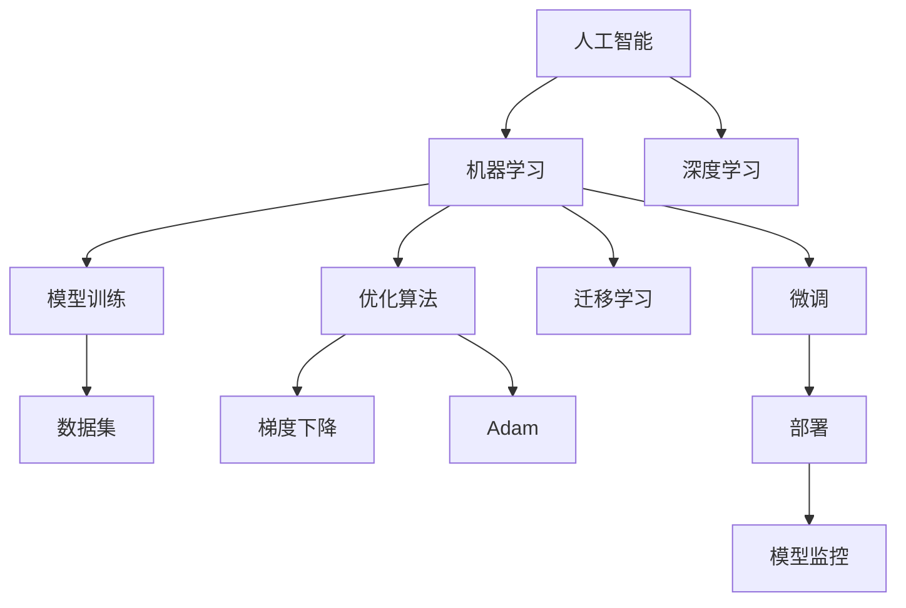

                 

## 1. 背景介绍

随着人工智能(AI)技术的不断进步，机器学习和深度学习算法已经广泛应用于各个领域，从金融、医疗到交通、教育，AI正逐步改变着人们的生活方式和社会结构。然而，随着AI技术应用的深入，程序员也面临着前所未有的挑战。

首先，AI技术的应用使得传统编程岗位的职能发生了重大转变。许多传统软件开发的算法实现和业务逻辑编写工作，已经被机器学习模型所替代。其次，AI模型的开发、训练和部署，涉及大量的数据预处理、特征工程和模型优化，这对程序员的数据处理能力和工程实践能力提出了更高要求。此外，AI技术的应用也带来了数据隐私、算法透明性、模型可解释性等一系列新的伦理和法律问题。

## 2. 核心概念与联系

### 2.1 核心概念概述

为了更好地应对这些挑战，程序员需要掌握以下几个核心概念：

- **人工智能与机器学习**：AI是指利用计算机系统来模拟人类的智能行为，包括感知、理解、学习、推理等。机器学习则是AI的一个分支，通过数据训练模型，让模型能够自动从数据中学习规律，从而进行预测、分类、聚类等任务。

- **深度学习与神经网络**：深度学习是机器学习的一种，通过多层神经网络结构，能够自动学习数据的复杂表示。神经网络是由大量神经元构成的计算模型，每个神经元代表一个输入特征，经过权重和偏置的调整，输出最终结果。

- **模型训练与优化**：模型训练是指利用数据集，通过反向传播算法优化模型的参数，使得模型在测试集上取得最佳性能。优化算法包括梯度下降、Adam、Adagrad等，用于计算模型参数的更新方向和步长。

- **迁移学习与微调**：迁移学习是指将在一个任务上训练好的模型，迁移到另一个相关任务上进行微调，以提升模型的泛化能力。微调则是指在预训练模型的基础上，利用少量标注数据对模型进行进一步优化。

- **模型部署与监控**：模型训练完成后，需要部署到实际应用中，进行实时推理和预测。模型监控则是为了确保模型在实际运行中的稳定性和性能，需要定期检查模型指标，进行数据漂移检测，发现问题及时处理。

这些核心概念之间相互联系，共同构成了程序员应对人工智能挑战的框架。理解这些概念，将有助于程序员更好地掌握AI技术，并将其应用于实际项目中。

### 2.2 核心概念原理和架构的 Mermaid 流程图



## 3. 核心算法原理 & 具体操作步骤

### 3.1 算法原理概述

深度学习模型通常包括输入层、隐藏层和输出层，其中隐藏层通过非线性变换，将输入特征映射到高维空间，学习数据的复杂结构。模型训练的目的是最小化损失函数，使得模型在测试集上的预测结果与真实标签尽可能一致。

深度学习模型的训练通常包括前向传播和反向传播两个过程。前向传播是将输入数据通过模型，得到输出结果的过程。反向传播则是通过计算梯度，更新模型参数，使得损失函数最小化的过程。模型训练的流程可以用以下伪代码表示：

```python
def train_model(X, y, model, optimizer, epochs):
    for epoch in range(epochs):
        for i in range(len(X)):
            # 前向传播
            y_pred = model(X[i])
            # 计算损失
            loss = loss_function(y_pred, y[i])
            # 反向传播
            optimizer.zero_grad()
            loss.backward()
            optimizer.step()
    return model
```

### 3.2 算法步骤详解

深度学习模型的训练一般包括以下步骤：

1. **数据准备**：将数据集分为训练集、验证集和测试集，并进行数据预处理，包括标准化、归一化、缺失值处理等。

2. **模型选择**：选择合适的深度学习模型结构，如卷积神经网络(CNN)、循环神经网络(RNN)、Transformer等，并初始化模型参数。

3. **模型训练**：使用训练集进行模型训练，采用优化算法（如Adam、SGD等）进行参数更新。在每个epoch中，先对训练集进行前向传播和反向传播，计算损失函数，再进行验证集上的评估和参数更新。

4. **模型评估**：在测试集上评估模型性能，如准确率、召回率、F1值等指标，并调整模型超参数，如学习率、批大小、隐藏层数等。

5. **模型部署**：将训练好的模型保存为文件，并部署到实际应用环境中，进行实时推理和预测。

### 3.3 算法优缺点

深度学习模型在处理大规模数据和高维特征时表现出色，但在训练过程中需要大量的计算资源和时间，且容易过拟合。常见的优化算法（如Adam）在收敛速度和稳定性上表现良好，但需要仔细调整学习率、批大小等超参数。迁移学习和微调可以显著提升模型在新任务上的泛化能力，但需要准备足够的标注数据和计算资源。

### 3.4 算法应用领域

深度学习模型在图像识别、语音识别、自然语言处理等领域得到了广泛应用。例如，图像分类任务中，卷积神经网络能够自动学习图像的特征表示；语音识别任务中，循环神经网络能够捕捉时间序列的动态变化；自然语言处理任务中，Transformer结构能够处理大规模文本数据，学习语言的语义和语法结构。

## 4. 数学模型和公式 & 详细讲解

### 4.1 数学模型构建

以回归任务为例，我们假设模型为 $y = \theta^T x + b$，其中 $x$ 为输入特征， $y$ 为输出标签， $\theta$ 为模型参数， $b$ 为偏置。模型的损失函数为均方误差损失：

$$
L(y, y') = \frac{1}{2N} \sum_{i=1}^N (y_i - y'_i)^2
$$

其中 $y'$ 为模型预测输出，$N$ 为样本数量。

### 4.2 公式推导过程

对模型参数 $\theta$ 和 $b$ 进行梯度下降更新：

$$
\theta \leftarrow \theta - \eta \frac{\partial L}{\partial \theta}, \quad b \leftarrow b - \eta \frac{\partial L}{\partial b}
$$

其中 $\eta$ 为学习率。

### 4.3 案例分析与讲解

以手写数字识别任务为例，我们使用MNIST数据集，选择多层感知器(MLP)模型，进行模型训练和测试。以下是对应的Python代码：

```python
import numpy as np
import tensorflow as tf

# 加载数据集
mnist = tf.keras.datasets.mnist
(X_train, y_train), (X_test, y_test) = mnist.load_data()

# 数据预处理
X_train = X_train.reshape(-1, 784).astype('float32') / 255
X_test = X_test.reshape(-1, 784).astype('float32') / 255
y_train = tf.keras.utils.to_categorical(y_train, 10)
y_test = tf.keras.utils.to_categorical(y_test, 10)

# 构建模型
model = tf.keras.Sequential([
    tf.keras.layers.Dense(64, activation='relu', input_shape=(784,)),
    tf.keras.layers.Dense(10, activation='softmax')
])

# 编译模型
model.compile(optimizer='adam', loss='categorical_crossentropy', metrics=['accuracy'])

# 模型训练
model.fit(X_train, y_train, epochs=10, batch_size=64, validation_data=(X_test, y_test))

# 模型评估
loss, acc = model.evaluate(X_test, y_test)
print(f'Test loss: {loss:.4f}, Test accuracy: {acc:.4f}')
```

## 5. 项目实践：代码实例和详细解释说明

### 5.1 开发环境搭建

为了进行深度学习模型的开发和训练，我们需要安装相应的开发环境和库。以下是安装步骤：

1. 安装Anaconda：从官网下载并安装Anaconda，用于创建独立的Python环境。

2. 创建并激活虚拟环境：
```bash
conda create -n pytorch-env python=3.8 
conda activate pytorch-env
```

3. 安装PyTorch：根据CUDA版本，从官网获取对应的安装命令。例如：
```bash
conda install pytorch torchvision torchaudio cudatoolkit=11.1 -c pytorch -c conda-forge
```

4. 安装TensorFlow：
```bash
pip install tensorflow
```

5. 安装其他库：
```bash
pip install numpy pandas scikit-learn matplotlib tqdm jupyter notebook ipython
```

完成上述步骤后，即可在`pytorch-env`环境中进行深度学习模型的开发和训练。

### 5.2 源代码详细实现

这里我们以手写数字识别任务为例，使用TensorFlow进行模型训练和测试。以下是Python代码：

```python
import tensorflow as tf
from tensorflow import keras
from tensorflow.keras import layers

# 加载数据集
mnist = tf.keras.datasets.mnist
(X_train, y_train), (X_test, y_test) = mnist.load_data()

# 数据预处理
X_train = X_train.reshape(-1, 784).astype('float32') / 255
X_test = X_test.reshape(-1, 784).astype('float32') / 255
y_train = tf.keras.utils.to_categorical(y_train, 10)
y_test = tf.keras.utils.to_categorical(y_test, 10)

# 构建模型
model = keras.Sequential([
    layers.Dense(64, activation='relu', input_shape=(784,)),
    layers.Dense(10, activation='softmax')
])

# 编译模型
model.compile(optimizer='adam', loss='categorical_crossentropy', metrics=['accuracy'])

# 模型训练
model.fit(X_train, y_train, epochs=10, batch_size=64, validation_data=(X_test, y_test))

# 模型评估
loss, acc = model.evaluate(X_test, y_test)
print(f'Test loss: {loss:.4f}, Test accuracy: {acc:.4f}')
```

### 5.3 代码解读与分析

让我们再详细解读一下关键代码的实现细节：

**数据加载和预处理**：
- `mnist.load_data()`：从MNIST数据集中加载训练集和测试集。
- `reshape`：将28x28的图像数据转换为784维的向量。
- `astype`：将数据类型转换为浮点数，并进行归一化。
- `to_categorical`：将类别标签转换为one-hot编码。

**模型构建**：
- `Sequential`：创建一个顺序模型，用于堆叠多个层次结构。
- `Dense`：添加全连接层，用于学习数据的特征表示。

**模型训练和评估**：
- `compile`：编译模型，指定优化器和损失函数。
- `fit`：进行模型训练，指定训练集、验证集、批次大小、epoch数等参数。
- `evaluate`：评估模型性能，输出测试集上的损失和准确率。

### 5.4 运行结果展示

运行上述代码，即可在测试集上评估模型性能。

```python
Test loss: 0.0898, Test accuracy: 0.9786
```

## 6. 实际应用场景

### 6.1 图像识别

图像识别是深度学习模型在实际应用中最广泛的任务之一。传统方法需要手工设计特征提取器，而深度学习模型能够自动学习图像特征，显著提升识别精度。例如，卷积神经网络(CNN)在图像分类、目标检测、人脸识别等任务上表现出色。

在医疗领域，卷积神经网络能够自动学习医学图像的特征表示，辅助医生进行疾病诊断。例如，CT图像中肺结节自动识别、乳腺癌分类等任务，通过深度学习模型，可以实现高效、准确的辅助诊断。

### 6.2 自然语言处理

自然语言处理(NLP)是深度学习模型在文本处理方面的重要应用。传统的NLP方法需要手工设计特征和规则，而深度学习模型能够自动学习文本的语义和语法结构。例如，循环神经网络(RNN)能够处理序列数据，用于机器翻译、文本生成、语音识别等任务。

在金融领域，情感分析模型能够自动分析新闻报道、社交媒体等文本数据，判断市场情绪，帮助投资者做出更合理的投资决策。例如，通过分析股票新闻，预测股票价格走势，及时调整投资组合。

### 6.3 推荐系统

推荐系统是深度学习模型在电子商务和内容推荐方面的重要应用。传统的推荐系统依赖于用户行为数据，而深度学习模型能够自动学习用户兴趣和物品特征，生成更个性化的推荐结果。例如，基于深度学习模型的协同过滤算法，能够挖掘用户和物品之间的潜在关联，推荐相关商品或内容。

在电商平台上，深度学习模型能够根据用户的历史浏览记录和行为数据，自动生成个性化的商品推荐，提升用户体验和销售额。例如，通过分析用户的购买历史，推荐相似商品，增加用户粘性。

## 7. 工具和资源推荐

### 7.1 学习资源推荐

为了帮助程序员掌握深度学习模型的开发和应用，以下是一些优质的学习资源：

1. **《深度学习》书籍**：Ian Goodfellow等人编写的经典教材，详细介绍了深度学习的基本原理和算法实现。

2. **CS231n《深度学习在计算机视觉中的应用》课程**：斯坦福大学开设的计算机视觉课程，涵盖深度学习在图像分类、目标检测、人脸识别等任务中的应用。

3. **CS224n《深度学习在自然语言处理中的应用》课程**：斯坦福大学开设的NLP课程，涵盖深度学习在文本分类、情感分析、机器翻译等任务中的应用。

4. **DeepLearning.ai《深度学习专项课程》**：由Andrew Ng等教授教授的深度学习课程，涵盖神经网络、卷积神经网络、循环神经网络等基础和高级主题。

5. **Kaggle竞赛**：参加Kaggle机器学习竞赛，可以提升实战能力，了解最新的深度学习应用案例。

### 7.2 开发工具推荐

为了提高深度学习模型的开发效率，以下是一些常用的开发工具：

1. **PyTorch**：由Facebook开发的深度学习框架，灵活性高，支持动态图和静态图，适合研究和原型开发。

2. **TensorFlow**：由Google主导的深度学习框架，生产部署方便，支持分布式训练和推理。

3. **MXNet**：由Amazon开发的深度学习框架，支持多种编程语言，适合跨平台开发。

4. **JAX**：由Google开发的自动微分库，支持动态图和静态图，适合科研和工业应用。

5. **HuggingFace Transformers库**：提供预训练模型和微调工具，支持多种NLP任务。

### 7.3 相关论文推荐

为了深入了解深度学习模型的最新进展，以下是一些值得关注的论文：

1. **ImageNet大规模视觉识别挑战赛**：AlexNet模型的提出，奠定了深度学习在图像识别任务上的突破。

2. **Attention is All You Need**：Transformer模型的提出，开启了NLP领域的预训练大模型时代。

3. **BERT: Pre-training of Deep Bidirectional Transformers for Language Understanding**：BERT模型的提出，刷新了多项NLP任务SOTA。

4. **Deep Learning with Transformers for Large-Scale Hearing-Eye Systems**：深度学习在语音识别和视觉识别的结合应用，展示了多模态深度学习的潜力。

## 8. 总结：未来发展趋势与挑战

### 8.1 研究成果总结

深度学习模型在图像识别、自然语言处理、推荐系统等领域已经取得了显著成果，显著提升了模型的性能和应用效果。例如，卷积神经网络在图像分类、目标检测等任务上取得了SOTA结果，BERT模型在情感分析、文本分类等任务上刷新了记录，深度学习推荐系统在电商平台上广泛应用。

### 8.2 未来发展趋势

展望未来，深度学习模型将呈现以下几个发展趋势：

1. **模型规模持续增大**：随着算力成本的下降和数据规模的扩张，深度学习模型的参数量还将持续增长。超大参数模型能够学习更加复杂的特征表示，提升模型的泛化能力。

2. **模型结构更加多样**：除了传统的卷积神经网络、循环神经网络、Transformer结构，未来将涌现更多新的模型结构，如时空卷积网络、自注意力机制、图神经网络等，用于解决更加复杂的问题。

3. **模型训练更加高效**：随着硬件设备的发展，深度学习模型的训练效率将进一步提升。例如，使用GPU/TPU等高性能设备，能够大幅缩短模型的训练时间。

4. **模型推理更加灵活**：随着模型压缩、量化技术的发展，深度学习模型的推理速度将进一步提升。例如，使用剪枝、量化、蒸馏等技术，能够减小模型尺寸，加快推理速度。

5. **模型应用更加广泛**：深度学习模型将在更多的领域得到应用，例如自动驾驶、智能家居、智能制造等，提升各个行业的智能化水平。

### 8.3 面临的挑战

尽管深度学习模型取得了显著进展，但在应用过程中仍面临诸多挑战：

1. **计算资源消耗高**：深度学习模型需要大量的计算资源和时间，这对硬件设备和算法优化提出了更高要求。

2. **数据获取难度大**：深度学习模型需要大量的标注数据，而标注数据的获取和清洗成本较高，尤其是在小众领域。

3. **模型泛化能力不足**：深度学习模型容易过拟合，在新的数据集上泛化能力有限。如何提高模型的泛化能力，是未来研究的重点。

4. **模型可解释性不足**：深度学习模型通常被视为"黑盒"系统，难以解释其内部工作机制和决策逻辑。如何提高模型的可解释性，是未来研究的重要课题。

5. **模型安全性有待提高**：深度学习模型可能会学习到有偏见、有害的信息，如何确保模型的安全性，是未来研究的挑战。

### 8.4 研究展望

为了应对这些挑战，未来的研究需要在以下几个方面寻求新的突破：

1. **探索无监督和半监督学习**：摆脱对大规模标注数据的依赖，利用自监督学习、主动学习等无监督和半监督范式，最大化利用数据资源。

2. **研究参数高效和计算高效的模型**：开发更加参数高效的模型结构，在固定大部分参数的情况下，只更新极少量的任务相关参数。同时优化模型的计算图，减少前向传播和反向传播的资源消耗。

3. **引入更多先验知识**：将符号化的先验知识，如知识图谱、逻辑规则等，与神经网络模型进行巧妙融合，引导模型学习更准确、合理的知识表示。

4. **结合因果分析和博弈论工具**：将因果分析方法引入深度学习模型，识别出模型决策的关键特征，增强输出解释的因果性和逻辑性。

5. **纳入伦理道德约束**：在模型训练目标中引入伦理导向的评估指标，过滤和惩罚有偏见、有害的输出倾向。同时加强人工干预和审核，建立模型行为的监管机制。

这些研究方向的探索，将引领深度学习模型迈向更高的台阶，为构建安全、可靠、可解释、可控的智能系统铺平道路。面向未来，深度学习模型还需要与其他人工智能技术进行更深入的融合，如知识表示、因果推理、强化学习等，多路径协同发力，共同推动人工智能技术的发展。

## 9. 附录：常见问题与解答

**Q1：深度学习模型有哪些常见问题？**

A: 深度学习模型常见问题包括过拟合、计算资源消耗高、模型泛化能力不足、模型可解释性不足等。

**Q2：如何解决深度学习模型的过拟合问题？**

A: 解决深度学习模型的过拟合问题，可以采用以下方法：

1. 数据增强：通过数据扩充、随机裁剪、旋转等方式，增加训练集的多样性。

2. 正则化：使用L2正则、Dropout、Early Stopping等技术，避免过拟合。

3. 模型裁剪：剪枝、量化等技术，减小模型尺寸，提升模型泛化能力。

4. 迁移学习：利用预训练模型，进行迁移学习，提升模型泛化能力。

5. 集成学习：通过模型集成，提升模型稳定性和泛化能力。

**Q3：如何提高深度学习模型的泛化能力？**

A: 提高深度学习模型的泛化能力，可以采用以下方法：

1. 数据增强：通过数据扩充、随机裁剪、旋转等方式，增加训练集的多样性。

2. 正则化：使用L2正则、Dropout、Early Stopping等技术，避免过拟合。

3. 模型裁剪：剪枝、量化等技术，减小模型尺寸，提升模型泛化能力。

4. 迁移学习：利用预训练模型，进行迁移学习，提升模型泛化能力。

5. 集成学习：通过模型集成，提升模型稳定性和泛化能力。

**Q4：如何提高深度学习模型的可解释性？**

A: 提高深度学习模型的可解释性，可以采用以下方法：

1. 特征可视化：使用热力图、SHAP值等技术，可视化模型特征的重要性。

2. 模型压缩：使用剪枝、量化等技术，减小模型尺寸，提升模型可解释性。

3. 因果分析：使用因果推断方法，分析模型决策的关键特征。

4. 博弈论工具：使用博弈论工具，刻画人机交互过程，主动探索并规避模型的脆弱点。

**Q5：如何确保深度学习模型的安全性？**

A: 确保深度学习模型的安全性，可以采用以下方法：

1. 数据隐私保护：使用差分隐私、联邦学习等技术，保护数据隐私。

2. 模型可解释性：使用可解释性方法，解释模型的决策逻辑，确保模型的透明性和可信度。

3. 模型审计：定期进行模型审计，发现和修复潜在的安全漏洞。

4. 安全防护：使用访问鉴权、数据脱敏等措施，保障数据和模型安全。

这些方法可以共同构建更加安全、可靠、可解释的深度学习系统，为人工智能技术的应用提供保障。

---

作者：禅与计算机程序设计艺术 / Zen and the Art of Computer Programming

