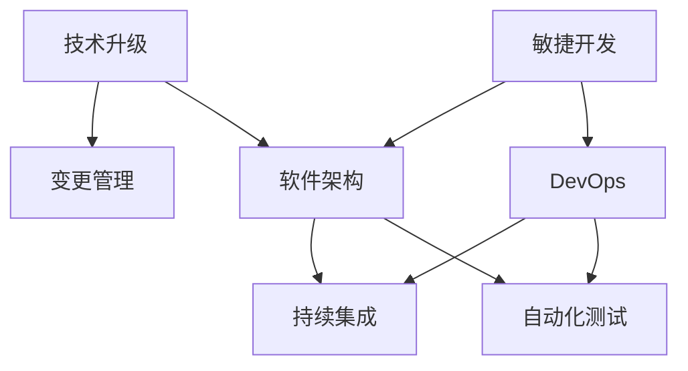

                 

# 程序员如何应对技术升级与变更

> 关键词：技术升级，变更管理，软件架构，敏捷开发，DevOps，持续集成，自动化测试

## 1. 背景介绍

在快速发展的IT行业中，技术升级与变更几乎是不可避免的。新技术、新工具、新框架的出现，要求程序员不断学习和适应。然而，技术升级与变更并非总是平滑的。技术堆栈的变化、项目需求的重组、团队协作的调整，都可能给项目带来影响。本文将从程序员的角度出发，探讨如何应对技术升级与变更，以保障项目的顺利进行和团队的高效协作。

## 2. 核心概念与联系

### 2.1 核心概念概述

要有效应对技术升级与变更，首先需要理解以下几个核心概念：

- **技术升级（Technology Upgrade）**：指在项目开发过程中引入新工具、新框架或新技术，以提升项目性能、安全性或可维护性的过程。
- **变更管理（Change Management）**：指在技术升级过程中，通过制定计划、沟通协调和风险控制等措施，确保变更顺利实施的过程。
- **软件架构（Software Architecture）**：指设计和管理软件系统结构的框架，包括系统的模块划分、组件交互和数据流等。良好的软件架构是技术升级和变更的基础。
- **敏捷开发（Agile Development）**：一种迭代的、增量的软件开发方法，强调快速响应变化、持续交付和客户反馈。敏捷开发能够帮助团队适应技术升级和变更。
- **DevOps（Development and Operations）**：结合开发（Development）和运维（Operations）的实践，通过自动化和持续集成（CI）/持续部署（CD）等手段，提升软件的交付效率和质量。
- **持续集成（Continuous Integration, CI）**：一种软件开发实践，通过自动化构建、测试和部署，实现快速迭代和高质量交付。
- **自动化测试（Automated Testing）**：使用自动化工具和框架，对软件进行测试，以确保代码质量、性能和稳定性。

这些概念之间的逻辑关系可以通过以下Mermaid流程图来展示：



这个流程图展示了大语言模型的核心概念及其之间的关系：

1. 技术升级是变更管理的前提。
2. 软件架构是技术升级的基础。
3. 敏捷开发和DevOps是技术升级的工具。
4. 持续集成和自动化测试是技术升级的保障。

理解这些概念，可以帮助程序员系统地应对技术升级与变更。

## 3. 核心算法原理 & 具体操作步骤

### 3.1 算法原理概述

技术升级与变更的核心在于系统的重构和迭代。这里介绍一种基于模块化的重构策略，该策略基于软件架构和敏捷开发的原则，通过以下步骤进行技术升级与变更管理：

1. **需求分析**：明确技术升级的目标和需求，确保团队成员对变更目标有清晰的理解。
2. **重构规划**：制定重构计划，包括功能拆分、模块调整和接口设计等。
3. **敏捷迭代**：采用敏捷开发方法，将重构任务分解为多个小迭代，逐步实施变更。
4. **持续集成**：使用持续集成工具，自动化构建和测试，确保每次迭代的质量。
5. **自动化测试**：通过自动化测试，验证新模块的正确性，减少人为错误。
6. **DevOps实践**：通过DevOps实践，实现快速部署和持续交付，提升团队协作效率。

### 3.2 算法步骤详解

以一个典型的技术升级场景为例，说明具体的操作步骤：

**Step 1: 需求分析**

- 确定技术升级的目标，如提升系统性能、增加新功能或优化用户体验。
- 调研现有技术栈和工具，了解升级所需的资源和条件。
- 召开需求评审会，确保所有相关方对变更目标有共识。

**Step 2: 重构规划**

- 分析现有代码结构，识别出需要重构或优化的模块。
- 设计新的模块结构，确保模块之间的高内聚和低耦合。
- 制定接口规范，确保新旧模块之间无缝对接。
- 创建技术文档和代码注释，记录变更细节和注意事项。

**Step 3: 敏捷迭代**

- 将重构任务分解为多个小迭代，每个迭代完成一部分功能。
- 采用敏捷开发方法，每天进行站会，更新任务进度和问题。
- 引入迭代评审，定期验证迭代的成果，确保变更的方向和质量。

**Step 4: 持续集成**

- 使用持续集成工具，如Jenkins、Travis CI等，自动化构建和测试。
- 编写自动化测试脚本，覆盖新模块的所有功能点。
- 定期触发CI流水线，确保每次迭代的新代码都能通过自动化测试。

**Step 5: 自动化测试**

- 使用自动化测试框架，如JUnit、pytest等，编写单元测试、集成测试和功能测试。
- 引入测试覆盖率工具，如 JaCoCo、TestNG等，确保测试覆盖率达标。
- 通过持续集成，自动化运行测试用例，及时发现和解决测试问题。

**Step 6: DevOps实践**

- 引入DevOps工具链，如Docker、Kubernetes等，实现容器化部署和微服务架构。
- 配置自动化部署流程，确保新模块能快速部署和上线。
- 使用监控工具，如Prometheus、Grafana等，实时监控系统性能和健康状态。

### 3.3 算法优缺点

基于模块化的重构策略有以下优点：

1. **可控性高**：将技术升级和变更分解为多个小任务，易于管理。
2. **风险可控**：每次迭代完成一小部分变更，减少整体风险。
3. **反馈及时**：通过持续集成和自动化测试，及时发现和解决问题。
4. **团队协作**：敏捷开发和DevOps实践，增强团队协作效率和响应速度。

同时，该策略也存在以下局限：

1. **学习成本高**：引入新技术和新工具，需要额外的时间和精力。
2. **变更复杂度高**：重构过程可能会影响现有代码，需要细致的规划和执行。
3. **变更难度大**：大规模的技术升级，需要全面的团队支持和资源投入。

尽管如此，基于模块化的重构策略仍然是应对技术升级和变更的有效方法。

### 3.4 算法应用领域

该策略广泛应用于软件开发、系统维护和产品迭代等领域。以下是一些具体的应用场景：

- **Web应用重构**：将旧的Web应用重构为微服务架构，提升系统性能和扩展性。
- **移动应用升级**：引入新的前端框架或后端服务，实现新功能或优化用户体验。
- **大数据平台升级**：采用新的数据处理技术和存储方案，提升数据处理和分析能力。
- **IoT系统重构**：引入物联网设备管理和数据处理技术，提升系统稳定性和可靠性。

## 4. 数学模型和公式 & 详细讲解 & 举例说明

### 4.1 数学模型构建

技术升级与变更管理的过程，可以用以下数学模型来描述：

设技术升级的总工作量为 $W$，每次迭代完成的工作量为 $w$，迭代次数为 $n$。则总工作量 $W$ 可以表示为：

$$ W = n \times w $$

其中 $n$ 为迭代次数，$w$ 为每次迭代完成的工作量。每次迭代完成后，通过持续集成和自动化测试，确保工作量的完成度。设每次迭代的完成度为 $p$，则总工作量的完成度 $P$ 可以表示为：

$$ P = p^n $$

为了提高总工作量的完成度，需要最大化每次迭代的工作量 $w$ 和完成度 $p$。

### 4.2 公式推导过程

根据上述数学模型，我们可以推导出以下几个关键公式：

- **迭代次数计算公式**：
$$ n = \frac{W}{w} $$
- **总工作量完成度计算公式**：
$$ P = p^n $$

通过上述公式，可以计算出需要进行多少次迭代，以及每次迭代需要完成的工作量，从而实现技术升级和变更管理的目标。

### 4.3 案例分析与讲解

假设技术升级的总工作量为 $W=1000$，每次迭代完成的工作量为 $w=100$，设每次迭代的完成度 $p=0.9$，则需要进行 $n=\frac{1000}{100}=10$ 次迭代，每次迭代需要完成的工作量为 $w=\frac{1000}{10}=100$。

通过上述案例，可以看到，通过合理的迭代规划和持续集成，可以高效完成技术升级和变更管理。

## 5. 项目实践：代码实例和详细解释说明

### 5.1 开发环境搭建

以下是使用Python和Jenkins进行持续集成的开发环境搭建步骤：

1. **安装Python和Jenkins**：
   ```bash
   sudo apt-get install python3
   sudo apt-get install jenkins
   ```

2. **配置Jenkins**：
   - 下载并解压Jenkins安装文件。
   - 运行安装脚本 `sudo /path/to/jenkins/installation.sh`
   - 使用 `sudo systemctl start jenkins` 启动Jenkins服务。
   - 访问 `http://localhost:8080` 配置Jenkins，包括插件安装、管理员密码设置等。

3. **安装Python依赖**：
   ```bash
   pip install numpy pandas scikit-learn
   ```

### 5.2 源代码详细实现

以下是一个简单的Python项目示例，展示了如何使用Jenkins进行持续集成和自动化测试：

```python
import numpy as np
from sklearn.linear_model import LinearRegression

# 数据生成
x = np.random.rand(100, 1)
y = 2 * x + np.random.rand(100, 1)

# 模型训练
model = LinearRegression()
model.fit(x, y)

# 模型评估
y_pred = model.predict(x)
mse = np.mean((y_pred - y) ** 2)
print(f"Mean Squared Error: {mse:.3f}")
```

**Jenkins配置**：

1. **创建Jenkins Job**：
   - 在Jenkins控制台中，点击“New Item”按钮。
   - 输入项目名称，选择“Freestyle project”，点击“OK”。

2. **配置构建步骤**：
   - 在“Source Code Management”部分，选择“Git”，输入Git仓库地址。
   - 在“Build Triggers”部分，选择“SCM polling”，设置轮询时间。
   - 在“Build”部分，添加构建步骤，使用Python脚本进行模型训练和评估。

3. **配置测试步骤**：
   - 在“Post-build Actions”部分，添加“Archive the artifacts”，保存模型文件。
   - 添加“Archive the artifacts”，保存测试报告。

4. **保存并运行Job**：
   - 保存配置后，点击“Apply”按钮，然后点击“Build Now”按钮运行Job。

### 5.3 代码解读与分析

**Jenkins构建步骤**：
- 使用 `git clone` 命令从Git仓库拉取代码。
- 使用 `python build.py` 命令运行Python脚本，执行模型训练和评估。
- 生成测试报告，保存为 HTML 文件。

**Jenkins测试步骤**：
- 使用 `python test.py` 命令运行测试脚本，执行单元测试。
- 使用 `python test.py --coverage` 命令生成测试覆盖率报告，保存为 HTML 文件。

通过上述代码和Jenkins配置，可以高效地进行模型训练、测试和部署，确保每次迭代的质量和稳定性。

### 5.4 运行结果展示

运行Jenkins Job后，可以通过Jenkins控制台查看构建和测试结果。在构建结果中，可以查看模型训练和评估的输出，确认每次迭代的效果。在测试结果中，可以查看测试用例的执行情况和覆盖率报告，确保代码的正确性和完整性。

## 6. 实际应用场景

### 6.4 未来应用展望

技术升级与变更管理的未来趋势包括以下几个方面：

1. **云原生技术的应用**：云计算和大数据技术的应用，将进一步提升技术升级和变更管理的效率和灵活性。
2. **人工智能和机器学习的应用**：通过AI技术进行需求分析、重构规划和质量评估，提升变更管理的智能化水平。
3. **DevOps文化的普及**：DevOps文化的普及将进一步提升团队协作效率，缩短技术升级和变更的周期。
4. **微服务架构的推广**：微服务架构的推广将使技术升级和变更更加灵活和可控。
5. **持续学习与技能提升**：程序员需要持续学习新技术和新工具，提升自身的技术能力和职业竞争力。

## 7. 工具和资源推荐

### 7.1 学习资源推荐

1. **《Clean Code: A Handbook of Agile Software Craftsmanship》**：Robert C. Martin著，介绍如何编写干净、可维护的代码，提升代码质量和重构技巧。
2. **《The Pragmatic Programmer》**：Andrew Hunt & David Thomas著，提供编程技巧、代码风格和团队协作等方面的实用建议。
3. **《Test-Driven Development: By Example》**：Kent Beck著，介绍测试驱动开发（TDD）的基本理念和实践。
4. **《Continuous Delivery: Reliable Software Releases through Build, Test, and Deploy Automation》**：Jez Humble & David Farley著，讲解持续集成和持续部署的实现方法。
5. **《The DevOps Handbook》**：Patrick Debois & John Willis著，涵盖DevOps的全面实践，包括工具链、流程和最佳实践。

### 7.2 开发工具推荐

1. **Git**：版本控制系统，广泛用于代码管理和协作。
2. **Jenkins**：持续集成和自动化部署工具，支持多种编程语言和构建脚本。
3. **JIRA**：项目管理和协作工具，支持敏捷开发和变更管理。
4. **SonarQube**：代码质量管理工具，自动检测代码中的缺陷和漏洞。
5. **Docker**：容器化平台，支持应用程序的打包、分发和部署。

### 7.3 相关论文推荐

1. **《Refactoring: Improving the Design of Existing Code》**：Martin Fowler著，介绍重构的基本概念和具体技巧。
2. **《Agile Software Development: Principles, Patterns, and Practices》**：Robert C. Martin著，介绍敏捷开发的核心原则和实践。
3. **《Continuous Delivery: Reliable Software Releases through Build, Test, and Deploy Automation》**：Jez Humble & David Farley著，讲解持续集成和持续部署的实现方法。
4. **《The DevOps Handbook》**：Patrick Debois & John Willis著，涵盖DevOps的全面实践，包括工具链、流程和最佳实践。

## 8. 总结：未来发展趋势与挑战

### 8.1 研究成果总结

本文从程序员的角度，探讨了如何应对技术升级与变更。主要内容包括：

1. **核心概念的介绍**：技术升级、变更管理、软件架构、敏捷开发、DevOps、持续集成和自动化测试。
2. **核心算法的介绍**：基于模块化的重构策略，包括需求分析、重构规划、敏捷迭代、持续集成、自动化测试和DevOps实践。
3. **数学模型的构建**：迭代次数和总工作量的计算公式，以及推导过程。

通过这些内容的介绍，读者可以系统地了解技术升级和变更管理的流程和工具。

### 8.2 未来发展趋势

技术升级与变更管理的未来趋势包括：

1. **云原生技术的普及**：云计算和大数据技术的应用，将进一步提升技术升级和变更管理的效率和灵活性。
2. **AI技术的应用**：通过AI技术进行需求分析、重构规划和质量评估，提升变更管理的智能化水平。
3. **DevOps文化的普及**：DevOps文化的普及将进一步提升团队协作效率，缩短技术升级和变更的周期。
4. **微服务架构的推广**：微服务架构的推广将使技术升级和变更更加灵活和可控。
5. **持续学习与技能提升**：程序员需要持续学习新技术和新工具，提升自身的技术能力和职业竞争力。

### 8.3 面临的挑战

尽管技术升级与变更管理有诸多优势，但在实际操作中仍面临以下挑战：

1. **学习成本高**：引入新技术和新工具，需要额外的时间和精力。
2. **变更复杂度高**：重构过程可能会影响现有代码，需要细致的规划和执行。
3. **变更难度大**：大规模的技术升级，需要全面的团队支持和资源投入。

### 8.4 研究展望

未来研究应从以下几个方面进行突破：

1. **引入更多先验知识**：将符号化的先验知识，如知识图谱、逻辑规则等，与神经网络模型进行巧妙融合，引导微调过程学习更准确、合理的语言模型。
2. **引入因果分析和博弈论工具**：将因果分析方法引入微调模型，识别出模型决策的关键特征，增强输出解释的因果性和逻辑性。借助博弈论工具刻画人机交互过程，主动探索并规避模型的脆弱点，提高系统稳定性。
3. **纳入伦理道德约束**：在模型训练目标中引入伦理导向的评估指标，过滤和惩罚有偏见、有害的输出倾向。同时加强人工干预和审核，建立模型行为的监管机制，确保输出符合人类价值观和伦理道德。

这些研究方向的探索，将引领技术升级与变更管理技术迈向更高的台阶，为构建安全、可靠、可解释、可控的智能系统铺平道路。面向未来，技术升级与变更管理技术还需要与其他人工智能技术进行更深入的融合，如知识表示、因果推理、强化学习等，多路径协同发力，共同推动自然语言理解和智能交互系统的进步。只有勇于创新、敢于突破，才能不断拓展语言模型的边界，让智能技术更好地造福人类社会。

---

作者：禅与计算机程序设计艺术 / Zen and the Art of Computer Programming

