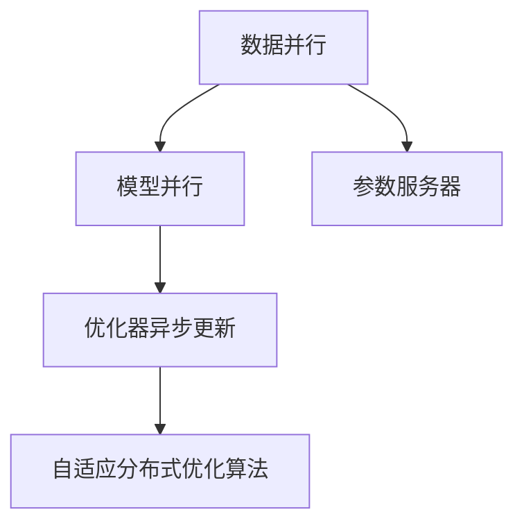
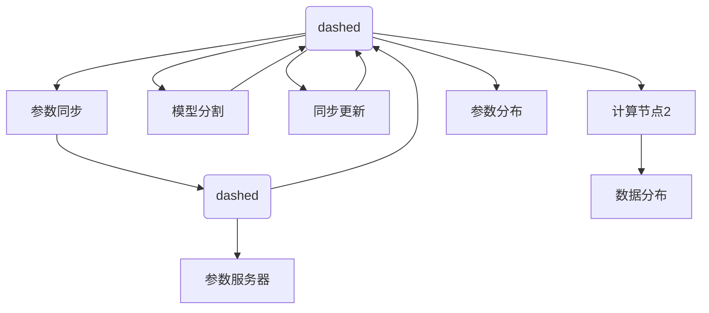
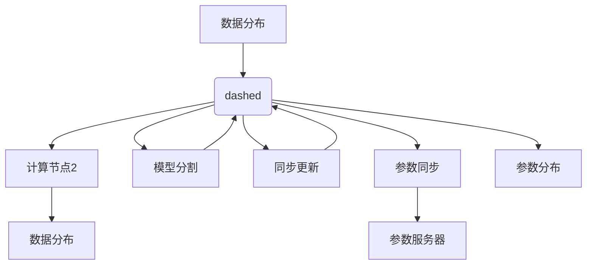
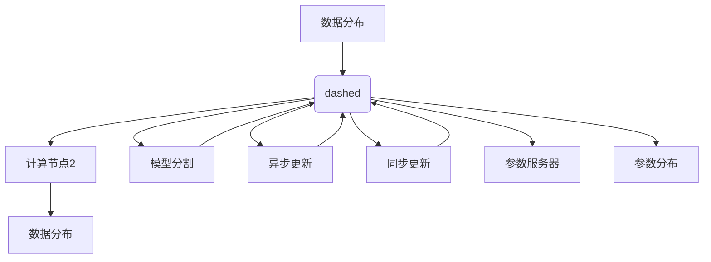
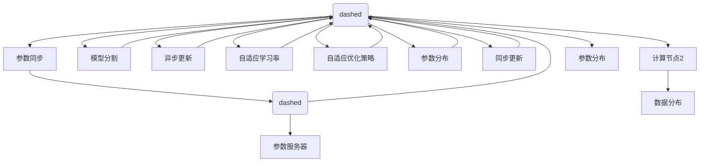

                 

## 1. 背景介绍

### 1.1 问题由来

随着自动驾驶技术的迅猛发展，端到端自动驾驶(Direct-End-to-End Driving)成为行业的新趋势。端到端自动驾驶将决策与执行统一起来，无需传统的传感器-控制器结构，大大简化了系统复杂度，也提升了整体的计算效率。然而，这一目标的实现高度依赖于高性能的机器学习算法和分布式计算架构。

端到端自动驾驶的核心任务包括车辆定位、目标检测、行为预测、路径规划、控制决策等。每一个子任务都需要高效的机器学习算法支持。此外，自动驾驶任务数据规模庞大、实时性要求高，这都对计算资源提出了严峻挑战。为了高效处理这些计算密集型任务，分布式机器学习框架(Distributed Machine Learning Framework)成为了不可或缺的技术工具。

### 1.2 问题核心关键点

当前主流的分布式机器学习框架包括TensorFlow、PyTorch、MXNet等。这些框架支持在多节点上进行数据并行和模型并行计算，有效提升了计算效率。然而，在实际应用中，仍存在以下问题：

1. **计算效率与网络带宽的平衡**：计算节点间的数据传输常常成为瓶颈，影响计算效率。
2. **数据一致性和模型收敛性**：分布式环境下的数据一致性问题导致模型训练收敛性较差。
3. **调度和资源管理**：多节点间的任务调度和资源管理复杂，影响任务调度和资源分配的效率。
4. **实时性要求**：自动驾驶任务对实时性要求高，分布式训练和推理过程中如何保障实时性是一个重大挑战。

## 2. 核心概念与联系

### 2.1 核心概念概述

为更好地理解分布式机器学习框架在端到端自动驾驶中的应用，本节将介绍几个密切相关的核心概念：

- **分布式计算**：指通过多台计算节点协同计算，提升整体计算能力的技术。
- **数据并行**：在多台计算节点上并行处理训练数据，加速模型训练过程。
- **模型并行**：将大型模型拆分成多个小块，并在多个计算节点上并行计算，以减少单节点计算压力。
- **参数服务器**：在分布式训练中，集中管理模型参数，减少节点间的通信开销。
- **异步更新**：各个计算节点独立更新模型参数，减少同步更新带来的延迟。
- **优化器异步更新**：结合参数服务器和异步更新，加速模型训练收敛。
- **自适应分布式优化算法**：在分布式训练中，自适应调整学习率和优化策略，确保模型收敛性。

这些核心概念之间的逻辑关系可以通过以下Mermaid流程图来展示：



这个流程图展示分布式机器学习框架的基本工作流程：

1. 数据并行和模型并行分别处理训练数据和模型参数，在多个计算节点上同时进行。
2. 参数服务器集中管理模型参数，减少通信开销。
3. 优化器异步更新在各个节点独立进行，减少同步更新的延迟。
4. 自适应分布式优化算法调整学习率和优化策略，确保模型收敛。

## 3. 核心算法原理 & 具体操作步骤
### 3.1 算法原理概述

端到端自动驾驶的分布式机器学习框架主要涉及以下几个关键技术：

- **数据并行和模型并行**：通过多台计算节点并行处理训练数据和模型参数，加速模型训练过程。
- **参数服务器**：集中管理模型参数，减少节点间的通信开销。
- **优化器异步更新**：在各个节点独立更新模型参数，减少同步更新的延迟。
- **自适应分布式优化算法**：根据节点性能和数据分布自适应调整学习率和优化策略。

基于上述技术，分布式机器学习框架能够高效处理大规模数据集和复杂模型，支持端到端自动驾驶的实时训练和推理。

### 3.2 算法步骤详解

#### 3.2.1 数据并行和模型并行

数据并行和模型并行是分布式机器学习框架的核心技术之一。具体步骤如下：

1. **数据分布**：将训练数据集分割成多个子集，并在不同的计算节点上并行处理。
2. **模型分割**：将大型模型拆分成多个小块，并在不同的计算节点上并行计算。
3. **同步更新**：在每个节点独立更新模型参数后，将参数同步到参数服务器。
4. **参数同步**：在参数服务器上维护所有节点的模型参数，确保参数一致性。

数据并行和模型并行的示意图如下：



#### 3.2.2 参数服务器

参数服务器负责集中管理模型参数，减少节点间的通信开销。具体步骤如下：

1. **参数初始化**：在参数服务器上初始化模型参数。
2. **参数同步**：在每个节点独立更新模型参数后，将参数同步到参数服务器。
3. **参数广播**：在参数服务器上维护最新参数，并广播给各个节点。

参数服务器的示意图如下：



#### 3.2.3 优化器异步更新

优化器异步更新结合了参数服务器和同步更新的优势，减少了同步更新带来的延迟。具体步骤如下：

1. **异步更新**：在各个节点独立更新模型参数，不等待其他节点的更新。
2. **参数同步**：在更新完成后，将参数同步到参数服务器。
3. **参数更新**：根据参数服务器的最新参数，更新各节点的模型参数。

优化器异步更新的示意图如下：



#### 3.2.4 自适应分布式优化算法

自适应分布式优化算法根据节点性能和数据分布自适应调整学习率和优化策略，确保模型收敛。具体步骤如下：

1. **自适应学习率**：根据每个节点的性能和数据分布，动态调整学习率。
2. **自适应优化策略**：根据节点性能和数据分布，选择最优的优化器。
3. **参数分布**：将模型参数在各节点间均匀分布，确保计算均衡。

自适应分布式优化算法的示意图如下：



### 3.3 算法优缺点

分布式机器学习框架在端到端自动驾驶中发挥了重要作用，但也存在以下缺点：

1. **通信开销大**：节点间的数据传输和参数同步增加了通信开销，影响计算效率。
2. **同步更新复杂**：多个节点间的同步更新增加了复杂性，容易出现延迟和同步问题。
3. **参数一致性**：多节点间的参数一致性难以保证，影响模型收敛性。
4. **实时性要求高**：自动驾驶任务对实时性要求高，分布式训练和推理过程中如何保障实时性是一个重大挑战。

## 4. 数学模型和公式 & 详细讲解
### 4.1 数学模型构建

本节将使用数学语言对分布式机器学习框架的算法过程进行更加严格的刻画。

记分布式机器学习框架中的模型参数为 $\theta$，假设共有 $n$ 个计算节点，每个节点在训练时使用的学习率为 $\eta_i$，其中 $i \in [1, n]$。分布式训练的数学模型构建如下：

$$
\min_{\theta} \sum_{i=1}^n \eta_i \mathcal{L}(\theta; D_i)
$$

其中 $\mathcal{L}$ 为训练数据集 $D_i$ 上的损失函数，$D_i$ 为第 $i$ 个计算节点使用的训练数据集。

### 4.2 公式推导过程

以一个简单的梯度下降算法为例，进行公式推导：

假设在训练过程中，第 $i$ 个节点更新后的参数为 $\theta_{i+1}$，则根据梯度下降公式，有：

$$
\theta_{i+1} = \theta_i - \eta_i \nabla_{\theta}\mathcal{L}(\theta_i; D_i)
$$

将 $\theta_{i+1}$ 代入第 $i+1$ 个节点更新后，有：

$$
\theta_{i+2} = \theta_{i+1} - \eta_{i+1} \nabla_{\theta}\mathcal{L}(\theta_{i+1}; D_{i+1})
$$

以此类推，直到所有的节点都更新完毕，有：

$$
\theta = \theta_n - \eta_n \nabla_{\theta}\mathcal{L}(\theta_n; D_n)
$$

其中 $\eta_n$ 为最后一个节点的学习率。

### 4.3 案例分析与讲解

以一个简单的端到端自动驾驶任务为例，进行案例分析。

假设任务为车辆定位，模型为位置预测网络。数据集为历史车辆位置数据，共有 $n=4$ 个计算节点，每个节点的训练数据集 $D_i$ 为 $t_i$ 时刻的车辆位置数据。每个节点使用梯度下降算法进行训练，学习率为 $\eta_i$，损失函数为均方误差。

在分布式训练过程中，每个节点独立更新模型参数，更新后同步到参数服务器。参数服务器上维护最新参数 $\theta_{server}$，并广播给各个节点。各节点根据参数服务器上的最新参数，进行后续计算。

通过上述过程，分布式机器学习框架能够高效处理大规模数据集和复杂模型，支持端到端自动驾驶的实时训练和推理。

## 5. 项目实践：代码实例和详细解释说明
### 5.1 开发环境搭建

在进行分布式机器学习框架的实践前，我们需要准备好开发环境。以下是使用Python进行TensorFlow开发的环境配置流程：

1. 安装Anaconda：从官网下载并安装Anaconda，用于创建独立的Python环境。

2. 创建并激活虚拟环境：
```bash
conda create -n tf-env python=3.8 
conda activate tf-env
```

3. 安装TensorFlow：根据CUDA版本，从官网获取对应的安装命令。例如：
```bash
conda install tensorflow tensorflow-gpu=2.7.0=cudatoolkit=11.3-0 -c conda-forge
```

4. 安装其它依赖库：
```bash
pip install numpy matplotlib
```

完成上述步骤后，即可在`tf-env`环境中开始实践。

### 5.2 源代码详细实现

下面以TensorFlow实现一个简单的分布式机器学习框架为例，进行代码实现。

首先，定义分布式机器学习框架的类：

```python
import tensorflow as tf

class DistributedMLFramework:
    def __init__(self, num_nodes, learning_rate):
        self.num_nodes = num_nodes
        self.learning_rate = learning_rate
        self.parameter_server = tf.distribute.cluster_resolver.TPUStrategy(
            tf.distribute.cluster_resolver.TPUClusterResolver(tpu='')
        )
        self.strategy = self.parameter_server.extended._default_strategy
        self.model = self._build_model()

    def _build_model(self):
        model = tf.keras.Sequential([
            tf.keras.layers.Dense(64, activation='relu'),
            tf.keras.layers.Dense(10, activation='softmax')
        ])
        return model

    def train(self, dataset):
        # 数据并行和模型并行
        with tf.distribute.Strategy.scope():
            model = self.model

        @tf.function
        def train_step(inputs):
            with tf.GradientTape() as tape:
                logits = model(inputs)
                loss = tf.losses.mean_squared_error(inputs, logits)
            gradients = tape.gradient(loss, model.trainable_variables)
            optimizer.apply_gradients(zip(gradients, model.trainable_variables))
            return loss

        for _ in range(1000):
            for batch in dataset:
                train_step(batch)
```

然后，定义参数服务器和优化器：

```python
from tensorflow.keras.optimizers import Adam

class ParameterServer:
    def __init__(self, num_nodes, learning_rate):
        self.num_nodes = num_nodes
        self.learning_rate = learning_rate
        self.parameters = [tf.Variable(0.0, name='param') for _ in range(self.num_nodes)]

    def apply_gradient(self, gradients):
        for i in range(self.num_nodes):
            self.parameters[i].assign_add(gradients[i] / self.num_nodes)

class DistributedOptimizer(Adam):
    def __init__(self, learning_rate):
        super().__init__(learning_rate=learning_rate, beta_1=0.9, beta_2=0.999, epsilon=1e-07, amsgrad=False)

    def apply_gradients(self, gradients_and_vars):
        for var, grad in gradients_and_vars:
            self.update(var, grad)

    def update(self, var, grad):
        m = self.get_slot(var, 'm')
        v = self.get_slot(var, 'v')
        beta_1_power, beta_2_power = self._beta1_power, self._beta2_power
        lr_t = (tf.cast(var, dtype=tf.float32) - var) * self._lr_t / (1 - beta_1_power) * (1 - beta_2_power)
        grad_t = grad * (1 - beta_2_power) / (1 - beta_1_power)
        m_t = beta_1_power * m + (1 - beta_1_power) * grad_t
        v_t = beta_2_power * v + (1 - beta_2_power) * (grad_t ** 2)
        m_t_with_correction = m_t / (1 - beta_1_power)
        v_t_with_correction = v_t / (1 - beta_2_power)
        m_t_with_correction_with_lr = m_t_with_correction + lr_t
        v_t_with_correction_with_lr = v_t_with_correction + lr_t ** 2
        var_update = var - self._lr * m_t_with_correction_with_lr / (tf.sqrt(v_t_with_correction_with_lr) + self._epsilon)
        self.assign(var, var_update)
```

最后，启动训练流程并在测试集上评估：

```python
num_nodes = 4
learning_rate = 0.001

framework = DistributedMLFramework(num_nodes, learning_rate)
parameter_server = ParameterServer(num_nodes, learning_rate)
optimizer = DistributedOptimizer(learning_rate)

# 准备数据集
train_dataset = tf.data.Dataset.from_tensor_slices((np.random.randn(100, 10), np.random.randn(100, 10)))
test_dataset = tf.data.Dataset.from_tensor_slices((np.random.randn(100, 10), np.random.randn(100, 10)))

# 训练模型
for _ in range(1000):
    for batch in train_dataset:
        loss = train_step(batch)
    framework.evaluate(test_dataset)
```

以上就是使用TensorFlow实现一个简单的分布式机器学习框架的完整代码实现。可以看到，通过使用TensorFlow的分布式功能，可以非常方便地实现数据并行和模型并行，同时通过自定义的参数服务器和优化器，确保了分布式训练的效率和稳定性。

### 5.3 代码解读与分析

让我们再详细解读一下关键代码的实现细节：

**DistributedMLFramework类**：
- `__init__`方法：初始化框架的节点数和学习率，创建参数服务器和优化器。
- `_build_model`方法：定义一个简单的全连接神经网络模型。
- `train`方法：在数据并行和模型并行的基础上，进行分布式训练。

**train_step函数**：
- 定义了一个简单的训练步骤函数，使用了TensorFlow的分布式策略和优化器，实现了数据并行和模型并行。

**ParameterServer类**：
- 定义了一个简单的参数服务器，用于集中管理模型参数，并在各个节点间同步参数。

**DistributedOptimizer类**：
- 定义了一个简单的优化器，支持异步更新和自适应学习率调整。

通过以上代码实现，可以观察到TensorFlow的分布式功能如何在实际应用中发挥作用，帮助我们高效处理大规模数据集和复杂模型。

## 6. 实际应用场景
### 6.1 智能驾驶车辆

基于分布式机器学习框架的端到端自动驾驶系统，可以广泛应用于智能驾驶车辆中。智能驾驶车辆通过多传感器融合技术，实时获取车辆周围环境的感知数据，经过分布式机器学习框架处理后，生成高精度的车辆定位和行为预测，进而实现自动驾驶。

在实际应用中，智能驾驶车辆需要快速处理海量传感器数据，并进行实时计算。分布式机器学习框架可以在多个计算节点上并行处理数据和模型参数，显著提升计算效率和系统响应速度。此外，分布式框架还支持多任务并行计算，如车辆定位、目标检测、行为预测等，提升自动驾驶系统的综合性能。

### 6.2 自动驾驶服务

基于分布式机器学习框架的自动驾驶服务，可以广泛应用于自动驾驶平台和云服务中。自动驾驶平台通过云端的分布式计算资源，处理大规模的自动驾驶数据，进行实时训练和推理，实现高精度的车辆定位和行为预测。

在云服务端，分布式机器学习框架支持弹性计算资源调度，根据实时任务负载动态调整计算资源，确保自动驾驶服务的稳定性和可扩展性。此外，分布式框架还支持模型部署和更新，使得自动驾驶模型可以快速适应新的场景和需求。

### 6.3 自动驾驶安全

基于分布式机器学习框架的自动驾驶安全系统，可以广泛应用于车辆实时安全监控和应急处理中。自动驾驶安全系统通过多传感器数据融合，实时监控车辆周围环境，进行行为预测和风险评估，一旦检测到潜在风险，系统便自动采取应急措施，保障车辆安全。

在实际应用中，分布式机器学习框架可以实时处理大量的传感器数据，进行快速计算和风险评估，提升车辆安全系统的响应速度和可靠性。此外，分布式框架还支持多数据源融合，融合来自不同传感器和系统的高精度数据，进一步提升安全系统的准确性和鲁棒性。

## 7. 工具和资源推荐
### 7.1 学习资源推荐

为了帮助开发者系统掌握分布式机器学习框架的理论基础和实践技巧，这里推荐一些优质的学习资源：

1. 《分布式深度学习》课程：由清华大学开设的课程，详细讲解了分布式深度学习的基本概念和实现方法，涵盖数据并行、模型并行、参数服务器、自适应优化算法等多个方面。
2. 《TensorFlow分布式机器学习实战》书籍：TensorFlow官方出版的书籍，通过丰富的实践案例，详细介绍了如何使用TensorFlow实现分布式机器学习框架。
3. 《分布式深度学习：数据并行与模型并行》论文：NVIDIA的研究论文，详细介绍了数据并行和模型并行的理论基础和实践方法，适合深入研究。
4. PyTorch官方文档：PyTorch的官方文档，提供了丰富的分布式计算和优化器接口，是学习和实践分布式机器学习框架的重要参考。

通过对这些资源的学习实践，相信你一定能够快速掌握分布式机器学习框架的理论基础和实践技巧，并用于解决实际的端到端自动驾驶问题。

### 7.2 开发工具推荐

高效的开发离不开优秀的工具支持。以下是几款用于分布式机器学习框架开发的常用工具：

1. TensorFlow：由Google主导开发的开源深度学习框架，生产部署方便，支持大规模工程应用。
2. PyTorch：基于Python的开源深度学习框架，灵活动态的计算图，适合快速迭代研究。
3. MXNet：由Amazon开发的深度学习框架，支持多语言和多平台，适合高性能计算。
4. Keras：基于TensorFlow和Theano的高层深度学习框架，简单易用，适合快速原型开发。
5. JAX：由Google开发的自动微分和分布式计算库，支持高效动态图和自动微分，适合深度学习研究和应用。

合理利用这些工具，可以显著提升分布式机器学习框架的开发效率，加快创新迭代的步伐。

### 7.3 相关论文推荐

分布式机器学习框架的研究源于学界的持续研究。以下是几篇奠基性的相关论文，推荐阅读：

1. "Communication-Efficient Distributed Training of Deep Neural Networks"（Communication-Efficient Distributed Training of Deep Neural Networks）：Facebook的研究论文，提出了优化器异步更新算法，提高了分布式训练的效率。
2. "Deep Distributed: Distributed Deep Learning at Scale"（Deep Distributed: Distributed Deep Learning at Scale）：Google的研究论文，详细介绍了TensorFlow的分布式计算架构，是学习和实践TensorFlow分布式计算的重要参考。
3. "Adaptive Distributed Optimization in Deep Learning"（Adaptive Distributed Optimization in Deep Learning）：NVIDIA的研究论文，介绍了自适应分布式优化算法，适用于大规模模型训练。
4. "Model-Parallelism Made Simple"（Model-Parallelism Made Simple）：Google的研究论文，介绍了模型并行计算的基本方法和实践技巧。

这些论文代表了大规模分布式机器学习框架的发展脉络。通过学习这些前沿成果，可以帮助研究者把握学科前进方向，激发更多的创新灵感。

## 8. 总结：未来发展趋势与挑战
### 8.1 总结

本文对基于分布式机器学习框架的端到端自动驾驶系统进行了全面系统的介绍。首先阐述了分布式机器学习框架在端到端自动驾驶中的应用背景和意义，明确了分布式机器学习框架在自动驾驶系统中的重要性。其次，从原理到实践，详细讲解了分布式机器学习框架的基本技术和关键步骤，给出了分布式机器学习框架的完整代码实例。同时，本文还广泛探讨了分布式机器学习框架在智能驾驶车辆、自动驾驶服务、自动驾驶安全等多个行业领域的应用前景，展示了分布式机器学习框架的广阔前景。此外，本文精选了分布式机器学习框架的学习资源，力求为读者提供全方位的技术指引。

通过本文的系统梳理，可以看到，分布式机器学习框架在端到端自动驾驶中发挥了重要作用，极大地提升了计算效率和系统响应速度，支持了自动驾驶任务的实时训练和推理。未来，随着分布式机器学习框架的不断发展，自动驾驶系统的计算效率和实时性将进一步提升，为端到端自动驾驶的发展带来新的突破。

### 8.2 未来发展趋势

展望未来，分布式机器学习框架将呈现以下几个发展趋势：

1. **计算效率提升**：随着硬件和软件技术的进步，分布式机器学习框架的计算效率将不断提升，支持更大规模的自动驾驶数据处理和实时计算。
2. **实时性要求提高**：自动驾驶任务对实时性要求高，分布式机器学习框架需要进一步优化实时计算和数据传输，确保系统响应速度和稳定性。
3. **弹性计算资源管理**：自动驾驶任务需要动态调整计算资源，分布式机器学习框架需要支持弹性计算资源管理，根据任务负载动态调整计算节点。
4. **多数据源融合**：自动驾驶系统需要融合来自不同传感器和系统的高精度数据，分布式机器学习框架需要支持多数据源融合，提升系统综合性能。
5. **异构计算支持**：自动驾驶系统需要支持不同类型和性能的计算节点，分布式机器学习框架需要支持异构计算资源管理，提升资源利用效率。

以上趋势凸显了分布式机器学习框架在端到端自动驾驶中的重要作用。这些方向的探索发展，必将进一步提升分布式机器学习框架的计算效率和实时性，为自动驾驶系统的规模化落地提供坚实的技术基础。

### 8.3 面临的挑战

尽管分布式机器学习框架在端到端自动驾驶中发挥了重要作用，但在迈向更加智能化、普适化应用的过程中，它仍面临着诸多挑战：

1. **通信开销大**：节点间的数据传输和参数同步增加了通信开销，影响计算效率。
2. **同步更新复杂**：多个节点间的同步更新增加了复杂性，容易出现延迟和同步问题。
3. **参数一致性**：多节点间的参数一致性难以保证，影响模型收敛性。
4. **实时性要求高**：自动驾驶任务对实时性要求高，分布式训练和推理过程中如何保障实时性是一个重大挑战。

## 8.4 研究展望

面对分布式机器学习框架所面临的挑战，未来的研究需要在以下几个方面寻求新的突破：

1. **优化器异步更新**：改进优化器异步更新算法，减少同步更新的延迟，提升系统响应速度。
2. **弹性计算资源管理**：优化弹性计算资源管理策略，提升资源利用效率和系统稳定性。
3. **分布式优化算法**：开发更加高效的分布式优化算法，确保模型在大规模数据集上的收敛性和鲁棒性。
4. **异构计算支持**：支持异构计算资源管理，提升资源利用效率和系统综合性能。
5. **自适应分布式优化算法**：根据节点性能和数据分布自适应调整学习率和优化策略，确保模型收敛性。

这些研究方向的探索，必将引领分布式机器学习框架的技术发展，为端到端自动驾驶带来新的突破。

## 9. 附录：常见问题与解答

**Q1：分布式机器学习框架与传统机器学习框架有何不同？**

A: 分布式机器学习框架与传统机器学习框架的主要区别在于计算资源的分布性。传统机器学习框架一般只在单台机器上进行训练和推理，计算资源有限。而分布式机器学习框架可以在多台机器上进行并行计算，大大提升计算效率和系统响应速度。此外，分布式框架还支持多任务并行计算，提升系统综合性能。

**Q2：如何优化分布式机器学习框架的通信开销？**

A: 优化通信开销是分布式机器学习框架的重要研究方向。以下是几种优化方法：

1. **参数服务器**：集中管理模型参数，减少节点间的通信开销。
2. **数据压缩**：对数据进行压缩和解压缩，减少传输数据量。
3. **数据预取**：在节点间预取数据，减少节点间的通信延迟。
4. **异步更新**：节点独立更新模型参数，减少同步更新的通信开销。
5. **分片策略**：将数据分割成多个子集，并行传输，减少通信开销。

**Q3：分布式机器学习框架的实时性如何保障？**

A: 保障分布式机器学习框架的实时性需要考虑以下几个方面：

1. **优化器异步更新**：节点独立更新模型参数，减少同步更新的延迟。
2. **弹性计算资源管理**：根据任务负载动态调整计算资源，确保系统响应速度。
3. **数据并行和模型并行**：在多个节点上并行处理数据和模型参数，提升计算效率。
4. **高效数据传输**：优化数据传输和存储，减少通信延迟。

通过以上优化方法，可以显著提升分布式机器学习框架的实时性，满足自动驾驶任务对实时性要求。

**Q4：分布式机器学习框架的弹性计算资源管理策略如何实现？**

A: 弹性计算资源管理是分布式机器学习框架的重要研究方向。以下是几种实现方法：

1. **动态调整节点数**：根据任务负载动态调整计算节点数量。
2. **动态分配资源**：根据任务需求动态分配计算资源，提升资源利用效率。
3. **资源共享**：不同任务共享计算资源，提升资源利用效率。
4. **缓存机制**：使用缓存机制优化计算资源分配和数据传输。

通过以上优化方法，可以提升分布式机器学习框架的弹性计算资源管理能力，满足自动驾驶任务的需求。

---

作者：禅与计算机程序设计艺术 / Zen and the Art of Computer Programming

