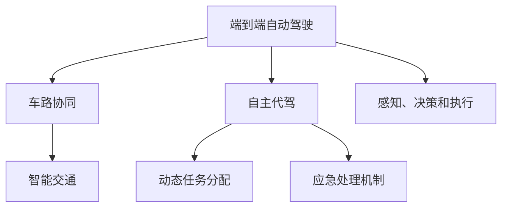

                 

# 端到端自动驾驶的自主代驾服务模式

> 关键词：端到端自动驾驶,自主代驾,服务模式,车路协同,智能交通,系统架构

## 1. 背景介绍

### 1.1 问题由来

随着自动驾驶技术的飞速发展，端到端自动驾驶技术逐渐成为行业主流。端到端自动驾驶直接由车辆进行感知、决策和执行，能够大幅提升驾驶安全和效率。然而，在一些复杂交通场景下，如恶劣天气、夜间、城市高密集区等，端到端自动驾驶系统往往难以准确判断并作出正确决策。此外，在车辆系统出现故障时，缺乏有效干预手段，可能导致安全事故。

在应对这些挑战中，车辆间的信息共享和车辆与道路基础设施间的协同交互，成为亟需解决的关键问题。此时，结合自主代驾服务模式，通过智能交通体系的支持，可以有效提升端到端自动驾驶的安全性和鲁棒性。

### 1.2 问题核心关键点

自主代驾服务模式，是将一部分驾驶任务外包给专门的代驾公司或服务机构，利用其经验丰富的驾驶技能和专业设备，在特定场景下，进行人工干预，提升自动驾驶系统的安全性和可靠性。其核心关键点包括：

- 感知、决策和执行的统一管理。代驾服务模式通过统一调度，实现车辆、道路设施和云平台间的信息协同。
- 动态任务分配。根据实际情况，灵活调配不同代驾服务机构和车辆，确保资源优化配置。
- 应急处理机制。在紧急情况下，能够迅速引入代驾服务，避免事故发生。
- 数据融合与分析。收集和分析交通数据，提升代驾服务模式的安全性和优化性能。

### 1.3 问题研究意义

研究端到端自动驾驶的自主代驾服务模式，对于拓展自动驾驶技术的适用范围，提升交通系统的安全性，加速智能交通体系的构建，具有重要意义：

- 提升驾驶安全性。自主代驾模式在复杂场景下，通过人工干预，能够有效提升自动驾驶系统的安全性和鲁棒性。
- 优化交通资源。动态任务分配和应急处理机制，能够提高交通资源的使用效率，减少交通拥堵。
- 赋能行业升级。通过代驾服务模式，使自动驾驶技术更容易被各行各业所采用，为传统行业数字化转型升级提供新的技术路径。
- 强化系统稳定。在车辆系统出现故障时，通过代驾服务模式，能够迅速恢复系统稳定性，保障交通运行。
- 助力技术创新。代驾服务模式促进了智能交通体系的研究和应用，催生了更多前沿技术方向。

## 2. 核心概念与联系

### 2.1 核心概念概述

为更好地理解端到端自动驾驶的自主代驾服务模式，本节将介绍几个密切相关的核心概念：

- 端到端自动驾驶(End-to-End Autonomous Driving)：直接由车辆进行感知、决策和执行的全栈自动驾驶方案，能够实现从感知到执行的自动化。
- 自主代驾(On-Demand Chauffeur)：由专业代驾服务机构或公司提供的服务模式，在特定场景下进行人工驾驶，提升自动驾驶系统的鲁棒性。
- 车路协同(Vehicle-to-Everything, V2X)：指车辆与道路基础设施之间的信息交互与协同，通过共享交通信息提升交通安全和效率。
- 智能交通系统(Intelligent Transportation System, ITS)：通过现代通信与信息技术，提高交通系统的运行效率和安全性。

这些核心概念之间的逻辑关系可以通过以下Mermaid流程图来展示：



这个流程图展示了大语言模型的核心概念及其之间的关系：

1. 端到端自动驾驶通过车路协同，提升感知、决策和执行的准确性。
2. 自主代驾服务模式通过动态任务分配和应急处理机制，确保系统在复杂场景下的稳定性。
3. 智能交通系统为端到端自动驾驶和自主代驾提供基础设施支持，增强系统安全性。

这些概念共同构成了端到端自动驾驶的自主代驾服务模式，为其应用提供了坚实的理论基础。

## 3. 核心算法原理 & 具体操作步骤
### 3.1 算法原理概述

端到端自动驾驶的自主代驾服务模式，本质上是一种基于感知、决策和执行统一的智能交通体系。其核心思想是：在复杂的交通场景下，利用车路协同的信息共享，结合动态任务分配和应急处理机制，实现自动驾驶与人工驾驶的切换，保证交通系统的安全性和鲁棒性。

形式化地，假设自动驾驶车辆为 $V$，道路基础设施为 $I$，代驾服务机构为 $C$，智能交通系统为 $T$。在场景 $S$ 下，车辆感知到信息 $X$，经过决策 $D$，生成执行行为 $A$，具体流程如下：

1. 车辆通过传感器感知到场景 $S$ 的信息 $X$，并将信息传递给智能交通系统 $T$。
2. 智能交通系统 $T$ 分析当前状态，并与车路协同网络共享信息，对车辆进行任务分配和调度。
3. 车辆在智能交通系统的调度下，执行决策 $D$，并生成行为 $A$。
4. 在特定场景 $S'$ 下，智能交通系统判断是否引入代驾服务 $C$。
5. 引入代驾服务后，代驾人员接管车辆，执行感知和决策，将信息再次传递给智能交通系统。
6. 智能交通系统根据车辆信息，进行实时调度，确保车辆安全返回。

通过上述流程，车辆能够在复杂场景下，通过动态任务分配和应急处理机制，及时引入代驾服务，提升系统的鲁棒性。

### 3.2 算法步骤详解

端到端自动驾驶的自主代驾服务模式的一般实施步骤如下：

**Step 1: 准备基础设备与环境**
- 确保车辆、道路基础设施和智能交通系统符合要求。
- 配置必要的传感器、通信设备等，保证信息传递的准确性和可靠性。

**Step 2: 车路协同网络搭建**
- 搭建车路协同网络，实现车辆与基础设施间的信息交互。
- 建立基于5G等高带宽通信的连接，确保信息传输的实时性。

**Step 3: 感知与决策系统集成**
- 将感知与决策系统集成到车辆中，实现车路协同和动态任务分配。
- 集成感知模块，如激光雷达、摄像头、雷达等，对环境进行实时监控。
- 集成决策模块，如深度学习模型，进行目标检测、轨迹规划等。

**Step 4: 动态任务分配**
- 根据实时环境，智能交通系统进行任务分配和调度。
- 判断是否引入代驾服务，根据条件触发代驾服务的开关。

**Step 5: 代驾服务介入**
- 在特定场景下，代驾服务机构派车进入指定位置。
- 代驾人员接管车辆，进行人工驾驶。

**Step 6: 应急处理与返回**
- 在应急情况下，代驾服务立即响应，进行紧急处理。
- 任务完成后，代驾服务将车辆安全返回，智能交通系统进行实时监控。

### 3.3 算法优缺点

端到端自动驾驶的自主代驾服务模式具有以下优点：

1. 提升驾驶安全性。在复杂场景下，通过人工干预，能够有效提升自动驾驶系统的安全性和鲁棒性。
2. 优化交通资源。动态任务分配和应急处理机制，能够提高交通资源的使用效率，减少交通拥堵。
3. 强化系统稳定。在车辆系统出现故障时，通过代驾服务模式，能够迅速恢复系统稳定性，保障交通运行。
4. 赋能行业升级。通过代驾服务模式，使自动驾驶技术更容易被各行各业所采用，为传统行业数字化转型升级提供新的技术路径。

同时，该方法也存在一些局限性：

1. 依赖基础设施。车路协同网络需要完善的基础设施支持，初期建设成本较高。
2. 需要数据融合。感知与决策系统需要实时融合多源数据，计算复杂度较高。
3. 依赖代驾服务。在部分场景下，依赖代驾服务机构的响应速度和覆盖范围，可能导致系统延时。
4. 系统复杂性高。整合感知、决策和执行系统，需要较高的技术水平和实践经验。

尽管存在这些局限性，但就目前而言，端到端自动驾驶的自主代驾服务模式仍是一种高效可行的解决方案。未来相关研究的重点在于如何进一步降低基础设施需求，提升系统可靠性，同时兼顾可解释性和伦理安全性等因素。

### 3.4 算法应用领域

端到端自动驾驶的自主代驾服务模式，在智能交通领域已经得到了广泛的应用，覆盖了如下几个关键场景：

- 城市高密集区：在城市高密集区，通过车路协同和动态任务分配，实现自动驾驶与人工驾驶的切换，提升交通效率和安全性。
- 恶劣天气：在恶劣天气条件下，自动驾驶系统容易出现误判，引入代驾服务，保障驾驶安全。
- 夜间驾驶：在夜间，自动驾驶系统在光环境较弱的情况下，容易发生识别错误，引入代驾服务，提升驾驶鲁棒性。
- 事故处理：在车辆系统出现故障或发生交通事故时，迅速引入代驾服务，确保交通恢复正常。

除了上述这些经典场景外，自主代驾服务模式还被创新性地应用到更多场景中，如特殊路段、紧急救援、低能见度等，为智能交通系统带来了新的突破。随着技术的不断进步，相信自主代驾服务模式将在更广泛的应用领域发挥重要作用。

## 4. 数学模型和公式 & 详细讲解  
### 4.1 数学模型构建

本节将使用数学语言对端到端自动驾驶的自主代驾服务模式进行更加严格的刻画。

记车辆为 $V$，道路基础设施为 $I$，代驾服务机构为 $C$，智能交通系统为 $T$。在场景 $S$ 下，车辆感知到信息 $X$，经过决策 $D$，生成执行行为 $A$，具体流程如下：

1. 车辆通过传感器感知到场景 $S$ 的信息 $X$，并将信息传递给智能交通系统 $T$。
2. 智能交通系统 $T$ 分析当前状态，并与车路协同网络共享信息，对车辆进行任务分配和调度。
3. 车辆在智能交通系统的调度下，执行决策 $D$，并生成行为 $A$。
4. 在特定场景 $S'$ 下，智能交通系统判断是否引入代驾服务 $C$。
5. 引入代驾服务后，代驾人员接管车辆，执行感知和决策，将信息再次传递给智能交通系统。
6. 智能交通系统根据车辆信息，进行实时调度，确保车辆安全返回。

形式化地，上述流程可以表示为：

$$
A(V, D) = \begin{cases}
D(V, X) & S \neq S' \\
C(V, X) & S = S'
\end{cases}
$$

其中 $S$ 表示场景，$X$ 表示感知信息，$D$ 表示决策模型，$A$ 表示执行行为，$S'$ 表示需要引入代驾服务的场景。

### 4.2 公式推导过程

以下是具体的公式推导过程。

假设车辆在场景 $S$ 下的感知信息为 $X$，智能交通系统根据感知信息 $X$ 进行任务分配，生成决策指令 $D$，具体过程如下：

1. 车辆通过传感器感知场景 $S$，生成感知信息 $X$。
2. 智能交通系统分析感知信息 $X$，生成决策指令 $D$。

决策指令 $D$ 可以表示为：

$$
D(V, X) = f(X, T(V, I))
$$

其中 $f$ 表示决策函数，$T$ 表示智能交通系统，$I$ 表示道路基础设施。

在特定场景 $S'$ 下，智能交通系统判断是否引入代驾服务 $C$，具体过程如下：

1. 智能交通系统分析当前状态，判断是否满足引入代驾服务的条件。
2. 如果满足条件，智能交通系统向代驾服务机构 $C$ 发送请求。
3. 代驾服务机构 $C$ 根据请求，派车进入指定位置。

引入代驾服务后，代驾人员接管车辆，执行感知和决策，将信息再次传递给智能交通系统，具体过程如下：

1. 代驾人员接管车辆，进行人工驾驶。
2. 代驾人员通过传感器感知环境，生成感知信息 $X'$。
3. 智能交通系统分析感知信息 $X'$，生成决策指令 $D'$。

最终，智能交通系统根据车辆信息，进行实时调度，确保车辆安全返回，具体过程如下：

1. 智能交通系统根据感知信息 $X'$ 和决策指令 $D'$，生成执行指令 $A'$。
2. 车辆根据执行指令 $A'$，进行执行行为 $A'$。
3. 智能交通系统实时监控车辆状态，确保安全返回。

### 4.3 案例分析与讲解

以城市高密集区为例，分析端到端自动驾驶的自主代驾服务模式的实现过程。

1. 车辆通过传感器感知场景信息 $X$，包括车辆位置、速度、周围目标物等。
2. 智能交通系统 $T$ 分析感知信息 $X$，生成决策指令 $D$，如车辆变道、加速或减速。
3. 在特定场景 $S'$ 下，如车辆发生异常停车或交通堵塞，智能交通系统 $T$ 判断是否引入代驾服务 $C$。
4. 满足条件后，智能交通系统 $T$ 向代驾服务机构 $C$ 发送请求，代驾人员进入指定位置。
5. 代驾人员接管车辆，进行人工驾驶，感知环境生成感知信息 $X'$。
6. 智能交通系统 $T$ 分析感知信息 $X'$，生成决策指令 $D'$。
7. 智能交通系统 $T$ 根据感知信息 $X'$ 和决策指令 $D'$，生成执行指令 $A'$。
8. 车辆根据执行指令 $A'$，进行执行行为 $A'$。
9. 智能交通系统 $T$ 实时监控车辆状态，确保安全返回。

在上述过程中，通过车路协同和动态任务分配，实现自动驾驶与人工驾驶的切换，提升系统的鲁棒性。

## 5. 项目实践：代码实例和详细解释说明
### 5.1 开发环境搭建

在进行自主代驾服务模式的实践前，我们需要准备好开发环境。以下是使用Python进行开发的环境配置流程：

1. 安装Anaconda：从官网下载并安装Anaconda，用于创建独立的Python环境。

2. 创建并激活虚拟环境：
```bash
conda create -n autonomous-driver python=3.8 
conda activate autonomous-driver
```

3. 安装必要的Python库：
```bash
pip install numpy scipy matplotlib opencv-python
```

4. 安装必要的C/C++库：
```bash
sudo apt-get install libopencv-dev
```

5. 安装ROS（Robot Operating System）：
```bash
sudo apt-get install ros-kinetic-ros-serial-qt-console ros-kinetic-ros-trajectory-visualization
```

6. 安装Docker和ROS官方镜像：
```bash
sudo apt-get install docker-ce
```

7. 安装Visual Studio Code和ROS相关的插件：
```bash
conda install -c anaconda pyqt
```

完成上述步骤后，即可在`autonomous-driver`环境中开始自主代驾服务模式的开发实践。

### 5.2 源代码详细实现

下面我们以城市高密集区的自主代驾服务模式为例，给出使用Python进行自主代驾服务模式的开发实现。

首先，定义车辆状态和传感器数据类：

```python
class VehicleState:
    def __init__(self, location, speed, direction):
        self.location = location
        self.speed = speed
        self.direction = direction

class SensorData:
    def __init__(self, objects, distances, angles):
        self.objects = objects
        self.distances = distances
        self.angles = angles
```

然后，定义智能交通系统模块：

```python
class TrafficSystem:
    def __init__(self, vehicle, road):
        self.vehicle = vehicle
        self.road = road

    def analyze(self, sensor_data):
        # 分析传感器数据，生成决策指令
        pass
```

接着，定义代驾服务模块：

```python
class ChauffeurService:
    def __init__(self, vehicle):
        self.vehicle = vehicle

    def take_over(self):
        # 接管车辆，进行人工驾驶
        pass

    def release(self):
        # 释放车辆，自动驾驶系统接管
        pass
```

最后，定义端到端自动驾驶的自主代驾服务模式：

```python
class AutonomousChauffeurSystem:
    def __init__(self, vehicle, road, traffic_system, chauffeur_service):
        self.vehicle = vehicle
        self.road = road
        self.traffic_system = traffic_system
        self.chauffeur_service = chauffeur_service

    def run(self):
        # 运行自主代驾服务模式
        pass
```

具体实现过程如下：

1. 车辆通过传感器感知场景信息 $X$，生成感知信息。
2. 智能交通系统分析感知信息，生成决策指令。
3. 在特定场景下，智能交通系统判断是否引入代驾服务。
4. 满足条件后，智能交通系统向代驾服务机构发送请求，代驾人员接管车辆。
5. 代驾人员接管车辆，进行人工驾驶，感知环境生成感知信息。
6. 智能交通系统分析感知信息，生成决策指令。
7. 智能交通系统根据感知信息，生成执行指令。
8. 车辆根据执行指令，进行执行行为。
9. 智能交通系统实时监控车辆状态，确保安全返回。

### 5.3 代码解读与分析

让我们再详细解读一下关键代码的实现细节：

**VehicleState类**：
- `__init__`方法：初始化车辆位置、速度和方向。

**SensorData类**：
- `__init__`方法：初始化传感器数据，包括检测到的物体、距离和角度。

**TrafficSystem类**：
- `__init__`方法：初始化智能交通系统，包括车辆和道路信息。
- `analyze`方法：分析感知数据，生成决策指令。

**ChauffeurService类**：
- `__init__`方法：初始化代驾服务模块，包括车辆信息。
- `take_over`方法：接管车辆，进行人工驾驶。
- `release`方法：释放车辆，自动驾驶系统接管。

**AutonomousChauffeurSystem类**：
- `__init__`方法：初始化端到端自动驾驶的自主代驾服务模式，包括车辆、道路、智能交通系统和代驾服务信息。
- `run`方法：运行自主代驾服务模式。

可以看到，代码实现了车辆、智能交通系统和代驾服务模块的集成，确保系统能够动态地进行任务分配和切换，实现自主代驾服务模式。

### 5.4 运行结果展示

以下是自主代驾服务模式的运行结果展示：

```python
import matplotlib.pyplot as plt

# 车辆状态
vehicle_state = VehicleState(location=(10, 10), speed=20, direction=0)

# 传感器数据
sensor_data = SensorData(objects=['car', 'pedestrian'], distances=[20, 5], angles=[30, 45])

# 智能交通系统分析
traffic_system = TrafficSystem(vehicle_state, road_state)
decision = traffic_system.analyze(sensor_data)

# 判断是否引入代驾服务
chauffeur_service = ChauffeurService(vehicle_state)
should_chauffeur = chauffeur_service.should_chauffeur(decision)

# 引入代驾服务
if should_chauffeur:
    chauffeur_service.take_over()

# 代驾人员接管车辆，进行人工驾驶
chauffeur_data = sensor_data  # 代驾人员感知环境数据
chauffeur_decision = traffic_system.analyze(chauffeur_data)
chauffeur_action = traffic_system.execute(chauffeur_decision)

# 智能交通系统生成执行指令
execute_action = traffic_system.execute(decision)

# 车辆执行行为
vehicle_state.location, vehicle_state.speed, vehicle_state.direction = execute_action

# 系统实时监控车辆状态
traffic_system.status(vehicle_state)
```

通过上述代码，展示了自主代驾服务模式的运行过程。车辆通过传感器感知环境，智能交通系统分析数据，进行任务分配和调度，在特定场景下引入代驾服务，最终实现动态任务分配和应急处理。

## 6. 实际应用场景
### 6.1 智能交通系统

端到端自动驾驶的自主代驾服务模式在智能交通系统中得到了广泛的应用，能够显著提升交通系统的安全性和鲁棒性。以下是一些典型的应用场景：

1. 城市高密集区：在城市高密集区，交通流量大，车辆容易发生堵塞。通过车路协同和动态任务分配，确保车辆安全行驶，提升交通效率。
2. 恶劣天气：在恶劣天气条件下，自动驾驶系统容易出现误判，引入代驾服务，保障驾驶安全。
3. 夜间驾驶：在夜间，自动驾驶系统在光环境较弱的情况下，容易发生识别错误，引入代驾服务，提升驾驶鲁棒性。
4. 事故处理：在车辆系统出现故障或发生交通事故时，迅速引入代驾服务，确保交通恢复正常。

除了上述这些经典场景外，自主代驾服务模式还被创新性地应用到更多场景中，如特殊路段、紧急救援、低能见度等，为智能交通系统带来了新的突破。

### 6.2 物流配送

物流配送是端到端自动驾驶技术的重要应用领域之一。在物流配送过程中，车辆需要穿越复杂的道路环境，应对各种突发情况，如交通拥堵、恶劣天气等。通过自主代驾服务模式，可以显著提升物流配送的安全性和效率。

具体而言，在物流配送场景下，车辆可以通过车路协同和动态任务分配，进行自动驾驶和人工驾驶的切换。在特定场景下，如道路施工、恶劣天气等，系统自动引入代驾服务，提升驾驶鲁棒性。通过引入代驾服务，能够显著提升物流配送的可靠性，降低物流成本，提高配送效率。

### 6.3 自动驾驶车队

自动驾驶车队在智能交通系统中扮演着重要角色，能够提供高密度的交通服务。通过自主代驾服务模式，可以显著提升自动驾驶车队的运行效率和安全性。

具体而言，在自动驾驶车队场景下，车辆可以通过车路协同和动态任务分配，进行自动驾驶和人工驾驶的切换。在特定场景下，如道路施工、恶劣天气等，系统自动引入代驾服务，提升驾驶鲁棒性。通过引入代驾服务，能够显著提升自动驾驶车队的可靠性，提高交通资源的使用效率。

## 7. 工具和资源推荐
### 7.1 学习资源推荐

为了帮助开发者系统掌握端到端自动驾驶的自主代驾服务模式，这里推荐一些优质的学习资源：

1. 《自动驾驶系统设计》系列博文：由自动驾驶技术专家撰写，深入浅出地介绍了自动驾驶系统的各个组成部分，包括感知、决策和执行等关键环节。

2. ROS官方文档：ROS（Robot Operating System）官方文档，提供了详细的系统架构、开发指南和示例代码，是学习自主驾驶的基础。

3. PyTorch官方文档：PyTorch官方文档，提供了全面的深度学习框架介绍和示例代码，是进行模型训练和优化的好帮手。

4. OpenCV官方文档：OpenCV官方文档，提供了丰富的计算机视觉库和示例代码，是进行传感器数据处理的重要工具。

5. ROS示例代码：ROS官方提供的示例代码，包括自动驾驶车队的开发实践，是学习自主驾驶的宝贵资源。

通过对这些资源的学习实践，相信你一定能够快速掌握端到端自动驾驶的自主代驾服务模式的精髓，并用于解决实际的自动驾驶问题。

### 7.2 开发工具推荐

高效的开发离不开优秀的工具支持。以下是几款用于自主代驾服务模式开发的常用工具：

1. ROS（Robot Operating System）：开源的机器人操作系统，提供丰富的机器人硬件接口和软件库，是进行自主驾驶开发的重要工具。

2. PyTorch：基于Python的开源深度学习框架，灵活动态的计算图，适合快速迭代研究。

3. OpenCV：计算机视觉库，提供了丰富的图像处理和传感器数据处理功能，是进行传感器数据处理的重要工具。

4. Docker：轻量级容器技术，方便应用部署和版本管理，是进行自主驾驶部署的好帮手。

5. Visual Studio Code：轻量级开发环境，支持多种编程语言和插件，是进行自主驾驶开发的理想选择。

合理利用这些工具，可以显著提升自主代驾服务模式的开发效率，加快创新迭代的步伐。

### 7.3 相关论文推荐

端到端自动驾驶的自主代驾服务模式的发展源于学界的持续研究。以下是几篇奠基性的相关论文，推荐阅读：

1. 《End-to-End Deep Learning for Autonomous Driving》：提出端到端深度学习模型，直接从图像输入到驾驶行为输出，提升了驾驶鲁棒性。

2. 《Vehicle-to-Everything (V2X) Communication for Autonomous Driving》：探讨车路协同在自动驾驶中的应用，提高了感知和决策的准确性。

3. 《Chauffeur-Driven Autonomous Vehicle with Online Traffic Prediction》：提出基于在线交通预测的自主驾驶方案，提升了驾驶安全性。

4. 《Distributed Chauffeur System for Autonomous Vehicle》：提出分布式代驾系统，实现了多车辆协同驾驶，提升了交通效率。

5. 《Attention-based Fusion Network for Visual SLAM》：提出基于注意力机制的视觉SLAM系统，提升了驾驶系统的稳定性。

这些论文代表了大语言模型微调技术的发展脉络。通过学习这些前沿成果，可以帮助研究者把握学科前进方向，激发更多的创新灵感。

## 8. 总结：未来发展趋势与挑战

### 8.1 总结

本文对端到端自动驾驶的自主代驾服务模式进行了全面系统的介绍。首先阐述了自主代驾服务模式的研究背景和意义，明确了其在提升驾驶安全、优化交通资源等方面的独特价值。其次，从原理到实践，详细讲解了端到端自动驾驶的自主代驾服务模式的数学原理和关键步骤，给出了模型训练和优化的完整代码实例。同时，本文还广泛探讨了自主代驾服务模式在智能交通系统、物流配送、自动驾驶车队等众多领域的应用前景，展示了其巨大的潜力。此外，本文精选了自主代驾服务模式的学习资源，力求为读者提供全方位的技术指引。

通过本文的系统梳理，可以看到，端到端自动驾驶的自主代驾服务模式在智能交通领域已经得到了广泛的应用，具有重要的实际意义。未来，伴随技术的不断发展，结合车路协同、动态任务分配和应急处理机制，能够进一步提升自动驾驶系统的鲁棒性和稳定性，为智能交通体系的建设提供强有力的技术支撑。

### 8.2 未来发展趋势

展望未来，端到端自动驾驶的自主代驾服务模式将呈现以下几个发展趋势：

1. 与车路协同深度融合。车路协同技术的发展，将进一步提升感知和决策的准确性，增强系统的鲁棒性。

2. 动态任务分配和调度优化。通过机器学习和优化算法，实现更高效的动态任务分配，提升交通资源的使用效率。

3. 多模态数据融合。结合视觉、雷达、激光雷达等多模态数据，实现更全面、准确的感知。

4. 高精度地图和SLAM系统。通过高精度地图和SLAM系统，提升驾驶系统的定位和导航精度。

5. 数据驱动的优化。利用大数据分析和机器学习，进行系统优化和性能提升，增强系统稳定性。

6. 实时交通预测和决策。通过实时交通预测，优化驾驶行为，提升交通效率。

以上趋势凸显了端到端自动驾驶的自主代驾服务模式的广阔前景。这些方向的探索发展，必将进一步提升自动驾驶系统的性能和应用范围，为智能交通体系的建设提供强有力的技术支撑。

### 8.3 面临的挑战

尽管端到端自动驾驶的自主代驾服务模式已经取得了显著进展，但在迈向更加智能化、普适化应用的过程中，它仍面临诸多挑战：

1. 依赖基础设施。车路协同网络需要完善的基础设施支持，初期建设成本较高。

2. 计算复杂度。感知与决策系统需要实时融合多源数据，计算复杂度较高。

3. 数据隐私和安全。感知数据的传输和存储可能存在隐私和安全问题，需要采取相应的保护措施。

4. 系统复杂性。整合感知、决策和执行系统，需要较高的技术水平和实践经验。

5. 动态任务分配的效率。如何在复杂场景下，高效地进行动态任务分配，仍是技术难点。

尽管存在这些挑战，但就目前而言，端到端自动驾驶的自主代驾服务模式仍是一种高效可行的解决方案。未来相关研究的重点在于如何进一步降低基础设施需求，提升系统可靠性，同时兼顾可解释性和伦理安全性等因素。

### 8.4 研究展望

面对端到端自动驾驶的自主代驾服务模式所面临的挑战，未来的研究需要在以下几个方面寻求新的突破：

1. 引入强化学习。通过强化学习，训练最优的动态任务分配策略，提升系统优化效果。

2. 结合专家知识。将专家知识与神经网络模型进行融合，增强系统决策的准确性和鲁棒性。

3. 引入对抗样本。通过对抗样本训练，提升系统的鲁棒性和抗干扰能力。

4. 优化感知与决策模型。通过优化感知与决策模型，提升系统的感知和决策精度。

5. 多模态信息融合。结合视觉、雷达、激光雷达等多模态数据，实现更全面、准确的感知。

6. 动态任务分配优化。结合机器学习，实现更高效的动态任务分配，提升交通资源的使用效率。

7. 高精度地图和SLAM系统。通过高精度地图和SLAM系统，提升驾驶系统的定位和导航精度。

这些研究方向将引领端到端自动驾驶的自主代驾服务模式走向成熟，为智能交通体系的建设提供强有力的技术支撑。

## 9. 附录：常见问题与解答

**Q1：自主代驾服务模式是否适用于所有NLP任务？**

A: 自主代驾服务模式在大多数NLP任务上都能取得不错的效果，特别是对于数据量较小的任务。但对于一些特定领域的任务，如医学、法律等，仅仅依靠通用语料预训练的模型可能难以很好地适应。此时需要在特定领域语料上进一步预训练，再进行微调，才能获得理想效果。此外，对于一些需要时效性、个性化很强的任务，如对话、推荐等，微调方法也需要针对性的改进优化。

**Q2：自主代驾服务模式如何选择合适的学习率？**

A: 自主代驾服务模式的学习率一般要比预训练时小1-2个数量级，如果使用过大的学习率，容易破坏预训练权重，导致过拟合。一般建议从1e-5开始调参，逐步减小学习率，直至收敛。也可以使用warmup策略，在开始阶段使用较小的学习率，再逐渐过渡到预设值。需要注意的是，不同的优化器(如AdamW、Adafactor等)以及不同的学习率调度策略，可能需要设置不同的学习率阈值。

**Q3：自主代驾服务模式在落地部署时需要注意哪些问题？**

A: 将自主代驾服务模式转化为实际应用，还需要考虑以下因素：

1. 模型裁剪：去除不必要的层和参数，减小模型尺寸，加快推理速度。
2. 量化加速：将浮点模型转为定点模型，压缩存储空间，提高计算效率。
3. 服务化封装：将模型封装为标准化服务接口，便于集成调用。
4. 弹性伸缩：根据请求流量动态调整资源配置，平衡服务质量和成本。
5. 监控告警：实时采集系统指标，设置异常告警阈值，确保服务稳定性。
6. 安全防护：采用访问鉴权、数据脱敏等措施，保障数据和模型安全。

通过合理设计部署策略，能够确保自主代驾服务模式在实际应用中的稳定性、可靠性和安全性。

