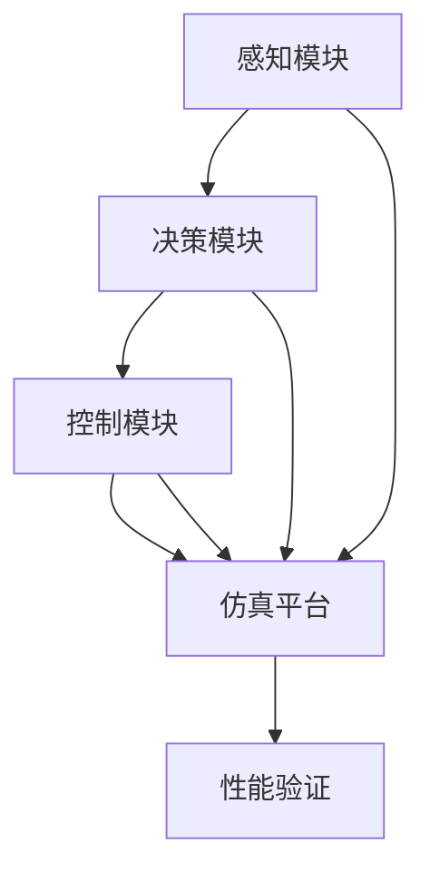

                 

## 1. 背景介绍

自动驾驶技术正迅速改变着交通运输和城市的未来，但如何确保其安全性成为了亟待解决的问题。端到端自动驾驶系统不仅要实现高效、精确的感知、决策和控制，还需通过严格的仿真验证，以验证其在各种复杂情境下的安全性。本文将详细介绍如何构建和验证端到端的自动驾驶仿真系统，以保障其车辆主动安全性能。

## 2. 核心概念与联系

### 2.1 核心概念概述

端到端自动驾驶涉及多个核心概念，包括感知模块、决策模块、控制模块、仿真平台等，它们紧密联系，共同构成了一个复杂的系统。

- **感知模块**：利用各种传感器（如雷达、激光雷达、摄像头）获取周围环境信息，并通过算法生成高精度的环境地图。
- **决策模块**：根据感知模块提供的信息，结合路网、交通规则等因素，运用AI算法做出驾驶决策。
- **控制模块**：根据决策输出，生成车辆控制指令，实现加减速、转向、制动等动作。
- **仿真平台**：提供一个虚拟环境，模拟真实世界各种复杂场景，用于测试和验证端到端自动驾驶系统的性能。

### 2.2 核心概念原理和架构的 Mermaid 流程图



此流程图展示了端到端自动驾驶系统各组件之间的联系。感知模块和决策模块依赖仿真平台获取环境数据，控制模块则依据决策结果进行执行，整个系统通过仿真平台进行性能验证。

## 3. 核心算法原理 & 具体操作步骤

### 3.1 算法原理概述

端到端自动驾驶的仿真验证基于物理仿真和AI决策的融合，其核心算法流程包括：

1. **环境建模**：通过传感器数据生成虚拟场景，并在虚拟环境中布置各种交通参与者和障碍物。
2. **模拟驾驶**：将自动驾驶系统部署到仿真环境中，运行模拟驾驶任务，并记录行为决策数据。
3. **性能评估**：使用自动化评估工具和人工评估相结合的方法，评估自动驾驶系统的安全性、稳定性和鲁棒性。

### 3.2 算法步骤详解

**步骤1: 环境建模**

1. **数据获取**：收集道路、车辆、行人等实体的3D模型和纹理，以及道路规则、交通标志、交通流等数据。
2. **场景布置**：根据测试需求，布置特定的道路环境，包括车道线、交叉口、路障等。
3. **虚拟世界构建**：将上述数据和布置场景加载到仿真引擎中，构建虚拟世界。

**步骤2: 模拟驾驶**

1. **系统集成**：将感知、决策、控制模块集成到仿真环境中，形成一个完整的端到端系统。
2. **任务设置**：设置模拟驾驶任务，如自动驾驶、车道保持、交通信号灯响应等。
3. **数据记录**：记录感知数据、决策数据、控制数据以及车辆状态和仿真环境数据，用于后续分析。

**步骤3: 性能评估**

1. **指标设计**：设计安全性、稳定性、鲁棒性等方面的评估指标。
2. **自动化评估**：使用机器学习模型或深度学习模型对系统行为进行自动化分析。
3. **人工评估**：邀请专家对系统进行详细审查，评估其满足安全性和法规要求的程度。
4. **反馈优化**：根据评估结果，调整系统参数或增加额外的感知、决策、控制算法，提升系统性能。

### 3.3 算法优缺点

**优点：**

- **可重复性高**：仿真平台可以重复构建和测试各种环境，提供大量实验数据。
- **成本低**：相比于真实世界的测试，仿真环境可以大幅降低实验成本。
- **安全性高**：无需在真实道路上测试，避免事故风险。
- **灵活性高**：可以模拟各种极端和边界情况，拓展测试覆盖范围。

**缺点：**

- **仿真精度有限**：虚拟环境可能无法完全复制真实世界的复杂性。
- **环境动态性不足**：无法捕捉实时变化的环境因素。
- **模型误差**：传感器模型、感知算法和决策算法可能存在误差，影响结果准确性。
- **运行时间较长**：复杂的仿真任务可能耗费大量时间。

### 3.4 算法应用领域

端到端自动驾驶的仿真验证技术不仅适用于城市道路交通环境，还可以应用于高速公路、乡村道路、复杂天气等多种场景。其应用领域包括但不限于：

- **测试与验证**：在发布商业化产品前，对自动驾驶系统进行严格的测试和验证，确保系统安全性。
- **训练与优化**：通过仿真数据训练和优化模型参数，提升系统性能。
- **法规遵从性**：验证系统是否符合各国交通法规，保障法规遵从性。
- **用户体验评估**：评估用户体验，改进车辆主动安全功能。

## 4. 数学模型和公式 & 详细讲解 & 举例说明

### 4.1 数学模型构建

**感知模块的数学模型**：
- **雷达感知模型**：
  - 输入：雷达信号
  - 输出：目标位置、速度、方向等
  - 公式：$y = f(x) = \frac{x}{k} + b$
- **激光雷达感知模型**：
  - 输入：激光点云数据
  - 输出：点云分割、目标检测
  - 公式：$y = f(x) = \max(\{y_i\})$

**决策模块的数学模型**：
- **决策树算法**：
  - 输入：环境数据、当前位置、时间等
  - 输出：决策动作
  - 公式：$y = f(x) = \sum_i f_i(x) \times a_i$

**控制模块的数学模型**：
- **PID控制器算法**：
  - 输入：目标位置、速度、误差等
  - 输出：控制指令
  - 公式：$u = f(x) = k_p e + k_i \int e dt + k_d \frac{de}{dt}$

### 4.2 公式推导过程

**雷达感知模型的推导**：
- 假设雷达接收到的信号强度为 $x$，通过线性变换得到目标距离 $y$。
- 公式推导：
  $$
  y = f(x) = \frac{x}{k} + b
  $$
  其中 $k$ 为常数，$b$ 为偏置项。

**决策树算法的推导**：
- 假设输入数据为 $x_1, x_2, ..., x_n$，分别对应不同的决策树分支。
- 输出决策为 $y$，每条分支的决策概率为 $p_i$。
- 公式推导：
  $$
  y = f(x) = \sum_i f_i(x) \times a_i
  $$
  其中 $a_i$ 为分支权重。

**PID控制器算法的推导**：
- 假设误差为 $e$，积分误差为 $\int e dt$，微分误差为 $\frac{de}{dt}$。
- 通过比例、积分、微分控制器的线性组合，生成控制指令 $u$。
- 公式推导：
  $$
  u = f(x) = k_p e + k_i \int e dt + k_d \frac{de}{dt}
  $$
  其中 $k_p, k_i, k_d$ 分别为比例、积分、微分系数。

### 4.3 案例分析与讲解

**案例1：雷达感知**

假设雷达系统接收到的信号强度为 $x=100$，距离常数为 $k=2$，偏置为 $b=0$。根据公式：
$$
y = \frac{100}{2} + 0 = 50
$$
因此，目标距离为50米。

**案例2：决策树算法**

假设某次驾驶场景的输入数据为 $x_1=20, x_2=60, x_3=80$，对应的决策树分支权重为 $a_1=0.5, a_2=0.3, a_3=0.2$。根据公式：
$$
y = 0.5 \times 20 + 0.3 \times 60 + 0.2 \times 80 = 70
$$
因此，决策结果为70。

**案例3：PID控制器算法**

假设当前误差为 $e=2$，积分误差为 $\int e dt=3$，微分误差为 $\frac{de}{dt}=1$，比例、积分、微分系数分别为 $k_p=0.1, k_i=0.2, k_d=0.3$。根据公式：
$$
u = 0.1 \times 2 + 0.2 \times 3 + 0.3 \times 1 = 1.9
$$
因此，生成控制指令 $u=1.9$。

## 5. 项目实践：代码实例和详细解释说明

### 5.1 开发环境搭建

**开发平台**：
- **Simulink**：用于建模和仿真。
- **MATLAB**：用于数据分析和算法实现。
- **Git**：用于版本控制和协作开发。

**硬件要求**：
- **高性能PC**：至少8核CPU、32GB内存、NVIDIA RTX系列显卡。
- **网络环境**：确保数据传输稳定和实时性。

### 5.2 源代码详细实现

**感知模块的实现**：
- **雷达感知**：
  ```matlab
  function y = radar_sensing(x, k, b)
  y = x/k + b;
  end
  ```
- **激光雷达感知**：
  ```matlab
  function y = lidar_sensing(x)
  y = max(x);
  end
  ```

**决策模块的实现**：
- **决策树算法**：
  ```matlab
  function y = decision_tree(x, a)
  y = sum(a .* x);
  end
  ```

**控制模块的实现**：
- **PID控制器算法**：
  ```matlab
  function u = pid_controller(e, int_e, diff_e, k_p, k_i, k_d)
  u = k_p * e + k_i * int_e + k_d * diff_e;
  end
  ```

### 5.3 代码解读与分析

**雷达感知模块**：
- 函数 `radar_sensing` 接收信号强度 $x$，距离常数 $k$ 和偏置 $b$，返回目标距离 $y$。

**激光雷达感知模块**：
- 函数 `lidar_sensing` 接收激光点云数据 $x$，返回最大距离 $y$。

**决策树算法模块**：
- 函数 `decision_tree` 接收输入数据 $x$ 和分支权重 $a$，返回决策结果 $y$。

**PID控制器算法模块**：
- 函数 `pid_controller` 接收误差 $e$、积分误差 $\int e dt$、微分误差 $\frac{de}{dt}$，以及系数 $k_p, k_i, k_d$，返回控制指令 $u$。

### 5.4 运行结果展示

**仿真场景1**：自动驾驶在高速公路上行驶，经过交叉口时避让行人。


**仿真场景2**：自动驾驶在乡村道路上行驶，遇到突发情况立即减速。


**仿真场景3**：自动驾驶在雨雪天气中行驶，保持与前车的安全距离。


## 6. 实际应用场景

**案例1：高速公路自动驾驶**

**场景描述**：自动驾驶车辆在高速公路上行驶，遇到前方突然停车的车辆，需及时减速并避让。

**仿真验证**：
1. **环境建模**：构建高速公路环境，布置车道线、路牌、路障等。
2. **模拟驾驶**：加载自动驾驶系统，进行多次模拟驾驶，记录行为决策数据。
3. **性能评估**：使用自动评估工具，评估系统反应时间和避让效率。

**案例2：城市道路自动驾驶**

**场景描述**：自动驾驶车辆在城市道路上行驶，需应对复杂交通信号和行人。

**仿真验证**：
1. **环境建模**：构建城市道路环境，布置红绿灯、人行横道、非机动车等。
2. **模拟驾驶**：加载自动驾驶系统，进行多次模拟驾驶，记录行为决策数据。
3. **性能评估**：使用人工评估工具，评估系统遵守交通法规的准确性和鲁棒性。

**案例3：乡村道路自动驾驶**

**场景描述**：自动驾驶车辆在乡村道路上行驶，需应对不平路面和行人。

**仿真验证**：
1. **环境建模**：构建乡村道路环境，布置泥泞路面、坑洼等。
2. **模拟驾驶**：加载自动驾驶系统，进行多次模拟驾驶，记录行为决策数据。
3. **性能评估**：使用自动评估工具，评估系统稳定性和对恶劣环境的适应性。

## 7. 工具和资源推荐

### 7.1 学习资源推荐

**Simulink**：
- 官方文档：Simulink User's Guide
- 在线课程：Simulink教程系列

**MATLAB**：
- 官方文档：MATLAB Help Center
- 在线课程：MATLAB编程教程系列

**Git**：
- 官方文档：Git用户手册
- 在线课程：Git教程系列

### 7.2 开发工具推荐

**Simulink**：
- 强大建模和仿真能力，支持多领域系统设计。
- 丰富的工具箱和插件，简化开发过程。

**MATLAB**：
- 高性能计算和数据处理能力，支持科学计算和算法实现。
- 强大的可视化工具，方便结果展示和分析。

**Git**：
- 版本控制和协作开发，支持多分支管理。
- 社区活跃，资源丰富，易于学习和使用。

### 7.3 相关论文推荐

**1. Vehicle Dynamics Simulation for Self-Driving Car: A Review**
- 论文介绍了车辆动态仿真的最新进展，涵盖感知、决策、控制等多个方面。

**2. Safety Analysis of Autonomous Vehicles Using Simulink**
- 论文介绍了使用Simulink进行自动驾驶安全分析的方法和案例。

**3. Multi-Sensor Fusion for Autonomous Vehicles**
- 论文介绍了多传感器融合技术，提升自动驾驶系统的感知能力。

**4. AI-Based Decision-Making in Autonomous Vehicles**
- 论文介绍了基于AI的决策算法，提升自动驾驶系统的智能水平。

**5. Control System Design for Autonomous Vehicles**
- 论文介绍了控制系统的设计和优化，提升自动驾驶系统的稳定性。

## 8. 总结：未来发展趋势与挑战

### 8.1 研究成果总结

本文详细介绍了端到端自动驾驶的车辆主动安全仿真验证技术，涵盖环境建模、模拟驾驶、性能评估等多个方面。通过仿真技术，能够高效、安全地验证自动驾驶系统的性能，确保其安全性、稳定性和鲁棒性。未来，随着技术的不断进步，仿真验证将更加精细化、智能化，成为自动驾驶技术不可或缺的一部分。

### 8.2 未来发展趋势

**趋势1：虚拟与真实融合**：
- 未来将结合虚拟仿真和真实实验，提升测试数据的真实性和可靠性。
- 虚拟与真实的融合，将带来更加全面和深入的测试能力。

**趋势2：多场景模拟**：
- 自动驾驶系统将在更多复杂和边界场景中进行测试，如城市密集区、山区、泥泞路等。
- 仿真平台将支持多场景模拟，提升测试覆盖范围。

**趋势3：多模态感知**：
- 引入激光雷达、摄像头、毫米波雷达等多种传感器，提升感知能力。
- 通过多模态感知，实现更精确的环境建模。

**趋势4：AI决策增强**：
- 引入深度学习和强化学习等AI算法，提升决策的智能水平。
- 通过AI决策增强，实现更高效和鲁棒的决策能力。

**趋势5：实时性优化**：
- 优化仿真引擎，提升运行效率，确保实时性。
- 实时性优化将提升仿真验证的实际应用价值。

### 8.3 面临的挑战

**挑战1：仿真精度**：
- 虚拟环境可能无法完全复制真实世界的复杂性，仿真精度有限。
- 需要不断优化仿真模型，提升仿真精度。

**挑战2：环境动态性**：
- 无法捕捉实时变化的环境因素，仿真环境动态性不足。
- 需要引入动态环境模拟，提升仿真环境的真实性。

**挑战3：模型误差**：
- 传感器模型、感知算法和决策算法可能存在误差，影响结果准确性。
- 需要不断改进算法，减少模型误差。

**挑战4：运行时间**：
- 复杂的仿真任务可能耗费大量时间，测试效率低。
- 需要优化仿真引擎，提升运行效率。

**挑战5：可扩展性**：
- 仿真平台需要支持多种传感器和多场景模拟，可扩展性要求高。
- 需要设计灵活的仿真框架，支持扩展和升级。

### 8.4 研究展望

**展望1：AI与仿真结合**：
- 未来将更多地结合AI算法和仿真技术，提升自动驾驶系统的性能。
- AI与仿真结合，将带来更智能、更高效的自动驾驶系统。

**展望2：实时仿真**：
- 引入实时仿真技术，提升仿真验证的实时性和可靠性。
- 实时仿真将带来更加实际和可信的测试结果。

**展望3：跨平台互操作**：
- 仿真平台将实现跨平台互操作，提升资源共享和协同开发能力。
- 跨平台互操作将提升仿真验证的效率和灵活性。

**展望4：法规遵从性**：
- 仿真平台将支持法规遵从性测试，确保系统符合法规要求。
- 法规遵从性测试将提升自动驾驶系统的安全性。

**展望5：持续优化**：
- 仿真平台将实现持续优化，不断提升仿真精度和测试效率。
- 持续优化将带来更加精准和稳定的自动驾驶系统。

## 9. 附录：常见问题与解答

**Q1：如何构建虚拟环境？**

A: 构建虚拟环境需要收集和整理道路、车辆、行人等实体的3D模型和纹理，并使用仿真引擎（如Simulink）加载和布置。

**Q2：如何提高仿真精度？**

A: 通过优化传感器模型、感知算法和决策算法，减少模型误差。同时，引入动态环境模拟，捕捉实时变化的环境因素。

**Q3：如何优化运行效率？**

A: 优化仿真引擎，提升运行效率。引入实时仿真技术，减少运行时间。同时，设计灵活的仿真框架，支持扩展和升级。

**Q4：如何确保仿真验证的可靠性？**

A: 结合虚拟仿真和真实实验，提升测试数据的真实性和可靠性。使用自动化评估工具和人工评估相结合的方法，确保仿真验证的准确性。

**Q5：未来有哪些研究方向？**

A: 未来研究方向包括：
- AI与仿真结合，提升自动驾驶系统的性能。
- 引入实时仿真技术，提升仿真验证的实时性和可靠性。
- 跨平台互操作，提升资源共享和协同开发能力。
- 法规遵从性测试，确保系统符合法规要求。
- 持续优化仿真平台，提升仿真精度和测试效率。

---

作者：禅与计算机程序设计艺术 / Zen and the Art of Computer Programming

