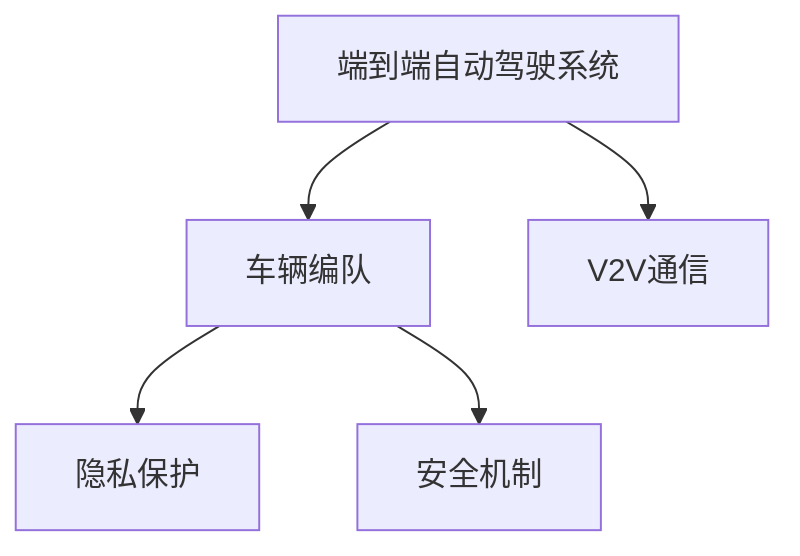

                 

# 端到端自动驾驶的车辆编队安全与隐私保护

## 1. 背景介绍

随着自动驾驶技术的不断成熟和普及，端到端自动驾驶系统已成为现代智能交通的重要组成部分。这种系统通过全栈式、端到端的集成，直接从感知层到决策层，再到执行层，实现车辆自主行驶、避障、编队等功能。然而，车辆编队在提升行驶效率的同时，也带来了新的安全与隐私挑战。

### 1.1 安全问题
车辆编队中的安全问题主要包括以下几个方面：

- **车辆间通信安全**：编队车辆通过车车通信(V2V)实现信息交换，网络通信易受到干扰和攻击，可能导致编队失效或车辆碰撞。
- **数据隐私泄露**：编队车辆需共享行驶数据以实现编队导航，这些数据可能被黑客窃取或滥用，带来隐私风险。
- **自动驾驶算法缺陷**：编队车辆依赖于高级驾驶辅助系统(ADAS)和自动驾驶算法，算法缺陷可能导致编队不稳定，甚至发生事故。

### 1.2 隐私问题
隐私问题主要涉及编队车辆的数据收集、处理和存储：

- **敏感数据收集**：编队系统需收集车辆位置、速度、姿态等信息，这些数据可能包含个人隐私和敏感信息。
- **数据存储风险**：大量数据存储在云端或本地设备上，可能遭受数据泄露或未授权访问。
- **第三方数据共享**：在共享数据用于编队导航时，需要谨慎处理第三方数据共享可能带来的隐私风险。

因此，如何在确保安全性的前提下，保护编队车辆的隐私，成为一个亟需解决的重要课题。

## 2. 核心概念与联系

### 2.1 核心概念概述

为更好地理解车辆编队的安全与隐私保护，本节将介绍几个核心概念：

- **端到端自动驾驶系统(End-to-End Autonomous Driving System)**：从感知层到决策层再到执行层的全栈式集成系统，实现车辆自主驾驶。
- **车辆编队(Vehicle Platoon)**：通过车车通信实现车辆间的紧密协调，以实现稳定、高效的编队行驶。
- **V2V通信(Vehicle-to-Vehicle Communication)**：车辆间通过无线通信技术，交换车辆状态和环境信息，实现车辆间的协同控制。
- **隐私保护(Privacy Protection)**：对个人敏感信息进行保护，防止数据泄露和未授权访问。
- **安全机制(Security Mechanisms)**：通过加密、认证、访问控制等手段，保护系统免受攻击和故障。

这些概念之间的逻辑关系可以通过以下Mermaid流程图来展示：

这个流程图展示了编队系统各组件之间的联系：

1. 编队系统通过全栈集成，实现自主驾驶。
2. V2V通信是编队的基础，车辆间通过通信进行信息交换。
3. 隐私保护和数据安全是编队系统的核心需求之一。
4. 安全机制保障了编队系统的稳定性和安全性。

## 3. 核心算法原理 & 具体操作步骤

### 3.1 算法原理概述

端到端自动驾驶的车辆编队安全与隐私保护，涉及多个子系统之间的协同运作，包括感知、决策、执行、通信、隐私保护和安全机制等。本节将从整体架构出发，系统介绍核心算法原理。

### 3.2 算法步骤详解

以下是端到端自动驾驶车辆编队安全与隐私保护的核心算法步骤：

**Step 1: 系统架构设计**
- 设计编队系统整体架构，明确各子系统之间的通信协议和数据格式。
- 定义V2V通信协议，确保数据交换的可靠性和安全性。
- 确定隐私保护策略，合理设计数据收集、存储和处理流程。
- 规划安全机制，包含加密、认证、访问控制等措施。

**Step 2: 数据收集与处理**
- 在编队车辆上安装传感器，收集环境数据和车辆状态信息。
- 对收集的数据进行预处理，包括数据清洗、去噪、归一化等操作。
- 使用差分隐私等技术，对敏感数据进行匿名化处理。
- 在车车通信和车路协同中，采用数据加密技术，保护数据传输的安全性。

**Step 3: 决策与控制**
- 利用深度学习等技术，对感知数据进行特征提取和语义理解。
- 设计车辆编队规则，包括跟随控制、位置保持、避障策略等。
- 在决策过程中，引入强化学习等技术，优化编队车辆的控制策略。
- 实施冗余控制，通过多车协同、任务分配等方法，提高编队的鲁棒性和可靠性。

**Step 4: 安全与隐私保护**
- 在V2V通信中，使用数字证书和公钥基础设施(PKI)进行身份认证。
- 采用密码学技术，如消息认证码(MAC)、数字签名等，保护通信数据的完整性和真实性。
- 实施访问控制，确保只有授权用户和系统能够访问敏感数据。
- 定期进行安全审计，检测和修补系统漏洞，提升系统安全性。

**Step 5: 测试与部署**
- 在模拟环境中进行编队系统的测试，验证算法性能和安全保护效果。
- 在实际道路上进行编队车辆的多车协同测试，确保系统的稳定性和安全性。
- 部署编队系统，对车辆进行标定和参数优化，确保编队效果和安全。

### 3.3 算法优缺点

端到端自动驾驶车辆编队的安全与隐私保护算法具有以下优点：

- **综合性强**：通过系统设计，集成了感知、决策、执行、通信和安全等多方面措施，全面提升系统性能。
- **可靠性高**：通过冗余控制和多车协同，增强了编队系统的鲁棒性和可靠性。
- **安全性好**：通过加密、认证、访问控制等措施，确保系统免受攻击和数据泄露风险。

同时，该算法也存在一些局限性：

- **技术复杂**：涉及多种技术领域，实现难度较大，需要高度集成的工程能力。
- **成本高**：传感器、通信设备等硬件设施成本较高，增加了系统部署成本。
- **数据需求大**：需要大量的数据进行训练和优化，数据收集和处理成本较高。

尽管存在这些局限性，但该算法提供了一个全面的框架，有助于指导编队系统在实际应用中的安全与隐私保护。未来需要在技术简化、成本降低和数据优化等方面进行持续改进。

### 3.4 算法应用领域

端到端自动驾驶车辆编队的安全与隐私保护算法，已在多个实际应用场景中得到了应用，例如：

- **高速公路编队**：通过V2V通信，实现车辆间的紧密协调，提升高速公路通行效率。
- **城市交通管理**：在城市道路上，通过编队车辆减少车流拥堵，改善交通状况。
- **物流配送**：利用编队车辆减少物流成本，提高配送效率和安全性。
- **应急救援**：在灾害现场，通过编队车辆进行快速响应和协调，提高救援效率。

## 4. 数学模型和公式 & 详细讲解 & 举例说明

### 4.1 数学模型构建

本节将使用数学语言对端到端自动驾驶车辆编队安全与隐私保护的核心算法进行更加严格的刻画。

假设编队系统中有 $N$ 辆车辆，车辆 $i$ 的位置为 $x_i(t)$，速度为 $v_i(t)$，状态为 $s_i(t)$，车车通信消息为 $m_{ij}(t)$。编队规则可以表示为以下数学模型：

$$
\min_{x_i(t), v_i(t), m_{ij}(t)} \sum_{i=1}^N \left[ f_i(x_i(t), v_i(t), s_i(t)) + \sum_{j \neq i} g_{ij}(x_i(t), x_j(t), m_{ij}(t)) \right]
$$

其中 $f_i$ 为车辆 $i$ 的性能指标，$g_{ij}$ 为车辆 $i$ 和 $j$ 间的编队指标。模型约束条件包括车辆动力学方程、通信协议等。

### 4.2 公式推导过程

以下我们以车辆编队规则为例，推导最优编队策略的计算公式。

假设编队车辆遵循以下简化的跟随控制策略：车辆 $i$ 以车辆 $j$ 的速度为基准，通过调整车速 $v_i$ 实现与车辆 $j$ 的固定距离保持。设车辆 $j$ 为领头车，车辆 $i$ 为跟随车，编队距离为 $d_{ij}$，速度偏差为 $\Delta v_{ij}$。则编队规则可以表示为：

$$
v_i(t) = v_j(t) + k_i\Delta v_{ij}(t) + b_i
$$

其中 $k_i$ 为跟随系数，$b_i$ 为跟随车辆的基础速度。假设编队距离 $d_{ij}$ 为固定值，车辆 $j$ 的速度 $v_j(t)$ 服从一定分布 $p(v_j)$，则最优编队策略的期望成本为：

$$
J = \mathbb{E} \left[ \int_0^{T} \left[ f_i(x_i(t), v_i(t), s_i(t)) + g_{ij}(x_i(t), x_j(t), m_{ij}(t)) \right] dt \right]
$$

通过求解上述优化问题，可以计算出最优编队策略，实现编队车辆的稳定行驶。

### 4.3 案例分析与讲解

以高速公路编队为例，分析编队规则和控制策略。

在高速公路上，编队车辆通过V2V通信交换车辆位置、速度和编队距离等信息，实现动态编队。假设编队车辆在紧急制动时，通过差分隐私技术，对车辆位置信息进行匿名化处理，防止信息泄露。同时，使用公钥加密技术，保护车车通信数据的机密性和完整性。编队规则和控制策略如下：

1. 跟随控制：车辆 $i$ 以车辆 $j$ 的速度为基准，通过调整车速 $v_i$ 实现与车辆 $j$ 的固定距离保持。
2. 位置保持：通过差分隐私技术，保护车辆位置信息的隐私。
3. 避障策略：根据前方车辆和障碍物的位置，动态调整编队距离和车速，确保安全行驶。
4. 通信协议：采用公钥加密技术，保护车车通信数据的机密性和完整性。

通过以上措施，编队车辆在保证行驶安全和效率的同时，也保护了数据的隐私和安全性。

## 5. 项目实践：代码实例和详细解释说明

### 5.1 开发环境搭建

在进行车辆编队安全与隐私保护的实践前，我们需要准备好开发环境。以下是使用Python进行Simulink仿真的环境配置流程：

1. 安装Simulink：从MATLAB官网下载并安装Simulink，用于搭建和仿真车辆编队系统。
2. 安装MATLAB：从MATLAB官网下载并安装MATLAB，用于编写和调试Simulink模型。
3. 安装必要的工具箱：安装Simulink Control Design、Simulink Hardware Tools等必要的工具箱。
4. 安装相关插件：安装Data Acquisition Toolbox、Vehicle and Autonomous Systems Toolbox等插件，支持车辆传感器数据处理。

完成上述步骤后，即可在MATLAB环境中进行车辆编队的仿真与测试。

### 5.2 源代码详细实现

下面以Simulink为例，给出使用Simulink搭建车辆编队系统的代码实现。

1. 在Simulink中，创建编队车辆模型，包含车辆传感器、控制器、通信模块等组件。
2. 在控制器模块中，设计编队规则和控制策略，包括跟随控制、位置保持、避障策略等。
3. 在通信模块中，实现车车通信协议，采用公钥加密技术保护通信数据。
4. 在数据采集模块中，模拟车辆传感器数据，包括环境数据、车辆状态数据等。
5. 在仿真环境中，进行编队系统测试，评估编队效果和安全性能。

### 5.3 代码解读与分析

让我们再详细解读一下关键代码的实现细节：

**Simulink模型构建**：
- 在Simulink中，创建编队车辆模型，包含车辆传感器、控制器、通信模块等组件。
- 传感器模块模拟车辆的环境数据和车辆状态数据。
- 控制器模块设计编队规则和控制策略，包括跟随控制、位置保持、避障策略等。
- 通信模块实现车车通信协议，采用公钥加密技术保护通信数据。
- 数据采集模块模拟车辆传感器数据，包括环境数据、车辆状态数据等。

**测试与评估**：
- 在仿真环境中，进行编队系统测试，评估编队效果和安全性能。
- 使用Simulink Control Design工具箱，优化编队车辆的动态控制策略。
- 使用Simulink Hardware Tools工具箱，在真实车辆上进行编队系统的标定和优化。
- 定期进行安全审计，检测和修补系统漏洞，提升系统安全性。

## 6. 实际应用场景

### 6.1 高速公路编队

在高速公路上，通过车辆编队技术，可以实现车流动态分配，提高通行效率，减少车辆等待时间和燃油消耗。编队系统通过车车通信交换车辆位置和速度信息，实现紧密协调。同时，采用差分隐私技术保护车辆位置信息，防止信息泄露。编队车辆按照预设的编队距离和速度基准，通过跟随控制和避障策略，保持稳定的编队效果。

### 6.2 城市交通管理

在城市道路上，编队系统可以通过车辆编队技术，减少车辆间的冲突，优化交通流量。编队系统通过车车通信交换车辆位置和速度信息，实现动态编队。同时，采用差分隐私技术保护车辆位置信息，防止信息泄露。编队车辆按照预设的编队距离和速度基准，通过跟随控制和避障策略，保持稳定的编队效果。

### 6.3 物流配送

在物流配送中，编队系统可以通过车辆编队技术，减少物流成本，提高配送效率。编队系统通过车车通信交换车辆位置和速度信息，实现紧密协调。同时，采用差分隐私技术保护车辆位置信息，防止信息泄露。编队车辆按照预设的编队距离和速度基准，通过跟随控制和避障策略，保持稳定的编队效果。

### 6.4 应急救援

在灾害现场，编队系统可以通过车辆编队技术，实现快速响应和协调，提高救援效率。编队系统通过车车通信交换车辆位置和速度信息，实现动态编队。同时，采用差分隐私技术保护车辆位置信息，防止信息泄露。编队车辆按照预设的编队距离和速度基准，通过跟随控制和避障策略，保持稳定的编队效果。

## 7. 工具和资源推荐

### 7.1 学习资源推荐

为了帮助开发者系统掌握车辆编队安全与隐私保护的理论基础和实践技巧，这里推荐一些优质的学习资源：

1. Simulink官方文档：详细介绍了Simulink的使用方法和实践技巧，是学习和使用Simulink的重要参考资料。
2. Simulink Control Design工具箱：提供了丰富的控制算法和工具箱，帮助用户进行车辆控制策略的设计和优化。
3. Simulink Hardware Tools工具箱：支持在真实车辆上进行编队系统的标定和优化，提供完整的实验支持。
4. MATLAB官方文档：详细介绍了MATLAB的使用方法和实践技巧，是学习和使用MATLAB的重要参考资料。
5. Vehicle and Autonomous Systems Toolbox：支持在Simulink中建模和仿真车辆传感器和控制算法。

通过对这些资源的学习实践，相信你一定能够快速掌握车辆编队安全与隐私保护的核心技术，并用于解决实际的工程问题。

### 7.2 开发工具推荐

高效的开发离不开优秀的工具支持。以下是几款用于车辆编队安全与隐私保护开发的常用工具：

1. Simulink：MATLAB下的仿真工具，支持建模、仿真和测试，广泛应用于车辆控制和系统设计。
2. MATLAB：数学计算和仿真工具，提供丰富的工具箱和插件，支持车辆编队系统的设计与测试。
3. Data Acquisition Toolbox：支持车辆传感器数据采集和处理，支持在真实车辆上进行编队系统的标定和优化。
4. Vehicle and Autonomous Systems Toolbox：支持在Simulink中建模和仿真车辆传感器和控制算法。
5. Simulink Hardware Tools：支持在真实车辆上进行编队系统的标定和优化，提供完整的实验支持。

合理利用这些工具，可以显著提升车辆编队安全与隐私保护的开发效率，加快创新迭代的步伐。

### 7.3 相关论文推荐

车辆编队安全与隐私保护技术的发展源于学界的持续研究。以下是几篇奠基性的相关论文，推荐阅读：

1. "Vehicle Platoon Control with Communication Constraints"：介绍了基于通信约束的车辆编队控制策略，强调车车通信在编队中的重要性。
2. "Privacy-Preserving Communication in Vehicle-to-Vehicle Networks"：探讨了差分隐私技术在车辆编队系统中的应用，强调保护车辆位置信息的隐私性。
3. "End-to-End Autonomous Vehicle Platoon Control"：介绍了端到端车辆编队的控制策略，强调系统集成和优化。
4. "Secure Communication Protocols for Vehicle-to-Vehicle Networks"：介绍了车车通信中的安全协议，强调公钥加密技术在保护通信数据中的应用。
5. "Privacy Preservation in Vehicle-to-Everything Communication"：探讨了车辆与环境通信中的隐私保护技术，强调保护车辆数据的隐私性。

这些论文代表了大语言模型微调技术的发展脉络。通过学习这些前沿成果，可以帮助研究者把握学科前进方向，激发更多的创新灵感。

## 8. 总结：未来发展趋势与挑战

### 8.1 总结

本文对端到端自动驾驶车辆编队安全与隐私保护方法进行了全面系统的介绍。首先阐述了车辆编队系统在现代智能交通中的重要性，以及所面临的安全与隐私挑战。其次，从整体架构出发，系统介绍了核心算法原理和具体操作步骤。同时，本文还广泛探讨了编队系统在实际应用中的安全与隐私保护策略，展示了编队范式的广阔应用前景。最后，本文精选了编队系统的学习资源和开发工具，力求为读者提供全方位的技术指引。

通过本文的系统梳理，可以看到，车辆编队系统在提升交通效率、减少能源消耗、保障交通安全等方面具有巨大潜力。未来，随着技术的持续演进，编队系统必将在智能交通领域发挥越来越重要的作用，为社会带来深远的影响。

### 8.2 未来发展趋势

展望未来，车辆编队系统将呈现以下几个发展趋势：

1. **技术集成度更高**：未来编队系统将集感知、决策、执行、通信和安全等多方面技术于一体，实现全栈集成。
2. **安全性更好**：通过多层次的安全机制和冗余控制，确保编队系统的稳定性。
3. **隐私保护更完善**：采用差分隐私等技术，保护车辆数据的隐私性，防止数据泄露和滥用。
4. **自动化水平更高**：通过强化学习和深度学习等技术，实现编队规则和控制策略的自动优化。
5. **跨领域融合更深入**：编队系统将与物联网、大数据、人工智能等技术深度融合，实现更智能、更高效的车辆编队。

以上趋势凸显了车辆编队系统的广阔前景。这些方向的探索发展，必将进一步提升编队系统的性能和应用范围，为智能交通带来新的突破。

### 8.3 面临的挑战

尽管车辆编队系统已经取得了显著成果，但在迈向更加智能化、普适化应用的过程中，它仍面临着诸多挑战：

1. **技术复杂度高**：编队系统涉及多种技术领域，实现难度较大，需要高度集成的工程能力。
2. **成本高**：传感器、通信设备等硬件设施成本较高，增加了系统部署成本。
3. **数据需求大**：需要大量的数据进行训练和优化，数据收集和处理成本较高。
4. **安全风险高**：车辆编队系统面临网络攻击、数据泄露等风险，需要持续的安全防护措施。
5. **隐私保护难度大**：车辆数据涉及隐私敏感信息，如何平衡数据利用和隐私保护是一大挑战。

尽管存在这些挑战，但编队系统为智能交通带来了新的希望，未来需要在技术简化、成本降低和数据优化等方面进行持续改进。

### 8.4 研究展望

面向未来，车辆编队系统的研究需要在以下几个方面寻求新的突破：

1. **技术简化**：通过引入更简单、更高效的技术，降低系统实现的难度和成本。
2. **成本降低**：通过硬件优化和软件创新，降低系统部署成本，推动编队技术在实际应用中的普及。
3. **数据优化**：通过数据压缩、数据合成等技术，提高数据利用效率，降低数据处理成本。
4. **安全增强**：通过引入区块链、联邦学习等技术，提升编队系统的安全性。
5. **隐私保护**：通过多方安全计算、隐私计算等技术，保护车辆数据的隐私性。
6. **跨领域融合**：将编队系统与物联网、大数据、人工智能等技术深度融合，实现更智能、更高效的车辆编队。

这些研究方向的探索，必将引领车辆编队技术迈向更高的台阶，为智能交通带来新的突破。面向未来，车辆编队系统需要在技术简化、成本降低和数据优化等方面进行持续改进，从而实现全栈集成、智能高效、安全可靠的车辆编队系统。

## 9. 附录：常见问题与解答

**Q1: 车辆编队系统在实际应用中，如何保证编队稳定性？**

A: 在车辆编队系统中，编队稳定性主要依赖于合理的编队规则和控制策略。可以通过以下方法保证编队稳定性：
1. 跟随控制：车辆 $i$ 以车辆 $j$ 的速度为基准，通过调整车速 $v_i$ 实现与车辆 $j$ 的固定距离保持。
2. 位置保持：通过差分隐私技术，保护车辆位置信息的隐私。
3. 避障策略：根据前方车辆和障碍物的位置，动态调整编队距离和车速，确保安全行驶。
4. 通信协议：采用公钥加密技术，保护车车通信数据的机密性和完整性。

**Q2: 在车辆编队系统中，如何保护车辆数据的隐私？**

A: 在车辆编队系统中，保护车辆数据的隐私主要依赖于差分隐私技术。具体实现如下：
1. 数据收集：通过传感器收集车辆的位置、速度、姿态等数据。
2. 数据预处理：对数据进行清洗、去噪、归一化等预处理操作。
3. 数据匿名化：通过差分隐私技术，对数据进行匿名化处理，保护隐私。
4. 数据存储：将匿名化后的数据存储在本地设备或云端，防止数据泄露。
5. 数据访问控制：采用访问控制技术，确保只有授权用户和系统能够访问敏感数据。

**Q3: 在车辆编队系统中，如何保证系统安全性？**

A: 在车辆编队系统中，保证系统安全性主要依赖于以下措施：
1. 身份认证：采用数字证书和公钥基础设施(PKI)进行身份认证，确保通信方的身份合法性。
2. 数据加密：采用公钥加密技术，保护车车通信数据的机密性和完整性。
3. 访问控制：确保只有授权用户和系统能够访问敏感数据，防止未授权访问。
4. 安全审计：定期进行安全审计，检测和修补系统漏洞，提升系统安全性。

**Q4: 在车辆编队系统中，如何实现车辆编队的动态控制？**

A: 在车辆编队系统中，实现车辆编队的动态控制主要依赖于以下方法：
1. 感知数据：通过车辆传感器收集环境数据和车辆状态数据。
2. 数据预处理：对数据进行清洗、去噪、归一化等预处理操作。
3. 编队规则：设计编队规则和控制策略，包括跟随控制、位置保持、避障策略等。
4. 实时优化：根据感知数据和编队规则，实时计算最优编队策略，控制车辆行驶。

**Q5: 在车辆编队系统中，如何优化编队车辆的动态控制策略？**

A: 在车辆编队系统中，优化编队车辆的动态控制策略主要依赖于以下方法：
1. 数据采集：通过传感器采集车辆位置、速度、姿态等数据。
2. 数据预处理：对数据进行清洗、去噪、归一化等预处理操作。
3. 优化算法：使用深度学习、强化学习等技术，优化编队车辆的动态控制策略。
4. 模型训练：使用训练数据进行模型训练，提升控制策略的准确性和鲁棒性。

通过以上方法，可以实现编队车辆的动态控制和优化，提高编队的稳定性和效率。

---

作者：禅与计算机程序设计艺术 / Zen and the Art of Computer Programming

