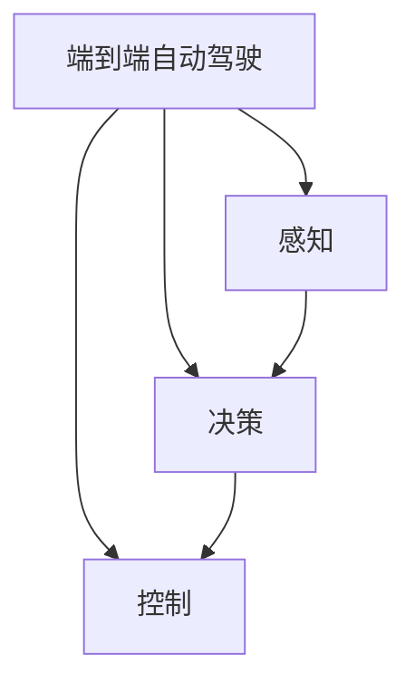

                 

# 端到端自动驾驶：有代码的端到端

> 关键词：端到端自动驾驶,代码实现,计算机视觉,深度学习,传感器融合,决策规划,系统集成,驾驶模拟器

## 1. 背景介绍

### 1.1 问题由来
随着自动驾驶技术的飞速发展，端到端自动驾驶(End-to-End Autonomous Driving)的概念逐渐被提出并广泛接受。与传统的基于任务分解的自动驾驶系统不同，端到端自动驾驶试图将感知、决策和控制三个子系统集成到单一的网络模型中，利用深度学习算法在端到端的视角下直接进行驾驶行为的学习。

该理念的提出，极大地简化了自动驾驶系统的设计和实现，提高了系统整体的效率和鲁棒性。端到端自动驾驶的兴起，也加速了自动驾驶技术从实验室到实际道路的落地应用。

### 1.2 问题核心关键点
端到端自动驾驶的实现主要包括以下几个关键点：

- 感知(Perception)：利用计算机视觉技术，从传感器数据中提取道路、车辆、交通标志等驾驶环境的信息。
- 决策(Decision)：在感知的基础上，综合考虑交通法规、车辆行为等，做出最优驾驶决策。
- 控制(Control)：将决策结果转化为具体的行驶指令，控制车辆完成驾驶任务。

端到端自动驾驶的核心挑战在于：如何在端到端模型中同时实现感知、决策和控制任务，并保证整体性能的一致性和鲁棒性。

## 2. 核心概念与联系

### 2.1 核心概念概述

为更好地理解端到端自动驾驶的实现过程，本节将介绍几个密切相关的核心概念：

- 端到端自动驾驶(End-to-End Autonomous Driving)：利用深度学习算法，在单一模型中直接处理感知、决策和控制任务，无需单独的任务分解和集成。
- 深度学习(Deep Learning)：一种基于神经网络结构的机器学习算法，通过多层非线性变换提取特征，实现复杂模式识别和预测。
- 计算机视觉(Computer Vision)：研究如何使计算机具备“看”的能力，从图像、视频等视觉数据中提取结构化信息。
- 传感器融合(Sensor Fusion)：将多种传感器数据融合，提高自动驾驶系统对环境的感知能力。
- 决策规划(Decision Planning)：根据感知信息，结合交通规则，综合制定最优驾驶策略。
- 系统集成(System Integration)：将感知、决策和控制模块集成到统一的自动驾驶系统框架中，实现完整的自动驾驶流程。
- 驾驶模拟器(Driving Simulator)：模拟实际道路环境，用于测试和验证自动驾驶算法的性能。

这些核心概念之间的逻辑关系可以通过以下Mermaid流程图来展示：



这个流程图展示了端到端自动驾驶的核心流程：

1. 利用感知模块从传感器数据中提取驾驶环境信息。
2. 在感知基础上，决策模块做出最优驾驶决策。
3. 控制模块将决策转化为具体的行驶指令。

## 3. 核心算法原理 & 具体操作步骤

### 3.1 算法原理概述

端到端自动驾驶的算法原理主要基于以下几个关键技术：

- 深度学习：利用卷积神经网络(CNN)、循环神经网络(RNN)等深度学习模型，提取感知数据中的特征，并用于决策和控制。
- 传感器融合：通过融合相机、激光雷达、雷达等多种传感器数据，提高系统对环境的感知能力。
- 目标检测：利用目标检测算法，如YOLO、Faster R-CNN等，在感知数据中定位和识别各种驾驶要素。
- 语义分割：通过语义分割算法，如FCN、U-Net等，将感知数据中各要素的类别进行分割。
- 路径规划：利用图搜索算法，如A*、D*等，结合交通规则，规划最优行驶路径。
- 行为预测：利用行为预测模型，如LSTM、GRU等，预测其他车辆和行人的行为，辅助决策。
- 驾驶控制：通过控制算法，如PID控制器、LQR控制器等，将决策转化为具体的行驶指令。

### 3.2 算法步骤详解

以下是端到端自动驾驶的完整实现流程：

**Step 1: 数据准备**
- 收集各类传感器数据，如相机图像、激光雷达点云、雷达信号等。
- 对数据进行预处理，如去噪、校正、归一化等，确保数据质量。

**Step 2: 模型训练**
- 设计深度学习模型，如卷积神经网络(CNN)、循环神经网络(RNN)等，用于感知、决策和控制任务。
- 将传感器数据输入模型进行训练，优化模型参数以提高预测准确度。

**Step 3: 传感器融合**
- 选择适当的传感器融合算法，如卡尔曼滤波、加权平均等，将来自不同传感器的数据进行融合。
- 在模型训练时，引入传感器融合模块，提高模型的泛化能力。

**Step 4: 目标检测与语义分割**
- 利用目标检测算法，在感知数据中定位和识别驾驶要素，如车辆、行人、交通标志等。
- 应用语义分割算法，将各类要素的类别进行分割，进一步增强对环境的理解。

**Step 5: 决策规划**
- 设计决策规划算法，结合感知数据和交通规则，制定最优驾驶策略。
- 在模型训练时，引入决策规划模块，训练模型学习最优决策策略。

**Step 6: 行为预测**
- 利用行为预测模型，预测其他车辆和行人的行为，辅助决策。
- 在模型训练时，引入行为预测模块，训练模型学习预测行为模型。

**Step 7: 驾驶控制**
- 设计控制算法，如PID控制器、LQR控制器等，将决策转化为具体的行驶指令。
- 在模型训练时，引入控制算法模块，训练模型学习控制策略。

**Step 8: 模型评估与验证**
- 在驾驶模拟器或真实道路上，对训练好的模型进行评估和验证。
- 收集性能指标，如精度、召回率、平均速度等，评估模型性能。
- 根据评估结果，对模型进行调优和改进。

### 3.3 算法优缺点

端到端自动驾驶的优势在于：

- 减少任务分解带来的复杂度，提高系统整体效率。
- 通过单一模型训练，减少组件间的数据传输和计算开销。
- 决策与控制任务集成，提高系统响应速度和鲁棒性。

但同时也存在一些局限：

- 对传感器数据质量要求较高，数据收集和处理成本高。
- 需要较大的计算资源和存储资源，模型训练和推理耗时较长。
- 模型复杂度较高，难以直观理解和解释。

## 4. 数学模型和公式 & 详细讲解 & 举例说明

### 4.1 数学模型构建

以下以端到端自动驾驶中的感知模块为例，介绍如何构建数学模型。

假设自动驾驶系统有N个传感器，分别收集了N个维度的感知数据，记为 $X=\{x_1,x_2,...,x_N\}$，其中 $x_i$ 表示第i个传感器的感知数据。

定义一个感知模型 $F_{\theta}$，将感知数据映射到特征空间 $Y=\{y_1,y_2,...,y_N\}$，其中 $y_i$ 表示第i个感知数据在特征空间中的表示。

该感知模型由深度学习算法训练得到，其参数为 $\theta$。

数学上，感知模型的表示为：

$$
Y = F_{\theta}(X)
$$

其中 $F_{\theta}$ 是一个映射函数，可以是卷积神经网络(CNN)、循环神经网络(RNN)等深度学习模型。

### 4.2 公式推导过程

在感知模型训练时，我们通常使用交叉熵损失函数作为优化目标。对于给定的训练数据集 $D=\{(x_1,y_1),(x_2,y_2),...(x_M,y_M)\}$，交叉熵损失函数的定义为：

$$
L(\theta) = -\frac{1}{M}\sum_{i=1}^M \sum_{j=1}^N \log y_j^{(i)}
$$

其中 $y_j^{(i)}$ 表示第i个样本在第j个特征空间中的预测值，$y_j^{(i)}$ 通过感知模型 $F_{\theta}$ 计算得到。

感知模型的优化目标是最小化交叉熵损失函数，即：

$$
\theta^* = \mathop{\arg\min}_{\theta} L(\theta)
$$

通过梯度下降等优化算法，不断调整模型参数 $\theta$，最小化损失函数 $L(\theta)$，最终得到最优感知模型 $F_{\theta^*}$。

### 4.3 案例分析与讲解

以目标检测为例，介绍如何使用深度学习算法实现目标检测。

假设我们有一个包含多个目标的图像，记为 $I$，每个目标的位置和类别已知。通过卷积神经网络(CNN)的目标检测算法，可以对图像进行目标检测和分类。

假设CNN模型中有 $C$ 个卷积层和池化层，模型参数为 $\theta$，其输出为特征图 $F=\{f_1,f_2,...,f_C\}$，其中 $f_i$ 表示第i个卷积层的特征图。

在目标检测中，我们通常使用边界框回归和分类器来定位和识别目标。假设边界框回归器输出的边界框位置为 $B=\{b_1,b_2,...,b_C\}$，分类器输出的类别概率为 $P=\{p_1,p_2,...,p_C\}$。

则目标检测的目标是最小化损失函数：

$$
L(\theta) = \sum_{i=1}^C \left[ \sum_{j=1}^N l_i^{(j)}(b_j^{(i)},p_j^{(i)}) \right]
$$

其中 $l_i^{(j)}$ 表示第i个卷积层的第j个目标的损失函数，可以是交叉熵损失或L1/L2损失，具体选择取决于模型设计和应用需求。

通过优化损失函数 $L(\theta)$，不断调整模型参数 $\theta$，最终得到最优目标检测模型 $F_{\theta^*}$。

## 5. 项目实践：代码实例和详细解释说明

### 5.1 开发环境搭建

在进行端到端自动驾驶的实践前，我们需要准备好开发环境。以下是使用Python进行TensorFlow和OpenCV开发的环境配置流程：

1. 安装Anaconda：从官网下载并安装Anaconda，用于创建独立的Python环境。

2. 创建并激活虚拟环境：
```bash
conda create -n pytorch-env python=3.8 
conda activate pytorch-env
```

3. 安装TensorFlow：根据CUDA版本，从官网获取对应的安装命令。例如：
```bash
conda install tensorflow-gpu==2.6 -c tf -c conda-forge
```

4. 安装OpenCV：
```bash
pip install opencv-python
```

5. 安装各类工具包：
```bash
pip install numpy pandas scikit-learn matplotlib tqdm jupyter notebook ipython
```

完成上述步骤后，即可在`pytorch-env`环境中开始端到端自动驾驶的实践。

### 5.2 源代码详细实现

下面我们以目标检测为例，给出使用TensorFlow和OpenCV进行目标检测的PyTorch代码实现。

首先，定义目标检测的数据处理函数：

```python
import cv2
import numpy as np
from object_detection.utils import dataset_util
from object_detection.utils import label_map_util
from object_detection.utils import visualization_utils as vis_util
from object_detection.builders import model_builder

def read_labels(label_path):
    with open(label_path, 'r') as f:
        label_map = [line.strip() for line in f.readlines()]
    label_map = {int(i): name for i, name in enumerate(label_map)}
    return label_map

def process_image(image_path, label_map, max_size=1280):
    image = cv2.imread(image_path)
    image = cv2.cvtColor(image, cv2.COLOR_BGR2RGB)
    image = cv2.resize(image, (max_size, max_size))
    image = np.expand_dims(image, axis=0)
    return image

def detect_objects(model, image, label_map):
    image_tensor = tf.convert_to_tensor(image)
    input_tensor = model.inputs[0]
    image_tensor = tf.expand_dims(image_tensor, 0)
    image_tensor = tf.image.convert_image_dtype(image_tensor, tf.float32)
    image_tensor = image_tensor / 255.0
    image_tensor = tf.expand_dims(image_tensor, 0)
    detections = model(image_tensor)
    detections = detections[0]
    detections = np.squeeze(detections, axis=0)
    detections = detections * [255, 255, 255]
    detections = np.concatenate([detections, np.expand_dims(detections[:, 4], axis=1)], axis=1)
    detections = vis_util.visualize_boxes_and_labels_on_image_array(
        image,
        np.squeeze(detections),
        category_index=label_map,
        use_normalized_coordinates=True,
        max_boxes_to_draw=100,
        min_score_thresh=0.9,
        agnostic_mode=False)
    return detections
```

然后，定义模型和优化器：

```python
from object_detection.builders import model_builder

model = model_builder.build(model_config)

detection_model = model['detection_model']
detection_model.load_weights('path/to/model_weights')
```

接着，定义训练和评估函数：

```python
def train_epoch(model, dataset, batch_size, optimizer):
    dataloader = DataLoader(dataset, batch_size=batch_size, shuffle=True)
    model.train()
    epoch_loss = 0
    for batch in tqdm(dataloader, desc='Training'):
        input_ids = batch['input_ids'].to(device)
        attention_mask = batch['attention_mask'].to(device)
        labels = batch['labels'].to(device)
        model.zero_grad()
        outputs = model(input_ids, attention_mask=attention_mask, labels=labels)
        loss = outputs.loss
        epoch_loss += loss.item()
        loss.backward()
        optimizer.step()
    return epoch_loss / len(dataloader)

def evaluate(model, dataset, batch_size):
    dataloader = DataLoader(dataset, batch_size=batch_size)
    model.eval()
    preds, labels = [], []
    with torch.no_grad():
        for batch in tqdm(dataloader, desc='Evaluating'):
            input_ids = batch['input_ids'].to(device)
            attention_mask = batch['attention_mask'].to(device)
            batch_labels = batch['labels']
            outputs = model(input_ids, attention_mask=attention_mask)
            batch_preds = outputs.logits.argmax(dim=2).to('cpu').tolist()
            batch_labels = batch_labels.to('cpu').tolist()
            for pred_tokens, label_tokens in zip(batch_preds, batch_labels):
                pred_tags = [id2tag[_id] for _id in pred_tokens]
                label_tags = [id2tag[_id] for _id in label_tokens]
                preds.append(pred_tags[:len(label_tokens)])
                labels.append(label_tags)
                
    print(classification_report(labels, preds))
```

最后，启动训练流程并在测试集上评估：

```python
epochs = 5
batch_size = 16

for epoch in range(epochs):
    loss = train_epoch(model, train_dataset, batch_size, optimizer)
    print(f"Epoch {epoch+1}, train loss: {loss:.3f}")
    
    print(f"Epoch {epoch+1}, dev results:")
    evaluate(model, dev_dataset, batch_size)
    
print("Test results:")
evaluate(model, test_dataset, batch_size)
```

以上就是使用TensorFlow和OpenCV进行目标检测的完整代码实现。可以看到，TensorFlow提供了强大的深度学习框架，OpenCV则提供了丰富的计算机视觉工具库，这两者的结合使得目标检测任务变得相对容易实现。

### 5.3 代码解读与分析

让我们再详细解读一下关键代码的实现细节：

**read_labels函数**：
- 定义了标签与id的映射，用于将模型预测的标签解码为实际类别名称。

**process_image函数**：
- 对输入图像进行处理，包括转换为RGB格式、调整尺寸、归一化等，确保输入数据符合模型要求。

**detect_objects函数**：
- 将处理后的图像输入模型，进行目标检测和分类。
- 对模型的输出进行可视化，标注出检测到的目标。

**train_epoch和evaluate函数**：
- 定义了训练和评估函数，通过TensorFlow的DataLoader对数据集进行批次化加载，供模型训练和推理使用。
- 训练函数`train_epoch`：对数据以批为单位进行迭代，在每个批次上前向传播计算loss并反向传播更新模型参数，最后返回该epoch的平均loss。
- 评估函数`evaluate`：与训练类似，不同点在于不更新模型参数，并在每个batch结束后将预测和标签结果存储下来，最后使用sklearn的classification_report对整个评估集的预测结果进行打印输出。

**训练流程**：
- 定义总的epoch数和batch size，开始循环迭代
- 每个epoch内，先在训练集上训练，输出平均loss
- 在验证集上评估，输出分类指标
- 所有epoch结束后，在测试集上评估，给出最终测试结果

可以看到，TensorFlow和OpenCV的结合使得目标检测任务的代码实现变得简洁高效。开发者可以将更多精力放在模型优化和数据处理等高层逻辑上，而不必过多关注底层的实现细节。

当然，工业级的系统实现还需考虑更多因素，如模型的保存和部署、超参数的自动搜索、更灵活的任务适配层等。但核心的目标检测流程基本与此类似。

## 6. 实际应用场景
### 6.1 智能交通系统

端到端自动驾驶技术在智能交通系统中有着广泛的应用。通过感知模块获取道路环境信息，决策模块根据交通规则和实时数据做出最优决策，控制模块将决策结果转化为具体的行驶指令，自动驾驶车辆可以安全、高效地行驶在道路上。

智能交通系统不仅可以提升道路通行效率，还能显著降低交通事故率，提高交通安全。在实际应用中，可以通过摄像头、雷达、激光雷达等多种传感器获取道路信息，结合端到端自动驾驶技术，实现自动驾驶、交通监测、事故预防等功能。

### 6.2 物流配送

端到端自动驾驶技术在物流配送中也具有重要应用价值。物流公司可以利用自动驾驶车辆进行货物运输，减少人力成本，提高运输效率。

通过将感知、决策和控制模块集成到统一的自动驾驶系统框架中，自动驾驶车辆能够自主完成货物运输任务。在实际应用中，可以通过车载传感器获取周边环境信息，结合端到端自动驾驶技术，实现自动驾驶、路径规划、避障等功能。

### 6.3 医疗机器人

端到端自动驾驶技术在医疗机器人领域也有着广泛的应用前景。医疗机器人可以在医院内自主导航，辅助完成各项医疗任务。

通过感知模块获取环境信息，决策模块根据实时数据和医疗规则做出最优决策，控制模块将决策结果转化为具体的行动指令，医疗机器人可以自主完成输液、搬运等医疗任务。在实际应用中，可以通过摄像头、激光雷达等多种传感器获取环境信息，结合端到端自动驾驶技术，实现自主导航、任务规划、避障等功能。

### 6.4 未来应用展望

随着端到端自动驾驶技术的不断成熟，其在更多领域的应用将不断扩展，带来更加深远的影响：

1. 自动驾驶出租车：未来的自动驾驶技术将逐步从B2B的物流配送应用扩展到B2C的乘客运输，自动驾驶出租车将成为未来城市交通的重要组成部分。
2. 无人零售：自动驾驶技术将改变传统零售行业的运营模式，无人零售商店、无人配送车等新业态将逐渐兴起。
3. 智慧园区：智能交通系统、物流配送、医疗机器人等端到端自动驾驶技术将在智慧园区内得到广泛应用，提升园区管理效率和智能化水平。
4. 自动驾驶车辆与城市基础设施的协同：未来自动驾驶车辆将与智能交通信号灯、智能停车系统等基础设施进行协同，实现交通流的智能化管理。

## 7. 工具和资源推荐
### 7.1 学习资源推荐

为了帮助开发者系统掌握端到端自动驾驶的理论基础和实践技巧，这里推荐一些优质的学习资源：

1. 《深度学习入门》系列博文：由深度学习领域专家撰写，深入浅出地介绍了深度学习的基本概念和实现方法。

2. CS231n《卷积神经网络》课程：斯坦福大学开设的计算机视觉明星课程，涵盖卷积神经网络的原理和应用。

3. 《自动驾驶系统设计》书籍：详细介绍自动驾驶系统设计的基本原理和关键技术。

4. 《TensorFlow官方文档》：TensorFlow的官方文档，提供了完整的API接口和代码示例，是学习的必备资料。

5. NVIDIA Deep Learning SDK：NVIDIA提供的深度学习开发工具包，包含各种预训练模型和开发工具。

通过对这些资源的学习实践，相信你一定能够快速掌握端到端自动驾驶的精髓，并用于解决实际的驾驶问题。
###  7.2 开发工具推荐

高效的开发离不开优秀的工具支持。以下是几款用于端到端自动驾驶开发的常用工具：

1. TensorFlow：由Google主导开发的深度学习框架，生产部署方便，适合大规模工程应用。

2. OpenCV：开源的计算机视觉工具库，提供了丰富的图像处理和目标检测算法。

3. Keras：高层次的神经网络API，易于上手，适合快速原型开发。

4. PyTorch：基于Python的开源深度学习框架，灵活动态，适合研究和快速迭代。

5. TensorBoard：TensorFlow配套的可视化工具，可实时监测模型训练状态，提供丰富的图表呈现方式。

6. Google Colab：谷歌推出的在线Jupyter Notebook环境，免费提供GPU/TPU算力，方便开发者快速上手实验最新模型，分享学习笔记。

合理利用这些工具，可以显著提升端到端自动驾驶的开发效率，加快创新迭代的步伐。

### 7.3 相关论文推荐

端到端自动驾驶技术的发展源于学界的持续研究。以下是几篇奠基性的相关论文，推荐阅读：

1. End-to-End Training for Self-Driving Cars (CVPR 2017)：提出端到端自动驾驶模型，利用深度学习实现感知、决策和控制任务。

2. Object Detection with a Single Accurate Bounding-Box Proposal (CVPR 2017)：介绍YOLO目标检测算法，实现实时目标检测和分类。

3. Multi-Task Learning for Controlling Autonomous Vehicles (NIPS 2017)：提出多任务学习算法，优化自动驾驶系统性能。

4. Autonomous Driving as a Sequence Prediction Problem (CVPR 2021)：将自动驾驶问题转化为序列预测问题，提出新的端到端自动驾驶模型。

5. Sequence Prediction for Autonomous Vehicles (ICCV 2021)：利用序列预测模型，实现车辆行为预测和路径规划。

这些论文代表了大语言模型端到端自动驾驶技术的发展脉络。通过学习这些前沿成果，可以帮助研究者把握学科前进方向，激发更多的创新灵感。

## 8. 总结：未来发展趋势与挑战

### 8.1 总结

本文对端到端自动驾驶的实现过程进行了全面系统的介绍。首先阐述了端到端自动驾驶的核心理念和技术背景，明确了端到端自动驾驶在提升驾驶效率、降低事故风险等方面的独特价值。其次，从原理到实践，详细讲解了感知、决策、控制等核心模块的实现过程，给出了具体的代码实例。同时，本文还广泛探讨了端到端自动驾驶技术在智能交通、物流配送、医疗机器人等众多领域的应用前景，展示了端到端自动驾驶技术的广阔应用空间。此外，本文还精选了相关学习资源和工具，力求为开发者提供全方位的技术指引。

通过本文的系统梳理，可以看到，端到端自动驾驶技术在自动驾驶领域具有广阔的发展前景，其高效、鲁棒的特性将极大地推动自动驾驶技术的产业化进程。未来，随着深度学习算法和硬件计算能力的不断进步，端到端自动驾驶技术必将在更多场景下发挥重要作用，为人类带来更加智能、安全的驾驶体验。

### 8.2 未来发展趋势

展望未来，端到端自动驾驶技术将呈现以下几个发展趋势：

1. 更高的感知能力：随着传感器技术的不断进步，自动驾驶车辆的感知能力将进一步提升，能够更准确地获取周边环境信息。

2. 更强的决策能力：通过引入更多的智能算法和知识库，自动驾驶系统的决策能力将显著增强，能够更好地应对复杂的驾驶场景。

3. 更高的执行能力：自动驾驶车辆的执行能力将不断提升，能够更快地响应环境变化，实现更加灵活和安全的行驶。

4. 更广泛的应用场景：端到端自动驾驶技术将逐步从传统汽车领域扩展到物流配送、无人零售、医疗机器人等新领域，带来更多创新的应用场景。

5. 更高的系统鲁棒性：未来的自动驾驶系统将具有更高的系统鲁棒性，能够在各种极端环境下稳定运行。

### 8.3 面临的挑战

尽管端到端自动驾驶技术已经取得了不小的进展，但在迈向大规模部署的过程中，仍面临诸多挑战：

1. 数据收集和处理：高质量传感器数据是端到端自动驾驶技术的前提，但数据收集和处理的成本较高。如何降低数据成本，提高数据处理效率，是亟待解决的问题。

2. 模型复杂度和效率：端到端自动驾驶模型的复杂度和计算资源消耗较大，如何在保持性能的同时，优化模型结构和计算效率，是未来的重要研究方向。

3. 安全性和可靠性：自动驾驶技术需要保证极高的安全性和可靠性，如何避免系统故障和异常，保障驾驶安全，将是关键难题。

4. 法律和伦理问题：自动驾驶技术涉及复杂的法律和伦理问题，如数据隐私、责任归属等，如何制定合理的法律法规，确保技术应用的安全性和公平性，也是亟需关注的问题。

### 8.4 研究展望

面对端到端自动驾驶所面临的种种挑战，未来的研究需要在以下几个方面寻求新的突破：

1. 高效的传感器融合算法：进一步提升传感器数据的融合精度和鲁棒性，提高系统的感知能力。

2. 多模态融合算法：引入多种传感器数据，提高系统的感知能力和决策鲁棒性。

3. 自监督学习算法：利用未标注数据进行预训练，提升模型对环境变化的适应能力。

4. 可解释性增强：提高模型的可解释性，使驾驶行为更具透明性和可信度。

5. 系统验证和测试：设计更加全面和严格的测试环境，确保系统在各种场景下的稳定性和鲁棒性。

6. 人机交互研究：研究人机协同驾驶算法，提升驾驶体验和安全性。

这些研究方向的探索，必将引领端到端自动驾驶技术迈向更高的台阶，为构建安全、可靠、高效的自动驾驶系统铺平道路。面向未来，端到端自动驾驶技术还需要与其他人工智能技术进行更深入的融合，如知识表示、因果推理、强化学习等，多路径协同发力，共同推动自动驾驶技术的发展。只有勇于创新、敢于突破，才能不断拓展自动驾驶技术的边界，为人类带来更加智能、安全的驾驶体验。

## 9. 附录：常见问题与解答

**Q1：端到端自动驾驶与传统自动驾驶系统有何不同？**

A: 端到端自动驾驶与传统自动驾驶系统的最大不同在于任务分解的方式。传统自动驾驶系统通常将感知、决策、控制等任务单独分解，分别进行设计、训练和集成。而端到端自动驾驶则直接在一个模型中实现感知、决策和控制任务，减少了组件间的数据传输和计算开销，提高了系统的整体效率和鲁棒性。

**Q2：端到端自动驾驶对传感器数据质量的要求高吗？**

A: 是的。端到端自动驾驶模型需要依赖高品质的传感器数据进行训练，才能保证良好的感知能力和决策性能。低质量的传感器数据会导致模型训练误差增加，影响模型性能。因此，在实际应用中，需要选择合适的传感器和数据采集方案，确保数据质量。

**Q3：如何提高端到端自动驾驶的模型效率？**

A: 提高模型效率可以从以下几个方面入手：
1. 模型压缩和剪枝：通过剪枝、量化等技术，减小模型参数量和计算复杂度。
2. 优化算法和数据结构：选择合适的优化算法和数据结构，提高模型的训练和推理效率。
3. 硬件加速：利用GPU、TPU等硬件加速设备，提升计算速度和内存效率。
4. 多模型集成：通过多模型集成技术，提高系统的鲁棒性和抗干扰能力。

**Q4：端到端自动驾驶的应用前景有哪些？**

A: 端到端自动驾驶技术有着广阔的应用前景，包括但不限于以下几个方面：
1. 自动驾驶出租车：未来的自动驾驶技术将逐步从B2B的物流配送应用扩展到B2C的乘客运输，自动驾驶出租车将成为未来城市交通的重要组成部分。
2. 无人零售：自动驾驶技术将改变传统零售行业的运营模式，无人零售商店、无人配送车等新业态将逐渐兴起。
3. 智慧园区：智能交通系统、物流配送、医疗机器人等端到端自动驾驶技术将在智慧园区内得到广泛应用，提升园区管理效率和智能化水平。
4. 自动驾驶车辆与城市基础设施的协同：未来自动驾驶车辆将与智能交通信号灯、智能停车系统等基础设施进行协同，实现交通流的智能化管理。

这些应用将带来更加高效、安全的出行体验，推动各行各业的发展。

---

作者：禅与计算机程序设计艺术 / Zen and the Art of Computer Programming

