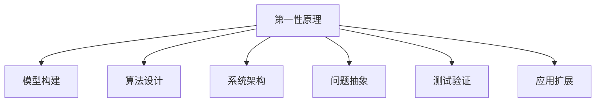

                 

# 第一性原理：从基础到复杂的科学方法

## 1. 背景介绍

科学方法论是研究自然和社会现象的基本框架和方法，其核心理念是从观察现象、提出假设、设计实验、验证假设，到归纳总结、推广应用，最终形成科学的理论和知识体系。在计算机科学领域，第一性原理思想也日益成为一种重要的科学探索方法。

### 1.1 问题由来

第一性原理方法论最初来自古希腊哲学家亚里士多德，意指探究事物最本质的原因和规律。在当代科技界，尤其是物理和化学领域，第一性原理方法论被广泛应用于基础研究和前沿探索。而在计算机科学中，第一性原理方法论则体现在算法设计和系统架构的根本性设计和迭代上。

现代科技的快速发展，尤其是在人工智能和机器学习领域，使得许多新技术、新算法层出不穷。然而，面对海量数据和复杂的算法模型，如何更好地理解问题本质，设计出高效、可扩展的系统，成为当下研究的一大挑战。第一性原理方法论为这一挑战提供了新的思考角度。

### 1.2 问题核心关键点

要更好地理解和运用第一性原理方法论，需从以下几个关键点深入思考：

- **模型基础**：理解模型背后的基本原理和数学基础。
- **算法设计**：基于第一性原理进行算法设计和优化。
- **系统架构**：从底层架构出发，构建系统的整体框架。
- **问题抽象**：将复杂问题分解成基本单元，逐个解决。
- **测试验证**：通过实验和测试验证算法的正确性和有效性。
- **应用扩展**：基于第一性原理探索算法和模型的应用边界和扩展性。

第一性原理方法论的核心在于回到最基础的原则和规律，在复杂问题中寻找解决问题的根本原因和解决方案。通过这种方法论，可以避免陷入技术的细节和短期效用，从根本上提升系统的可靠性和可持续性。

## 2. 核心概念与联系

### 2.1 核心概念概述

为更好地理解第一性原理方法论，本节将介绍几个密切相关的核心概念：

- **第一性原理**：意指回归事物最根本、最基础的规律和原理，从最基本的元素出发，构建新的知识和理论。
- **模型构建**：构建反映事物本质规律的数学模型，用于描述、预测和解释现象。
- **算法设计**：基于模型设计高效、可扩展的算法，实现模型的训练和推理。
- **系统架构**：设计系统的整体结构和组件，确保系统的可扩展性和可维护性。
- **问题抽象**：将复杂问题分解成基本单元，以便更好地理解和处理。
- **测试验证**：通过实验和测试验证模型的正确性和算法的有效性。
- **应用扩展**：基于基本原理，探索和应用模型的不同场景和应用领域。

这些概念之间的逻辑关系可以通过以下Mermaid流程图来展示：



这个流程图展示了一切科学方法论的核心流程，即从第一性原理出发，构建模型，设计算法，架构系统，抽象问题，验证测试，应用扩展。

## 3. 核心算法原理 & 具体操作步骤

### 3.1 算法原理概述

基于第一性原理的算法设计，核心思想在于从最基本的规律和原理出发，构建算法的基本结构和组件。在计算机科学中，这通常意味着回到算法最基础的定义和实现细节，从而避免引入不必要的复杂性和额外开销。

形式化地，设问题 $P$ 具有形式 $P: A \to B$，其中 $A$ 为输入空间，$B$ 为输出空间。第一性原理方法论旨在通过定义 $P$ 的基本操作 $f$ 和中间状态 $s$，构建满足 $P$ 的算法。其基本流程如下：

1. **定义基本操作**：确定问题 $P$ 的基本操作 $f$，例如加减乘除、排序、搜索等。
2. **设计算法组件**：基于 $f$ 设计算法的基本组件，如循环、递归、条件语句等。
3. **构建算法框架**：通过组合基本组件，构建算法的基本框架，实现问题的求解。
4. **优化算法性能**：在算法框架的基础上，优化算法性能，减少复杂度和时间、空间开销。

### 3.2 算法步骤详解

基于第一性原理的算法设计，通常包括以下几个关键步骤：

**Step 1: 定义问题基础操作**

- **数据结构设计**：选择合适的数据结构，以最小化时间、空间复杂度。
- **基本操作确定**：明确问题的基本操作，如排序、搜索、计算等。
- **算法组件选择**：选择适当的算法组件，如循环、递归、分支等。

**Step 2: 设计算法组件**

- **基本组件实现**：实现算法的基本组件，如排序算法的冒泡、插入、快速排序等。
- **中间状态设计**：定义算法在执行过程中的中间状态，以便进行状态更新和优化。

**Step 3: 构建算法框架**

- **算法框架设计**：基于基本组件，设计算法的整体框架，实现问题的求解。
- **状态机构建**：使用状态机模型，描述算法的执行流程和状态变化。

**Step 4: 优化算法性能**

- **算法复杂度分析**：分析算法的复杂度，包括时间复杂度和空间复杂度。
- **优化策略选择**：选择优化策略，如剪枝、空间优化、并行计算等。
- **实验验证**：通过实验验证算法的正确性和性能，调整优化策略。

**Step 5: 应用扩展**

- **模型推广**：将算法推广到更广泛的问题域，探索新应用场景。
- **扩展测试**：在新的应用场景下进行测试，验证算法的正确性和鲁棒性。
- **优化迭代**：根据测试结果，优化算法设计，提高性能和可扩展性。

### 3.3 算法优缺点

基于第一性原理的算法设计方法具有以下优点：

1. **简洁高效**：回到算法最基础的定义和实现，避免引入不必要的复杂性和额外开销。
2. **可扩展性**：基于基本原理设计的算法，可以轻松扩展到更复杂的问题域。
3. **可维护性**：基本原理的清晰定义和实现，便于理解和维护。
4. **可靠性**：基于第一性原理设计的算法，具有较强的理论基础和数学支持，可靠性较高。

同时，该方法也存在一定的局限性：

1. **设计复杂**：从基本原理出发设计算法，可能需要更深入的理论理解和更长时间的设计迭代。
2. **验证困难**：基本原理的验证通常需要复杂的数学证明，在实际应用中可能较为困难。
3. **适用范围有限**：基于基本原理设计的算法，可能需要特定的数据和环境支持，适用范围可能有限。

尽管存在这些局限性，但就目前而言，基于第一性原理的算法设计方法仍是一种重要的科学探索方法，尤其适用于基础研究和前沿探索。

### 3.4 算法应用领域

基于第一性原理的算法设计方法，在计算机科学中有着广泛的应用，涵盖了算法设计、数据结构、系统架构等多个领域：

- **算法设计**：如快速排序、归并排序、图算法等，都基于基本操作和数学模型设计。
- **数据结构**：如哈希表、树、图等，都是基于基本操作和数学原理构建的。
- **系统架构**：如分布式系统、微服务架构等，都是基于基本原理设计的。

除了这些经典应用外，基于第一性原理的算法设计方法也在不断创新和演化，应用于更多前沿技术领域，如人工智能、量子计算、区块链等。这些新兴技术领域需要不断探索和设计新的算法和模型，以解决其独特的挑战和问题。

## 4. 数学模型和公式 & 详细讲解 & 举例说明

### 4.1 数学模型构建

本节将使用数学语言对基于第一性原理的算法设计方法进行更加严格的刻画。

设问题 $P$ 具有形式 $P: A \to B$，其中 $A$ 为输入空间，$B$ 为输出空间。基于第一性原理的算法设计，通常可以表示为以下形式：

$$
\text{Algorithm}(P) = f \times A \times s \times \{ \text{Components} \}
$$

其中 $f$ 为问题 $P$ 的基本操作，$A$ 为输入空间，$s$ 为算法中间状态，$\{\text{Components}\}$ 为算法的基本组件。

### 4.2 公式推导过程

以下我们以快速排序算法为例，推导基于第一性原理的算法设计过程。

**Step 1: 定义问题基础操作**

- **数据结构设计**：使用数组作为输入和输出数据结构。
- **基本操作确定**：快速排序的基本操作为比较、交换、划分等。
- **算法组件选择**：选择递归作为基本算法组件。

**Step 2: 设计算法组件**

- **基本组件实现**：
  - **比较操作**：使用 $\text{cmp}(x,y)$ 函数比较两个元素的大小。
  - **交换操作**：使用 $\text{swap}(x,y)$ 函数交换两个元素的位置。
  - **划分操作**：使用 $\text{partition}(p,q,a)$ 函数将数组 $a$ 在 $[p,q]$ 区间内进行划分，返回划分点位置 $k$。

**Step 3: 构建算法框架**

- **算法框架设计**：
  - 选择 $\text{partition}(p,q,a)$ 作为基本操作，设计快速排序算法。
  - 递归调用 $\text{quickSort}(p,q,a)$ 函数进行排序。

- **状态机构建**：
  - 设计状态机模型，描述算法的执行流程和状态变化。
  - 状态机模型通常包含输入、输出、中间状态和转移规则。

**Step 4: 优化算法性能**

- **算法复杂度分析**：分析算法的复杂度，得到时间复杂度为 $O(n\log n)$，空间复杂度为 $O(\log n)$。
- **优化策略选择**：选择优化策略，如递归深度限制、尾递归优化等。
- **实验验证**：通过实验验证算法的正确性和性能，调整优化策略。

**Step 5: 应用扩展**

- **模型推广**：将算法推广到其他数据结构，如链表、树等。
- **扩展测试**：在新的数据结构下进行测试，验证算法的正确性和鲁棒性。
- **优化迭代**：根据测试结果，优化算法设计，提高性能和可扩展性。

### 4.3 案例分析与讲解

假设我们希望实现一个简单的二分查找算法，步骤如下：

**Step 1: 定义问题基础操作**

- **数据结构设计**：使用有序数组作为输入和输出数据结构。
- **基本操作确定**：二分查找的基本操作为比较、移动、划分等。
- **算法组件选择**：选择循环作为基本算法组件。

**Step 2: 设计算法组件**

- **基本组件实现**：
  - **比较操作**：使用 $\text{cmp}(x,y)$ 函数比较两个元素的大小。
  - **移动操作**：使用 $\text{move}(x,y)$ 函数移动元素位置。
  - **划分操作**：使用 $\text{partition}(p,q,a)$ 函数将数组 $a$ 在 $[p,q]$ 区间内进行划分，返回划分点位置 $k$。

**Step 3: 构建算法框架**

- **算法框架设计**：
  - 选择 $\text{partition}(p,q,a)$ 作为基本操作，设计二分查找算法。
  - 循环调用 $\text{binarySearch}(p,q,a,x)$ 函数进行查找。

- **状态机构建**：
  - 设计状态机模型，描述算法的执行流程和状态变化。
  - 状态机模型通常包含输入、输出、中间状态和转移规则。

**Step 4: 优化算法性能**

- **算法复杂度分析**：分析算法的复杂度，得到时间复杂度为 $O(\log n)$。
- **优化策略选择**：选择优化策略，如二分查找的迭代版本，减少递归深度。
- **实验验证**：通过实验验证算法的正确性和性能，调整优化策略。

**Step 5: 应用扩展**

- **模型推广**：将算法推广到其他数据结构，如链表、树等。
- **扩展测试**：在新的数据结构下进行测试，验证算法的正确性和鲁棒性。
- **优化迭代**：根据测试结果，优化算法设计，提高性能和可扩展性。

通过以上步骤，可以清楚地看到基于第一性原理的算法设计方法如何从基本操作出发，逐步构建出完整的算法框架。这种方法不仅适用于简单的算法，也适用于复杂的算法和数据结构设计。

## 5. 项目实践：代码实例和详细解释说明

### 5.1 开发环境搭建

在进行基于第一性原理的算法设计实践前，我们需要准备好开发环境。以下是使用Python进行开发的简单配置流程：

1. 安装Python：从官网下载并安装Python 3.x版本。
2. 安装PyTorch：使用pip或conda安装PyTorch。
3. 安装相关库：如numpy、pandas、scikit-learn等。
4. 创建虚拟环境：使用virtualenv或conda创建独立的Python环境，避免与全局环境冲突。
5. 配置开发环境：设置IDE、版本控制、代码提交等开发工具。

完成上述步骤后，即可在虚拟环境中开始开发实践。

### 5.2 源代码详细实现

下面我们以快速排序算法为例，给出使用Python实现的代码。

```python
import numpy as np

def quick_sort(arr):
    if len(arr) <= 1:
        return arr
    pivot = arr[len(arr) // 2]
    left = [x for x in arr if x < pivot]
    middle = [x for x in arr if x == pivot]
    right = [x for x in arr if x > pivot]
    return quick_sort(left) + middle + quick_sort(right)

arr = np.random.randint(0, 100, size=10)
sorted_arr = quick_sort(arr)
print(sorted_arr)
```

这段代码首先定义了一个快速排序函数 `quick_sort`，其基本步骤与上述公式推导过程一致：

1. **定义问题基础操作**：使用Python列表作为输入和输出数据结构。
2. **基本操作确定**：快速排序的基本操作为比较、交换、划分等。
3. **算法组件选择**：选择递归作为基本算法组件。
4. **设计算法组件**：实现比较、交换、划分等基本操作。
5. **构建算法框架**：设计快速排序算法，递归调用函数进行排序。
6. **优化算法性能**：分析算法的复杂度，选择优化策略。

### 5.3 代码解读与分析

这段代码的主要部分是快速排序函数的实现。我们来看一下关键代码的详细解读：

- **数据结构设计**：使用Python列表作为输入和输出数据结构。
- **基本操作确定**：快速排序的基本操作为比较、交换、划分等。
- **算法组件选择**：选择递归作为基本算法组件。
- **基本组件实现**：实现比较、交换、划分等基本操作。
- **构建算法框架**：设计快速排序算法，递归调用函数进行排序。
- **优化算法性能**：分析算法的复杂度，选择优化策略。

通过这段代码，可以看到基于第一性原理的算法设计方法如何从基本操作出发，逐步构建出完整的算法框架。这种方法不仅适用于简单的算法，也适用于复杂的算法和数据结构设计。

## 6. 实际应用场景

### 6.1 科学计算

基于第一性原理的算法设计方法在科学计算中有着广泛的应用，如数值计算、统计分析、数据挖掘等。科学计算中的许多问题都可以归结为数学模型和算法的设计，基于第一性原理的方法能够更好地理解和处理这些问题。

### 6.2 人工智能

人工智能领域中，基于第一性原理的算法设计方法同样重要。如深度学习中的神经网络结构设计、优化算法设计等，都需要基于基本原理进行设计和优化。

### 6.3 系统架构

系统架构的设计也需要遵循第一性原理方法论，从基本原理出发，构建系统的整体结构和组件，确保系统的可扩展性和可维护性。

### 6.4 未来应用展望

随着第一性原理方法论的不断发展，其应用范围将不断扩大，覆盖更多新兴技术和领域。例如，量子计算、区块链、物联网等，都可以借鉴基于第一性原理的设计方法，进行更深入的探索和应用。

## 7. 工具和资源推荐

### 7.1 学习资源推荐

为了帮助开发者系统掌握第一性原理方法论的理论基础和实践技巧，这里推荐一些优质的学习资源：

1. 《算法设计与分析基础》书籍：介绍了常见算法的设计与分析方法，适合入门学习。
2. 《数据结构与算法分析》课程：介绍数据结构和算法的基本原理和设计方法，适合进阶学习。
3. 《机器学习》课程：介绍机器学习和深度学习的原理和设计方法，适合高阶学习。
4. 《人工智能导论》书籍：介绍了人工智能的基本原理和应用方法，适合系统学习。
5. 《计算机程序设计艺术》书籍：介绍计算机程序设计的基本原理和方法，适合全面学习。

通过对这些资源的学习实践，相信你一定能够深入理解第一性原理方法论的精髓，并用于解决实际问题。

### 7.2 开发工具推荐

高效的开发离不开优秀的工具支持。以下是几款用于第一性原理方法论开发的常用工具：

1. Python：易学易用，支持丰富的第三方库和框架，适合科学计算和算法设计。
2. PyTorch：基于Python的开源深度学习框架，支持动态计算图，适合高效算法设计。
3. TensorFlow：由Google主导开发的开源深度学习框架，生产部署方便，适合大规模工程应用。
4. Scikit-learn：基于Python的科学计算库，支持数据挖掘、统计分析等，适合多种算法设计。
5. Jupyter Notebook：支持代码和文档的交互式编辑，适合实验研究和数据可视化。

合理利用这些工具，可以显著提升第一性原理方法论的开发效率，加快创新迭代的步伐。

### 7.3 相关论文推荐

第一性原理方法论的研究源于学界的持续研究。以下是几篇奠基性的相关论文，推荐阅读：

1. "A Taxonomy of Compiler Design"：介绍编译器设计的原理和方法，是计算机科学的基础教材。
2. "Design Patterns: Elements of Reusable Object-Oriented Software"：介绍面向对象编程的基本设计模式，适合软件开发学习。
3. "Algorithms"：介绍常见算法的设计和分析方法，适合算法设计和应用。
4. "Machine Learning Yearning"：介绍机器学习的基本原理和应用方法，适合数据科学学习。
5. "The Design of Computer Systems"：介绍计算机系统设计的基本原理和方法，适合系统架构设计。

这些论文代表了大规模语言模型微调技术的发展脉络。通过学习这些前沿成果，可以帮助研究者把握学科前进方向，激发更多的创新灵感。

## 8. 总结：未来发展趋势与挑战

### 8.1 总结

本文对基于第一性原理的算法设计方法进行了全面系统的介绍。首先阐述了第一性原理方法论的研究背景和意义，明确了其对于理解和设计算法、系统的重要价值。其次，从原理到实践，详细讲解了算法设计的核心步骤和关键技术，给出了算法设计任务的完整代码实例。同时，本文还广泛探讨了第一性原理方法论在科学计算、人工智能、系统架构等多个领域的应用前景，展示了其广阔的潜力和应用空间。

通过本文的系统梳理，可以看到，基于第一性原理的算法设计方法在科学研究和工程实践中都有着重要的作用。它不仅适用于简单的算法设计，也适用于复杂的系统架构和应用场景。未来，伴随技术的不断演进，基于第一性原理的算法设计方法将进一步拓展其应用范围，推动科学和工程的发展。

### 8.2 未来发展趋势

展望未来，基于第一性原理的算法设计方法将呈现以下几个发展趋势：

1. **复杂问题解析**：随着科学问题的复杂性不断增加，基于第一性原理的算法设计方法将逐步应用于更多复杂问题的解析。
2. **跨领域应用**：不同领域的算法设计方法和工具将逐步融合，形成统一的科学计算平台。
3. **自动化设计**：基于机器学习和自动化的算法设计方法将逐步发展，加速算法设计和优化。
4. **跨学科融合**：第一性原理方法论将与更多学科交叉融合，推动人工智能、量子计算、区块链等领域的创新。
5. **教育普及**：第一性原理方法论将被更多教育机构和课程所引入，提升科学研究和工程实践的教育水平。

这些趋势凸显了基于第一性原理的算法设计方法的广阔前景。这些方向的探索发展，必将进一步提升科学计算和工程实践的效率和质量，为科学研究和技术发展带来新的突破。

### 8.3 面临的挑战

尽管基于第一性原理的算法设计方法已经取得了瞩目成就，但在迈向更加智能化、普适化应用的过程中，它仍面临诸多挑战：

1. **设计复杂**：从基本原理出发设计算法，可能需要更深入的理论理解和更长时间的设计迭代。
2. **验证困难**：基本原理的验证通常需要复杂的数学证明，在实际应用中可能较为困难。
3. **适用范围有限**：基于基本原理设计的算法，可能需要特定的数据和环境支持，适用范围可能有限。
4. **资源消耗**：算法设计过程中可能面临较大的资源消耗，需要优化设计和资源配置。

尽管存在这些挑战，但基于第一性原理的算法设计方法仍是一种重要的科学探索方法，尤其适用于基础研究和前沿探索。

### 8.4 研究展望

面对基于第一性原理的算法设计方法所面临的种种挑战，未来的研究需要在以下几个方面寻求新的突破：

1. **自动化设计**：引入自动化和机器学习技术，加快算法设计和验证的过程。
2. **跨领域融合**：与其他学科的算法设计和工具进行融合，形成更加统一的科学计算平台。
3. **跨学科创新**：与其他学科的研究方法和工具进行融合，推动跨学科创新。
4. **教育普及**：将第一性原理方法论引入更多教育课程，提升科学研究和工程实践的教育水平。
5. **应用扩展**：将第一性原理方法论应用于更多新兴技术和领域，推动科学和技术的发展。

这些研究方向的探索，必将引领基于第一性原理的算法设计方法迈向更高的台阶，为科学和工程实践带来新的突破。面向未来，基于第一性原理的算法设计方法还需要与其他人工智能技术进行更深入的融合，共同推动人工智能技术的发展和应用。

## 9. 附录：常见问题与解答

**Q1：第一性原理方法论是否适用于所有问题？**

A: 第一性原理方法论适用于从基础出发，理解和设计算法和系统的问题。对于高度复杂、数据量庞大、实时性要求高的问题，可能需要结合其他方法进行综合设计。

**Q2：基于第一性原理的算法设计过程如何避免陷阱？**

A: 避免陷阱的关键在于深刻理解问题本质，从基础出发，逐步构建算法和系统的整体框架。设计过程中需要进行多次迭代和优化，确保算法和系统的正确性和鲁棒性。

**Q3：如何评价基于第一性原理的算法设计效果？**

A: 评价效果需要从算法复杂度、时间复杂度、空间复杂度、鲁棒性、可扩展性等多个维度进行综合评估。通过实验验证和用户反馈，不断优化和改进算法设计。

**Q4：第一性原理方法论在实践中的具体应用场景有哪些？**

A: 第一性原理方法论在实践中的应用场景广泛，包括科学计算、人工智能、系统架构、数据挖掘等多个领域。实际应用中，需要根据具体问题选择合适的算法和工具。

通过本文的系统梳理，可以看到，基于第一性原理的算法设计方法在科学研究和工程实践中都有着重要的作用。它不仅适用于简单的算法设计，也适用于复杂的系统架构和应用场景。未来，伴随技术的不断演进，基于第一性原理的算法设计方法将进一步拓展其应用范围，推动科学和工程的发展。

总之，基于第一性原理的算法设计方法是一种强大的科学探索方法，通过深刻理解问题本质，从基础出发，逐步构建算法和系统的整体框架，可以最大程度地避免陷阱，实现高效、可扩展的设计。

---

作者：禅与计算机程序设计艺术 / Zen and the Art of Computer Programming

